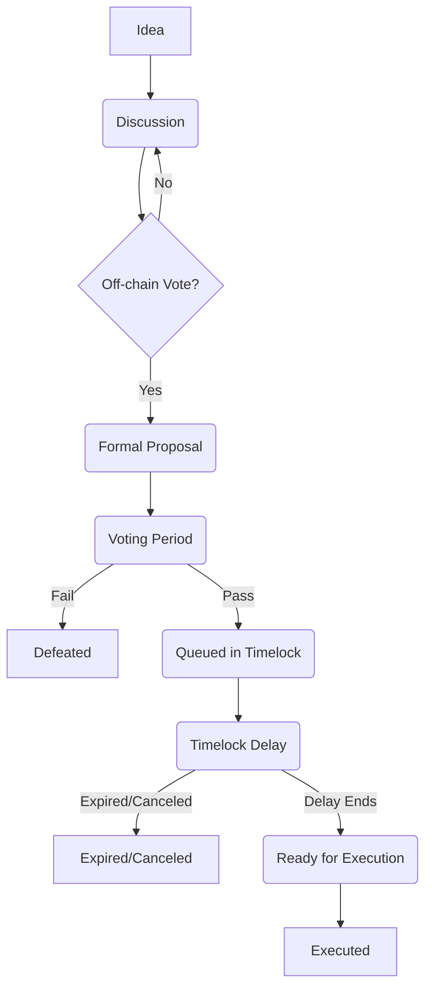

大家好，我是你们的老朋友qmwneb946，一个对技术和数学痴迷的博主。今天，我们将深入探讨一个Web3世界中最具革命性，也最具挑战性的概念之一：去中心化自治组织（DAO）的治理。

Web3的宏大愿景，是构建一个更加开放、去中心化和用户主导的互联网。在这个愿景的核心，DAO扮演着至关重要的角色。它们承诺打破传统层级森严的组织结构，实现真正的社区自治和集体决策。然而，将数百万、甚至数十亿的资产交由一个无中心实体的“集体”来管理，这绝非易事。它引出了一个根本性的问题：在一个没有中央权威、没有明确领导者的群体中，我们如何有效地做出决策？如何分配资源？如何解决冲突？

这，就是DAO治理的核心挑战。它不仅仅是技术问题，更是社会学、经济学、博弈论乃至政治哲学在数字世界中的映射。今天，我们将一起揭开DAO治理的神秘面纱，从其基本构成、常见的治理模型，到面临的挑战与未来方向，进行一次全方位的技术与思想的深度探索。准备好了吗？让我们开始这场知识的旅程！

## 一、DAO的基石：理解去中心化自治组织

在深入探讨治理之前，我们有必要简要回顾一下DAO的本质。

**去中心化自治组织（DAO）**，顾名思思义，是一种通过区块链技术和智能合约构建的组织形式。它摆脱了传统公司或机构的层级管理模式，其决策流程和运营规则被编码在公开透明、不可篡改的智能合约中。这意味着，DAO的运行不依赖于任何中央权威，而是由其成员通过共识机制进行治理。

### DAO的关键特征

1.  **去中心化（Decentralized）：** 没有单一的控制点。决策权和执行权分散在所有或大部分参与者手中。
2.  **自治（Autonomous）：** 一旦智能合约部署在区块链上，它们将按照预设规则自动执行，无需人工干预。这使得DAO能够自主运行，并在特定条件下自动触发行动。
3.  **透明（Transparent）：** 所有交易、投票记录和规则都公开记录在区块链上，可供任何人查阅和审计。
4.  **不可篡改（Immutable）：** 智能合约一旦部署，其核心逻辑通常无法轻易更改，确保了规则的稳定性。任何修改都需要通过预设的治理流程。
5.  **社区驱动（Community-Driven）：** DAO的成员，通常是治理代币的持有者，共同拥有决策权，并积极参与组织的建设和发展。

### DAO与传统组织的对比

| 特征     | 传统组织                      | 去中心化自治组织（DAO）                 |
| :------- | :---------------------------- | :-------------------------------------- |
| **结构** | 垂直层级、自上而下            | 扁平、网络化、自下而上                |
| **决策** | 高管、董事会决定              | 社区投票、智能合约执行                  |
| **规则** | 成文法、规章制度、人为解释      | 智能合约代码、链上可验证                |
| **透明度** | 有限、公司内部信息            | 极高、所有活动链上可见                  |
| **信任** | 依赖人与机构（律师、审计师）     | 依赖代码与数学（区块链共识、密码学）     |
| **参与** | 雇员、股东（有限参与）          | 代币持有者、社区成员（高度参与）        |
| **修改** | 董事会决议、法律修订          | 链上治理投票、智能合约升级              |

正是由于这些根本性的差异，DAO的治理问题显得尤为复杂和重要。没有了老板、董事会或CEO，谁来做决定？如何确保这些决定是公平、高效且符合社区最大利益的？

## 二、去中心化协调的核心挑战

在一个去中心化的环境中，最大的难题是如何在没有中心权威的情况下进行有效的协调和决策。这不仅仅是技术问题，更是一种群体行为的博弈。

### 1. “结构化暴政”与“多数人暴政”

在没有明确结构或领导的情况下，群体容易陷入“结构化暴政” (Tyranny of Structurelessness) 的困境。这意味着表面上的无结构，反而可能导致少数非官方精英或“内部圈子”的形成，他们以非透明的方式行使权力。在DAO中，这可能表现为少数拥有大量代币的“巨鲸”或早期贡献者，在没有正式头衔的情况下，通过私下沟通或操纵舆论来影响决策。

另一方面，DAO的链上投票机制也可能导致**“多数人暴政”** (Tyranny of the Majority)。当一小部分拥有多数投票权的群体能够随意通过对自身有利的提案，而忽视甚至损害少数派的利益时，这与民主的初衷背道而驰。如何保护少数派权益，确保决策的广泛代表性，是DAO治理的永恒命题。

### 2. 女巫攻击（Sybil Attack）的威胁

女巫攻击是指一个攻击者创建多个假身份（或地址）来获得不成比例的投票权，从而操纵投票结果。在“一币一票”的简单治理模型中，如果攻击者能够廉价地获得大量代币并分散到多个地址，或者控制大量身份，就可能成功发动攻击。对抗女巫攻击，是所有基于投票的去中心化系统的核心安全考量。

### 3. 巨鲸问题（Whale Problem）与投票权集中

在许多基于治理代币的DAO中，投票权与代币持有量直接挂钩。这意味着持有大量代币的个人或实体（即“巨鲸”）拥有压倒性的投票影响力。他们可能会为了自身利益而非整个社区的利益进行投票，甚至可能通过在交易所临时购买大量代币来影响关键投票，投票结束后再出售。这导致了事实上的中心化，与DAO去中心化的初衷相悖。

### 4. 投票冷漠与参与度不足

与传统民主选举类似，DAO治理也面临**投票冷漠** (Voter Apathy) 或**参与度不足**的问题。复杂的提案、高昂的链上交易费用、对技术理解的要求以及缺乏直接的投票激励，都可能导致绝大多数代币持有者不参与投票。如果只有少数人参与，即使他们不是巨鲸，也可能导致决策的代表性不足。

### 5. 信息不对称与专业知识鸿沟

DAO的提案往往涉及复杂的经济模型、技术升级或法律问题。普通代币持有者可能缺乏足够的时间、专业知识或信息来完全理解每个提案的深层含义和潜在风险。这可能导致他们投票基于不完整的信息，或盲目跟随“意见领袖”，甚至被误导性信息所影响。如何确保信息透明、可理解，并鼓励专业知识的贡献，是提升决策质量的关键。

这些挑战构成了DAO治理的复杂图景。为了应对这些问题，DAO社区和开发者们正在不断探索和实验各种治理模型与技术机制。

## 三、DAO治理的基础元素

在深入各种治理模型之前，我们首先需要理解构成DAO治理体系的几个核心组件。

### 1. 治理代币（Governance Tokens）与投票权

治理代币是DAO治理的基石。它们通常是符合ERC-20标准的同质化代币，赋予持有者在DAO中提案和投票的权利。最简单的模型是**“一币一票”** (1 token = 1 vote)，即你的投票权重直接与你持有的治理代币数量成正比。

**为何使用治理代币？**

*   **所有权与激励对齐：** 代币持有者对DAO的成功有经济上的利害关系。DAO价值增长，代币价值也可能随之增长，从而激励持有者做出有利于DAO长期发展的决策。
*   **抗女巫攻击：** 相比于“一人一票”系统可能面临的身份验证难题，代币作为一种经济资源，获取有成本，这在一定程度上提高了女巫攻击的门槛。
*   **链上可验证：** 代币持有量和投票记录都公开透明地记录在区块链上，易于审计和验证。

然而，“一币一票”也带来了前文所述的“巨鲸问题”。为了缓解这个问题，出现了一些变体，例如：

*   **投票托管代币（Vote-Escrowed Tokens / ve-tokens）：** 用户将代币锁定一段时间，以获得更多的投票权。锁定时间越长，投票权越大。这种机制（如Curve Finance的veCRV模型）旨在激励长期持有者和承诺参与治理的用户，降低“闪电贷攻击”和短期操纵的风险。
*   **投票权快照：** 许多DAO会在特定区块高度对代币持有量进行快照，以此确定每个地址的投票权重，而不是实时查询余额。这有助于确保在投票期间投票权不会频繁变动，并简化链下投票的实现。

### 2. 链上治理（On-chain Governance）与链下治理（Off-chain Governance）

这是DAO治理中一个重要的二分法，决定了决策的执行方式。

#### **链上治理**

*   **定义：** 治理流程（提案创建、投票、执行）全部或大部分通过智能合约在区块链上完成。一旦提案通过，智能合约会自动执行相应的操作（例如，更新协议参数，分配资金，升级合约等）。
*   **优点：**
    *   **信任最小化：** 执行是自动化和无需信任的，消除了人为干预的风险。
    *   **透明和不可篡改：** 所有投票记录和执行结果都在区块链上永久保存。
    *   **高安全性：** 智能合约的执行保证了规则的严格遵守。
*   **缺点：**
    *   **成本高昂：** 每次链上操作（提案、投票）都需要支付Gas费，对于大量小额投票尤其不划算。
    *   **灵活性差：** 智能合约一旦部署，修改复杂且风险高。
    *   **速度慢：** 链上投票和执行通常需要较长的时间周期（提案期、投票期、时间锁延迟期）。
    *   **技术门槛：** 编写和审计复杂的治理合约需要高水平的技术专业知识。
*   **示例：** MakerDAO、Compound、Uniswap等大型DAO的关键决策通常采用链上治理。

#### **链下治理**

*   **定义：** 提案讨论和投票过程在链下进行，例如通过论坛、社交媒体或专门的投票平台（如Snapshot）。投票结果不直接触发智能合约执行，而需要由多签钱包或其他链上实体手动或半自动地执行。
*   **优点：**
    *   **成本低廉：** 无需支付Gas费，投票成本几乎为零。
    *   **灵活性高：** 讨论和投票过程可以更灵活地调整。
    *   **速度快：** 投票周期可以缩短。
    *   **用户友好：** 许多链下投票工具（如Snapshot）提供了直观的用户界面。
*   **缺点：**
    *   **信任依赖：** 投票结果的执行依赖于链下实体（例如，核心团队的多签成员）的诚信，存在中心化风险。
    *   **非绑定性：** 投票结果在技术上不具备强制执行力，只是一种“意向性”的社区信号。
    *   **女巫攻击风险：** 如果链下投票不与链上代币关联，可能更容易受到女巫攻击。
*   **示例：** 许多DAO使用Snapshot进行初期提案的“温度检查”或非关键性决策投票。

#### **混合治理**

实际上，大多数DAO采用**混合治理**模型。例如，使用Snapshot进行初步的、无Gas费的链下投票以 gauge 社区意愿，如果提案获得足够支持，再将其提交到链上进行正式的、有约束力的投票和执行。这种模式结合了两者的优点，平衡了效率、成本和去中心化程度。

### 3. 提案生命周期

一个典型的DAO治理提案会经历以下阶段：

1.  **想法萌芽（Idea Generation）：** 社区成员在论坛、Discord、Telegram等平台提出初始想法。
2.  **非正式讨论（Informal Discussion）：** 想法经过社区成员的初步讨论、反馈和完善。
3.  **提案起草（Proposal Drafting）：** 有意愿的成员将想法转化为正式的提案文本，通常包括背景、目标、具体操作、预期结果和所需资源等。
4.  **温度检查/链下投票（Temperature Check / Off-chain Vote）：** 在Snapshot等平台进行一次非正式投票，以评估社区对提案的普遍支持程度。这有助于避免不必要的链上Gas费和时间消耗。
5.  **正式链上提案（Formal On-chain Proposal）：** 如果链下投票获得足够支持，提案人（通常需要持有一定数量的治理代币）将提案提交到链上治理合约。这通常会启动一个投票期。
6.  **投票期（Voting Period）：** 代币持有者在规定时间内通过链上交易进行投票。
7.  **投票结果（Vote Tally）：** 投票期结束后，智能合约或链下工具统计投票结果。
8.  **时间锁（Timelock）：** 如果提案通过，它通常不会立即执行，而是进入一个“时间锁”期。这是一个强制性的等待期，给予社区成员足够的时间来审查通过的提案，并在发现问题时采取紧急行动（例如，通过另一个提案来取消或修改）。
9.  **执行（Execution）：** 时间锁期结束后，提案的执行权限被授予，通常由多签钱包的成员或任何成员调用执行函数来触发智能合约操作。

理解这些基础元素，是我们进一步探讨各种治理模型的前提。

## 四、常见的DAO治理模型与机制

为了应对去中心化协调的挑战，DAO社区发展出了多种治理模型和辅助机制。

### 1. 直接民主（Direct Democracy / 1 Token = 1 Vote）

这是最简单直观的治理模型，即“一币一票”。每个治理代币都代表一票投票权，提案获得多数票即可通过。

*   **优点：** 简单易懂，理论上最能直接反映代币持有者的意愿。
*   **缺点：**
    *   **巨鲸问题突出：** 少数大户可以轻易操控投票结果。
    *   **投票冷漠：** 大多数小户缺乏投票的动力和专业知识。
    *   **效率低下：** 所有提案都需要所有人的直接参与。
*   **适用场景：** 小型DAO或早期DAO，或仅用于非常简单的决策。大型DAO很少仅依赖这种模型。

### 2. 代表民主/委托投票（Delegate / Representative Democracy）

为了解决直接民主的投票冷漠和专业知识鸿沟问题，许多大型DAO（如Compound, Uniswap, Aave）采用了委托投票机制。

*   **概念：** 代币持有者不必亲自参与每个提案的投票，而是可以将他们的投票权委托给一个他们信任的“代表”（Delegate）。这个代表可以是个人、团队或另一个DAO。代表会积极参与治理讨论，并代表其委托者的投票权进行投票。
*   **优点：**
    *   **提高投票参与率：** 即使不亲自投票，也可以通过委托表达意愿。
    *   **引入专业知识：** 经验丰富、了解协议细节的代表可以做出更明智的决策。
    *   **提高效率：** 决策由少数活跃代表做出，而非全体成员。
    *   **降低Gas成本：** 普通用户只需进行一次委托操作，无需为每次投票支付Gas。
*   **缺点：**
    *   **中心化风险：** 权力可能集中在少数知名代表手中，形成“寡头政治”。
    *   **代表责任问题：** 如何激励代表尽责，并惩罚不作为或作恶的代表？
    *   **委托关系维护：** 委托者需要持续关注代表的表现，并可能需要更换代表。
*   **实现方式（Solidity伪代码示例）：**
    许多DAO的治理代币都集成了OpenZeppelin的`ERC20Votes`标准，它支持委托功能。

    ```solidity
    // 假设这是一个治理代币合约，继承了ERC20和ERC20Votes
    contract MyGovernanceToken is ERC20, ERC20Votes {
        constructor() ERC20("My DAO Token", "MDT") ERC20Votes("My DAO Token") {
            // 铸造初始代币
            _mint(msg.sender, 1000000 * 10**decimals());
        }

        // 覆盖ERC20的transfer和transferFrom，以更新投票权
        // 这是ERC20Votes自动处理的，确保投票权跟随代币转移
        // function _update(address from, address to, uint256 amount) internal override {
        //     super._update(from, to, amount);
        // }

        // 用户可以通过此函数将他们的投票权委托给另一个地址
        // delegatee 是被委托的地址
        function delegate(address delegatee) public override {
            _delegate(msg.sender, delegatee);
        }

        // 获取特定地址在某一区块的投票权
        function getVotes(address account) public view override returns (uint256) {
            return super.getVotes(account);
        }

        // 获取特定地址在历史某一区块的投票权快照
        function getPastVotes(address account, uint256 blockNumber) public view override returns (uint256) {
            return super.getPastVotes(account, blockNumber);
        }
    }
    ```
    在治理合约中，当提案投票时，会查询 `Governor` 合约中集成的 `ERC20Votes` 代币合约的 `getVotes(address account)` 或 `getPastVotes(address account, blockNumber)` 函数来获取用户的实际投票权（包括其委托的票数）。

### 3. 二次方投票（Quadratic Voting）

二次方投票旨在解决“巨鲸问题”和提升决策的公平性，让少数人的强烈偏好也能得到体现。

*   **概念：** 投票的成本不是线性的，而是与投票数呈二次方关系。这意味着你想要投更多的票，每增加一票的成本会更高。
*   **数学原理：** 如果你想要投 $V$ 票，你所需要支付的成本 $C$ 是 $V^2$。
    对于一个提案，如果有多个选项，某个选项的总支持度不是简单相加，而是每个投票人投票数的平方根之和的平方。
    例如，投票人A投了1票（成本1），投票人B投了2票（成本4），投票人C投了3票（成本9）。
    总投票成本 = $1^2 + 2^2 + 3^2 = 1 + 4 + 9 = 14$。
    总投票强度 = $( \sqrt{1} + \sqrt{2} + \sqrt{3} )^2 \approx (1 + 1.414 + 1.732)^2 \approx (4.146)^2 \approx 17.19$。
    这与传统投票（总投票 = 1+2+3 = 6）形成了鲜明对比。二次方投票使得拥有大量资金的“巨鲸”购买更多投票的成本呈指数级上升，从而降低了他们对投票结果的支配力。
*   **优点：**
    *   **削弱巨鲸影响力：** 降低了拥有大量代币的地址的支配力。
    *   **捕获偏好强度：** 鼓励更多人参与，并能够更好地表达他们对特定议题的偏好强度。
    *   **更公平：** 使得少数人的强烈意愿也能被听到。
*   **缺点：**
    *   **复杂性：** 实施和理解比简单投票复杂得多。
    *   **女巫攻击风险：** 如果没有有效的身份验证机制（如Proof of Personhood），攻击者可以通过创建多个身份来规避二次方成本。
    *   **成本计算：** 在链上实时计算每个人的投票成本和总票数可能非常复杂和昂贵。通常需要链下计算或结合零知识证明。
*   **适用场景：** 适用于需要更公平、更细致地衡量社区偏好的场景，例如公共物品资助（Gitcoin Grants）或更复杂的DAO决策。

### 4. 预测市场（Prediction Markets / Futarchy）

**预测市场**是一种利用市场机制来预测未来事件结果的平台。而在DAO治理中，**Futarchy**（Future + Anarchy）是一种利用预测市场进行决策的治理模型。

*   **概念：** 与直接投票“我们应该做什么”不同，Futarchy 让投票者关注“什么能够实现我们的目标”。它将决策分为两部分：
    1.  **公投（Referendum）：** 社区投票决定一个可衡量、可验证的目标（例如，“我们希望DAO代币价格上涨20%”）。
    2.  **市场（Market）：** 针对提案，创建两个预测市场：
        *   市场A：如果提案X通过，目标Y会实现吗？
        *   市场B：如果提案X不通过，目标Y会实现吗？
    最终，如果“如果提案X通过，目标Y会实现”的市场价格高于“如果提案X不通过，目标Y会实现”的市场价格，则提案X将被通过并执行。
*   **优点：**
    *   **基于证据的决策：** 鼓励理性决策，而不是情感或政治立场。
    *   **利用集体智慧：** 市场价格能够聚合大量个体的信息和判断。
    *   **激励对齐：** 参与预测市场的交易者通过准确预测获得收益，从而激励他们获取并利用真实信息。
*   **缺点：**
    *   **复杂性高：** 部署和运行预测市场机制非常复杂。
    *   **预言机问题：** 如何准确、去中心化地获取和验证“目标Y是否实现”的数据？
    *   **市场操纵：** 大型参与者可能试图操纵预测市场以影响决策。
    *   **目标量化：** 并非所有DAO决策都能被清晰地量化为可预测的市场目标。
*   **适用场景：** 仍在实验阶段，但对于需要高度依赖数据和量化结果的特定决策（如协议参数调整、资金分配）具有潜力。

### 5. 多重签名钱包（Multi-signature Wallets / Multi-sigs）

多签钱包本身不是一个完整的治理模型，但它是在DAO中执行决策和管理资金的关键安全机制。

*   **概念：** 一个多签钱包需要预设的N个地址中的M个（例如，3个中的2个，或7个中的5个）签名才能执行交易。
*   **在DAO中的作用：**
    *   **资金管理：** DAO的财务（如国库、投资）通常由多签钱包控制，以防止单点故障和内部盗窃。
    *   **提案执行：** 链下治理投票通过的提案，最终需要多签成员手动执行。链上治理中的时间锁结束后，执行者角色通常也是一个多签地址。
    *   **紧急响应：** 在协议出现紧急漏洞时，多签钱包可以作为快速响应的机制（但需要权衡中心化风险）。
*   **优点：**
    *   **增强安全性：** 分散了控制权，降低了单点攻击的风险。
    *   **增加信任：** 社区对资金和关键操作的安全性更有信心。
*   **缺点：**
    *   **速度慢：** 需要多方协调签名，紧急情况下可能不够及时。
    *   **中心化风险：** 如果多签成员数量过少，或者成员之间串通，仍然可能导致中心化。
*   **示例：** Gnosis Safe是广泛使用的多签钱包解决方案。

### 6. 治理最小化（Governance Minimization）

这是一种新兴的哲学，认为最好的治理是尽可能少的治理。

*   **概念：** 协议设计时就尽可能地自动化，并通过智能合约实现不可更改的规则。减少人为干预和投票的必要性。
*   **优点：** 减少了治理攻击面，提高了协议的抗审查性，降低了治理的复杂性。
*   **缺点：** 缺乏灵活性，难以应对突发事件或需要升级的情况。

### 7. 声誉系统与灵魂绑定代币（Reputation Systems & Soulbound Tokens, SBTs）

为了解决女巫攻击和“一币一票”的缺陷，一些DAO正在探索基于声誉的治理，而SBTs提供了实现这一目标的新途径。

*   **概念：** 投票权或决策影响力不再仅仅基于代币数量，而是基于一个人在DAO中的历史贡献、参与度、专业技能和社区认可。**灵魂绑定代币（SBTs）** 是一种不可转让的NFT，可以代表一个人的身份、成就、证书或声誉。
*   **在治理中的潜力：**
    *   **抗女巫攻击：** 如果声誉与经过验证的真实身份或不可伪造的贡献挂钩，可以有效对抗Sybil攻击。
    *   **提升决策质量：** 允许对特定领域有专业知识的人拥有更大的影响力。
    *   **激励贡献：** 鼓励长期参与和有价值的贡献，因为这些会累积声誉和影响力。
    *   **非金融投票权：** 投票权不再完全与财富挂钩，有助于实现更平等的治理。
*   **优点：** 更公平、更抗女巫、更注重专业性。
*   **缺点：**
    *   **声誉量化与度量：** 如何公平、准确地量化和分配声誉？
    *   **“捕鲸”风险：** 拥有大量声誉的个体是否会形成新的中心化权力？
    *   **隐私问题：** 将身份与链上活动绑定可能引发隐私担忧。
    *   **技术复杂性：** 实现基于声誉的治理系统非常复杂。
*   **示例：** Snapshot的“投票策略”允许开发者定义自定义的投票权重计算逻辑，可能包括基于SBT或其他声誉指标的权重。一些协议如Proof of Humanity尝试通过社交验证来建立“一人一票”的身份。

这些治理模型和机制并非相互排斥，许多DAO会根据自身的需求和发展阶段，组合使用它们，形成一套独特的治理体系。

## 五、DAO治理面临的挑战与陷阱

尽管DAO治理创新不断，但其仍处于早期阶段，面临诸多现实挑战。

### 1. 投票冷漠与参与度不足（Voter Apathy & Low Participation）

这是普遍存在的问题。DAO成员为何不投票？
*   **缺乏激励：** 除非提案直接影响到其经济利益，否则参与投票的成本（时间、精力、Gas费）可能远超收益。
*   **提案复杂性：** 许多提案需要深厚的专业知识才能理解。
*   **信息过载：** 缺乏有效的机制来筛选和总结大量提案信息。
*   **心理距离：** 缺乏强烈的归属感和责任感。
**解决方案：** 委托投票、简化治理流程和界面、提供易于理解的提案摘要、探索非金融激励。

### 2. 巨鲸问题与权力集中（Whale Problem & Centralization of Power）

这是“一币一票”模型的固有缺陷。大量代币集中在少数地址手中，导致少数人可以主导决策。
*   **闪电贷攻击：** 攻击者可能通过闪电贷临时借入大量治理代币，在短时间内通过恶意提案，然后归还代币。
**解决方案：** 二次方投票、投票托管代币（ve-tokens）、委托投票、设立最小提案门槛、**时间锁**。时间锁是防止闪电贷攻击的关键防御机制，它确保即使提案通过，也需要等待一段时间才能执行，给社区留出发现并响应恶意行为的时间。

### 3. 女巫攻击（Sybil Attack）

攻击者创建多个假身份或地址来伪造支持率，影响投票结果。
**解决方案：** 身份验证机制（如Proof of Personhood）、灵魂绑定代币（SBTs）结合声誉系统、要求质押一定代币才能提案或投票。

### 4. 治理攻击（Governance Attacks）

除了闪电贷，还包括：
*   **恶意提案：** 伪装成有益提案，但实际上包含恶意代码或损害协议利益。
*   **贿赂选民：** 某些项目尝试通过“投票贿赂”来影响治理结果，这可能导致决策偏离社区利益。
**解决方案：** 严格的提案审核流程、时间锁、社区警惕性、专业的安全审计。

### 5. 信息不对称与专业知识鸿沟

并非所有代币持有者都拥有相同的信息或专业知识。
**解决方案：** 建立透明的沟通渠道（论坛、Discord）、举办线上研讨会解释复杂提案、鼓励专业人士贡献分析报告、设立研究员或教育者角色并给予激励。

### 6. 法律与监管不确定性

DAO的法律地位模糊。它们是公司？合伙企业？还是其他类型的实体？
*   **责任问题：** 谁对DAO的行动负责？多签成员？所有代币持有者？
*   **税务问题：** DAO的收入如何纳税？成员的收益如何纳税？
*   **证券认定：** 治理代币是否会被监管机构认定为证券？
**解决方案：** 探索法律包装（如LLC、基金会）、积极与监管机构沟通、合规性框架的构建。目前，如A16z等风投基金就在积极推动DAO的法律框架建设。

### 7. 技术复杂性与安全风险

治理合约的复杂性增加了bug和漏洞的风险。一个关键的漏洞可能导致DAO资金被盗或协议被恶意控制。
**解决方案：** 严格的代码审计、形式化验证、渐进式去中心化（逐步将控制权从核心团队移交至社区）、设置紧急暂停开关（但需权衡中心化）。

### 8. “公地悲剧”与协调困境

在没有明确激励或惩罚机制的情况下，集体行动往往会面临免费搭车和责任分散的问题，导致公共资源被过度消耗或利用不足。
**解决方案：** 引入贡献者激励机制、建立清晰的贡献者路径、声誉系统、小团队自治（Pods）模式。

## 六、展望未来：DAO治理的演进方向

DAO治理的旅程才刚刚开始，我们正在见证一场大规模的社会和技术实验。未来，DAO治理可能会朝着以下方向演进：

### 1. 更复杂的投票机制与混合模型

*   **多维度投票：** 结合代币权重、声誉、参与度、专业领域等多个维度来计算投票影响力。
*   **分层治理：** 将DAO内部的决策划分为不同层级，例如，核心协议升级采用链上投票+时间锁，日常运营采用多签，社区活动采用链下投票。
*   **流动性民主：** 结合委托和直接投票的优点，允许用户在需要时撤回委托进行直接投票。

### 2. AI辅助治理与自动化

*   **提案摘要与分析：** AI可以帮助社区成员快速理解复杂提案，甚至分析其潜在影响和风险。
*   **异常检测：** 监测链上治理活动，识别潜在的恶意行为或市场操纵。
*   **决策支持系统：** 为代表或核心贡献者提供数据驱动的决策辅助。
*   **自动化任务：** 某些低风险、高频的任务可能完全由AI驱动的智能合约自动化执行，进一步实现“自治”。

### 3. 增强的声誉系统与非金融投票权

随着SBTs等非转让代币技术的发展，DAO可能会更多地依赖声誉、贡献和身份来分配投票权，而不是仅仅依赖代币数量。这将有助于建立更加公平、抗女巫和专业的治理体系。

### 4. 互操作性与元治理（Interoperability & Meta-Governance）

*   **跨链治理：** 随着多链生态的发展，如何实现跨不同区块链的DAO治理？
*   **DAO之间的协作：** 一个DAO如何参与另一个DAO的治理，或者多个DAO如何联合进行决策？这将形成一个复杂的“DAO联盟”或“元治理”层。

### 5. 法律包装与混合结构

为了在去中心化和法律合规之间找到平衡，未来可能会出现更多DAO与传统法律实体（如基金会、LLC）结合的“混合结构”。这将为DAO提供法律保障，同时保留其核心的去中心化精神。

### 6. 更好的用户体验与社区工具

降低参与门槛，提供更直观、易用的治理界面和讨论工具。这将有助于提高投票参与率和社区活跃度。

### 7. 人文因素的持续重要性

即使技术再先进，DAO的成功最终仍取决于其社区成员的积极参与、有效沟通和解决冲突的能力。建立强大的社区文化、透明的沟通渠道、以及鼓励健康辩论的环境，将永远是DAO治理的核心。

## 七、技术深潜：核心机制与合约实现

作为技术博主，我们不能止步于概念。让我们来深入一些核心机制在智能合约层面的实现思路。

### 1. 治理代币与投票权快照 (`ERC20Votes`)

许多DAO的治理代币都基于OpenZeppelin的`ERC20Votes`标准。这个标准扩展了`ERC20`代币，使其具备了追踪投票权的功能。

其核心功能包括：
*   **`delegate(address delegatee)`:** 允许用户将他们的投票权委托给另一个地址。一旦委托，当被委托人投票时，会加上委托人的投票权。
*   **`getVotes(address account)`:** 返回当前 `account` 的投票权总额（包括其自身持有的和被委托的票数）。
*   **`getPastVotes(address account, uint256 blockNumber)`:** 返回 `account` 在指定 `blockNumber` 时的投票权快照。这是至关重要的，因为提案通常会指定一个快照区块，确保在投票期间投票权不会因代币转移而频繁变动。

**内部实现简述：**
`ERC20Votes`通过在代币转移时更新`_checkpoints`映射来记录每个地址在不同区块的投票权变化。当调用`getPastVotes`时，它会查找指定区块号最近的快照点来计算投票权。

### 2. 治理合约基本结构 (`Governor` Pattern)

OpenZeppelin的`Governor`合约是实现链上治理的流行模式。它定义了提案的生命周期、投票逻辑和执行机制。

一个简化的`Governor`合约通常包括：

*   **状态变量：**
    *   `state(uint256 proposalId)`: 获取提案的当前状态（`Pending`, `Active`, `Canceled`, `Defeated`, `Succeeded`, `Queued`, `Expired`, `Executed`）。
    *   `proposalThreshold()`: 提交提案所需的最小投票权。
    *   `votingPeriod()`: 投票持续的区块数量。
    *   `quorum()`: 提案通过所需的最小支持票数（通常是总投票权的一个百分比）。
*   **核心函数：**
    *   `propose(address[] targets, uint256[] values, bytes[] calldatas, string description)`: 提交一个新提案。`targets`, `values`, `calldatas` 定义了提案成功后要执行的链上操作（例如，调用目标合约的某个函数）。`description` 是提案的文本描述。
    *   `castVote(uint256 proposalId, uint8 support, string reason)`: 投票。`support` 表示赞成、反对或弃权。
    *   `queue(uint256 proposalId)`: 如果提案通过，将其排队等待执行。这通常会将提案发送到一个**时间锁合约**。
    *   `execute(uint256 proposalId)`: 在时间锁期结束后，执行提案。
    *   `cancel(uint256 proposalId)`: 在某些条件下（例如，提案者撤回，或被另一个提案否决），取消提案。

**提案状态流转（示意）：**



### 3. 时间锁合约 (`TimelockController`)

时间锁合约是治理系统的重要安全组件。它充当一个“保管员”，所有由治理通过的、会修改协议状态的关键操作，都不会立即执行，而是首先发送到时间锁合约。

*   **核心思想：** 为任何重大决策的执行引入一个强制性延迟 (`minDelay`)。
*   **作用：**
    *   **防止闪电贷攻击：** 攻击者即使通过闪电贷获得了控制权，也无法立即执行恶意操作。社区有时间发现攻击并采取反制措施（如通过另一个提案取消恶意提案）。
    *   **提供用户审查时间：** 用户有足够的时间来审查通过的提案，并在发现问题时撤销代币或采取其他行动。
*   **主要功能：**
    *   `queue(address target, uint256 value, bytes payload, bytes32 predecessor, bytes32 salt, uint256 delay)`: 将一个交易（即通过的提案的执行指令）排队。
    *   `execute(address target, uint256 value, bytes payload, bytes32 predecessor, bytes32 salt)`: 在 `delay` 结束后执行排队中的交易。
    *   `cancel(bytes32 id)`: 取消一个已排队的交易。

通常，`Governor`合约会被设置为`TimelockController`的`PROPOSER`角色，而`TimelockController`本身会成为DAO关键合约的`OWNER`或`ADMIN`。这样，所有的修改都必须经过`Governor`的投票，并通过`TimelockController`的延迟才能执行。

### 4. 链上投票流程（简化伪代码示例）

以下是一个概念性的Solidity合约结构，展示了如何将治理代币、治理合约和时间锁合约连接起来。

```solidity
// MyGovernanceToken.sol (基于ERC20Votes)
// 继承ERC20和ERC20Votes，实现投票权委托和快照功能
// ... 参见上面ERC20Votes的伪代码 ...

// MyGovernor.sol (治理合约)
import "@openzeppelin/contracts/governance/Governor.sol";
import "@openzeppelin/contracts/governance/TimelockController.sol";

contract MyGovernor is Governor {
    MyGovernanceToken public immutable token;
    TimelockController public immutable timelock;

    // 构造函数：初始化治理代币地址和时间锁地址
    constructor(MyGovernanceToken _token, TimelockController _timelock)
        Governor("MyGovernor") // 治理合约名称
    {
        token = _token;
        timelock = _timelock;
    }

    // 规定提案通过所需的投票权百分比 (例如，总投票权的4%)
    // 通常通过一个函数或变量来动态设置
    function quorum(uint256 blockNumber) public view override returns (uint256) {
        // 假设总投票权为 1,000,000 token，需要 4% 也就是 40,000 票
        return (token.totalSupply() * 4) / 100;
    }

    // 提案通过后，需要多少投票期（按区块数）
    function votingPeriod() public view override returns (uint256) {
        return 1000; // 假设投票期为 1000 个区块
    }

    // 提交提案所需的最小投票权 (例如，1000票)
    function proposalThreshold() public view override returns (uint256) {
        return 1000;
    }

    // 返回治理代币合约地址
    function token() public view override returns (IVotes) {
        return token;
    }

    // 返回时间锁合约地址，用于提案执行
    function timelock() public view override returns (ITimelock) {
        return timelock;
    }

    // 覆写Governor的_execute函数，确保通过时间锁执行
    function _execute(
        uint256 proposalId,
        address[] memory targets,
        uint256[] memory values,
        bytes[] memory calldatas,
        bytes32 descriptionHash
    ) internal override(Governor) {
        timelock.executeBatch(targets, values, calldatas, 0, descriptionHash);
    }
}

// MyTimelock.sol (时间锁合约)
// 通常继承OpenZeppelin的TimelockController
// ... 参见OpenZeppelin TimelockController 文档 ...
// 关键在于设置 minDelay (最小延迟时间) 和 PROPOSER/EXECUTOR 角色。
// MyGovernor合约将被设置为PROPOSER，允许其将提案排队到时间锁。
// 任何地址都可以是EXECUTOR，一旦延迟时间结束，可以调用执行函数。
```

### 5. 二次方投票的数学与实现挑战

如前所述，二次方投票的成本是票数的平方 ($C = V^2$)。这在链上直接实现投票可能非常昂贵，因为每次投票都需要计算，并且需要对所有投票人的累计平方根进行求和。

**挑战：**
*   **计算复杂性：** 链上数学运算开销大，尤其是浮点数和求平方根。
*   **Gas成本：** 每次投票的Gas费会非常高。
*   **女巫攻击：** 如果没有有效的去中心化身份解决方案，攻击者可以简单地创建大量地址，每个地址只投一票，从而绕过二次方成本。

**解决方案思路：**
*   **链下计算 + 链上验证：** 投票在链下进行，然后使用零知识证明（如zk-SNARKs）将计算结果压缩成一个简洁的证明在链上验证。这可以大大降低链上成本。
*   **身份验证层：** 结合Proof of Personhood（PoP）机制，确保每个投票者是独一无二的真实个体。
*   **混合模型：** 二次方投票可能更适用于分配公共物品资金（如Gitcoin Grants），而不是所有DAO的日常治理决策。

这些技术细节展示了DAO治理的复杂性和其对区块链技术深层理解的要求。每一项设计都包含了对效率、安全、去中心化和公平的权衡。

## 八、结语：一场正在进行的伟大实验

去中心化自治组织（DAO）的治理，是Web3领域中最引人入胜、也最具挑战性的议题之一。它不仅仅关乎技术代码，更是一场关于人类如何在大规模、去中心化的环境中进行有效协作、分配权力和做出集体决策的社会实验。

从最初简单的“一币一票”，到如今复杂的委托投票、二次方投票、预测市场，以及与声誉系统和灵魂绑定代币的结合，DAO治理模型正在快速演进，试图解决巨鲸问题、投票冷漠、女巫攻击和中心化风险等固有的挑战。时间锁、多重签名等机制为安全性提供了保障，而链上与链下混合治理则在效率与去中心化之间寻求平衡。

然而，我们必须清醒地认识到，DAO治理仍处于非常早期的阶段。没有“一刀切”的完美解决方案，每个DAO都需要根据其特定的目标、社区规模和文化来定制和迭代其治理框架。未来的道路上，我们还将面临更多的技术难题、法律模糊性以及人性的挑战。

作为技术爱好者，我们有幸身处这场史无前例的社会技术实验之中。理解DAO治理的复杂性、权衡其优缺点，并积极参与到其发展中，将是我们共同的责任与乐趣。这场旅程充满未知，但也孕育着巨大的潜力：构建一个更加公平、透明、高效和真正由社区驱动的数字未来。

感谢大家阅读这篇深入探讨DAO治理的文章。如果你有任何问题或想分享你的看法，欢迎在评论区留言。我是qmwneb946，我们下期再见！