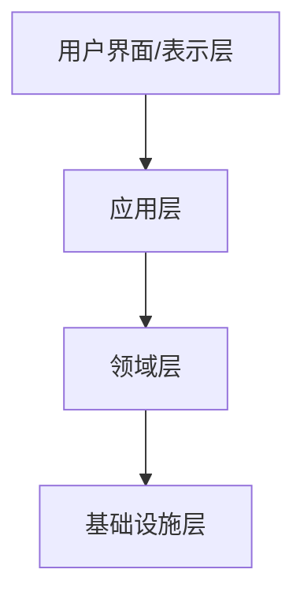
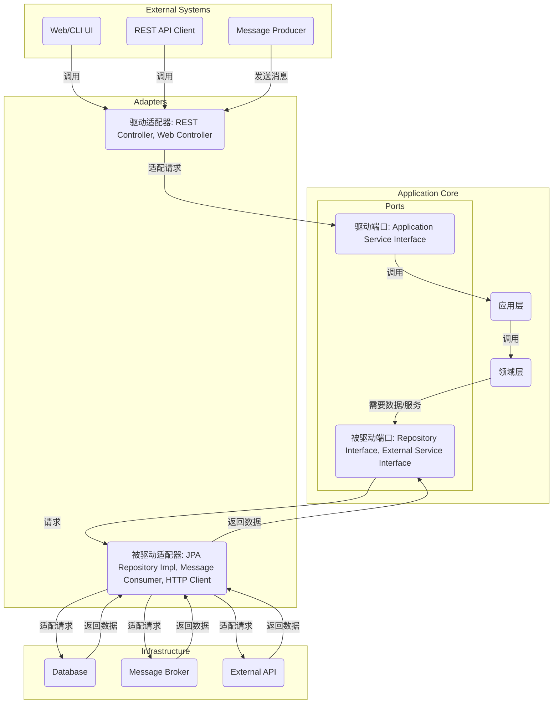

你好，技术爱好者们！我是 qmwneb946，一名热爱技术和数学的博主。今天，我们将一同踏上一段深度探索之旅，去剖析一个在复杂软件开发领域至关重要的理念——领域驱动设计（Domain-Driven Design，简称 DDD）。

在当今瞬息万变的商业环境中，软件系统变得日益庞大和复杂。我们常常发现自己陷入这样的困境：代码库臃肿难以维护，业务逻辑与技术实现混杂不清，开发团队与业务团队沟通不畅，导致产品无法精准捕捉市场需求。DDD 正是为了解决这些痛点而生。它不仅仅是一种架构模式，更是一种思维方式、一套方法论，旨在帮助我们构建能够反映真实业务世界、易于理解和演进的软件系统。

埃里克·埃文斯（Eric Evans）在其里程碑式的著作《领域驱动设计：软件核心复杂性应对之道》中首次系统阐述了 DDD。他强调，软件开发的核心挑战在于应对领域的复杂性，而成功的关键在于深入理解领域知识，并将其清晰地映射到软件模型中。

本文将带领你从 DDD 的核心思想出发，逐步深入其战略模式和战术模式，探讨如何将其应用于实际项目，包括与现代微服务架构的结合，以及在实践中可能遇到的挑战和误区。最后，我们将通过一个具体的案例来巩固所学。无论你是资深架构师、开发人员，还是对软件设计充满好奇的技术爱好者，相信本文都能为你提供宝贵的洞察和实践指导。

准备好了吗？让我们开始这段旅程！

## 1. 领域驱动设计核心思想回顾

在深入实践之前，我们有必要回顾一下 DDD 的核心概念。它们是理解并成功应用 DDD 的基石。

### 1.1 复杂性与领域核心

软件项目的复杂性主要来源于两个方面：技术复杂性和业务复杂性。技术复杂性可以通过选择合适的技术栈、良好的编码实践来管理，但业务复杂性往往是更难应对的。业务规则错综复杂，不同业务人员对同一概念的理解可能存在偏差，需求频繁变更。DDD 认为，软件的价值体现在对业务核心（Domain Core）的精准建模上。它鼓励开发者将精力集中在理解和实现那些为业务带来独特竞争优势的核心业务逻辑上，而不是被技术细节所困扰。

DDD 的核心理念可以用一句话概括：**将复杂领域模型转化为清晰、内聚、可演进的软件模型。**

### 1.2 通用语言（Ubiquitous Language）

通用语言是 DDD 最具革命性的概念之一。它指的是开发团队、业务专家、产品经理等所有项目涉众在讨论业务和软件系统时，使用一套统一、明确、无歧义的词汇和概念。

**为什么通用语言如此重要？**
*   **消除沟通障碍：** 业务人员不再需要将他们的需求“翻译”成技术术语，开发人员也不需要猜测业务的真实意图。
*   **确保模型一致性：** 软件模型中的类、方法、变量名称直接来源于通用语言，确保了代码与业务现实的一致性。
*   **降低理解成本：** 当新成员加入团队时，他们可以更快地理解业务和代码。

**实践通用语言：**
*   在每次需求讨论、建模会议中强制使用通用语言。
*   将通用语言中的关键术语记录下来，形成一个词汇表。
*   代码中的命名（类名、方法名、变量名）必须严格遵循通用语言。

例如，在电商领域，我们可能需要明确“订单”、“商品”、“库存”、“SKU”、“支付”、“发货”等术语的精确含义。一个业务人员说的“订单”与系统中的 `Order` 对象应该是一一对应的。

### 1.3 领域（Domain）

在 DDD 中，“领域”特指一个特定的业务领域或业务范围。例如，一个大型企业可能有“销售领域”、“财务领域”、“人力资源领域”等。领域是所有业务逻辑和规则的集合。

### 1.4 限界上下文（Bounded Context）

限界上下文是 DDD 战略模式中最核心的概念，也是应对复杂性的关键。它定义了一个显式的边界，在此边界之内，特定模型具有其一致的含义。通用语言只在某个限界上下文内部保持一致。一旦超出这个边界，同一个术语可能具有不同的含义。

**为什么需要限界上下文？**
在一个大型系统中，试图构建一个单一的、大一统的领域模型是不现实的，也是不健康的。例如，在电商平台中，“商品”在“库存管理上下文”中可能关注其数量、位置；在“销售上下文”中可能关注其价格、描述；在“物流上下文”中可能关注其重量、体积。如果强行把所有这些概念揉到一个“商品”实体中，会导致模型臃肿、职责不清。

限界上下文通过物理或逻辑的方式将大型领域划分为更小、更易于管理的块。每个限界上下文拥有自己的领域模型、通用语言和团队。这种划分有助于：
*   **降低复杂性：** 每个上下文内部的复杂性得到控制。
*   **实现解耦：** 上下文之间通过明确的接口进行交互，降低了耦合度。
*   **独立演进：** 各个上下文可以独立开发、测试和部署。

**如何识别限界上下文？**
*   **通用语言的差异：** 当同一个词在不同语境下有不同含义时，可能预示着不同的限界上下文。
*   **团队组织结构：** 不同的业务团队或职能部门通常对应不同的业务领域，可能是限界上下文的边界。
*   **业务功能的内聚性：** 高度相关的功能和数据应该被封装在一个限界上下文内。

### 1.5 上下文映射（Context Map）

上下文映射是可视化限界上下文之间关系的工具。它展示了不同限界上下文之间的协作方式、依赖关系以及通信协议。上下文映射帮助团队理解整个系统的结构，并识别潜在的集成风险。

常见的上下文关系类型：
*   **客户/供应商（Customer/Supplier）：** 上游上下文（供应商）为下游上下文（客户）提供服务或数据。客户是供应商的消费者。
*   **遵奉者（Conformist）：** 客户上下文选择直接使用供应商上下文的通用语言和模型，而不会试图去适配或转换。这意味着客户必须接受供应商的模型，即使不完全匹配自身需求。
*   **防腐层（Anti-Corruption Layer，ACL）：** 当一个限界上下文需要与另一个不兼容的遗留系统或外部系统集成时，为了保护自身领域模型不受污染，可以在两者之间建立一个防腐层。ACL 负责将外部模型的概念转换为内部模型的概念，反之亦然。
*   **共享内核（Shared Kernel）：** 两个或多个限界上下文共享一部分通用的代码和模型。这部分代码被视为所有相关团队的共同财产，任何修改都需要所有团队达成一致。
*   **发布语言（Published Language）：** 一个上下文显式地发布其领域模型的一部分作为公共接口或文档，供其他上下文消费。通常与开放主机服务结合使用。
*   **开放主机服务（Open Host Service）：** 提供一个明确的协议（如 RESTful API 或消息格式），允许其他上下文通过这个协议访问其服务。
*   **分离之道（Separate Ways）：** 两个上下文之间没有直接的集成需求，或者集成成本太高，所以选择不进行集成。

上下文映射可以帮助我们更好地进行系统拆分和集成设计，尤其是在微服务架构中，它变得尤为重要。

## 2. 战术模式：构建领域模型

战略模式关注的是宏观架构和系统拆分，而战术模式则深入到如何在一个限界上下文内部构建高质量的领域模型。这些模式帮助我们将通用语言转化为具体的代码结构。

### 2.1 值对象（Value Object）

值对象是 DDD 中一个非常重要的概念。它表示一个只由其属性值定义的、不可变的概念，没有唯一标识。当构成值对象的属性值全部相等时，两个值对象就被认为是相等的。

**特点：**
*   **无唯一标识：** 值对象通过属性值而非 ID 来识别。
*   **不可变性（Immutable）：** 一旦创建，其属性值就不能被修改。如果需要修改，就创建一个新的值对象来替代旧的。
*   **概念整体：** 它将一组相关的属性封装成一个有意义的整体。

**应用场景：**
*   金钱（Money）：金额和货币单位。
*   地址（Address）：街道、城市、邮编等。
*   日期范围（DateRange）：起始日期和结束日期。
*   颜色（Color）：RGB 值。

**代码示例（Java）：**

```java
public class Money {
    private final BigDecimal amount;
    private final String currency;

    public Money(BigDecimal amount, String currency) {
        if (amount == null || currency == null) {
            throw new IllegalArgumentException("Amount and currency cannot be null");
        }
        if (amount.compareTo(BigDecimal.ZERO) < 0) {
            throw new IllegalArgumentException("Amount cannot be negative");
        }
        this.amount = amount;
        this.currency = currency;
    }

    public BigDecimal getAmount() {
        return amount;
    }

    public String getCurrency() {
        return currency;
    }

    public Money add(Money other) {
        if (!this.currency.equals(other.currency)) {
            throw new IllegalArgumentException("Cannot add money with different currencies");
        }
        return new Money(this.amount.add(other.amount), this.currency);
    }

    // 覆盖 equals 和 hashCode 方法以支持值相等性
    @Override
    public boolean equals(Object o) {
        if (this == o) return true;
        if (o == null || getClass() != o.getClass()) return false;
        Money money = (Money) o;
        return amount.equals(money.amount) && currency.equals(money.currency);
    }

    @Override
    public int hashCode() {
        return Objects.hash(amount, currency);
    }

    @Override
    public String toString() {
        return amount + " " + currency;
    }
}
```

### 2.2 实体（Entity）

实体是具有唯一标识和生命周期的对象。它的身份不取决于其属性值，即使属性值改变，实体仍然是同一个实体。实体通常包含业务逻辑和状态。

**特点：**
*   **唯一标识（Identity）：** 通过一个 ID 来识别，即使所有属性都相同，只要 ID 不同，就是不同的实体。
*   **可变性（Mutable）：** 实体可以随着时间推移改变其状态。
*   **生命周期：** 实体有创建、更新和销毁的过程。

**应用场景：**
*   用户（User）
*   订单（Order）
*   商品（Product）
*   账户（Account）

**代码示例（Java）：**

```java
public class Customer {
    private final CustomerId id; // 唯一标识，通常也是一个值对象
    private String name;
    private EmailAddress email; // 邮箱地址也可以是值对象
    private Address shippingAddress; // 地址也是值对象

    public Customer(CustomerId id, String name, EmailAddress email, Address shippingAddress) {
        if (id == null || name == null || email == null) {
            throw new IllegalArgumentException("Customer ID, name, and email cannot be null");
        }
        this.id = id;
        this.name = name;
        this.email = email;
        this.shippingAddress = shippingAddress;
    }

    // 业务行为方法
    public void updateName(String newName) {
        if (newName == null || newName.trim().isEmpty()) {
            throw new IllegalArgumentException("Customer name cannot be empty");
        }
        this.name = newName;
    }

    public void changeShippingAddress(Address newAddress) {
        if (newAddress == null) {
            throw new IllegalArgumentException("New address cannot be null");
        }
        this.shippingAddress = newAddress;
    }

    // Getters
    public CustomerId getId() {
        return id;
    }

    public String getName() {
        return name;
    }

    public EmailAddress getEmail() {
        return email;
    }

    public Address getShippingAddress() {
        return shippingAddress;
    }

    // 实体通常只根据 ID 判断相等性
    @Override
    public boolean equals(Object o) {
        if (this == o) return true;
        if (o == null || getClass() != o.getClass()) return false;
        Customer customer = (Customer) o;
        return id.equals(customer.id);
    }

    @Override
    public int hashCode() {
        return Objects.hash(id);
    }
}
```

### 2.3 聚合（Aggregate）

聚合是 DDD 中用于封装业务复杂性和维护数据一致性的关键战术模式。它定义了一个数据和行为的边界，在这个边界内部，多于一个实体或值对象被视为一个逻辑上的整体。每个聚合有一个聚合根（Aggregate Root），它是聚合中唯一的实体，负责维护聚合内部的一致性。

**特点：**
*   **一致性边界：** 聚合内的所有对象必须作为一个整体来维护业务规则和不变量。事务应该只提交一个聚合的更改。
*   **聚合根：** 聚合根是外部对象与聚合内部对象交互的唯一入口。外部对象不能直接引用聚合内部的其他实体或值对象，只能通过聚合根来访问。
*   **事务原子性：** 对聚合的修改应该在单个事务中完成，以确保聚合内部的业务规则和不变量始终得到满足。

**设计原则：**
*   **小聚合：** 聚合应尽可能小，只包含必要的部分。大的聚合会增加并发冲突的可能性和性能开销。
*   **只通过 ID 引用其他聚合：** 聚合之间不应直接持有对方的引用，而应通过 ID 进行引用。这有助于降低耦合，允许聚合独立加载。
*   **边界清晰：** 明确聚合的边界和聚合根的职责。

**代码示例（Java - 订单聚合）：**

一个 `Order` 聚合可能包含 `Order` 实体（聚合根）和 `OrderItem` 值对象集合。

```java
import java.math.BigDecimal;
import java.time.LocalDateTime;
import java.util.*;

// OrderId 也是一个值对象
public class OrderId {
    private final String value;
    public OrderId(String value) { this.value = value; }
    public String getValue() { return value; }
    @Override public boolean equals(Object o) { /* ... */ return true; }
    @Override public int hashCode() { /* ... */ return 0; }
}

// OrderStatus 枚举
public enum OrderStatus {
    PENDING, PLACED, PAID, SHIPPED, DELIVERED, CANCELED
}

// OrderItem 是一个值对象
public class OrderItem {
    private final String productId;
    private final int quantity;
    private final BigDecimal price;

    public OrderItem(String productId, int quantity, BigDecimal price) {
        if (quantity <= 0 || price.compareTo(BigDecimal.ZERO) < 0) {
            throw new IllegalArgumentException("Invalid quantity or price");
        }
        this.productId = productId;
        this.quantity = quantity;
        this.price = price;
    }

    public String getProductId() { return productId; }
    public int getQuantity() { return quantity; }
    public BigDecimal getPrice() { return price; }
    public BigDecimal getTotal() { return price.multiply(new BigDecimal(quantity)); }

    @Override
    public boolean equals(Object o) {
        if (this == o) return true;
        if (o == null || getClass() != o.getClass()) return false;
        OrderItem orderItem = (OrderItem) o;
        return quantity == orderItem.quantity && productId.equals(orderItem.productId) && price.equals(orderItem.price);
    }

    @Override
    public int hashCode() {
        return Objects.hash(productId, quantity, price);
    }
}

// Order 聚合根
public class Order {
    private final OrderId id; // 聚合根的唯一标识
    private CustomerId customerId; // 引用 Customer 聚合的 ID
    private LocalDateTime orderDate;
    private OrderStatus status;
    private final List<OrderItem> items; // 聚合内部的值对象集合

    public Order(OrderId id, CustomerId customerId, LocalDateTime orderDate, List<OrderItem> items) {
        if (id == null || customerId == null || orderDate == null || items == null || items.isEmpty()) {
            throw new IllegalArgumentException("Order creation parameters cannot be null or empty.");
        }
        this.id = id;
        this.customerId = customerId;
        this.orderDate = orderDate;
        this.status = OrderStatus.PENDING; // 初始状态
        this.items = new ArrayList<>(items); // 防御性复制
        validateOrderItems(); // 确保聚合创建时的一致性
    }

    // 业务方法：添加商品
    public void addItem(OrderItem newItem) {
        if (status != OrderStatus.PENDING) {
            throw new IllegalStateException("Cannot add item to an order that is not in PENDING status.");
        }
        this.items.add(newItem);
        validateOrderItems(); // 每次修改后验证聚合一致性
    }

    // 业务方法：取消订单
    public void cancel() {
        if (status == OrderStatus.SHIPPED || status == OrderStatus.DELIVERED) {
            throw new IllegalStateException("Cannot cancel an order that has been shipped or delivered.");
        }
        this.status = OrderStatus.CANCELED;
        // 可以发布 OrderCancelledEvent
    }

    // 业务方法：支付订单
    public void pay() {
        if (status != OrderStatus.PENDING) {
            throw new IllegalStateException("Order can only be paid when in PENDING status.");
        }
        this.status = OrderStatus.PAID;
        // 可以发布 OrderPaidEvent
    }

    // 聚合内部的不变条件验证
    private void validateOrderItems() {
        if (this.items.isEmpty()) {
            throw new IllegalArgumentException("Order must contain at least one item.");
        }
        // 可以添加更多业务规则，例如：
        // - 检查商品库存（如果库存信息在当前聚合边界内）
        // - 检查商品价格是否有效
        // - 检查重复商品项
    }

    public BigDecimal calculateTotalAmount() {
        return items.stream()
                .map(OrderItem::getTotal)
                .reduce(BigDecimal.ZERO, BigDecimal::add);
    }

    // Getters...
    public OrderId getId() { return id; }
    public CustomerId getCustomerId() { return customerId; }
    public LocalDateTime getOrderDate() { return orderDate; }
    public OrderStatus getStatus() { return status; }
    public List<OrderItem> getItems() { return Collections.unmodifiableList(items); } // 返回不可修改的列表
}
```

### 2.4 领域服务（Domain Service）

领域服务是无状态的操作，它封装了不属于任何实体或值对象的业务逻辑。当一个业务操作涉及多个实体或聚合，或者需要协调其他领域对象完成某个复杂的业务流程时，就应该考虑使用领域服务。

**特点：**
*   **无状态：** 不维护任何状态。
*   **纯粹的业务逻辑：** 不包含基础设施层（如数据库访问）或应用层（如事务管理）的逻辑。
*   **协调者：** 协调多个领域对象完成复杂任务。
*   **以通用语言命名：** 其名称应反映业务操作。

**应用场景：**
*   账户转账：涉及两个 `Account` 聚合的修改。
*   订单支付：可能涉及 `Order` 聚合和 `Payment` 聚合的协调。
*   商品库存检查和锁定：可能涉及 `Order` 聚合和 `ProductInventory` 聚合的协调。

**代码示例（Java）：**

```java
// 假设有 PaymentGatewayService 接口，由基础设施层实现
public interface PaymentGatewayService {
    boolean processPayment(Money amount, CustomerId customerId, OrderId orderId);
}

// 领域服务：OrderPaymentService
public class OrderPaymentService {
    private final PaymentGatewayService paymentGateway;
    private final OrderRepository orderRepository; // 仓储，用于加载和保存 Order 聚合

    public OrderPaymentService(PaymentGatewayService paymentGateway, OrderRepository orderRepository) {
        this.paymentGateway = paymentGateway;
        this.orderRepository = orderRepository;
    }

    // 业务操作：支付订单
    public boolean processOrderPayment(OrderId orderId) {
        Order order = orderRepository.findById(orderId)
                .orElseThrow(() -> new IllegalArgumentException("Order not found: " + orderId.getValue()));

        if (order.getStatus() != OrderStatus.PENDING) {
            throw new IllegalStateException("Order is not in PENDING status. Current status: " + order.getStatus());
        }

        Money totalAmount = new Money(order.calculateTotalAmount(), "CNY"); // 假设货币是CNY
        boolean paymentSuccess = paymentGateway.processPayment(totalAmount, order.getCustomerId(), order.getId());

        if (paymentSuccess) {
            order.pay(); // 调用聚合根的业务方法改变状态
            orderRepository.save(order); // 持久化状态变更
            // 此时可以发布 OrderPaidEvent 事件
            return true;
        } else {
            // 处理支付失败逻辑
            return false;
        }
    }
}
```

### 2.5 领域事件（Domain Event）

领域事件表示领域中发生的“某件重要的事情”。它是一种异步、解耦的通信机制，用于通知其他限界上下文或当前上下文的其他部分，某个重要状态已经发生改变。

**特点：**
*   **不可变：** 事件一旦发生就不能改变。
*   **原子性：** 事件封装了某一时刻发生的业务事实。
*   **解耦：** 事件发布者不关心谁订阅了事件，也不关心订阅者如何处理。

**应用场景：**
*   订单创建（`OrderCreatedEvent`）：通知库存服务扣减库存，通知支付服务等待支付。
*   商品库存不足（`ProductOutOfStockEvent`）：通知采购部门补货，通知用户商品缺货。
*   用户注册（`UserRegisteredEvent`）：通知营销服务发送欢迎邮件。

**代码示例（Java）：**

首先定义一个领域事件接口和抽象基类：

```java
// 领域事件接口
public interface DomainEvent {
    LocalDateTime occurredOn();
    String eventId();
}

// 领域事件抽象基类
public abstract class BaseDomainEvent implements DomainEvent {
    private final LocalDateTime occurredOn;
    private final String eventId;

    protected BaseDomainEvent() {
        this.occurredOn = LocalDateTime.now();
        this.eventId = UUID.randomUUID().toString();
    }

    @Override
    public LocalDateTime occurredOn() {
        return occurredOn;
    }

    @Override
    public String eventId() {
        return eventId;
    }
}

// 具体的领域事件：订单已支付
public class OrderPaidEvent extends BaseDomainEvent {
    private final OrderId orderId;
    private final CustomerId customerId;
    private final BigDecimal totalAmount;

    public OrderPaidEvent(OrderId orderId, CustomerId customerId, BigDecimal totalAmount) {
        this.orderId = orderId;
        this.customerId = customerId;
        this.totalAmount = totalAmount;
    }

    public OrderId getOrderId() { return orderId; }
    public CustomerId getCustomerId() { return customerId; }
    public BigDecimal getTotalAmount() { return totalAmount; }

    @Override
    public String toString() {
        return "OrderPaidEvent{" +
               "orderId=" + orderId.getValue() +
               ", customerId=" + customerId.getValue() +
               ", totalAmount=" + totalAmount +
               ", occurredOn=" + occurredOn() +
               '}';
    }
}
```

在聚合根或领域服务中发布事件：

```java
// ... 在 Order.java 的 pay() 方法中 ...
public void pay() {
    if (status != OrderStatus.PENDING) {
        throw new IllegalStateException("Order can only be paid when in PENDING status.");
    }
    this.status = OrderStatus.PAID;
    // 发布领域事件
    DomainEventPublisher.getInstance().publish(new OrderPaidEvent(this.id, this.customerId, this.calculateTotalAmount()));
}

// 简化的事件发布者（实际项目中可能更复杂，例如使用消息队列）
public class DomainEventPublisher {
    private static final DomainEventPublisher INSTANCE = new DomainEventPublisher();
    private final List<DomainEventSubscriber> subscribers = new ArrayList<>();

    private DomainEventPublisher() {}

    public static DomainEventPublisher getInstance() {
        return INSTANCE;
    }

    public void subscribe(DomainEventSubscriber subscriber) {
        subscribers.add(subscriber);
    }

    public void publish(DomainEvent event) {
        for (DomainEventSubscriber subscriber : subscribers) {
            // 异步处理或基于事件类型分发
            new Thread(() -> subscriber.handle(event)).start(); // 简单异步处理
        }
    }
}

public interface DomainEventSubscriber<T extends DomainEvent> {
    void handle(T event);
    boolean supports(DomainEvent event); // 判断是否支持该事件类型
}

// 示例订阅者：库存服务监听 OrderPaidEvent
public class InventoryServiceSubscriber implements DomainEventSubscriber<OrderPaidEvent> {
    private final InventoryRepository inventoryRepository; // 假设有库存仓储

    public InventoryServiceSubscriber(InventoryRepository inventoryRepository) {
        this.inventoryRepository = inventoryRepository;
    }

    @Override
    public void handle(OrderPaidEvent event) {
        System.out.println("Inventory Service received OrderPaidEvent: " + event);
        // 根据 OrderId 获取订单项，更新库存等
        // 这里只是一个示意，实际业务逻辑会更复杂，可能需要从 OrderRepository 加载 Order 详情
        // 或者事件本身就包含所有必要信息
        // 例如：inventoryRepository.deductStock(event.getProductId(), event.getQuantity());
    }

    @Override
    public boolean supports(DomainEvent event) {
        return event instanceof OrderPaidEvent;
    }
}
```

### 2.6 仓储（Repository）

仓储是 DDD 中的一种重要抽象，它将领域模型与数据持久化机制解耦。仓储提供了一个集合式的接口，用于存储、检索和管理聚合根对象。领域层通过仓储接口与基础设施层进行交互，而无需关心底层数据库的细节。

**特点：**
*   **面向聚合根：** 仓储操作的对象永远是聚合根。不能直接操作聚合内部的实体或值对象。
*   **接口定义在领域层：** 仓储的接口定义在领域层，确保领域模型不依赖于持久化技术。
*   **实现由基础设施层提供：** 具体的持久化实现（如 JPA、MyBatis、MongoDB）在基础设施层。
*   **提供查询方法：** 通常提供 `findById()`, `save()`, `remove()` 等方法，以及一些业务相关的查询。

**代码示例（Java）：**

```java
// 仓储接口，定义在领域层
public interface OrderRepository {
    Optional<Order> findById(OrderId id);
    void save(Order order); // 保存或更新聚合
    void remove(Order order); // 删除聚合
    // 更多查询方法，例如：
    // List<Order> findByCustomerId(CustomerId customerId);
    // List<Order> findByStatus(OrderStatus status);
}

// 仓储实现，定义在基础设施层（以Spring Data JPA为例）
@Repository
public class JpaOrderRepository implements OrderRepository {
    private final OrderJpaDao orderJpaDao; // 假设这是一个 Spring Data JPA Dao

    public JpaOrderRepository(OrderJpaDao orderJpaDao) {
        this.orderJpaDao = orderJpaDao;
    }

    @Override
    public Optional<Order> findById(OrderId id) {
        // 将 JPA entity 转换为领域模型
        return orderJpaDao.findById(id.getValue())
                          .map(this::toDomainOrder);
    }

    @Override
    public void save(Order order) {
        // 将领域模型转换为 JPA entity 并保存
        orderJpaDao.save(toJpaOrder(order));
    }

    @Override
    public void remove(Order order) {
        orderJpaDao.delete(toJpaOrder(order));
    }

    // 辅助方法：将领域模型转换为 JPA Entity
    private OrderJpaEntity toJpaOrder(Order domainOrder) {
        // ... 映射逻辑 ...
        OrderJpaEntity entity = new OrderJpaEntity();
        entity.setId(domainOrder.getId().getValue());
        entity.setCustomerId(domainOrder.getCustomerId().getValue());
        entity.setOrderDate(domainOrder.getOrderDate());
        entity.setStatus(domainOrder.getStatus().name());
        entity.setItems(domainOrder.getItems().stream()
                .map(item -> new OrderItemJpaEmbeddable(item.getProductId(), item.getQuantity(), item.getPrice()))
                .collect(Collectors.toList()));
        return entity;
    }

    // 辅助方法：将 JPA Entity 转换为领域模型
    private Order toDomainOrder(OrderJpaEntity jpaEntity) {
        // ... 映射逻辑 ...
        return new Order(
                new OrderId(jpaEntity.getId()),
                new CustomerId(jpaEntity.getCustomerId()),
                jpaEntity.getOrderDate(),
                jpaEntity.getItems().stream()
                        .map(item -> new OrderItem(item.getProductId(), item.getQuantity(), item.getPrice()))
                        .collect(Collectors.toList())
        );
    }
}
```

### 2.7 工厂（Factory）

当创建复杂对象或聚合时，如果构造函数过于复杂或需要封装创建逻辑，可以使用工厂模式。工厂可以是一个静态方法、一个独立的类或接口，其职责是确保创建的对象处于有效状态。

**应用场景：**
*   创建聚合根及其内部对象。
*   当对象的创建过程需要依赖其他服务或数据源时。
*   隐藏对象的内部实现细节。

**代码示例（Java）：**

```java
public class OrderFactory {
    // 创建一个新订单的工厂方法
    public static Order createNewOrder(CustomerId customerId, List<OrderItem> items) {
        // 生成唯一的订单ID
        OrderId orderId = new OrderId(UUID.randomUUID().toString());
        LocalDateTime now = LocalDateTime.now();

        // 可以在这里执行一些创建前的业务验证或默认值设置
        if (items == null || items.isEmpty()) {
            throw new IllegalArgumentException("Order must have items.");
        }
        // ... 其他验证 ...

        return new Order(orderId, customerId, now, items);
    }

    // 可以有根据数据库数据重建订单的工厂方法
    public static Order reconstructOrder(OrderId id, CustomerId customerId, LocalDateTime orderDate, OrderStatus status, List<OrderItem> items) {
        // 这种工厂方法通常用于从持久化层加载数据后重建领域对象，它不会执行新的业务规则
        Order order = new Order(id, customerId, orderDate, items);
        // 如果需要设置状态，可能通过一个内部方法或通过外部设置
        // 对于只在内部设置状态的场景，可能需要在 Order 类中提供 package-private 的构造函数
        // 或者工厂直接设置状态（这需要 Order 类提供一个设置状态的方法，或使用反射/内部类来绕过封装）
        // 更好的做法是，Order的构造函数负责创建处于初始有效状态的Order，而工厂只是聚合了创建参数
        // 而对于重新加载，通常是直接通过JPA等工具，或者Repository的内部逻辑处理
        // 此处为了示例，假设存在内部机制设置初始加载状态
        // 实际：Order 的构造函数应处理初始状态，或者通过其他方式来加载完整状态。
        // 为了简化，假设 Order 构造函数已经接受了状态。但通常构造函数只创建初始有效状态。
        // 如果 Order 有 private setter for status，工厂可以通过反射设置，但不是推荐的 DDD 方式
        // 推荐：将状态作为构造函数参数，或提供专门的 rehydrate 方法
        if (orderDate != null && status != null) { // 重新构造时确保所有数据完整
            // 这是为了示例，实际 Order 类中应该有更健壮的状态设置机制
            // order.setStatusForReconstruction(status); // 假想一个内部方法
        }
        return order;
    }
}
```

### 2.8 模块（Module）

模块是组织领域模型代码的方式。在代码层面，它通常对应于包（Java）或命名空间（C#）。模块用于将相关的实体、值对象、领域服务、仓储接口等聚集在一起，形成逻辑上的高内聚单元。

**作用：**
*   **代码组织：** 使代码库结构清晰，易于导航。
*   **信息隐藏：** 降低模块间的耦合。
*   **团队协作：** 不同的团队可以负责不同的模块。

在一个限界上下文内部，可以进一步划分为多个模块。例如，一个“订单”限界上下文可能包含 `order`、`payment`、`shipping` 等子模块。

## 3. DDD 架构风格与实践

DDD 并不强制特定的架构，但它与几种常见的架构风格天然契合，能够帮助我们更好地实现领域模型与技术实现的解耦。

### 3.1 分层架构（Layered Architecture）

分层架构是 DDD 中最传统也是最常用的架构风格。它将系统划分为几个逻辑层，每层只依赖于其下方的层。典型的 DDD 分层包括：

*   **用户界面/表示层（User Interface / Presentation Layer）：** 负责向用户展示信息和接收用户输入。它不包含任何业务逻辑。
*   **应用层（Application Layer）：** 负责协调业务操作，但不包含核心业务逻辑。它处理用例（Use Case）或工作流，调用领域层和基础设施层来完成任务，管理事务。
    *   **职责：** 协调多个聚合或领域服务来完成一个用户请求，处理事务，安全认证，日志记录等。
    *   **不包含业务规则：** 应用服务是无状态的，它只是业务用例的执行者。
*   **领域层（Domain Layer）：** DDD 的核心。包含所有的业务逻辑、领域对象（实体、值对象、聚合）、领域服务和领域事件。
    *   **职责：** 封装业务规则和业务行为，确保业务模型的一致性。
    *   **独立性：** 不依赖于任何其他层，是软件的核心。
*   **基础设施层（Infrastructure Layer）：** 提供技术支持，例如数据持久化（数据库访问）、消息发送、外部系统集成、日志框架等。
    *   **职责：** 实现领域层定义的接口，为上层提供通用技术能力。

**依赖关系：** 通常是自上而下的单向依赖。表示层依赖应用层，应用层依赖领域层，领域层依赖基础设施层定义的接口，基础设施层实现这些接口。



### 3.2 六边形架构（Hexagonal Architecture / Ports and Adapters）

六边形架构，也称为端口和适配器模式，旨在将应用程序的核心业务逻辑（领域层）与外部技术（如数据库、用户界面、消息队列）彻底解耦。它强调应用程序的核心是独立的，可以通过不同的“端口”与外部系统进行交互，而这些交互的具体实现由“适配器”完成。

**核心思想：**
*   **内圈是领域核心：** 核心应用程序（领域层和应用层）是独立的，不依赖任何外部技术。
*   **端口（Ports）：** 定义了应用程序与外部世界交互的接口。
    *   **驱动端口（Driving Ports / Primary Ports）：** 应用程序提供的API，外部系统（如用户界面、API客户端）通过这些端口来“驱动”应用程序执行操作。例如，应用服务接口。
    *   **被驱动端口（Driven Ports / Secondary Ports）：** 应用程序所需的外部服务接口，如数据库访问、外部API调用等。例如，仓储接口。
*   **适配器（Adapters）：** 实现端口的具体技术。
    *   **驱动适配器（Driving Adapters）：** 实现了驱动端口，例如 REST 控制器、Web UI、CLI 客户端。它们将外部请求转换为应用程序核心能理解的命令。
    *   **被驱动适配器（Driven Adapters）：** 实现了被驱动端口，例如 JPA 实现的仓储、第三方支付网关客户端。它们将应用程序核心的请求转换为外部系统能理解的协议。

**优势：**
*   **极强的可测试性：** 核心业务逻辑可以独立于外部技术进行单元测试。
*   **技术独立性：** 更换底层技术（如数据库）对核心业务逻辑的影响最小。
*   **清晰的职责分离：** 业务逻辑、应用逻辑、基础设施逻辑职责明确。



### 3.3 整洁架构（Clean Architecture / Onion Architecture）

整洁架构（由 Robert C. Martin，即“Uncle Bob”推广）和洋葱架构（由 Jeffrey Palermo 推广）是六边形架构的变种和发展。它们都强调**依赖倒置原则**，即内部层不应该依赖外部层，依赖关系永远指向内部。

**核心思想：**
*   **同心圆结构：** 架构由一系列同心圆构成，越往里层，代码越抽象、越通用，代表着高层次的策略。
*   **依赖规则：** 任何外层都可以依赖内层，但内层绝不能依赖外层。
*   **核心在中心：** 业务实体（Entities）和用例（Use Cases）位于最中心，是应用程序的核心。
*   **框架和数据库是细节：** 它们位于最外层，可以被替换而不影响核心业务逻辑。

**层次示例（从内到外）：**
1.  **实体（Entities）：** 封装企业范围的业务规则。这是领域层的一部分，包含核心的业务对象（实体、值对象、聚合）。
2.  **用例（Use Cases / Interactors）：** 封装特定应用程序的业务规则。这是应用层的一部分，定义了应用程序的行为和工作流。
3.  **接口适配器（Interface Adapters）：** 将用例的输入/输出数据转换为数据库或 Web 所需的格式。包括表示器（Presenters）、视图（Views）、控制器（Controllers）以及数据库网关（Database Gateways，即仓储接口的实现）。
4.  **框架和驱动（Frameworks & Drivers）：** 最外层，包含数据库、Web 框架、UI 框架等具体技术实现。

```mermaid
graph TD
    subgraph Clean Architecture
        direction LR
        A[Entities (领域核心)]
        B[Use Cases (应用层)]
        C[Interface Adapters (接口适配器)]
        D[Frameworks & Drivers (框架与驱动)]

        A --> B
        B --> C
        C --> D
    end
```
注意：这里的箭头表示依赖方向，即 D 依赖 C，C 依赖 B，B 依赖 A。

**实践应用：**
在实际项目中，你可以选择其中一种架构风格，或者结合它们的优点。关键在于：
1.  **领域层是核心：** 确保领域层高度内聚，包含所有业务逻辑，不依赖于基础设施。
2.  **应用层协调：** 应用层负责用例，调用领域层服务，管理事务，但不包含业务逻辑。
3.  **基础设施层实现：** 基础设施层实现领域层定义的接口，处理技术细节。
4.  **依赖倒置：** 尽可能让高层模块不依赖低层模块的具体实现，而是依赖抽象。

这种分层和依赖管理使得系统更具可测试性、可维护性和可演进性。

## 4. DDD 与微服务

近年来，微服务架构的流行与 DDD 的兴起相辅相成。许多人认为 DDD 是构建成功微服务架构的基石。

### 4.1 限界上下文作为微服务边界

DDD 的限界上下文概念与微服务的边界划分高度契合。一个限界上下文天生就应该是一个独立的、自治的服务单元。每个微服务可以围绕一个或少数几个紧密相关的限界上下文来构建。

**优势：**
*   **清晰的服务边界：** 限界上下文提供了自然的服务边界，避免了随意拆分导致的“分布式大泥球”。
*   **高内聚低耦合：** 每个服务内聚于其领域模型和通用语言，服务间通过明确的 API 进行通信，减少了隐式依赖。
*   **独立部署和演进：** 每个微服务可以独立开发、测试、部署和伸缩，加速了开发周期。
*   **团队自治：** 每个限界上下文可以由一个独立的团队负责，提高团队效率和责任感。

### 4.2 微服务通信模式

当限界上下文被拆分为独立微服务后，它们之间需要进行通信。常见的通信模式包括：

*   **同步通信（Synchronous Communication）：**
    *   **RESTful API：** 最常见的 HTTP API。简单、易于理解和实现。适用于请求-响应模式，但可能引入服务间的强耦合和单点故障。
    *   **gRPC：** 基于 Protocol Buffers 的高性能 RPC 框架。支持多种语言，适用于对性能要求高的内部服务通信。
*   **异步通信（Asynchronous Communication）：**
    *   **消息队列（Message Queues）：** 如 Kafka, RabbitMQ, ActiveMQ。通过发布/订阅模式实现服务解耦。发送者发布消息到队列，接收者从队列消费消息。适用于事件驱动架构。
    *   **优点：** 解耦、弹性、可伸缩性、削峰填谷。
    *   **缺点：** 增加了系统的复杂性，需要处理最终一致性。

### 4.3 最终一致性（Eventual Consistency）

在微服务架构中，由于数据被分散到不同的服务中，实现强一致性（ACID 事务）变得非常困难且成本高昂。DDD 鼓励拥抱**最终一致性**，即数据在一段时间后会达到一致状态，而不是在所有操作完成的瞬间立即一致。

**实现方式：**
*   **领域事件：** 当一个限界上下文内的聚合状态发生改变并发布领域事件时，其他订阅了该事件的限界上下文可以异步地更新自身状态。
*   **Saga 模式：** 用于管理跨多个微服务的分布式事务。一个 Saga 是一系列本地事务的序列，每个本地事务更新其所在服务的数据库并发布一个事件，触发下一个本地事务。如果任何一个步骤失败，Saga 会通过执行补偿事务来回滚之前的操作。

**数学公式示例（概念性）：**
我们可以用一个简单的数学概念来表达最终一致性达到平衡的“时间”。
假设一个系统的最终一致性状态 $S_{final}$ 是所有服务数据都一致的状态。
在 $t=0$ 时刻，某个事件 $E$ 发生，导致系统进入非一致状态 $S_0$.
随着时间的推移，信息传播和处理，系统会逐渐趋向于 $S_{final}$。
我们可以定义一个函数 $D(t)$ 来表示在时间 $t$ 时系统与最终一致状态的“偏离度”，那么最终一致性意味着：
$$ \lim_{t \to \infty} D(t) = 0 $$
实际应用中，我们关心的是偏离度 $D(t)$ 达到某个可接受阈值 $\epsilon$ 所需的时间 $T$:
$$ \exists T > 0 \text{ such that } \forall t > T, D(t) < \epsilon $$
这个 $T$ 就是我们常说的“最终一致性窗口”。

### 4.4 Saga 模式

Saga 模式有两种实现方式：
*   **编排式 Saga (Orchestration-based Saga)：** 引入一个中心化的编排器（Orchestrator），它负责协调 Saga 中的所有参与者。编排器发送命令给参与者服务，并根据响应事件决定下一步操作。
    *   **优点：** 逻辑集中，易于理解和管理整个流程。
    *   **缺点：** 编排器可能成为单点故障和性能瓶颈。
*   **协同式 Saga (Choreography-based Saga)：** 没有中心编排器。每个参与者服务在完成其本地事务后，发布一个领域事件，其他参与者监听这些事件并触发自身的本地事务。
    *   **优点：** 去中心化，服务间松耦合，高可用性。
    *   **缺点：** 流程逻辑分散在各个服务中，难以追踪和理解整个 Saga 流程，特别是在流程复杂时。

选择哪种 Saga 模式取决于业务复杂性、团队规模和对中心化程度的接受度。

## 5. DDD 实践中的挑战与误区

尽管 DDD 具有诸多优点，但在实践中也常伴随着挑战和误区。

### 5.1 过度设计（Over-engineering）

DDD 是一套强大的工具集，但并非银弹。它主要适用于**业务复杂**的领域。对于简单的 CRUD 应用或业务逻辑稳定的系统，过度应用 DDD 模式（如创建大量的聚合、事件、服务）可能会引入不必要的复杂性，导致开发效率下降。

**建议：** 评估项目的复杂性和长期演进需求。从小处着手，在发现业务复杂性时逐步引入 DDD。

### 5.2 贫血领域模型（Anemic Domain Model）

这是最常见的 DDD 反模式之一。贫血领域模型是指实体（Entity）只有数据（Getters/Setters），不包含任何业务行为，所有的业务逻辑都被放在了服务层（Service Layer）中。

**问题：**
*   **违反封装：** 业务逻辑与数据分离，导致面向对象原则被破坏。
*   **逻辑分散：** 业务逻辑散布在各种服务中，难以追踪和理解。
*   **可维护性差：** 更改业务规则时可能需要修改多个服务。

**正确姿势：** 业务逻辑应尽可能封装在领域对象（尤其是聚合根）内部。应用服务只负责协调领域对象，不包含核心业务逻辑。

### 5.3 领域服务滥用（Misuse of Domain Services）

领域服务用于处理不属于任何单一实体或聚合的业务逻辑。但有时，开发者会将本应属于实体或聚合的业务逻辑错误地放入领域服务中。

**问题：** 导致实体变得“贫血”，领域服务变得臃肿且职责不清。

**判断标准：**
*   如果一个业务操作只涉及一个聚合内部，那么它应该作为聚合根的一个方法。
*   如果一个业务操作涉及多个聚合，或者需要协调其他领域对象，那么它可能是领域服务。
*   领域服务应该是无状态的。

### 5.4 聚合设计不当（Improper Aggregate Design）

聚合设计是 DDD 中最难掌握的部分之一。常见的错误包括：

*   **过大的聚合（Too Large Aggregates）：** 将不相关的实体或过多的子实体包含在一个聚合中，导致聚合过于庞大。这会增加并发冲突、降低性能，并使聚合难以维护。
*   **过小的聚合（Too Small Aggregates）：** 将本应属于同一事务边界的实体拆分成多个聚合。这会导致跨聚合事务管理复杂化，失去聚合提供一致性边界的意义。

**设计原则回顾：**
*   **一致性边界：** 聚合应该包含在单个事务中保持一致性所需的最小集合。
*   **小而精：** 聚合应尽可能小。
*   **通过 ID 引用：** 聚合之间通过 ID 引用，而非直接对象引用。
*   **高频修改在一起：** 经常一起修改的对象应放在一个聚合内。

### 5.5 通用语言未能落地（Ubiquitous Language Failure）

通用语言的建立和维护是一个持续的过程，如果团队未能真正落地通用语言，那么 DDD 的核心优势将大打折扣。

**表现：**
*   业务人员和开发人员使用不同的术语。
*   代码中的命名与通用语言不一致。
*   团队在讨论时缺乏对术语的精确定义。

**应对：**
*   持续的业务领域知识学习。
*   定期召开领域建模会议，更新通用语言词汇表。
*   代码评审时检查通用语言的运用。

### 5.6 团队协作与文化

DDD 要求开发团队与业务专家进行深度协作和持续沟通。如果团队文化是“瀑布式”的，业务需求一次性给出，开发人员闭门造车，那么 DDD 很难成功。

**要求：**
*   **领域专家参与：** 业务专家必须积极参与到领域建模和设计过程中。
*   **迭代式开发：** 通过小步快跑、持续反馈来完善领域模型。
*   **跨职能团队：** 鼓励业务、开发、测试紧密协作。

### 5.7 如何开始？

对于现有项目，直接全面应用 DDD 可能不现实。建议采取**演进式**的方法：
1.  **识别核心子域：** 找出系统中对业务价值最高、最复杂的子域。
2.  **划定限界上下文：** 从核心子域开始，尝试划定第一个限界上下文。
3.  **从小范围应用战术模式：** 在选定的限界上下文内，逐步引入实体、值对象、聚合等战术模式。
4.  **持续学习和迭代：** DDD 是一个学习和持续改进的过程。

## 6. 案例分析：电商订单系统

为了更好地理解 DDD 在实践中的应用，我们以一个简化的电商订单系统为例。

**背景：**
假设我们正在开发一个电商平台，涉及用户、商品、订单、库存、支付等核心业务。

**第一步：识别核心领域和通用语言**

通过与业务专家的交流，我们梳理出一些关键概念及其在不同上下文中的含义：
*   **商品（Product）：**
    *   在**商品管理**上下文：关注商品的 SKU、描述、图片、分类。
    *   在**库存管理**上下文：关注商品的库存数量、仓库位置。
    *   在**销售**上下文：关注商品的销售价格、促销规则。
*   **订单（Order）：**
    *   在**销售**上下文：表示客户的购买意向、包含的商品列表、总金额、状态（待支付、已支付、已发货等）。
    *   在**物流**上下文：关注发货地址、物流单号。
    *   在**财务**上下文：关注交易金额、退款状态。
*   **用户（User/Customer）：**
    *   在**用户账户**上下文：关注用户基本信息、登录凭证。
    *   在**订单**上下文：关注购买者信息（通常通过 ID 引用）。

**第二步：划定限界上下文**

根据通用语言的差异和业务职责，我们可以初步划定以下限界上下文：

1.  **用户账户上下文（UserAccount BC）：** 管理用户注册、登录、个人信息。
2.  **商品管理上下文（ProductCatalog BC）：** 管理商品信息、分类、品牌。
3.  **库存上下文（Inventory BC）：** 管理商品库存数量、库存变更。
4.  **订单上下文（Order BC）：** 管理订单的创建、支付、状态流转。
5.  **支付上下文（Payment BC）：** 处理支付请求、支付回调。
6.  **物流上下文（Shipping BC）：** 处理订单发货、物流跟踪。

**第三步：绘制上下文映射**

```mermaid
graph TD
    UserAccount[用户账户BC]
    ProductCatalog[商品管理BC]
    Inventory[库存BC]
    Order[订单BC]
    Payment[支付BC]
    Shipping[物流BC]

    UserAccount -- 用户ID --> Order
    ProductCatalog -- 商品ID --> Order
    ProductCatalog -- 商品ID --> Inventory

    Order -- 订单创建事件 --> Inventory
    Inventory -- 库存不足事件 --> ProductCatalog

    Order -- 支付请求 --> Payment
    Payment -- 支付结果回调 --> Order

    Order -- 发货请求 --> Shipping
    Shipping -- 物流状态更新 --> Order

    subgraph Communication Relationships
        linkStyle 0,1,2,3,4,5,6,7,8,9,10,11 stroke:#333,stroke-width:2px;
        Order --- Payment: Customer/Supplier (Order是Payment的客户)
        Order --- Inventory: 发布/订阅 (Order创建后发布事件通知库存扣减)
        Inventory --- ProductCatalog: 发布/订阅 (库存不足通知商品管理)
        Order --- Shipping: Customer/Supplier (Order是Shipping的客户)
        UserAccount --> Order: Shared Data (通过ID引用User)
        ProductCatalog --> Order: Shared Data (通过ID引用Product)
    end
```

**第四步：订单上下文内部的战术模式应用**

我们重点来看**订单上下文**。

**聚合：**
*   **Order 聚合：**
    *   **聚合根：** `Order` 实体。
    *   **内部对象：** `OrderItem` 值对象集合。
    *   **引用：** 引用 `CustomerId`（来自用户账户上下文）、`ProductId`（来自商品管理上下文）。
    *   **不变量：** 订单必须包含至少一个商品项；订单金额必须等于所有商品项总价；订单状态流转的有效性。

**值对象：**
*   `OrderId`：订单的唯一标识。
*   `OrderItem`：订单中的一个商品项，包含 `productId`, `quantity`, `price`。
*   `Money`：金额和货币单位。
*   `Address`：收货地址。

**实体：**
*   `Order`：订单的唯一标识 `OrderId`，包含 `customerId`、`shippingAddress`、`orderDate`、`status`、`items`。
*   **注意：** `OrderItem` 在此设计中被视为值对象，因为它的身份完全由其属性值决定，且随 `Order` 聚合一起创建和销毁。

**领域服务：**
*   `OrderPlacementService`：负责**下订单**这个复杂业务流程。它会：
    1.  接收订单创建请求（包含客户ID、商品列表、收货地址）。
    2.  创建 `Order` 聚合。
    3.  调用 `InventoryService`（或通过事件）检查并锁定库存。
    4.  调用 `PaymentService`（或通过事件）发起支付。
    5.  保存 `Order` 聚合。
    6.  发布 `OrderCreatedEvent`。

**领域事件：**
*   `OrderCreatedEvent`：订单创建后发布，通知库存服务扣减库存。
*   `OrderPaidEvent`：订单支付成功后发布，通知物流服务准备发货，通知财务服务记录收入。
*   `OrderCancelledEvent`：订单取消后发布，通知库存服务回滚库存。

**仓储：**
*   `OrderRepository`：用于持久化 `Order` 聚合。提供 `findById(OrderId)` 和 `save(Order)` 等方法。

**代码片段（简化版）：**

```java
// domain/model/order/Order.java
package com.ecommerce.order.domain.model.order;

import com.ecommerce.order.domain.model.customer.CustomerId; // 引用外部BC的ID
import com.ecommerce.order.domain.model.product.ProductId; // 引用外部BC的ID
import com.ecommerce.shared.domain.Money; // 共享值对象
import java.time.LocalDateTime;
import java.util.ArrayList;
import java.util.Collections;
import java.util.List;
import java.util.Objects;
import java.util.UUID;

// OrderId 值对象
public class OrderId {
    private final String value;
    public OrderId(String value) {
        this.value = value;
    }
    public static OrderId generate() { return new OrderId(UUID.randomUUID().toString()); }
    public String getValue() { return value; }
    @Override public boolean equals(Object o) { /* ... */ }
    @Override public int hashCode() { /* ... */ }
}

// OrderItem 值对象
public class OrderItem {
    private final ProductId productId;
    private final int quantity;
    private final Money unitPrice; // 使用Money值对象

    public OrderItem(ProductId productId, int quantity, Money unitPrice) {
        if (productId == null || unitPrice == null || quantity <= 0) {
            throw new IllegalArgumentException("Invalid order item parameters.");
        }
        this.productId = productId;
        this.quantity = quantity;
        this.unitPrice = unitPrice;
    }
    public ProductId getProductId() { return productId; }
    public int getQuantity() { return quantity; }
    public Money getUnitPrice() { return unitPrice; }
    public Money getTotalPrice() { return unitPrice.multiply(new BigDecimal(quantity)); }
    @Override public boolean equals(Object o) { /* ... */ }
    @Override public int hashCode() { /* ... */ }
}

// OrderStatus 枚举
public enum OrderStatus {
    PENDING_PAYMENT, PAID, SHIPPED, DELIVERED, CANCELED
}

// Order 聚合根
public class Order {
    private final OrderId id;
    private CustomerId customerId;
    private LocalDateTime orderDate;
    private OrderStatus status;
    private Address shippingAddress; // Address也是值对象
    private final List<OrderItem> items;

    // 构造函数，由 OrderFactory 或 Repository 调用
    public Order(OrderId id, CustomerId customerId, LocalDateTime orderDate, Address shippingAddress, List<OrderItem> items) {
        // ... 参数验证 ...
        this.id = id;
        this.customerId = customerId;
        this.orderDate = orderDate;
        this.shippingAddress = shippingAddress;
        this.items = new ArrayList<>(items);
        this.status = OrderStatus.PENDING_PAYMENT; // 初始状态
        validateInvariants();
    }

    // 业务方法：支付订单
    public void markAsPaid() {
        if (this.status != OrderStatus.PENDING_PAYMENT) {
            throw new IllegalStateException("Order can only be paid when in PENDING_PAYMENT status.");
        }
        this.status = OrderStatus.PAID;
        // 发布 OrderPaidEvent
        DomainEventPublisher.publish(new OrderPaidEvent(this.id, this.customerId, this.calculateTotalAmount()));
    }

    // 业务方法：取消订单
    public void cancel() {
        if (this.status == OrderStatus.SHIPPED || this.status == OrderStatus.DELIVERED) {
            throw new IllegalStateException("Cannot cancel an order that has been shipped or delivered.");
        }
        this.status = OrderStatus.CANCELED;
        // 发布 OrderCancelledEvent
        DomainEventPublisher.publish(new OrderCancelledEvent(this.id, this.customerId, this.items));
    }

    // 计算总金额
    public Money calculateTotalAmount() {
        BigDecimal total = items.stream()
                .map(item -> item.getTotalPrice().getAmount())
                .reduce(BigDecimal.ZERO, BigDecimal::add);
        return new Money(total, "CNY"); // 假设货币为CNY
    }

    // 聚合内部不变条件验证
    private void validateInvariants() {
        if (items.isEmpty()) {
            throw new IllegalArgumentException("Order must have at least one item.");
        }
        // 可以在此添加更多业务规则验证，例如商品数量、价格有效性等
    }

    // Getters...
    public OrderId getId() { return id; }
    public CustomerId getCustomerId() { return customerId; }
    public LocalDateTime getOrderDate() { return orderDate; }
    public OrderStatus getStatus() { return status; }
    public Address getShippingAddress() { return shippingAddress; }
    public List<OrderItem> getItems() { return Collections.unmodifiableList(items); }
}

// domain/service/OrderPlacementService.java
package com.ecommerce.order.domain.service;

import com.ecommerce.order.domain.model.order.Order;
import com.ecommerce.order.domain.model.order.OrderId;
import com.ecommerce.order.domain.model.order.OrderItem;
import com.ecommerce.order.domain.model.order.OrderRepository;
import com.ecommerce.order.domain.event.OrderCreatedEvent;
import com.ecommerce.shared.domain.event.DomainEventPublisher; // 统一事件发布
import com.ecommerce.order.domain.model.customer.CustomerId;
import com.ecommerce.shared.domain.Address;

import java.time.LocalDateTime;
import java.util.List;

// 领域服务：负责下订单这一业务流程
public class OrderPlacementService {
    private final OrderRepository orderRepository;
    // 假设有库存领域服务或通过事件与库存交互
    // private final InventoryService inventoryService; 

    public OrderPlacementService(OrderRepository orderRepository) {
        this.orderRepository = orderRepository;
    }

    // 核心业务方法：创建并放置一个新订单
    public OrderId placeOrder(CustomerId customerId, List<OrderItem> items, Address shippingAddress) {
        // 1. 创建订单聚合（使用工厂或直接构造函数）
        Order newOrder = new Order(OrderId.generate(), customerId, LocalDateTime.now(), shippingAddress, items);

        // 2. 预留库存 (这里通常通过领域事件异步处理，或者同步调用库存服务)
        // 为了简化，我们假设发布事件由事件监听器处理库存。
        // 但如果需要强一致性或即时反馈，可能需要在此同步调用 InventoryService.reserveStock()

        // 3. 保存订单
        orderRepository.save(newOrder);

        // 4. 发布订单创建事件，通知其他限界上下文或服务
        DomainEventPublisher.publish(new OrderCreatedEvent(newOrder.getId(), customerId, newOrder.calculateTotalAmount(), items));

        return newOrder.getId();
    }
}

// domain/event/OrderCreatedEvent.java
package com.ecommerce.order.domain.event;

import com.ecommerce.order.domain.model.order.OrderId;
import com.ecommerce.order.domain.model.order.OrderItem;
import com.ecommerce.shared.domain.Money;
import com.ecommerce.shared.domain.customer.CustomerId;
import com.ecommerce.shared.domain.event.BaseDomainEvent;

import java.math.BigDecimal;
import java.util.Collections;
import java.util.List;

public class OrderCreatedEvent extends BaseDomainEvent {
    private final OrderId orderId;
    private final CustomerId customerId;
    private final Money totalAmount;
    private final List<OrderItem> items; // 将必要信息封装到事件中

    public OrderCreatedEvent(OrderId orderId, CustomerId customerId, Money totalAmount, List<OrderItem> items) {
        this.orderId = orderId;
        this.customerId = customerId;
        this.totalAmount = totalAmount;
        this.items = Collections.unmodifiableList(items);
    }
    public OrderId getOrderId() { return orderId; }
    public CustomerId getCustomerId() { return customerId; }
    public Money getTotalAmount() { return totalAmount; }
    public List<OrderItem> getItems() { return items; }
}

// infrastructure/persistence/JpaOrderRepository.java (示例)
package com.ecommerce.order.infrastructure.persistence;

import com.ecommerce.order.domain.model.order.Order;
import com.ecommerce.order.domain.model.order.OrderId;
import com.ecommerce.order.domain.model.order.OrderItem;
import com.ecommerce.order.domain.model.order.OrderRepository;
import com.ecommerce.order.domain.model.order.OrderStatus;
import com.ecommerce.order.domain.model.customer.CustomerId;
import com.ecommerce.order.domain.model.product.ProductId;
import com.ecommerce.shared.domain.Address;
import com.ecommerce.shared.domain.Money;
import org.springframework.stereotype.Repository;

import java.util.List;
import java.util.Optional;
import java.util.stream.Collectors;

// 假设 OrderJpaEntity 和 OrderItemEmbeddable 是 JPA 实体
// import com.ecommerce.order.infrastructure.persistence.jpa.OrderJpaEntity;
// import com.ecommerce.order.infrastructure.persistence.jpa.OrderItemEmbeddable;
// import com.ecommerce.order.infrastructure.persistence.jpa.OrderJpaDao; // Spring Data JPA 接口

@Repository
public class JpaOrderRepository implements OrderRepository {
    // @Autowired OrderJpaDao orderJpaDao; // 实际注入 Spring Data JPA Repository

    @Override
    public Optional<Order> findById(OrderId id) {
        // 实际：从数据库加载 JPA Entity，然后映射到领域模型
        // return orderJpaDao.findById(id.getValue()).map(this::toDomain);
        return Optional.empty(); // 占位符
    }

    @Override
    public void save(Order order) {
        // 实际：将领域模型映射到 JPA Entity 并保存
        // orderJpaDao.save(toJpaEntity(order));
        System.out.println("Saving Order to database: " + order.getId().getValue());
    }

    // toDomain 和 toJpaEntity 映射方法省略，原理如前文所述
}
```

这个案例展示了如何将 DDD 的战略模式（限界上下文）和战术模式（实体、值对象、聚合、领域服务、领域事件、仓储）应用到实际的电商订单系统中。通过这种方式，我们构建了一个高度内聚、低耦合、易于理解和演进的系统。

## 结论

领域驱动设计并非一套固定的框架，而是一套深邃的哲学和实践原则，旨在帮助我们应对软件开发中最核心的挑战：业务复杂性。它强调用通用语言连接业务与技术，通过限界上下文拆分复杂系统，并通过战术模式构建富有表现力的领域模型。

DDD 的实践之路并非一帆风顺，它需要团队深入理解业务、持续沟通、迭代演进，并警惕常见的反模式。然而，一旦掌握其精髓，你将发现它能极大地提升软件的质量、可维护性和业务适应能力。特别是在微服务和事件驱动架构日益普及的今天，DDD 更成为构建高内聚、松耦合分布式系统的强大指导原则。

希望本文能为你深入理解和实践领域驱动设计提供有价值的视角和指引。勇敢地将其应用于你的项目中吧，你会发现一个更加清晰、优雅的软件世界。

感谢你的阅读！期待在未来的技术探索中与你再次相遇。