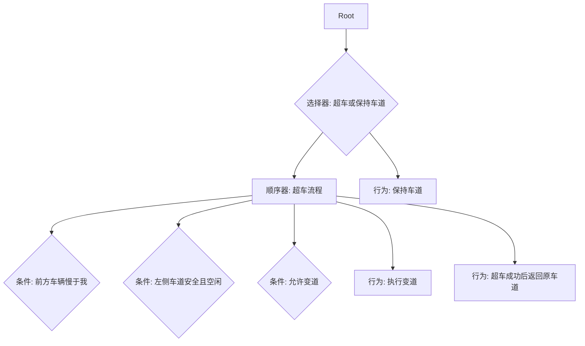

大家好，我是 qmwneb946，一名热爱技术与数学的博主。今天，我们将一同踏上一段深度探索之旅，剖析自动驾驶领域最核心、也最具挑战性的环节——决策与规划。如果说感知系统是自动驾驶的“眼睛”，预测系统是其“预知未来”的能力，那么决策与规划，无疑就是自动驾驶车辆的“大脑”，负责思考“接下来应该做什么”以及“如何去做”。

自动驾驶的愿景是构建一个更安全、高效、舒适的交通系统。然而，实现这一愿景并非易事。在瞬息万变的道路环境中，车辆不仅要识别和理解周遭的一切，更要像一位经验丰富的驾驶员一样，在毫秒之间做出明智的判断，并将其转化为精准的行驶动作。这正是决策与规划模块的魅力与难度所在。

本篇文章将带你深入理解自动驾驶决策与规划的各个层面，从基础概念到主流算法，从理论推导到工程实践中的挑战，力求为技术爱好者呈现一幅全面而深刻的画卷。我们将探讨：

*   决策与规划在自动驾驶系统中的定位和重要性；
*   感知与预测如何为决策规划提供基础；
*   决策模块如何从高层行为意图到具体驾驶行为的选择；
*   规划模块如何将高层行为转化为精确的、可执行的轨迹；
*   主流的决策与规划算法，包括基于规则、基于学习、基于优化的方法；
*   决策与规划协同面临的挑战，如不确定性、实时性、安全性等；
*   以及未来可能的发展方向。

准备好了吗？让我们一起开启这场关于自动驾驶“大脑”的深度之旅。

## 自动驾驶系统概述：决策与规划的定位

在深入探讨决策与规划之前，我们首先需要理解它们在整个自动驾驶系统架构中的位置。一个典型的自动驾驶系统通常被划分为以下几个核心模块：

1.  **感知 (Perception):** 这是自动驾驶系统的“眼睛”。它利用各种传感器（摄像头、雷达、激光雷达、超声波等）获取环境信息，并通过算法识别、分类、定位和跟踪环境中的所有相关对象，如其他车辆、行人、自行车、车道线、交通标志、交通灯等。
2.  **定位 (Localization):** 车辆需要知道自己在全球地图上的精确位置和姿态。高精地图、GPS、IMU（惯性测量单元）以及轮速计等传感器协同工作，实现厘米级的定位精度。
3.  **预测 (Prediction):** 基于感知到的信息，预测模块旨在预估其他动态交通参与者（车辆、行人等）在未来一段时间内的运动轨迹和意图。这对于车辆的安全决策和规划至关重要，因为自动驾驶车辆需要提前预判并应对潜在的冲突。
4.  **决策 (Decision Making):** 这是我们今天的主角之一。在感知、定位和预测的基础上，决策模块负责根据当前交通状况、交通法规、导航任务以及车辆自身状态，选择最高层的驾驶行为或意图。例如，是继续直行、变道超车、减速避让、停车等待，还是紧急制动等。
5.  **规划 (Planning):** 同样是今天的主角。一旦高层决策确定，规划模块就负责将这些抽象的意图转化为具体的、可执行的、满足车辆动力学约束的行驶轨迹。这个轨迹通常包含位置、速度、加速度、航向等随时间变化的信息，并要确保无碰撞、平稳舒适且符合交通规则。
6.  **控制 (Control):** 控制模块是自动驾驶系统的“手脚”。它接收规划模块生成的轨迹，并计算出具体的车辆执行指令（例如，方向盘转角、油门开度、刹车压力），通过线控系统驱动车辆精确地沿着规划轨迹行驶。

在这个流程中，决策与规划模块承上启下，它们是连接感知世界与物理行动的桥梁。决策模块处理高层语义信息，生成策略；规划模块则将这些策略细化为可执行的轨迹。两者紧密协作，共同构成了自动驾驶车辆的智能核心。

## 一、 感知与预测：决策规划的基础

在讨论决策与规划的具体细节之前，我们必须强调感知和预测在其中的基础性作用。没有准确、实时的环境理解和对未来的合理预判，决策和规划就如同空中楼阁。

### 感知系统的基石作用

感知系统通过多传感器融合（如毫米波雷达、激光雷达、摄像头、超声波等）获取车辆周围环境的全面信息。这些信息包括：

*   **障碍物检测与分类：** 识别并区分出车辆、行人、自行车、路障等。
*   **障碍物跟踪：** 持续跟踪目标的位置、速度、加速度和航向。
*   **车道线检测与识别：** 确定车辆当前所在车道及其边界。
*   **交通标志与信号灯识别：** 理解交通规则和指令。
*   **可行驶区域检测：** 确定车辆可以安全行驶的区域。

决策与规划模块正是依赖这些感知数据来理解当前的路况。例如，如果感知模块报告前方有车辆缓慢行驶，决策模块可能会考虑变道；如果感知到行人突然出现，规划模块则需要立即生成避障轨迹。

### 预测：预见未来的必要性

静态障碍物相对容易处理，但道路上绝大部分交通参与者都是动态的，并且具有自主的意图。预测模块的核心任务就是根据历史轨迹、环境信息和交通规则，预估这些动态目标未来几秒内的可能运动轨迹和意图。

**预测的挑战与方法：**
预测是一个充满不确定性的任务。行人可能突然转向，车辆可能加速或减速。预测算法需要处理这种内在的不确定性。

*   **基于物理模型：** 简单地用恒速、恒加速度模型预测，但对复杂行为无能为力。
*   **基于行为模型：** 预设常见的行为模式（如直行、转弯、变道），并计算每个模式的概率。
*   **基于学习的方法：**
    *   **深度学习：** LSTM、GRU、Transformer等序列模型在预测领域展现出强大能力，它们能从大量真实驾驶数据中学习复杂的时空依赖性。
    *   **高斯过程 (Gaussian Process)：** 能够建模预测的不确定性，给出预测轨迹的概率分布。
    *   **交互感知预测：** 考虑到多个智能体之间的相互影响，例如A车的行为会影响B车，反之亦然。这通常通过图神经网络 (GNN) 或多智能体强化学习来建模。

预测模块通常输出一组可能的未来轨迹，并附带相应的概率。决策与规划模块必须能够利用这些带有不确定性的预测信息，从而做出鲁棒且安全的决策。例如，如果预测到某个行人有一定概率会横穿马路，即使概率不高，决策规划也应采取保守策略，如减速或停车。

## 二、 决策：从行为意图到高层指令

决策模块是自动驾驶系统中的“战略家”，它在全面了解环境（感知）、预判未来（预测）和自身目标（导航任务）的基础上，做出高层次的驾驶行为选择。这些行为包括但不限于：

*   **车道保持：** 在当前车道内行驶。
*   **变道：** 超车变道、汇入主路、汇出辅路。
*   **路口通行：** 直行、左转、右转、掉头、等待红绿灯。
*   **避障：** 绕行障碍物、紧急制动。
*   **泊车：** 侧方停车、垂直泊车等。

决策模块的输出通常是抽象的、语义化的指令，如“沿当前车道直行”、“向左变道”、“在路口左转”等，这些指令会作为输入传递给规划模块。

### 基于规则的决策系统

最早也是最直观的决策方法是基于规则的。工程师根据交通法规、驾驶经验和安全原则，设计一系列“如果-那么”的逻辑规则。

**优点：**
*   **可解释性强：** 决策逻辑清晰，易于理解和调试。
*   **开发周期短：** 对于简单、明确的场景，规则编写相对直接。
*   **安全性易于验证：** 可以通过穷举规则和条件来分析潜在的安全风险。

**缺点：**
*   **鲁棒性差：** 难以应对复杂多变的现实世界场景，特别是“长尾问题”或未曾预设的异常情况。
*   **规则冲突：** 随着规则数量增加，容易出现相互矛盾或优先级模糊的情况。
*   **维护成本高：** 每次发现新场景或新需求，都需要手动添加或修改规则。
*   **缺乏灵活性：** 无法像人类驾驶员那样根据情境做出“模糊”或“直觉”的判断。

尽管有这些缺点，基于规则的系统在某些确定性强、复杂度低的子任务中仍然发挥着作用，或者作为更复杂决策系统的安全兜底策略。

### 有限状态机 (Finite State Machines, FSM)

有限状态机是基于规则系统的一种结构化实现。它将自动驾驶任务分解为一系列离散的、预定义的状态，并通过特定的事件触发在这些状态之间进行转换。

**核心概念：**
*   **状态 (States):** 车辆可能处于的各种高层驾驶模式（例如，车道保持、等待红灯、变道中、泊车）。
*   **事件 (Events):** 触发状态转换的条件（例如，检测到红灯、前方障碍物、收到导航指令）。
*   **转换 (Transitions):** 从一个状态到另一个状态的规则。

**示例：一个简化的红绿灯路口 FSM**

*   **状态S1：直行等待**
    *   **条件：** 导航指示直行，红灯亮起。
    *   **行为：** 减速停车，保持停车状态。
    *   **事件触发S2：** 红灯变为绿灯。
*   **状态S2：直行通行**
    *   **条件：** 导航指示直行，绿灯亮起。
    *   **行为：** 启动并加速通过路口。
    *   **事件触发S1：** 再次遇到红灯。
    *   **事件触发S3：** 检测到前方路口有紧急车辆。
*   **状态S3：紧急避让**
    *   **条件：** 检测到紧急车辆驶近。
    *   **行为：** 减速或停车，寻找安全避让空间。
    *   **事件触发S1或S2：** 紧急车辆通过，返回正常状态。

**优点：**
*   逻辑清晰，便于理解和调试。
*   适用于具有明确状态和转换的场景。

**缺点：**
*   随着场景复杂度的增加，状态和转换数量会呈指数级增长，导致“状态爆炸”。
*   难以处理中间状态或模糊的条件。
*   缺乏处理时间连续性和不确定性的能力。

### 行为树 (Behavior Trees, BTs)

行为树是一种比 FSM 更灵活、更模块化的决策方法，在游戏AI和机器人控制中应用广泛，也逐渐被引入自动驾驶。

行为树以树状结构组织行为逻辑，由以下几种基本节点组成：

*   **根节点 (Root):** 树的入口。
*   **控制流节点 (Control Flow Nodes):**
    *   **选择器 (Selector `?`):** 从左到右依次执行子节点，直到有一个子节点返回成功 (Success) 则立即返回成功，否则返回失败 (Failure)。可以理解为“或”关系。
    *   **顺序器 (Sequence `->`):** 从左到右依次执行子节点，直到有一个子节点返回失败则立即返回失败，否则返回成功。可以理解为“与”关系。
    *   **并行器 (Parallel `=>`):** 同时执行所有子节点，直到满足特定条件（如所有子节点成功，或任意一个失败）。
*   **装饰器节点 (Decorator Nodes):** 修改子节点的执行结果（如反转结果、重复执行）。
*   **条件节点 (Condition Nodes):** 检查某个条件是否满足（如“前方无障碍物”、“红灯亮”）。
*   **行为节点 (Action Nodes):** 执行具体的动作（如“加速”、“变道左侧车道”）。

**示例：简化的超车行为树**



**优点：**
*   **模块化和可重用性：** 可以将复杂行为分解为小的、可管理的子树，并进行复用。
*   **灵活性：** 更好地处理动态和复杂的行为逻辑。
*   **可解释性：** 树形结构直观，易于理解行为流。
*   **易于调试和扩展：** 增删改行为节点和子树更为方便。

**缺点：**
*   仍需要人工设计行为逻辑。
*   对于非常复杂的、需要学习的场景，设计难度仍然很高。

### 基于优化的决策

将决策问题建模为一个优化问题，通过定义一个成本函数来量化不同决策的优劣，然后寻找使得成本函数最优（最小化或最大化）的决策。

**核心思想：**
定义一个综合的成本函数 $J$ ，它通常是关于安全性、舒适性、效率、合规性等多个指标的加权和。决策模块的目标是找到一个行为 $A^*$ ，使得：
$$A^* = \arg \min_A J(A, \text{环境状态}, \text{预测})$$
例如，在需要变道时，系统会评估变道到左侧车道、变道到右侧车道、或继续在当前车道行驶（如果允许）的成本。这个成本会考虑：
*   **碰撞风险：** 与周围车辆的距离、相对速度。
*   **效率：** 是否能达到期望速度，是否会造成交通拥堵。
*   **舒适度：** 加速度、横向加速度的变化。
*   **合规性：** 是否违反交通规则。

这种方法允许决策更平滑地过渡，并能权衡不同目标。

### 强化学习 (Reinforcement Learning, RL) 在决策中的应用

强化学习提供了一种让车辆通过与环境的交互，自主学习最优决策策略的方法。它无需人工编写规则，而是通过“试错”来学习。

**核心概念：**
*   **智能体 (Agent):** 自动驾驶车辆。
*   **环境 (Environment):** 道路、交通参与者、交通规则。
*   **状态 (State $s$):** 当前环境的观测（感知和预测信息）。
*   **动作 (Action $a$):** 决策模块输出的高层行为（如变道、直行）。
*   **奖励 (Reward $r$):** 智能体执行动作后，环境给予的反馈信号。
    *   正面奖励：安全行驶、按时到达、舒适性高。
    *   负面奖励：发生碰撞、违反交通规则、长时间堵塞。
*   **策略 (Policy $\pi(a|s)$):** 从状态到动作的映射，决定在给定状态下采取哪个动作。
*   **值函数 (Value Function $V(s)$ 或 $Q(s, a)$):** 评估在某个状态下或采取某个动作后，未来能获得的总奖励。

RL的目标是学习一个最优策略 $\pi^*$，使得长期累积奖励最大化。常用的RL算法包括Q-learning、SARSA、DQN、Policy Gradients (如REINFORCE, Actor-Critic, PPO, DDPG)。

$$ Q^*(s,a) = E [R_{t+1} + \gamma Q^*(s_{t+1}, a_{t+1}) | s_t=s, a_t=a] $$

**优点：**
*   **无需人工设计复杂规则：** 能够自主探索和学习最优策略。
*   **适应性强：** 理论上能处理各种复杂和未知场景。
*   **潜力巨大：** 能够学习到超越人类经验的复杂策略。

**缺点：**
*   **样本效率低：** 需要大量的交互数据，这在真实世界中难以获得，通常依赖大规模仿真。
*   **安全风险：** 探索过程中可能产生危险行为，难以保证安全性。
*   **可解释性差：** 学习到的策略通常是“黑盒”，难以理解其决策依据。
*   **奖励函数设计困难：** 设计一个能引导车辆学习期望行为的奖励函数本身就是一项挑战。
*   **仿真与真实世界的鸿沟 (Sim-to-Real Gap):** 仿真中学习到的策略可能在真实世界中表现不佳。

为了解决安全性和样本效率问题，研究者也探索了**逆强化学习 (Inverse Reinforcement Learning, IRL)**，通过观察人类专家的驾驶行为来推断其内在的奖励函数，从而模仿人类驾驶风格。**模仿学习 (Imitation Learning)** 则是直接学习从感知到动作的映射。

### 博弈论 (Game Theory) 与多智能体决策

在复杂的交通环境中，自动驾驶车辆与其他交通参与者（其他车辆、行人）之间存在着复杂的相互作用。博弈论提供了一个数学框架来分析和预测这些交互行为，帮助自动驾驶车辆做出更“社会化”的决策。

**核心思想：**
将交通场景建模为一个非合作博弈，其中每个交通参与者都是一个理性的玩家，试图最大化自己的效用（例如，快速通行、安全性、舒适性），同时考虑其他玩家的可能行为。

*   **玩家 (Players):** 自动驾驶车辆，其他交通参与者。
*   **策略 (Strategies):** 每个玩家可能采取的行动序列。
*   **效用函数 (Utility Functions):** 量化每个玩家从特定结果中获得的收益。
*   **纳什均衡 (Nash Equilibrium):** 一种稳定的状态，任何玩家单方面改变策略都不会获得更好的结果。

自动驾驶车辆的目标不是简单地最大化自身效用，而是要在考虑其他参与者反应的情况下，寻找一个“最优”的决策，这可能包括主动避让以避免冲突，或者通过微妙的信号（如减速示意）来影响其他车辆的行为。

**挑战：**
*   **信息不完全：** 无法完全了解其他参与者的意图和效用函数。
*   **计算复杂度高：** 多玩家博弈的求解难度大。
*   **理性假设：** 现实中的人类驾驶员并非总是理性的。

博弈论在处理十字路口、并道、环岛等需要复杂交互的场景中展现出巨大潜力。例如，**层次化博弈**可以用于建模长期和短期决策的交互。

## 三、 规划：从高层指令到可执行轨迹

一旦决策模块确定了高层行为（如“左转”、“变道超车”），规划模块就接过了接力棒，将这些抽象的意图转化为车辆可以执行的、具体的、时间-空间相关的轨迹。规划模块是自动驾驶的“行动大脑”，负责回答“如何安全、平稳、高效地实现决策意图？”的问题。

规划过程通常可以分为几个层次：

*   **任务规划 (Task Planning / Global Planning):** 根据导航目的地生成一条全局路径，通常在静态地图上完成，不考虑实时障碍物。例如，从A地到B地的宏观路线。
*   **行为规划 (Behavioral Planning):** 类似于高层决策，但更侧重于在特定驾驶场景下的行为序列。
*   **局部规划 (Local Planning / Motion Planning):** 根据当前环境的实时感知信息（包括动态障碍物），在全局路径约束下，生成一段短期的、动态避障的、符合车辆动力学约束的详细轨迹。这是本节的重点。

### 路径规划 (Path Planning)

路径规划是在给定环境中，寻找一条从起点到终点的无碰撞路径。它通常不考虑时间维度，只关注空间上的可通行性。

#### 基于图搜索的算法

将环境抽象为图，节点表示可通行的位置，边表示可通行的连接。

1.  **A* 算法 (A-star algorithm):**
    A* 算法是一种启发式搜索算法，广泛用于路径规划。它通过结合Dijkstra算法（保证找到最短路径）和贪婪最佳优先搜索（利用启发式函数加速搜索），在效率和最优性之间取得平衡。

    A* 算法的核心是评估节点的成本函数 $f(n)$：
    $$ f(n) = g(n) + h(n) $$
    其中：
    *   $g(n)$ 是从起点到当前节点 $n$ 的实际成本（例如，行驶距离）。
    *   $h(n)$ 是从当前节点 $n$ 到终点的预估成本（启发式函数），通常是欧几里得距离或曼哈顿距离。一个好的启发式函数可以显著提高搜索效率。

    **算法流程：**
    1.  初始化开放列表 (Open List) 和关闭列表 (Closed List)。将起点加入开放列表。
    2.  循环直到开放列表为空或找到终点：
        a.  从开放列表中选择 $f(n)$ 值最小的节点 $n$。
        b.  将 $n$ 从开放列表移除，并加入关闭列表。
        c.  如果 $n$ 是终点，则回溯路径。
        d.  对于 $n$ 的每一个邻居 $m$：
            i.   如果 $m$ 已在关闭列表中，则跳过。
            ii.  计算从起点经过 $n$ 到 $m$ 的新 $g$ 值。
            iii. 如果 $m$ 不在开放列表中，或新 $g$ 值更小，则更新 $m$ 的 $g$ 值、 $f$ 值，并将其父节点设置为 $n$，然后将 $m$ 加入或更新在开放列表中。

    **伪代码示例：**

    ```python
    function A_STAR(start, goal):
        open_list = priority_queue() # Stores (f_cost, node)
        open_list.put((0, start))
        came_from = {} # To reconstruct path
        g_score = {node: infinity for node in graph_nodes}
        g_score[start] = 0
        f_score = {node: infinity for node in graph_nodes}
        f_score[start] = heuristic(start, goal)

        while not open_list.empty():
            current_f, current_node = open_list.get()

            if current_node == goal:
                return reconstruct_path(came_from, current_node)

            for neighbor in get_neighbors(current_node):
                tentative_g_score = g_score[current_node] + cost(current_node, neighbor)

                if tentative_g_score < g_score[neighbor]:
                    came_from[neighbor] = current_node
                    g_score[neighbor] = tentative_g_score
                    f_score[neighbor] = tentative_g_score + heuristic(neighbor, goal)
                    if neighbor not in open_list: # Check if already in queue (with better f_score)
                        open_list.put((f_score[neighbor], neighbor))
        return failure
    ```

    **Hybrid A*:** 针对自动驾驶车辆的运动学约束，Hybrid A* 在状态空间中加入了车辆的航向角，使其能在栅格地图上规划出平滑且可行驶的路径。它不再是简单的网格移动，而是允许从一个栅格点以不同姿态进入相邻栅格点。

#### 基于采样的方法 (Sampling-Based Methods)

这类方法通过在配置空间中随机采样点来构建搜索树或图，适用于高维空间和复杂障碍物环境。

1.  **RRT (Rapidly-exploring Random Tree) / RRT*:**
    RRT 算法通过随机生长一颗树来快速探索高维配置空间。它不是最优的，但能很快找到一条路径。RRT* 是 RRT 的优化版本，它通过重新布线 (rewiring) 树中的节点，使得当采样点足够多时，能够渐近地找到最优路径。

    **RRT 算法流程：**
    1.  初始化树 $T$，将起点 $q_{init}$ 作为根节点。
    2.  循环直到找到路径或达到迭代次数：
        a.  随机采样一个点 $q_{rand}$。
        b.  在树 $T$ 中找到离 $q_{rand}$ 最近的节点 $q_{nearest}$。
        c.  从 $q_{nearest}$ 向 $q_{rand}$ 方向扩展一小步，生成新节点 $q_{new}$。
        d.  如果 $q_{new}$ 与障碍物无碰撞，则将其添加到树 $T$ 中，并连接 $q_{nearest}$ 和 $q_{new}$。
        e.  如果 $q_{new}$ 足够接近终点，则完成路径搜索。

    **RRT* 改进：**
    在添加 $q_{new}$ 后，RRT* 会：
    *   **选择最佳父节点 (ChooseParent):** 在 $q_{new}$ 周围的邻域内搜索，找到一个能使从根节点到 $q_{new}$ 的路径成本最小的父节点。
    *   **重新布线 (Rewire):** 检查 $q_{new}$ 的邻域，如果通过 $q_{new}$ 到某个邻居的路径成本更低，则更新该邻居的父节点。

    **伪代码示例 (RRT):**

    ```python
    function RRT_PLANNER(start, goal, map, max_iter):
        tree = {start: None} # Node -> Parent mapping
        path_found = False

        for i in range(max_iter):
            q_rand = generate_random_point_in_map()
            q_nearest = find_nearest_node_in_tree(tree, q_rand)
            q_new = steer(q_nearest, q_rand, step_size) # Extend from nearest towards random

            if not is_collision(q_nearest, q_new, map):
                tree[q_new] = q_nearest
                if distance(q_new, goal) < threshold:
                    tree[goal] = q_new
                    path_found = True
                    break
        
        if path_found:
            return reconstruct_path(tree, start, goal)
        else:
            return failure
    ```

    **优点：**
    *   适用于高维复杂环境，特别是非完整约束 (non-holonomic constraints) 的车辆。
    *   对地图建模误差和不确定性有一定鲁棒性。

    **缺点：**
    *   RRT 不是最优的，RRT* 渐近最优，但收敛速度慢。
    *   生成的路径通常不平滑，需要后处理。
    *   在狭窄通道中效率较低。

#### 基于优化的路径生成

将路径生成问题转换为一个优化问题，通过最小化某个成本函数来获得平滑且符合约束的路径。这通常涉及样条曲线或多项式。

### 轨迹生成 (Trajectory Generation)

路径规划确定了“走哪里”，而轨迹生成则确定了“如何走”，即在路径的基础上加入时间维度，生成包含速度、加速度、曲率等信息的时空曲线。它必须严格遵守车辆的动力学约束、舒适性要求和交通法规。

#### 多项式轨迹 (Polynomial Trajectories)

常用的方法是使用多项式来表示轨迹，例如三次、五次或七次多项式。五次多项式在自动驾驶中非常流行，因为它可以方便地控制轨迹的起始和终止位置、速度和加速度，使得轨迹平滑且容易衔接。

**五次多项式：**
一条轨迹在某个维度（如纵向位置 $s$ 或横向位置 $d$）可以表示为关于时间 $t$ 的五次多项式：
$$ s(t) = a_0 + a_1 t + a_2 t^2 + a_3 t^3 + a_4 t^4 + a_5 t^5 $$
其一阶导数（速度）为：
$$ \dot{s}(t) = a_1 + 2a_2 t + 3a_3 t^2 + 4a_4 t^3 + 5a_5 t^4 $$
二阶导数（加速度）为：
$$ \ddot{s}(t) = 2a_2 + 6a_3 t + 12a_4 t^2 + 20a_5 t^3 $$

给定起始时刻 $t_0=0$ 和终止时刻 $t_f$，以及在这些时刻的起始位置 $s_0$, 速度 $\dot{s}_0$, 加速度 $\ddot{s}_0$ 和终止位置 $s_f$, 速度 $\dot{s}_f$, 加速度 $\ddot{s}_f$，我们可以建立一个包含六个线性方程的方程组来求解六个系数 $a_0, \dots, a_5$。

**方程组：**
在 $t=0$ 时刻：
$$ s(0) = a_0 = s_0 $$
$$ \dot{s}(0) = a_1 = \dot{s}_0 $$
$$ \ddot{s}(0) = 2a_2 = \ddot{s}_0 \Rightarrow a_2 = \ddot{s}_0 / 2 $$

在 $t=t_f$ 时刻：
$$ s(t_f) = a_0 + a_1 t_f + a_2 t_f^2 + a_3 t_f^3 + a_4 t_f^4 + a_5 t_f^5 = s_f $$
$$ \dot{s}(t_f) = a_1 + 2a_2 t_f + 3a_3 t_f^2 + 4a_4 t_f^3 + 5a_5 t_f^4 = \dot{s}_f $$
$$ \ddot{s}(t_f) = 2a_2 + 6a_3 t_f + 12a_4 t_f^2 + 20a_5 t_f^3 = \ddot{s}_f $$

通过解这个线性方程组，可以得到唯一的 $a_i$ 系数，从而确定了这条五次多项式轨迹。这种方法在Frenet坐标系（纵向 $s$ 和横向 $d$）中尤其方便，可以独立生成纵向和横向轨迹，再组合起来形成最终的笛卡尔坐标系轨迹。

**优点：**
*   计算效率高，有解析解。
*   易于满足起始和终止条件，保证轨迹平滑。

**缺点：**
*   难以直接处理复杂的避障约束。
*   需要外部机制来选择最佳的终止状态 (target state)。

#### 样条曲线 (Spline Curves)

样条曲线（如B样条、NURBS）能够生成非常平滑的曲线，通过控制点来定义形状。它们在路径平滑、曲线拟合方面有广泛应用，可以作为多项式轨迹的补充或替代。

#### 基于优化的轨迹生成

这是现代自动驾驶中最强大的轨迹生成方法之一。它将轨迹生成视为一个优化问题，通过最小化一个成本函数来生成最佳轨迹，同时满足各种硬约束（如碰撞避免）和软约束（如舒适性、效率）。

**核心思想：**
选择一系列候选轨迹，并对每个轨迹进行评分，然后选择得分最高的轨迹。评分标准由成本函数定义。

**成本函数 (Cost Function):**
通常是以下各项的加权和：
*   **平滑度：** 最小化加速度和急动度（Jerk）的平方和，保证乘坐舒适性。
    $C_{jerk} = w_j \int (\dddot{x}^2 + \dddot{y}^2) dt$
*   **效率：** 最小化到达目标点所需的时间或燃料消耗。
    $C_{time} = w_t \cdot T_{total}$
*   **安全性：** 惩罚与障碍物的距离过近，或轨迹穿过障碍物。
    $C_{collision} = w_c \cdot \sum \max(0, \text{collision_margin} - \text{distance_to_obstacle})$
*   **目标遵循：** 惩罚偏离目标车道或目标速度。
    $C_{target} = w_o \cdot \| \text{current_pos} - \text{target_pos} \|^2 + w_v \cdot \| \text{current_vel} - \text{target_vel} \|^2$
*   **车道居中：** 惩罚偏离车道中心线。
    $C_{lane\_center} = w_l \cdot \| d(t) \|^2$ （Frenet坐标系下横向偏差 $d$）

**约束 (Constraints):**
*   **动力学约束：** 车辆的最大速度、加速度、横向加速度、方向盘转角限制。
*   **碰撞约束：** 轨迹不能与任何静态或动态障碍物发生碰撞。
*   **车道边界约束：** 轨迹不能超出可行驶区域或车道线。
*   **起始/终止条件：** 轨迹必须从当前车辆状态开始，并能衔接至目标状态。

优化问题通常通过**二次规划 (Quadratic Programming, QP)** 或**序列二次规划 (Sequential Quadratic Programming, SQP)** 等方法求解。QP 求解器效率很高，但只能处理线性约束和二次目标函数。对于非线性约束（如避障），通常需要将其近似为线性，或者采用 SQP 等更复杂的非线性优化方法。

### 运动规划 (Motion Planning) 与动态环境

在自动驾驶中，规划不仅仅是在静态地图上找路径，更关键的是要在动态变化的交通流中，实时地生成安全、高效的运动。这通常被称为**运动规划 (Motion Planning)**，它融合了时间维度和对动态障碍物的处理。

#### 格子法 (Lattice-based Planning)

格子法将规划空间离散化成一个“格子”，每个格子点代表一个可能的车辆状态（位置、速度、航向等）。从当前车辆状态出发，预先计算一系列满足车辆动力学约束的轨迹族（例如，在不同时间和速度下到达目标车道点的轨迹）。然后，这些轨迹族可以在时间-空间图中进行搜索和评估，以找到最佳轨迹。

**优点：**
*   生成轨迹平滑且符合车辆动力学。
*   可以处理复杂的车辆模型。

**缺点：**
*   预计算的轨迹族通常数量巨大，存储和计算成本高。
*   难以应对非常规的动态障碍物。

#### 模型预测控制 (Model Predictive Control, MPC)

MPC 是在自动驾驶轨迹跟踪和局部运动规划中非常重要的技术。它是一种在线优化控制策略，其核心思想是：

1.  **预测 (Predict):** 基于当前状态和控制输入，使用车辆的动力学模型预测车辆在未来一个有限时间窗口（预测时域 $N_p$）内的行为。
2.  **优化 (Optimize):** 在预测时域内，根据预设的成本函数和约束（包括避障），计算出未来一系列最优的控制输入序列。这是一个优化问题。
3.  **执行 (Execute):** 只将优化得到的控制序列的第一个控制量施加到车辆上。
4.  **滚动 (Recede):** 在下一个时间步，重新获取当前状态，重复上述过程。这使得MPC能够持续地适应环境变化和模型误差。

**MPC 优化问题的一般形式：**
最小化成本函数 $J$：
$$ \min_{u_0, \dots, u_{N_c-1}} J = \sum_{k=0}^{N_p-1} \|x_{k+1} - x_{ref,k+1}\|^2_Q + \|u_k - u_{ref,k}\|^2_R + \Delta u_k^T S \Delta u_k $$
**受限于：**
*   **系统动力学模型：** $x_{k+1} = f(x_k, u_k)$ （车辆运动学或动力学模型）
*   **控制量约束：** $u_{min} \le u_k \le u_max$ （如最大油门、刹车、方向盘转角）
*   **状态量约束：** $x_{min} \le x_k \le x_max$ （如最大速度、加速度）
*   **碰撞避免约束：** 预测轨迹不能与障碍物重叠。这通常转化为非线性约束，或者通过线性化处理。

其中，$x_k$ 是系统在 $k$ 时刻的状态（位置、速度、航向等），$u_k$ 是控制输入，$x_{ref,k}$ 和 $u_{ref,k}$ 是参考轨迹和参考控制输入，$Q, R, S$ 是权重矩阵，$N_p$ 是预测时域，$N_c$ 是控制时域（通常 $N_c \le N_p$）。

**优点：**
*   **处理多变量和多约束：** 能够同时考虑车辆动力学、舒适性、安全性和避障等多个目标和约束。
*   **滚动优化：** 具有强大的在线适应性和鲁棒性。
*   **处理动态环境：** 能将动态障碍物的预测轨迹纳入优化。

**缺点：**
*   **计算量大：** 每一步都需要求解一个复杂的优化问题，对实时性要求高。
*   **模型精度要求高：** 预测模型的准确性直接影响控制效果。
*   **非凸优化：** 避障约束通常是非凸的，使得求解困难。

### 总结规划层次

*   **路径规划**解决空间可通行性（“去哪里”），通常忽略时间。
*   **轨迹生成**在路径基础上增加时间维度，生成平滑、符合动力学约束的时空曲线（“如何去”）。
*   **运动规划**通常指局部规划，在动态环境中实时生成避障轨迹，常用 MPC、格子法或采样-优化结合的方法。

这些规划方法常常协同使用：例如，首先通过A*或RRT生成一条粗略的路径，然后用多项式或优化方法对其进行平滑和轨迹化，最后用MPC进行实时的轨迹跟踪和避障微调。

## 四、 决策与规划的协同与挑战

决策与规划并非孤立的模块，它们在自动驾驶系统中紧密协作，共同应对复杂多变的驾驶场景。这种协同带来了强大的能力，但也伴随着诸多挑战。

### 模块间的交互

自动驾驶系统通常采用分层架构。决策模块输出高层指令（如“变道”），规划模块接收这些指令并生成详细的轨迹。这种层次化结构有其优势：

*   **解耦复杂性：** 将高层语义决策与低层物理运动解耦，简化了每个模块的设计和调试。
*   **可解释性：** 决策意图清晰，易于理解系统行为。

然而，模块间的交互也需要精细设计：

*   **反馈机制：** 规划模块在执行过程中可能发现决策不可行（例如，变道路径被障碍物堵死），这时需要将信息反馈给决策模块，促使其重新评估或选择新的策略。这种反馈循环对于系统的鲁棒性至关重要。
*   **信息传递：** 决策模块需要从感知和预测模块获取高抽象度的信息，而规划模块则需要这些信息的细粒度表示，以进行精确计算。数据格式和接口的标准化是关键。
*   **粒度匹配：** 决策的粒度（行为时长）和规划的粒度（轨迹长度和更新频率）需要匹配。一个决策可能对应多个规划周期。

### 不确定性管理

自动驾驶车辆在真实世界中运作，充满了各种不确定性：

*   **感知不确定性：** 传感器噪声、目标检测和跟踪的误差、环境遮挡等。
*   **预测不确定性：** 其他交通参与者行为的内在随机性，以及预测模型的局限性。
*   **定位不确定性：** 定位精度波动。
*   **模型不确定性：** 车辆动力学模型与真实车辆行为可能存在偏差。

决策与规划系统必须能够鲁棒地处理这些不确定性。常用的方法包括：

*   **概率方法：** 使用概率分布（如高斯分布、粒子滤波器）来表示不确定性，并在决策规划中考虑这些分布。例如，预测模块输出的轨迹是概率分布而不是单一轨迹。
*   **鲁棒优化：** 设计成本函数和约束时，考虑最坏情况或在一定概率置信区间内保证安全性。
*   **风险评估：** 将潜在风险量化，并在决策时选择风险最低的选项。例如，避免进入那些预测不确定性高的区域。
*   **安全包络 (Safety Envelope)：** 定义车辆能够安全操作的边界，任何决策和规划都不能超出这个边界。

### 安全与可信赖性

安全性是自动驾驶的最高优先级。决策与规划模块的任何错误都可能导致严重的后果。

*   **形式化验证：** 尽可能对关键决策规则和规划算法进行数学上的形式化验证，证明其在特定条件下不会导致危险。
*   **安全冗余与故障恢复：** 设计多套决策规划方案，当主系统出现故障时能立即切换到备用安全策略（如靠边停车）。
*   **紧急避险：** 针对突发危险情况，设计独立的紧急避险模块，能够快速生成极端但安全的轨迹，即使这意味着放弃最优或舒适性。例如，紧急制动或小幅度转向避障。
*   **人工安全员：** 在测试和早期部署阶段，人类安全员是最终的保障。
*   **安全标准与法规：** 遵循 ISO 26262 (功能安全)、SOTIF (预期功能安全) 等行业标准。

### 计算效率与实时性

自动驾驶车辆需要在毫秒级的时间内完成从感知到控制的整个链条，这意味着决策与规划算法必须非常高效。

*   **算法优化：** 采用高效的数据结构和算法，如A*的启发式剪枝，RRT的快速探索。
*   **并行计算：** 利用多核CPU、GPU、FPGA或ASIC等专用硬件进行并行计算，加速优化问题的求解、轨迹生成和碰撞检测。
*   **循环周期：** 决策通常在数百毫秒到秒级更新，规划在数十毫秒到百毫秒级更新，控制在数毫秒到数十毫秒级更新。这些周期需要精确同步和协调。
*   **资源管理：** 有效分配计算资源，确保关键任务的优先级。

### 可解释性与透明度

随着基于学习的方法在决策规划中应用越来越多，系统的“黑盒”特性也日益凸显。当自动驾驶车辆做出一个人类无法理解的决策时，不仅难以调试，也难以获得用户的信任。

*   **可解释性AI (XAI):** 发展能够解释其决策原因的AI模型。例如，指出哪些感知特征导致了某个决策，或展示决策过程中关键的中间结果。
*   **混合架构：** 结合基于规则和基于学习的方法。基于规则的部分提供可解释的安全兜底，基于学习的部分提供灵活性和适应性。
*   **可视化工具：** 开发强大的仿真和可视化工具，以重现和分析车辆的决策和规划过程。

### 复杂场景与长尾问题

自动驾驶面临的最大挑战之一是如何处理“长尾问题”——那些极少发生但影响巨大的异常事件。例如，突然出现在路中央的动物、极端恶劣天气、非标准的交通参与者行为、复杂且未标注的施工区域等。

*   **大规模仿真：** 在虚拟环境中生成和测试大量极端场景，以训练和验证决策规划系统。仿真能有效地弥补真实世界数据稀缺的问题。
*   **数据驱动开发：** 收集和标注大量的真实世界异常数据，用于模型训练和算法改进。
*   **场景库构建：** 持续扩充和更新边缘场景库，用于回归测试。
*   **Human-in-the-Loop：** 在某些极端或不确定场景下，允许人类驾驶员接管，并从中学习。

### 人机共驾与伦理考量

随着自动驾驶技术的发展，人与机器的协同成为新的课题。

*   **人机交互：** 如何设计直观的界面，让驾驶员了解车辆的决策意图，并在必要时安全地接管。
*   **伦理困境：** 面对“电车难题”这类极端情况，自动驾驶车辆应如何做出选择？例如，在无法避免事故时，是选择保护车内乘员，还是保护车外行人？这并非技术问题，而是社会和伦理问题，需要法律和公众的共同决定来指导技术发展。目前主流观点是，自动驾驶车辆应尽量避免事故，若无法避免，则应遵循最小伤害原则。

## 五、 未来方向与新兴技术

自动驾驶决策与规划领域仍在快速发展，以下是一些值得关注的未来方向和新兴技术：

### 端到端学习 (End-to-End Learning)

传统的自动驾驶系统是模块化的，每个模块独立设计和优化。端到端学习则试图跳过这些中间模块，直接从原始传感器数据（如图像）映射到车辆控制指令（如方向盘转角、速度）。

*   **优点：**
    *   **简化系统架构：** 减少了复杂的手动特征工程和模块间接口设计。
    *   **潜力巨大：** 理论上可以学习到人类难以明确表达的复杂驾驶策略，直接优化最终性能。
*   **缺点：**
    *   **“黑盒”问题：** 缺乏可解释性，难以理解决策依据，难以调试和保证安全。
    *   **数据依赖：** 需要海量的真实世界数据来训练，容易过拟合。
    *   **鲁棒性：** 对未见过的新场景泛化能力可能较弱。
    *   **安全性验证困难：** 难以通过形式化方法验证其安全性。

尽管存在挑战，混合架构（End-to-End与模块化结合）是未来的一个重要方向，例如，用端到端网络学习部分高层决策或运动策略，同时保留明确的感知、预测和安全模块。

### 多模态融合与情境理解

目前的感知和预测系统已经能够融合多种传感器数据。未来将更侧重于对这些信息的深层次理解，包括：

*   **社会情境理解：** 不仅识别其他交通参与者，还要理解他们的意图、情绪和行为模式。例如，行人可能正在看手机，或者正在寻找朋友，这些都可能影响其下一步行动。
*   **驾驶员意图估计：** 如果是L3及以下的人机共驾，理解人类驾驶员的意图对于无缝切换和协同至关重要。
*   **常识推理：** 让车辆具备一定的“常识”，例如，知道雨天路滑需要更长的刹车距离，或者在学校附近应更加谨慎。

### 数字孪生与大规模仿真

由于真实世界测试的成本高昂和风险巨大，大规模仿真成为自动驾驶研发的关键。

*   **数字孪生：** 创建物理世界的精确数字副本，包括道路、建筑、交通参与者、天气等，用于决策规划算法的训练、测试和验证。
*   **仿真驱动开发：** 将仿真作为开发流程的核心，从算法设计、训练、测试到验证，都离不开高质量的仿真环境。
*   **极端场景生成：** 利用生成对抗网络 (GAN) 或其他方法自动生成大量具有挑战性的边缘场景。
*   **虚实结合：** 将部分真实传感器数据注入仿真环境，或将仿真车辆插入真实交通流中进行混合测试。

### 可解释人工智能 (XAI)

随着AI模型复杂性的增加，如何让这些模型变得可解释、透明和可信赖，对于自动驾驶至关重要。

*   **决策归因：** 能够解释为何做出某个决策，并指出决策的关键输入。
*   **不确定性量化：** 不仅给出预测结果，还要量化预测的不确定性。
*   **反事实解释：** 解释在不同的输入条件下，模型会做出何种不同的决策。

### 强化学习与模仿学习的深度融合

将强化学习（自主探索和优化）与模仿学习（从人类专家数据中学习）相结合，以克服各自的缺点。

*   **模仿学习作为初始化：** 利用人类驾驶数据快速初始化RL策略，减少探索时间。
*   **RL进行微调和泛化：** 在仿真环境中，RL可以进一步优化策略，提高在复杂场景下的性能。
*   **离线RL：** 利用大规模离线数据集进行RL训练，而无需与真实环境进行大量交互。

### 联邦学习与边缘计算

随着自动驾驶车辆数量的增加，如何高效、安全地利用海量数据成为问题。

*   **联邦学习：** 允许多个车辆在本地训练模型，并将模型更新（而非原始数据）共享到中心服务器进行聚合，从而在保护数据隐私的同时实现协同学习。
*   **边缘计算：** 将部分计算任务推到车辆端或路侧单元（边缘），减少对中心服务器的依赖，降低通信延迟，提高实时性。

## 结论

自动驾驶的决策与规划是其核心智能的体现，是连接感知世界与物理行动的桥梁。我们从基于规则的有限状态机和行为树，到基于优化的多项式轨迹和MPC，再到基于深度学习和强化学习的自主决策，见证了这一领域的飞速发展。

我们深入探讨了决策与规划的各个环节：决策如何选择高层行为意图，规划如何将这些意图转化为具体的、可执行的轨迹。我们详细审视了路径规划（如A*和RRT*）和轨迹生成（如五次多项式和基于优化的方法），以及在动态环境中进行运动规划（如MPC）的原理与挑战。

然而，尽管取得了显著进展，决策与规划仍然面临巨大挑战，如处理不确定性、确保极高安全性、实现实时计算效率、提升可解释性，以及应对无穷无尽的复杂长尾问题。未来的发展将围绕多模态融合、数字孪生仿真、可解释AI、强化学习与模仿学习的结合，以及联邦学习与边缘计算等方向展开。

自动驾驶不仅仅是一项技术革命，它将深刻改变我们的生活方式和社会结构。决策与规划作为自动驾驶的“大脑”，其持续的突破将是实现更安全、更高效、更舒适未来出行的关键。作为技术爱好者，我们有幸身处这一激动人心的时代，共同见证并参与这场智能交通的变革。希望今天的深度解析，能为你打开一扇窗，一窥自动驾驶“大脑”的奥秘。谢谢阅读！