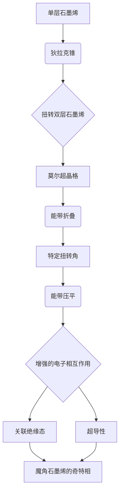

## 引言：2D 材料与量子世界的“扭曲”艺术

在过去的二十年里，二维（2D）材料的崛起彻底改变了凝聚态物理学和材料科学的面貌。从石墨烯的横空出世，到各类过渡金属硫族化合物（TMDs）、氮化硼等材料的发现，科学家们逐渐意识到，当物质被限制在原子尺度的一个平面上时，会展现出前所未有的奇特量子现象。这些材料不仅具有独特的电子、光学和机械性质，更重要的是，它们为构建“人造”量子材料提供了理想的平台。

而在这场二维材料革命中，莫尔（Moiré）超晶格无疑是近年最令人兴奋的发现之一。想象一下，将两层或多层二维材料以微小的角度扭曲或堆叠起来，由于两层晶格的轻微失配或相对旋转，会在更大尺度上形成一个周期性的干涉图案——这就是莫尔超晶格。这个看似简单的几何操作，却能深刻地改变材料的电子结构，催生出一系列令人惊叹的量子现象，例如魔角石墨烯中的超导性、莫尔激子、关联绝缘态，乃至分数量子霍尔效应的模拟。

莫尔超晶格的独特之处在于，它允许我们通过简单地“扭转”或“堆叠”来精细调控材料的物理性质，从而实现“设计”新材料的梦想。传统材料的性质通常由其固有的原子排列决定，而莫尔超晶格则提供了一个全新的维度：我们可以在不改变原子种类的情况下，通过改变堆叠方式或扭转角度，来任意调整其电子能带结构，甚至诱导出完全不同的量子相。

本篇博文将带你深入探索莫尔超晶格的电子结构奥秘。我们将从二维材料的基础知识入手，逐步揭示莫尔图案如何影响电子的运动，进而讲解在莫尔超晶格中观察到的各种新奇量子现象。无论你是物理学爱好者、材料科学家，还是对前沿技术充满好奇心的工程师，希望这趟旅程能让你领略到莫尔超晶格的独特魅力。

## 2D 材料基础：量子世界的积木

在深入莫尔超晶格之前，我们首先需要对构成它们的基石——二维材料——有一个基本的了解。

### 单层原子材料：超越硅的维度

二维材料指的是那些在垂直方向上只有一个或几个原子层厚的材料。与传统的体材料不同，它们的电子运动在垂直方向上受到量子限域，只允许在平面内自由移动。这种维度上的限制赋予了它们许多独特的性质。

#### 石墨烯：碳的奇迹

石墨烯无疑是最著名的二维材料。它由碳原子以蜂窝状晶格排列而成，是所有其他石墨烯衍生物和许多二维材料研究的起点。

*   **结构与键合：** 石墨烯中的碳原子通过 $sp^2$ 杂化形成强共价键，构成一个原子级别的二维平面。
*   **电子结构：** 石墨烯的电子结构非常独特。它的费米能级处存在两个不相交的锥形结构，被称为“狄拉克锥”（Dirac Cones）。在这些点附近，电子的行为就像无质量的相对论粒子，其能量与动量呈线性关系：$E = \pm v_F |\mathbf{k}|$，其中 $v_F$ 是费米速度。
*   **物理性质：** 这种线性能带带来了许多非凡的性质，例如极高的电子迁移率、弹道输运、独特的量子霍尔效应以及优异的导热性和机械强度。

#### 过渡金属硫族化合物（TMDs）：半导体的新星

除了石墨烯，过渡金属硫族化合物（TMDs）是另一大类重要的二维材料。它们通常由一个过渡金属原子层（如Mo、W）夹在两个硫族原子层（如S、Se、Te）之间构成，形成三明治结构，例如单层二硫化钼（MoS$_2$）、二硒化钨（WSe$_2$）等。

*   **结构：** 与石墨烯的单原子层不同，TMDs的“单层”实际上是三明治结构，但它们在垂直方向上也是由范德瓦尔斯力堆叠而成，层间相互作用弱。
*   **电子结构：** 与石墨烯的零带隙不同，单层TMDs通常是具有直接带隙的半导体。它们的带隙位于K点或$\Gamma$点，能量范围从1到2 eV不等。这使得它们在光电器件、发光二极管和场效应晶体管方面具有巨大潜力。
*   **谷自由度：** TMDs在K点和K'点存在两个简并的价带顶和导带底，这两个谷具有相反的动量和手性。这种“谷自由度”可以被光或磁场选择性激发，为谷电子学（Valleytronics）提供了新的可能性。

### 层间耦合：范德瓦尔斯堆叠的魔力

二维材料的层间相互作用通常是弱的范德瓦尔斯力。这意味着单层材料的许多特性可以在多层堆叠中保持，但同时，弱耦合也带来了新的调控机会：

*   **垂直堆叠：** 将不同种类的二维材料垂直堆叠，可以形成范德瓦尔斯异质结，结合不同材料的优点，设计出具有新功能的器件。例如，将石墨烯与TMDs堆叠，可以利用TMDs的带隙和石墨烯的高迁移率。
*   **相对旋转：** 这是莫尔超晶格形成的关键。即使是同种材料，只要通过相对旋转或晶格失配进行堆叠，就能够产生新的物理现象。

理解这些基础知识，是我们探索莫尔超晶格复杂电子行为的起点。现在，让我们看看当这些量子积木被巧妙地“扭曲”时，会发生什么。

## 莫尔超晶格的形成：宏观几何与微观物理的交织

莫尔超晶格的魅力在于，它将宏观上的几何排列（扭转角度、晶格失配）与微观上的电子行为深刻地联系起来。

### 什么是莫尔图案？

莫尔图案（Moiré pattern）本身是一种常见的视觉现象。当你将两个相似但略有不同（例如间距、角度）的周期性图案叠加在一起时，会在更大尺度上看到一个新的、周期性的干涉图案。在二维材料中，这个“图案”是由原子晶格的周期性失配形成的。

#### 扭转角与晶格失配

莫尔超晶格的形成主要有两种方式：

1.  **扭转双层（Twisted Bilayers）：** 将两层相同的二维材料（如石墨烯）以一个非零的扭转角 $ \theta $ 叠加在一起。虽然两层的晶格常数完全相同，但相对旋转会使得整体出现一个周期性的大尺度莫尔图案。
2.  **异质结（Heterostructures）与晶格失配：** 将两层不同但晶格常数 $ a_1 $ 和 $ a_2 $ 相近的二维材料叠加在一起，即使没有扭转，也会因为晶格常数的微小差异 $ \delta = (a_2 - a_1) / a_1 $ 而形成莫尔图案。当然，也可以同时存在扭转和晶格失配。

#### 莫尔周期：大尺度调制

莫尔图案的周期 $ \lambda_M $ 远大于原子晶格的周期 $ a $。对于扭转双层系统，莫尔周期大致为：

$ \lambda_M = \frac{a}{2 \sin(\theta/2)} \approx \frac{a}{\theta} $ （对于小角度 $ \theta $）

例如，对于石墨烯 $ a \approx 0.246 \text{ nm} $。如果扭转角 $ \theta = 1.1^\circ $（著名的“魔角”），那么莫尔周期将达到约 $ \lambda_M \approx 13.4 \text{ nm} $。这个尺度上包含了数千个原子，远超单个原子的尺度。正是这种大尺度的周期性，为电子提供了新的有效势场。

### 莫尔布里渊区：能带折叠的新空间

在理解莫尔超晶格的电子结构时，布里渊区（Brillouin Zone, BZ）的概念变得尤为重要。

*   **原始布里渊区：** 对于单层石墨烯，其布里渊区是六边形，费米能级位于K点和K'点。
*   **莫尔超晶格效应：** 当莫尔超晶格形成时，其周期性会定义一个新的、更小的布里渊区，称为“莫尔布里渊区”（Moiré Mini-Brillouin Zone, MBZ）。莫尔周期越大，莫尔布里渊区就越小。
*   **能带折叠：** 电子在莫尔周期势场中运动时，原始的能带结构会被折叠到这个新的莫尔布里渊区中。这导致在莫尔布里渊区内，能带的数量大大增加，原本在不同K点的电子态现在可以相互耦合，从而深刻地改变了整个电子能带结构。

## 莫尔势与电子相互作用：能量景观的重塑

莫尔超晶格最核心的物理效应，在于它为电子提供了一个周期性的“莫尔势”（Moiré Potential）。这个势场是两层晶格原子间相互作用在莫尔周期尺度上的宏观体现，它深刻地改变了电子的能量景观。

### 莫尔势的起源：层间耦合的调制

莫尔势的产生有多个来源：

1.  **层间耦合的空间调制：** 两层二维材料之间的范德瓦尔斯耦合强度，取决于它们在垂直方向上的相对堆叠构型。例如，对于石墨烯双层，ABA堆叠（AA堆叠）和AB堆叠的层间耦合强度是不同的。莫尔图案本身就包含了这些不同的堆叠构型，因此，层间耦合强度在莫尔周期内是空间变化的。这种空间变化的耦合强度，对电子而言表现为一个周期性的莫尔势。
2.  **原子弛豫：** 为了降低总能量，莫尔超晶格中的原子会发生微小的位移，以优化局部的键合。这种“原子弛豫”（Atomic Relaxation）会进一步调制层间距离和局域应力，从而对电子产生额外的周期性势场。
3.  **电荷转移/极化：** 在异质结中，由于材料功函或电子亲和能的差异，可能发生局部的电荷转移或诱导电偶极子，形成周期性的电势。

这些因素综合作用，构成了电子在莫尔超晶格中感受到的有效莫尔势。其周期与莫尔图案的周期相同，强度则取决于材料的性质和扭转角。

### 有效哈密顿量与连续介质模型

直接对包含数万个原子的莫尔超晶格进行第一性原理计算是非常困难的。因此，物理学家们发展了“连续介质模型”（Continuum Model）或“有效哈密顿量”方法，来描述莫尔超晶格中的电子行为。

其核心思想是，在莫尔周期尺度上，我们不再关注单个原子的运动，而是将整个莫尔图案视为一个有效的周期性势场。对于小扭转角系统，电子波函数在空间上变化缓慢，可以用包络函数来描述。

以扭转双层石墨烯为例，其有效哈密顿量可以写成：

$ H = \begin{pmatrix} H_1(\mathbf{k}) & T(\mathbf{r}) \\ T^\dagger(\mathbf{r}) & H_2(\mathbf{k}) \end{pmatrix} $

其中：
*   $ H_1(\mathbf{k}) $ 和 $ H_2(\mathbf{k}) $ 分别是上层和下层石墨烯的狄拉克哈密顿量（在各自K点附近展开）。
*   $ T(\mathbf{r}) $ 是层间隧穿项（Interlayer Tunneling Term），它现在是空间周期变化的莫尔势函数，其傅里叶分量与莫尔波矢有关。

$ T(\mathbf{r}) = \sum_{j=0,1,2} T_j e^{i \mathbf{q}_j \cdot \mathbf{r}} $

其中 $ \mathbf{q}_j $ 是莫尔超晶格的倒格矢。通过求解这个有效哈密顿量，我们可以得到莫尔超晶格的能带结构。

### 电子能带结构的变化：展宽、压平与能隙

莫尔势对电子能带结构的影响是莫尔超晶格物理的核心。

#### 能带折叠与莫尔布里渊区

如前所述，原始材料的能带会被折叠到更小的莫尔布里渊区中。这导致能带图变得更加密集，原来在不同K点的电子态现在可以杂化。

#### 能带压平（Band Flattening）

这是莫尔超晶格最引人注目的效应之一。当莫尔势的强度与电子的动能（由带宽决定）相匹配时，能带会在某些扭转角下变得异常平坦，即能带的色散关系 $E(\mathbf{k})$ 变得对 $ \mathbf{k} $ 不敏感。平坦能带意味着电子的群速度 $ v_g = \frac{1}{\hbar} \nabla_{\mathbf{k}} E(\mathbf{k}) $ 趋近于零，电子动能大大降低。

*   **物理意义：** 能带压平使得电子在特定能级上的动能非常小，它们倾向于停留在某一位置。这极大地增强了电子之间的库仑相互作用效应，因为电子的动能不足以克服它们之间的排斥力。
*   **与强关联的联系：** 传统的凝聚态物理学通常假设电子是独立的，或只有弱相互作用。但在平坦能带中，电子-电子相互作用（库仑相互作用 $ U $）远大于电子的动能（带宽 $ W $），即 $ U/W \gg 1 $。此时，系统进入强关联 regime，会涌现出许多新奇的量子相，例如莫特绝缘体、超导、铁磁性等。

#### 能隙的产生（Gap Opening）

在某些情况下，莫尔势会在费米能级附近打开能隙。这可以发生在：
*   **布洛赫能带分裂：** 莫尔势导致能带简并破裂，形成能隙。
*   **相互作用驱动的能隙：** 在强关联体系中，电子之间的相互作用可以驱动系统从金属态转变为绝缘态，从而打开能隙。

这种对能带结构的精细调控能力，正是莫尔超晶格作为“可设计量子材料”的强大之处。

## 莫尔超晶格中的电子奇观：新量子相的涌现

莫尔超晶格为探索新奇量子现象提供了一个前所未有的平台。在这里，我们将详细介绍几个最受关注的例子。

### 魔角石墨烯（Magic-Angle Twisted Bilayer Graphene, MATBG）

魔角石墨烯是莫尔超晶格研究的“引爆点”，它的发现彻底改变了人们对二维材料的认知。

#### 发现与背景

2018年，麻省理工学院的曹原团队在《自然》杂志上发表了两篇里程碑式的论文，报告了在扭转角接近 $1.1^\circ$ 的双层石墨烯中观察到的超导性和关联绝缘态。这个特定的角度被称为“魔角”。在此之前，石墨烯被认为是典型的狄拉克半金属，不具备超导性。这一发现震动了整个凝聚态物理界。

#### 平坦能带与强关联

在魔角附近，双层石墨烯的费米能级附近的能带变得异常平坦。理论预测显示，在 $ \theta \approx 1.1^\circ $ 时，费米能级处的狄拉克锥被展宽并压平，形成几乎平坦的能带。这意味着电子动能被极大抑制，使得电子间的库仑相互作用成为主导。

**能带图示意 (概念性):**

#### 关联绝缘态

当能带被压平后，电子之间的库仑排斥力会迫使电子占据特定的晶格位置，形成一个具有周期性排布的电子结构，类似于传统的莫特绝缘体或电荷密度波。在魔角石墨烯中，当莫尔超晶格被填充到整数个电子每莫尔单元时（例如，在填充因子 $ \nu = \pm 2 $ 时，对应莫尔单元中每个自旋和谷简并度填充了两个电子），系统会转变为绝缘态。这些绝缘态是由于电子-电子相互作用引起的，被称为“关联绝缘态”。

#### 莫尔超导性

更令人激动的是，在这些关联绝缘态附近（通过门电压调控载流子浓度），魔角石墨烯展现出了超导性。这种超导性与库珀对的形成有关，但其具体的超导机制仍在积极研究中。它可能与传统BCS超导机制不同，更类似于高温超导体，与强关联效应密切相关。

#### 相关相图

魔角石墨烯的相图非常复杂，包括超导态、关联绝缘态、铁磁态以及其他可能的拓扑态。通过调节温度、载流子密度（门电压）和磁场，可以在这些不同的量子相之间切换，这为研究强关联物理提供了前所未有的可控平台。

### 转角过渡金属硫族化合物（Twisted TMDs）

继魔角石墨烯之后，研究人员迅速将莫尔超晶格的概念推广到了TMDs。由于TMDs固有的半导体性质、带隙和谷自由度，转角TMDs展现出了与石墨烯不同的、同样令人兴奋的物理现象。

#### 莫尔激子（Moiré Excitons）

激子是半导体中电子和空穴通过库仑吸引力束缚在一起形成的准粒子。在转角TMDs中，莫尔势对激子的行为产生了深刻影响：

*   **激子局域化：** 莫尔势形成了一个周期性的势阱阵列，可以将激子局域在这些势阱中，形成“莫尔激子”。这意味着激子不再在整个材料中自由运动，而是被限制在莫尔图案的特定区域。
*   **激子阵列：** 这种局域化形成了周期性的激子阵列，为研究激子-激子相互作用和构建激子器件提供了独特的平台。
*   **增强的相互作用：** 局域化的激子会增强它们之间的相互作用，可能导致激子凝聚、激子晶体等新奇现象。

#### 莫特绝缘体与广义维格纳晶体（Mott Insulators and Generalized Wigner Crystals）

在某些转角TMD异质结（如WSe$_2$/WS$_2$、MoTe$_2$/WSe$_2$）中，当莫尔超晶格被填充到整数个电子每莫尔单元时，也观察到了关联绝缘态。这些绝缘态通常被解释为：

*   **莫特绝缘体：** 当莫尔平带被半填充（每个莫尔格点上只有一个电子）时，电子之间的库仑排斥力阻止了电子跳跃到相邻的格点，从而使系统变为绝缘体。
*   **广义维格纳晶体：** 在更低的填充因子下，电子可能会形成一种周期性的排列，以最大化它们之间的距离，从而最小化库仑排斥能。这被称为“维格纳晶体”，在莫尔超晶格中，由于莫尔势的调制，形成的可能是“广义维格纳晶体”，即电子在莫尔格点上形成周期性晶体排列。

#### 超导性与其他关联效应

与魔角石墨烯类似，转角TMDs也展现出超导性和其他强关联效应。例如，在转角MoTe$_2$双层中，也观察到了超导相。TMDs的强自旋轨道耦合和谷自由度为这些关联现象带来了额外的复杂性和丰富性。

#### 谷电子学（Valleytronics）在莫尔超晶格中的应用

由于TMDs具有独特的谷自由度，莫尔超晶格为谷电子学提供了新的维度。莫尔势可以对不同谷的电子产生不同的影响，从而实现对谷态的更精细调控。例如，通过光激发选择性地填充某个谷，然后利用莫尔势引导谷激子的输运或自旋-谷耦合，为未来信息存储和处理提供新的思路。

### 莫尔超晶格中的拓扑现象

除了强关联效应，莫尔超晶格也被证明是实现和探索拓扑量子态的理想平台。

#### 拓扑绝缘体与拓扑超导体

拓扑材料具有受拓扑保护的边缘态或表面态，即使在存在缺陷的情况下也能保持导电性。莫尔超晶格的能带折叠和莫尔势可以有效地改变材料的拓扑性质，使其从普通的绝缘体变为拓扑绝缘体。

*   **陈绝缘体（Chern Insulators）：** 在某些莫尔超晶格中，通过施加外部电场或磁场，可以实现具有非零陈数（Chern number）的平带。非零陈数意味着电子在其中具有净的霍尔电导，即使没有外加磁场也能表现出类似量子霍尔效应的行为，被称为“量子反常霍尔效应”或“无磁场量子霍尔效应”。这在魔角石墨烯和转角TMDs中都有实验观察。
*   **分数量子霍尔效应的模拟：** 如果能带足够平坦且填充因子适当，电子可以形成相互作用驱动的分数量子霍尔态，这通常需要强磁场才能实现。莫尔超晶格的平带提供了一个“零磁场”或“低磁场”下模拟分数量子霍尔效应的平台，为理解强关联拓扑相提供了新的机会。

莫尔超晶格的出现，为凝聚态物理学打开了一扇新大门，将强关联物理、拓扑物理和量子材料设计巧妙地结合在一起。

## 实验表征与理论计算方法：洞察量子世界

为了理解和探索莫尔超晶格的复杂电子结构，实验家和理论家们发展了多种先进的表征技术和计算方法。

### 实验表征技术：捕获微观世界的信号

对莫尔超晶格的实验研究，需要能够探测其大尺度莫尔周期和原子尺度精细结构的互补技术。

#### 扫描隧道显微镜/谱（STM/STS）

*   **原理：** STM利用尖锐的探针与样品表面之间的量子隧穿电流来绘制表面形貌。STS则在恒定位置改变偏压来测量局域态密度（LDOS）。
*   **莫尔超晶格应用：** STM可以直接观测到莫尔图案的周期性结构，验证其几何周期和原子弛豫。STS则可以测量不同莫尔区域的局域电子能谱，揭示莫尔势对电子态的影响，甚至直接观察到能带隙的打开和能带的压平。例如，在魔角石墨烯中，STM/STS可以显示出莫尔周期内不同堆叠区域的电学差异。

#### 角分辨光电子能谱（ARPES）

*   **原理：** ARPES通过测量光电子的能量和动量来直接探测材料的电子能带结构和费米面。
*   **莫尔超晶格应用：** 虽然传统的ARPES由于其对表面敏感性和空间分辨率限制，难以直接分辨小扭转角莫尔超晶格的精细能带，但其改进版本（如纳米ARPES、微聚焦ARPES）正逐渐被用于探测莫尔超晶格的能带折叠和能带压平。它能提供k空间的信息。

#### 输运测量

*   **原理：** 测量材料的电阻、电导率、霍尔效应等输运性质，以推断其电子态。
*   **莫尔超晶格应用：** 这是发现魔角石墨烯超导性和关联绝缘态的关键手段。通过门电压（静电掺杂）调控载流子浓度，可以绘制出电阻随温度和载流子密度的相图。超导态表现为电阻骤降至零，关联绝缘态则表现为电阻的显著升高。量子霍尔效应测量可以揭示能带的拓扑性质。

#### 光学测量（拉曼光谱、光致发光）

*   **原理：**
    *   **拉曼光谱（Raman Spectroscopy）：** 探测晶格振动模式，对材料结构和应力敏感。
    *   **光致发光（Photoluminescence, PL）：** 测量材料被光激发后发出的光，用于探测激子、带隙等信息。
*   **莫尔超晶格应用：**
    *   **拉曼：** 可以用于确认扭转角和层间耦合强度。
    *   **PL：** 在转角TMDs中，PL是研究莫尔激子的主要工具。通过PL谱线，可以观察到激子的局域化、激子间的相互作用，以及莫尔势对激子能级的影响。

### 理论计算方法：构建量子世界的模型

理论计算在理解和预测莫尔超晶格行为中扮演着至关重要的角色，尤其是在实验条件难以触及或为了更深层次理解物理机制时。

#### 第一性原理计算（DFT）

*   **原理：** 密度泛函理论（Density Functional Theory, DFT）是一种基于量子力学的计算方法，可以从原子结构出发，预测材料的电子结构、力学性质和能量。
*   **莫尔超晶格应用：** 对于具有较小莫尔单元或较大扭转角的莫尔超晶格，DFT可以用于精确计算其原子弛豫和电子能带结构。然而，对于数千个原子组成的超大莫尔单元，DFT计算量过于庞大，通常无法直接使用。但它对于参数化和验证更简化的模型至关重要。

#### 连续介质模型（Continuum Models）

*   **原理：** 如前所述，这是一种有效的近似方法，尤其适用于小扭转角系统。它将两层材料的低能电子态（如石墨烯的狄拉克锥或TMDs的带边）视为独立的，并通过一个空间周期变化的层间耦合（莫尔势）来连接它们。
*   **莫尔超晶格应用：** 这是目前研究魔角石墨烯和转角TMDs电子结构最常用且最成功的方法。它可以相对高效地计算莫尔超晶格的平带结构、能隙以及与扭转角和层间耦合相关的物理参数。这种模型的核心在于其普适性，它不依赖于具体的原子细节，而是依赖于晶格对称性和低能激发。

#### 紧束缚模型（Tight-Binding Models）

*   **原理：** 紧束缚模型是一种半经验方法，它将电子波函数表示为原子轨道线性组合，并考虑原子间的隧穿积分。
*   **莫尔超晶格应用：** 紧束缚模型可以用于描述莫尔超晶格中的电子，尤其是在考虑原子弛豫和长程相互作用时。它可以提供比连续介质模型更精细的原子尺度信息，并且在计算效率上优于第一性原理计算，适用于中等大小的莫尔单元。

#### 强关联计算方法

对于莫尔超晶格中的强关联现象，需要更高级的理论方法：

*   **动力学平均场理论（Dynamical Mean Field Theory, DMFT）：** 适用于解决强关联体系中电子-电子相互作用导致的能带重整化问题。
*   **量子蒙特卡洛（Quantum Monte Carlo）：** 一类用于模拟多体量子系统的方法，可以处理强关联效应，但通常计算成本高昂。
*   **张量网络方法（Tensor Network Methods）：** 在量子多体物理中新兴的方法，尤其适用于一维或准一维体系，但在二维体系中仍在发展。

这些实验和理论工具的协同作用，使得科学家们能够逐步揭开莫尔超晶格中复杂而美妙的量子物理现象。

## 挑战与未来展望：无限可能的新领域

莫尔超晶格领域虽然成果斐然，但仍面临诸多挑战，同时，其未来发展也充满了无限可能。

### 当前挑战

1.  **样品制备与均匀性：** 获得高质量、大面积、均匀的莫尔超晶格仍然是实验上的一个巨大挑战。精确控制扭转角（通常需要精确到0.1度甚至更小）和层间堆叠方式，是实现特定莫尔物理的关键。样品的局域应力、缺陷以及扭转角的微小涨落都会严重影响实验结果的重复性和可靠性。
2.  **理论模型的复杂性：** 莫尔超晶格的原子数量庞大，导致第一性原理计算成本极高。尽管连续介质模型取得了巨大成功，但它们通常是低能近似，无法完全捕捉所有原子尺度的效应，尤其是在莫尔势较强或存在原子弛豫时。如何更准确地桥接原子尺度和莫尔尺度的理论模型，是一个持续的挑战。
3.  **理解强关联机制：** 虽然在魔角石墨烯中观察到了超导性和关联绝缘态，但其微观机制，特别是超导配对的起源，仍在激烈争论中。莫尔超晶格中多体相互作用的复杂性使得其理论理解远未完善。
4.  **环境敏感性：** 许多二维材料莫尔器件对环境非常敏感，如氧化、吸附物等，这会影响其性能的稳定性和可靠性。

### 未来展望

尽管存在挑战，莫尔超晶格领域仍被认为是凝聚态物理和材料科学最具活力的前沿之一，其未来发展方向包括：

1.  **新材料组合的探索：** 除了石墨烯和TMDs，科学家们正积极探索更多二维材料的莫尔异质结，例如与拓扑材料、磁性材料、铁电材料等结合，以期发现全新的功能和量子现象。这将极大地拓展莫尔超晶格的物理范畴。
2.  **多层莫尔系统：** 目前的研究主要集中在双层系统。未来将更多地关注三层甚至更多层的莫尔超晶格。多层系统会引入更多维度的自由度（如扭转角组合、层间距离），从而实现更复杂的能带工程和量子相变。例如，最近在三层石墨烯中也观察到了超导性，并且具有更高的临界温度。
3.  **新奇量子态的探索：** 莫尔超晶格为探索更丰富的强关联和拓扑量子态提供了理想平台。这包括寻找新的非常规超导态、多铁性莫尔系统、高阶拓扑莫尔结构以及非平衡态下的莫尔动力学。
4.  **可控器件与量子计算潜力：** 莫尔超晶格为构建可调谐的量子器件提供了独特优势。例如，通过门电压、应力甚至光照来调控能带和相变，可以设计出新型的场效应管、光电器件、甚至是用于量子计算的量子比特。莫尔激子阵列、莫特绝缘体等都可能成为未来量子信息技术的基础。
5.  **与人工智能的交叉：** 机器学习和人工智能方法正被越来越多地应用于材料设计和发现。利用AI辅助筛选潜在的莫尔材料组合、预测其性质，甚至优化实验参数，将大大加速新材料的发现和应用。

莫尔超晶格的故事才刚刚开始。它不仅仅是一个有趣的物理现象，更代表了一种全新的材料设计范式——通过简单的几何操作来创建具有定制电子性质的人造量子材料。我们正处在一个激动人心的时代，莫尔超晶格无疑将继续为我们揭示量子世界的更多奥秘。

## 结论：莫尔超晶格——量子材料设计的“旋钮”

我们已经踏上了一段深入莫尔超晶格电子结构核心的旅程。从最初的二维材料基础，到莫尔图案的形成机制，再到其如何重塑电子能带结构并引发一系列令人惊叹的量子现象，我们看到了一个通过“扭曲”和“堆叠”就能定制量子世界的强大工具。

莫尔超晶格最深刻的贡献在于，它将宏观几何（扭转角、晶格失配）与微观量子物理（电子能带、相互作用）紧密联系起来。通过精细地调控这些几何参数，我们可以将电子能带从色散状压平到近乎零动能，从而将原本微不足道的电子-电子相互作用提升到主导地位，进而催生出超导、关联绝缘态、乃至复杂的拓扑相。魔角石墨烯和转角TMDs仅仅是这个庞大新大陆的初步探索，但它们已经足以证明莫尔超晶格作为“可设计量子材料”平台的巨大潜力。

这个领域不仅是基础科学研究的沃土，也是未来技术创新的前沿。它向我们展示了“设计”材料而非仅仅“发现”材料的可能性。通过对莫尔超晶格电子结构的深刻理解和精巧操控，我们或许能够构建出超越传统电子学的下一代量子器件，为能源、信息和计算领域带来革命性的突破。

作为一名技术爱好者，莫尔超晶格的世界充满了令人着迷的数学、物理和工程挑战。它是一个活生生的例子，说明了基础科学的突破如何能够打开通向无限可能的大门。我们期待着这个“扭曲”的量子世界在未来能够带给我们更多的惊喜和发现。