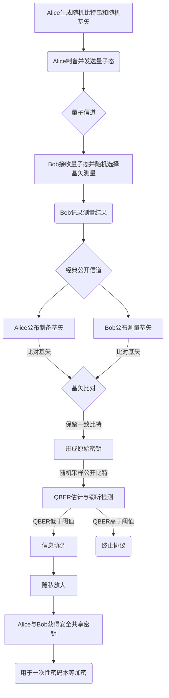

你好，我是 qmwneb946，你们的老朋友。今天，我们要一起踏上一段探索之旅，深入到量子世界最迷人也最关键的领域之一：**量子通信的安全性证明**。

在数字化浪潮席卷全球的今天，信息安全无疑是数字文明的基石。我们所依赖的经典密码学，如RSA、ECC，其安全性通常基于数学难题的计算复杂性。然而，随着量子计算的曙光初现，这些曾经被认为“牢不可破”的加密体系正面临前所未有的挑战。量子通信，特别是量子密钥分发（Quantum Key Distribution, QKD），被誉为能够提供“信息论安全”的未来技术，它承诺即使拥有无限计算能力的窃听者也无法窃取信息。

但是，等等，你可能会问：这听起来像是科幻小说，真的能做到吗？“信息论安全”到底意味着什么？我们如何才能 *证明* 这种安全性？这不就像是声称某种魔法无懈可击，却无法给出理由吗？

不，这不是魔法。这正是量子力学的深邃之美与严谨数学的完美结合。量子通信的安全性，并非基于某个“很困难”的数学问题，而是植根于物理学最基本的原理——不确定性原理、不可克隆定理以及量子纠缠的特性。这意味着，其安全性不依赖于未来计算能力的提升，理论上可以做到真正的“一劳永逸”。

然而，要将这些物理原理转化为可以信任的、在实际世界中运行的密码学协议，并证明其在各种攻击模型下的安全性，却是一个极其复杂且充满挑战的科学和工程问题。今天，我将带你一层层拨开这些迷雾，从最基础的量子概念出发，逐步深入到量子通信安全性证明的数学框架、所面临的挑战，以及科学家们如何构建起这道未来安全的物理屏障。

这不是一篇轻松的科普文，但也不是艰涩的学术论文。我将尽力用清晰的语言、恰当的类比，配合必要的数学公式和概念，为你展现量子通信安全性证明的全貌。如果你对物理、数学、计算机科学有那么一点点热情，并渴望窥探未来信息安全的奥秘，那么，请系好安全带，我们即将起飞。

---

## 经典密码学的局限与量子通信的崛起

### 经典密码学的计算复杂性基石

在深入量子通信之前，我们先快速回顾一下我们今天所熟悉的经典密码学。无论是保障你网上购物安全的SSL/TLS协议，还是保护你银行账户的密码体系，它们的核心都依赖于一套精心设计的算法。这些算法的安全性，普遍建立在某些“数学难题”的计算复杂性上。

例如，大名鼎鼎的RSA算法，其安全性依赖于“大整数分解”的困难性。如果你有一个巨大的整数，它是两个大素数的乘积，那么在不知道这两个素数的情况下，想把它分解出来，对于当前的经典计算机来说，所需时间是天文数字。同样的，椭圆曲线密码学（ECC）依赖于“椭圆曲线上的离散对数问题”的困难性。这些问题之所以“困难”，是因为目前还没有已知的经典算法能够在合理的时间内解决它们。

但请注意这个关键词：“目前还没有已知”。这并不是一个绝对的保证。随着计算能力的提升，以及更高效算法的出现，这些“困难”的问题在理论上都有可能被攻克。历史上，我们已经看到过这种“攻克”：例如，早期的密码学曾依赖于较小整数的因数分解，但随着计算能力的提升，这些问题变得不再困难，相应的密码体系也就不再安全了。

### 量子计算的幽灵：Shor算法

真正让经典密码学家们感到不安的是量子计算机的出现。虽然目前通用量子计算机还处于早期发展阶段，但其理论潜力已经足以改写整个密码学格局。这其中最著名的，莫过于**Shor算法**。

在1994年，彼得·秀尔（Peter Shor）提出了一种量子算法，能够在多项式时间内分解大整数。这意味着，一旦有足够强大的量子计算机问世，RSA、Diffie-Hellman等依赖大整数分解或离散对数问题的公钥密码体系将瞬间崩溃，不再安全。这并非计算能力的线性提升，而是一种根本性的算法突破。

这个威胁是真实而迫在眉睫的。许多国家和机构已经开始投入巨资研究后量子密码学（Post-Quantum Cryptography, PQC），试图设计出能够抵抗量子计算机攻击的经典算法。然而，PQC仍然是基于计算复杂性假设，我们无法绝对保证未来不会有更强大的量子算法来破解它们。

### 量子通信的应运而生

面对量子计算的潜在威胁，科学家们开始寻找一种能够提供更高级别安全性的解决方案，一种不依赖于计算复杂性假设的解决方案。答案，出人意料地，就在量子力学本身之中。这就是**量子通信**，特别是**量子密钥分发（Quantum Key Distribution, QKD）**。

QKD并非用于直接传输我们日常交流的秘密信息，它主要用于分发一个共享的、随机的密钥。一旦通信双方安全地共享了这个密钥，他们就可以使用“一次性密码本”（One-Time Pad, OTP）这样的经典密码学方法来加密和解密信息。OTP被证明是信息论安全的，只要密钥满足以下条件：

1.  与明文等长。
2.  真正随机。
3.  只使用一次。

而QKD协议，正是致力于解决密钥分发过程中的安全性问题。它的核心思想是利用量子力学的一些基本原理，来确保窃听者在获取任何关于密钥的信息时，都会不可避免地留下痕迹，从而被通信双方发现。这种安全性是**信息论安全（Information-Theoretic Security）**，意味着即使窃听者拥有无限的计算能力，也无法在不被发现的情况下获取密钥的任何有用信息。这与经典密码学的“计算安全性”有着本质的区别。

---

## 量子密钥分发（QKD）的基础原理：BB84协议

在众多的QKD协议中，由查尔斯·贝内特（Charles Bennett）和吉尔斯·布拉萨德（Gilles Brassard）于1984年提出的BB84协议，是最早也是最经典的协议，它奠定了QKD的理论基础。理解BB84是理解QKD安全性的关键。

### 量子比特与测量基矢

在经典计算机中，信息以比特（0或1）的形式存在。在量子计算机和量子通信中，信息以量子比特（qubit）的形式存在。一个量子比特可以处于0态、1态，或者它们的叠加态。对于BB84协议，我们通常使用光子的偏振态来编码量子比特。

我们可以选择两种不同的测量基矢来测量光子的偏振：
1.  **直线基（Rectilinear Basis）**：包含垂直偏振（$| \uparrow \rangle$ 或 $0$）和水平偏振（$| \rightarrow \rangle$ 或 $1$）。
2.  **对角基（Diagonal Basis）**：包含 $45^\circ$ 偏振（$| \nearrow \rangle$ 或 $0$）和 $135^\circ$ 偏振（$| \nwarrow \rangle$ 或 $1$）。

在量子力学中，一个光子如果以某种偏振态制备，并以相应的测量基矢去测量，则会以100%的概率得到预期的结果。例如，制备一个水平偏振光子，用直线基测量，结果一定是水平偏振。然而，如果用一个不兼容的基矢去测量，结果将是随机的，并且原始状态会被测量行为扰动。例如，制备一个水平偏振光子，用对角基测量，结果将是 $45^\circ$ 偏振和 $135^\circ$ 偏振各以50%的概率出现，且测量后光子的状态将塌缩到被测得的偏振态。

这就是QKD安全性的核心物理基础：**测量会扰动量子态**。

### BB84协议的步骤

BB84协议通常涉及两位参与者：发送方爱丽丝（Alice）和接收方鲍勃（Bob），以及一个潜在的窃听者夏娃（Eve）。

1.  **光子制备与发送（Alice）**
    *   Alice随机生成一个比特串（例如1011001…）。
    *   对于每个比特，Alice随机选择一个测量基矢（直线基或对角基），并根据比特值制备相应偏振态的光子。
        *   如果比特是0：直线基选 $| \uparrow \rangle$；对角基选 $| \nearrow \rangle$。
        *   如果比特是1：直线基选 $| \rightarrow \rangle$；对角基选 $| \nwarrow \rangle$。
    *   Alice将这些制备好的光子逐个通过量子信道发送给Bob。
    *   例如：
        | 原始比特 | 随机选择基矢 | 制备量子态 |
        | :------- | :----------- | :--------- |
        | 0        | 直线         | $| \uparrow \rangle$ |
        | 1        | 对角         | $| \nwarrow \rangle$ |
        | 1        | 直线         | $| \rightarrow \rangle$ |
        | 0        | 对角         | $| \nearrow \rangle$ |
        | …        | …            | …          |

2.  **光子测量（Bob）**
    *   Bob接收到光子后，对于每一个光子，他也会随机选择一个测量基矢（直线基或对角基）进行测量。
    *   他记录下测量结果，但此时他还不知道这些结果对应的原始比特是什么，因为他选择的基矢可能与Alice制备的基矢不同。
    *   例如：
        | 接收量子态 | Bob随机选择基矢 | Bob测量结果 |
        | :--------- | :-------------- | :---------- |
        | $| \uparrow \rangle$ | 直线            | 垂直（0）   |
        | $| \nwarrow \rangle$ | 直线            | 随机（可能是水平或垂直） |
        | $| \rightarrow \rangle$ | 对角            | 随机（可能是45或135） |
        | $| \nearrow \rangle$ | 对角            | 45（0）     |
        | …          | …               | …           |

3.  **基矢比对（公开信道）**
    *   在Bob完成所有测量后，Alice和Bob通过一个公开信道（例如普通互联网或电话）进行通信。
    *   Alice公布她为每个光子选择的基矢序列，Bob也公布他为每个光子选择的基矢序列。
    *   他们比较这些基矢序列，保留那些基矢选择一致的比特，丢弃那些基矢选择不一致的比特。这些保留下来的比特构成了一个**原始密钥（Raw Key）**。
    *   在基矢选择一致的情况下，Bob的测量结果与Alice发送的原始比特是相同的。
    *   例如：
        | Alice原始比特 | Alice基矢 | Bob基矢 | Bob测量结果 | 基矢是否一致 | 原始密钥比特 |
        | :------------ | :-------- | :------ | :---------- | :----------- | :----------- |
        | 0             | 直线      | 直线    | 0           | 是           | 0            |
        | 1             | 对角      | 直线    | 随机        | 否           | 丢弃         |
        | 1             | 直线      | 对角    | 随机        | 否           | 丢弃         |
        | 0             | 对角      | 对角    | 0           | 是           | 0            |
        | …             | …         | …       | …           | …            | …            |

4.  **错误率估计与窃听检测**
    *   从原始密钥中，Alice和Bob随机选择一小部分比特（通常是公开这部分比特的值）。
    *   他们比较这些公开的比特，计算**量子比特误码率（Quantum Bit Error Rate, QBER）**。
    *   如果没有窃听者Eve，那么QBER应该很低，主要由量子信道中的噪声和设备不完善引起。
    *   如果Eve在量子信道中进行了窃听，根据量子力学的原理，她的测量行为必然会扰动一些量子态。当Alice和Bob进行基矢比对和结果核对时，这些扰动就会反映在QBER的异常升高上。
    *   如果QBER超过预设的阈值（例如，对BB84协议而言，这个阈值通常约为11%），Alice和Bob就会认为信道不安全或存在窃听，并终止协议，放弃本次密钥协商。

5.  **信息协调（Information Reconciliation）**
    *   即使没有窃听，由于量子信道中的噪声或设备误差，Alice和Bob的原始密钥中仍可能存在少量不一致的比特。
    *   信息协调阶段旨在纠正这些不一致。Alice和Bob通过公开信道交换校验信息，使用经典纠错码（如级联协议Cascade Protocol、LDPC码等）来同步他们的密钥，并消除差异。
    *   这个过程是公开的，Eve可以观察到交换的所有信息。因此，信息协调必然会泄露一部分关于密钥的信息给Eve。

6.  **隐私放大（Privacy Amplification）**
    *   在信息协调之后，Alice和Bob的密钥完全一致了。然而，由于信息协调过程的公开性，以及Eve在窃听检测阶段可能窃取到的少量信息（即使QBER在安全阈值内），Eve仍然可能对最终密钥拥有一定程度的部分信息。
    *   隐私放大是QKD协议中至关重要的一步，它旨在消除Eve可能获得的任何信息。
    *   Alice和Bob共同选择一个安全的散列函数（Hash Function），将较长的、可能部分泄露的密钥压缩成一个较短的、与Eve已知信息无关的新密钥。
    *   例如，使用**通用哈希族（Universal Hash Functions）**。假设Alice和Bob有一个长度为$N$的共享比特串$K_{raw}$，Eve可能拥有关于$K_{raw}$的一些信息。他们选择一个随机的哈希函数$h: \{0,1\}^N \rightarrow \{0,1\}^L$（$L < N$），并计算$K_{final} = h(K_{raw})$。通过适当的选择$L$，可以证明Eve在$K_{final}$上的信息接近于零。
    *   经过隐私放大后得到的最终密钥，才是真正安全的共享密钥，可用于后续的加密通信。

### 总结BB84的流程图

BB84协议之所以被称为信息论安全，正是因为它利用了量子力学的两个核心原理：**不确定性原理**和**不可克隆定理**。

---

## 量子通信安全性的核心支柱

量子力学为量子通信提供了得天独厚的安全优势，这主要归功于以下几个基本原理：

### 不可克隆定理 (No-Cloning Theorem)

**原理描述：** 1982年由沃特斯（Wootters）和祖雷克（Zurek）等人证明，没有任何物理过程能够完美地复制一个未知任意量子态。简单来说，你无法在不扰动原量子态的情况下，创造出一个与原量子态完全相同的副本。

**对安全性的影响：** 想象一下窃听者Eve试图窃取光子。如果她想在不被发现的情况下获取光子的信息，她最直观的办法就是复制这个光子：复制一份自己测量，然后把原始的或者复制的光子发给Bob。这样，Alice和Bob就以为信道是安全的。然而，不可克隆定理明确指出，这是不可能的。Eve无法完美地复制Alice发送的未知偏振态光子。如果她试图复制，她只能通过某种测量操作，而一旦测量，她就会扰动光子，并只能得到某个特定基矢下的结果。

这意味着，Eve无法偷偷地“旁听”量子通信。她每一次试图获取信息的操作，都会对量子态造成不可逆转的改变。

### 不确定性原理 (Uncertainty Principle)

**原理描述：** 由海森堡（Heisenberg）于1927年提出。它指出，不可能同时精确地测量一个粒子的某些互补物理量。例如，你无法同时精确地知道一个粒子的位置和动量。在量子通信中，这意味着你无法同时精确地知道光子在两个互补基矢（如直线基和对角基）下的偏振态。

**对安全性的影响：** 在BB84协议中，Alice在直线基和对角基之间随机选择来编码信息。这两个基矢是互补的。如果Eve试图拦截光子并测量，她也必须选择一个测量基矢。
*   如果她选择了与Alice发送时相同的基矢，她会得到正确的结果，但她不知道Alice选择了哪个基矢。
*   如果她选择了与Alice发送时不同的基矢（正如Bob在随机测量时也可能选错基矢一样），那么她的测量行为就会以50%的概率改变光子的原始状态，并且她的测量结果也是随机的。

无论哪种情况，当Eve将她测得（或扰动后）的光子发送给Bob时，她引入的错误将导致Bob和Alice之间最终计算出的QBER升高。这种错误率的异常升高，就是Alice和Bob发现窃听的信号。Eve无法绕过这个物理定律，她获取的信息越多，她引入的错误就越多，从而越容易被发现。

### 纠缠特性 (Entanglement Properties)

虽然BB84是基于单光子偏振态的协议，但也有其他QKD协议，如EPR协议（由爱因斯坦、波多尔斯基和罗森提出，后经贝尔改进），是基于量子纠缠的。

**原理描述：** 量子纠缠是一种奇特的量子现象，当两个或多个粒子处于纠缠态时，它们之间会存在一种非局域的关联。即使它们相距遥远，对其中一个粒子的测量会瞬时影响到另一个粒子的状态。

**对安全性的影响：** 在纠缠态QKD协议中，Alice和Bob各自持有一个纠缠粒子对中的一个粒子。他们对各自粒子的测量结果表现出强烈的量子关联。如果Eve试图窃听，她必须与纠缠态中的一个粒子相互作用，这会破坏纠缠的关联性。通过贝尔不等式的违背测试，Alice和Bob可以检测到这种关联性的破坏，从而发现Eve的存在。

总而言之，这些量子力学原理共同构建了量子通信的物理防线。它们不是计算复杂性的假设，而是宇宙运行的基本法则。这是量子通信被认为可以提供“无条件安全”或“信息论安全”的根本原因。

---

## 安全性证明的哲学与挑战

既然量子通信声称能提供“信息论安全”，那么这种“安全性证明”到底意味着什么？它与经典密码学的安全性分析有何不同？我们又要如何面对现实世界中的种种不完美和挑战？

### 什么是“安全性证明”？

在密码学中，“安全性证明”通常意味着一个严谨的数学论证，它基于一组明确定义的假设，来证明某个密码学协议在特定敌手模型下能够达到预期的安全目标。

#### 信息论安全性 (Information-Theoretic Security) vs. 计算安全性 (Computational Security)

这是量子密码学与经典密码学最核心的区别：
*   **计算安全性：** 依赖于敌手**计算能力有限**的假设。例如，RSA的安全性依赖于“没有快速算法能够分解大整数”的假设。如果未来出现高效的量子算法，或者经典算法取得了突破，这种安全性就会失效。这是一种“相对安全”。
*   **信息论安全性：** 不依赖于敌手计算能力的假设。它意味着即使敌手拥有**无限的计算能力**，也无法从协议中获得有用的信息，或者无法在不被发现的情况下成功攻击。量子通信的目标就是实现信息论安全，其安全性根植于物理定律。这是一种“绝对安全”或“无条件安全”。

#### 理想安全性 (Perfect Security) vs. 渐近安全性 (Asymptotic Security) vs. 有限码长安全性 (Finite-Key Security)

在讨论安全性时，我们还需要区分不同的安全级别：
*   **理想安全性：** 理论上完美无瑕的安全性。例如一次性密码本（OTP），如果密钥是真正随机、与明文等长且只使用一次，那么即使Eve拥有无穷计算能力，也无法从密文中获取任何关于明文的信息。
*   **渐近安全性：** 假设协议运行的次数（传输的量子比特数量）趋于无穷大时，协议能够达到信息论安全。这在理论分析中非常有用，因为它简化了数学模型，可以忽略一些有限样本下的统计涨落。许多早期和核心的QKD安全性证明都是渐近安全的。
*   **有限码长安全性：** 考虑到实际QKD系统只能传输有限数量的量子比特（不可能无穷多），并且测量样本也有限。在这种情况下，统计涨落是不可避免的，需要更精细的数学工具来量化Eve可能获得的信息，并据此计算出安全密钥的实际长度。这是目前QKD安全性证明研究的热点和难点，因为它更贴近实际应用。

### 敌手模型 (Adversary Models)

安全性证明必须明确假定敌手（Eve）的能力。对QKD而言，我们需要考虑一个**最强大的、最恶意的**Eve，来确保协议在最坏情况下的安全性。

*   **无界计算能力 (Unbounded Computational Power)：** 无论Eve的计算机有多么强大，甚至拥有理想的量子计算机，她也无法在不被发现的情况下攻破协议。这是信息论安全的核心假设。
*   **量子记忆 (Quantum Memory)：** Eve可以存储量子态，并在之后进行任意操作。这比简单的“测量-重发”攻击更复杂，因为Eve可以等待Alice和Bob公布基矢后再进行最佳测量。安全性证明需要考虑这种情况。
*   **量子操作 (Quantum Operations)：** Eve可以执行任意量子操作，包括对多个量子比特的联合测量、量子纠缠等。这意味着Eve可以执行“相干攻击”（Coherent Attacks），而不是仅仅对单个量子比特进行独立操作。
*   **旁信道攻击 (Side-Channel Attacks)：** 这是一类现实世界中最致命的攻击。它们不针对协议本身的物理原理，而是利用QKD设备（光源、探测器、调制器等）在物理实现上的不完美、漏洞或泄露的物理信息。例如，探测器的效率不均匀性、对探测器进行“致盲”操作、光源发射了多光子脉冲等。这使得安全性证明变得复杂，因为它们需要考虑的不仅仅是理想的量子物理模型，还要考虑现实设备的物理特性。

### 挑战：现实世界的非理想性

尽管量子力学原理提供了强大的安全保障，但将这些原理转化为实际可用的设备并证明其安全性，却充满了挑战：

1.  **损耗（Loss）：** 光子在光纤中传输时会衰减。远程QKD意味着大量光子的丢失，导致密钥率降低。
2.  **噪声（Noise）：** 信道中存在环境噪声，以及探测器暗计数等固有噪声，这些都会引入误码，即使没有窃听者。
3.  **探测器效率（Detector Efficiency）：** 实际探测器效率远非100%，许多到达的单光子无法被探测到。
4.  **光源缺陷（Source Imperfections）：** 理想的QKD协议要求单光子源。但现实中常用的是**弱相干光源（Weak Coherent Pulse, WCP）**，它以泊松分布发射光子，有一定概率发射多于一个光子的脉冲。如果Eve捕获了多光子脉冲中的一个，而让其余光子到达Bob，那么Eve就可以在不被发现的情况下获取信息。
5.  **旁信道（Side Channels）：** 这是安全性证明中最难完全覆盖的部分。设备的温度、电磁辐射、时序信息，甚至远程操控探测器使其失效等，都可能构成旁信道攻击，绕过协议本身的物理安全性。

所有这些现实世界的不完美都会影响最终密钥的生成率和安全性。一个健壮的安全性证明必须能够量化这些不完美对窃听者信息增益的影响，并确保即使在这些非理想条件下，最终生成的密钥仍然是安全的。这使得安全性证明从纯粹的理论分析，扩展到了需要考虑实际物理系统特性的复杂领域。

---

## 渐近安全性证明

在安全性证明的早期研究中，为了简化分析，科学家们通常假设QKD协议能够传输无限数量的量子态。这种“无限次”的理想化设定，允许我们采用一些强大的数学工具，从而推导出协议的渐近安全性。

### 纠缠蒸馏思想 (Entanglement Distillation Idea)

要理解渐近安全性证明，一个核心思想是将任何QKD协议（例如BB84）等效地看作是一个**纠缠蒸馏协议**。这个思想由德维特（Devetak）和温特（Winter）提出。

**核心思想：**
1.  **准备阶段：** Alice制备一个量子态并发给Bob，或者Alice和Bob共享一个纠缠态。在BB84中，Alice制备偏振光子并发给Bob，这可以等效为Alice和Bob共享一个**混态（Mixed State）**纠缠对，其中混态包含了由于信道噪声或Eve窃听而导致的退相干。
2.  **测量阶段：** Bob对接收到的量子态进行测量。这可以等效于Alice和Bob对他们共享的纠缠对进行某种局部测量。
3.  **经典通信与纠缠蒸馏：** Alice和Bob通过经典公开信道进行信息协调和隐私放大。在纠缠蒸馏的视角下，这等效于他们通过公开通信来“提纯”他们共享的纠缠态，将其中的噪声和窃听信息去除，从而得到一个更高纯度、更接近理想的贝尔态的纠缠对。
4.  **密钥提取：** 一旦获得了高纯度的纠缠态，Alice和Bob对各自的纠缠粒子进行贝尔态测量，就可以提取出高度相关的、安全的经典比特，形成共享密钥。

**为什么要这么做？**
将QKD协议等效为纠缠蒸馏协议，使得分析变得更加普适和简洁。因为量子信息理论在分析纠缠态的性质方面有非常成熟的工具。一个经过蒸馏的纠缠态的“纯度”越高，Eve可以从中获取的信息就越少，因此提取出的密钥就越安全。通过计算蒸馏后纠缠态的量子互信息，可以量化Eve所能掌握的信息量，进而确定可提取的安全密钥长度。

### De Finetti 定理 (De Finetti Theorem)

De Finetti定理是一个强大的数学工具，它在量子信息论中被广泛应用于安全性证明。它最初是概率论中的一个概念，后来被推广到量子领域。

**核心思想：**
*   **经典De Finetti定理：** 如果一系列随机变量是可交换的（即它们的联合概率分布在变量顺序的任意置换下保持不变），那么它们可以被看作是独立同分布地从某个隐藏的、但固定的概率分布中抽样出来的。
*   **量子De Finetti定理（或量子可交换定理）：** 对于一系列可交换的量子态（即Eve对多个量子比特的联合操作，其结果不依赖于量子比特的顺序），我们可以将其视为独立的量子态。
    *   在QKD中，这意味着对于Eve的**相干攻击（Coherent Attacks）**，如果其行为在每个发送的量子比特上表现出某种对称性（可交换性），那么我们可以将这种复杂的相干攻击简化为一系列对单个量子比特的**集体攻击（Collective Attacks）**。
    *   **集体攻击**：Eve对每个发送的量子比特独立地执行相同的操作（例如，进行测量并重发，或者与一个辅助量子比特纠缠）。
    *   **相干攻击**：Eve可以对所有传输的量子比特进行一个复杂的、联合的量子操作。相干攻击通常被认为是比集体攻击更强大的攻击。

**对安全性证明的应用：**
量子De Finetti定理的重要性在于，它极大地简化了安全性证明的复杂性。如果一个QKD协议能够证明在集体攻击下是安全的，并且Eve的相干攻击可以等效地看作是一种可交换的操作，那么根据De Finetti定理，这个协议在相干攻击下也是安全的。这避免了直接分析极其复杂的通用相干攻击。

### 平滑熵 (Smooth Min-Entropy)

要量化密钥的随机性和Eve获得的信息，我们需要使用量子信息论中的熵概念。在渐近和有限码长安全性证明中，**平滑熵**是一个非常重要的概念，尤其是**平滑最小熵（Smooth Min-Entropy）**。

**熵的概念：**
*   **冯诺依曼熵 ($S(\rho)$)：** 量子态 $\rho$ 的不确定性度量，类似于经典信息论中的香农熵。
*   **条件冯诺依曼熵 ($S(A|B)$)：** 在已知B的情况下，A的不确定性。
*   **量子互信息 ($I(A:B)$)：** A和B之间共享的信息量。

**最小熵 ($H_{\min}(X|E)$)：**
*   最小熵是用来量化一个随机变量X在给定另一个随机变量E（Eve的知识）的情况下，能够提取出多少“真正随机”的密钥。
*   $H_{\min}(X|E)$ 越高，说明X的随机性越强，Eve知道的越少。
*   更精确地说，$2^{-H_{\min}(X|E)}$ 表示在给定Eve知识E的情况下，X是某个特定值的最大概率。

**平滑最小熵 ($H_{\min}^\epsilon(X|E)$)：**
*   最小熵的一个问题是它对微小的扰动非常敏感。现实世界中的量子态总是存在噪声和误差。
*   平滑最小熵是在最小熵的基础上引入了一个“平滑”参数 $\epsilon$。这意味着我们允许量子态与一个理想的、具有高最小熵的量子态之间存在一个很小的距离（通常用迹距离衡量）。
*   $H_{\min}^\epsilon(X|E)$ 表示在 $\epsilon$ 误差范围内，Eve所能获得的关于X信息的上限。
*   **其重要性：** 它提供了一个对密钥随机性更鲁棒的度量。它告诉我们，即使在存在少量噪声和误差的情况下，我们仍然可以从中提取出多少“近似安全”的密钥。这是从理论上的“完美随机”到实际中的“足够随机”的关键桥梁。
*   在QKD安全性证明中，最终的安全密钥长度通常由平滑最小熵来确定，因为它直接关联到通过隐私放大后密钥的安全性。

### 信息协调和隐私放大的作用

这两个后处理步骤在安全性证明中起着决定性作用。

*   **信息协调（Information Reconciliation）：** 目标是纠正Alice和Bob原始密钥中的所有错误，使他们拥有完全相同的密钥。安全性证明必须考虑到这个过程中通过公开信道泄露给Eve的信息量。通常用**纠错码的泄漏信息量**来表示。
*   **隐私放大（Privacy Amplification）：** 这是将可能被Eve部分知晓的较长密钥，压缩成一个对Eve来说是完全随机的较短密钥的过程。
    *   它的数学基础是**通用哈希族（Universal Hash Functions）**。如果从一个通用哈希族中随机选择一个哈希函数$h$，并将原始密钥$K_{raw}$映射为$h(K_{raw})$，那么只要$h(K_{raw})$的长度足够短，就可以保证Eve在最终密钥上的信息量极其微小。
    *   密钥长度的计算公式通常会包括：
        *   原始密钥的长度。
        *   从平滑最小熵估算的Eve拥有的信息量。
        *   信息协调泄露的信息量。
        *   一个小误差项（与 $\epsilon$ 相关）。

### 密钥率公式 (Key Rate Formula)

通过上述概念，我们可以推导出QKD协议的密钥率公式。密钥率指的是每传输一个量子比特能够最终提取出的安全经典比特数量。这是一个衡量QKD系统效率和安全性的核心指标。

以渐近安全的BB84协议为例，其密钥率 $R$（每量子比特的安全比特数）的简化公式通常是这样的：

$$ R \ge q \cdot [1 - H(e_Z) - H(e_X) - Leak_{rec}] $$

或者更常见的形式：

$$ R \ge q \cdot [1 - h(e_Z) - \chi_{info\_rec}(e_Z)] $$

其中：
*   $q$: 通常是 $1/2$，因为Alice和Bob在基矢比对后，只有大约一半的量子比特是基矢匹配的。
*   $h(x) = -x \log_2(x) - (1-x) \log_2(1-x)$ 是**二进制熵函数**，它量化了在给定误码率 $x$ 时，Eve在测量结果中能获取的最大信息量。
*   $e_Z$ (或 $e_{bit}$): 在匹配基矢中检测到的误码率（通常指比特误码率QBER）。这部分误码可能是由信道噪声或Eve的窃听引起的。
*   $e_X$ (或 $e_{phase}$): 在非匹配基矢中（或等效地，通过相位信息）估算的误码率。这部分误码率是隐私放大需要抵消的窃听信息来源。在某些证明中，$e_Z$ 和 $e_X$ 都会用到。
*   $Leak_{rec}$ (或 $\chi_{info\_rec}(e_Z)$): 信息协调过程泄露给Eve的信息量，通常与误码率 $e_Z$ 和所使用的纠错码效率相关。

这个公式的物理意义是：最终可获得的密钥长度等于原始密钥长度减去Eve可能获得的所有信息量（通过误码率体现的窃听信息，以及信息协调泄露的信息）。如果这个 $R$ 值是正的，就说明可以提取出安全的密钥；如果为负，则说明无法提取安全密钥。

**渐近安全性证明的局限：**
尽管渐近安全性证明提供了一个强大的理论框架，但它们忽略了现实世界中的许多重要因素，特别是**有限码长效应**。当发送的量子比特数量有限时，统计涨落会变得很重要，QBER的估计值可能不准确，这些都会影响最终密钥的安全性。这就引出了对**有限码长安全性证明**的需求。

---

## 有限码长安全性证明

在真实世界中，量子密钥分发系统不可能传输无穷多的量子比特。我们每次运行协议，都只能发送有限数量的脉冲，这就意味着我们能够收集到的数据（例如QBER的样本）也是有限的。这种有限性引入了统计涨落，对安全性证明提出了更高的要求。**有限码长安全性证明（Finite-Key Security Proofs）**正是为了解决这个问题而生。

### 为什么需要有限码长安全性证明？

渐近安全性证明在数学上优雅，但它们在实际应用中存在以下局限：
1.  **统计涨落：** 当我们只有有限数量的测量样本时，通过这些样本估算出的参数（如QBER）可能与真实值存在偏差。例如，我们观测到的QBER是 $e_{obs}$，但Eve实际引入的QBER可能是 $e_{real}$，我们只能通过统计方法推断 $e_{real}$ 的可能范围。这种不确定性必须被纳入安全性分析。
2.  **安全裕度：** 为了保证在最坏情况下的安全，有限码长证明通常会要求更大的“安全裕度”，这意味着在给定条件下，提取出的安全密钥长度会比渐近证明的结果要短。
3.  **密钥截断：** 如果不考虑有限码长效应，Eve可能通过对少数几次通信的精确统计推断，在Alice和Bob不知情的情况下获得更多信息。

### 核心思想与挑战

有限码长安全性证明的核心思想是，在协议运行的有限次数下，量化Eve能够获得的关于最终密钥的最大信息量，从而确定一个**严格的安全界限**。这需要更精密的数学工具。

**主要挑战：**
*   **统计推断：** 如何从有限样本数据中，可靠地推断出Eve在整个通信过程中可能获得的信息上限。
*   **误差传播：** 协议的每个阶段（如QBER估计、信息协调、隐私放大）都会有误差和不确定性，这些误差如何累积并影响最终密钥的安全性。
*   **最坏情况分析：** 在有限样本下，如何识别Eve最强大的攻击策略。

### 关键数学工具

为了克服有限码长带来的挑战，安全性证明引入了一系列强大的概率论和量子信息论工具：

1.  **Hoeffding不等式 (Hoeffding's Inequality) / Chernoff界 (Chernoff Bounds)：**
    *   这些是概率论中的重要工具，用于给出随机变量偏差其期望值的概率上限。
    *   **应用：** 在QKD中，Alice和Bob通过有限次采样来估计QBER。Hoeffding不等式可以帮助我们计算，在观察到某个QBER $e_{obs}$ 的情况下，实际QBER $e_{real}$ （由Eve引入的）有多大概率落在某个区间内。这使得我们可以在一个非常高的置信水平下（例如， $1-10^{-10}$ 的概率，确保安全性），为Eve可能引入的最高误码率设置一个上限。这个上限将被用来计算最坏情况下的可提取密钥长度。

2.  **平滑熵的精确应用：**
    *   如前所述，平滑最小熵 $H_{\min}^\epsilon(X|E)$ 是衡量 Eve 知识上限的关键。在有限码长情况下，这个 $\epsilon$ 参数变得更加重要。它代表了安全性证明所允许的“安全失效率”。例如，一个 $\epsilon = 10^{-9}$ 的证明，意味着协议失败（即Eve获得超出预期的信息）的概率不高于 $10^{-9}$。这个参数与最终密钥的长度直接相关。$\epsilon$ 越小，安全密钥的长度通常也越短，但安全保障越强。

3.  **操作量化 (Operational Quantification)：**
    *   有限码长证明通常直接关注协议的最终输出——安全密钥，并量化Eve在给定协议输出上的信息。这涉及将隐私放大过程建模为一个信息提取过程，并使用平滑熵来精确计算可以提取的密钥数量。

### 密钥率的下降

在有限码长下，可提取的安全密钥率会显著低于渐近情况。这是因为：
*   **统计安全开销：** 需要预留一部分比特来抵消由于有限样本导致的统计不确定性。样本量越大，这种开销越小。
*   **隐私放大开销：** 隐私放大本身需要将原始密钥压缩，使得最终密钥长度变短。
*   **纠错开销：** 信息协调所需的经典通信量。

因此，有限码长密钥率公式通常会比渐近公式复杂得多，并且会包含与总发送量子比特数量 $N$ 和安全参数 $\epsilon$ 相关的项。例如，一个简化的有限码长密钥率 $R_N$ 可能形如：

$$ R_N \ge \frac{1}{N} [N_M \cdot (1 - h(e_Z^{up}) - Leak_{rec}) - \delta(N, \epsilon)] $$

其中：
*   $N_M$: 基矢匹配的量子比特数量。
*   $e_Z^{up}$: 基于统计上界估算的比特误码率上限。
*   $\delta(N, \epsilon)$: 一个与总比特数 $N$ 和安全参数 $\epsilon$ 相关的误差项，它会随着 $N$ 增加而减小，但总是非负的。

**实际应用：**
有限码长安全性证明对于实际QKD系统的部署至关重要。它允许研究人员和工程师在给定系统参数（如信道损耗、QBER、发送脉冲数量）和所需安全级别（$\epsilon$）的情况下，精确地计算出实际可用的安全密钥长度。这为QKD系统的设计、优化和认证提供了坚实的理论依据。

---

## 设备无关（Device-Independent）和测量设备无关（Measurement-Device-Independent）安全性

在现实世界中，QKD设备的物理实现总是不完美的。例如，光源可能不是理想的单光子源，探测器可能存在效率不均匀或可被远程控制的漏洞。这些缺陷可能导致**旁信道攻击（Side-Channel Attacks）**，绕过QKD协议本身的物理安全性。为了解决这些问题，研究人员提出了更高级的安全性概念：设备无关（DI）和测量设备无关（MDI）安全性。

### 设备无关QKD (Device-Independent QKD, DI-QKD)

**动机：**
最严格的安全性要求，是即使设备制造商是恶意的，或者设备本身存在未知漏洞，协议也能保证安全。DI-QKD旨在实现这种级别的安全性。它不信任任何内部设备，将QKD设备视为“黑箱”。

**原理：**
DI-QKD的安全性不依赖于对QKD设备内部工作原理或参数的任何假设。它的安全性完全基于**贝尔不等式（Bell Inequality）的违背**。
1.  **贝尔不等式：** 经典物理学认为，任何局域隐变量理论都必须满足贝尔不等式。然而，量子纠缠态可以违背贝尔不等式。贝尔不等式的违背是量子力学非局域性的一个显著特征。
2.  **DI-QKD协议：** Alice和Bob共享一对纠缠粒子，并对各自的粒子进行测量。他们选择不同的测量设置，并记录结果。
3.  **安全性证明：** DI-QKD协议的安全性在于，如果Alice和Bob能够观察到足够的贝尔不等式违背（即CHSH值超过 $2\sqrt{2}$ 或其他特定阈值），那么他们可以根据这个物理现象，直接推断出他们共享的密钥是安全的，而无需信任设备内部的任何细节。贝尔不等式的违背本身就证明了量子性，以及窃听者无法完全掌握他们信息。即使Eve控制了他们所有的设备，只要贝尔不等式被违背，就意味着Eve无法知道密钥。

**挑战：**
*   **技术难度极大：** 实现贝尔不等式的充分违背，并维持足够高的纠缠质量，同时达到实际可用的密钥率，在技术上非常困难。目前大多数DI-QKD实验都局限于短距离和极低密钥率。
*   **效率极低：** 需要大量的后处理和数据丢弃，导致密钥率远低于其他QKD协议。
*   **探测效率陷阱：** 即使是DI-QKD，也需要非常高的探测器效率才能避免“探测效率漏洞”（Detection-Efficiency Loophole），否则Eve可以利用未被探测到的光子来窃取信息。

尽管DI-QKD在实践中面临巨大挑战，但它为QKD提供了最严格的理论安全保证，是未来量子网络最终安全目标的指引。

### 测量设备无关QKD (Measurement-Device-Independent QKD, MDI-QKD)

**动机：**
在所有QKD设备中，**探测器**是旁信道攻击最常见的脆弱点。例如，“致盲攻击”就是通过强光照射探测器，使其进入线性工作区，从而窃听者可以操纵探测器的输出。MDI-QKD旨在完全消除探测器端的旁信道漏洞。

**原理：**
MDI-QKD的核心思想是将**贝尔态测量**从Alice和Bob手中移交给一个**不被信任的第三方（非恶意，只是我们不信任它的设备）**。
1.  **协议流程：**
    *   Alice和Bob各自独立地制备量子态（例如，BB84中的偏振光子），并发送给一个中间的、不被信任的第三方（通常称为Charlie或测量节点）。
    *   Charlie接收到来自Alice和Bob的光子后，不进行任何单光子探测，而是执行一个**贝尔态测量（Bell State Measurement, BSM）**。BSM是一种联合测量，可以确定两个光子是否处于特定的贝尔态。
    *   Charlie公布他的BSM结果（但不公布Alice和Bob原始发送的比特）。
    *   Alice和Bob根据Charlie公布的BSM结果和自己发送的量子态信息，通过经典通信比对，判断哪些发送的量子比特可能成功地促成了BSM事件。
2.  **安全性：**
    *   由于Charlie只是执行了BSM并将结果公布，他无法区分Alice和Bob发送的量子态是来自合法通信还是Eve的窃听。即使Charlie是恶意的，他也无法获取关于最终密钥的任何信息，因为他只知道测量结果，而不知道Alice和Bob各自发送了什么。
    *   最重要的是，MDI-QKD将所有潜在的**探测器漏洞**从Alice和Bob的安全区域中移除了，因为探测器位于不被信任的Charlie处。即使Charlie的探测器存在漏洞，Eve也无法利用这些漏洞来窃取密钥，因为这些漏洞只会影响Charlie的测量结果，而不会泄露Alice和Bob的密钥信息。
    *   这使得MDI-QKD对各种探测器旁信道攻击具有天生的免疫力。

**优势：**
*   **对探测器攻击免疫：** 这是MDI-QKD最突出的优势，解决了QKD实用化中的一个主要安全问题。
*   **距离拓展：** 由于中间节点不存储密钥，MDI-QKD可以有效对抗“中间人攻击”，并有望通过建立可信中继网络，拓展QKD的通信距离。
*   **实用性高：** 相比DI-QKD，MDI-QKD的实现难度大大降低，已经在大范围光纤网络中成功演示。

### 独立于源的QKD (Source-Independent QKD)

作为MDI-QKD的延伸，进一步的安全概念是**独立于源的QKD（Source-Independent QKD）**。MDI-QKD解决了探测器漏洞，但通常仍假设Alice和Bob的光源是可信的（例如，发出完美的弱相干脉冲）。Source-Independent QKD则旨在解决光源漏洞，即使光源存在缺陷（如不完美的强度调制、旁信道泄漏等），也能保证安全性。这通常通过结合MDI-QKD和**诱骗态（Decoy-State）**协议来实现。诱骗态是用于估计多光子脉冲概率的一种技术，通过发射不同强度的光脉冲，来区分单光子脉冲和多光子脉冲的比例，从而提高WCP光源下的安全性。

---

## 攻击模型与安全性证明的鲁棒性

安全性证明的强度取决于它所考虑的敌手（Eve）的能力。一个健壮的安全性证明必须考虑到最强大的攻击模型，并证明即使在这些最坏情况下，协议依然安全。

### 集体攻击 (Collective Attacks)

这是安全性证明中首先考虑的攻击模型，也是最简单的。
*   **定义：** 窃听者Eve对Alice发送的每一个量子比特独立地进行操作。例如，她可以拦截每个光子，让它与一个辅助量子比特（probe qubit）纠缠，然后将辅助量子比特存储起来。当Alice和Bob公布基矢信息后，Eve再对每个辅助量子比特进行最佳测量，从而获取信息。
*   **分析：** 由于每个量子比特的操作都是独立的，集体攻击在数学上更容易分析。早期的QKD安全性证明大多是针对集体攻击的。

### 相干攻击 (Coherent Attacks)

这是更普遍、更强大的攻击模型，也是安全性证明的最终目标。
*   **定义：** 窃听者Eve可以对Alice发送的**所有量子比特进行一个联合的、整体的量子操作**。她不再是独立地处理每个光子，而是将所有光子作为一个整体进行测量或纠缠。这种攻击方式通常能提取更多的信息，并且引入更少的扰动。
*   **分析：** 相干攻击的分析要复杂得多，因为它涉及到多体量子态的联合操作。

**集体攻击与相干攻击的桥梁：可交换定理**
正如我们在“De Finetti定理”中提到的，量子De Finetti定理（或更广义的**可交换定理**）是连接集体攻击和相干攻击的桥梁。如果能够证明Eve的相干攻击在某种程度上是“可交换的”或对称的，那么安全性证明就可以将复杂的相干攻击简化为一系列等效的集体攻击。这意味着，如果协议在集体攻击下是安全的，并且满足可交换性假设，那么它在相干攻击下也是安全的。

然而，对于所有协议，特别是那些涉及复杂量子操作的协议，直接证明其在相干攻击下的安全性仍然是一个活跃的研究领域。现代的QKD安全性证明通常直接针对相干攻击，或者通过更复杂的量子信息论工具（如量子相对熵、数据处理不等式）来处理。

### 旁信道攻击 (Side-Channel Attacks)

旁信道攻击不针对QKD协议的量子物理原理，而是利用QKD设备在物理实现上的缺陷。这是QKD走向实用化最严峻的挑战之一。

*   **例子：**
    *   **光源漏洞：** 弱相干光源（WCP）发射多光子脉冲（如前所述，诱骗态协议可以有效应对）。
    *   **探测器漏洞：**
        *   **致盲攻击（Blinding Attack）：** Eve用强光照射Bob的雪崩光电二极管（APD）探测器，使其从单光子计数模式进入线性工作模式，Eve可以精确控制Bob的探测器响应。
        *   **效率不均匀攻击：** 探测器对不同偏振态的光子的探测效率不同，Eve可以利用这种不均匀性来获取信息。
        *   **时间戳攻击：** 探测器响应的时间与光子偏振有关，Eve可以分析时间戳来获取信息。
    *   **调制器漏洞：** 量子比特的编码器（例如，偏振调制器）可能不完美，导致泄露旁信道信息。
    *   **信道攻击：** 例如，Eve在光纤中注入“特洛伊木马”光子，这些光子被反射回Alice的设备，并泄露Alice设备内部状态的信息。

**安全性证明的局限性与解决方案：**
传统上，QKD的安全性证明通常假定了一个“理想”的物理模型，即设备是完美的，只关注量子态的传输和窃听。然而，旁信道攻击揭示了这种理想化模型的不足。

*   **局限性：** 纯理论的安全性证明无法完全覆盖所有物理实现中的旁信道漏洞。证明只能基于对设备能力的假设。
*   **解决方案：**
    1.  **MDI-QKD和DI-QKD：** 正如前面提到的，MDI-QKD通过将易受攻击的探测器移除出受信任区域，从根本上免疫了大多数探测器旁信道攻击。DI-QKD则进一步，完全不信任设备。
    2.  **诱骗态协议：** 用于应对弱相干光源的多光子漏洞。
    3.  **严格的工程实践与认证：** 除了理论证明，还需要对QKD设备进行严格的物理安全审计、测试和认证，以确保其在实际运行中没有可被利用的物理缺陷。这涉及到物理层的安全设计、噪声隔离、温度控制、电磁屏蔽等。
    4.  **新型协议：** 研究人员正在开发更多能够抵抗特定旁信道攻击的协议，例如，连续变量QKD（CV-QKD）的安全性分析也需要考虑其特有的噪声和实现挑战。

### 量子内存攻击 (Quantum Memory Attacks)

如果Eve拥有功能强大的量子内存，她可以存储Alice发送给Bob的量子态，直到Alice和Bob通过经典信道公布了基矢比对结果，Eve再根据这些公开信息，选择最佳的测量基矢对她存储的量子态进行测量，从而获取最大信息而不被发现。

*   **应对：** QKD协议的设计需要考虑到量子内存攻击。在BB84中，通过随机选择基矢和快速公布基矢信息来限制Eve利用量子内存的能力。此外，密钥协商过程的时间限制和密钥更新频率也是重要的防御措施。现代的安全性证明会明确地将Eve的量子内存能力纳入敌手模型。

### 伪随机数生成器 (Quantum Random Number Generators, QRNGs) 的安全性

QKD协议的安全性高度依赖于真正的随机数。例如，Alice和Bob随机选择基矢、Alice生成初始密钥比特都需要真正的随机性。如果这些随机数不是真正的随机，而是可预测的，那么Eve就有机可乘。
*   **重要性：** 因此，QKD系统通常会集成**量子随机数生成器（QRNGs）**，它们利用量子力学固有的随机性（如单光子通过半透镜后的路径选择、真空涨落等）来产生真正不可预测的随机数。
*   **安全性证明：** QRNG本身的安全性也需要证明，以确保其输出的随机性足以满足QKD协议的需求。

总而言之，安全性证明是一个不断演进和完善的过程。它不仅仅是纸面上的数学推导，更是与现实世界中的工程挑战和潜在攻击手段紧密结合的科学。一个真正安全的量子通信系统，必须在理论证明、工程实现和实际测试的多个层面都达到高标准。

---

## 量子通信安全性证明的数学工具箱

要进行量子通信的安全性证明，离不开一套强大的数学工具。这些工具主要来自于量子信息论、概率论和信息论。

### 量子信息论基础

量子信息论是研究量子力学原理在信息处理和通信中应用的新兴学科。

*   **密度矩阵 ($\rho$)：**
    *   在量子力学中，一个纯量子态可以用一个向量（如偏振态 $| \uparrow \rangle$）来表示。但当量子系统处于混合状态（即以一定概率处于不同的纯态）或与其他系统（如Eve的辅助系统）纠缠时，我们需要用**密度矩阵**来描述其状态。
    *   例如，一个处于水平和垂直偏振叠加态的光子，其纯态表示为 $|\psi\rangle = \alpha|H\rangle + \beta|V\rangle$。而如果一个光子以50%概率是水平偏振，50%概率是垂直偏振，其混态密度矩阵是 $\rho = \frac{1}{2}|H\rangle\langle H| + \frac{1}{2}|V\rangle\langle V|$。
    *   在安全性证明中，我们经常需要描述Eve与Alice-Bob系统相互作用后的复合系统状态，这些通常都是混合态，用密度矩阵来表示非常方便。

*   **迹距离 (Trace Distance)：**
    *   迹距离是衡量两个量子态 $\rho$ 和 $\sigma$ 之间“距离”或“可区分度”的度量。
    *   $$ D(\rho, \sigma) = \frac{1}{2} \text{Tr} |\rho - \sigma| $$
    *   其中 $|A| = \sqrt{A^\dagger A}$。
    *   **应用：** 在安全性证明中，我们经常用迹距离来量化一个实际系统所处的量子态与理想安全量子态之间的偏差。如果最终密钥与Eve的辅助系统之间的迹距离很小，那么Eve从辅助系统获取关于密钥的信息的可能性就很小。它也用于定义平滑熵中的“平滑”参数 $\epsilon$。

*   **冯诺依曼熵 ($S(\rho)$)：**
    *   冯诺依曼熵是香农熵在量子信息论中的推广，用于衡量量子态的“不确定性”或“信息量”。
    *   $$ S(\rho) = -\text{Tr}(\rho \log_2 \rho) $$
    *   **应用：** 用于分析量子信道容量、纠缠度量等。它也是计算条件熵和互信息的基础。

*   **条件熵 ($S(A|B)$)：**
    *   在经典信息论中，条件熵衡量在已知B的情况下，A的不确定性。
    *   在量子信息论中，条件冯诺依曼熵的定义更复杂，并且可以为负值（表示纠缠），但在QKD安全证明中，我们通常关心的是**条件最小熵**。
    *   **应用：** 用于量化在给定Eve的知识（E）的情况下，Alice或Bob密钥（K）的剩余不确定性 $H(K|E)$。

*   **互信息 ($I(A:B)$)：**
    *   互信息衡量两个随机变量（或量子系统）之间共享的信息量。
    *   $$ I(A:B) = S(A) + S(B) - S(A,B) $$
    *   **应用：** 用于量化Alice和Bob共享的原始密钥与Eve获取的信息之间的关联性。

### 平滑熵 (Smooth Entropies)

*   **平滑最小熵 ($H_{\min}^\epsilon(X|E)$) 和平滑最大熵 ($H_{\max}^\epsilon(X|E)$)：**
    *   这是QKD安全性证明中至关重要的概念。它们是最小熵和最大熵的推广，引入了对误差的容忍度 $\epsilon$。
    *   **最小熵 ($H_{\min}(X|E)$)：** 给定Eve的知识E，密钥X能被Eve猜到的最大概率的反函数对数，表示最坏情况下的随机性。
    *   **平滑最小熵：** 考虑与给定量子态 $\rho_{XE}$ 在迹距离 $\epsilon$ 内的“最佳”量子态 $\tilde{\rho}_{XE}$，其最小熵 $H_{\min}(\tilde{\rho}_{XE})$ 是所有此类状态中最大的。这个值代表了在考虑少量误差的情况下，可以从X中提取出的安全比特的最大数量。
    *   **应用：** 直接用于计算通过隐私放大后可以获得的**安全密钥长度**。一个QKD协议的最终密钥率公式，其核心就是基于平滑最小熵的下界。

### 概率论与统计

*   **大数定律 (Law of Large Numbers) 和中心极限定理 (Central Limit Theorem)：**
    *   **应用：** 在渐近安全性证明中，它们允许我们将有限样本的统计结果推断到无限大的情况。例如，当样本足够大时，观测到的QBER会非常接近真实QBER。
*   **Hoeffding不等式、Chernoff界等不等式：**
    *   **应用：** 在有限码长安全性证明中至关重要。它们提供了一种量化统计涨落的方法。通过这些不等式，我们可以给出在有限次测量中，估算的参数（如QBER）与真实参数之间偏差的**概率上限**。这使得我们可以在一个非常高的置信水平（例如 $1-10^{-9}$）下，确定最坏情况下的参数值，从而计算出保守的安全密钥长度。

### 优化理论

*   在许多安全性证明中，研究人员需要找到Eve可能采取的**最坏情况攻击策略**。这通常涉及一个优化问题：在满足量子力学定律和Eve能力限制的前提下，Eve如何最大化她获得的信息，同时最小化她引入的错误。
*   **应用：** 例如，在基于纠缠蒸馏的证明中，可能需要通过优化来找到与特定QBER值对应的，Eve与Alice和Bob共享的量子态的极限。

### 编码理论 (Coding Theory)

*   **信息协调：** QKD协议中，信息协调（错误纠正）是必不可少的步骤。这需要用到经典的纠错码理论，如LDPC码、Turbo码或级联协议。
*   **隐私放大：** 通用哈希族在隐私放大中扮演核心角色。哈希函数的选择及其参数对最终密钥的长度和安全性有直接影响。

这些数学工具相互协作，构建了一个严谨的框架，使得科学家们能够对量子通信协议的安全性进行深入的分析和证明。这些证明不仅仅是理论上的，它们为QKD系统的实际设计、性能评估和商业化部署提供了坚实的基础。

---

## 展望与挑战

量子通信，特别是量子密钥分发，已经从实验室里的理论概念，逐步走向了实际应用。全球首个天地一体化量子通信网络——“墨子号”量子科学实验卫星的成功，以及各地城域量子网络的建设，都预示着量子安全时代的到来。然而，量子通信的安全性证明，这个支撑其核心信任的基石，仍然是一个充满活力和挑战的领域。

### 未来发展

1.  **更高密钥率和更远距离：** 目前，QKD的密钥率和通信距离仍受限于光纤损耗和探测器效率。未来的研究将致力于开发更高效的光源、探测器和协议，以实现更高的密钥率和更远的传输距离，乃至全球范围的量子密钥分发。
2.  **网络化和量子互联网：** 独立的QKD链路只是第一步。最终目标是构建一个由量子中继器、量子存储器和各种QKD协议组成的**量子互联网**，实现全球范围内的量子安全通信。安全性证明将需要考虑更复杂的网络拓扑、多方共享密钥以及信任链模型。
3.  **集成化和小型化：** 将QKD系统集成到芯片中，实现小型化、低成本和易于部署的设备，是推动其商业化普及的关键。安全性证明需要验证这些集成系统是否仍然保持理论上的安全水平，以及是否存在新的旁信道漏洞。
4.  **后量子密码学与量子密码学的融合：** 量子通信解决密钥分发问题，而经典数据加密则由一次性密码本或未来后量子密码学算法承担。如何将量子通信与PQC算法安全无缝地结合，构建一个混合安全体系，也是重要的研究方向。
5.  **其他量子密码原语：** 除了QKD，量子指纹、量子数字签名、量子秘密共享、量子盲计算等其他量子密码学原语也在积极研究中。它们的安全性证明同样是核心议题。

### 当前挑战

1.  **成本与实用化：** 尽管技术不断进步，但QKD设备的成本仍然较高，且需要专业维护。降低成本、提高设备的易用性和可靠性是普及的关键。安全性证明需要考虑在降低成本和简化设备设计的同时，如何维持并验证其安全性。
2.  **与现有通信网络的融合：** 将QKD系统无缝集成到现有的经典通信基础设施中，是其大规模应用的重要障碍。例如，光纤信道的兼容性、网络协议栈的适配等。安全性证明需要确保在这种融合过程中不会引入新的漏洞。
3.  **标准制定和合规性：** 量子通信作为一个新兴领域，全球性的技术标准、安全评估和认证体系仍在建立中。各国政府和国际组织都在积极推动相关标准的制定。安全性证明的严谨性和可验证性是这些标准的基础。
4.  **更全面的旁信道攻击防护：** 尽管MDI-QKD等协议已经解决了部分旁信道问题，但新的攻击手段（例如，针对光源和调制器的攻击）仍在不断被发现。安全性证明必须持续迭代，以应对这些层出不穷的现实威胁，并可能需要引入更复杂的物理模型和更全面的攻击者能力假设。
5.  **对未来量子计算攻击的持续抵抗力：** QKD的安全性基于物理原理，因此理论上免疫未来量子计算机的攻击。但这并不意味着我们可以高枕无忧。例如，如果量子计算机能够实现对量子纠缠的完美控制，这可能会对某些纠缠态QKD协议的实现带来新的挑战。安全性证明需要不断地审视这些长期的可能性。
6.  **将安全性证明从理论推向更严谨的工程实践：** 实验室中的理论证明，与实际部署的商业系统之间存在鸿沟。如何将复杂的数学证明转化为可供工程师和系统集成商理解和遵循的设计原则、测试规范和验证流程，是确保最终产品安全性的关键。这涉及到对物理设备特性进行精确建模，并将其不完美性纳入到安全分析中。

### 总结安全性证明的重要性

最终，量子通信的信任，并非建立在某个玄而又玄的“量子魔法”之上，而是建立在**严谨、深入、不断完善的安全性证明**之上。这些证明是科学和工程的结晶，它们：
*   **提供了信心：** 向用户和监管者保证，即使面对拥有无限计算能力的敌手，他们的信息也能够得到保护。
*   **指导了设计：** 为QKD系统的设计、实现和优化提供了明确的指导方针。
*   **暴露了漏洞：** 在理论分析和实验验证中，安全性证明帮助我们发现和修补了无数潜在的攻击途径。
*   **推动了进步：** 对更严苛安全性证明的追求，驱动着量子信息科学和技术的不断发展。

从BB84的朴素优雅，到渐近与有限码长的数学精炼，再到DI-QKD和MDI-QKD对现实世界漏洞的深刻洞察，量子通信的安全性证明之旅，本身就是一场精彩绝伦的智力冒险。它不仅仅是保护我们数字未来的关键，更是我们理解和驾驭量子世界深层法则的里程碑。

感谢你与我一同探索了量子通信安全性证明的广袤天地。希望这趟旅程能让你对这个充满前沿科学与工程挑战的领域有更深刻的理解和更浓厚的兴趣。量子安全的未来，正等着我们共同去创造。我是qmwneb946，我们下次再见！