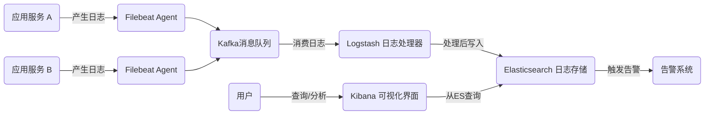
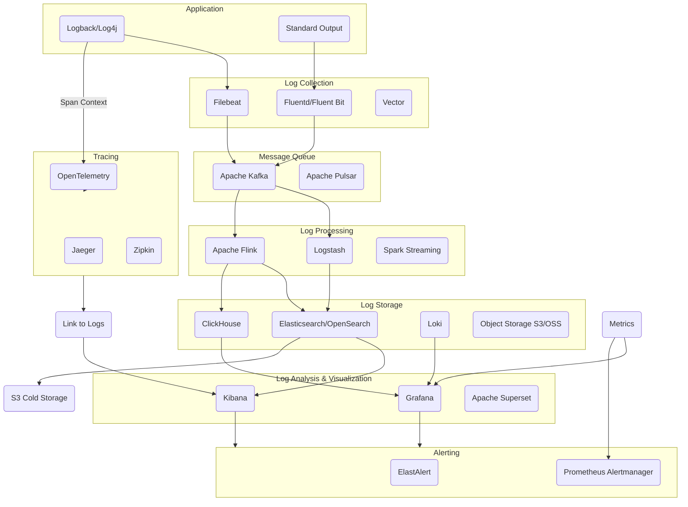

作为一名技术博主，qmwneb946 经常被问及现代复杂系统中的可观测性挑战。在微服务、容器化和云原生架构日益普及的今天，理解系统行为、诊断故障和优化性能变得前所未有的困难。传统的单机日志已无法满足需求，而分布式日志系统正是解决这一难题的关键基石。

本文将带领读者深入探索分布式日志系统的奥秘。我们将从日志的重要性与单机日志的局限性讲起，逐步揭示分布式日志系统的核心目标、挑战与架构模式。随后，我们将详细剖析其关键技术与实现细节，并分享进阶实践与优化策略。无论你是系统架构师、开发人员还是运维工程师，希望这篇深度文章能为你构建和维护高可用、高性能的分布式日志系统提供有益的参考。

## 一、日志的重要性与传统单机日志的局限性

### 日志的作用与价值

在软件开发和运维的生命周期中，日志扮演着至关重要的角色，它就像系统的“黑匣子记录仪”，默默地记录着程序运行时的点滴信息。具体来说，日志的价值体现在以下几个方面：

*   **故障诊断与排查：** 当系统出现异常或崩溃时，日志是定位问题根源最直接的依据。通过分析错误日志、异常堆栈和上下文信息，可以快速找出问题所在。
*   **性能监控与瓶颈分析：** 记录请求处理时间、资源使用情况等性能指标，有助于发现系统瓶颈，进行性能优化。
*   **安全审计与合规性：** 记录用户操作、敏感数据访问等事件，可以用于安全审计，追踪恶意行为，并满足合规性要求。
*   **业务分析与决策：** 聚合业务日志（如用户行为、交易流水），可以为产品和运营团队提供数据支持，辅助业务决策。
*   **系统行为理解：** 通过详细的日志记录，开发者和运维人员可以更深入地理解系统在不同条件下的运行机制和交互逻辑。

### 传统单机日志的局限性

在单体应用或小型系统中，日志通常直接写入本地文件系统。这种方式简单直接，但在分布式、大规模的复杂环境中，其局限性日益凸显：

1.  **数据分散，难以集中查看：** 当系统由数十、数百甚至数千个服务实例组成时，日志分散在各个服务器上。要查看某个请求的完整链路日志，需要在多台机器之间来回切换，效率极低。
2.  **存储容量限制：** 单台服务器的存储空间有限。随着日志量的增长，磁盘空间很快就会耗尽，导致日志被覆盖或删除，影响后续排查。
3.  **检索效率低下：** 在海量日志文件中，使用 `grep` 等命令进行关键字检索效率低下，尤其是在没有索引的情况下。复杂查询（如多条件过滤、时间范围查询）几乎无法实现。
4.  **日志格式不统一：** 不同的服务、不同的开发人员可能采用不同的日志格式，导致日志难以被自动化工具解析和处理，增加了分析难度。
5.  **缺乏上下文关联：** 在分布式系统中，一个请求可能经过多个服务调用。单机日志无法提供跨服务的请求链路信息，难以追踪完整的业务流程，导致“信息孤岛”。

这些局限性使得传统单机日志在面对现代分布式系统时力不从心，也因此催生了分布式日志系统的需求。

## 二、分布式日志系统的核心目标与挑战

为了解决单机日志的痛点，分布式日志系统应运而生。它旨在提供一个统一、高效、可靠的日志管理平台，以应对海量、高并发的日志数据。

### 核心目标

分布式日志系统的核心目标可以总结为以下几点：

1.  **集中收集 (Centralized Collection)：** 将所有分布式服务产生的日志汇聚到一个中心存储，消除日志分散的问题。
2.  **实时传输 (Real-time Transmission)：** 以低延迟、高效率的方式将日志从生产端传输到收集端，确保日志的时效性。
3.  **统一存储 (Unified Storage)：** 持久化存储海量的日志数据，并提供可伸缩的存储能力，满足长期归档和历史查询的需求。
4.  **高效检索与分析 (Efficient Search & Analysis)：** 支持快速、灵活的日志查询、过滤、聚合和统计分析，帮助用户快速定位问题和发现趋势。
5.  **可视化 (Visualization)：** 通过图表、仪表盘等方式直观地展示日志数据，提升可读性和洞察力。
6.  **可伸缩性 (Scalability)：** 能够随着业务量的增长平滑地扩展，处理PB级甚至EB级的日志数据。
7.  **高可用性与数据可靠性 (High Availability & Data Reliability)：** 确保日志数据不丢失、不重复，系统在部分组件故障时仍能正常运行。

### 主要挑战

实现上述目标并非易事，分布式日志系统面临着诸多挑战：

1.  **海量数据：** 现代大型系统每秒可能产生数GB到数十GB的日志，日积月累可达TB甚至PB级别。如何有效地存储、索引和管理这些海量数据是一个巨大挑战。
2.  **高并发写入：** 在高峰期，日志写入请求可能达到每秒数百万甚至千万级别。系统需要具备极高的吞吐能力来处理如此密集的写入操作。
3.  **异构日志源：** 日志可能来源于不同的编程语言、应用框架、操作系统和基础设施组件。日志格式可能多样化（文本、JSON、XML），需要统一的解析和处理机制。
4.  **数据一致性与可靠性：** 确保日志在传输和存储过程中不丢失、不重复，尤其是在网络波动或组件故障时。这要求有完善的重试、缓冲和持久化机制。
5.  **跨服务追踪与关联：** 在微服务架构中，一个用户请求可能穿透多个服务。如何在日志中关联不同服务的请求上下文，形成完整的请求链路，是排查分布式问题的关键。
6.  **性能与成本平衡：** 高性能的日志系统往往意味着高昂的存储和计算资源成本。如何在满足性能需求的同时，控制运营成本是一个持续的优化课题。
7.  **安全与隐私：** 日志中可能包含敏感信息（如用户ID、IP地址、个人身份信息）。如何确保日志传输和存储的安全性，以及对敏感数据进行脱敏或加密，是必须考虑的问题。

解决这些挑战是构建一个健壮、高效的分布式日志系统的核心所在。

## 三、分布式日志系统的架构模式

一个典型的分布式日志系统通常由多个组件协作完成日志的收集、传输、处理、存储和检索。最广为人知的架构模式是基于ELK（Elasticsearch, Logstash, Kibana）栈，或其云原生变种EFK（Elasticsearch, Fluentd, Kibana）栈。

### 基本架构组件

无论采用何种技术栈，分布式日志系统通常都包含以下核心组件：

1.  **日志采集器/代理 (Log Collector/Agent)：**
    *   部署在每个应用服务器或容器上，负责从本地文件、标准输出、网络端口等多种源头收集日志。
    *   特点：轻量级、资源占用少、高效、支持断点续传和本地缓存以确保数据可靠性。
    *   **常用工具：** Filebeat, Fluentd, Logstash-agent (现在较少用，被Filebeat取代), rsyslog, vector。

2.  **日志传输/消息队列 (Log Shipper/Message Queue)：**
    *   作为日志采集器和处理器之间的缓冲区，实现日志的异步传输、削峰填谷和解耦。
    *   特点：高吞吐、持久化、高可用、支持多生产者和多消费者。
    *   **常用工具：** Apache Kafka, RabbitMQ, Apache Pulsar。

3.  **日志处理器 (Log Processor)：**
    *   接收来自消息队列的原始日志，进行解析、过滤、转换、丰富化等操作。
    *   特点：强大的数据处理能力、灵活的配置、支持多种输入/输出插件。
    *   **常用工具：** Logstash, Apache Flink, Apache Spark Streaming。

4.  **日志存储 (Log Storage)：**
    *   负责持久化存储海量的处理后的日志数据，并提供高效的索引和查询能力。
    *   特点：分布式、可伸缩、高可用、支持全文检索或OLAP查询。
    *   **常用工具：** Elasticsearch / OpenSearch, ClickHouse, Apache HDFS, Loki。

5.  **日志检索与分析 (Log Search & Analysis)：**
    *   提供用户界面，允许用户通过关键词、时间范围、字段过滤等方式查询日志，并进行聚合分析。
    *   特点：强大的查询语言、实时统计、数据可视化。
    *   **常用工具：** Kibana, Grafana。

6.  **告警系统 (Alerting System)：**
    *   基于日志中的特定模式或异常事件触发告警，通知相关人员。
    *   **常用工具：** ElastAlert, Prometheus Alertmanager。

### 典型架构模式：ELK/EFK Stack

以ELK/EFK为代表的架构模式是目前最流行、最成熟的分布式日志解决方案之一。其基本流程如下：



**详细解析：**

1.  **日志产生 (Application Logging)：** 应用程序（如Java的Logback、Python的logging模块等）将日志输出到本地文件、标准输出或特定日志服务。
2.  **日志采集 (Filebeat/Fluentd)：** 在每个应用服务器或容器中部署轻量级的日志采集器（如Filebeat或Fluentd）。
    *   **Filebeat：** 以其极低的资源消耗和高效的数据传输能力而闻名，是Elastic Stack官方推荐的采集器。它通过 `tail` 命令的方式监控日志文件的变化，并将其发送到Kafka或Logstash。
    *   **Fluentd/Fluent Bit：** 另一个流行的开源数据收集器，支持丰富的插件生态系统，能够从各种数据源收集、解析、转换和传输数据。Fluent Bit是Fluentd的轻量级版本，适用于边缘计算和容器环境。
3.  **日志传输 (Kafka)：** 采集器将日志发送到消息队列（如Kafka）。
    *   **优势：** Kafka作为高吞吐、持久化、分布式流平台，能够有效地缓冲日志峰值，解耦生产和消费端，并提供数据可靠性保证（通过多副本和ACK机制）。这避免了日志处理器直接面对巨大的写入压力，提高了整个系统的稳定性。
4.  **日志处理 (Logstash/Flink)：** 消息队列中的日志被日志处理器（如Logstash）消费。
    *   **Logstash：** 强大的开源数据处理管道。它支持各种输入（input）、过滤（filter）和输出（output）插件。日志经过Logstash时，可以进行：
        *   **解析：** 将非结构化日志（如Nginx访问日志）解析成结构化数据（JSON）。例如，使用Grok表达式匹配日志行，提取字段。
        *   **过滤：** 移除不必要的日志事件或敏感信息。
        *   **转换：** 改变字段类型、重命名字段、合并字段等。
        *   **丰富化：** 添加额外信息，如根据IP地址查询地理位置、关联用户信息等。
    *   **Apache Flink/Spark Streaming：** 对于需要更复杂、大规模实时处理和聚合的场景，可以使用流处理框架如Flink或Spark Streaming来替代Logstash，进行更高级的ETL操作。
5.  **日志存储与索引 (Elasticsearch/OpenSearch)：** 处理后的结构化日志被写入到分布式搜索引擎Elasticsearch或OpenSearch集群。
    *   **Elasticsearch：** 基于Lucene的分布式、RESTful搜索和分析引擎。它能够快速地存储、索引和搜索海量数据。其核心是倒排索引，使得全文检索和复杂聚合查询成为可能。它通过数据分片（Shards）和副本（Replicas）实现高可用和水平伸缩。
6.  **日志检索与可视化 (Kibana)：** 用户通过Kibana（Elasticsearch的官方可视化工具）访问Elasticsearch中的日志数据。
    *   **Kibana：** 提供友好的Web界面，支持强大的查询DSL（Domain Specific Language），允许用户进行：
        *   **日志查询：** 快速定位特定事件。
        *   **过滤：** 基于多个字段和条件组合过滤。
        *   **聚合：** 对日志数据进行统计（如错误率、请求量、平均响应时间）。
        *   **仪表盘：** 创建自定义仪表盘，实时展示关键指标和图表。
7.  **告警 (ElastAlert等)：** 可以在Elasticsearch数据上配置告警规则。当满足特定条件（如错误率超过阈值、特定关键字出现频率异常）时，触发告警通知到PagerDuty、Slack、Email等。

这种架构模式通过组件的解耦和各司其职，有效应对了分布式日志的海量、高并发和多样性挑战。

## 四、关键技术与实现细节

深入理解分布式日志系统的构建，需要掌握其核心组件背后的关键技术和实现细节。

### 日志采集

日志采集是分布式日志系统的起点，其可靠性和效率直接影响整个系统的性能。

*   **Agent-based vs. Agentless：**
    *   **Agent-based：** 在每台服务器或每个应用容器中部署一个轻量级代理程序（如Filebeat、Fluentd）。这是主流方案，优点是采集实时性高、本地缓存保证可靠性、可处理多种日志源。缺点是需要额外的部署和资源开销。
    *   **Agentless：** 通过SSH、API调用或其他网络协议远程拉取日志。这种方式部署简单，但实时性差，且难以处理高并发日志量。
*   **采集方式：**
    *   **Tail文件：** 多数Agent通过模拟 `tail -f` 命令的方式实时监听日志文件的写入，这是最常见的方式。
    *   **标准输出 (Stdout/Stderr)：** 对于容器化应用，日志通常直接输出到标准输出，容器运行时（如Docker）或Kubernetes会捕获这些输出，并可配置发送到日志采集器。
    *   **系统调用：** 更底层的方式，直接拦截系统级别的写入操作。
    *   **SDK/Library：** 应用程序直接使用日志系统提供的SDK，通过网络发送日志。这种方式绕过了文件IO，但增加了应用代码的耦合。
*   **可靠传输：**
    *   **本地缓存/缓冲区：** Agent在将日志发送出去之前，通常会在本地（内存或磁盘）进行缓存。当网络中断或下游组件不可用时，日志可以暂存在本地，待恢复后再发送。
    *   **断点续传：** Agent会记录已发送日志的位置（如文件inode和offset），当Agent重启后，可以从上次发送的位置继续，避免重复发送或遗漏。
    *   **重试机制：** 当日志发送失败时，Agent会根据预设的策略进行重试。
    *   **ACK确认：** 采集器会将日志发送给下游，并等待下游的确认（ACK）。只有收到ACK后，才认为日志成功传输并可以从本地缓存中清除。

### 日志传输与消息队列

消息队列在分布式日志系统中扮演着“蓄水池”和“桥梁”的角色。

*   **为什么需要消息队列？**
    *   **削峰填谷：** 应对日志写入的突发高峰，防止日志处理器被瞬时流量压垮。
    *   **解耦：** 将日志采集、处理和存储组件解耦，各组件可以独立伸缩和升级。
    *   **异步处理：** 采集器无需等待处理器完成操作，可快速将日志发送出去，提高吞吐。
    *   **持久化：** 消息队列可以持久化存储日志，防止数据丢失，即使下游组件长时间不可用。
*   **Apache Kafka：** 最常用于日志传输的MQ。
    *   **高吞吐量：** 基于文件系统顺序写入、零拷贝、批处理等技术实现极高吞吐。
    *   **持久化：** 日志数据写入磁盘，并可配置数据保留时间。
    *   **分区 (Partitions)：** 主题被分成多个分区，每个分区是一个有序的、不可变的消息序列。这使得Kafka可以水平伸缩，通过增加分区来提高并行度。
    *   **消费者组 (Consumer Groups)：** 多个消费者可以组成一个消费者组，共同消费一个主题的不同分区，实现负载均衡和高可用。
    *   **数据可靠性：**
        *   **副本 (Replication)：** 每个分区可以有多个副本，分散在不同的Broker上。当主副本失效时，可以从副本中选举新的主副本。
        *   **ACK机制：** 生产者可以配置 `acks` 参数来控制消息发送的可靠性：
            *   `acks=0`：生产者不等待确认，吞吐量最高，但可能丢失数据。
            *   `acks=1`：生产者等待Leader副本写入成功后确认。
            *   `acks=all` (`-1`)：生产者等待Leader和所有ISR（In-Sync Replicas）副本写入成功后确认，可靠性最高，但延迟稍高。
        *   **ISR (In-Sync Replicas)：** 保持与Leader副本同步的Follower副本集合。只有当消息写入到ISR中的所有副本后，才认为消息是“已提交”的。

### 日志处理与解析

日志处理是原始日志向可查询结构化数据转化的关键环节。

*   **解析 (Parsing)：** 将非结构化或半结构化日志（如文本、CSV）解析成结构化的键值对格式（如JSON）。
    *   **Grok表达式：** Logstash中最常用的解析工具，通过预定义的模式匹配日志中的特定字段。例如，匹配Nginx访问日志：
        ```
        %{IPORHOST:clientip} %{HTTPUSERAGENT:useragent} %{INT:response_code}
        ```
    *   **正则表达式 (Regex)：** 灵活但复杂，性能可能低于Grok。
    *   **JSON解析：** 对于本身就是JSON格式的日志，可以直接解析。
*   **数据标准化：** 统一字段命名、数据类型转换（如将字符串转换为数值类型、日期类型）。
*   **数据丰富化 (Enrichment)：**
    *   **IP地理位置查找：** 根据日志中的IP地址查询对应的国家、城市、ISP等信息，使用GeoIP数据库。
    *   **用户信息关联：** 根据日志中的用户ID查询用户表，添加用户名、部门等信息。
    *   **服务元数据：** 添加主机名、容器ID、服务名称、版本号等上下文信息。
*   **错误处理：**
    *   **死信队列 (Dead Letter Queue - DLQ)：** 对于无法解析或处理失败的日志，可以将其发送到DLQ，以便后续人工审查或重新处理，避免数据丢失。
    *   **日志采样：** 在日志量过大时，可以策略性地丢弃一部分不重要的日志，减轻下游压力。

### 日志存储与索引

高效的存储和索引是实现快速检索和分析的基础。

*   **倒排索引 (Inverted Index) 原理：**
    *   Elasticsearch等搜索引擎的核心。传统数据库的索引是根据记录ID找到记录，再从记录中查找关键词。倒排索引则是根据关键词找到包含该关键词的记录ID。
    *   **构建过程：** 对文档进行分词（Tokenization），生成一个个的词项（Terms）。为每个词项创建一个列表，记录包含该词项的所有文档ID及其在文档中的位置。
    *   **示例：**
        文档1: "The quick brown fox"
        文档2: "A quick lazy dog"
        倒排索引：
        quick: [文档1, 文档2]
        brown: [文档1]
        fox: [文档1]
        lazy: [文档2]
        dog: [文档2]
    *   通过倒排索引，可以极大地加速关键词搜索。
*   **时间序列数据优化：** 日志是典型的时间序列数据，具有实时性、量大、时效性强的特点。
    *   **按时间分片/索引 (Time-based Indexing)：** 将日志数据按天、周或月创建独立的索引。例如，`logs-2023.10.26`。这样做的好处是：
        *   查询时只需搜索相关时间范围内的索引，提高查询效率。
        *   便于数据生命周期管理 (ILM)：旧索引可以直接删除或归档，而无需影响新数据。
        *   降低单个索引的碎片化和维护成本。
*   **存储引擎选择：**
    *   **Elasticsearch / OpenSearch：** 最常用的选择。擅长全文检索、实时分析和复杂聚合。基于Lucene，具有强大的搜索能力和水平扩展能力。
    *   **ClickHouse：** 针对OLAP（联机分析处理）场景优化的列式数据库。对于需要进行大量聚合分析、宽表查询的日志场景（如BI报表），ClickHouse可能提供更好的性能。
    *   **Apache HDFS：** 如果只需要低成本的日志归档和离线分析，HDFS是一个很好的选择。但它不适合实时检索。
*   **数据生命周期管理 (ILM - Index Lifecycle Management)：**
    *   Elasticsearch提供了ILM功能，可以自动化管理索引的生命周期：
        *   **Hot Phase：** 新数据写入，频繁读写。
        *   **Warm Phase：** 数据只读，不再写入。可以进行压缩，将分片从高性能存储移动到低成本存储。
        *   **Cold Phase：** 数据几乎不访问，可以再次压缩，移动到更低成本的存储或对象存储（如S3）。
        *   **Delete Phase：** 数据过期，自动删除。

### 日志检索与分析

有效的日志检索和分析是分布式日志系统的最终价值体现。

*   **DSL查询：** Elasticsearch提供了强大的查询DSL（Domain Specific Language），允许用户构建复杂的查询。
    ```json
    GET logs-2023.10.26/_search
    {
      "query": {
        "bool": {
          "must": [
            { "match": { "message": "error" } },
            { "range": { "@timestamp": { "gte": "now-1h", "lt": "now" } } }
          ],
          "filter": [
            { "term": { "service_name.keyword": "user-service" } }
          ],
          "must_not": [
            { "match": { "level": "DEBUG" } }
          ]
        }
      },
      "aggs": {
        "error_count_by_service": {
          "terms": {
            "field": "service_name.keyword",
            "size": 10
          }
        }
      }
    }
    ```
*   **聚合查询 (Aggregations)：** Kibana利用Elasticsearch的聚合功能，对日志数据进行统计和分析。
    *   **Metric Aggregations：** 计数（`count`）、求和（`sum`）、平均值（`avg`）、最大值（`max`）、最小值（`min`）、百分位（`percentiles`）。
    *   **Bucket Aggregations：** 根据某个字段将文档分组，如按 `service_name` 分组统计错误数量。
    *   **Pipeline Aggregations：** 对其他聚合结果进行聚合。
*   **实时Dashboard：** 通过Kibana创建自定义仪表盘，将各种查询和聚合结果以图表形式（柱状图、折线图、饼图等）实时展示，帮助运维人员快速掌握系统状态。

### 跨服务追踪 (Traceability)

在微服务架构中，一个用户请求可能横跨多个服务，日志系统需要能够关联这些分散的日志事件，形成完整的请求链路。

*   **Trace ID & Span ID：**
    *   **Trace ID：** 一个全局唯一的ID，标识一个完整的分布式请求链路。在请求进入系统时生成，并在所有后续的服务调用中传递。
    *   **Span ID：** 标识链路中的一个操作单元或服务调用。每个Span也有一个Parent Span ID，表示其父级调用。
*   **如何传递ID：**
    *   在HTTP请求头、RPC元数据或消息队列消息头中传递 `Trace ID` 和 `Span ID`。
    *   应用程序在记录日志时，将当前的 `Trace ID` 和 `Span ID` 作为字段附加到日志事件中。
*   **示例 (伪代码)：**
    ```java
    // 假设使用MDC (Mapped Diagnostic Context) 传递traceId
    public void processRequest(Request request) {
        String traceId = request.getHeader("X-Trace-ID");
        if (traceId == null) {
            traceId = generateNewTraceId();
        }
        MDC.put("traceId", traceId); // 将traceId放入MDC
        logger.info("Starting request processing for {}", request.getPath());
        // 调用下游服务
        DownstreamService.call(request, traceId);
        logger.info("Finished request processing for {}", request.getPath());
        MDC.remove("traceId");
    }
    // 日志配置：在日志格式中包含 %X{traceId}
    // 例如："%d{yyyy-MM-dd HH:mm:ss.SSS} [%thread] %-5level %logger{36} - [traceId=%X{traceId}] %msg%n"
    ```
    这样，每条日志都会携带 `traceId`。在Kibana中，就可以根据 `traceId` 过滤出所有相关的日志，展示一个请求的完整生命周期。
*   **OpenTracing / OpenTelemetry 标准：**
    *   为了统一分布式追踪的实现，出现了OpenTracing和OpenTelemetry等标准。它们定义了API和数据模型，使得不同的追踪系统可以互操作。
    *   将日志系统与分布式追踪系统（如Jaeger, Zipkin）集成，可以更直观地可视化请求链路，并从链路中跳转到相关日志，大大提升故障排查效率。

## 五、日志系统的进阶实践与优化

构建一个分布式日志系统只是第一步，要确保其长期稳定、高效运行并控制成本，还需要进行持续的优化和精进。

### 性能优化

*   **批处理与压缩：**
    *   **Agent侧：** 日志采集器（如Filebeat）将多条日志事件打包成批次再发送，减少网络连接和传输次数。同时，可以在发送前对日志数据进行压缩（如Gzip、Snappy），减少网络带宽消耗。
    *   **消息队列侧：** Kafka等MQ本身就支持批处理和压缩。
*   **异步写入：** 应用程序日志写入通常是同步操作，可能阻塞主线程。应尽可能采用异步日志写入，将日志消息放入队列，由单独的线程负责持久化，以避免影响应用性能。
*   **索引优化 (Elasticsearch)：**
    *   **Mapping优化：** 提前定义好字段的类型（Mappings），避免ES自动猜测导致不必要的复杂类型。对不需要全文检索的字段禁用 `text` 类型和 `analyzer`，使用 `keyword` 类型。例如，日志级别、服务名等常用作过滤条件的字段应设为 `keyword` 类型。
    *   **禁用不必要字段的索引：** 对于某些只读不查的字段（如原始日志全文），可以考虑禁用其索引 (`"index": false`)，以减少索引存储空间和写入开销。
    *   **合理设置Refresh Interval：** `refresh_interval` 决定了ES多久刷新一次索引，使数据变得可搜索。调高该值可以减少写入压力，降低CPU和IO消耗，但会增加数据可搜索的延迟。
    *   **分片大小：** 合理规划分片数量和大小。单个分片过大或过多都会影响性能。经验法则是一个分片大小在20-50GB之间比较理想。
*   **集群规模与资源调优：**
    *   **硬件选择：** 采用SSD存储以提高IO性能；根据CPU密集型（处理、索引）和IO密集型（存储、查询）的负载特性，合理分配CPU和内存资源。
    *   **JVM调优：** 为Logstash和Elasticsearch等Java应用配置合适的JVM内存参数，避免GC（垃圾回收）问题。
    *   **系统参数调优：** 调整操作系统文件句柄数、内存映射区、TCP缓冲区等参数。
    *   **监控与容量规划：** 持续监控各组件的CPU、内存、磁盘IO、网络IO等指标，结合历史数据和业务增长趋势进行容量规划，及时扩容。

### 成本控制

日志数据量庞大，存储成本是重要的考量因素。

*   **数据过滤与采样：**
    *   **源头过滤：** 在应用层或采集器层，过滤掉不重要的DEBUG或INFO级别日志，只发送ERROR、WARN等关键日志。
    *   **处理器过滤：** 在Logstash等处理器中，根据业务规则过滤掉噪音日志。
    *   **日志采样：** 对于高频日志（如访问日志），可以进行采样，例如只记录10%的请求日志。但需要注意采样会影响统计分析的准确性。
*   **冷热数据分离与归档：**
    *   **热数据 (Hot)：** 最新产生、需要频繁查询的日志，存储在高性能存储（如SSD），索引完整。
    *   **温数据 (Warm)：** 较旧但仍可能查询的日志，可以迁移到中等性能存储（如HDD），进行压缩，减少副本。
    *   **冷数据 (Cold)：** 不常查询、主要用于合规性或审计的日志，可以归档到成本极低的存储（如对象存储S3、磁带库），并移除Elasticsearch索引。需要查询时再进行恢复。
    *   **ILM (Index Lifecycle Management)** 是实现此策略的有效工具。
*   **存储压缩：**
    *   Elasticsearch默认会对数据进行压缩，但可以通过数据类型优化、禁用_source字段等方式进一步提高压缩比。
    *   对于归档数据，可以使用更高效的通用压缩算法（如LZ4、Zstd）。

### 可靠性与高可用性

确保日志数据不丢失、系统持续可用。

*   **多副本策略：**
    *   **Kafka：** 配置足够的分区副本数量（如3副本），确保Leader分区故障时有Follower可以选举为新的Leader。
    *   **Elasticsearch：** 配置索引的副本数量（如 `index.number_of_replicas: 1` 或 `2`），确保每个分片有至少一个副本，当主分片所在节点宕机时，副本可以接管。
*   **集群容错与自动恢复：**
    *   **Kafka：** Broker集群高可用，Controller负责集群管理。
    *   **Elasticsearch：** Master节点负责集群状态管理，数据节点负责数据存储和查询。当节点故障时，集群能自动进行分片恢复和选举。
*   **监控与告警：** 对日志系统的各个组件（Agent、MQ、Processor、Storage、UI）进行全面监控。
    *   **指标监控：** CPU利用率、内存使用、磁盘IO、网络IO、MQ的滞后（lag）、ES的写入速率、查询延迟等。
    *   **日志异常监控：** 通过ELK自身或其他工具（如ElastAlert）监控日志中的错误信息、异常模式，及时告警。

### 安全性与合规性

日志中可能包含敏感信息，安全和合规性是不可忽视的环节。

*   **访问控制 (RBAC)：**
    *   对日志系统（Kibana、Elasticsearch API）配置基于角色的访问控制。
    *   例如，开发人员只能查看自己服务相关的日志；运维人员可以查看所有日志；审计人员只能查看审计日志。
*   **数据脱敏与加密：**
    *   **脱敏：** 在日志处理阶段，对敏感字段（如手机号、身份证号、银行卡号）进行脱敏处理，用星号或随机字符串替换。
    *   **加密：** 日志数据在传输过程中使用TLS/SSL加密，在存储时可以考虑对部分敏感数据进行端到端加密（但会增加查询复杂度）。
*   **审计日志：** 日志系统本身的操作（如用户登录、查询、配置修改）也应记录为审计日志，以追踪操作行为。

### 可观测性集成

现代可观测性理论强调“三位一体”：**日志 (Logs)、指标 (Metrics) 和追踪 (Traces)**。将分布式日志系统与其他可观测性工具集成，可以提供更全面的系统视图。

*   **Logs：** 记录离散的事件，提供详细的上下文信息，擅长故障排查和事件分析。
*   **Metrics：** 聚合的数值指标，反映系统或服务的健康状况和性能趋势，擅长监控和告警。
*   **Traces：** 记录分布式请求的端到端路径，提供服务间的调用关系和耗时，擅长性能瓶颈分析和分布式故障定位。
*   **集成实践：**
    *   日志中包含 `traceId` 和 `spanId`，便于从日志跳转到追踪系统。
    *   将关键日志事件提取为指标，发送到Prometheus等指标系统。
    *   使用Grafana等统一的Dashboard平台，同时展示日志、指标和追踪数据。
*   **Loki、Promtail 等新一代日志系统：**
    *   Logstash的替代品，受Prometheus启发，Loki将日志视为时间序列数据。它不索引日志内容，只索引元数据（标签）。
    *   **特点：** 成本低（不全文索引）、查询快（只查元数据）、易于集成Prometheus生态。
    *   **适用场景：** 主要用于按标签进行过滤和聚合日志，对于需要复杂全文检索的场景可能不如Elasticsearch。


**图：分布式日志系统与其他可观测性工具集成概览**

## 六、案例分析 (简要提及)

以下是一些常见的分布式日志系统实现方案：

*   **自建 ELK/EFK Stack：** 这是最常见的自建方案，灵活性高，成本可控，但需要投入大量人力进行部署、维护和优化。适用于对数据敏感或有定制化需求的团队。
*   **云服务商的日志服务：**
    *   **AWS CloudWatch Logs：** Amazon的日志管理服务，与AWS生态系统深度集成，提供日志收集、存储、查询、分析和告警功能。
    *   **阿里云日志服务 (SLS)：** 阿里云提供的全托管日志服务，覆盖日志全生命周期，支持多种数据源和强大的查询分析功能，并与云监控、云安全等产品集成。
    *   **Google Cloud Logging：** Google Cloud的日志服务，与Google Cloud产品紧密结合，支持强大的结构化日志和实时分析。
*   **商业解决方案：**
    *   **Splunk：** 业界领先的日志管理和安全信息与事件管理（SIEM）平台，功能强大，扩展性好，但成本非常高昂。
    *   **Datadog Logs：** Datadog提供一体化的可观测性平台，包括日志、指标和追踪。

选择哪种方案取决于团队的技术栈、预算、对控制权的偏好以及对可观测性工具的特定需求。云服务商的解决方案通常能大大降低运维负担，但可能会有供应商锁定问题。

## 结论

在当今复杂多变的分布式系统环境中，分布式日志系统已不再是可有可无的辅助工具，而是构建强大可观测能力、保障系统稳定运行的**核心基石**。它将分散的、海量的、异构的日志数据汇聚一堂，并通过高效的传输、处理、存储和检索机制，将其转化为可读、可查、可分析的宝贵信息。

我们深入探讨了分布式日志系统的重要性、面临的挑战、经典的架构模式以及背后的关键技术，包括日志采集的可靠性、消息队列的削峰填谷、日志处理的灵活强大、高性能索引的奥秘、以及实现跨服务追踪的关键。此外，我们也分享了性能优化、成本控制、高可用性保障和安全性合规性等进阶实践策略，并强调了日志、指标和追踪“三位一体”的可观测性理念。

构建一个优秀的分布式日志系统是一个持续演进的过程，需要根据业务需求和技术发展不断迭代优化。随着人工智能和机器学习技术在日志分析领域的应用日益深入，未来的日志系统将更加智能化，能够自动发现异常、预测潜在问题，甚至提供自动化的故障诊断和修复建议。拥抱这些变化，才能更好地驾驭日益复杂的现代软件系统。

希望通过本文的深度剖析，能让你对分布式日志系统有更全面、更深刻的理解，并为你实践中遇到的挑战提供启发。祝愿你的系统永远稳定运行，日志清澈可见！

---
**作者：qmwneb946**
**发布日期：2023年10月26日**