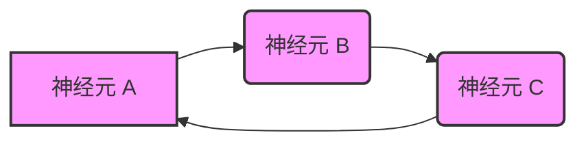

你好，各位求知若渴的探险家们！我是你们的老朋友qmwneb946。今天，我们要一起踏上一段令人兴奋的旅程，深入探索人类心智最基础也最神秘的能力之一——工作记忆（Working Memory）的神经编码。

工作记忆，这个听起来有些学术的词汇，实际上无时无刻不在影响着我们的生活：当你记住一个电话号码，然后在拨号前短暂地保持它；当你进行心算，将中间结果存储在脑海中；当你听取复杂的指令，并尝试按顺序执行它们——这些都离不开工作记忆的运作。它就像是我们大脑中的一个“临时草稿本”，能够短暂地存储和操纵信息，为我们当前的认知任务提供支持。

但，大脑究竟是如何实现这种短暂而精确的信息维持能力的呢？信息是以何种形式存储在我们的神经元网络中？单个神经元的活动、神经回路的连接模式、乃至大规模脑区的协同振荡，又在其中扮演着怎样的角色？这些问题，正是神经科学与计算科学交叉领域最引人入胜的谜团。

在这篇文章中，我们将从宏观的行为学观察出发，逐步深入到微观的神经元活动，再上升到复杂的网络动力学，最后探讨计算模型如何帮助我们理解并模拟这些过程。让我们一起揭开工作记忆神经编码的神秘面纱！

---

## 工作记忆：定义与行为学视角

在深入探讨神经机制之前，我们首先需要对工作记忆有一个清晰的认知。

### 什么是工作记忆？

工作记忆，有时与“短期记忆”互换使用，但它是一个更广阔、更动态的概念。心理学家艾伦·巴德利（Alan Baddeley）和格雷厄姆·希奇（Graham Hitch）在1974年提出了著名的**多成分工作记忆模型**，将工作记忆分解为几个相互关联的子系统：
*   **语音回路（Phonological Loop）**：负责处理和暂时存储口头或听觉信息。
*   **视空间画板（Visuospatial Sketchpad）**：负责处理和暂时存储视觉和空间信息。
*   **情景缓冲区（Episodic Buffer）**：一个容量有限的系统，负责整合来自语音回路、视空间画板、长时记忆以及知觉信息，形成连贯的事件表征。
*   **中央执行系统（Central Executive）**：作为核心控制器，负责分配注意力、协调信息流、进行策略选择、抑制不相关信息等高阶认知功能。

与**长时记忆（Long-term Memory）**相比，工作记忆的容量非常有限，且信息维持时间短暂（通常只有几秒到几十秒），容易受到干扰。著名的“神奇的数字七加减二”（The Magical Number Seven, Plus or Minus Two）描述了工作记忆的容量限制，尽管后来的研究表明，对于“组块”（chunks）而非独立项，容量可能更小，大约4±1个组块。

### 行为学实验范式

为了研究工作记忆的特性，认知神经科学家设计了多种经典的实验范式：

*   **延迟匹配样本任务（Delayed Match-to-Sample, DMS）**：
    *   受试者（通常是灵长类动物或人类）首先看到一个或多个“样本”刺激（例如，一个特定颜色、形状或位置的光点）。
    *   随后进入一段“延迟期”（delay period），期间没有刺激呈现，受试者必须在脑海中维持样本信息。
    *   延迟期结束后，呈现一个或多个“测试”刺激，受试者需要判断测试刺激是否与样本刺激匹配。
    *   通过改变延迟期长度、样本数量、干扰物等，可以系统地研究工作记忆的容量、持续时间及抗干扰能力。

*   **N-back 任务**：
    *   受试者看到一系列连续呈现的刺激（例如，字母或图片）。
    *   任务要求受试者判断当前刺激是否与前面第 N 个刺激相同。例如，2-back 任务要求判断当前刺激是否与前两个刺激相同。
    *   这项任务不仅要求信息维持，还需要不断地更新和操作工作记忆中的内容，对中央执行系统的负荷较高。

这些行为学任务为我们提供了窥探工作记忆表象的窗口，而神经生理学和计算建模则帮助我们深入其本质。

---

## 神经活动：编码的生理基石

那么，大脑是如何在物理层面“存储”这些信息的呢？

### 单神经元持续放电

20世纪70年代，华盛顿大学的 Joaquín Fuster 和 G. Alexander 在猴子的前额叶皮层（Prefrontal Cortex, PFC）中首次发现了与工作记忆相关的神经元活动。他们在延迟匹配样本任务中观察到，在延迟期，当外部刺激已经消失时，某些PFC神经元会保持持续的放电活动。这种持续的放电被认为是信息在工作记忆中被维持的神经学证据。

随后，日本国立精神和神经科学中心的 Shintaro Funahashi 及其同事（1989）在猴子PFC的眼动区域（Oculomotor PFC）进一步证实了这种现象，并发现这些神经元的持续放电具有**位置特异性**。也就是说，某个神经元可能只在猴子需要记住特定空间位置时才会持续活跃。这种“记忆场”效应极大地支持了PFC作为工作记忆核心区域的观点。

**持续放电如何维持信息？** 想象一下，一个神经元在没有外部输入的情况下，仍然能够以高于基线的频率放电，就像一个持续点亮的指示灯。这个“灯”的亮灭或不同的亮度，就代表了不同的信息。这种机制使得大脑能够在短时间内“记住”某个特定的状态或信息，直到任务完成或信息不再需要。

### 放电率编码与时间编码

神经元编码信息的方式并不仅仅限于“持续放电”，更深入地，我们可以区分两种主要的编码模式：

*   **放电率编码（Rate Coding）**：
    *   这是神经科学中最经典的编码理论。它认为，神经元编码的信息是由其在特定时间窗口内的**平均放电频率**（即，单位时间内发放动作电位的数量）来表示的。
    *   例如，一个神经元对特定方向的视觉刺激反应强烈时，它的放电率会显著升高。在工作记忆中，持续放电可以被视为一种维持较高放电率的机制。
    *   $$ R = \frac{N_{spikes}}{\Delta T} $$
        其中 $R$ 是放电率，$N_{spikes}$ 是在时间间隔 $\Delta T$ 内发放的动作电位数量。

*   **时间编码（Temporal Coding）**：
    *   这种理论认为，信息不仅由放电率决定，还由神经元放电的**精确时序模式**来表示，例如动作电位之间的时间间隔、神经元群体的同步放电、或者特定频率的神经振荡。
    *   例如，神经元群体的同步放电可能指示信息的“绑定”或选择性注意力。一些理论认为，通过调整放电的精确时序，大脑可以在有限的放电率下编码更多的信息。
    *   虽然时间编码在工作记忆中的具体作用仍在研究中，但它与神经振荡（后文将述）密切相关，被认为是实现信息在不同脑区之间高效传输和整合的关键。

这两种编码方式并非互斥，它们可能在不同的时间和空间尺度上协同工作，共同支撑工作记忆的复杂功能。

---

## 网络动力学：超越单个神经元

单个神经元的持续放电固然重要，但大脑是一个由数千亿神经元组成的复杂网络。真正的工作记忆，是这些神经元集体涌现出的网络动力学。

### 持续活动的网络机制

如何才能让神经元在没有外部刺激的情况下持续放电呢？

#### 自维持环路（Recurrent Networks）

最被广泛接受的理论是**自维持环路（Recurrent Networks）**。在这种网络中，兴奋性神经元之间通过突触连接形成正反馈环路。当一个神经元激活时，它会兴奋其下游神经元，而这些下游神经元又反过来兴奋上游神经元，从而形成一个自我维持的循环。

**图示概念：**

*   当神经元 A 被激活后，它通过突触连接激活 B，B 激活 C，C 又反过来激活 A，形成一个持续循环的兴奋流，即使最初的外部输入消失，这个环路也能保持活跃。

这种自维持活动可以通过**Hebbian学习法则**（“Fire together, wire together”，即同时激活的神经元之间的突触连接会增强）得到强化。当一个特定的信息被编码时，涉及该信息的神经元群会同时激活，它们的突触连接被加强，从而形成一个稳定的吸引子（Attractor）状态。当系统进入这个吸引子状态时，它会稳定地保持在该状态，抵抗小扰动，从而实现信息的维持。

#### 突触可塑性与短期记忆

除了长期的Hebbian可塑性，**短期突触可塑性**（如短期促进或短期抑制）也被认为是维持工作记忆的潜在机制。某些研究表明，即使没有持续的神经元放电，通过突触权重的暂时性改变，信息也能在短时间内被维持。例如，Mizuhara et al. (2004) 等研究发现，突触前膜的钙离子累积或突触后膜受体的敏感度变化，都可能在延迟期暂时性地增强或减弱突触传递，从而“记住”先前的活动模式。

这两种机制——持续放电和突触可塑性——可能协同作用。持续放电作为更直接的编码方式，而突触的可塑性则可能提供更细微的调整和更节能的维持方式。

### 神经振荡与节律

大脑的神经活动并非随机，而是展现出复杂的节律性振荡。这些振荡被认为是协调大规模神经活动、实现信息在不同脑区之间高效传输和整合的关键。

*   **伽马振荡（Gamma Oscillation, $30-80$ Hz）**：
    *   通常被认为与局部信息的整合和绑定（binding）有关。在工作记忆任务中，当需要将不同特征（如颜色和形状）绑定到同一个客体时，PFC和感觉皮层之间的伽马同步性会增强。
    *   被认为是信息在神经元集合中被“激活”和“处理”的标志。

*   **Theta 振荡（Theta Oscillation, $4-8$ Hz）**：
    *   在海马体中非常明显，与记忆编码和导航有关。
    *   在PFC中，Theta 振荡可能参与协调多个工作记忆项的序列处理，或者作为一种“时间窗口”来组织信息流。

*   **Alpha/Beta 振荡（Alpha/Beta Oscillation, $8-30$ Hz）**：
    *   通常与抑制不相关信息、注意力调节和维持当前状态有关。在工作记忆中，Alpha/Beta 振荡的增强可能有助于抑制干扰，确保对当前记忆内容的专注。

*   **交叉频率耦合（Cross-frequency Coupling）**：
    *   指不同频率的神经振荡之间存在某种关系，例如高频伽马振荡的振幅受到低频 Theta 振荡的相位调制。
    *   这种耦合被认为是实现信息在不同空间尺度和时间尺度上整合的关键机制。例如，Theta-Gamma 耦合可能允许大脑在不同的“Theta 周期”内处理不同的“伽马绑定”信息，从而在有限的时间内处理更复杂的信息流。

### 全局脑区连接与信息流

工作记忆并非某个单一脑区的独立功能，而是由一个分布式网络协同作用的结果。

*   **前额叶皮层（PFC）**：作为“中央执行系统”的核心，负责高级认知功能，如目标导向行为、决策、规划和抑制。它接收来自感觉皮层和后部皮层的信息，并调控这些信息在工作记忆中的维持。
*   **顶叶皮层（Parietal Cortex）**：特别是在处理空间和视觉信息方面发挥重要作用，与PFC共同构成工作记忆的关键环路。
*   **颞叶皮层（Temporal Cortex）**：参与物体识别和语义信息的处理。
*   **丘脑和基底神经节**：在注意力调控和信息门控方面发挥作用，帮助大脑选择性地将相关信息载入工作记忆。

这些脑区通过复杂的反馈（feedback）和前馈（feedforward）回路相互连接。例如，PFC通过反馈回路向感觉皮层发送信号，以增强与当前任务相关的感觉输入，并抑制不相关的信息。这种动态的信息流和相互作用，是工作记忆能够灵活适应不断变化的环境的关键。

---

## 计算模型：抽象与模拟

为了更深入地理解工作记忆的神经机制，科学家们常常构建计算模型。这些模型将生物学原理抽象化为数学方程和算法，从而模拟神经活动，并从中推断出潜在的机制。

### 率模型（Rate Models）

率模型是最早也是最广泛使用的神经模型之一。它们不模拟单个动作电位的发放，而是将神经元的活动表示为连续的“平均放电率”。

*   **连续吸引子网络（Continuous Attractor Networks, CAN）**：
    *   CANs 是一种经典的率模型，特别适合模拟工作记忆对连续变量（如空间位置、方向等）的编码和维持。
    *   其核心思想是，一个连续变量（例如一个角度 $\theta$）可以由一组具有**调谐曲线（tuning curves）**的神经元群体来表示。每个神经元对某个特定值（例如 $0^\circ, 10^\circ, 20^\circ$ 等）的输入反应最强，对偏离其“最佳刺激”的值反应逐渐减弱。
    *   在 CAN 中，神经元之间的连接权重通常被设计为：对彼此最佳刺激相似的神经元之间有兴奋性连接，而对彼此最佳刺激相距较远的神经元之间有抑制性连接。这形成了一个“局部兴奋，长距离抑制”的模式。
    *   当网络受到一个外部输入（例如，一个特定的角度）时，对应的神经元会被激活，并通过其连接模式激活邻近的神经元，并抑制远处的神经元，从而形成一个持续的“活动峰值”（bump of activity）。这个活动峰值会稳定地停留在网络中，代表着被记住的连续变量。

**一个简化的率模型方程：**
单个神经元 $i$ 的放电率 $r_i$ 的动态可以用以下微分方程表示：
$$ \tau \frac{dr_i}{dt} = -r_i + f\left(\sum_j W_{ij} r_j + I_i\right) $$
其中：
*   $\tau$ 是神经元的时间常数，表示放电率变化的快慢。
*   $r_i$ 是神经元 $i$ 的放电率。
*   $f(\cdot)$ 是一个非线性激活函数（例如，Sigmoid 函数或 ReLU 函数），将输入转化为放电率。
*   $W_{ij}$ 是神经元 $j$ 到神经元 $i$ 的突触权重。
*   $I_i$ 是来自外部的输入。

在 CAN 模型中，$W_{ij}$ 通常是位置依赖的，例如 $W_{ij} \propto \exp(-\frac{(\theta_i - \theta_j)^2}{2\sigma^2}) - C$，其中前半部分是局部兴奋，后半部分 $C$ 是长距离抑制。

### 尖峰神经网络（Spiking Neural Networks, SNNs）

与率模型相比，SNNs 更具生物学真实性，它们显式地模拟神经元何时以及如何发放单个动作电位（尖峰）。

*   **整合-发放模型（Integrate-and-Fire Model）**：
    *   一种常见的 SNN 模型。神经元的膜电位 $V_m$ 会随着输入电流的积分而升高。当 $V_m$ 达到阈值时，神经元发放一个尖峰，并将膜电位重置。
    *   $$ \tau_m \frac{dV_m}{dt} = -(V_m - E_L) + R_m I_{syn} $$
        其中 $\tau_m$ 是膜时间常数，$E_L$ 是静息电位，$R_m$ 是膜电阻，$I_{syn}$ 是突触输入电流。
    *   SNNs 能够模拟更复杂的神经动力学，如精确的尖峰时序、同步振荡等，这对于理解时间编码和神经振荡在工作记忆中的作用至关重要。
    *   **挑战**：SNNs 的模拟成本更高，训练和分析也更复杂。

### 深度学习与工作记忆

近年来，深度学习在人工智能领域取得了巨大成功，其中一些架构也展现出与生物工作记忆相似的能力。

*   **循环神经网络（Recurrent Neural Networks, RNNs）**：
    *   RNNs 具有内部循环连接，允许信息在网络中持续流动，从而处理序列数据并捕捉时间依赖性。
    *   **长短期记忆网络（Long Short-Term Memory, LSTMs）**是 RNN 的一种特殊变体，通过引入“门控机制”（输入门、遗忘门、输出门）来有效解决传统 RNNs 中梯度消失和梯度爆炸问题，使其能够学习和记忆长期依赖。
    *   LSTMs 的“细胞状态”（cell state）可以被视为一种内部的工作记忆，能够长时间地存储信息。这种机制与大脑中持续活动的神经回路在概念上具有相似性。

*   **Transformer 架构**：
    *   虽然 Transformer 不是循环网络，但其核心的**自注意力机制（Self-Attention）**和**位置编码（Positional Encoding）**使其在处理长序列数据时表现出色。
    *   自注意力机制允许模型在处理序列中的每个元素时，动态地权衡序列中所有其他元素的重要性，这在某种程度上模拟了大脑中注意力对信息选择和整合的作用。
    *   位置编码则为模型提供了序列中元素的位置信息，弥补了 Transformer 缺乏循环连接而损失的序列顺序信息。
    *   尽管 Transformer 并非直接模拟生物神经元，但它在处理序列和保持上下文信息方面的能力，为我们理解更抽象的工作记忆功能提供了计算启发。

这些计算模型，无论是生物启发式的 SNNs 还是工程导向的深度学习模型，都为我们理解工作记忆的神经编码提供了强大的工具和新的视角。

---

## 挑战与未来展望

尽管我们对工作记忆的神经编码有了显著的理解，但仍有许多未解之谜和挑战：

### 容量限制的神经机制

为什么工作记忆的容量如此有限？这仍然是一个活跃的研究领域。
*   **资源分配与竞争**：大脑可能需要分配有限的神经资源（如神经元数量、突触强度）来维持信息，当信息量超过某个阈值时，性能就会下降。
*   **干扰与衰退**：随着时间的推移，或受到新的刺激干扰，工作记忆中的信息会逐渐衰退或被覆盖。这背后涉及主动抑制不相关信息或被动遗忘的神经机制。
*   **绑定问题（Binding Problem）**：如何将分散在不同脑区的特征（如颜色、形状、位置）整合为一个统一的客体表征，并存储在工作记忆中？这可能与神经振荡的同步性或特定神经元群体的共同激活有关。

### 注意力的作用

注意力在工作记忆中扮演着核心角色。它如何调节信息的编码、维持和提取？
*   **门控机制（Gating Mechanism）**：PFC 可能作为一个“门”，控制哪些信息被允许进入或离开工作记忆。
*   **选择性增强/抑制**：注意力可以通过增强相关神经元的活动或抑制不相关神经元的活动来聚焦工作记忆中的信息。

### 遗忘的机制

工作记忆中的信息为什么会遗忘？是被动衰退，还是主动擦除？
*   一些理论认为，持续的神经元放电在停止后会自然衰减。
*   另一些研究则表明，大脑可能存在主动的“遗忘”机制，例如通过抑制性神经元来清除不再需要的信息，以腾出工作记忆空间。

### 临床应用与计算精神病学

工作记忆障碍是多种神经精神疾病（如精神分裂症、注意力缺陷多动障碍 ADHD、阿尔茨海默病）的核心症状。
*   通过深入理解工作记忆的神经编码机制，我们可以开发出新的诊断工具和干预策略。
*   计算模型可以帮助我们模拟这些疾病中的神经元和网络功能障碍，从而为药物研发和非药物治疗（如认知训练）提供理论指导。

### 跨学科融合

未来的工作记忆研究将更加依赖于跨学科的融合：
*   **神经科学**提供生理学基础和实验数据。
*   **人工智能/机器学习**提供强大的计算工具和建模框架。
*   **理论物理**提供描述复杂系统动力学的数学语言。
*   **心理学**则提供行为学观察和认知理论。

---

## 结论：理解心智，模拟未来

工作记忆，这个心智的基石，其神经编码的奥秘正随着科学的进步而逐渐揭示。我们看到，从单个神经元的持续放电，到神经环路的自维持动力学，再到大规模脑区的协同振荡，以及先进的计算模型，无一不在描绘着大脑如何巧妙地实现短暂而高效的信息处理。

持续放电是信息维持的直接表征；自维持环路是其网络基础；神经振荡则提供了信息整合和协调的“节拍器”。而计算模型，无论是传统的率模型和 SNNs，还是现代的深度学习模型如 LSTMs 和 Transformers，都在不同抽象层次上模拟并阐释着这些复杂的机制。

然而，容量的限制、注意力的精确调控、遗忘的动态过程，以及如何将这些微观机制与高阶认知功能（如推理、决策）联系起来，仍然是摆在我们面前的巨大挑战。未来，随着神经技术（如高密度电生理记录、光遗传学）的进步和计算能力的飞跃，我们有望更全面、更精确地理解工作记忆的神经编码，这不仅将深刻改变我们对人类心智的认知，也将为发展更智能、更类脑的人工智能系统提供源源不断的灵感。

我是qmwneb946，感谢各位的阅读。希望这次深入的探索能激发你对大脑奥秘的更多好奇！我们下次再见！