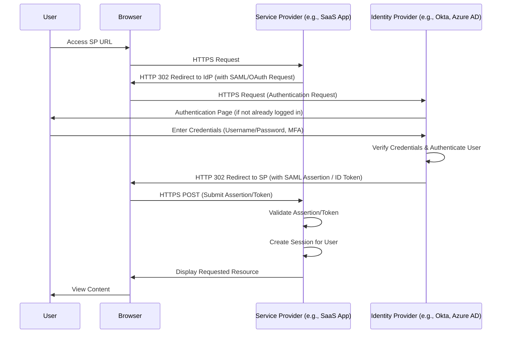
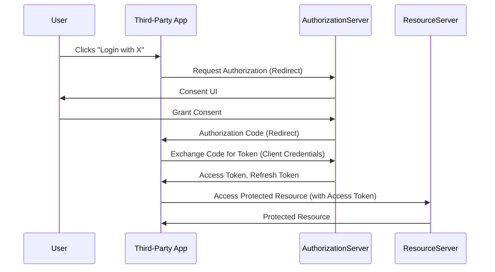

你好，各位技术同好！我是 qmwneb946，一名对技术和数学充满热情的博主。今天，我们将一同踏上一段关于网络安全前沿的深度探索之旅——“零信任的身份认证管理”。在数字化浪潮席卷全球的当下，传统基于网络边界的安全模型正面临前所未有的挑战。数据中心消融，云端化、移动化、远程办公成为常态，我们的“城堡与护城河”式防御体系正在瓦解。如何在这个“无边界”的世界中确保数字资产的安全？答案正指向一个颠覆性的安全理念：零信任（Zero Trust）。

零信任的核心思想是“永不信任，始终验证”（Never Trust, Always Verify）。它意味着我们不再假定任何用户、设备或网络内部的流量是可信的，即使它们已经位于传统意义上的“内网”之中。每一次访问请求，无论来源何处，都必须经过严格的身份验证、授权和持续的风险评估。而在零信任框架中，身份（Identity）无疑成为了新的安全边界，甚至可以说，身份就是一切。因此，深入理解和有效管理身份认证，是构建真正零信任安全体系的关键基石。

本文将从传统安全模型的困境谈起，逐步揭示零信任的哲学及其核心原则。我们将深入探讨在零信任架构下，身份认证管理（Identity and Access Management, IAM）为何如此重要，并详细解析其构成要素、核心技术与协议。最后，我将分享一些实用的实践路径与应对挑战的策略。希望这篇文章能帮助你对零信任的身份认证管理有一个全面、深刻的理解。

---

## 传统安全模型之困与零信任的兴起

### 传统安全模型：城堡与护城河的幻象

长期以来，我们的网络安全策略主要围绕着“边界安全”构建，这就像一座城堡，拥有坚固的城墙（防火墙、入侵检测系统等）和护城河，将“外部”的威胁拒之门外。一旦进入城堡内部，所有的用户和设备就被默认为“可信”的。这种模型在企业内部网络相对封闭、应用集中部署的时代确实有效。

然而，随着云计算、移动设备、物联网以及远程办公的普及，我们的“城堡”开始变得千疮百孔：

*   **边界消融：** 应用和数据不再仅仅位于企业数据中心，它们散布在各种云服务、SaaS 应用中。员工可以从任意地点、使用任意设备访问资源。传统的网络边界变得模糊甚至消失。
*   **内部威胁：** 即使通过了外部防御，恶意的内部人员或被攻陷的内部账户仍能畅通无阻地访问敏感资源，因为内部被默认信任。
*   **横向移动：** 一旦攻击者成功突破外围防御，进入内部网络，他们可以轻易地在网络中横向移动，寻找高价值目标，因为内部流量缺乏严格的检查。
*   **“自带设备”（BYOD）的挑战：** 员工使用个人设备办公，这些设备可能缺乏企业级别的安全管控，成为潜在的入侵点。

这些挑战使得“城堡与护城河”的安全模型不再适用，甚至可能给人一种虚假的安全感。我们急需一种新的安全范式来应对日益复杂的威胁环境。

### 零信任哲学：永不信任，始终验证

正是在这样的背景下，“零信任”理念应运而生。其核心思想源于 Forrester 研究院的 John Kindervag 在 2010 年提出的概念，并由 NIST（美国国家标准与技术研究院）在 SP 800-207 特别出版物中进行了详细阐述和推广。

零信任不再区分“内部”和“外部”网络。所有网络都是不可信的，所有访问请求都必须经过严格的验证。其核心原则可以概括为：

1.  **所有资源和流量都不可信：** 无论是用户、设备、应用程序，还是内部或外部的网络流量，都必须被视为潜在的威胁源。
2.  **默认拒绝访问：** 任何访问请求在未被明确授权之前，都将被拒绝。
3.  **每次访问请求都必须经过严格认证和授权：** 这包括用户身份、设备健康状态、访问环境（如地理位置、时间等）的综合评估。
4.  **基于最小权限原则授予访问：** 只授予完成任务所需的最小权限，并限制访问的时长和范围。
5.  **持续监控和重新认证：** 访问权限不是一次性授予的，而是在整个会话期间持续评估和验证。一旦环境或风险发生变化，可能需要重新认证或撤销权限。
6.  **假定安全漏洞存在：** 始终以“已遭入侵”的心态来设计和操作安全系统，注重检测、响应和恢复能力。
7.  **数据中心化：** 重点保护数据本身，而不是网络边界。

零信任是一种战略思维，而非单一产品或技术。它要求我们重新审视并重构整个安全架构，而在这其中，身份（Identity）无疑成为了最核心的要素。

---

## 零信任架构下的身份认证管理基石

在零信任世界里，身份是新的“边界”，所有对资源的访问都必须基于身份进行认证和授权。这意味着身份认证管理（IAM）从传统的辅助性角色跃升为零信任安全体系的中心。

### 关键概念

在深入探讨零信任下的 IAM 之前，我们先明确几个核心概念：

*   **身份 (Identity):** 能够被系统识别和验证的实体。它不局限于人，还可以是设备（如笔记本电脑、手机、IoT 设备）、应用程序、微服务等。在零信任中，所有这些实体都有其独特的身份。
*   **认证 (Authentication):** 验证一个实体声称的身份是否真实的过程。例如，通过用户名和密码、指纹、动态验证码等方式确认“你是你”。
*   **授权 (Authorization):** 在身份被成功认证后，根据预设的策略和权限，决定该身份可以访问哪些资源、可以执行哪些操作的过程。例如，确认“你是否有权限查看这份文件”。
*   **访问控制 (Access Control):** 实施授权策略，对资源访问进行限制和管理的技术和机制。

### 零信任 IAM 的核心要素

零信任 IAM 远不止是用户名和密码。它是一个复杂的、动态的、多维度的系统，旨在确保每次访问请求的合法性和安全性。以下是其核心要素：

#### 多因素认证（MFA）与自适应认证

仅仅依靠单一密码的认证方式已经远远不够。多因素认证（MFA）要求用户通过两种或多种不同类别的证据（因素）来验证身份：

*   **你知道的 (Something you know):** 密码、PIN 码。
*   **你拥有的 (Something you have):** 手机短信验证码、TOTP 应用（如 Google Authenticator）、硬件令牌、FIDO 安全密钥。
*   **你是什么 (Something you are):** 指纹、面部识别、语音识别（生物特征）。

MFA 大幅提高了认证的安全性，即使攻击者窃取了密码，也无法完成登录。

**自适应认证（Adaptive Authentication）** 是 MFA 的高级形式，它根据实时风险评估动态调整认证强度。系统会收集大量上下文信息，如：

*   **地理位置：** 用户是否从异常位置登录？
*   **设备状态：** 设备是否注册、是否健康（无病毒、最新补丁）？
*   **登录时间：** 是否在非工作时间登录？
*   **行为模式：** 用户的输入习惯、鼠标移动轨迹是否异常？
*   **网络环境：** 是否从未知或高风险 IP 地址登录？

通过这些上下文信息，系统可以计算一个风险分数。例如，如果用户从公司内部网络使用已注册设备登录，可能只需要用户名和密码。但如果用户从一个未知的公共 Wi-Fi 网络使用新设备登录，系统可能会要求进行额外的生物特征验证或推送通知验证。

**风险评分示例：**
设风险函数 $R(U, D, L, T, B)$，其中 $U$ 代表用户属性，$D$ 代表设备属性，$L$ 代表位置，$T$ 代表时间，$B$ 代表行为。
$$
R = w_U \cdot \text{Risk}(U) + w_D \cdot \text{Risk}(D) + w_L \cdot \text{Risk}(L) + w_T \cdot \text{Risk}(T) + w_B \cdot \text{Risk}(B)
$$
当 $R$ 超过某个阈值 $T_{MFA}$ 时，触发 MFA；当 $R$ 超过更高的阈值 $T_{Block}$ 时，直接阻止访问。

#### 单点登录（SSO）

单点登录（SSO）允许用户只需一次登录，即可访问多个独立的应用和服务，无需反复输入凭据。这极大地提升了用户体验。在零信任框架下，SSO 不仅仅是便利性工具，更是统一身份和简化认证流程的关键。通过将所有应用认证请求路由到一个集中的身份提供商（IdP），SSO 使得集中实施和管理多因素认证、访问策略变得可能。

常用的 SSO 协议包括：
*   **SAML (Security Assertion Markup Language):** 基于 XML 的开放标准，主要用于 Web 应用之间的身份验证和授权信息交换。它定义了身份提供商（IdP）和服务提供商（SP）之间的交互方式。
*   **OAuth 2.0 (Open Authorization):** 一个授权框架，允许第三方应用在无需获取用户凭据的情况下，有限地访问用户在另一服务提供商处受保护的资源。它更侧重于授权委托，而非身份验证。
*   **OpenID Connect (OIDC):** 基于 OAuth 2.0 构建的身份层，为客户端提供了用户身份信息和基本个人资料。OIDC 将身份验证集成到 OAuth 2.0 流程中，使其成为 Web 和移动应用身份验证的事实标准。

在 SSO 流程中，用户在 IdP 处完成认证，IdP 会生成一个安全令牌（如 SAML Assertion 或 OIDC ID Token），将其传递给服务提供商（SP）。SP 验证令牌的有效性后，允许用户访问其资源。

#### 最小权限原则（PoLP）

最小权限原则是指为用户或系统提供完成其任务所需的最低限度的访问权限。在零信任中，这意味着：

*   **只授予必要的权限：** 拒绝默认权限，仅在明确需要时才授予。
*   **即时访问 (Just-in-Time, JIT) / 即时足够访问 (Just-Enough Access, JEA):** 权限不是永久授予的，而是在需要时临时授予，并在任务完成后自动撤销。这对于特权账户管理尤为重要。
*   **会话级粒度：** 权限可能在每个会话开始时重新评估。

实现 PoLP 的关键技术包括：
*   **基于角色的访问控制 (RBAC):** 将权限聚合到角色中，用户被分配到角色。
*   **基于属性的访问控制 (ABAC):** 最细粒度的访问控制模型，根据主体、客体、操作和环境的属性动态评估访问请求。

#### 连续认证与授权

传统的认证是“一次性”的：登录后，用户就进入了受信任的状态。零信任则要求“持续认证”。这意味着系统在用户会话期间会持续监控其行为和环境变化，并根据风险评估结果，可能要求用户重新认证，或者动态地调整其访问权限，甚至终止会话。

例如，如果系统检测到用户在短时间内从两个相距遥远的地理位置登录（“不可能的旅行”），或者用户突然尝试访问其平时从不接触的敏感资源，系统会将其标记为高风险，并可能要求重新进行 MFA，或者直接切断连接。

这通常通过行为分析（如 UEBA - 用户和实体行为分析）和实时策略引擎来实现，它会不断评估 $Access(User, Resource, Action, Context)$ 的合法性。

#### 设备信任与终端安全

在零信任中，设备和用户身份同等重要。任何访问企业资源的设备都必须被视为潜在的威胁，并需要进行严格的信任评估和持续监控。设备信任通常涉及：

*   **设备注册与管理：** 所有用于访问企业资源的设备都必须在企业设备管理系统（如 MDM/EMM/UEM）中注册。
*   **设备健康检查：** 持续评估设备的健康状况，包括操作系统补丁级别、杀毒软件状态、防火墙配置、是否存在恶意软件、是否越狱/Root 等。不健康的设备将被阻止访问敏感资源或被隔离。
*   **终端检测与响应 (EDR)：** 在终端设备上部署代理，实时监控设备活动，检测并响应可疑行为。

$$
Trust_{Device} = f(\text{PatchLevel}, \text{AVStatus}, \text{EncryptionStatus}, \text{Compliance})
$$
只有当 $Trust_{Device}$ 达到一定阈值时，设备才能被用于访问资源。

#### 身份治理与管理（IGA）

身份治理与管理（IGA）关注的是整个身份生命周期管理，确保权限的正确分配、审计和回收。它包括：

*   **身份和账户生命周期管理：** 自动化用户创建、修改、禁用和删除，并将其同步到所有相关系统。
*   **访问权限审查和认证：** 定期审查用户和组织的权限，以确保其仍然符合业务需求和最小权限原则。例如，每年对所有员工的访问权限进行审计，确保离职员工的权限已被完全移除，转岗员工的权限已得到更新。
*   **职责分离（Separation of Duties, SoD）：** 确保没有任何单个用户拥有完成关键业务流程所需的全部权限，防止欺诈或错误。
*   **审计与报告：** 记录所有与身份和访问相关的活动，以便进行合规性审计、故障排除和安全分析。

IGA 是确保 IAM 策略在实践中有效实施和维护的基础。

---

## 核心技术深度解析

理解零信任 IAM 的关键，在于掌握其背后支撑的技术和标准。

### 认证协议与标准

在现代分布式系统中，高效、安全的身份认证离不开标准化的协议。

#### SAML (Security Assertion Markup Language)

SAML 是一种基于 XML 的开放标准，用于在不同安全域之间交换身份验证和授权数据。它主要用于 Web 浏览器上的单点登录场景。

**核心组件：**
*   **主体 (Principal):** 通常是用户。
*   **身份提供商 (Identity Provider, IdP):** 执行用户身份验证的服务。
*   **服务提供商 (Service Provider, SP):** 提供资源的应用程序或服务。

**工作流程（简化）：**
1.  用户尝试访问 SP 上的受保护资源。
2.  SP 检测到用户未认证，将其重定向到 IdP。
3.  IdP 验证用户身份（可能要求输入凭据）。
4.  认证成功后，IdP 生成一个包含用户身份和属性信息的 SAML Assertion。
5.  IdP 将 SAML Assertion 发送回用户的浏览器，浏览器再将其提交给 SP。
6.  SP 验证 SAML Assertion 的签名和有效性，从中提取用户身份信息，并授予访问权限。

SAML 的安全性依赖于数字签名和加密，以确保 Assertion 的完整性和保密性。

#### OAuth 2.0 (Open Authorization)

OAuth 2.0 是一个授权框架，它允许第三方应用在无需获取用户凭据的情况下，有限地访问用户在另一服务提供商处受保护的资源。它不是一个认证协议，而是用于授权委托。

**核心角色：**
*   **资源所有者 (Resource Owner):** 拥有受保护资源的用户。
*   **客户端 (Client):** 想要访问受保护资源的应用程序（第三方应用）。
*   **授权服务器 (Authorization Server):** 验证资源所有者身份并颁发访问令牌（Access Token）。
*   **资源服务器 (Resource Server):** 托管受保护资源的服务。

**常见授权流（以授权码授权类型为例）：**
1.  客户端向授权服务器请求授权，用户同意。
2.  授权服务器将授权码（Authorization Code）返回给客户端。
3.  客户端使用授权码和其客户端凭据向授权服务器请求访问令牌（Access Token）。
4.  授权服务器验证授权码和客户端凭据，颁发访问令牌和刷新令牌（Refresh Token）。
5.  客户端使用访问令牌访问资源服务器上的受保护资源。
6.  资源服务器验证访问令牌的有效性并提供资源。

#### OpenID Connect (OIDC)

OpenID Connect 是构建在 OAuth 2.0 之上的身份认证层。它在授权流程中增加了身份验证的功能，允许客户端验证用户身份，并获取用户的基本资料。OIDC 通过在 OAuth 2.0 流程中引入 `ID Token` 来实现这一点，`ID Token` 是一个 JSON Web Token (JWT)，包含有关认证用户的信息（称为“claims”）。

**OIDC 的优势：**
*   **标准化且易于使用：** 利用 OAuth 2.0 的成熟性和普及性。
*   **提供身份信息：** 不仅授权访问，还提供用户身份。
*   **安全：** 利用 JWT 的签名和加密特性。
*   **跨平台：** 适用于 Web、移动和桌面应用。

现在，大部分现代应用的 SSO 和身份验证都倾向于使用 OIDC。

#### FIDO2/WebAuthn

FIDO2 和 WebAuthn（Web Authentication API）旨在提供一个更安全、更便捷的无密码或更强密码的认证体验，旨在对抗钓鱼攻击。它利用了公钥密码学。

**核心原理：**
1.  **注册（Registration）：** 用户在服务提供商处注册时，其设备（FIDO Authenticator，可以是内置的指纹识别器、USB 安全密钥等）会生成一对新的公私钥。私钥安全地存储在设备上，永不离开。公钥则发送给服务提供商并注册。
2.  **认证（Authentication）：** 用户尝试登录时，服务提供商会向设备发送一个挑战（Challenge）。设备使用其私钥对这个挑战进行签名，并将签名结果（Assertion）连同公钥 ID 发送给服务提供商。
3.  **验证：** 服务提供商使用之前存储的公钥来验证签名的有效性。如果签名匹配，则认证成功。

**公钥密码学原理示意：**
私钥 $SK$ 和公钥 $PK$ 成对生成。
加密：$C = E(M, PK)$
解密：$M = D(C, SK)$

签名：$S = Sign(M, SK)$
验证：$Verify(M, S, PK) \rightarrow \text{True/False}$

FIDO2/WebAuthn 的关键在于私钥从未离开设备，且每次认证都需要物理操作（如触摸指纹传感器），极大增强了抗钓鱼能力。

### 访问控制模型

访问控制是授权的具体实施机制，零信任强调细粒度的、动态的访问控制。

#### 基于角色的访问控制（RBAC）

RBAC 是最广泛使用的访问控制模型之一。它通过将权限与角色关联，再将角色分配给用户来实现访问控制。

*   **用户 (Users):** 系统中的个体。
*   **角色 (Roles):** 具有特定职责或职能的集合，如“管理员”、“普通员工”、“审计员”。
*   **权限 (Permissions):** 对特定资源执行特定操作的权力，如“读文件A”、“写数据库B”。

**关系表示：**
*   用户被分配到角色：$User \in Role$
*   角色被授予权限：$Permission \in Role$

当用户被分配到某个角色时，他们就自动获得了该角色所包含的所有权限。

**优点：** 简化权限管理，易于理解和实施。
**缺点：** 随着系统规模扩大和权限需求细化，角色数量可能爆炸式增长；无法很好地处理基于上下文的动态权限需求。

#### 基于属性的访问控制（ABAC）

ABAC 是一种更灵活、更动态的访问控制模型，它根据主体（用户）、客体（资源）、操作和环境的属性来动态评估访问请求。

**核心要素：**
*   **主体属性 (Subject Attributes):** 关于请求访问的用户的信息，如部门、职位、安全等级、地理位置。
*   **客体属性 (Object Attributes):** 关于被访问资源的信息，如数据敏感度、所有者、类型。
*   **操作属性 (Action Attributes):** 用户尝试执行的操作，如读取、写入、删除。
*   **环境属性 (Environment Attributes):** 访问发生时的上下文信息，如时间、网络地址、设备健康状态。

**策略规则示例：**
`允许（Permit）`当满足以下所有条件时：
*   用户部门是“销售部”
*   资源类型是“客户数据”
*   操作是“读取”
*   且用户 IP 地址在“公司内部网络”范围内
*   且当前时间在“工作日办公时间”内

可以表示为一个函数：$PermitAccess = F(User.Department, Resource.Type, Action, Environment.IP, Environment.Time)$

ABAC 的策略可以表达为：
$$
\text{AccessGranted} \iff \exists \text{PolicyRule such that } \text{Match}(\text{SubjectAttrs}, \text{ObjectAttrs}, \text{ActionAttrs}, \text{EnvAttrs}) = \text{True}
$$
**优点：** 极高的灵活性和细粒度控制，能够适应不断变化的环境，实现真正的动态授权。
**缺点：** 策略的定义和管理可能非常复杂，需要强大的策略决策点（PDP）和策略执行点（PEP）支持。

在零信任环境中，ABAC 提供了构建动态、上下文感知访问策略的强大能力，是实现“每次访问都验证”的关键。

### 零信任 IAM 平台

为了实现上述功能，企业通常会部署一系列专业化的零信任 IAM 平台：

*   **身份提供商 (IdP):** 提供用户认证和身份管理的核心服务，如 Okta、Azure Active Directory、Auth0、Ping Identity。
*   **特权访问管理 (PAM):** 专门管理和保护特权账户（如管理员账户、服务账户），提供 JIT/JEA 访问，如 CyberArk、HashiCorp Vault。
*   **云访问安全代理 (CASB):** 监控和管理用户在云应用（SaaS、PaaS、IaaS）中的活动和数据，确保云资源的安全性。
*   **零信任网络访问 (ZTNA):** 取代传统的 VPN，为远程用户和分支机构提供安全的、细粒度的应用程序访问，如 Zscaler Private Access、Palo Alto Networks Prisma Access。
*   **身份治理与管理 (IGA) 解决方案：** 自动化身份生命周期、访问认证和合规性报告，如 SailPoint、One Identity。
*   **用户和实体行为分析 (UEBA) 系统：** 利用机器学习和行为分析技术，持续监控用户和实体行为，检测异常和潜在威胁，如 Splunk UBA、Exabeam。

这些平台相互集成，共同构成了零信任 IAM 的强大能力。

---

## 零信任身份认证管理的实践路径

从传统边界安全向零信任 IAM 转型是一个复杂且持续的过程，需要明确的规划和渐进式的实施策略。

### 规划与评估

1.  **明确业务目标和风险承受能力：** 零信任的实施是为了支持业务发展并降低风险。首先要了解企业最关键的资产是什么？最担心哪些类型的攻击？
2.  **全面盘点和评估：**
    *   **身份和账户：** 清点所有用户、设备、应用和服务账户，包括特权账户。了解他们的访问模式。
    *   **数据和资源：** 识别和分类所有敏感数据、应用程序和基础设施。明确其价值和敏感度。
    *   **现有 IAM 基础设施：** 评估当前使用的认证、授权系统，识别它们的优缺点和集成挑战。
    *   **合规性要求：** 了解行业法规和内部政策对身份和访问控制的要求。
3.  **定义零信任策略：** 基于盘点结果，制定具体的零信任访问策略，包括：谁（用户/设备）、访问什么（资源）、执行什么操作、在什么条件下。

### 渐进式实施策略

零信任转型不应追求一蹴而就。建议采取分阶段、迭代的实施方式：

1.  **从小范围开始，证明价值：** 选择一个高风险但相对独立的应用程序或用户群体作为试点。例如，先为所有远程办公员工实施强制性 MFA 和设备健康检查。
2.  **识别“快速胜利”（Quick Wins）：** 优先解决那些投入产出比高、能迅速提升安全水平的问题，例如：
    *   对所有特权账户强制实施 MFA。
    *   弃用共享账户和默认密码。
    *   清理“僵尸”账户和过期权限。
3.  **持续迭代和扩展：** 在试点成功后，逐步将零信任原则扩展到更多的应用、用户和设备，直至覆盖整个企业。

### 关键实践

1.  **全面实施强大的 MFA：**
    *   将 MFA 推广到所有用户、所有应用、所有访问场景。
    *   优先采用抗钓鱼的 MFA 方式，如 FIDO2/WebAuthn。
    *   利用自适应认证，根据风险动态调整认证强度，平衡安全与用户体验。
2.  **统一身份管理和身份目录：**
    *   建立一个中心化的身份提供商（IdP），作为所有身份信息的权威源。
    *   整合分散的身份目录，确保身份信息的准确性和一致性。
    *   自动化身份和账户的生命周期管理（Provisioning/Deprovisioning）。
3.  **实施细粒度访问控制（PoLP 和 ABAC）：**
    *   从粗粒度的 RBAC 逐步转向更细粒度的 ABAC。
    *   对所有资源强制实施最小权限原则，实现 JIT/JEA。
    *   定期审查和调整访问权限，确保其最新和最小化。
4.  **强化设备信任评估：**
    *   所有访问企业资源的设备都必须进行注册和身份识别。
    *   持续监控设备的健康状态和安全姿态。
    *   将设备信任作为访问策略的关键考量因素。
5.  **部署行为分析与持续监控（UEBA）：**
    *   利用机器学习和 AI 持续分析用户和实体行为，建立正常行为基线。
    *   实时检测异常行为和潜在威胁（如内部人员威胁、账户盗用、横向移动）。
    *   当检测到高风险行为时，自动触发重新认证、权限降级或阻断访问。
    *   **数学模型简述：** 假设用户行为可以被建模为时间序列数据 $X = \{x_1, x_2, \ldots, x_n\}$。UEBA 系统会学习其历史行为的统计分布 $P(X)$。当观察到新的行为 $x_{new}$ 时，会计算其异常分数 $AnomalyScore(x_{new}) = -\log P(x_{new} | \text{model})$。分数越高，异常程度越大，触发警报或策略调整。
6.  **自动化与编排：**
    *   利用自动化工具和脚本，实现身份生命周期管理、策略部署和响应的自动化。
    *   将 IAM 系统与其他安全工具（如 SIEM、SOAR）集成，实现安全事件的自动响应。

### 挑战与应对

零信任 IAM 的实施并非没有挑战：

1.  **复杂性与集成：** 现有系统的多样性、遗留系统的集成、策略的复杂性是主要挑战。
    *   **应对：** 优先采用开放标准（SAML, OIDC）；选择成熟的、提供良好 API 和集成能力的平台；采取模块化、分阶段的实施。
2.  **用户体验影响：** 额外的认证步骤和更严格的访问控制可能影响用户体验。
    *   **应对：** 充分利用 SSO 减少重复登录；利用自适应认证在低风险情况下简化流程；提供清晰的用户教育和支持；平衡安全与便利性。
3.  **遗留系统改造：** 许多老旧应用和系统可能不支持现代认证协议。
    *   **应对：** 考虑使用代理（Proxy）或网关来桥接遗留系统与现代 IdP；逐步淘汰或现代化遗留系统；为无法改造的系统实施额外的补偿性控制。
4.  **文化与组织变革：** 零信任不仅是技术变革，更是思维方式的转变，需要所有员工的理解和支持。
    *   **应对：** 高层领导支持；持续的安全意识培训；强调安全是所有人的责任；建立跨部门合作团队。

---

## 结论

零信任的身份认证管理是构建未来网络安全体系的基石。它将身份视为新的安全边界，要求我们对每一次访问请求都保持“永不信任，始终验证”的态度。通过实施强大的多因素认证、统一的身份管理、细粒度的访问控制、持续的设备信任评估以及基于行为分析的持续监控，我们能够大幅提升企业的安全韧性，有效抵御日益复杂和隐蔽的网络威胁。

虽然转型零信任 IAM 的道路充满挑战，但它并非遥不可及。通过明确的规划、渐进的实施、采用先进的技术以及持续的改进，企业可以逐步迈向一个更加安全、动态且适应性强的安全架构。这不仅是一场技术革新，更是一种思维模式的转变，它将驱动我们构建一个更值得信赖的数字化未来。

希望本文能为你深入理解零信任 IAM 提供有益的视角和实践指导。如果你有任何疑问或想分享你的见解，欢迎在评论区留言。我是 qmwneb946，下次再见！