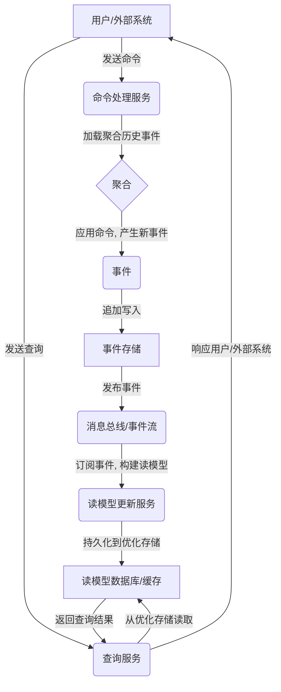

你好，我是 qmwneb946，一位热衷于探索技术深处的博主。今天，我们将一同踏上一段激动人心的旅程，深入剖析一种革命性的架构范式——事件溯源（Event Sourcing）。

在当今瞬息万变的数字化世界中，构建能够适应变化、提供强大审计能力、并能轻松扩展的系统，已成为每位架构师和开发者的核心挑战。我们传统的数据库建模方式，通常只存储系统的当前状态，这在大多数情况下都行之有效。然而，当我们需要理解“为什么”某个状态会发生改变，或者需要回溯到过去某个时间点，甚至在未来基于历史数据构建新的业务洞察时，传统模式便显得力不从心。

事件溯源正是在这种背景下应运而生的一种强大模式。它颠覆了我们对数据存储和业务逻辑处理的传统认知，将系统的每一次状态变更都视为一个不可变的、具有业务意义的“事件”来持久化。这不仅仅是一种技术实现，更是一种思维模式的转变，它迫使我们从业务发生的“事实”而非“当前结果”来思考系统。

本文将带领你从事件溯源的基本概念出发，逐步深入其核心原理、剖析其带来的巨大优势与面临的挑战，探讨它与相关架构模式（如 CQRS 和 DDD）的协同作用，并通过具体的代码示例展示其实现方式，最后展望其在实际应用中的巨大潜力。无论你是寻求解决复杂系统挑战的架构师，还是渴望拓宽技术视野的开发者，相信这篇文章都将为你带来新的启发。

---

## 1. 什么是事件溯源？

### 1.1 概念核心：存储变更而非最终状态

在传统的数据库设计中，我们通常关注的是数据的当前状态。例如，一个用户的银行账户余额，我们只会存储最终的余额数字。如果用户存入100元，然后取出50元，最终余额是50元，我们只存储这个50。我们丢失了“存入100”和“取出50”这些重要的业务事实。

事件溯源（Event Sourcing）则提供了一种截然不同的数据存储和管理方式。它不存储应用程序的当前状态，而是存储一系列能够导致当前状态的、不可变的“事件”（Events）。每一个事件都代表了系统在特定时间点发生的一个业务事实。当我们需要获取系统的当前状态时，我们不是直接从数据库中读取一个预计算好的值，而是通过重放（Replay）所有历史事件来重建（Reconstruct）出当前的状态。

我们可以用一个简单的类比来理解事件溯源：
*   **传统方式** 就像银行账单只显示你账户最终的余额。你不知道这笔钱是怎么来的，经历了哪些存取过程。
*   **事件溯源** 就像银行的交易流水（ledger）。每一笔存款、取款、转账都是一个独立的、不可更改的记录。你的当前余额可以通过汇总所有这些交易记录来计算得出。如果你想知道上周五你的余额是多少，你只需回溯到那个时间点，计算从开户到那个时间点所有交易的总和。

### 1.2 事件溯源与传统 CRUD 的对比

让我们通过一个表格来直观地对比事件溯源与传统基于 CRUD（Create, Read, Update, Delete）的数据存储模式：

| 特性           | 传统 CRUD 模式                                       | 事件溯源模式                                            |
| :------------- | :--------------------------------------------------- | :------------------------------------------------------ |
| **数据存储**   | 存储系统实体（Entity）的当前状态。                  | 存储导致状态变更的不可变事件序列。                      |
| **数据更新**   | 直接修改数据库中的记录，覆盖旧值。                  | 仅追加新的事件，旧事件不可修改或删除。                  |
| **历史记录**   | 默认不保留，需额外审计日志或版本控制。              | 内置完整的历史记录（事件流），提供审计和回溯能力。      |
| **数据丢失**   | 如果没有额外机制，则会丢失“为什么”发生变更的信息。  | 不丢失任何变更细节，记录所有业务事实。                  |
| **查询方式**   | 直接查询当前状态表。                                | 通常通过“读模型”（Read Model）或重放事件来查询。       |
| **数据源**     | 当前状态即唯一真实数据源。                          | 事件流是唯一真实数据源，当前状态是事件的投影。          |
| **复杂业务**   | 难以建模复杂的时间依赖型业务逻辑。                  | 天然支持时间序列和业务流程的建模。                      |

### 1.3 核心组成部分

一个典型的事件溯源系统通常包含以下核心组件：

*   **事件 (Events):** 代表了系统中发生的业务事实，是不可变的。
*   **事件存储 (Event Store):** 持久化存储所有事件的数据库，通常是 append-only（只追加）的。它是系统的真实数据源。
*   **聚合 (Aggregate):** 领域驱动设计（DDD）中的概念，是事件处理的边界。它负责接收命令，生成事件，并根据事件更新自身状态。
*   **读模型 (Read Models / Projections):** 根据事件流构建的、针对特定查询优化的数据视图。因为事件存储不便于直接查询当前状态，读模型提供了高效的查询能力。

理解了这些基本概念，我们就可以深入探讨事件溯源是如何在底层工作的。

---

## 2. 事件溯源的核心原理

事件溯源的强大之处在于其独特的数据流和状态管理机制。本节我们将详细剖析这些核心原理。

### 2.1 事件 (Events)

事件是事件溯源的基石。它们是系统内部或外部发生的、具有业务意义的事实性记录。

#### 2.1.1 事件的特性

*   **不可变性 (Immutability):** 一旦事件被记录，它就不能被修改或删除。它代表了一个已经发生的事实，就像历史一样无法改变。这简化了数据一致性问题，并为审计提供了强大支持。
*   **过去时态 (Past Tense):** 事件名称通常使用过去时态，如 `OrderPlaced` (订单已下达)、`MoneyWithdrawn` (金钱已取出)、`UserRegistered` (用户已注册)。这强调了事件是已发生的事实。
*   **业务中心 (Domain-Centric):** 事件应该反映领域专家理解的业务概念，而不是技术实现细节。它们是业务语言的自然表达。
*   **幂等性 (Idempotency):** 理论上，一个事件在被处理多次时，应该只产生一次最终效果。虽然事件本身是不可变的，但事件处理器在处理事件时需要确保幂等性，以应对网络重试或系统恢复。
*   **自包含性 (Self-Contained):** 每个事件都应包含完成其目的所需的所有信息，而不需要依赖外部系统或数据库查询。

#### 2.1.2 事件的结构

一个事件通常包含以下几个关键部分：

*   **事件类型 (EventType):** 标识事件的名称和含义。
*   **事件 ID (EventId):** 唯一标识一个事件的 ID。
*   **聚合 ID (AggregateId):** 标识此事件所属的聚合实例（例如，哪个订单、哪个用户）。
*   **版本号 (Version):** 标识聚合在该事件发生时的版本号。这对于检测并发冲突至关重要。
*   **时间戳 (Timestamp):** 记录事件发生的时间。
*   **事件数据 (Payload/Data):** 包含事件发生时的所有业务数据。
*   **元数据 (Metadata):** 可选，包含如执行操作的用户 ID、IP 地址等上下文信息。

**示例：一个银行账户的事件**

```json
{
  "eventId": "a1b2c3d4-e5f6-7890-1234-567890abcdef",
  "eventType": "MoneyDeposited",
  "aggregateId": "account-12345",
  "version": 2, // 发生此事件后，聚合的版本号将是2
  "timestamp": "2023-10-26T10:30:00Z",
  "data": {
    "amount": 100.00,
    "currency": "USD",
    "transactionId": "tx-abc-123"
  },
  "metadata": {
    "userId": "user-999",
    "ipAddress": "192.168.1.100"
  }
}
```

### 2.2 事件存储 (Event Store)

事件存储是事件溯源系统的核心组件，它是所有事件的持久化层，也是系统的唯一真理之源（Single Source of Truth）。

#### 2.2.1 核心职责

*   **持久化事件 (Persist Events):** 安全可靠地存储事件。
*   **追加写 (Append-Only):** 只能向事件流中追加新的事件，不允许修改或删除已存在的事件。这简化了并发控制和数据一致性。
*   **原子写入 (Atomic Writes):** 对于属于同一个聚合的事件，必须以原子方式写入。这意味着一个聚合生成的一组新事件要么全部写入成功，要么全部失败，确保聚合状态的完整性。
*   **版本控制 (Versioning):** 事件存储通常会为每个聚合实例维护一个版本号。每次写入新事件时，版本号递增，用于并发控制和乐观锁。
*   **按聚合查询 (Query by Aggregate):** 能够高效地检索特定聚合的所有事件。

#### 2.2.2 实现方式

事件存储可以有多种实现方式：

*   **专用事件存储数据库:** 如 EventStoreDB，它是专门为事件溯源设计的，提供了高性能的追加写、流订阅等功能。
*   **关系型数据库:** 可以通过创建只追加的表来模拟事件存储。例如，一张表 `events (id, aggregate_id, version, type, data, timestamp)`，并为 `(aggregate_id, version)` 创建唯一索引来保证版本顺序和并发控制。
*   **NoSQL 数据库:** 如 Cassandra、MongoDB 也可以用于构建事件存储，通过文档或键值对存储事件流。
*   **消息队列/日志系统:** Kafka 也可以作为事件存储的底层技术，因为它天然就是 append-only 的分布式日志。

### 2.3 状态重建 (State Reconstruction)

事件溯源的核心操作之一就是从事件流中重建出聚合的当前状态。

#### 2.3.1 重建过程

当应用程序需要一个聚合的当前状态时（例如，处理一个命令），它不会直接从数据库中查询。相反，它会执行以下步骤：

1.  **加载事件:** 从事件存储中加载该聚合实例的所有事件，按照它们的发生顺序。
2.  **创建初始状态:** 创建聚合的一个空白实例。
3.  **应用事件:** 按照时间顺序，将加载到的每一个事件应用（Apply）到聚合实例上。每个事件都会改变聚合的状态。
    $$S_0 = \text{InitialState}$$
    $$S_1 = \text{ApplyEvent}(S_0, E_1)$$
    $$S_2 = \text{ApplyEvent}(S_1, E_2)$$
    $$\dots$$
    $$S_n = \text{ApplyEvent}(S_{n-1}, E_n)$$
    其中 $S_t$ 是在应用了第 $t$ 个事件 $E_t$ 后的聚合状态。

最终，当所有事件都被应用完毕后，聚合实例就达到了它的当前状态。这个过程也可以视为一个折叠（fold）或归约（reduce）操作，将一系列事件归约为一个单一的状态值。

#### 2.3.2 聚合的作用

在领域驱动设计（DDD）中，**聚合**是事件溯源的核心。它作为一致性边界，负责处理命令、生成事件并维护自身内部的一致性。
一个聚合在内部维护着它的状态。当一个命令（Command）到达时，聚合会：
1.  根据当前状态验证命令的合法性。
2.  如果命令合法，则执行业务逻辑，并产生一个或多个新的事件。
3.  将这些新事件“应用”到自身状态上，更新自己的内存状态。
4.  将这些新事件存储到事件存储中。

这个过程确保了所有状态变更都通过事件反映，并且是事务性的。

### 2.4 快照 (Snapshots)

对于拥有大量历史事件的聚合，每次都从头开始重放所有事件来重建状态会非常耗时。为了优化这个过程，我们可以引入“快照”（Snapshots）。

#### 2.4.1 快照的原理

快照是聚合在特定版本时的完整状态的序列化表示。它不是事件，而是聚合状态的一个“切片”。

当一个聚合的事件数量达到一定阈值（例如，100个事件）时，系统可以创建一个快照，并将其与最新的事件版本一起存储。
当需要重建聚合状态时：
1.  系统会首先尝试加载最近的快照。
2.  如果存在快照，则从快照对应的版本开始，只加载并重放该版本之后的所有事件。
    $$S_n = \text{ApplyEvents}(\text{SnapshotState}_k, E_{k+1}, \dots, E_n)$$
    其中 $\text{SnapshotState}_k$ 是在版本 $k$ 时的快照状态。

这显著减少了需要重放的事件数量，从而加快了状态重建的速度。

#### 2.4.2 快照的存储与管理

快照通常与事件存储在同一个位置（或紧密关联），并且也会被版本化。快照本身不是事件流的一部分，它只是一个优化读取的缓存。如果快照丢失或损坏，仍然可以通过从头重放所有事件来恢复状态。

快照的生成策略需要权衡：
*   **生成频率过高:** 增加存储开销和生成开销。
*   **生成频率过低:** 状态重建时需要重放更多事件，性能提升不明显。

通常会根据聚合的事件增长速度和性能需求来决定快照的生成策略。

---

## 3. 事件溯源的优势与挑战

事件溯源作为一种强大的架构模式，带来了显著的优势，但也伴随着一系列的挑战。理解这些是决定是否采纳事件溯源的关键。

### 3.1 优势 (Advantages)

#### 3.1.1 完整的历史记录 (Full History)
这是事件溯源最显著的优势。所有的状态变更都被记录为不可变的事件。这意味着：
*   **强大的审计能力:** 轻松追溯任何时间点的数据状态及其变更原因，满足合规性要求。
*   **业务洞察:** 通过分析历史事件流，可以发现业务趋势、用户行为模式，为决策提供数据支持。例如，分析用户从注册到首次购买的路径，或者订单从创建到完成的整个生命周期。
*   **调试与故障排除:** 当出现错误时，可以精确回溯到错误发生前的状态，理解导致问题的事件序列。
*   **“为什么”的答案:** 不仅知道“是什么”（当前状态），更知道“为什么会是这样”（所有导致当前状态的事件）。

#### 3.1.2 时间旅行 (Time Travel)
由于拥有完整的事件历史，可以轻松地将系统或特定聚合的状态回溯到任意过去的时刻。这对于以下场景非常有价值：
*   **模拟历史数据:** 在测试环境中重现生产环境的历史数据状态，进行精确的故障排查或回归测试。
*   **业务决策回溯:** 模拟不同历史时间点的数据视图，以分析当时的市场情况或用户行为。
*   **用户错误恢复:** 如果用户不小心删除了数据或进行了错误操作，可以通过回溯事件来恢复。

#### 3.1.3 简化复杂领域 (Simplifying Complex Domains)
事件溯源鼓励以业务事件为中心来建模。这种方式与领域专家讨论业务流程的方式非常契合，有助于：
*   **更好地理解业务:** 事件是业务行为的直接映射，使得开发团队和业务团队之间有了共同的语言。
*   **更清晰的领域模型:** 聚合负责处理命令并发布事件，清晰地定义了领域行为和数据流。
*   **处理时间相关逻辑:** 对于需要处理复杂时间序列或业务流程的系统（如金融交易、物联网数据、物流追踪），事件溯源天然适配。

#### 3.1.4 提高可伸缩性 (Improved Scalability)
*   **写操作优化:** 事件存储本质上是追加写入（Append-Only）的数据结构，这在写入负载高的场景下性能极佳，因为不需要更新现有记录或处理复杂的锁。这使得事件存储成为一个高吞吐量的写入通道。
*   **读写分离 (CQRS Synergy):** 事件溯源与 CQRS（Command Query Responsibility Segregation）模式是天作之合。写模型（基于事件溯源）和读模型可以独立优化和扩展。写模型只负责处理命令和持久化事件，而读模型则可以根据各种查询需求创建多个优化视图，每个视图都可以独立扩展。

#### 3.1.5 更好的集成点 (Better Integration Points)
事件作为系统状态变化的通知，天然地提供了服务间集成的机制：
*   **事件驱动架构 (Event-Driven Architecture - EDA):** 事件溯源是构建事件驱动型微服务架构的理想选择。当一个服务产生事件时，其他服务可以订阅并消费这些事件，以响应式地更新自己的状态或触发新的业务流程。
*   **异步通信:** 服务间通过事件进行异步解耦，提高了系统的弹性和容错性。

#### 3.1.6 可演化性 (Evolvability)
由于事件是原始的业务事实，并且是不可变的，这意味着：
*   **新的读模型:** 可以在未来随时基于已有的历史事件流构建全新的读模型，以支持新的业务需求或分析查询，而无需修改核心业务逻辑或重新进行大规模数据迁移。
*   **数据模型变更适应性:** 即使业务逻辑或数据模型发生变化，历史事件依然保持其原始含义。可以通过“事件升级器”（Event Upcasters）或版本化策略来处理事件模式的演变。

### 3.2 挑战 (Challenges)

尽管事件溯源优势显著，但它并非银弹，也带来了一系列需要认真考虑的挑战。

#### 3.2.1 学习曲线 (Steep Learning Curve)
*   **思维模式转变:** 从传统的“当前状态”思维转变为“事件流”思维，需要时间和适应。
*   **复杂性增加:** 需要理解事件、聚合、快照、读模型等概念，并正确地将它们组合起来。
*   **新的设计模式:** 需要熟悉 CQRS、领域驱动设计等相关模式。

#### 3.2.2 数据查询复杂性 (Query Complexity)
*   **没有直接的当前状态查询:** 无法直接对事件存储进行 SQL-like 查询来获取当前状态。每次查询都需要重建状态，这对于复杂的查询或大量并发查询是不可行的。
*   **读模型管理:** 必须构建和维护独立的读模型来支持高效查询。这意味着数据冗余和最终一致性问题（读模型需要时间来同步事件）。
*   **数据同步:** 读模型需要监听事件流并更新自身，确保读写模型之间的数据最终一致。这引入了额外的复杂性，包括事件处理的幂等性、消费者偏移量管理等。

#### 3.2.3 事件版本控制 (Event Versioning)
*   **事件模式演变:** 业务需求和领域模型会不断发展，导致事件的结构（schema）也可能发生变化。
*   **处理历史事件:** 如何处理旧版本的事件并将其转换为新版本的结构，以便在重建状态时正确应用它们？这通常需要“事件升级器”（Event Upcasters）或版本化事件的概念，这会增加系统的复杂性。
*   **兼容性问题:** 确保旧代码能够处理新事件，新代码能够向后兼容旧事件。

#### 3.2.4 数据量增长 (Data Volume)
*   **存储需求:** 由于存储每一个状态变更，事件存储会比只存储当前状态的数据库增长得更快，尤其是在高频操作的系统中。
*   **性能考量:** 大量事件可能导致事件加载和重放的性能问题，尽管快照可以缓解，但仍需谨慎设计。
*   **归档与清理:** 长期事件存储的归档策略、如何处理不活跃的聚合的事件流。

#### 3.2.5 调试复杂性 (Debugging Complexity)
*   **状态不可直接查看:** 调试时不能直接查看数据库中的当前状态，而是需要模拟重放事件序列来理解聚合行为。
*   **分布式跟踪:** 在事件驱动的微服务架构中，跟踪一个请求的完整生命周期（它触发了哪些事件，这些事件又被哪些服务消费）会变得更加复杂，需要分布式日志和跟踪工具。

#### 3.2.6 数据删除 (Data Deletion / GDPR)
*   **“被遗忘权”的挑战:** GDPR 等法规要求用户有权删除其个人数据。但事件是不可变的，如何删除一个已经发生的“事实”？
*   **解决方案复杂:** 通常的策略包括：
    *   **加密擦除 (Cryptographic Erasure):** 将事件数据加密，然后在需要删除时销毁加密密钥，使得数据不可读。
    *   **数据匿名化/假名化:** 将敏感数据替换为匿名值或假名。
    *   **事件清除 (Event Purging):** 在极端情况下，删除整个聚合的事件流，但这会丢失历史信息，且操作复杂，通常只作为最后手段。
*   **并非所有数据都适合事件溯源:** 对于频繁需要删除或更新的非核心数据，传统 CRUD 可能更合适。

#### 3.2.7 幂等性 (Idempotency)
*   **事件处理幂等性:** 消费事件的下游服务必须是幂等的，即多次处理同一个事件不会导致不同的结果。这对于消息传递系统中的重试和容错至关重要。
*   **命令幂等性:** 确保处理命令时即使因网络问题等重试，也不会创建重复的业务实体。

总结来说，事件溯源提供了无与伦比的历史洞察力和系统演化能力，但其复杂性和对团队技能的要求也更高。它最适合那些领域复杂、需要审计、时间敏感或需要灵活地演进读模型以满足新业务需求的系统。

---

## 4. 事件溯源与相关模式

事件溯源很少单独使用，它通常与其它架构和设计模式结合，以发挥最大的效用。其中最典型的便是 CQRS 和领域驱动设计（DDD）。

### 4.1 CQRS (Command Query Responsibility Segregation)

CQRS，即命令查询职责分离，是一种将应用程序的读操作和写操作分离的架构模式。它与事件溯源是天作之合，几乎可以认为是事件溯源的必然伴侣。

#### 4.1.1 核心思想

在传统的 CRUD 模式中，读和写操作通常都作用于同一个数据模型（通常是关系型数据库中的表结构）。然而，读和写的需求往往大相径庭：
*   **写操作 (Commands):** 通常需要高一致性、事务性，并处理复杂的业务规则。
*   **读操作 (Queries):** 通常需要高性能、低延迟，支持各种复杂的查询和报表。

CQRS 将这些职责分离：
*   **命令模型 (Write Model):** 负责处理命令（代表意图），执行业务逻辑，并生成事件。事件溯源就是命令模型的理想实现方式。它只关注业务逻辑和事件的持久化。
*   **查询模型 (Read Model / Query Model):** 负责处理查询请求。它通常是针对特定查询优化过的数据视图，由命令模型发布的事件异步地构建和更新。

#### 4.1.2 CQRS 如何与事件溯源协同工作

1.  **命令接收与处理:** 用户或系统发送一个**命令**（Command），例如 `DepositMoneyCommand`。
2.  **写模型处理:** 命令被发送到事件溯源的**聚合**。聚合加载其历史事件来重建当前状态，验证命令，然后生成一个新的或多个**事件**（Event），例如 `MoneyDepositedEvent`。
3.  **事件持久化:** 新生成的事件被追加到**事件存储**中。
4.  **事件发布:** 事件存储或专门的事件发布机制将新事件发布到**消息总线**（Message Bus）或**事件流**（Event Stream）中。
5.  **读模型更新:** 监听器（Listener）或投影器（Projector）订阅事件流，消费这些事件。它们将事件数据转换为适合查询的结构（例如，一个扁平化的数据库表、一个 NoSQL 文档库、一个搜索索引等）。
6.  **查询执行:** 当用户或系统需要查询数据时，直接从优化的**读模型**中获取数据，而无需触及事件存储或重建聚合状态。

**流程示意图：**


#### 4.1.3 CQRS 带来的好处

*   **独立的扩展性:** 读和写可以独立地扩展，以满足各自的负载需求。
*   **优化的数据模型:** 读模型可以针对不同的查询场景进行高度优化，例如，一个用于列表展示，另一个用于详细信息，甚至可以使用不同的数据库技术。
*   **简化复杂性:** 领域逻辑集中在写模型，而查询逻辑则集中在读模型，职责更清晰。
*   **灵活性:** 可以在不影响写模型的情况下，根据新的业务需求构建新的读模型。

### 4.2 领域驱动设计 (Domain-Driven Design - DDD)

领域驱动设计（DDD）是一种软件开发方法论，它强调将软件的核心复杂性集中在领域模型上，并使其与业务专家的语言和概念保持一致。事件溯源与 DDD 是天然的搭档。

#### 4.2.1 核心概念

*   **领域 (Domain):** 业务的范围和主题。
*   **通用语言 (Ubiquitous Language):** 业务专家和开发团队之间共享的、无歧义的语言。事件溯源中的事件名称、属性都应遵循通用语言。
*   **聚合 (Aggregate):** DDD 中的一个模式，表示一组相关的对象（实体和值对象），被视为一个单一的、原子性的单元。聚合是事件处理和一致性边界的理想场所。一个命令只作用于一个聚合。
*   **限界上下文 (Bounded Context):**  DDD 中对领域模型的逻辑边界的划分。每个限界上下文都有自己的领域模型和通用语言。事件通常是跨限界上下文集成的关键。

#### 4.2.2 DDD 如何促进事件溯源

*   **聚合作为事件源:** DDD 中的聚合天然就是事件溯源中的事件源。聚合接收命令，通过其内部业务逻辑生成事件，并应用这些事件来改变自身状态。这种设计模式使得聚合成为一致性和事务的边界。
*   **事件作为领域事件:** 事件溯源中的事件直接对应 DDD 中的“领域事件”（Domain Events）。它们捕获了领域中发生的有意义的事情。使用通用语言来命名事件和事件属性，确保了业务和技术模型的一致性。
*   **驱动业务流程:** 通过发布和订阅领域事件，可以协调跨聚合或跨限界上下文的复杂业务流程（通过 Saga 或 Process Manager）。
*   **模型清晰化:** 事件溯源迫使我们清晰地定义聚合的行为和它能产生的事件，从而提升了领域模型的清晰度和准确性。

### 4.3 Sagas / Process Managers

在事件驱动的架构中，当一个业务流程跨越多个聚合或多个服务时，我们不能使用传统分布式事务（Two-Phase Commit）。Saga 或 Process Manager 就是用来协调这些长周期、分布式事务的模式。

#### 4.3.1 核心思想

Saga 是一个长期的、跨多步的分布式事务，它由一系列本地事务组成，每个本地事务都会发布一个事件来触发 Saga 中的下一个步骤。如果 Saga 中的某个步骤失败，它会通过执行补偿事务来回滚之前成功的步骤。

Process Manager 是一种特殊类型的 Saga，它通常作为独立的组件来监听和协调事件，并发出命令以推进业务流程。

#### 4.3.2 与事件溯源的关联

*   **事件驱动:** Saga 和 Process Manager 是事件驱动的，它们通过订阅事件来感知业务进展，并通过发布命令来触发下一步操作。这与事件溯源产生的事件流天然契合。
*   **状态管理:** Saga 或 Process Manager 本身也可以通过事件溯源来管理自己的状态。例如，一个 `OrderPlacementSagaStarted` 事件、`PaymentProcessedEvent` 事件、`ShippingInitiatedEvent` 事件等，构成了 Saga 自身的事件流。这样，Saga 也能享受到事件溯源带来的审计和时间旅行能力。

简而言之，事件溯源提供了原子性的“写”模型，CQRS 提供了弹性的“读”模型，而 DDD 提供了高质量的领域建模方法，Saga/Process Manager 则协调跨服务的业务流程。这四者结合起来，能够构建出高度可扩展、可维护、且与业务强耦合的复杂分布式系统。

---

## 5. 如何实现事件溯源

了解了事件溯源的理论，现在我们来看看在实践中如何实现它。我们将探讨技术选型、基本工作流程，并提供一个简化的代码示例。

### 5.1 技术选型

实现事件溯源时，最重要的选择之一是“事件存储”的实现。

*   **专用事件存储数据库：EventStoreDB**
    *   **优点：** 专为事件溯源设计，提供高性能的追加写入、订阅、并发控制、快照支持等。功能强大且经过优化。
    *   **缺点：** 引入新的数据库技术栈，学习曲线。
    *   **适用场景：** 对事件溯源有深入需求，追求高性能、高吞吐量且项目规模较大的情况。

*   **消息队列/日志系统：Apache Kafka**
    *   **优点：** 天然的追加日志特性，高吞吐量、高可用性、分布式。可以作为事件流的发布和订阅中心，也可以直接用作事件存储。
    *   **缺点：** 并非完整的事件存储（缺乏聚合并发控制、快照管理等内置功能，需要自行实现）。
    *   **适用场景：** 已有 Kafka 基础设施，需要构建大规模事件驱动微服务，并能接受自行实现部分事件存储特性。

*   **关系型数据库：PostgreSQL, MySQL 等**
    *   **优点：** 技术成熟，社区支持广泛，多数团队已熟悉。可利用事务和唯一索引实现并发控制。
    *   **缺点：** 并非为事件存储优化，追加写性能可能不如专用方案。查询历史事件可能需要手动索引优化。
    *   **实现方式：** 创建一个 `events` 表，包含 `aggregate_id`, `version`, `event_type`, `event_data`, `timestamp` 等字段。利用 `(aggregate_id, version)` 上的唯一索引来实现乐观锁，确保同一聚合同一版本只能有一个事件。
    *   **适用场景：** 中小型项目，或希望最小化引入新技术的复杂性。

*   **NoSQL 数据库：MongoDB, Cassandra 等**
    *   **优点：** 灵活性高，可扩展性强，适合存储半结构化事件数据。
    *   **缺点：** 需要自行处理事务和并发控制。
    *   **适用场景：** 对数据模型灵活性有较高要求，或已使用 NoSQL 技术栈的项目。

*   **编程语言框架/库：**
    *   **Java:** Axon Framework, Spring for Apache Kafka (结合 Kafka)
    *   **.NET:** NServiceBus, EventStore.Client (结合 EventStoreDB)
    *   **Python:** 各类轻量级库或自定义实现。

### 5.2 基本工作流程

让我们以一个简单的银行账户系统为例，来描述事件溯源的核心工作流程。

**场景：用户向银行账户存款。**

1.  **接收命令 (Command Reception):**
    *   系统接收到一个 `DepositMoneyCommand`，包含 `accountId`, `amount` 等信息。

2.  **加载聚合 (Aggregate Loading):**
    *   系统（例如，通过一个 `AccountService`）从事件存储中加载 `accountId` 对应的所有历史事件。
    *   将这些事件按顺序重放到一个 `Account` 聚合实例上，重建其当前状态（例如，当前余额、版本号）。

3.  **命令验证与事件生成 (Command Validation & Event Generation):**
    *   `Account` 聚合接收 `DepositMoneyCommand`。
    *   聚合验证命令（例如，存款金额是否为正数）。
    *   如果验证通过，聚合执行存款业务逻辑，并生成一个新的事件：`MoneyDepositedEvent`。
    *   **注意：** 聚合不会直接修改数据库，它只在内存中更新自己的状态，并“记录”将要发生的事件。

4.  **持久化事件 (Event Persistence):**
    *   系统将 `MoneyDepositedEvent` 及其关联的聚合版本号（用于乐观锁）发送给事件存储。
    *   事件存储原子性地将新事件追加到该账户的事件流中。
    *   如果在此过程中发生并发冲突（其他操作同时修改了同一账户），事件存储会拒绝写入，并通知系统进行重试（乐观锁）。

5.  **发布事件 (Event Publishing):**
    *   事件存储在成功持久化事件后，会发布一个通知（例如，通过回调、消息队列），表明新事件已可用。

6.  **更新读模型 (Read Model Update):**
    *   订阅了 `MoneyDepositedEvent` 的读模型更新服务（Projection Service）会接收到该事件。
    *   它将事件数据投影到对应的读模型数据库中，例如更新 `AccountSummary` 表的余额字段。这通常是一个异步过程，导致读模型可能存在短暂的最终一致性延迟。

7.  **响应 (Response):**
    *   命令处理成功后，系统向请求方返回成功响应。

### 5.3 代码示例 (Python)

我们用 Python 来演示一个简化的银行账户事件溯源系统。

```python
import uuid
import datetime
from abc import ABC, abstractmethod
from typing import List, Dict, Type, Any

# ----------------------------------------------------------------------
# 1. 事件定义 (Event Definitions)
# ----------------------------------------------------------------------

class DomainEvent(ABC):
    """领域事件的基类"""
    def __init__(self, aggregate_id: str, version: int, timestamp: datetime.datetime = None):
        self.event_id = str(uuid.uuid4())
        self.aggregate_id = aggregate_id
        self.version = version
        self.timestamp = timestamp if timestamp else datetime.datetime.now(datetime.timezone.utc)

    @abstractmethod
    def to_dict(self) -> Dict[str, Any]:
        """将事件转换为字典格式以便序列化"""
        return {
            "event_id": self.event_id,
            "event_type": self.__class__.__name__,
            "aggregate_id": self.aggregate_id,
            "version": self.version,
            "timestamp": self.timestamp.isoformat(),
        }

    @classmethod
    @abstractmethod
    def from_dict(cls, data: Dict[str, Any]):
        """从字典反序列化为事件对象"""
        raise NotImplementedError

class AccountCreatedEvent(DomainEvent):
    """账户创建事件"""
    def __init__(self, aggregate_id: str, account_holder: str, initial_balance: float, version: int = 1):
        super().__init__(aggregate_id, version)
        self.account_holder = account_holder
        self.initial_balance = initial_balance

    def to_dict(self) -> Dict[str, Any]:
        base_dict = super().to_dict()
        base_dict.update({
            "account_holder": self.account_holder,
            "initial_balance": self.initial_balance,
        })
        return base_dict

    @classmethod
    def from_dict(cls, data: Dict[str, Any]):
        return cls(
            aggregate_id=data['aggregate_id'],
            account_holder=data['account_holder'],
            initial_balance=data['initial_balance'],
            version=data['version']
        )

class MoneyDepositedEvent(DomainEvent):
    """存款事件"""
    def __init__(self, aggregate_id: str, amount: float, version: int):
        super().__init__(aggregate_id, version)
        self.amount = amount

    def to_dict(self) -> Dict[str, Any]:
        base_dict = super().to_dict()
        base_dict.update({
            "amount": self.amount,
        })
        return base_dict

    @classmethod
    def from_dict(cls, data: Dict[str, Any]):
        return cls(
            aggregate_id=data['aggregate_id'],
            amount=data['amount'],
            version=data['version']
        )

class MoneyWithdrawnEvent(DomainEvent):
    """取款事件"""
    def __init__(self, aggregate_id: str, amount: float, version: int):
        super().__init__(aggregate_id, version)
        self.amount = amount

    def to_dict(self) -> Dict[str, Any]:
        base_dict = super().to_dict()
        base_dict.update({
            "amount": self.amount,
        })
        return base_dict

    @classmethod
    def from_dict(cls, data: Dict[str, Any]):
        return cls(
            aggregate_id=data['aggregate_id'],
            amount=data['amount'],
            version=data['version']
        )

# 注册所有事件类型，用于从字典反序列化
EVENT_TYPES: Dict[str, Type[DomainEvent]] = {
    "AccountCreatedEvent": AccountCreatedEvent,
    "MoneyDepositedEvent": MoneyDepositedEvent,
    "MoneyWithdrawnEvent": MoneyWithdrawnEvent,
}

# ----------------------------------------------------------------------
# 2. 聚合 (Aggregate)
# ----------------------------------------------------------------------

class Account:
    """
    银行账户聚合。
    它负责应用事件来重建自身状态，并处理命令来生成新事件。
    """
    def __init__(self, account_id: str = None):
        self._id = account_id if account_id else str(uuid.uuid4())
        self._balance = 0.0
        self._holder = ""
        self._version = 0  # 当前聚合的版本号
        self._uncommitted_events: List[DomainEvent] = [] # 待持久化的新事件

    @property
    def id(self) -> str:
        return self._id

    @property
    def balance(self) -> float:
        return self._balance

    @property
    def holder(self) -> str:
        return self._holder

    @property
    def version(self) -> int:
        return self._version

    @property
    def uncommitted_events(self) -> List[DomainEvent]:
        return self._uncommitted_events

    def _apply(self, event: DomainEvent):
        """
        内部方法：根据事件类型更新聚合的状态。
        这是状态重建和事件处理的核心。
        """
        if isinstance(event, AccountCreatedEvent):
            self._id = event.aggregate_id
            self._holder = event.account_holder
            self._balance = event.initial_balance
        elif isinstance(event, MoneyDepositedEvent):
            self._balance += event.amount
        elif isinstance(event, MoneyWithdrawnEvent):
            self._balance -= event.amount
        
        # 更新版本号
        self._version = event.version

    @classmethod
    def load_from_history(cls, account_id: str, history: List[DomainEvent]):
        """
        从历史事件流重建账户状态。
        """
        account = cls(account_id)
        for event in history:
            account._apply(event)
        return account

    # --- 命令处理方法 (生成事件) ---

    def create_account(self, account_holder: str, initial_balance: float = 0.0):
        """
        创建账户的命令处理。
        注意：只能在账户未创建时调用。
        """
        if self._version != 0:
            raise ValueError("Account already exists!")
        
        self._version += 1 # 预期产生新事件后的版本号
        event = AccountCreatedEvent(self.id, account_holder, initial_balance, self._version)
        self._apply(event) # 立即在内存中应用事件
        self._uncommitted_events.append(event) # 添加到待持久化列表

    def deposit_money(self, amount: float):
        """
        存款命令处理。
        """
        if amount <= 0:
            raise ValueError("Deposit amount must be positive.")
        if self._version == 0:
            raise ValueError("Account not yet created.")

        self._version += 1
        event = MoneyDepositedEvent(self.id, amount, self._version)
        self._apply(event)
        self._uncommitted_events.append(event)

    def withdraw_money(self, amount: float):
        """
        取款命令处理。
        """
        if amount <= 0:
            raise ValueError("Withdrawal amount must be positive.")
        if self._version == 0:
            raise ValueError("Account not yet created.")
        if self._balance < amount:
            raise ValueError("Insufficient funds.")

        self._version += 1
        event = MoneyWithdrawnEvent(self.id, amount, self._version)
        self._apply(event)
        self._uncommitted_events.append(event)

    def clear_uncommitted_events(self):
        """清空已提交的事件列表"""
        self._uncommitted_events = []


# ----------------------------------------------------------------------
# 3. 事件存储 (Event Store - 简化版，内存实现)
# ----------------------------------------------------------------------

class EventStore:
    """
    简化版的事件存储，内存中模拟。
    真实场景会使用数据库。
    """
    def __init__(self):
        # { aggregate_id: [event_dict_1, event_dict_2, ...] }
        self._events_db: Dict[str, List[Dict[str, Any]]] = {}

    def load_events(self, aggregate_id: str) -> List[DomainEvent]:
        """加载某个聚合的所有事件"""
        event_dicts = self._events_db.get(aggregate_id, [])
        events = []
        for ed in event_dicts:
            event_type_name = ed['event_type']
            event_cls = EVENT_TYPES.get(event_type_name)
            if not event_cls:
                raise ValueError(f"Unknown event type: {event_type_name}")
            events.append(event_cls.from_dict(ed))
        return events

    def append_events(self, aggregate_id: str, expected_version: int, events: List[DomainEvent]):
        """
        追加事件到事件存储。
        包含乐观锁检查。
        """
        current_events = self._events_db.get(aggregate_id, [])
        current_version = current_events[-1]['version'] if current_events else 0

        if current_version != expected_version:
            # 乐观锁失败：其他操作在此期间修改了聚合
            raise ConcurrencyError(
                f"Concurrency conflict for aggregate {aggregate_id}. "
                f"Expected version {expected_version}, but found {current_version}."
            )

        for event in events:
            # 真实场景中，这里应该序列化事件到 JSON/Protobuf 等
            self._events_db.setdefault(aggregate_id, []).append(event.to_dict())
        print(f"DEBUG: Appended {len(events)} events for aggregate {aggregate_id}.")


class ConcurrencyError(Exception):
    """并发冲突异常"""
    pass

# ----------------------------------------------------------------------
# 4. 读模型 (Read Model - 简化版，内存实现)
# ----------------------------------------------------------------------

class AccountSummaryReadModel:
    """
    一个简单的读模型，用于查询账户当前余额。
    它监听事件并更新内部状态。
    """
    def __init__(self):
        # { account_id: { 'holder': '...', 'balance': ... } }
        self._accounts_summary: Dict[str, Dict[str, Any]] = {}

    def project_event(self, event: DomainEvent):
        """根据事件更新读模型"""
        account_id = event.aggregate_id
        if isinstance(event, AccountCreatedEvent):
            self._accounts_summary[account_id] = {
                'holder': event.account_holder,
                'balance': event.initial_balance
            }
            print(f"READ MODEL: Account {account_id} created for {event.account_holder} with initial balance {event.initial_balance}.")
        elif isinstance(event, MoneyDepositedEvent):
            if account_id in self._accounts_summary:
                self._accounts_summary[account_id]['balance'] += event.amount
                print(f"READ MODEL: Deposited {event.amount} to account {account_id}. New balance: {self._accounts_summary[account_id]['balance']}.")
        elif isinstance(event, MoneyWithdrawnEvent):
            if account_id in self._accounts_summary:
                self._accounts_summary[account_id]['balance'] -= event.amount
                print(f"READ MODEL: Withdrew {event.amount} from account {account_id}. New balance: {self._accounts_summary[account_id]['balance']}.")
        else:
            print(f"READ MODEL: Unhandled event type: {event.__class__.__name__}")

    def get_account_summary(self, account_id: str) -> Dict[str, Any]:
        """查询账户摘要"""
        return self._accounts_summary.get(account_id, None)

# ----------------------------------------------------------------------
# 5. 应用服务 (Application Service - 协调命令和事件存储)
# ----------------------------------------------------------------------

class AccountApplicationService:
    """
    应用服务负责协调业务逻辑（聚合）和数据持久化（事件存储）。
    它接收命令，加载聚合，处理命令，并持久化新事件。
    同时，它也负责将新事件发布到读模型。
    """
    def __init__(self, event_store: EventStore, read_model: AccountSummaryReadModel):
        self._event_store = event_store
        self._read_model = read_model

    def create_account(self, account_holder: str, initial_balance: float) -> str:
        new_account_id = str(uuid.uuid4())
        account = Account(new_account_id)
        account.create_account(account_holder, initial_balance)
        
        # 持久化未提交的事件
        self._event_store.append_events(
            account.id, 
            0, # 初始版本0，表示此为首次创建
            account.uncommitted_events
        )
        # 发布事件到读模型 (通常通过消息总线异步发布)
        for event in account.uncommitted_events:
            self._read_model.project_event(event)
        account.clear_uncommitted_events() # 清空已提交事件

        print(f"SERVICE: Account '{new_account_id}' created for '{account_holder}'.")
        return new_account_id

    def deposit_money(self, account_id: str, amount: float):
        events = self._event_store.load_events(account_id)
        if not events:
            raise ValueError(f"Account {account_id} not found.")

        account = Account.load_from_history(account_id, events)
        expected_version = account.version # 当前聚合的版本号，用于乐观锁
        
        account.deposit_money(amount)
        
        self._event_store.append_events(
            account.id, 
            expected_version, 
            account.uncommitted_events
        )
        for event in account.uncommitted_events:
            self._read_model.project_event(event)
        account.clear_uncommitted_events()

        print(f"SERVICE: Deposited {amount} to account '{account_id}'.")

    def withdraw_money(self, account_id: str, amount: float):
        events = self._event_store.load_events(account_id)
        if not events:
            raise ValueError(f"Account {account_id} not found.")

        account = Account.load_from_history(account_id, events)
        expected_version = account.version
        
        account.withdraw_money(amount)
        
        self._event_store.append_events(
            account.id, 
            expected_version, 
            account.uncommitted_events
        )
        for event in account.uncommitted_events:
            self._read_model.project_event(event)
        account.clear_uncommitted_events()
        
        print(f"SERVICE: Withdrew {amount} from account '{account_id}'.")

    def get_account_details(self, account_id: str):
        """从读模型获取账户摘要"""
        return self._read_model.get_account_summary(account_id)

    def get_account_history(self, account_id: str) -> List[DomainEvent]:
        """获取账户的完整事件历史"""
        return self._event_store.load_events(account_id)

# ----------------------------------------------------------------------
# 演示运行 (Demonstration)
# ----------------------------------------------------------------------

if __name__ == "__main__":
    event_store = EventStore()
    read_model = AccountSummaryReadModel()
    app_service = AccountApplicationService(event_store, read_model)

    print("--- 创建账户 ---")
    account_id_john = app_service.create_account("John Doe", 100.0)
    print(f"John's account ID: {account_id_john}")
    print(f"Current balance via Read Model: {app_service.get_account_details(account_id_john)}")
    print("-" * 30)

    print("--- 存款 ---")
    app_service.deposit_money(account_id_john, 50.0)
    print(f"Current balance via Read Model: {app_service.get_account_details(account_id_john)}")
    print("-" * 30)

    print("--- 取款 ---")
    app_service.withdraw_money(account_id_john, 20.0)
    print(f"Current balance via Read Model: {app_service.get_account_details(account_id_john)}")
    print("-" * 30)

    print("--- 尝试透支 (会报错) ---")
    try:
        app_service.withdraw_money(account_id_john, 500.0)
    except ValueError as e:
        print(f"Error: {e}")
    print(f"Current balance via Read Model: {app_service.get_account_details(account_id_john)}")
    print("-" * 30)

    print("--- 重建历史状态 (从事件存储) ---")
    # 模拟重启服务，从事件重建一个聚合实例
    events_from_store = event_store.load_events(account_id_john)
    reconstructed_account = Account.load_from_history(account_id_john, events_from_store)
    print(f"Reconstructed Account ID: {reconstructed_account.id}")
    print(f"Reconstructed Account Holder: {reconstructed_account.holder}")
    print(f"Reconstructed Account Balance: {reconstructed_account.balance}")
    print(f"Reconstructed Account Version: {reconstructed_account.version}")
    print("-" * 30)

    print("--- 查看事件历史 ---")
    history = app_service.get_account_history(account_id_john)
    for i, event in enumerate(history):
        print(f"Event {i+1}: Type={event.__class__.__name__}, Version={event.version}, Data={event.to_dict()}")
```

这个示例展示了事件溯源的核心概念：
*   **事件 (DomainEvent):** 存储了所有账户变更的原子事实。
*   **聚合 (Account):** 作为行为和状态的封装，通过 `_apply` 方法应用事件来更新状态，并通过命令方法（`create_account`, `deposit_money` 等）生成新事件。
*   **事件存储 (EventStore):** 负责持久化事件，并提供乐观锁机制 (`expected_version`)。
*   **读模型 (AccountSummaryReadModel):** 异步地从事件更新，提供高效的查询能力。
*   **应用服务 (AccountApplicationService):** 协调命令处理、事件持久化和读模型更新。

在实际生产环境中，事件存储会是真实的数据库或专用事件存储系统，事件的发布和读模型的更新通常会通过消息队列（如 Kafka, RabbitMQ）实现异步和解耦。

---

## 6. 实际应用场景

事件溯源并非适用于所有系统，但在某些特定场景下，它能发挥出无与伦比的优势。

*   **金融系统与审计:**
    *   **场景：** 银行交易、证券交易、保险理赔。
    *   **优势：** 事件溯源提供了完整的交易流水和状态变更历史，这对于金融行业的严格审计要求至关重要。可以精确追踪每一笔资金的来龙去脉，便于合规性检查和争议解决。例如，要回溯某个账户在特定时间点的余额，只需重放事件。
    *   **数学关联：** 每一笔交易都可以视为一个状态转移函数 $S_{new} = F(S_{old}, \Delta E)$，其中 $\Delta E$ 是由事件带来的变化量。

*   **物联网 (IoT) 与传感器数据:**
    *   **场景：** 智能家居、工业传感器监控、车载系统数据。
    *   **优势：** IoT 设备会持续产生大量时间序列数据。将每个传感器读数、设备状态变更作为事件存储，非常符合事件溯源的追加写特性。这使得回溯设备历史状态、分析趋势、调试异常变得简单。
    *   **数学关联：** 传感器数据流天然是时间序列 $X = \{x_1, x_2, \dots, x_t, \dots\}$，每个 $x_i$ 都可以是一个事件。分析通常涉及时间窗口上的聚合函数 $\sum_{i=t_1}^{t_2} x_i$ 或 $\text{avg}_{i=t_1}^{t_2} x_i$。

*   **游戏开发:**
    *   **场景：** 多人在线游戏中的玩家行为、游戏状态、经济系统。
    *   **优势：** 记录玩家的每一个操作（移动、攻击、拾取物品、交易）作为事件。这使得游戏可以轻松地回放历史对局（replay），重现 bug，甚至在未来调整游戏平衡性时，通过回放事件来模拟不同规则下的经济影响。
    *   **数学关联：** 游戏状态的演化可以看作一个马尔可夫链，其中事件是状态转移的触发器。

*   **合规性与法律要求高的系统:**
    *   **场景：** 医疗记录、政府系统、敏感数据处理。
    *   **优势：** 需要长期保留所有数据变更记录，以满足法律法规和合规性要求。事件溯源提供了不可篡改的审计日志。

*   **复杂业务流程管理:**
    *   **场景：** 订单管理、客户生命周期管理、供应链追踪。
    *   **优势：** 业务流程通常涉及多个步骤和状态转换。将每一步作为事件记录，可以清晰地追踪业务流程的当前状态，并在需要时回溯到任何一个中间状态。结合 Saga 模式，可以有效地管理分布式业务流程。

*   **内容管理系统 (CMS) / 版本控制:**
    *   **场景：** 文档编辑历史、Wiki 系统、代码仓库。
    *   **优势：** 每次保存、修改、发布都可以是一个事件。这使得系统天然具备版本控制能力，可以轻松查看文档的任何历史版本，并进行对比或回滚。Git 本质上就是一种特殊的事件溯源系统。

*   **需要灵活查询或未来分析的系统:**
    *   **场景：** 数据分析平台、商业智能。
    *   **优势：** 原始事件是所有业务事实的真理之源。当新的分析需求出现时，无需修改核心系统，只需创建新的读模型，并从事件流中重新投影数据即可。这提供了极大的灵活性和可演化性。

总而言之，当你的系统需要“为什么”发生某个状态变更、需要强大的审计和回溯能力、业务领域复杂且事件驱动特性明显时，事件溯源是非常值得考虑的架构模式。

---

## 7. 结论

在本文中，我们对事件溯源（Event Sourcing）架构进行了全面而深入的探讨。我们从其基本概念出发，理解了它与传统 CRUD 模式的根本区别——即存储不可变的业务事件流而非仅仅当前状态。我们详细剖析了事件、事件存储、状态重建以及快照等核心原理，它们共同构成了事件溯源的运作基石。

我们也深入分析了事件溯源所带来的显著优势，包括提供完整的历史记录、支持“时间旅行”、简化复杂领域建模、提升可伸缩性、实现更好的系统集成以及卓越的可演化性。然而，我们也清醒地认识到，这些优势并非没有代价，事件溯源同样带来了学习曲线陡峭、数据查询复杂性、事件版本控制、数据量管理以及数据删除等方面的挑战。

文章还强调了事件溯源与 CQRS、领域驱动设计（DDD）以及 Saga/Process Managers 等相关模式的紧密协同作用，它们共同构筑了应对复杂系统挑战的强大架构能力。最后，我们通过一个简化的 Python 代码示例，展示了事件溯源在实际中是如何被实现的，并探讨了它在金融、物联网、游戏等多个领域的实际应用价值。

事件溯源无疑是一种强大而富有远见的架构模式，它将系统设计从“当前是什么”提升到“经历了什么才变成这样”。它鼓励我们以业务事实和时间流动的视角来思考数据和逻辑，从而构建出更具洞察力、更易于审计、更富弹性和可演化的系统。

但请记住，正如所有强大的工具一样，事件溯源并非银弹。它引入的额外复杂性意味着它最适合那些领域复杂、需要强大审计能力、频繁演化数据视图、或天然事件驱动的系统。在决定是否采用事件溯源时，务必结合具体的业务需求、团队的技术成熟度以及项目的未来愿景进行审慎评估。

希望这篇深度剖析能帮助你更好地理解事件溯源，并在你的技术实践中开启新的可能性。

我是 qmwneb946，感谢你的阅读，期待未来与你一同探索更多技术的奥秘。