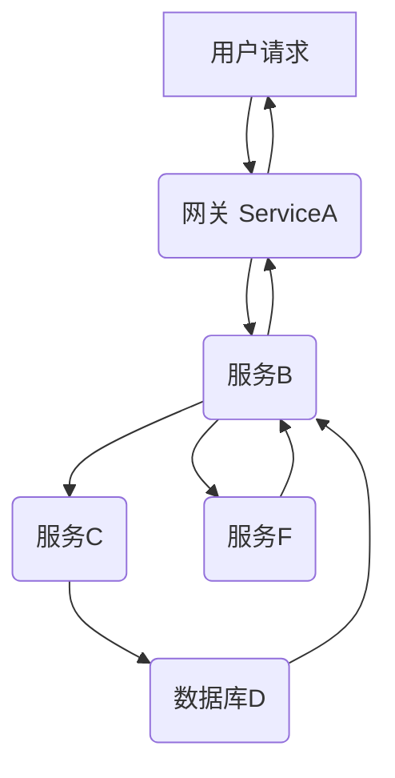

你好，技术爱好者们！我是 qmwneb946，你们的老朋友。今天，我们要深入探讨一个对于现代软件系统至关重要的主题——“云原生应用的性能监控”。在微服务、容器化、服务网格和无服务器架构日益普及的今天，传统的监控方法已经显得力不从心。云原生应用以其弹性、韧性和可扩展性重塑了软件开发与部署范式，但同时也带来了前所未有的复杂性。理解并有效监控这些应用的性能，不仅是保障服务稳定运行的基石，更是优化用户体验、驱动业务增长的关键。

### 引言：从单体巨石到云原生星辰大海的挑战

在单体应用时代，性能监控相对简单。一个应用运行在一台服务器上，我们关注 CPU、内存、磁盘 I/O 和网络等指标，配合应用的日志就能大致掌握其健康状况。然而，随着云计算的兴起和DevOps理念的深入，我们正迈入一个由分布式系统主导的云原生时代。

云原生应用通常具备以下核心特征：
*   **微服务架构：** 将大型应用拆解为多个独立、松耦合的服务，每个服务可独立开发、部署和扩展。
*   **容器化：** 使用Docker等技术将应用及其所有依赖打包成可移植的容器，确保环境一致性。
*   **容器编排：** 借助Kubernetes等工具自动化容器的部署、扩缩容和管理。
*   **弹性伸缩：** 根据负载变化自动调整资源，实现按需付费和高可用。
*   **不可变基础设施：** 基础设施组件在部署后不再修改，通过替换而不是更新来管理。
*   **服务网格：** 为服务间的通信提供流量管理、可观测性和安全性等功能。

这些特性带来了巨大的敏捷性和可扩展性优势，但也对性能监控提出了严峻挑战：
*   **分布式复杂性：** 一个用户请求可能跨越数十个甚至上百个微服务，任何一个环节的延迟或错误都可能影响整体性能。
*   **动态性：** Pods频繁地创建、销毁和迁移，IP地址不断变化，使得基于固定IP的监控难以实现。
*   **资源共享与隔离：** 容器共享宿主机资源，性能瓶颈可能出现在任何层次（应用、容器、节点、网络）。
*   **数据量爆炸：** 大量微服务、容器和短暂的实例产生了海量的指标、日志和追踪数据。
*   **根因分析困难：** 当性能问题出现时，定位具体是哪个服务、哪个组件、哪个代码行导致的，变得异常复杂。

因此，我们不再仅仅是“监控”，而是要实现更深层次的“可观测性”（Observability）。可观测性不仅仅是知道系统出了什么问题，更是要理解为什么会出问题，以及未来可能在哪里出问题。它依赖于从系统中获取的丰富数据，包括但不限于我们接下来要详细探讨的三大支柱：指标（Metrics）、日志（Logs）和分布式追踪（Distributed Tracing）。

### 可观测性的三大支柱：照亮云原生应用的黑箱

可观测性不仅仅是工具的堆砌，更是一种理念和实践，它要求我们在系统设计之初就考虑如何获取和利用系统内部状态信息。这三大支柱如同三条光线，从不同维度共同勾勒出云原生应用的运行全貌。

#### 指标 (Metrics)

指标是系统在某个时间点的特定属性的度量，通常是数值型数据，按照时间序列进行存储。它们是理解系统宏观健康状况和趋势最有效的手段。

##### 指标的类型与应用
常见的指标类型（以Prometheus为例）包括：
*   **计数器 (Counter):** 只增不减的累计值，如请求总数、错误总数。常用于计算速率，例如每秒请求数 (RPS)。
    *   $RPS = \frac{\Delta\text{请求总数}}{\Delta\text{时间}}$
*   **计量器 (Gauge):** 可以任意增减的瞬时值，如CPU使用率、内存使用量、当前并发连接数。
*   **直方图 (Histogram):** 对观测值进行采样并分组，提供分位数信息（如p99延迟）、总和及观测次数。非常适合度量请求延迟、响应大小等。
*   **摘要 (Summary):** 类似于直方图，但在客户端计算分位数，适用于需要精确分位数的场景，但聚合时不如直方图灵活。

##### 指标的采集与存储
在云原生环境中，指标的采集通常采用拉取（Pull）模型或推送（Push）模型：
*   **拉取模型 (Pull Model):** 以Prometheus为代表，监控系统主动从被监控目标暴露的HTTP接口拉取指标数据。这种模型天然支持服务发现，无需手动配置每个目标的地址。
    *   优势：易于管理动态实例，监控系统掌握主动权。
    *   劣势：对于短暂任务或防火墙后面的目标可能不适用。
*   **推送模型 (Push Model):** 被监控目标将指标主动推送到一个网关或收集器，如StatsD、Pushgateway。
    *   优势：适用于批处理作业、函数计算等生命周期短的场景。
    *   劣势：目标需要知道收集器的地址，可能造成单点故障。

常见的指标采集工具包括：
*   **Prometheus:** 开源的监控和告警工具包，广泛用于Kubernetes环境，其强大的PromQL查询语言和时间序列数据库（TSDB）是其核心优势。
*   **StatsD:** 轻量级的UDP协议，用于聚合应用内部产生的瞬时指标，然后批量发送到后端存储。
*   **OpenTelemetry Metrics:** 作为OpenTelemetry项目的一部分，旨在提供一套标准化的API、SDK和代理，用于生成和导出遥测数据。

指标数据通常存储在专门的时间序列数据库（TSDB）中，例如Prometheus自带的TSDB、InfluxDB、VictoriaMetrics、M3DB等，它们针对时间序列数据的高写入吞吐量和查询效率进行了优化。

##### 指标的可视化与告警
*   **Grafana:** 作为指标数据的可视化事实标准，Grafana支持连接多种数据源（Prometheus、Loki、Elasticsearch等），通过灵活的仪表盘构建，帮助我们直观地理解系统性能。
*   **Prometheus Alertmanager:** 负责处理Prometheus服务器发送的告警，进行分组、路由、抑制和发送到不同的通知渠道（邮件、PagerDuty、Webhook等）。

##### 实践：RED/USE 方法论
在设计指标监控体系时，可以参考以下方法论：
*   **RED 方法论 (Rate, Errors, Duration):** 针对服务级别。
    *   **Rate (速率):** 每秒请求数 (RPS) 或事务数。
    *   **Errors (错误):** 每秒失败请求数或错误率。
    *   **Duration (耗时):** 请求的延迟或响应时间（通常关注p99或p95分位数）。
*   **USE 方法论 (Utilization, Saturation, Errors):** 针对资源级别。
    *   **Utilization (利用率):** 资源被占用的百分比（如CPU利用率、内存使用率）。
    *   **Saturation (饱和度):** 资源已经过载的程度，或表明其接近极限（如CPU负载队列长度、磁盘I/O等待）。
    *   **Errors (错误):** 资源层面发生的错误（如网络丢包率、磁盘坏道）。

这两个方法论可以帮助我们系统性地定义需要监控的核心指标，覆盖服务性能和基础设施健康。

#### 日志 (Logs)

日志是应用程序和系统事件的文本记录，它们详细描述了特定时间点发生的离散事件。日志是进行故障排查、审计和行为分析不可或缺的数据源。

##### 结构化日志的重要性
在分布式系统中，传统的非结构化文本日志难以分析。结构化日志（如JSON格式）通过键值对的方式，使得日志内容更易于被机器解析、查询和聚合。
```json
{
  "timestamp": "2023-10-27T10:30:00.123Z",
  "level": "INFO",
  "service": "order-service",
  "trace_id": "ab12c34d5e6f",
  "span_id": "g7h8i9j0k1l2",
  "event": "Order created",
  "user_id": "user123",
  "order_id": "order456",
  "amount": 100.50,
  "status": "pending"
}
```
通过包含 `trace_id` 和 `span_id`，日志可以与分布式追踪数据关联起来，极大地简化故障定位。

##### 日志的采集、传输与存储
日志数据的生命周期通常包括：
1.  **采集 (Collection):** 从各种来源（应用、容器、宿主机、网络设备）收集日志。
    *   **Fluentd/Fluent Bit:** 轻量级的日志收集器，支持多种输入源和输出目标，尤其适用于Kubernetes环境。
    *   **Logstash:** 功能更丰富的日志处理管道，支持强大的数据过滤、转换和路由。
2.  **传输 (Transportation):** 将收集到的日志安全、高效地传输到中央存储。
    *   消息队列 (Kafka, RabbitMQ) 常用作日志传输的缓冲区，提高韧性。
3.  **存储与分析 (Storage & Analysis):** 将日志存储在集中式系统中，并提供强大的查询、过滤和可视化能力。
    *   **ELK Stack (Elasticsearch, Logstash, Kibana):** 事实上的日志管理标准。Elasticsearch提供全文搜索和分析能力，Kibana提供交互式可视化。
    *   **Loki:** Grafana Labs推出的、受Prometheus启发的日志聚合系统，它只索引日志的元数据（标签），日志本身存储在对象存储中，从而降低了存储成本和索引的复杂性。
    *   **Splunk:** 商业日志管理和分析平台，功能强大但成本较高。

##### 日志聚合与关联
在微服务环境中，将分散在不同服务和节点上的日志聚合到一个中心化平台至关重要。日志中包含的关联ID（如请求ID、用户ID、会话ID）是串联不同日志的关键。如果日志能与分布式追踪数据关联（通过共享 `trace_id`），就能在特定请求的上下文中查看所有相关的日志，大大加速问题诊断。

#### 分布式追踪 (Distributed Tracing)

分布式追踪是可观测性三大支柱中，专门用于理解请求在分布式系统中完整路径和耗时的工具。它将单个请求在不同服务中的执行路径和时间消耗可视化，帮助我们识别延迟瓶颈和错误来源。

##### 基本概念
*   **Trace (追踪):** 表示一个完整的请求或事务在分布式系统中的端到端执行过程。
*   **Span (跨度):** Trace中的一个独立操作单元，代表了请求在某个服务或组件中的一次执行。一个Span通常包含操作名称、开始时间、结束时间、服务名称、操作结果（成功/失败）以及相关的标签/注解。
*   **Parent-Child Relationship:** Span之间存在父子关系，形成一个树状结构，反映了请求的调用链。
*   **Context Propagation (上下文传播):** 将Trace ID和Span ID等追踪上下文信息从一个服务传递到下一个服务，是构建完整Trace的关键。这通常通过HTTP Header（如W3C Trace Context, Baggage）或消息队列元数据实现。

##### 分布式追踪的标准与实现
*   **OpenTracing/OpenCensus -> OpenTelemetry Tracing:**
    *   OpenTracing和OpenCensus是早期独立的开源项目，旨在标准化分布式追踪API。
    *   它们已合并成为 **OpenTelemetry** 项目，旨在提供一套统一的API、SDK和Exporter，用于生成和收集Metrics、Logs和Traces。OpenTelemetry正迅速成为云原生可观测性的事实标准。
*   **常见的追踪系统：**
    *   **Jaeger:** 由Uber开源，与OpenTracing兼容，支持多种存储后端（Cassandra, Elasticsearch），提供Web UI进行追踪分析。
    *   **Zipkin:** 由Twitter开源，是分布式追踪领域的先驱之一，同样支持多种存储和Web UI。
    *   **SkyWalking:** 专为微服务、云原生和容器（Kubernetes）架构设计，支持多种语言探针和强大的可视化功能，可与服务网格集成。

##### 采样的重要性
由于分布式追踪会产生大量数据，为了节省存储和降低性能开销，通常需要对追踪数据进行采样。
*   **头部采样 (Head-based Sampling):** 在请求入口处决定是否采样整个追踪。
    *   优点：整个追踪是完整的。
    *   缺点：无法根据后续的错误或重要性动态调整采样率。
*   **尾部采样 (Tail-based Sampling):** 在追踪完成后（所有Span都已收集）再决定是否采样。
    *   优点：可以根据追踪的完整性、是否包含错误、是否是慢请求等条件进行智能采样。
    *   缺点：需要先收集所有Span，对追踪系统有更高的内存和处理负载。

##### 数学公式与分析
分布式追踪本身并不直接使用复杂的数学公式，但其数据可以用来计算关键性能指标：
*   **请求延迟:** 每个Span的持续时间，以及整个Trace的持续时间。通过聚合Trace数据，可以计算出不同服务或接口的平均延迟、P99延迟等。
*   **瓶颈识别:** 通过可视化Trace瀑布图，可以直观地看到哪个Span耗时最长，从而定位性能瓶颈。


上述图示代表了一个请求的调用链。在分布式追踪中，每个框对应一个Span，箭头的长度可以可视化地表示Span的耗时，通过分析这些耗时，我们可以发现哪个服务或操作是整个请求的“长尾”瓶颈。

### 云原生监控工具与生态系统：构建强大的可观测性平台

理解了可观测性的三大支柱后，下一步就是选择合适的工具来构建和实现它。云原生生态系统提供了丰富而强大的开源和商业工具，共同构筑了现代监控平台。

#### Prometheus：云原生指标监控的基石

Prometheus是CNCF（云原生计算基金会）的第二个毕业项目，已成为Kubernetes环境下指标监控的事实标准。

##### 核心特性
*   **多维数据模型：** 所有指标都以时间序列存储，并由一个指标名称和一组键值对（标签）唯一标识。这使得数据查询和聚合非常灵活。
*   **灵活的查询语言 (PromQL):** 强大的查询语言，支持聚合、过滤、算术运算等，可以从大量指标中提取有意义的信息。
*   **拉取模型：** 主动从目标端点拉取指标，结合Kubernetes的服务发现，能够自动发现并监控新的Pod、Service等。
*   **高效存储：** 内置时间序列数据库，针对指标数据的高吞吐量写入和查询进行了优化。
*   **与Grafana/Alertmanager集成：** Prometheus负责数据采集和存储，Grafana负责可视化，Alertmanager负责告警通知。
*   **服务发现：** 支持Kubernetes、Consul、DNS等多种服务发现机制，适应云原生环境的动态变化。

##### PromQL 示例
查询所有HTTP请求的速率，按服务名称和HTTP状态码聚合：
```promql
sum(rate(http_requests_total{job="my-service"}[5m])) by (service_name, http_status)
```
查询某个服务99分位的请求延迟：
```promql
histogram_quantile(0.99, sum(rate(http_request_duration_seconds_bucket[5m])) by (le, service_name))
```

##### Kubernetes中的Prometheus部署
在Kubernetes中部署Prometheus通常使用 `kube-prometheus-stack` Helm Chart，它包含了Prometheus Operator、Grafana、Alertmanager等组件，以及用于监控Kubernetes集群自身的重要指标 exporters（如kube-state-metrics, node-exporter, cAdvisor）。Prometheus Operator通过自定义资源（Custom Resources）如 `ServiceMonitor` 和 `PodMonitor`，简化了Prometheus的配置和管理，实现了更强的自动化能力。

#### Grafana：数据可视化与仪表盘构建

Grafana是开源的数据可视化和仪表盘工具，它能够连接各种数据源（Prometheus、Loki、Elasticsearch、InfluxDB、SQL数据库等），将复杂的数据转化为直观的图表和仪表盘。

##### 核心功能
*   **多数据源支持：** 能够从多种后端存储中查询数据，并在同一个仪表盘上展示。
*   **丰富的图表类型：** 支持折线图、柱状图、热力图、表格等多种可视化组件。
*   **模板变量：** 允许用户通过下拉菜单动态切换数据，实现灵活的探索性分析。
*   **告警集成：** 可以基于Grafana中的面板数据设置告警规则，并与Alertmanager等告警系统集成。
*   **插件生态：** 拥有庞大的社区插件，可以扩展功能或支持更多数据源。

在云原生环境中，Grafana通常与Prometheus配合使用，通过构建针对微服务、Kubernetes集群、基础设施等不同层级的仪表盘，提供全面的性能概览。

#### Kubernetes 原生监控组件

Kubernetes自身也提供了一些内置的监控能力，是构建更高级监控系统的基础：
*   **cAdvisor:** 内置于Kubelet中，提供容器的资源使用情况（CPU、内存、网络、文件系统）指标。
*   **Kubelet:** 暴露了关于节点和Pod的健康、资源使用情况的指标。
*   **Kube-state-metrics:** 监听Kubernetes API服务器，生成关于集群中各种对象（Pod、Deployment、Node、Service等）状态的指标，例如Pod的状态、Deployment的副本数等。
*   **Node Exporter:** 运行在每个节点上的Prometheus Exporter，用于暴露操作系统的硬件和OS指标（CPU、内存、磁盘I/O、网络等）。
*   **Horizontal Pod Autoscaler (HPA):** 基于CPU利用率或自定义指标自动扩展Pod的数量。
*   **Vertical Pod Autoscaler (VPA):** 自动调整容器的CPU和内存请求与限制，优化资源分配。
这些组件共同为我们提供了Kubernetes集群内部的丰富数据，是实现弹性伸缩和资源优化的关键。

#### 服务网格中的可观测性

服务网格（如Istio, Linkerd）通过在应用程序旁注入一个代理（Sidecar Proxy，如Envoy），拦截和管理服务间的流量。这不仅带来了流量管理、安全等功能，也极大地增强了可观测性。

##### Envoy Proxy 的作用
Envoy作为Sidecar代理，可以透明地收集以下遥测数据：
*   **指标：** 自动采集L7级别的流量指标，如请求量、成功率、延迟、错误码等，无需修改应用代码。
*   **分布式追踪：** Envoy可以自动生成和传播Trace ID，并向追踪后端（如Jaeger）发送Span数据，实现服务间调用的端到端追踪。
*   **访问日志：** 记录所有进出服务的请求日志，包括请求/响应头、请求体等，提供细粒度的流量信息。

服务网格极大地降低了应用对可观测性集成的侵入性，使得开发者可以专注于业务逻辑，而将可观测性关注点下沉到基础设施层。

#### OpenTelemetry：统一可观测性的未来

OpenTelemetry是CNCF的孵化项目，旨在解决可观测性工具碎片化的问题，提供一个通用的框架来生成、收集和导出Metrics、Logs和Traces。

##### 目标与组件
*   **统一标准：** 旨在成为可观测性数据的单一标准，避免供应商锁定，提高互操作性。
*   **API/SDKs：** 提供各种编程语言的API和SDK，开发者只需使用一套API就能生成所有三种类型的遥测数据。
*   **Collector：** 一个代理服务，可以接收、处理和导出遥测数据到各种后端存储。它支持多种协议，可以作为数据管道的中间层。

通过OpenTelemetry，我们可以实现“一次插桩，到处使用”（instrument once, export anywhere），极大地简化了应用程序的可观测性集成。

#### 云服务提供商 (CSP) 的监控服务

主流的云服务提供商（AWS、Azure、GCP）都提供了自己的监控服务，例如AWS CloudWatch、Azure Monitor、GCP Cloud Monitoring。

##### 特点与权衡
*   **集成度高：** 与云平台的其他服务无缝集成，开箱即用，无需额外配置。
*   **托管服务：** 无需管理底层基础设施，由云厂商负责可扩展性和可靠性。
*   **成本：** 通常按数据量、API调用或使用时长计费，大规模使用可能成本较高。
*   **供应商锁定：** 数据和工具可能与特定云厂商绑定，迁移到其他云平台可能面临挑战。

在实际生产中，许多企业会采用混合策略：对于云平台原生资源使用CSP的监控服务，对于自定义应用和Kubernetes集群则采用Prometheus、Grafana、Jaeger等开源方案，并通过OpenTelemetry或自定义适配器将数据汇聚。

### 性能分析与优化实践：从数据到洞察

有了强大的可观测性工具和丰富的数据，下一步就是如何利用这些数据进行性能分析、故障排查和系统优化。

#### 黄金信号与USE/RED 方法的实战应用

前文提到的黄金信号（Golden Signals）和USE/RED方法论是指导我们进行性能分析的灯塔。
*   **Latency (延迟):** 服务响应时间。关注P99、P95等分位数，而不是平均值，因为平均值会掩盖长尾问题。
    *   **监控：** `http_request_duration_seconds_bucket` (Prometheus Histogram)
    *   **PromQL 示例：** `histogram_quantile(0.99, sum(rate(http_request_duration_seconds_bucket[5m])) by (le))`
*   **Traffic (流量):** 请求吞吐量，衡量系统负载。
    *   **监控：** `http_requests_total` (Prometheus Counter)
    *   **PromQL 示例：** `sum(rate(http_requests_total[5m]))`
*   **Errors (错误):** 错误请求的数量或比率。包括HTTP 5xx错误、内部逻辑错误等。
    *   **监控：** `http_requests_total{status_code=~"5..|4xx"}`
    *   **PromQL 示例：** `sum(rate(http_requests_total{status_code=~"5..|4xx"}[5m])) / sum(rate(http_requests_total[5m])) * 100` （错误率）
*   **Saturation (饱和度):** 系统资源的饱和程度，是否接近或达到极限。
    *   **监控：** CPU使用率、内存使用率、磁盘I/O等待、网络带宽利用率、线程池/连接池饱和度。
    *   **PromQL 示例：** `(node_cpu_seconds_total{mode="idle"}[5m]) / sum(rate(node_cpu_seconds_total[5m]))` （CPU空闲率，反向表示利用率）

当告警触发时，从这些核心指标入手，能够快速判断问题的性质和影响范围。

#### 根因分析 (Root Cause Analysis)

根因分析是性能监控的终极目标之一。当系统出现性能下降或故障时，需要系统性地排查。
1.  **从告警开始：** 告警通常指向了某个指标或日志模式的异常。
2.  **查看仪表盘：** 切换到相关的Grafana仪表盘，观察黄金信号和USE/RED指标的趋势，确定问题发生的时间点和受影响的服务范围。
3.  **结合日志：**
    *   在问题时间段内，过滤相关服务的日志，查找 `ERROR`、`WARN` 级别的日志，特别是异常堆栈信息。
    *   关注日志中的业务错误码、数据库错误、外部服务调用失败等。
    *   利用日志聚合工具的搜索和过滤功能，结合 `trace_id` 或其他关联ID进行上下文分析。
4.  **利用分布式追踪：**
    *   找到一个在问题时间段内失败或慢的请求的Trace。
    *   分析Trace瀑布图，定位哪些Span耗时异常，或哪些服务返回了错误。
    *   深入查看特定Span的详细信息，包括其关联的日志和标签，进一步缩小问题范围。
5.  **资源检查：** 检查Kubernetes Pods、Nodes的CPU、内存、网络、磁盘I/O等资源利用率，看是否有资源瓶颈。
6.  **代码层面：** 如果问题定位到特定服务或代码路径，结合代码审查和性能分析工具（如JVM的JMX、Go的pprof）进行更深层次的分析。

**案例：一个慢请求的排查流程**
假设我们收到一个告警：某个API的P99延迟急剧升高。
1.  **查看 Grafana Dashboard:** 确认P99延迟指标确实异常，并查看相关服务的QPS、错误率等是否正常。发现QPS正常，但错误率略有上升。
2.  **利用 Tracing System (e.g., Jaeger):** 筛选出在异常时间段内，超过某个阈值的慢请求Trace。
    *   发现大部分慢请求都集中在 `order-service` 对 `payment-service` 的调用上。
    *   进一步下钻 `payment-service` 的Span，发现其内部对数据库的查询 Span 耗时异常长。
3.  **结合 Logs (e.g., ELK/Loki):**
    *   在 `payment-service` 的日志中，使用 Trace ID 过滤，查找与该慢请求相关的日志。
    *   发现数据库查询慢的警告日志，或者SQL执行超时的日志。
4.  **分析数据库 Metrics:** 检查数据库的连接池、慢查询日志、CPU/内存利用率、锁等待等指标。
5.  **定位根因:** 可能是某个SQL查询没有加索引，或者数据库连接池耗尽，或者数据库服务器资源不足。

通过指标的宏观发现、追踪的路径定位、日志的细节补充以及资源的最终确认，形成了一个完整的故障排查闭环。

#### 容量规划 (Capacity Planning)

性能监控数据不仅用于故障排查，也是容量规划的基础。通过历史性能数据，我们可以预测未来的资源需求，确保系统在高负载下依然能够稳定运行。
*   **趋势分析：** 利用Prometheus等工具的历史数据，分析CPU、内存、网络IO、请求量等关键指标的增长趋势。
*   **峰值预测：** 结合业务季节性、营销活动等因素，预测未来的流量峰值。
*   **压力测试与负载测试：** 在受控环境中模拟高并发负载，验证系统的极限性能，识别瓶颈。
*   **HPA/VPA 配置优化：** 根据实际负载模式，调整Kubernetes HPA的阈值和VPA的推荐值，实现更有效的弹性伸缩。

#### AIOps 的初步探索

随着数据量的爆炸式增长和系统复杂性的提高，人工分析和告警响应变得越来越困难。AIOps（Artificial Intelligence for IT Operations）旨在通过机器学习和人工智能技术，自动化运维操作。
*   **异常检测：** 机器学习算法可以学习指标和日志的正常模式，自动识别异常波动，减少误报和漏报。例如，基于时间序列的异常检测算法（如Isolation Forest, Prophet）。
*   **智能告警：** 对大量告警进行聚类和降噪，只发出真正需要关注的告警，并提供更丰富的上下文信息。
*   **故障预测：** 基于历史数据和模式，预测未来可能发生的性能问题或故障。
*   **根因推荐：** 结合多种遥测数据，自动推荐可能的根因。

虽然AIOps目前还在发展初期，但其潜力巨大，是未来云原生监控的重要发展方向。

### 面向未来的挑战与趋势

云原生技术仍在高速演进，性能监控也面临新的挑战并呈现出新的趋势。

#### 无服务器 (Serverless) 和边缘计算的监控复杂性

*   **无服务器：** 函数生命周期短暂、事件驱动、冷启动问题、细粒度计费，使得传统监控难以捕捉其全貌。需要更细粒度的追踪和专门的无服务器监控解决方案。
*   **边缘计算：** 设备分布广、网络条件复杂、资源受限，对数据收集、传输和存储提出严峻挑战。

#### eBPF 在可观测性中的应用

eBPF（extended Berkeley Packet Filter）允许在Linux内核中运行沙箱程序，无需修改内核代码或应用程序。它为可观测性带来了革命性的改变：
*   **零侵入性：** 可以在不修改应用程序代码的情况下，深入收集进程、网络、系统调用等底层数据。
*   **细粒度洞察：** 提供传统工具难以企及的详细上下文信息，例如函数调用栈、网络事件、文件系统操作等。
*   **低开销：** eBPF程序运行在内核空间，性能开销非常低。

eBPF正被广泛应用于服务网格的性能分析（如Cilium）、系统级故障排查、运行时安全等方面，是未来可观测性领域的重要发展方向。

#### AIOps 的深入发展与机器学习的应用

AIOps将不再局限于异常检测和告警降噪，而会向更高级的故障预测、自动根因分析、甚至自动修复发展。这需要更强大的机器学习模型、更丰富的数据源融合以及更智能的决策系统。

#### 安全性与合规性在监控中的考量

随着数据隐私和安全合规（如GDPR、CCPA）要求的提高，监控数据中可能包含的敏感信息（如用户ID、IP地址）的处理变得尤为重要。
*   **数据脱敏/加密：** 对敏感数据进行脱敏或加密处理。
*   **访问控制：** 严格控制对监控数据的访问权限。
*   **数据保留策略：** 定义合理的数据保留周期。

#### 成本效益与数据量爆炸

海量的遥测数据带来了巨大的存储和传输成本。如何有效地管理数据量、优化存储策略、利用智能采样等技术，在保证可观测性的同时控制成本，是企业面临的长期挑战。

### 结论：可观测性是云原生时代的核心竞争力

回顾我们今天的探讨，云原生应用的性能监控已经远超传统的资源监控范畴。它是一个系统性的工程，涵盖了架构设计、工具选型、数据分析和持续优化。可观测性的三大支柱——指标、日志和分布式追踪，构成了理解分布式系统行为的基石。而Prometheus、Grafana、Jaeger以及新兴的OpenTelemetry和eBPF等工具，则为我们提供了实现这一目标的强大武器。

在云原生星辰大海中航行，没有可观测性，就如同在暴风雨中盲目航行。只有建立起健全、高效、智能的性能监控体系，我们才能：
*   **快速发现并解决问题：** 将故障停机时间降至最低。
*   **优化资源利用率：** 降低运营成本，提高效率。
*   **提升用户体验：** 确保服务响应迅速、稳定可靠。
*   **指导系统演进：** 基于真实数据做出明智的架构和容量决策。

未来，随着无服务器、边缘计算、AIOps和eBPF等技术的不断成熟，云原生应用的性能监控将变得更加智能、自动化和无侵入。作为技术爱好者，我们需要持续学习，拥抱这些新趋势，构建更具韧性、更可观测的下一代系统。

感谢大家的阅读，希望这篇文章能为你探索云原生应用性能监控的世界提供有益的视角和实践指导。如果你有任何问题或想法，欢迎在评论区与我交流！

---
**博主：qmwneb946**
**日期：2023年10月27日**