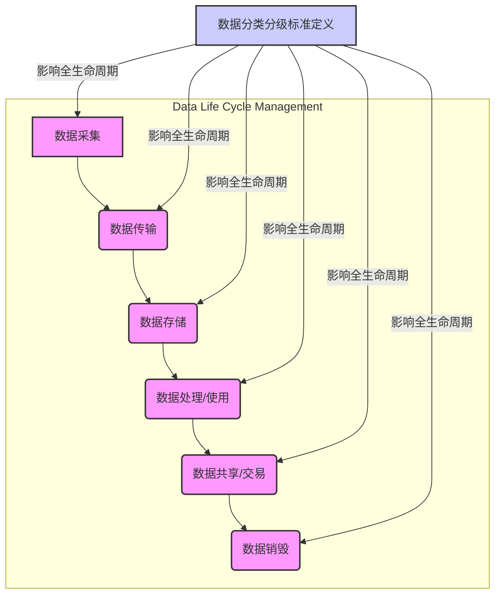

## 引言：数据洪流中的罗盘与盾牌

在这个信息爆炸的时代，数据已不仅仅是企业运营的基石，更是国家战略资产和个人隐私的载体。从日常的社交互动到尖端的科研突破，从金融交易的毫厘不差到医疗诊断的生命攸关，数据无处不在，其价值与日俱增。然而，伴随数据价值的飙升，数据泄露、滥用、篡改等安全风险也如影随形，其潜在的经济损失、声誉损害乃至法律责任，都足以让任何组织和个人如坐针毡。

面对浩如烟海的数据以及层出不穷的安全威胁，我们不可能对所有数据一视同仁地投入无限的保护资源。这就好比建造一座堡垒，你不会用同样厚度的装甲去保护城墙和储藏黄金的密室。数据安全分类分级，正是为我们提供了这样一套系统性的、智慧化的方法论：它如同一个罗盘，指引我们识别数据的真正价值和风险；又如同一个盾牌，帮助我们针对性地部署最有效的防御措施。

它不是一蹴而就的工程，而是一项持续演进的战略性工作。本篇博客文章，博主qmwneb946将带您深入探讨数据安全分类分级的核心理念、方法论、实践路径、面临的挑战以及未来的发展趋势。无论您是技术爱好者、安全从业者，还是正在为企业数据安全发愁的管理者，相信本文都能为您提供一份有价值的指南，助您在数据洪流中，构建起坚不可摧的数字防线。

## 第一部分：数据安全分类分级的基石

在深入探讨具体方法之前，我们首先需要理解数据安全分类分级为何如此重要，并对其中最基本的概念进行辨析。

### 为什么需要数据安全分类分级？

数据安全分类分级并非是为了增加工作量而设计，它是数据安全治理中最基础、最核心的环节之一，其必要性体现在以下几个方面：

1.  **资源优化与精准施策：** 组织的数据资产规模庞大且异构，包含业务数据、系统数据、日志数据、研发数据等。若不对数据进行区分，一味地采取“一刀切”的保护策略，不仅成本高昂，效率低下，而且可能导致关键敏感数据保护不足，而无关紧要的数据却过度保护，造成资源浪费。分类分级能够帮助组织识别“高价值、高风险”数据，从而将有限的安全资源投入到最需要保护的数据上。

2.  **风险差异化管理：** 并非所有数据的泄露都会造成同等程度的损害。例如，泄露用户身份证号和银行卡号可能导致严重的财产损失和法律纠纷，而泄露一篇公开的产品宣传文案则可能影响微乎其微。通过分类分级，我们可以清晰地识别不同数据的敏感程度和泄露风险，从而对症下药，制定差异化的安全控制措施，如更严格的访问权限、更强的加密算法、更频繁的审计等。

3.  **满足合规性要求：** 随着全球范围内数据隐私和安全法规的日益严格（如欧盟的GDPR、中国的《网络安全法》、《数据安全法》、《个人信息保护法》、美国的CCPA等），企业必须证明其已采取适当措施保护数据。这些法规通常要求企业明确数据类型、处理目的、存储方式以及安全保护级别。数据分类分级是满足这些合规性要求的第一步，也是最重要的一步，它为企业提供了合规性审计的基础。

4.  **提升安全治理效率：** 清晰的数据分类分级体系，有助于企业内部各部门（业务、IT、法务、安全）对数据资产形成统一的认知，促进沟通协作。它为安全策略的制定、安全工具的选型、安全事件的响应提供了明确的指导原则，从而提升整体安全治理的效率和效果。

### 核心概念辨析：分类与分级

“分类”和“分级”这两个词在日常交流中常被混用，但在数据安全领域，它们有着明确的区分和紧密的联系。

*   **数据分类 (Data Classification):**
    数据分类是根据数据的**性质、用途、价值、来源、数据主体的类型**等特征，将数据划分到不同的类别中。它关注的是“是什么样的数据”，是一种横向的划分。
    例如：
    *   **按业务域：** 财务数据、人力资源数据、研发数据、销售数据、客户服务数据。
    *   **按数据类型：** 结构化数据（如数据库表）、非结构化数据（如文档、图片、音视频）、半结构化数据（如XML、JSON）。
    *   **按数据主体：** 个人数据、企业数据、政府数据。
    *   **按内容敏感性：** 个人身份信息（PII）、个人健康信息（PHI）、支付卡信息（PCI）、商业秘密、专利信息、公开信息等。

    数据分类是**静态的、基于属性**的划分，它帮助我们理清数据资产的“家谱”和“户口”。

*   **数据分级 (Data Grading/Leveling):**
    数据分级是根据数据一旦被泄露、篡改或丢失后可能造成的**危害程度或影响范围**，对数据赋予不同的安全等级。它关注的是“如果出问题，后果有多严重”，是一种纵向的评估。
    例如，常见的安全等级体系可能包括：
    *   **绝密 (Top Secret):** 泄露将对国家安全、核心竞争力造成灾难性影响，或导致巨额经济损失和声誉毁灭。
    *   **机密 (Secret):** 泄露将对企业运营、个人权益造成严重损害，或导致重大经济损失和法律责任。
    *   **秘密 (Confidential):** 泄露将对企业声誉、个人隐私造成一般损害，或导致可接受范围内的经济损失。
    *   **内部 (Internal Use):** 泄露影响有限，但仍不应公开，可能影响内部流程或造成轻微信息优势损失。
    *   **公开 (Public):** 泄露不会造成任何负面影响，信息本身就是为了公开分享。

    数据分级是**动态的、基于风险评估**的划分，它帮助我们量化不同数据的保护优先级。

*   **两者关系：**
    分类是分级的基础，分级是分类的深化。分类为数据打上了“标签”，让我们知道它是什么；分级则为这些“标签”赋予了“权重”，告诉我们它有多重要。通常，我们会先进行数据分类，然后基于分类的结果，结合风险评估，对不同类别的数据进行安全分级。一个类别的数据可能对应一个或多个安全等级，而同一安全等级的数据可能包含不同类别的信息。例如，“个人身份信息”可能是一个数据类别，但其中“公民身份号码”可能是“绝密”级，而“常用联系方式”可能是“秘密”级。

理解了这两者的区别与联系，我们就能更好地设计和实施一个高效的数据安全分类分级体系。

## 第二部分：数据分类的方法论与实践

数据分类是数据安全之旅的第一步，它要求我们对组织内的数据资产进行细致的梳理和定义。

### 数据分类的维度与原则

进行数据分类时，我们需要从多个维度进行考量，并遵循一系列基本原则。

*   **数据分类的维度：**
    *   **业务敏感性：** 数据对业务运营的关键程度，如核心业务流程数据、辅助业务数据。
    *   **法律合规性：** 数据是否受到特定法律法规（如GDPR、PIPL、HIPAA、PCI DSS）的保护或约束。
    *   **数据价值：** 数据所蕴含的商业价值、知识产权价值或对决策的影响力。
    *   **数据量级：** 虽然不是直接的分类维度，但数据量级大的数据集往往更难以管理和保护，需要更细致的分类。
    *   **数据生命周期：** 数据所处的阶段（采集、传输、存储、处理、共享、销毁），在不同阶段其敏感性和风险可能发生变化。
    *   **数据来源：** 数据是内部生成、外部获取，还是由用户上传。
    *   **数据格式：** 结构化、半结构化、非结构化数据，不同格式的数据需要不同的分类和处理方法。
    *   **数据开放性：** 数据是否可以公开访问或共享。

*   **数据分类的原则：**
    *   **最小特权原则：** 确保数据的访问权限仅限于完成其任务所必需的最小集合。分类是实现这一原则的基础。
    *   **合规优先原则：** 优先考虑满足法律法规和行业标准的强制性要求。
    *   **易于操作原则：** 分类体系不应过于复杂，应易于理解和实施，方便员工在日常工作中识别和标记数据。
    *   **动态调整原则：** 随着业务发展、法律法规更新和技术进步，数据分类体系应具备灵活性，能够进行持续的评审和调整。
    *   **全员参与原则：** 数据分类不仅是技术部门的任务，业务部门、法务部门、管理层都需要深度参与。

### 常见的数据分类方法

根据上述维度和原则，组织可以采用多种方法进行数据分类：

1.  **基于业务域分类：** 这是最常见且直观的方法。将数据根据其所支持的业务功能进行划分。
    *   **财务数据：** 账务报表、交易记录、预算信息、员工薪酬。
    *   **人力资源数据：** 员工档案、招聘信息、绩效评估。
    *   **研发数据：** 源代码、设计文档、实验数据、专利技术。
    *   **市场营销数据：** 客户画像、营销活动数据、广告投放效果。
    *   **客户服务数据：** 客户投诉记录、服务工单、客服聊天记录。

2.  **基于数据类型/内容敏感属性分类：** 侧重于数据本身携带的信息敏感度。
    *   **个人身份信息 (Personally Identifiable Information, PII)：** 可用于唯一识别个人身份的信息，如姓名、身份证号、手机号、住址、邮箱、银行卡号等。
    *   **个人敏感信息 (Sensitive Personal Information, SPI)：** 一旦泄露或滥用可能对个人权益造成严重损害的PII，如生物识别信息、宗教信仰、基因信息、医疗健康信息、犯罪记录等。
    *   **企业商业秘密 (Trade Secrets)：** 对企业具有独立经济价值，不为公众所知，且企业已采取保密措施的技术信息、经营信息，如核心算法、客户名单、战略规划等。
    *   **知识产权信息 (Intellectual Property, IP)：** 专利、版权、商标相关的设计图、源代码、创意文案等。
    *   **公开数据 (Public Data)：** 意图对外公开，泄露不会造成负面影响的数据。

3.  **基于法律法规和合规性要求分类：** 直接依据外部强制性规定进行划分。
    *   **中国《数据安全法》下的“重要数据”和“核心数据”：** 对国家安全、经济运行、社会公共利益等产生重大影响的数据。
    *   **GDPR下的“个人数据”和“特殊类别个人数据”：** 严格定义个人身份信息和高度敏感的个人数据。
    *   **PCI DSS下的“支付卡数据”：** 包含持卡人姓名、卡号、有效期、服务码等支付敏感信息。
    *   **HIPAA下的“受保护健康信息 (PHI)”：** 个人可识别的健康信息，包含医疗记录、病史、检查结果等。

在实际操作中，通常需要结合多种分类方法，形成一个多维度的分类体系，以满足不同层面的管理和保护需求。

### 实施数据分类的步骤

数据分类并非一次性任务，而是一个持续的、迭代的流程。

1.  **识别与盘点数据资产：**
    *   **目标：** 全面摸清组织内所有数据资产的家底，包括数据存储在哪里（数据库、文件服务器、云存储、本地设备）、数据格式、数据量、谁拥有数据、谁使用数据。
    *   **方法：** 可以通过自动化工具（如数据发现工具、内容分析工具）扫描数据存储，结合人工访谈、问卷调查、业务流程梳理等方式。建立数据资产清单，包括数据名称、存储位置、负责人、涉及的业务系统等。

2.  **定义数据分类标准：**
    *   **目标：** 根据前面讨论的维度和原则，制定一套清晰、可操作的数据分类规则。这通常需要安全部门牵头，联合业务、法务、IT等部门共同完成。
    *   **产出：** 形成《数据分类规范》文档，明确各类别的定义、示例、以及如何判断数据属于哪个类别。例如，可以定义“个人身份信息”包含哪些具体字段。

3.  **数据打标 (Tagging) 与标记：**
    *   **目标：** 将定义好的分类标签实际应用到数据上。
    *   **方法：**
        *   **人工打标：** 对于少量、重要且难以自动识别的数据，由数据所有者或业务专家手动进行标记。
        *   **自动化打标：** 利用DLP (Data Loss Prevention) 系统、数据发现工具、内容识别技术（正则表达式、关键字匹配、指纹识别）、机器学习算法（文本分类、实体识别）等，对结构化和非结构化数据进行批量、自动的分类识别和打标。
        *   **元数据管理：** 将分类信息作为数据的元数据进行存储，方便后续查询、管理和策略应用。
    *   **示例：**
        ```python
        # 示例：一个简单的数据分类枚举，结合了业务和敏感度维度
        from enum import Enum

        class DataCategory(Enum):
            # 业务相关分类
            BUSINESS_FINANCIAL = "财务数据" # 如：利润表、资产负债表
            BUSINESS_HR = "人力资源数据"   # 如：员工档案、招聘简历
            BUSINESS_R_D = "研发数据"      # 如：源代码、设计图
            BUSINESS_SALES = "销售数据"    # 如：客户订单、销售合同
            BUSINESS_OPERATIONAL = "运营数据" # 如：日志、监控数据

            # 敏感度相关分类
            SENSITIVE_PII = "个人身份信息 (PII)" # 如：身份证号、手机号
            SENSITIVE_PHI = "个人健康信息 (PHI)" # 如：病历、体检报告
            SENSITIVE_PCI = "支付卡信息 (PCI)" # 如：银行卡号、CVV
            SENSITIVE_TRADE_SECRET = "商业秘密" # 如：核心算法、未公开专利

            # 公开性相关分类
            PUBLIC = "公开数据"         # 如：公司官网新闻
            INTERNAL_USE = "内部使用数据" # 如：内部会议纪要（非敏感）
            CONFIDENTIAL = "机密数据"    # 比内部使用更敏感，但未达商业秘密级别

            def __str__(self):
                return self.value

        # 示例：一个简单的自动化分类函数（基于关键字匹配）
        def classify_data_content(content: str, metadata: dict = None) -> DataCategory:
            content_lower = content.lower()
            
            # 优先匹配敏感信息
            if any(keyword in content_lower for keyword in ["身份证号", "手机号", "护照号", "社保号"]):
                return DataCategory.SENSITIVE_PII
            if any(keyword in content_lower for keyword in ["病历", "诊断", "体检报告", "医疗记录"]):
                return DataCategory.SENSITIVE_PHI
            if any(keyword in content_lower for keyword in ["银行卡号", "cvv", "信用卡"]):
                return DataCategory.SENSITIVE_PCI
            if any(keyword in content_lower for keyword in ["核心算法", "专利申请", "未公开技术", "研发代码"]):
                return DataCategory.SENSITIVE_TRADE_SECRET

            # 其次匹配业务数据
            if any(keyword in content_lower for keyword in ["利润表", "资产负债", "财务报告", "预算"]):
                return DataCategory.BUSINESS_FINANCIAL
            if any(keyword in content_lower for keyword in ["员工档案", "招聘", "绩效考评"]):
                return DataCategory.BUSINESS_HR
            if any(keyword in content_lower for keyword in ["客户订单", "销售额", "合同编号"]):
                return DataCategory.BUSINESS_SALES
            
            # 再次根据公开性判断
            if metadata and metadata.get("is_public"):
                return DataCategory.PUBLIC
            
            if "内部会议" in content_lower or "内部文件" in content_lower:
                return DataCategory.INTERNAL_USE

            return DataCategory.CONFIDENTIAL # 默认认为一些内容是机密的，需要进一步评估

        # 实际应用示例
        data_piece_1 = "这是一份包含用户身份证号和手机号的用户注册表。"
        data_piece_2 = "公司2023年第三季度财务利润表，内部使用。"
        data_piece_3 = "最新产品宣传资料，已公开发布在官网。"
        data_piece_4 = "研发部门核心算法设计文档。"

        print(f"'{data_piece_1}' 被分类为: {classify_data_content(data_piece_1)}")
        print(f"'{data_piece_2}' 被分类为: {classify_data_content(data_piece_2)}")
        print(f"'{data_piece_3}' 被分类为: {classify_data_content(data_piece_3, {'is_public': True})}")
        print(f"'{data_piece_4}' 被分类为: {classify_data_content(data_piece_4)}")
        ```
        上述代码是一个非常简化的示例，实际的自动化分类会使用更复杂的机器学习模型、自然语言处理技术、甚至深度学习模型来识别文本内容、图片内容或结构化数据中的敏感模式。

4.  **持续评审与更新：**
    *   **目标：** 确保数据分类体系的准确性和时效性。
    *   **方法：** 定期（如每年或每半年）对数据资产清单和分类结果进行复核；当有新的业务上线、新的数据产生、法律法规更新时，及时评估并调整分类规则。这需要建立明确的责任人机制和变更管理流程。

数据分类是构建数据安全策略的基石。没有准确的分类，后续的所有保护措施都将是无源之水、无本之木。

## 第三部分：数据分级的框架与量化评估

在数据分类的基础上，数据分级进一步量化了数据的重要性，为安全控制措施的强度提供了依据。

### 数据分级的核心思想

数据分级的核心思想是**风险导向**。它不单纯关注数据是什么，更关注一旦数据被非法访问、使用、泄露、修改或破坏，可能带来的负面影响和损失。这些损失可能包括：

*   **经济损失：** 直接的经济赔偿、罚款、业务中断造成的收入损失。
*   **声誉损害：** 品牌形象受损、客户信任度下降、市场竞争力削弱。
*   **法律责任：** 面临监管机构的处罚、法律诉讼、刑事指控。
*   **国家安全与公共利益损害：** 对于涉及国家重要基础设施、军事、政治等领域的数据。
*   **个人权益损害：** 个人隐私泄露、身份盗用、财产损失、人身安全威胁。

因此，数据分级的目标是建立一个明确的、可操作的等级体系，使得不同级别的数据能够匹配相应强度的安全保护措施，实现成本效益最大化。

### 常见的数据分级模型

数据分级模型多种多样，常见的包括国际标准、国家标准以及行业标准等。

1.  **国家标准 GB/T/Z 28447-2012《信息安全技术 数据分类分级指南》：**
    中国推荐性国家标准，为数据分类分级提供了指导框架。该标准通常根据数据遭到破坏后对国家安全、社会秩序、公共利益以及公民、法人和其他组织的合法权益的损害程度，将数据分为五个等级：
    *   **五级（最高）：** 泄露或破坏将对国家安全和社会秩序造成**特别严重**损害。
    *   **四级：** 泄露或破坏将对国家安全和社会秩序造成**严重**损害。
    *   **三级：** 泄露或破坏将对国家安全和社会秩序造成**损害**。
    *   **二级：** 泄露或破坏将对公共利益或者公民、法人和其他组织的合法权益造成**严重**损害。
    *   **一级（最低）：** 泄露或破坏将对公共利益或者公民、法人和其他组织的合法权益造成**损害**。

    这是一个典型的**影响驱动型**分级模型，关注的是数据被破坏后的影响程度。

2.  **ISO 27001/27002 相关实践：**
    ISO 27001 是信息安全管理体系认证标准，ISO 27002 是其实施指南。这些标准虽然没有直接定义具体的数据分级，但其核心思想是围绕信息的**机密性 (Confidentiality)、完整性 (Integrity) 和可用性 (Availability) (CIA)** 来评估信息资产的价值和风险。组织会根据数据在这三个属性上的要求来确定其保护级别。
    *   **机密性：** 防止未经授权的访问和披露。
    *   **完整性：** 确保数据准确性和完整性，防止未经授权的修改或破坏。
    *   **可用性：** 确保授权用户在需要时能够访问数据。

3.  **自定义/行业特定分级模型：**
    许多组织会根据自身业务特性、行业监管要求和风险偏好，自定义一套分级体系。例如，金融行业对客户的账户信息、交易记录会有非常高的安全等级；医疗行业对病人的健康数据（PHI）会有严格的分级和保护要求。
    一个常见的企业内部分级模型可能包括：
    *   **绝密 (Top Secret/Critical):** 最高敏感度，泄露会导致灾难性后果（如核心技术、国家机密、核心商业秘密）。
    *   **机密 (Secret/High):** 高度敏感，泄露会导致严重后果（如关键个人数据、核心财务数据、战略规划）。
    *   **秘密 (Confidential/Medium):** 中等敏感度，泄露会导致一般后果（如普通个人数据、内部运营数据）。
    *   **内部 (Internal Use/Low):** 低敏感度，仅限内部使用，泄露后果轻微（如内部流程文档）。
    *   **公开 (Public):** 无敏感度，可公开传播。

### 数据分级的量化评估

数据分级的过程，本质上是对数据泄露或破坏风险的量化评估。这通常涉及到影响评估和敏感度评估。

1.  **影响评估 (Impact Assessment)：**
    评估一旦数据发生安全事件（泄露、篡改、丢失），可能造成的具体损害和后果。这需要与业务部门紧密合作，定义不同程度的“影响”所对应的具体指标。
    例如：
    *   **经济影响：** 罚款金额、赔偿金额、恢复成本、收入损失的预估。
    *   **声誉影响：** 对品牌美誉度的负面评价、客户流失率。
    *   **法律合规影响：** 违规受到的处罚等级、法律诉讼数量。
    *   **业务影响：** 业务中断时长、核心功能受损程度。

2.  **敏感度评估 (Sensitivity Assessment)：**
    评估数据本身所固有的敏感程度。某些数据类型天生就比其他数据更敏感，无论其存储位置或处理方式如何。
    例如：身份证号比昵称敏感，基因数据比身高数据敏感。

3.  **风险矩阵 (Risk Matrix) 与量化：**
    在实践中，数据分级往往会结合风险管理中的风险矩阵方法。风险通常被定义为：
    $$ Risk = Likelihood \times Impact $$
    其中：
    *   **Likelihood (可能性)：** 指某一特定威胁事件发生的概率，或某个漏洞被成功利用的可能性。
    *   **Impact (影响)：** 指威胁事件一旦发生可能造成的负面后果。

    在数据分级中，我们更多地关注**数据自身的敏感性**和其**泄露后的影响**来确定级别，而非简单的“威胁发生可能性”。我们可以将“影响”作为分级的主要依据。

    一个简化的分级流程可以是：
    *   **步骤一：识别关键影响维度。** 例如：财务损失、合规风险、声誉损害、业务中断。
    *   **步骤二：为每个维度定义影响等级。** 例如：
        *   **轻微：** 无实质损失，短期声誉影响，无需法律干预。
        *   **一般：** 小额财务损失，一定声誉损害，可能触发轻微法律责任。
        *   **严重：** 重大财务损失，长期声誉损害，面临重大法律诉讼和监管罚款。
        *   **灾难性：** 无法承受的财务损失，品牌信誉彻底破产，面临刑事责任，业务完全中断。
    *   **步骤三：将数据映射到影响等级。** 对于每一类数据或数据集，评估其泄露后在各个维度可能造成的最高影响。
    *   **步骤四：确定最终分级。** 根据最高影响等级或综合评估结果，将数据归入相应的安全级别。

    **分级示例（基于影响）：**
    | 数据级别   | 泄露或破坏影响描述                                          | 典型数据示例                          |
    | :--------- | :---------------------------------------------------------- | :------------------------------------ |
    | **绝密**   | 对国家安全、核心商业竞争力造成灾难性影响；无法承受的财务损失。 | 军事情报、核心算法、未公开专利、高管薪酬 |
    | **机密**   | 对企业运营、核心用户权益造成严重损害；重大经济损失和法律责任。 | 客户敏感PII、支付卡信息、财务报表、战略计划 |
    | **秘密**   | 对企业声誉、个人隐私造成一般损害；可接受范围内的经济损失。   | 普通用户PII、内部运营数据、非核心合同 |
    | **内部**   | 影响有限，仅影响内部流程或造成轻微信息优势损失。             | 内部会议纪要、非敏感内部邮件          |
    | **公开**   | 无任何负面影响。                                            | 公司新闻稿、公开宣传资料              |

这种分级方法清晰地将数据的重要性与可能带来的风险关联起来，为后续安全策略的制定提供了明确的依据。

### 确定分级策略的考量因素

在确定最终的分级策略时，还需要综合考虑以下因素：

*   **法律法规要求：** 这是强制性的，必须作为分级的底线。
*   **行业最佳实践：** 借鉴同行业领先企业的实践经验和行业标准。
*   **企业自身业务特性和风险承受能力：** 不同企业的业务模式和风险偏好不同，分级策略应与其匹配。
*   **数据生命周期阶段：** 相同的数据在不同生命周期阶段（如从采集到销毁）可能具有不同的敏感度和风险，分级也可以根据阶段进行调整。
*   **数据量和分布：** 数据量越大、分布越广，分类分级的复杂性越高，自动化工具的需求越迫切。

数据分级是为后续的安全控制措施打下基础，确保资源的合理分配和风险的有效管理。

## 第四部分：数据分类分级与安全策略的联动

数据分类分级的最终目的，是将这些“标签”和“等级”转化为实际的安全控制措施。这需要将分类分级结果深度融入到数据全生命周期的各个环节中。

### 制定基于分级的安全控制措施

一旦数据被清晰地分类和分级，组织就可以根据其重要性，差异化地应用安全策略，实现“分级保护，重点防护”。

1.  **访问控制 (Access Control):**
    *   **原则：** 最小权限原则。
    *   **实践：** 不同级别的数据，访问权限严格分层。例如，“绝密”数据可能只允许极少数核心成员在特定环境下访问；“机密”数据可能需要多因素认证，并限制访问时间段；“内部”数据可能仅限于公司内网访问；“公开”数据则无需任何访问限制。
    *   **技术：** RBAC (Role-Based Access Control) 角色权限控制、ABAC (Attribute-Based Access Control) 属性权限控制，结合目录服务（如LDAP、Active Directory）。

2.  **加密 (Encryption):**
    *   **原则：** 敏感数据加密存储和传输。
    *   **实践：** 高级别数据（如绝密、机密）强制进行强加密。可以采用数据在静止时加密 (Encryption at Rest) 和数据在传输时加密 (Encryption in Transit) 的方式。
    *   **技术：** 文件系统加密、数据库透明加密、全盘加密、TLS/SSL加密传输、VPN。

3.  **数据脱敏/匿名化 (Data Masking/Anonymization):**
    *   **原则：** 在不影响业务分析和测试的前提下，降低敏感数据的可识别性。
    *   **实践：** 对于在测试、开发、统计分析等非生产环境中使用的高敏感度数据，进行脱敏处理。
    *   **技术：** 假名化、泛化、随机化、哈希、格式保留加密等。

4.  **数据备份与恢复 (Backup & Recovery):**
    *   **原则：** 确保数据在发生故障、灾难或攻击时能够快速恢复。
    *   **实践：** 高级别数据拥有更短的RPO (Recovery Point Objective) 恢复点目标和RTO (Recovery Time Objective) 恢复时间目标。这意味着需要更频繁的备份、更快的恢复速度以及异地容灾能力。
    *   **技术：** 增量备份、全量备份、CDP (Continuous Data Protection) 持续数据保护、异地多活、灾备演练。

5.  **审计与监控 (Auditing & Monitoring):**
    *   **原则：** 记录和审查对数据的操作行为，及时发现异常。
    *   **实践：** 高级别数据需要更详细、更频繁的审计日志，并配备实时监控和告警机制，对异常访问、下载、删除等行为立即响应。
    *   **技术：** SIEM (Security Information and Event Management) 安全信息与事件管理系统、数据活动监控 (DAM) 工具、数据库审计系统、网络流量分析。

6.  **数据传输安全 (Data in Transit Security):**
    *   **原则：** 确保数据在网络传输过程中的机密性、完整性。
    *   **实践：** 高级别数据传输必须通过加密通道，如HTTPS、VPN或专线。
    *   **技术：** TLS/SSL协议、IPSec VPN、加密网关。

7.  **数据存储安全 (Data at Rest Security):**
    *   **原则：** 确保数据在存储介质上的安全。
    *   **实践：** 高级别数据存储介质需物理隔离、访问控制、加密存储。废弃存储介质需进行安全销毁。
    *   **技术：** 存储加密、数据防篡改、介质销毁工具。

8.  **数据销毁 (Data Destruction):**
    *   **原则：** 确保数据在生命周期结束后被彻底、不可逆地清除。
    *   **实践：** 根据数据级别确定销毁方法（物理销毁、逻辑擦除、多次覆盖）和销毁证明要求。高级别数据必须提供销毁证明。

### 数据全生命周期管理中的分类分级

数据安全分类分级不应只停留在理论层面，而应贯穿数据从诞生到消亡的整个生命周期。



*   **数据采集阶段：**
    *   **分类分级应用：** 在数据设计和采集之初，就明确采集数据的目的、范围、类型和敏感度，并对其进行初步分类分级。避免采集不必要的数据（数据最小化原则）。
    *   **安全措施：** 确保采集源的合法性，采集过程的加密和完整性保护。

*   **数据传输阶段：**
    *   **分类分级应用：** 根据数据级别选择合适的传输方式和安全协议。
    *   **安全措施：** 高级别数据必须使用加密隧道（如TLS 1.2+、VPN），并进行身份验证和权限控制，确保传输过程中的防篡改。

*   **数据存储阶段：**
    *   **分类分级应用：** 根据数据级别选择合适的存储介质、存储环境和存储策略。
    *   **安全措施：** 高级别数据隔离存储、加密存储、访问控制、定期审计。确保存储系统的物理安全和逻辑安全。

*   **数据处理/使用阶段：**
    *   **分类分级应用：** 严格按照数据级别进行访问权限管理，实施最小特权原则。
    *   **安全措施：** 对敏感数据进行脱敏处理，防止数据未经授权的复制、下载。对高危操作（如批量导出）进行严格审批和日志记录。引入数据活动监控，对异常行为实时告警。

*   **数据共享/交易阶段：**
    *   **分类分级应用：** 明确共享数据的分类分级，并根据其级别评估共享风险。
    *   **安全措施：** 签订数据共享协议（DPA），明确双方责任。对共享数据进行必要的脱敏或加密。确保数据流向可追溯，并对接收方进行安全能力评估。

*   **数据销毁阶段：**
    *   **分类分级应用：** 根据数据级别选择合适的销毁方法和销毁证明要求。
    *   **安全措施：** 确保数据被彻底、不可逆地清除，无法通过技术手段恢复。例如，物理销毁存储介质，或者对数据进行多次覆盖擦除。

通过将数据分类分级融入到数据全生命周期的每个环节，组织能够构建一个全面、细致、高效的数据安全保护体系，真正做到有的放矢。

## 第五部分：实施挑战与最佳实践

尽管数据分类分级益处良多，但在实际落地过程中，组织仍会面临诸多挑战。理解这些挑战并学习最佳实践，是成功实施的关键。

### 常见挑战

1.  **数据量巨大与异构性：** 现代企业数据量呈指数级增长，且来源多样、格式各异（结构化、非结构化、半结构化），传统的人工识别和分类手段难以覆盖。
2.  **动态变化的数据：** 业务需求和数据本身是动态变化的。新的数据不断产生，旧的数据用途可能改变，敏感度也可能随之变化，导致分类分级结果需要持续维护，维护成本高昂。
3.  **业务部门的配合与数据所有权：** 数据通常由业务部门产生和使用，他们最了解数据的价值和用途。然而，业务部门可能缺乏安全意识或动力去配合分类分级工作，界定数据所有者和责任人也可能存在困难。
4.  **工具与技术的支持不足：** 市场上缺乏一站式、开箱即用的自动化分类分级工具，或现有工具无法完全满足组织的复杂需求。集成不同工具的成本和复杂度也很高。
5.  **分类分级的粒度：** 粒度过粗可能导致保护不足，无法实现精准施策；粒度过细则会极大地增加实施和维护的复杂性，使系统难以操作和管理。寻找合适的平衡点是一大挑战。
6.  **合规性要求复杂：** 全球和各行业的法律法规众多且不断更新，不同法规对数据保护的要求不尽相同，如何统一协调这些要求，确保分级体系能够满足所有强制性规定，是巨大的挑战。
7.  **缺乏统一的标准和文化：** 企业内部可能缺乏统一的数据安全标准，员工对数据安全分类分级的认知和执行存在偏差，难以形成全员参与的安全文化。

### 最佳实践

面对上述挑战，以下是一些已被证明行之有效的最佳实践：

1.  **高层领导支持与战略投入：** 将数据安全分类分级提升到战略高度，获得董事会和高管层的坚定支持。这能确保资源投入，并推动跨部门协作。
2.  **建立跨部门协作团队：** 成立由业务部门、IT部门、安全部门、法务部门、合规部门共同组成的专职或兼职团队。业务部门负责定义数据价值和敏感度，IT/安全部门负责技术实现和策略部署，法务/合规部门负责法规解读。
3.  **自顶向下与自底向上相结合：**
    *   **自顶向下：** 高层制定宏观的数据安全政策、分类分级原则和框架。
    *   **自底向上：** 业务部门和数据所有者对具体数据资产进行识别、盘点和初步分类分级，并将结果反馈给高层，进行统一审核和调整。
4.  **从小范围试点开始，逐步推广：** 不要试图一次性完成所有数据的分类分级。可以选择一个核心业务系统或一个风险最高的数据域进行试点，积累经验，完善流程和工具，再逐步推广到其他领域。
5.  **充分利用自动化与智能化技术：**
    *   **数据发现与识别工具：** 利用DLP、数据治理平台、敏感数据发现工具自动扫描和识别数据。
    *   **内容分析与机器学习：** 运用自然语言处理 (NLP)、正则表达式、机器学习算法（如支持向量机SVM、深度学习模型如BERT）来辅助对非结构化文本、图像、音视频等数据进行智能分类。
        例如，对于文本数据，可以利用词袋模型或更先进的词嵌入技术，将文本转换为向量，然后使用分类算法进行预测。
        $$ Text\_Vector = f(Word\_Embeddings, Context) $$
        然后通过分类器 $C(Text\_Vector) \to Data\_Category$ 映射到预定义的分类类别。
    *   **元数据管理：** 将分类分级信息作为数据资产的元数据进行存储和管理，方便后续的查询、审计和策略联动。
    *   **数据血缘与生命周期管理：** 追踪数据的流转路径，确保分类分级信息在数据生命周期中保持一致。
6.  **制定清晰的分类分级标准与文档：** 编写详细的《数据分类分级规范》，明确定义各类数据、各安全等级的含义、判定标准、责任方和处理流程。确保所有相关人员都能理解和遵循。
7.  **持续的培训与宣导：** 定期对员工进行数据安全意识培训，让他们理解数据分类分级的意义、规则和操作要求，将数据安全内化为日常工作的习惯。
8.  **定期评审与迭代优化：** 数据环境和法规要求是不断变化的。建立定期评审机制，至少每年一次对分类分级体系进行全面复盘，并根据实际情况、业务发展、技术进步和法规更新进行迭代优化。

## 结论：永不停止的数据安全之旅

数据安全分类分级，绝非一次性完成的任务，而是一场需要长期投入、持续优化的旅程。在这个旅程中，我们以数据的价值和风险为罗盘，以法律法规和最佳实践为指引，构建起一套动态适应的数据防线。

它不仅能帮助我们识别和保护最有价值的数据资产，有效降低数据泄露带来的风险，更能提升组织的合规能力，优化安全资源配置，最终形成一种全员参与、系统性的数据安全治理文化。

作为技术爱好者，我们理解数据背后的逻辑与力量；作为数字时代的参与者，我们更应肩负起保护数据安全的责任。从今天开始，审视您的数据，开启您的数据安全分类分级之旅。这不仅是为了遵守法规，更是为了在瞬息万变的数字世界中，为您的企业、您的用户、乃至您自身，赢得长久的信任和持续的繁荣。

记住，数据安全没有终点，只有不断前进。