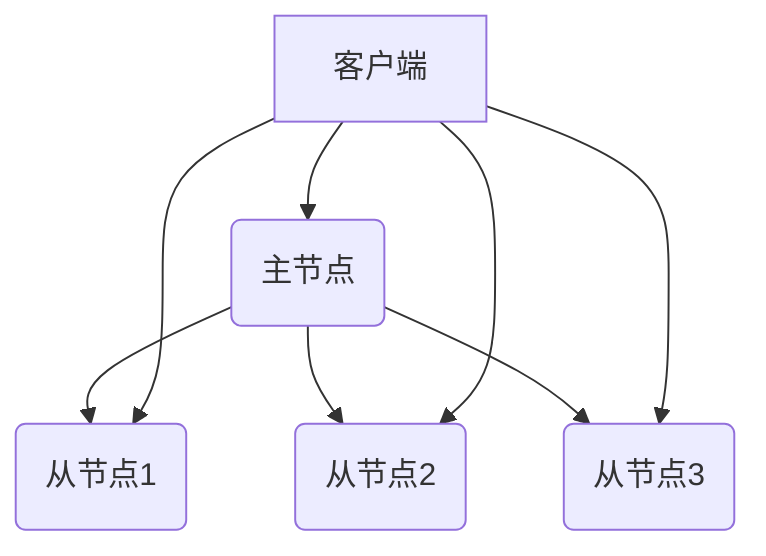
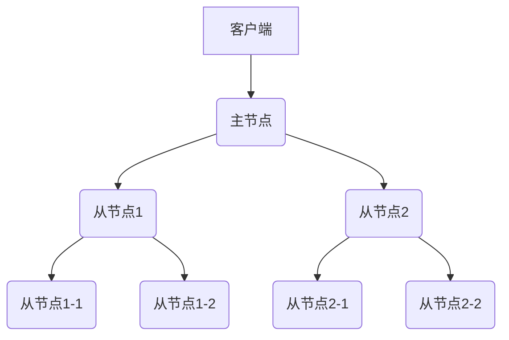
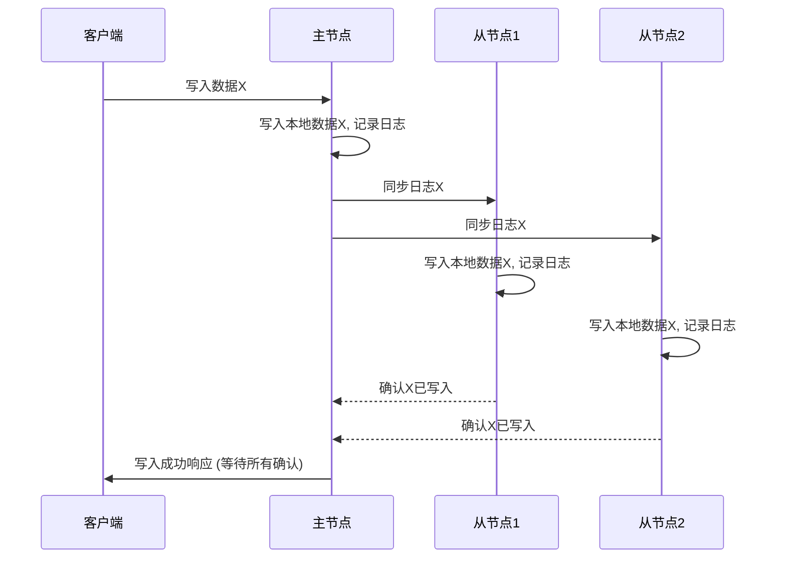
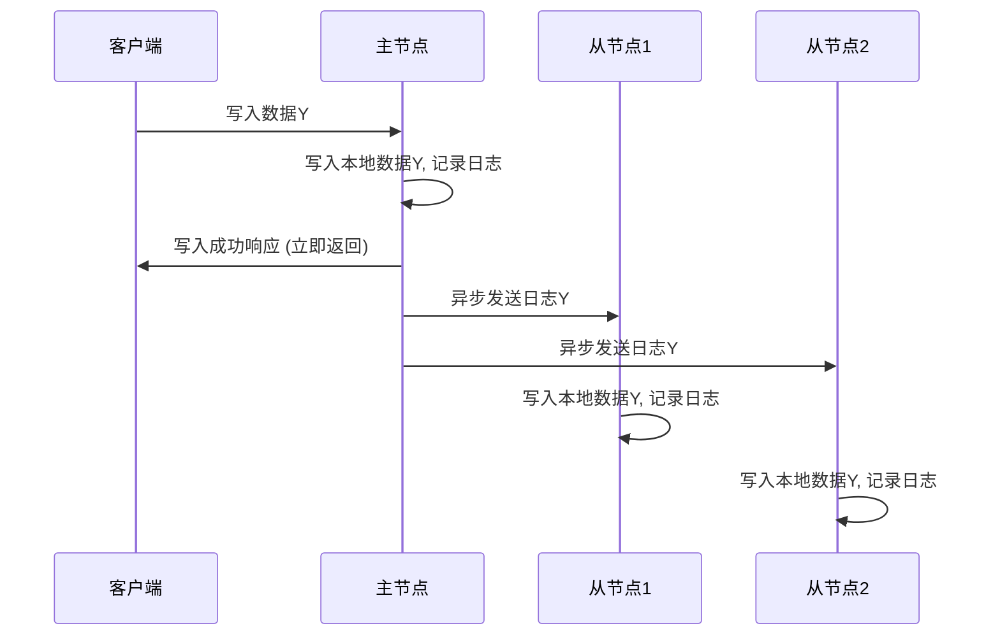

大家好，我是 qmwneb946，一名对技术与数学充满热情的博主。今天，我们即将踏上一段深入分布式系统核心的旅程，探索一个至关重要但又充满挑战的话题：**分布式数据库的复制策略**。

在当今这个数据爆炸的时代，无论是社交媒体、电商平台，还是金融服务、物联网应用，它们背后都离不开一套能够处理海量数据、承受高并发访问并保障持续可用性的数据存储系统。传统单机数据库在面对这些需求时显得力不从心，分布式数据库应运而生，成为了解决这些挑战的关键。

然而，将数据分布到多台机器上固然带来了扩展性，但也引入了新的复杂性。其中，如何确保数据在多个副本之间保持一致，同时提供高可用性和优异的性能，是分布式数据库设计中最核心的议题之一。这正是“复制策略”的用武之地。

想象一下，如果你的电商网站只有一个数据库副本，当这台机器发生故障时，整个网站都会瘫痪，用户的购物车、订单、支付信息将无从查找。这显然是不可接受的。复制策略，正是为了解决这样的问题而生。它通过在多台机器上保存数据的多个副本，从而实现数据的冗余存储，进而达到以下几个核心目标：

1.  **高可用性（High Availability）**：即使部分节点失效，系统也能继续对外提供服务。
2.  **容错性（Fault Tolerance）**：系统能够自动从硬件故障、网络中断等异常中恢复。
3.  **读扩展性（Read Scalability）**：将读请求分散到多个副本上，提高系统整体的并发处理能力。
4.  **灾难恢复（Disaster Recovery）**：当某个数据中心发生灾难时，其他地理位置的副本可以接管服务。
5.  **地理亲近性（Geographical Proximity）**：将数据复制到离用户更近的地点，降低访问延迟。

然而，复制并非没有代价。它带来了数据一致性的挑战、网络通信的开销、冲突解决的复杂性等一系列问题。如何在这多重目标和挑战之间找到最佳平衡点，正是我们今天探讨的重点。

本文将带领大家系统性地剖析分布式数据库中的各种复制策略，从最基础的概念讲起，逐步深入到不同的复制架构模式、数据同步机制、一致性模型，乃至复杂的冲突解决策略，最后还会探讨实际数据库产品中的应用和未来的发展趋势。无论你是数据库工程师、架构师，还是对分布式系统充满好奇的技术爱好者，相信本文都能为你提供宝贵的洞察。

让我们开始这段深入理解分布式数据库复制策略的旅程吧！

---

## I. 复制基础：理解核心概念

在深入探讨具体的复制策略之前，我们首先需要建立一些基础概念的共识。理解这些核心概念，是构建高可用、高性能分布式系统的基石。

### 什么是复制？

**复制 (Replication)** 是指在分布式系统中创建和维护数据的多个副本（或称副本集、拷贝），并将这些副本存储在不同的节点（服务器）上。这些副本可以是完全相同的，也可以是逻辑上等价的。复制的根本目的是通过数据冗余来提高系统的可用性、容错性、可扩展性以及数据安全性。

让我们更具体地阐述复制的目的：

*   **高可用性 (High Availability)**：这是复制最直接也是最核心的目的之一。当某个存储数据的节点因硬件故障、软件崩溃、网络问题或维护停机而不可用时，其他副本可以立即接管服务，确保业务不中断，从而对外提供持续的服务能力。
*   **容错性 (Fault Tolerance)**：与高可用性紧密相关。复制允许系统在面对单个或少数几个组件（如服务器、磁盘、网络链路）的故障时，依然能够保持正常运行。它提供了一种内置的“备胎”机制，使得系统能够从局部故障中“免疫”。
*   **读扩展性 (Read Scalability)**：在许多应用中，读操作的频率远高于写操作。通过将数据复制到多个节点，可以将读请求分散到不同的副本上，从而显著增加系统能够处理的并发读请求数量，有效提升整体吞吐量。
*   **灾难恢复 (Disaster Recovery)**：将数据副本放置在不同的物理位置（如不同的机房、不同的城市、甚至不同的地理区域），可以有效应对区域性甚至全国性的大型灾难（如地震、火灾、大规模停电）。当一个区域完全失效时，另一个区域的副本可以启动服务，保障业务的连续性。
*   **地理亲近性 (Geographical Proximity)**：对于跨地域提供服务的应用（如全球性的社交网络），将数据副本部署在离用户更近的数据中心，可以显著降低数据访问的延迟，提升用户体验。用户请求可以被路由到最近的数据副本进行处理，减少了跨地域网络传输的时间。

### 复制的挑战

尽管复制带来了诸多好处，但它也引入了一系列复杂且棘手的挑战。这些挑战是分布式系统设计的核心难点所在，也是我们后续探讨各种复制策略时需要反复权衡的关键点。

1.  **数据一致性问题 (Data Consistency)**：这是复制面临的最根本的挑战。当数据有多个副本时，如何确保这些副本在任意时刻都保持一致，或者在某些策略下最终达到一致？如果一个写操作成功更新了其中一个副本，但在更新其他副本之前，另一个读操作读取了尚未更新的副本，就会出现数据不一致的问题。这可能导致用户看到“过时”的数据，甚至出现逻辑错误。一致性与可用性、性能之间存在著名的 CAP 定理权衡。
2.  **网络分区 (Network Partition)**：分布式系统中的节点通过网络连接。当网络出现故障，导致部分节点之间无法通信，但它们自身仍然正常运行时，就发生了网络分区（或称脑裂，Split-Brain）。在这种情况下，可能会出现多个“主”节点，各自独立地处理写操作，导致数据在分区恢复后难以合并，产生严重的冲突。
3.  **复制延迟 (Replication Lag)**：在异步复制模式下，主节点更新数据后，需要一定时间才能将更新同步到所有从节点。这段时间差就是复制延迟。在高并发场景下，即使是很小的延迟也可能导致严重的数据不一致问题，影响依赖最新数据的业务逻辑。
4.  **资源消耗 (Resource Consumption)**：维护数据的多个副本需要更多的存储空间。同时，数据在节点间的传输、同步过程会消耗大量的网络带宽和CPU资源。此外，更复杂的复制策略和冲突解决机制也会增加系统的计算开销。
5.  **运维复杂性 (Operational Complexity)**：管理一个复制的分布式数据库比管理单机数据库复杂得多。包括：
    *   **故障检测与恢复**：如何快速准确地检测到节点故障，并自动进行故障转移（Failover）或修复？
    *   **数据同步与修复**：当某个副本落后或损坏时，如何有效地进行数据同步或重建？
    *   **拓扑管理**：如何动态地添加、删除节点，或进行版本升级而不中断服务？
    *   **监控**：如何监控复制状态、延迟、错误等关键指标？
6.  **冲突解决 (Conflict Resolution)**：特别是在允许多个节点同时接受写操作的复制模式中，并发写入同一个数据项会导致冲突。如何检测、避免或解决这些冲突是系统设计的关键。不同的解决策略（如“最后写入者获胜”、“向量时钟”或“无冲突复制数据类型”）对数据一致性和业务逻辑有不同的影响。

### CAP 定理与复制

在讨论分布式系统的复制时，CAP 定理是一个绕不开的基石理论。它由 Eric Brewer 在 2000 年提出，阐述了在一个分布式计算系统中，以下三项特性最多只能同时满足两项：

*   **一致性 (Consistency - C)**：所有客户端在任何时刻都能看到相同的数据。这意味着所有副本的数据是同步的，对于一个成功的写操作，其影响在所有后续读操作中都立即可见。这是对线性一致性 (Linearizability) 的一种简化描述。
*   **可用性 (Availability - A)**：系统总是对客户端的请求作出响应，无论响应成功与否。这意味着即使系统中的部分节点出现故障，整个系统也能够继续对外提供服务，不停止服务。
*   **分区容错性 (Partition Tolerance - P)**：系统能够在出现网络分区的情况下继续运作。网络分区是指，由于网络故障，节点之间无法相互通信，系统被分裂成多个独立的子系统。

CAP 定理的核心在于，**在出现网络分区 (P) 的情况下，你必须在一致性 (C) 和可用性 (A) 之间做出选择。**

*   **CA (一致性 + 可用性)**：如果选择了 C 和 A，那么系统在面对网络分区时将无法正常工作。当发生分区时，为了保证一致性，系统需要停止接受写入或读取，从而牺牲可用性。这更像是传统的单机数据库，或者一个在分布式环境下不具备分区容错能力的系统。
*   **CP (一致性 + 分区容错性)**：选择了 C 和 P，意味着当发生网络分区时，为了保证数据的一致性，系统可能会拒绝一些请求，牺牲了可用性。例如，当一个副本无法与主节点通信时，它会停止服务，直到网络恢复并与主节点同步。许多分布式事务系统、严格一致的键值存储（如 ZooKeeper, etcd, Kafka 的控制器）倾向于此。
*   **AP (可用性 + 分区容错性)**：选择了 A 和 P，意味着当发生网络分区时，系统仍然会尝试响应所有请求，但可能无法保证所有客户端都能立即看到最新数据。牺牲的是强一致性，换来的是最终一致性 (Eventual Consistency)。例如，许多 NoSQL 数据库（如 Cassandra, DynamoDB）倾向于此。当网络分区发生时，每个分区内的节点都可以继续独立地接受读写请求，待网络恢复后，通过后台机制解决数据冲突并达到一致。

**CAP 定理与复制策略的关系：**

复制策略的选择直接受到 CAP 定理的影响。

*   **同步复制**：通常倾向于 **CP**。为了保证强一致性，它会在写入时等待所有（或多数）副本的确认。如果某个副本无法响应，写入操作会阻塞或失败，牺牲了可用性。
*   **异步复制**：通常倾向于 **AP**。它在写入主节点后立即返回成功，不等待从节点的确认。这保证了写入的可用性和低延迟，但在主节点故障时可能导致数据丢失或读到旧数据，牺牲了强一致性而采用最终一致性。
*   **多主复制/无主复制**：这类系统往往设计为 **AP**。它们强调高可用性和分区容错性，通过允许在网络分区期间进行独立操作，并在网络恢复后解决冲突，从而提供最终一致性。

### BASE 原则

作为 CAP 定理在 AP 系统中的延伸，**BASE** 原则被提出，它描述了分布式系统在选择可用性和分区容错性时所追求的一致性模型：

*   **Basically Available (基本可用)**：系统在面临故障时，仍然能够提供非 100% 可用的服务。这意味着虽然系统可能出现部分功能受损、响应时间变长等情况，但它不会完全崩溃，仍能对外提供基本服务。
*   **Soft State (软状态)**：系统中的数据状态可能会随着时间变化而变化，而不需要外部的干预。这意味着数据副本之间可能存在不一致，这种不一致是暂时的，并且最终会得到解决。
*   **Eventual Consistency (最终一致性)**：如果对某个数据项停止所有更新操作，那么经过一段不确定的时间后，该数据项的所有副本最终都会达到一致。在达到一致之前，不同的副本可能拥有不同的数据。

BASE 原则强调的是牺牲了强一致性来换取高可用性和弹性。它与 ACID（原子性、一致性、隔离性、持久性）是相对的概念。ACID 是传统关系型数据库追求的事务特性，旨在提供强一致性和数据完整性；而 BASE 则更适合于需要大规模扩展、高可用且对实时一致性要求不那么严格的分布式系统。

理解这些基本概念是理解不同复制策略设计哲学和权衡的关键。在接下来的章节中，我们将详细探讨不同的复制架构和它们在这些挑战面前做出的选择。

---

## II. 复制架构模式

分布式数据库的复制策略可以根据其在读写操作中的角色和职责分为几种常见的架构模式。每种模式都有其独特的优点、缺点以及适用场景。

### 主-从复制（Master-Slave / Primary-Replica）

主-从复制是最传统、最常见也是最容易理解的复制模式之一。在这种模式下，一个节点被指定为**主节点 (Master / Primary)**，负责处理所有的写操作；而其他节点则作为**从节点 (Slave / Replica / Standby)**，负责接收主节点的更新并复制数据。从节点通常用于处理读请求，分担主节点的读负载。

#### 工作原理

1.  **写操作**：所有的写操作（包括插入、更新、删除）都必须发送到主节点。主节点执行写操作，并将数据的变更记录下来（通常以事务日志、二进制日志或预写日志的形式）。
2.  **数据同步**：主节点将这些变更日志异步或同步地发送给所有从节点。
    *   **日志传输**：主节点会有一个进程（如 MySQL 的 Binlog Dump Thread，PostgreSQL 的 Wal Sender）将日志事件流式传输给从节点。
    *   **从节点应用**：从节点会有一个进程（如 MySQL 的 SQL Thread，PostgreSQL 的 Wal Receiver 和 Apply Process）接收这些日志，并在自己的数据副本上按顺序回放（应用）这些变更，以保持与主节点的数据一致。
3.  **读操作**：读操作可以发送到主节点，也可以发送到任意一个从节点。将读请求分散到多个从节点是提高读扩展性的主要方式。

#### 优点

*   **读扩展性强**：通过增加从节点的数量，可以显著提升系统的读并发处理能力，有效应对读密集型应用。
*   **数据备份与容灾**：从节点天然地提供了数据的实时备份。当主节点发生故障时，可以从一个从节点提升为新的主节点，从而实现故障转移（Failover），确保业务的连续性。
*   **架构简单易懂**：相对而言，主-从架构的概念比较直观，实现和管理也相对简单。写路径单一，没有复杂的写冲突问题。
*   **读写分离**：清晰的读写分离模式有助于优化性能。写操作集中在主节点，读操作分散到从节点，可以避免读写互相干扰。

#### 缺点

*   **单点故障风险（主节点）**：主节点是写操作的唯一入口。如果主节点发生故障，在新的主节点选举或切换完成之前，系统将无法处理写请求，导致写服务中断。尽管可以通过自动故障转移机制来缓解，但切换过程仍可能引入短暂的停顿。
*   **写扩展性瓶颈**：所有的写操作都集中在主节点，这意味着主节点的写入能力成为了整个系统的瓶颈。无法通过增加节点来线性扩展写能力。
*   **数据不一致风险（异步复制）**：在默认的异步复制模式下，主节点在数据写入成功后立即返回，不等待从节点确认。这意味着在主节点和从节点之间存在一个短暂的延迟（复制延迟），在此期间，从节点的数据可能不是最新的。如果主节点在数据同步到从节点之前崩溃，最新写入的数据可能会丢失。客户端在从节点上可能会读到“旧”数据。
*   **主从切换复杂性**：在主节点故障后，选择一个健康的从节点并将其提升为新的主节点，同时更新所有其他从节点指向新的主节点，是一个复杂且容易出错的过程。需要考虑数据一致性（确保选出的从节点数据尽可能新）、网络分区（避免脑裂）、客户端重连等问题。
*   **网络带宽消耗**：主节点需要将所有写操作的日志传输给每个从节点，如果从节点数量很多或者写入量很大，会消耗大量的网络带宽。

#### 变种：主-多从复制

这是主-从复制最常见的部署方式，即一个主节点可以有多个从节点。这种模式进一步增强了读扩展性和冗余能力。


*示意图：主-多从复制*

#### 变种：级联复制 (Cascading Replication)

在级联复制中，一个从节点不仅从主节点复制数据，它还可以充当其他从节点的上游复制源。这种模式可以减轻主节点的复制压力，减少主节点的网络带宽消耗，特别是在从节点数量非常多或者地理分布广泛的场景下。


*示意图：级联复制*

主-从复制模式是许多传统关系型数据库（如 MySQL, PostgreSQL）以及一些 NoSQL 数据库（如 MongoDB 的 Replica Sets）最常用的复制方式。通过配合故障转移和选主机制（如 Raft 协议在 MongoDB 中的应用），可以大大提升其可用性。

### 多主复制（Multi-Master）

与主-从复制不同，多主复制模式允许系统中有多个节点同时充当“主节点”的角色，即它们都可以接受写操作。数据在这些主节点之间进行同步，每个主节点的写操作都会被复制到其他所有主节点。

#### 工作原理

1.  **写操作**：任何一个主节点都可以接收并处理写请求。
2.  **数据同步**：当一个主节点接收到写操作并更新其本地数据后，它会异步地将这些变更传播到其他所有主节点。
3.  **冲突管理**：多主复制的核心挑战在于**冲突解决**。由于多个主节点可以并发地修改相同的数据项，因此很可能会出现写写冲突。系统必须有机制来检测和解决这些冲突，以确保最终所有主节点上的数据能够趋于一致。常见的冲突解决策略包括：
    *   **LWW (Last-Write-Wins)**：简单粗暴，以时间戳最新的写入为准。
    *   **合并操作**：根据业务逻辑合并数据变更。
    *   **用户干预**：让应用程序或用户来解决冲突。
    *   **Vector Clocks (向量时钟)**：用于检测并发写入，但解决冲突仍需策略。
    *   **CRDTs (Conflict-free Replicated Data Types)**：通过特殊的数据结构设计，使得合并操作天然无冲突。

#### 优点

*   **高可用性**：没有单点故障。即使某个主节点宕机，其他主节点仍然可以继续处理读写请求，提供了非常高的可用性。
*   **写扩展性**：在一定程度上可以扩展写能力，因为写操作可以分散到多个主节点上。但需要注意，如果写操作频繁地发生冲突，解决冲突的开销可能会抵消写扩展带来的好处。
*   **地理分布**：非常适合需要跨多个数据中心或地理区域部署的场景。每个数据中心可以有一个主节点，用户可以连接到离他们最近的主节点，降低延迟。
*   **无主从切换的复杂性**：由于所有节点都是主节点，因此在节点故障时，无需进行复杂的角色切换过程（但需要管理节点间的同步和冲突解决）。

#### 缺点

*   **冲突管理复杂**：这是多主复制最大的挑战。并发写入带来的冲突难以避免，设计和实现有效的冲突检测和解决机制非常复杂。不当的冲突解决可能导致数据丢失或逻辑错误。
*   **数据一致性难以保证**：由于是异步同步且允许多点写入，强一致性几乎无法保证。通常只能实现最终一致性。这意味着客户端在不同主节点上可能会读到不一致的数据。
*   **增加开发和运维成本**：冲突解决逻辑可能需要应用程序层面的参与，这增加了开发的复杂性。同时，对多主复制系统的运维、监控和故障排查也更具挑战性。
*   **数据同步延迟**：数据变更需要在所有主节点之间传播。当主节点数量增加时，传播延迟会增加，且网络带宽消耗也随之增加。

#### 典型应用场景

*   **全球分布式应用**：需要跨多个数据中心提供服务，用户分布在全球各地，且对读写延迟有较高要求。
*   **协作编辑系统**：如在线文档协作，但通常会结合更复杂的算法（如 CRDTs）来处理并发修改。
*   **离线应用同步**：例如手机 App 在离线时可以写入数据，联网后与服务器同步。

多主复制的实现相对较少，典型的例子包括 MySQL 的 Galera Cluster (严格来说，它更接近于多主同步复制，内部通过 Paxos 协议保证一致性，避免冲突)、PostgreSQL 的 BDR (Bi-Directional Replication)。由于其复杂性，许多系统倾向于使用更简单的主-从复制结合分区（Sharding）来扩展写入能力。

### 无主复制（Leaderless Replication / Dynamo-style）

无主复制，也常被称为 Dynamo 风格的复制，是 Amazon Dynamo 论文中提出的一种分布式系统设计理念。在这种模式下，所有的节点都是对等的，没有明确的“主”或“从”角色。任何节点都可以接受读写请求，客户端的请求可以发送到集群中的任何一个节点。数据复制通过特定的策略在集群中的多个节点上完成。

#### 工作原理

无主复制的核心思想是**最终一致性 (Eventual Consistency)** 和**可调一致性 (Tunable Consistency)**。它通过以下机制实现数据的冗余和一致性：

1.  **Quorum 机制**：这是无主复制模式的关键。系统通过配置 $N, W, R$ 参数来控制读写操作的一致性级别：
    *   $N$：数据副本的总数（即一个数据项有多少个副本）。
    *   $W$：一个写操作要成功，需要等待多少个副本确认写入成功。
    *   $R$：一个读操作要成功，需要等待多少个副本返回数据。
    为了保证最终一致性或更高程度的一致性，通常需要满足 $W + R > N$ 这个条件，确保读写操作总会有一个交集（重叠），从而读到最新的数据。
2.  **写操作**：客户端向集群中的一个协调节点（Coordinator Node，通常是路由到数据的某个副本节点）发起写请求。协调节点将写请求发送到 $N$ 个副本节点。当收到 $W$ 个副本的成功响应后，写操作就被认为是成功的，并返回给客户端。
3.  **读操作**：客户端向集群中的一个协调节点发起读请求。协调节点将读请求发送到 $N$ 个副本节点。当收到 $R$ 个副本的响应后，协调节点会比较这些响应，返回最新版本的数据给客户端。
4.  **冲突解决**：尽管 Quorum 机制可以在多数情况下保证读到最新数据，但在并发写或网络分区的情况下，仍然可能出现不同副本上数据版本不一致的情况。无主复制系统通常采用以下机制来解决冲突和修复不一致：
    *   **版本向量 (Vector Clocks)**：用于跟踪数据项的演变历史，帮助识别并发的写入。
    *   **读修复 (Read Repair)**：在读操作期间，如果协调节点发现有副本的数据是过时的，它会在返回数据给客户端的同时，将最新版本的数据推送给那些过时的副本。
    *   **写修复 (Write Repair)**：在写操作期间，如果协调节点发现有副本的数据是过时的，它会同步更新这些副本。
    *   **反熵 (Anti-Entropy)**：后台进程会周期性地检查副本之间的数据不一致性，并进行修复，确保所有副本最终收敛到一致状态。例如，Merkle Trees (哈希树) 可以用于高效地检测不一致。

#### 优点

*   **极高的可用性**：由于没有单点故障，且所有节点都是对等的，即使大部分节点故障，只要满足 Quorum 数量的节点仍然存活，系统就能继续提供服务。对网络分区具有很强的韧性。
*   **良好的扩展性**：通过增加节点可以线性扩展存储和吞吐能力。
*   **对网络分区具有韧性**：在网络分区发生时，每个分区内的节点都可以根据配置的 Quorum 规则继续独立地处理请求，待网络恢复后，通过后台修复机制达到最终一致性。
*   **可调一致性**：通过调整 $W$ 和 $R$ 的值，可以灵活地在一致性、可用性和性能之间进行权衡。例如，设置 $W=N, R=1$ 优先保证强写一致性；设置 $W=1, R=N$ 优先保证强读一致性；设置 $W > N/2, R > N/2$ 保证多数派一致性。

#### 缺点

*   **数据一致性模型通常是最终一致性**：尽管可以通过 $W+R > N$ 来实现读写线性一致性，但通常为了性能和可用性，更倾向于使用最终一致性。这意味着在某些情况下，客户端可能读到旧数据。
*   **读写延迟可能较高**：特别是当 $W$ 或 $R$ 的值设置得很高时，需要等待更多副本的响应才能返回结果，这会增加延迟。
*   **运维复杂性**：理解和管理 Quorum 机制、版本冲突、读写修复、反熵等概念增加了运维的复杂性。
*   **数据结构要求**：对于冲突解决，某些数据类型（如 CRDTs）可能需要特殊设计来简化合并。

#### 典型应用场景

*   **大规模互联网应用**：如电商、社交媒体等，对可用性和扩展性要求极高，可以容忍一定的最终一致性。
*   **物联网 (IoT)**：设备产生海量数据，需要高吞吐写入和高可用存储。
*   **实时分析和日志存储**：如 Cassandra, Riak, DynamoDB 等 NoSQL 数据库是这种模式的典型代表。它们追求高可用和高吞吐，而将强一致性的保证留给应用层或选择弱一致性。

```mermaid
graph TD
    A[客户端] --> B(协调节点)
    B --> C(节点1)
    B --> D(节点2)
    B --> E(节点3)
    B --> F(节点4)
    B --> G(节点5)

    subgraph Quorum Write (W=3, N=5)
        B -- 写请求 --> C
        B -- 写请求 --> D
        B -- 写请求 --> E
        B -- 写请求 --> F
        B -- 写请求 --> G
        C -- 确认 --> B
        D -- 确认 --> B
        E -- 确认 --> B
        B -- 写入成功 --> A
    end

    subgraph Quorum Read (R=3, N=5)
        A --> B -- 读请求 --> C
        B -- 读请求 --> D
        B -- 读请求 --> E
        B -- 读请求 --> F
        B -- 读请求 --> G
        C -- 数据V1 --> B
        D -- 数据V2 --> B
        E -- 数据V2 --> B
        F -- 数据V1 --> B
        G -- 数据V2 --> B
        B -- 返回最新数据V2, 并修复C, F --> A
    end
```
*示意图：无主复制与 Quorum 机制*

选择哪种复制架构模式，取决于具体的业务需求、对一致性、可用性、性能和运维复杂性的权衡。主-从模式简单高效，适用于读多写少且对强一致性有较高要求的场景；多主模式适合于多点写入和高可用需求，但需谨慎处理冲突；无主模式则在可用性和扩展性上表现卓越，但通常以牺牲强一致性为代价。

---

## III. 数据同步机制

数据同步机制是复制策略的核心，它决定了数据变更如何在主副本和从副本之间传播，以及何时被认为是“完成”的。这直接关系到系统的一致性、可用性和性能表现。

### 同步复制

**同步复制 (Synchronous Replication)** 意味着主节点在执行写操作并更新其本地数据后，必须等待至少一个（通常是所有或指定数量的）从节点确认已接收并写入（或至少持久化到日志中）该变更，然后才向客户端返回写操作成功的响应。

#### 工作原理

1.  **客户端发起写请求**：写请求发送到主节点。
2.  **主节点执行写操作**：主节点将数据写入本地存储，并将变更记录到日志中（如预写日志 WAL）。
3.  **主节点通知从节点**：主节点将变更日志发送给所有配置为同步的从节点。
4.  **从节点确认**：从节点接收到日志，将其持久化到自己的存储，并向主节点发送确认消息。
5.  **主节点返回成功**：主节点收到所有（或满足 Quorum 数量）从节点的确认后，才向客户端返回写操作成功的响应。


*示意图：同步复制过程*

#### 优点

*   **强一致性 (Strong Consistency)**：这是同步复制最显著的优势。一旦主节点返回写成功，就可以保证所有（或配置所需数量的）副本都包含了这个最新的数据。后续的任何读操作都能够看到最新的数据，即使读操作是从从节点进行的。这满足了事务的持久性（Durability）要求。
*   **无数据丢失**：在配置为全同步复制（即所有从节点都确认）的情况下，即使主节点立即崩溃，只要有一个从节点存活，数据就不会丢失。这对于金融交易等对数据完整性要求极高的场景至关重要。

#### 缺点

*   **写入延迟高 (High Write Latency)**：主节点必须等待所有从节点的响应，这意味着写入操作的延迟将取决于网络延迟、从节点的处理速度以及最慢的那个从节点的响应时间。随着从节点数量的增加，延迟会进一步增加。这严重影响系统的写入吞吐量。
*   **降低可用性 (Reduced Availability)**：如果任何一个配置为同步的从节点发生故障、网络中断或响应过慢，主节点的写入操作将被阻塞，无法完成，导致系统写服务中断或延迟。这使得同步复制系统对网络和节点故障更加敏感，违背了 CAP 定理中的 A (可用性)。
*   **单点故障扩散**：如果主节点在等待同步从节点响应时崩溃，可能导致事务处于不确定状态。

#### 变种：半同步复制 (Semi-Synchronous Replication)

为了缓解全同步复制的性能和可用性问题，许多数据库实现了半同步复制。在这种模式下，主节点只需要等待**至少一个**从节点确认接收到（或持久化了）事务日志，即可向客户端返回成功。

*   **工作原理**：主节点发出日志，并等待第一个从节点返回确认。一旦收到一个从节点的确认，主节点就认为写入成功。其他从节点可以继续异步复制。
*   **优点**：
    *   **比全同步更低的延迟**：只需等待一个从节点，性能优于全同步。
    *   **比异步更强的数据持久性**：至少保证一份数据在主节点之外的另一个地方持久化了，降低了主节点崩溃时的数据丢失风险。
*   **缺点**：
    *   **仍有潜在数据丢失风险**：如果主节点和那个已确认的从节点同时崩溃，而其他从节点尚未收到数据，仍可能丢失数据。
    *   **无法保证所有从节点实时一致**：只有确认的从节点是“最新的”，其他从节点仍然是异步且可能滞后。

MySQL 的半同步复制 (semi-sync replication) 是一个典型的例子，它允许主节点在至少一个从节点接收到事务后返回。

### 异步复制

**异步复制 (Asynchronous Replication)** 意味着主节点在执行写操作并更新其本地数据后，会立即向客户端返回写操作成功的响应，而无需等待从节点的确认。数据变更的复制是发生在后台的、非阻塞的过程。

#### 工作原理

1.  **客户端发起写请求**：写请求发送到主节点。
2.  **主节点执行写操作**：主节点将数据写入本地存储，并记录日志。
3.  **主节点返回成功**：主节点立即向客户端返回写操作成功的响应。
4.  **后台同步**：主节点在一个独立的线程或进程中，将变更日志异步地发送给从节点。从节点接收并应用这些日志。


*示意图：异步复制过程*

#### 优点

*   **写入延迟低 (Low Write Latency)**：主节点不需要等待从节点，因此写入性能非常高。系统的写入吞吐量不会受到网络延迟或从节点处理速度的影响。
*   **高可用性 (High Availability)**：主节点的写入操作不受从节点状态的影响。即使所有从节点都离线或出现故障，主节点仍然可以继续接受写请求。这满足了 CAP 定理中的 A (可用性)。
*   **对网络波动的鲁棒性**：网络短暂中断或高延迟不会阻塞主节点的写入操作。

#### 缺点

*   **数据丢失风险**：这是异步复制最主要的风险。如果主节点在将数据变更同步到从节点之前突然崩溃（例如，断电），那么未同步的最新数据将永远丢失。在主节点恢复或进行故障转移时，从节点的数据将比主节点崩溃前的数据旧。
*   **从节点数据滞后/不一致**：由于是异步复制，主节点和从节点之间必然存在一个时间差，即复制延迟。在这段延迟时间内，从节点的数据可能不是最新的，导致客户端从从节点读取到“脏数据”或“旧数据”。这违反了强一致性。
*   **难以实现事务隔离**：在异步复制中，跨多个节点的分布式事务很难保证原子性、一致性和隔离性。

#### 选择考量

在同步复制和异步复制之间做出选择，是分布式数据库设计中一个经典的权衡问题，直接反映了 CAP 定理的权衡：

*   **选择同步复制 (倾向 CP)**：
    *   **场景**：对数据一致性和零数据丢失有严格要求（如金融交易、银行系统）。
    *   **代价**：牺牲写入性能和可用性。
    *   **典型实现**：分布式事务（如两阶段提交），基于 Paxos 或 Raft 的集群（如 ZooKeeper, etcd, MongoDB Replica Sets 的多数派写）。

*   **选择异步复制 (倾向 AP)**：
    *   **场景**：对写入性能和高可用性有极高要求，可以容忍短时间的数据不一致或少量数据丢失（如日志系统、社交媒体动态、分析数据）。
    *   **代价**：牺牲强一致性，采用最终一致性。需要应用程序能够处理读到旧数据或冲突的情况。
    *   **典型实现**：MySQL/PostgreSQL 的默认复制，Cassandra, Kafka 等。

大多数实际系统会采取一些折衷方案，例如半同步复制，或者在应用层面通过补偿机制来处理最终一致性带来的问题。理解这两种同步机制的优缺点，是合理设计分布式数据系统的关键。

---

## IV. 复制一致性模型

在分布式数据库中，当数据有多个副本时，如何确保这些副本之间的数据状态是一致的，以及客户端在不同时间或从不同副本读取时能看到怎样的数据，这就是**一致性模型 (Consistency Model)** 所关注的核心问题。一致性模型定义了读写操作的行为契约。

### 强一致性（Strong Consistency）

**强一致性**，通常指的是**线性一致性 (Linearizability)** 或**顺序一致性 (Sequential Consistency)**。
*   **线性一致性**：这是最严格的一致性模型。它要求在任何给定的时间点，所有客户端对数据的所有操作都看起来好像是在一个单一的、全局的、即时的顺序中执行的。这意味着：
    1.  任何读操作都必须返回最近一次成功的写操作所写入的值。
    2.  所有对数据的操作（读和写）都好像是原子性的，并且瞬时完成的。
    3.  操作的顺序必须与它们实际发生的时间顺序相符（实时顺序）。

*   **顺序一致性**：比线性一致性稍弱。它要求所有进程的读写操作结果，与它们在某个序列上执行的结果相同。这个序列是所有进程执行的某个顺序。如果一个进程内部，操作 A 在操作 B 之前发生，那么在这个序列中，A 也必须在 B 之前。但是不同进程的操作之间没有实时顺序的保证。

#### 实现方式

要实现强一致性，通常需要付出高昂的代价：

1.  **同步复制**：如上一节所述，主节点必须等待所有（或多数）从节点确认写入成功后才返回。
2.  **分布式事务**：例如**两阶段提交 (Two-Phase Commit, 2PC)**。它通过协调者确保一个事务要么在所有参与节点上都提交，要么都回滚。
    *   **阶段一：投票 (Commit-Request / Vote Request)**：协调者向所有参与者发送准备提交请求。参与者执行事务操作，并记录日志，然后投票（同意或拒绝）。
    *   **阶段二：提交/回滚 (Commit / Rollback)**：协调者根据所有参与者的投票结果决定最终操作。如果所有参与者都同意，协调者发送提交命令；否则，发送回滚命令。
    *   **优点**：严格的原子性和强一致性。
    *   **缺点**：性能差、可用性低（任何一个参与者或协调者故障都可能导致事务阻塞）、单点协调者风险。
3.  **分布式一致性算法**：如 **Paxos** 或其更易于理解的变种 **Raft**。这些算法能够保证在一个分布式系统中，即使面对节点故障和网络分区，也能在大多数节点存活的情况下，让所有节点对某个值达成共识，从而实现强一致性。它们是许多分布式强一致性存储系统的基石（如 ZooKeeper, etcd, Consul）。

#### 优点

*   **业务逻辑简单**：应用程序无需处理复杂的并发写入或数据不一致问题，因为系统保证了数据始终是最新的。
*   **数据准确性高**：对于金融交易、库存管理等对数据精确性要求极高的场景至关重要。

#### 缺点

*   **性能差**：为了保证一致性，通常需要引入更多的网络通信和协调开销，导致写入延迟高，吞吐量受限。
*   **可用性低**：对网络分区或节点故障非常敏感。在出现故障时，为了维持一致性，系统可能无法提供服务（根据 CAP 定理，倾向于 CP）。

### 最终一致性（Eventual Consistency）

**最终一致性** 是指如果对某个数据项停止所有更新操作，那么经过一段不确定的时间后，该数据项的所有副本最终都会达到一致。在达到一致之前，不同的副本可能拥有不同的数据。

这是分布式系统中最为宽松的一致性模型，也是许多大规模、高可用 NoSQL 数据库（如 Cassandra, DynamoDB, CouchDB）所采用的模型。

#### 实现方式

最终一致性通常通过以下机制实现：

1.  **异步复制**：如前所述，主节点在写入后立即返回，数据在后台异步复制。
2.  **Gossip 协议**：一种去中心化的、点对点通信协议，节点之间周期性地随机交换信息，以传播数据和元数据，最终使所有节点的数据趋于一致。
3.  **读修复 (Read Repair)** 和 **写修复 (Write Repair)**：在读写操作发生时，系统会检查数据副本的一致性，如果发现不一致，则进行修复。
4.  **反熵 (Anti-Entropy)**：后台进程周期性地扫描并比对副本，修复不一致的数据。

#### 优点

*   **性能高**：写入操作通常只需更新本地副本并立即返回，延迟极低，吞吐量高。
*   **可用性好**：对网络分区和节点故障具有很强的韧性。即使部分节点失效，系统仍然可以提供服务（根据 CAP 定理，倾向于 AP）。
*   **可扩展性强**：能够轻松扩展到数千个节点，支持海量数据存储和高并发访问。

#### 缺点

*   **读可能看到旧数据**：在数据尚未完全同步时，从不同的副本读取可能会看到不一致或过时的数据。
*   **业务逻辑复杂**：应用程序需要能够处理“读到旧数据”的情况，可能需要引入幂等性、补偿机制等来保证业务的正确性。
*   **冲突解决**：在允许多点写入的最终一致性系统中，需要有机制来解决并发写入的冲突（如 LWW, Vector Clocks, CRDTs）。

### 读-写一致性等级（Quorum Consistency Levels）

在无主复制（Dynamo-style）系统中，通常通过配置 $N, W, R$ 参数来提供**可调一致性 (Tunable Consistency)**。这允许开发者根据业务需求在强一致性、可用性和性能之间进行灵活的权衡。

*   **$N$ (Number of Replicas)**：数据副本的总数。每个数据项都会被复制到 $N$ 个不同的节点上。
*   **$W$ (Write Quorum)**：一个写操作要被认为是成功的，需要等待多少个副本确认写入成功。
*   **$R$ (Read Quorum)**：一个读操作要被认为是成功的，需要从多少个副本读取数据并进行比较（通常返回最新版本）。

#### 强一致性条件：$W + R > N$

当 $W + R > N$ 时，可以保证读操作总会读取到至少一个包含最新数据的副本。这是因为写操作成功需要 $W$ 个副本确认，而读操作需要 $R$ 个副本返回。如果 $W$ 个副本和 $R$ 个副本的集合存在交集，那么读操作就能接触到至少一个包含最新数据的副本。

**数学证明：**
假设有 $N$ 个副本。
写操作成功意味着有 $W$ 个副本更新了数据。设这些副本的集合为 $S_W$。
读操作需要从 $R$ 个副本读取数据。设这些副本的集合为 $S_R$。
如果 $S_W$ 和 $S_R$ 有交集，即 $|S_W \cap S_R| \ge 1$，那么读操作就能够读取到至少一个最新副本。
根据集合论：$|S_W \cup S_R| = |S_W| + |S_R| - |S_W \cap S_R|$.
我们知道 $|S_W \cup S_R| \le N$ (因为所有副本都在 $N$ 个节点之内)。
所以，$N \ge W + R - |S_W \cap S_R|$.
要保证 $|S_W \cap S_R| \ge 1$，则需要 $N \ge W + R - 1$，即 $W + R > N$。

#### 示例配置：

1.  **强一致性（通常是线性一致性）**：
    *   **$W=N, R=1$**: 写操作必须等待所有副本确认。读操作可以从任意一个副本读取。写入非常慢，但读取快。如果某个副本故障，写操作会失败。
    *   **$W=1, R=N$**: 写操作只需一个副本确认。读操作必须等待所有副本返回。写入非常快，但读取慢。读取时可以发现并修复不一致。
    *   **$W = \lceil N/2 \rceil + 1, R = \lceil N/2 \rceil + 1$ (多数派 Quorum)**: 这是最常见的配置，确保 $W+R > N$。例如，如果有 $N=5$ 个副本，设置 $W=3, R=3$。这样可以提供较好的可用性和一致性平衡。只要多数节点可用，写读都能成功。

2.  **最终一致性**：
    *   **$W=1, R=1$**: 写入操作和读取操作都只需要一个副本成功。这是最弱的一致性级别，但提供了最高的可用性和最低的延迟。数据不一致的窗口最大。
    *   **$W=1, R=N$**: 写入快，读取慢，读取时做修复。
    *   **$W=N, R=1$**: 写入慢，读取快，写入时保证一致性。

#### 灵活性与权衡

Quorum 机制提供了极大的灵活性，允许系统设计师和运维人员根据具体应用场景的需求来调整一致性级别：

*   **对一致性要求高**：提高 $W$ 或 $R$ 的值，直到满足 $W+R > N$。牺牲性能和可用性。
*   **对可用性要求高**：降低 $W$ 和 $R$ 的值。牺牲一致性。
*   **读多写少**：可以设置较小的 $W$ 和较大的 $R$。
*   **写多读少**：可以设置较大的 $W$ 和较小的 $R$。

这种可调一致性是 Dynamo 风格数据库（如 Apache Cassandra）的一大特色，它允许应用程序在不同的操作中选择不同的一致性级别，例如，对金融交易使用强一致性，对用户点赞使用弱一致性。

---

## V. 冲突解决策略（针对多主复制和无主复制）

在多主复制和无主复制（Dynamo-style）这两种架构中，由于允许数据在多个节点上并发写入，因此不可避免地会遇到**写写冲突 (Write-Write Conflicts)**。当两个或多个客户端同时尝试修改同一数据项的不同副本时，就会发生冲突。有效的冲突解决策略是这类分布式数据库能够稳定运行的关键。

### 写写冲突（Write-Write Conflicts）

**定义**：当两个或多个并发事务（或操作）尝试修改同一份数据的不同副本，且这些修改操作的顺序无法通过简单的“先来后到”规则确定时，就会产生写写冲突。例如，如果节点 A 将变量 $X$ 从 10 更新为 20，同时节点 B 将变量 $X$ 从 10 更新为 30，这两个操作就是冲突的。

**挑战**：如何识别这些并发修改，并选择一个“正确”的结果，或者将它们合并成一个合理的结果，同时避免数据丢失或逻辑错误。

### 冲突解决机制

以下是几种常见的冲突解决机制：

#### Last-Write-Wins (LWW)

**工作原理**：LWW 是最简单也是最常用的冲突解决策略。它基于时间戳或版本号，总是选择时间戳（通常是写入时的时间戳）最新的那个写入作为最终结果。

*   **实现**：每个数据项在写入时都会带上一个时间戳。当多个冲突的写入到达时，系统比较它们的时间戳，保留时间戳最大的那个写入，丢弃旧的写入。
*   **优点**：
    *   实现简单，易于理解。
    *   在大多数情况下都能提供一个确定的结果。
*   **缺点**：
    *   **可能导致数据丢失**：这是 LWW 最严重的问题。如果两个并发更新，一个更新了 A 字段，另一个更新了 B 字段，而它们的顺序又因为网络延迟等原因导致时间戳“颠倒”，那么其中一个更新可能会被完全覆盖，从而丢失部分数据。例如，用户 1 将 `name` 更新为 "Alice"，用户 2 将 `email` 更新为 "alice@example.com"，如果用户 2 的操作因网络延迟后到达但时间戳却“更旧”，那么 Alice 的 `email` 更新就可能丢失。
    *   **无法处理语义冲突**：LWW 仅仅基于时间戳，无法理解业务逻辑中的语义。

**数学表示：**
对于数据项 $D$，收到两个更新操作 $U_1(D, V_1, T_1)$ 和 $U_2(D, V_2, T_2)$，其中 $V$ 是新值，$T$ 是时间戳。
LWW 策略下，最终的值 $V_{final}$ 为：
$$ V_{final} = \begin{cases} V_1 & \text{if } T_1 \ge T_2 \\ V_2 & \text{if } T_2 > T_1 \end{cases} $$
这里通常使用客户端提供的时间戳或服务器接收到请求时的时间戳。分布式系统中的时间同步是一个挑战（NTP, TrueTime）。

#### Operation-based

**工作原理**：这种策略不是简单地比较最终状态，而是记录并同步操作本身。冲突解决发生在操作层面，通过定义操作的合并规则来解决。

*   **优点**：可以保留所有冲突的修改，从而避免数据丢失。
*   **缺点**：需要根据具体的业务逻辑定义复杂的合并规则，可能难以实现。
*   **示例**：
    *   计数器：多个并发的“增量”操作可以简单地将它们的值相加。
    *   列表：并发地添加元素到列表的不同位置，可能定义为合并两个列表。

#### Read-Repair / Write-Repair

这两种机制是无主复制系统中常用的后台冲突修复方法：

*   **读修复 (Read-Repair)**：当客户端发起读请求时，协调节点会从 $R$ 个副本中读取数据。如果发现这些副本的数据版本不一致，协调节点会选择最新版本的数据返回给客户端，并同时将这个最新版本的数据推送到那些包含旧数据的副本上，使其更新。
*   **写修复 (Write-Repair)**：当客户端发起写请求时，协调节点将写请求发送到 $N$ 个副本。如果发现某个副本的数据版本落后或不一致，协调节点会在写入新数据的同时，将最新版本的数据推送到该副本，进行修复。

#### Vector Clocks (向量时钟)

**工作原理**：向量时钟是一种逻辑时间戳机制，用于检测分布式系统中事件的因果关系，并识别并发修改。它不是一个单一的数值，而是一个由 `(节点ID, 计数器)` 对组成的列表或向量。

1.  每个节点维护一个向量时钟。
2.  当一个节点对数据项进行写操作时，它会递增自己对应的计数器，并将更新后的向量时钟与数据一起保存。
3.  当一个节点将数据发送给另一个节点时，它会发送自己的向量时钟。接收节点会合并接收到的向量时钟和自己的向量时钟（取对应组件的最大值）。
4.  当比较两个数据版本 $V_A$ 和 $V_B$ 的向量时钟 $VC_A$ 和 $VC_B$ 时：
    *   如果 $VC_A$ 中的每个组件都小于或等于 $VC_B$ 中对应的组件，并且至少有一个组件严格小于，则 $V_A$ 是 $V_B$ 的祖先（$V_A$ 发生在 $V_B$ 之前）。
    *   如果 $VC_B$ 中的每个组件都小于或等于 $VC_A$ 中对应的组件，并且至少有一个组件严格小于，则 $V_B$ 是 $V_A$ 的祖先（$V_B$ 发生在 $V_A$ 之前）。
    *   如果两者之间没有上述关系（即各自都有一个组件大于对方），那么 $V_A$ 和 $V_B$ 是并发的，存在冲突。

**示例：**
假设有三个节点 $N_1, N_2, N_3$。一个数据项的初始向量时钟为 `[0,0,0]`。
1.  $N_1$ 写入数据 $D_1$：向量时钟变为 `[1,0,0]`。
2.  $N_2$ 写入数据 $D_2$：向量时钟变为 `[0,1,0]`。
此时 $D_1$ 和 $D_2$ 是并发冲突的，因为 `[1,0,0]` 和 `[0,1,0]` 互不包含。系统需要将其视为冲突并进行解决。
3.  $N_1$ 在接收 $D_2$（向量时钟 `[0,1,0]`）后，再次写入 $D_3$：它会将自己的计数器加 1，然后与接收到的 $D_2$ 的时钟合并：`[1,0,0]` 和 `[0,1,0]` 合并为 `[1,1,0]`。然后 $N_1$ 递增自己的计数器，得到 `[2,1,0]`。
此时 $D_3$ (`[2,1,0]`) 是 $D_1$ (`[1,0,0]`) 和 $D_2$ (`[0,1,0]`) 的后代，表示它包含了这两个并发更新。

*   **优点**：
    *   能够准确检测并发写入，而不是简单地丢弃数据。
    *   可以作为 LWW 的替代，避免丢失数据。
*   **缺点**：
    *   向量时钟可能会无限增长，需要定期清理。
    *   冲突解决仍需要额外的策略（如 LWW，或者向客户端暴露冲突）。

#### CRDTs (Conflict-free Replicated Data Types)

**工作原理**：CRDTs 是一种特殊的数据结构，其设计思想是使得在不同副本上进行的并发操作，即使以任意顺序应用，也能保证最终状态一致，且不需要复杂的冲突解决机制。它们天生就是“无冲突”的。CRDTs 依赖于操作的**交换律 (Commutativity)**、**结合律 (Associativity)** 和**幂等性 (Idempotence)**。

CRDTs 分为两种主要类型：

1.  **基于状态的 CRDTs (CvRDTs / State-based CRDTs)**：传播整个数据结构的状态。当两个副本的状态合并时，只需对它们进行一个确定的合并操作（如集合取并集，计数器取最大值），就能得到一致的结果。
    *   **G-Counter (Grow-only Counter)**：只能递增的计数器。合并时取各个副本计数器的最大值。
    *   **PN-Counter (Positive-Negative Counter)**：支持递增和递减的计数器。每个副本维护一个正计数器和负计数器，合并时分别取各自的最大值。
    *   **G-Set (Grow-only Set)**：只能添加元素的集合。合并时取并集。
    *   **OR-Set (Observed-Remove Set)**：支持添加和删除元素的集合。更复杂，需要跟踪添加和删除操作的“原因”。

2.  **基于操作的 CRDTs (Op-based CRDTs)**：传播操作本身。每个操作都被封装成一个消息，并发送给所有副本。每个副本独立地应用这些操作。由于操作满足数学特性，所以无论操作到达的顺序如何，最终状态都会一致。
    *   需要一个可靠的、因果有序的消息传递层。

*   **优点**：
    *   **真正的无冲突**：从根本上避免了冲突，简化了系统设计。
    *   **数据永不丢失**：所有有效的并发修改都会被保留。
    *   **高可用**：每个副本都可以独立接受更新。
*   **缺点**：
    *   **数据类型限制**：只能应用于特定类型的数据结构（计数器、集合、图等）。并非所有数据类型都能被建模为 CRDT。
    *   **可能消耗更多存储**：某些 CRDTs 为了实现无冲突合并，可能需要存储额外的元数据。
    *   **理解和实现复杂度**：虽然使用简单，但设计和实现 CRDTs 具有一定复杂性。

#### 应用层解决

在某些情况下，系统无法自动解决冲突，或者自动解决的策略无法满足业务需求。此时，冲突的解决需要**应用程序的介入**：

*   **强制用户解决**：例如，当 Git 合并代码时遇到冲突，会提示用户手动解决。
*   **业务逻辑处理**：应用程序可以读取所有冲突的版本，然后根据特定的业务规则来生成一个最终版本。例如，在电商购物车中，如果两个用户同时修改了同一商品数量，应用程序可能会选择合并操作（如取最大值），或提示用户。

选择合适的冲突解决策略，需要综合考虑业务场景对数据一致性和完整性的要求、性能、以及系统设计的复杂性。LWW 简单但有数据丢失风险；向量时钟能识别冲突但仍需后续策略；CRDTs 从根本上避免冲突但有数据类型限制；应用层解决则提供了最大的灵活性，但也增加了应用开发的负担。

---

## VI. 复制策略的实现技术与实践

理解了复制的基础概念、架构模式、同步机制和一致性模型之后，我们来看看这些理论是如何在现实世界的分布式数据库中落地的。不同的数据库产品根据其设计目标和应用场景，采用了不同的复制策略组合。

### 常见的数据库与它们的复制实现

#### MySQL

*   **Master-Slave/Master-Master Replication (基于 Binlog)**：
    *   **原理**：MySQL 的复制主要基于**二进制日志 (Binlog)**。主节点将所有数据变更（DML 和 DDL）记录到 Binlog 中。从节点通过 I/O 线程连接到主节点，读取 Binlog 事件，并将其写入自己的中继日志 (Relay Log) 中。然后，SQL 线程从中继日志中读取事件，并在从节点上重新执行这些事件，从而使从节点的数据与主节点保持一致。
    *   **同步机制**：默认是**异步复制**。主节点写入 Binlog 后立即返回，不等待从节点。
    *   **半同步复制 (Semi-Synchronous Replication)**：通过插件实现，主节点至少等待一个从节点确认已接收到 Binlog 事件并写入其 Relay Log 后才返回。这在主节点崩溃时，大大降低了数据丢失的风险。
    *   **架构**：典型的主-多从（Master-N Slaves）。
    *   **多主**：MySQL 也可以配置为双主或多主复制，但通常需要应用程序层面的协调来避免写入冲突，或者配合 Galera Cluster 等解决方案。
*   **MySQL Group Replication (MGR)**：
    *   **原理**：MGR 是一种多主更新能力（通常配置为单主模式来避免冲突），基于 Paxos 变种算法 **Group Communication System (GCS)** 实现的强一致性复制解决方案。集群中的所有成员都维护一份完整的数据副本，所有写操作在被提交之前，必须经过集群的多数派同意。
    *   **同步机制**：**同步复制**（Quorum 多数派）。事务只有在被组中的多数派成员都接受并排序后才能提交。
    *   **优点**：提供强大的容错能力和数据强一致性，自动故障转移，支持多读多写（在单主模式下支持多读单写，但写操作通过多数派共识）。
    *   **缺点**：写入性能受多数派共识的延迟影响；集群成员数量受限（通常建议 3、5 或 7 个成员）。

#### PostgreSQL

*   **Streaming Replication (流复制)**：
    *   **原理**：PostgreSQL 的流复制基于**预写日志 (WAL: Write-Ahead Log)**。主节点将所有数据变更写入 WAL 文件。从节点（称为 Standby 服务器）通过流协议从主节点实时获取 WAL 记录，并在本地重放这些记录，以保持数据同步。
    *   **同步机制**：默认是**异步复制**。主节点写入 WAL 后立即返回。
    *   **同步备用 (Synchronous Standby)**：可以配置为主节点至少等待一个备用节点将 WAL 记录写入其磁盘（`synchronous_commit = on` 和 `synchronous_standby_names` 配置）。这提供了更高的持久性和一致性保证。
    *   **架构**：主-备模式 (Primary-Standby)。备用节点可以提供只读查询。
    *   **级联复制**：备用节点也可以作为其他备用节点的上游复制源。
*   **Logical Replication (逻辑复制)**：
    *   **原理**：PostgreSQL 10+ 引入。它不是复制 WAL 记录，而是复制数据变更的逻辑表示（行级别的插入、更新、删除）。这允许更细粒度的复制，例如只复制特定的表，或者在不同版本的 PostgreSQL 之间复制，甚至用于数据集成。
    *   **同步机制**：通常是**异步**。
    *   **用途**：ETL、数据库升级、跨版本迁移、选择性复制等。

#### MongoDB

*   **Replica Sets (副本集)**：
    *   **原理**：MongoDB 的复制是通过副本集实现的。一个副本集由一个**主节点 (Primary)** 和多个**从节点 (Secondary)** 组成。所有的写操作都发送到主节点，主节点将这些操作记录在操作日志 (Oplog) 中。从节点异步地从主节点拉取 Oplog，并在本地应用这些操作。
    *   **选举**：当主节点发生故障时，副本集会自动触发选举过程，通过类似 Raft 的算法从现有的从节点中选举出一个新的主节点。
    *   **同步机制**：默认是**异步复制**。但客户端可以通过 `writeConcern` 参数指定不同的写确认级别，实现**可调一致性**：
        *   `w: 1`：只等待主节点确认写入。
        *   `w: majority`：等待多数节点（包括主节点）确认写入。这提供了更强的持久性和一致性，类似于半同步甚至同步。
    *   **优点**：自动故障转移，高可用，支持读扩展（读可以路由到从节点），可调一致性。

#### Apache Cassandra / Riak

*   **Dynamo-style (无主复制)**：
    *   **原理**：Cassandra (受 Amazon Dynamo 启发) 和 Riak 是典型的无主复制数据库。集群中的所有节点都是对等的，没有主从之分。数据被哈希分布到环形结构上，并复制到多个节点。
    *   **同步机制**：基于 Quorum 机制实现**可调一致性**和**最终一致性**。客户端在读写时可以指定一致性级别 (`ONE`, `QUORUM`, `ALL` 等)。
    *   **冲突解决**：通常使用 LWW（基于时间戳或版本号），但也支持通过客户端处理并发写入冲突（如 CRDTs 的实现，或让客户端决定）。系统会进行读修复、写修复和反熵来维持最终一致性。
    *   **优点**：极高的可用性，线性可扩展性，对网络分区有很强的韧性。
    *   **缺点**：默认是最终一致性，需要应用程序处理潜在的数据不一致和冲突。

#### Apache Kafka

*   **Leader-Follower (基于日志复制)**：
    *   **原理**：Kafka 是一个分布式流处理平台。其复制模型是基于分区 (Partition) 的 Leader-Follower 模式。每个 Topic 被划分为多个 Partition，每个 Partition 有一个 Leader 副本和多个 Follower 副本。所有生产者的写操作和消费者的读操作都只与 Leader 副本交互。Leader 负责维护消息的顺序和持久化。
    *   **同步机制**：Follower 副本持续从 Leader 副本拉取消息，并应用到自己的日志中。Kafka 通过 **In-Sync Replicas (ISR)** 机制来管理副本同步状态。只有在 ISR 列表中的 Follower 副本才被认为是同步的。
    *   **持久性保证**：生产者可以配置 `acks` 参数来控制消息的持久化程度：
        *   `acks=0`：发送即成功，最高吞吐，最低持久性。
        *   `acks=1`：Leader 写入本地日志成功即返回。
        *   `acks=all` (或 -1)：Leader 写入本地日志并等待 ISR 中的所有 Follower 副本都同步完成后才返回，提供最高持久性。
    *   **优点**：高吞吐量，高可用性，支持横向扩展，消息持久性可配置。
    *   **缺点**：写操作集中在 Leader，有 Leader 瓶颈。

### 选举算法（Election Algorithms）

在许多分布式数据库中，特别是在主-从复制需要自动故障转移的场景，以及需要强一致性的分布式存储系统中，选举算法是不可或缺的组成部分。它们确保在面对网络分区和节点故障时，集群能够选出一个唯一的 Leader，从而维护一致性和可用性。

#### Paxos

**Paxos** 算法是由 Leslie Lamport 在 1990 年代提出的，用于在分布式系统中就某个值达成共识。它是理论上最完美、最安全的分布式一致性算法之一，能够容忍节点故障和网络延迟，并保证活性（Liveness）和安全性（Safety）。

*   **角色**：通常包括 Proposer (提议者), Acceptor (接受者), Learner (学习者) 等。
*   **过程**：通过多个阶段的通信（Prepare, Accept），参与者们就某个提议达成共识。即使有节点故障或网络延迟，只要多数节点正常，算法就能继续进行。
*   **优点**：理论上提供强一致性，容错能力强。
*   **缺点**：
    *   **极度复杂**：理解和实现非常困难，被认为是分布式系统中最难的算法之一。
    *   **效率**：在正常运行时也需要多轮网络通信。
*   **应用**：虽然很少直接用于生产系统（因为太复杂），但许多实际的分布式一致性系统（如 Google Chubby, ZooKeeper ZAB 协议）都受到了 Paxos 思想的启发或其简化版本。

#### Raft

**Raft** 算法是在 2014 年被提出，旨在提供一个与 Paxos 相同安全性和活性的分布式一致性算法，但更易于理解和实现。Raft 被设计为**“可理解性优先”**。

*   **角色**：
    *   **Leader (领导者)**：处理所有客户端请求（读写），负责日志复制到 Follower。一个集群只有一个 Leader。
    *   **Follower (追随者)**：完全被动，只响应 Leader 和 Candidate 的请求。
    *   **Candidate (候选者)**：在 Leader 选举期间出现。
*   **Raft 核心特性**：
    1.  **Leader Election (领导者选举)**：
        *   当 Leader 故障或 Follower 发现没有 Leader 时，它们会变成 Candidate。
        *   Candidate 启动选举，向其他节点发送 `RequestVote` RPC。
        *   接收到多数节点投票的 Candidate 成为新的 Leader。
        *   使用随机选举超时时间来避免活锁。
    2.  **Log Replication (日志复制)**：
        *   所有客户端写请求都通过 Leader。
        *   Leader 将写请求作为日志条目附加到其本地日志，并发送 `AppendEntries` RPC 给所有 Follower。
        *   Follower 接收并追加日志。
        *   Leader 等待多数 Follower 确认后，将日志条目提交 (Committed)，然后应用到状态机。
        *   Follower 看到 Leader 提交的日志条目后，也会提交并应用。
        *   **日志一致性原则**：Raft 确保所有提交的日志条目最终在所有可用副本上都一致。
    3.  **Safety (安全性)**：确保所有节点最终提交相同的日志条目，并且不会提交一个已经被其他节点回滚的日志条目。
        *   **选举限制**：投票的 Follower 必须检查 Candidate 的日志是否至少和自己的日志一样新。
        *   **提交规则**：Leader 必须等待多数节点复制日志才能提交。
*   **状态机复制 (State Machine Replication)**：Raft 算法通过复制状态机的日志来实现分布式系统的强一致性。所有对状态机的修改都必须通过共识算法达成一致，然后按照相同的顺序应用到所有副本上。
*   **优点**：
    *   比 Paxos 更易于理解和实现。
    *   提供强一致性（线性一致性）。
    *   自动故障转移，高可用。
*   **缺点**：
    *   需要至少 3 个节点才能正常工作（为了多数派）。
    *   所有写操作必须通过 Leader，存在单点写入瓶颈。
*   **应用**：Etcd, Consul, MongoDB 的副本集选举，以及许多其他需要强一致性存储的分布式系统。

**伪代码示例：Raft 日志复制核心逻辑 (Leader 端)**

```
// Leader 周期性发送 AppendEntries RPCs 给所有 Follower
// 或在收到客户端请求时立即发送
function sendAppendEntriesRPCs(leader)
    for each follower in leader.followers:
        nextIndex = leader.nextIndex[follower.id] // 下一个要发送给该 Follower 的日志索引
        entries = leader.log.slice(nextIndex)    // 从 nextIndex 开始的日志条目

        rpc_request = {
            term: leader.currentTerm,
            leaderId: leader.id,
            prevLogIndex: nextIndex - 1,
            prevLogTerm: leader.log[nextIndex - 1].term,
            entries: entries,
            leaderCommit: leader.commitIndex
        }

        send_rpc(follower.address, "AppendEntries", rpc_request)
            .on_response(function(response)
                if response.term > leader.currentTerm:
                    leader.stepDown(response.term) // 发现更高任期，退位
                else if response.success:
                    leader.matchIndex[follower.id] = nextIndex + len(entries) - 1
                    leader.nextIndex[follower.id] = leader.matchIndex[follower.id] + 1
                    leader.updateCommitIndex() // 尝试提交日志
                else: // AppendEntries 失败，通常是 prevLogIndex/Term 不匹配
                    leader.nextIndex[follower.id] -= 1 // 递减 nextIndex，重试
            )

// Leader 尝试提交日志
function updateCommitIndex(leader)
    // 找到一个 N，使得 N > leader.commitIndex，且多数 Follower 的 matchIndex >= N
    // 并且 log[N].term == leader.currentTerm (此条件是为了防止提交旧任期的日志)
    newCommitIndex = find_largest_N_where_majority_match_N_and_currentTerm(leader.matchIndex, leader.log, leader.currentTerm)
    if newCommitIndex > leader.commitIndex:
        leader.commitIndex = newCommitIndex
        apply_entries_to_state_machine_up_to_commitIndex(leader.log, leader.commitIndex)
```

### Quorum 配置的艺术

正如在“复制一致性模型”中讨论的，Quorum 配置 ($N, W, R$) 是无主复制系统（如 Cassandra）中实现可调一致性的核心。正确地配置 $W$ 和 $R$ 是在可用性、一致性和性能之间取得平衡的艺术。

*   **$W+R > N$ 的重要性**：这个条件是实现强一致性的关键。它保证了任意一个读操作的 Quorum 和任意一个写操作的 Quorum 之间至少有一个重叠的节点。这意味着读操作总能接触到至少一个包含最新数据的节点。
*   **灵活性与权衡**：
    *   **高可用性优先**：`W=1, R=1` (或 `W=ONE`, `R=ONE` 在 Cassandra 中)。写入和读取都只需要一个节点响应。系统对节点故障的容忍度最高，延迟最低，但一致性最弱（最终一致性）。适用于对数据丢失不敏感、或可以容忍读到旧数据且要求极高吞吐量的场景（如 IoT 数据采集、日志存储）。
    *   **强一致性优先**：`W=ALL, R=ALL` (或 $W=N, R=N$)。所有节点都必须确认写入或读取。提供最强的一致性（线性一致性），但可用性最低，延迟最高。任何一个节点故障都可能导致操作失败。
    *   **平衡**：`W=QUORUM, R=QUORUM` (或 $W=\lceil N/2 \rceil + 1, R=\lceil N/2 \rceil + 1$)。这是最常用的配置，提供了在大多数节点可用时的强一致性。只要多数节点可用，系统就能正常工作。
*   **实际考量**：
    *   **网络延迟**：$W$ 或 $R$ 值越大，需要的网络往返次数越多，延迟越高。
    *   **节点故障率**：高 $W$ 和 $R$ 意味着对节点故障更敏感。
    *   **读写比**：根据应用的读写比例调整 $W$ 和 $R$ 以优化性能。
    *   **业务敏感度**：对关键业务数据（如订单、支付）使用更强的一致性设置；对非关键数据（如用户评论、点赞数）可以使用弱一致性。

### 监控与运维挑战

无论选择哪种复制策略，分布式数据库的监控和运维都是一项复杂的任务。

*   **复制延迟监控**：
    *   对于异步复制，监控主从之间的复制延迟（Lag）至关重要。例如，MySQL 的 `Seconds_Behind_Master`，PostgreSQL 的 WAL 差值。
    *   高延迟可能意味着网络问题、从节点负载过高、硬件性能瓶颈或配置不当。
*   **故障切换（Failover）与恢复（Recovery）**：
    *   **自动故障转移**：在主节点故障时，系统能自动检测并选举新主节点。这需要精确的故障检测（避免脑裂），以及无缝的客户端连接切换。
    *   **手动干预**：在复杂场景或自动故障转移失败时，需要手动介入。
    *   **数据恢复**：节点故障或数据损坏时，如何从其他副本恢复数据，或重建新的副本。这涉及到快照、增量恢复、以及数据校验。
*   **数据同步与修复**：
    *   对于无主复制，需要确保读修复、写修复和反熵等机制正常工作，以避免数据长时间不一致。
    *   定期进行数据一致性检查和修复。
*   **拓扑管理**：
    *   **动态扩缩容**：如何在线添加或移除节点，以及数据重新分布（rebalancing）。
    *   **版本升级**：在不中断服务的情况下进行数据库软件版本升级，通常需要滚动升级。
*   **监控指标**：
    *   集群健康状态（节点是否在线）。
    *   复制状态（是否同步，延迟）。
    *   读写吞吐量、延迟。
    *   CPU、内存、磁盘 I/O、网络利用率。
    *   错误日志和警告。

分布式数据库的运维需要专业的知识和工具，例如自动化运维平台、完善的监控告警系统以及定期的故障演练。

---

## VII. 未来趋势与挑战

分布式数据库的复制策略领域是一个持续演进的领域，新的技术和挑战不断涌现。

### 混合一致性模型

过去，我们倾向于在强一致性和最终一致性之间二选一。但随着业务场景的日益复杂，对不同数据的不同一致性要求催生了**混合一致性模型**的需求。

*   **多模型数据库**：一些数据库开始支持在同一系统内，根据数据类型或操作类型，提供不同的复制和一致性策略。例如，一部分数据可能需要强一致性（如账户余额），而另一部分可以接受最终一致性（如用户动态）。
*   **事务与最终一致性融合**：尝试在最终一致性的系统之上，构建轻量级的分布式事务能力，或提供“可序列化快照隔离”等弱事务保证，以平衡一致性和性能。
*   **应用层的一致性调优**：通过客户端库或 API，允许开发者在特定操作中选择所需的一致性级别。

### 多云/混合云环境下的复制

随着企业采用多云战略和混合云架构，数据需要在不同的云提供商之间以及本地数据中心和云之间进行复制。这带来了新的挑战：

*   **跨云网络延迟与带宽**：不同云厂商之间的网络连接通常比同一云厂商内部的延迟更高，带宽成本也更高。
*   **云服务兼容性**：不同云服务提供的数据库服务、网络服务、身份认证等存在差异，增加了跨云复制的复杂性。
*   **数据主权与合规性**：跨地域、跨云的数据复制需要考虑各地的数据隐私法规（如 GDPR）和数据主权要求。
*   **全球一致性**：在跨国界、跨大洲部署的场景中，如何实现高效且可靠的全球一致性复制，同时保持低延迟，是一个巨大的挑战。

### 智能化复制管理

随着 AI/ML 技术的发展，未来的复制管理可能会变得更加智能和自动化：

*   **自适应复制**：系统可以根据负载、网络状况、节点故障率等动态调整复制策略，例如自动切换同步/异步模式，或调整 Quorum 参数。
*   **智能故障预测与预防**：通过分析历史数据和模式，预测潜在的节点故障或网络问题，提前进行复制调整或数据迁移。
*   **自动化性能优化**：根据应用访问模式，智能调整数据副本的放置位置，或优化复制流，以降低延迟和提升吞吐量。

### Serverless 数据库的复制挑战

Serverless 数据库（如 AWS Aurora Serverless, Google Cloud Spanner）隐藏了底层的服务器和复制细节，提供了按需付费、自动扩缩容的体验。然而，这背后对复制策略提出了更高的要求：

*   **极致弹性**：在毫秒级内实现副本的添加、删除和数据同步，以响应工作负载的剧烈变化。
*   **透明性**：对开发者完全透明的复制和一致性管理，无需关注底层细节。
*   **成本优化**：如何设计高效的复制机制，以最小的资源消耗支持弹性，降低运营成本。

---

## 结论

在构建现代分布式数据库的宏伟蓝图中，**复制策略**无疑是其核心和基石。它不仅仅是简单的数据备份，更是实现系统高可用性、容错性、读扩展性以及灾难恢复的关键所在。从传统的主-从模式到灵活的无主复制，从严苛的同步复制到高性能的异步复制，再到复杂精妙的冲突解决机制和一致性算法（如 Paxos 和 Raft），每一种选择都反映了在 CAP 定理约束下对一致性、可用性和性能的深思熟虑。

我们深入探讨了：

*   **复制的基础概念**：理解为何需要复制，以及它带来的数据一致性、网络分区和冲突解决等挑战。
*   **三大主流复制架构**：主-从模式的简单高效与单点写瓶颈；多主模式的高可用与冲突管理复杂性；无主模式的极致可用性、可扩展性与最终一致性。
*   **核心数据同步机制**：同步复制如何保障强一致性但牺牲性能；异步复制如何提供高吞吐但可能丢失数据。
*   **复制一致性模型**：从严格的强一致性到灵活的最终一致性，并通过 Quorum 机制实现了可调一致性。
*   **关键冲突解决策略**：LWW 的简单粗暴，向量时钟的精确识别，以及 CRDTs 从根本上避免冲突的优雅设计。
*   **实际实现与运维**：各大主流数据库如何落地这些策略，以及选举算法、Quorum 配置和日常运维的挑战。

没有一种复制策略是万能的“银弹”。每一项技术选择都伴随着权衡和妥协。对于数据库工程师和系统架构师而言，理解这些策略的内在原理、优缺点以及适用场景，至关重要。你需要根据具体的业务需求、数据特性、读写模式、对一致性与可用性的优先级、以及团队的运维能力和成本预算，来选择最适合的复制策略。

未来，随着分布式系统复杂性的不断提升，我们期待看到更多创新的一致性模型、更智能的复制管理机制以及能够更好地适应多云、边缘计算等新兴场景的复制技术。

希望本文能为你深入理解分布式数据库的复制策略提供一个全面而深入的视角。分布式系统永无止境，而对它的探索，正是我们技术人最大的乐趣之一。如果你有任何疑问或见解，欢迎在评论区与我交流。感谢阅读！