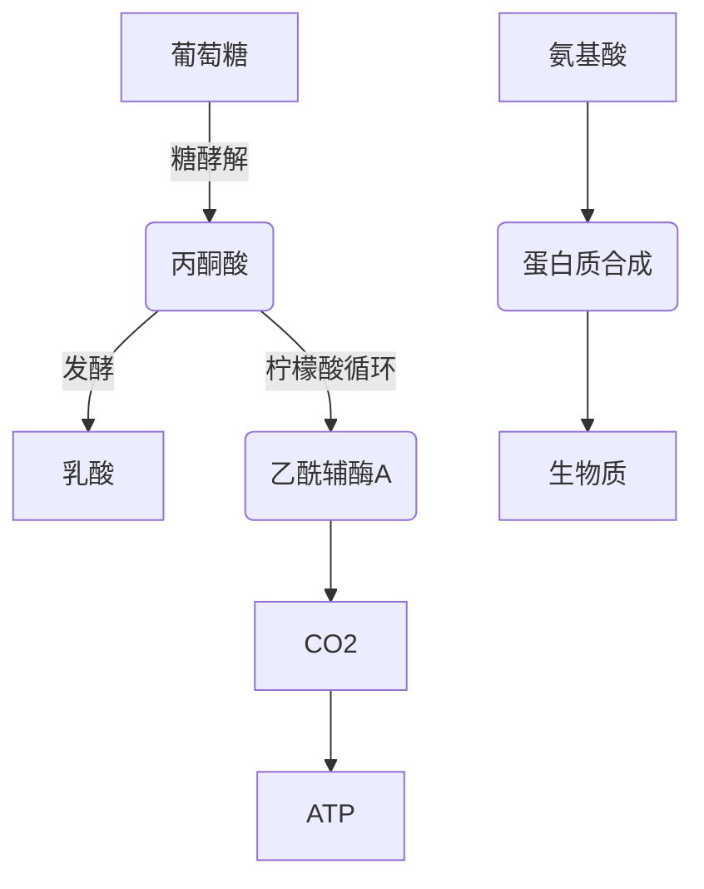

**作者：qmwneb946**

---

### 引言：微观生命的宏大叙事

在地球的每一个角落，从深海热泉到人体肠道，从肥沃的土壤到冰封的极地，数以万亿计的微生物构成了我们肉眼无法企及的微观世界。它们以惊人的多样性存在，并以我们尚未完全理解的方式相互作用，共同维系着地球生态系统的平衡，影响着我们的健康、环境乃至全球生物地球化学循环。这些微生物并非孤立的个体，而是协同运作的“群落”，它们通过复杂的物质交换和能量转化网络紧密连接，共同形成了一个动态的、充满活力的生物系统。

要理解这些微生物群落如何运作，我们必须深入到它们最核心的生化活动——代谢。每一个微生物细胞都是一个微型化工厂，通过一系列酶催化的化学反应，将营养物质转化为能量和生命所需的各种分子。当多个微生物物种共存于一个环境时，它们的个体代谢途径会交织融合，形成一个超越物种界限的、高度复杂的“微生物群落代谢网络”（Community Metabolic Network, CMN）。这个网络不仅仅是单个物种代谢途径的简单叠加，更是物种间通过代谢产物和底物进行“对话”和“协作”的平台。

理解和解析微生物群落的代谢网络，是当前生物学、生物工程和医学领域最前沿也最具挑战性的任务之一。它不仅能帮助我们揭示自然界中微生物群落的运作奥秘，例如为什么某些群落能高效降解污染物，或为什么肠道菌群失衡会导致疾病；更能为我们提供强大的工具，去理性设计和改造微生物群落，以实现可持续生物燃料生产、高效生物修复、新型药物开发乃至个性化精准医疗等宏伟目标。

本文将带领读者深入探讨微生物群落代谢网络的奥秘。我们将从单个微生物代谢网络的基础概念出发，逐步过渡到多物种群落代谢网络的构建、分析与模拟方法。我们将详细剖析当前最先进的计算生物学工具和理论框架，特别是基于约束的建模方法（Constraint-Based Reconstruction and Analysis, COBRA），以及它们如何被拓展应用于复杂的微生物群落。我们还将探讨这些研究在人类健康、环境科学和生物技术等领域的广泛应用，并展望这一领域未来的发展方向和挑战。无论您是生物信息学专家、生物工程师、微生物学家，还是对生命科学充满好奇的技术爱好者，都将从这篇深度解析中获得启发。

### 微生物群落：一个活生生的复杂生态系统

在深入探讨代谢网络之前，我们首先需要对微生物群落有一个更全面的认识。它们远不止是数量庞大的单细胞生物集合，而是一个高度组织化、动态变化的生态系统。

#### 多样性与共存：微观生命的广袤图景

微生物群落的成员包括细菌、古菌、真菌，甚至病毒。它们形态各异，生理功能千差万别，共同占据着地球上几乎所有可以想象到的生态位。
*   **细菌与古菌：** 构成群落的主体，负责主要的生物地球化学循环。例如，硝化细菌和反硝化细菌在氮循环中扮演关键角色；甲烷菌和产甲烷古菌参与碳循环。
*   **真菌：** 在分解有机物和形成共生关系（如菌根）方面发挥重要作用。
*   **病毒：** 病毒，特别是噬菌体，通过裂解宿主细胞来调节细菌群落的组成和代谢活动，是群落动态不可忽视的驱动力。

这些微生物的共存并非偶然。它们通过复杂的相互作用模式形成稳定的群落结构，包括：
*   **共生（Symbiosis）：** 两种或多种生物体之间密切的、长期性的生物关系。
    *   **互惠共生（Mutualism）：** 双方均受益。例如，地衣是藻类/蓝细菌与真菌的互惠共生体。
    *   **共生（Commensalism）：** 一方受益，另一方不受影响。
    *   **寄生（Parasitism）：** 一方受益，另一方受损。
*   **竞争（Competition）：** 不同的物种争夺有限的资源（如营养物质、空间）。
*   **捕食（Predation）：** 一种生物捕食另一种生物。
*   **拮抗（Antagonism）：** 一种生物通过产生有害物质（如抗生素）抑制另一种生物的生长。

这些相互作用的基石往往是代谢。微生物释放的代谢产物可能成为其他微生物的底物，或者成为竞争的毒素，从而塑造了群落的结构和功能。

#### 微生物群落的“超级有机体”概念

在许多情况下，微生物群落的功能超越了其单个组成物种能力的简单叠加。它们作为一个整体展现出新兴特性（emergent properties），能够完成单个物种无法完成的复杂任务。例如，在厌氧消化器中，一系列微生物物种协同工作，将复杂的有机物层层分解，最终产生甲烷。在这一过程中，一个物种的代谢废物常常是另一个物种的必需底物，形成了高效的“食物网”或“代谢接力”。

这种整体性使得科学家们将某些微生物群落视为一个“超级有机体”（superorganism）。例如，人类肠道微生物群被认为是人体的一个“虚拟器官”，参与营养吸收、免疫调节和疾病发生发展等多个生理过程。理解这种“超级有机体”层面的代谢，是解析其功能和进行有效干预的关键。

#### 环境驱动与群落适应

微生物群落的组成和功能受到环境条件的强烈影响，如营养物质的可利用性、pH值、温度、氧气含量、渗透压等。反过来，微生物群落也能通过其代谢活动改变局部环境，从而影响自身的动态。这种环境与群落之间的双向反馈机制是微生物生态学的核心。理解这种动态平衡，有助于我们预测和调控微生物群落在不同环境下的行为。

因此，研究微生物群落的代谢网络，不仅仅是分析一系列生化反应，更是理解一个活生生的、高度复杂的、动态变化的生态系统如何通过代谢进行协同、竞争和适应的过程。

### 代谢网络基础：细胞的生化蓝图

在深入微生物群落的复杂性之前，我们首先需要理解单个微生物细胞内部的代谢网络是如何构建和分析的。这是理解群落代谢网络的基石。

#### 什么是代谢网络？

从本质上讲，代谢网络是细胞内所有已知生化反应及其相关代谢物的一个抽象表示。
*   **节点（Nodes）：** 代表代谢物（Metabolites），例如葡萄糖、ATP、氨基酸等。
*   **边（Edges）：** 代表生化反应（Reactions），这些反应将一种或多种代谢物转化为其他代谢物。每条边通常由特定的酶催化。

**图1：简化的代谢网络示意图**

在更复杂的表示中，代谢网络还包含：
*   **酶（Enzymes）：** 催化特定反应的蛋白质。
*   **基因（Genes）：** 编码这些酶的DNA序列。
*   **反应方向（Reaction Directionality）：** 许多反应是可逆的，但有些反应在生理条件下是单向的。
*   **区室化（Compartmentalization）：** 真核细胞中，不同的代谢途径可能发生在细胞的不同区室（如线粒体、细胞质）中。微生物通常区室化较少，但跨膜转运反应至关重要。

#### 代谢网络的重建：从基因组到生化途径

构建一个微生物的代谢网络通常是一个计算生物学和生物信息学的过程，主要基于其基因组序列和已知的生化知识。

1.  **基因组测序与注释：**
    获取微生物的完整基因组序列是第一步。接着，利用基因组注释工具（如Prokka, RAST, NCBI Prokaryotic Genome Annotation Pipeline）识别开放阅读框（ORFs），并预测其功能。这包括识别编码蛋白质的基因，特别是那些编码酶的基因。

2.  **酶功能预测与EC编号：**
    通过序列相似性比对（BLAST）和蛋白质结构预测，将预测的基因产品与已知功能数据库（如KEGG, MetaCyc, BRENDA）中的酶进行匹配。酶通常被赋予一个EC（Enzyme Commission）编号，它精确描述了酶催化的反应类型。例如，EC 2.7.1.1代表己糖激酶，催化葡萄糖磷酸化。

3.  **途径映射与数据库整合：**
    基于EC编号和已知的生化反应，将这些酶映射到代谢途径中。像KEGG（Kyoto Encyclopedia of Genes and Genomes）和MetaCyc这样的数据库是重建过程中的核心资源。它们提供了大量的参考途径和反应，帮助研究者将单个反应串联成完整的代谢网络。
    *   **KEGG:** 提供系统化的代谢途径图谱，将基因、蛋白质和化学反应联系起来。
    *   **MetaCyc:** 一个手动物理代谢和转运途径的数据库，包含每个途径的物种信息、酶信息、反应和参考文献。
    *   **BiGG Models:** 一个收集了大量经过验证和高质量重建的微生物和宿主特异性代谢模型的数据库。

4.  **模型组装与质量控制：**
    将所有识别出的反应、代谢物、酶和基因信息整合到一个统一的数学框架中，形成一个“草图”模型。这个草图需要经过严格的质量控制和“差距填充”（Gap Filling）过程。
    *   **差距填充（Gap Filling）：** 在初步重建的模型中，往往存在一些“代谢死角”或“断裂点”，即某些代谢物有生产途径但无消耗途径，或反之。这是由于基因注释不完整、酶功能预测错误或数据库知识不足造成的。差距填充的目标是识别这些断裂点，并通过预测缺失的反应或调整现有反应的连接来修复它们，使其成为一个在生理上可行的网络，通常以生物质产率为目标。这通常涉及最小化添加反应的数量或最大化生长。

经过这些步骤，就可以得到一个基因组规模的代谢模型（Genome-Scale Metabolic Model, GEM），它是一个包含了数千个反应和代谢物的复杂网络。

#### 基于约束的重建与分析（COBRA）：数学建模的力量

代谢网络一旦重建，就不仅仅是一个静态的图谱，它可以通过数学工具进行动态分析，预测细胞在特定条件下的代谢行为。其中最强大的工具之一是**基于约束的重建与分析（Constraint-Based Reconstruction and Analysis, COBRA）**。

COBRA方法的核心思想是：虽然细胞内部的代谢通量（flux）是复杂的，但它们必须满足一系列物理和生化约束条件。通过求解这些约束，我们可以预测在给定环境和目标函数下，细胞的最佳代谢状态。

##### 核心概念：化学计量矩阵（Stoichiometric Matrix）

任何代谢网络的数学表示都始于**化学计量矩阵** $S$。
*   $S$ 是一个 $m \times n$ 的矩阵，其中 $m$ 是代谢物的数量， $n$ 是反应的数量。
*   $S_{ij}$ 表示代谢物 $i$ 在反应 $j$ 中的化学计量系数。如果代谢物 $i$ 是反应 $j$ 的产物，则 $S_{ij} > 0$；如果是反应物，则 $S_{ij} < 0$；如果不参与反应，则 $S_{ij} = 0$。

例如，对于反应 $A + 2B \rightleftharpoons C$，如果 A, B, C 的索引分别为 1, 2, 3，该反应的索引为 $j$，则 $S_{1j} = -1$, $S_{2j} = -2$, $S_{3j} = 1$。

##### 通量平衡分析（Flux Balance Analysis, FBA）

FBA是COBRA框架中最常用和最核心的方法。它的基本假设是：在稳态（steady state）下，细胞内所有代谢物的净生产速率为零，即代谢物不会在细胞内积累或耗尽。

**数学表述：**
$$ S \cdot v = 0 $$
其中 $v$ 是一个 $n \times 1$ 的向量，表示每个反应的通量（速率）。 $v_j$ 代表反应 $j$ 的通量。

除了稳态假设，FBA还考虑了：
*   **通量上下限（Flux Bounds）：** 每个反应的通量 $v_j$ 都受到物理和生理限制。例如，非可逆反应的通量不能为负；某些营养物质的摄取速率是有限的。
    $$ v_{j,min} \le v_j \le v_{j,max} $$
    其中 $v_{j,min}$ 和 $v_{j,max}$ 是反应 $j$ 的最小和最大通量。对于不可逆反应，$v_{j,min}$ 通常设为 $0$。

*   **目标函数（Objective Function）：** FBA通过优化一个预定义的目标函数来寻找一个最优的通量分布。在微生物研究中，这个目标函数通常是生物量（biomass）生产率，即模拟细胞生长的速率。生物量反应是一个“伪反应”，它消耗细胞生长所需的各种前体分子（氨基酸、核苷酸、脂质等）并将其转化为“生物量”。
    $$ \max \sum_{j=1}^{n} c_j v_j $$
    或更简洁地：
    $$ \max \mathbf{c}^T \mathbf{v} $$
    其中 $\mathbf{c}$ 是一个目标系数向量， $c_j$ 如果是目标反应则为1，否则为0。

将这些组合起来，FBA问题可以表述为一个**线性规划（Linear Programming, LP）**问题：

$$ \begin{aligned} &\text{最大化} & \mathbf{c}^T \mathbf{v} \\ &\text{满足} & S \cdot \mathbf{v} &= \mathbf{0} \\ && \mathbf{v}_{min} &\le \mathbf{v} \le \mathbf{v}_{max} \end{aligned} $$

这个线性规划问题可以通过标准的优化算法（如单纯形法、内点法）高效求解，得到一个在给定条件下最大化生物量生产的通量分布。

**FBA的变体与扩展：**
*   **pFBA (Parsimonious FBA):** 寻找在实现最优生长率的同时，总代谢通量最小的解决方案，更接近细胞试图最小化资源消耗的实际情况。
*   **MOMA (Minimization of Metabolic Adjustment):** 当细胞从一个稳态转移到另一个稳态时，假设其代谢通量会尽量接近原始通量分布，通常用于模拟基因敲除或环境变化后的细胞响应。
*   **ROOM (Regulatory On/Off Minimization):** 关注基因表达的开关状态，试图预测在何种转录调控下，细胞能够达到特定目标。
*   **Flux Variability Analysis (FVA):** 识别在给定目标函数值下，每个反应通量可能变化的范围，而非单一的最优解。
*   **Gene Deletion Studies:** 模拟敲除单个基因或多个基因对细胞生长的影响，用于识别必需基因和潜在的药物靶点。

FBA及其扩展为我们提供了一个强大的框架，用以量化单个微生物细胞的代谢能力、预测基因敲除效应、评估不同营养环境下的生长表现，并为代谢工程提供设计依据。然而，当我们将目光投向微生物群落时，挑战随之而来。

### 微生物群落代谢网络（CMNs）：从个体到群落的跃迁

将COBRA框架应用于多个物种构成的微生物群落，是理解复杂生态系统功能的重要一步。然而，这并非简单地将多个GEM模型拼接在一起，而是需要考虑物种间的相互作用，特别是代谢产物的交换。

#### CMN重建的独特挑战

1.  **多物种基因组整合：**
    群落中包含多个物种，它们的基因组信息需要分别进行注释和代谢网络重建。如何将这些独立的GEM模型有效地整合到一个统一的群落层面模型中，是首要的挑战。

2.  **代谢物交换与共享环境：**
    群落中的物种通过共享的外部环境进行代谢物交换。一个物种的代谢废物可能是另一个物种的重要营养来源（交叉喂养），反之亦然。这种物质交换是连接不同物种代谢网络的“桥梁”，也是群落功能多样性的核心。在模型中如何准确地表示这些跨物种的代谢物交换是关键。

3.  **群落层面目标函数：**
    对于单个微生物，最大化生物量通常是一个合理的假设。但对于一个多物种群落，其整体目标是什么？是最大化总生物量？最大化某个特定物种的生物量？还是在特定环境压力下达到某种稳态平衡？定义一个合适的群落目标函数是CMN建模中的一个重要且开放的问题。这往往取决于研究的科学问题和生态背景。

4.  **计算复杂性：**
    随着物种数量的增加，模型中的反应和代谢物数量呈指数级增长，导致计算资源需求剧增。求解大型线性规划或非线性规划问题变得更具挑战性。

#### CMN建模的主要方法论

目前，主要存在几种将COBRA方法应用于CMN的策略，它们在处理物种间相互作用和群落目标函数方面各有侧重。

##### 1. 基于共享环境的方法：动态通量平衡分析（dFBA）

**思想：** 将每个物种视为一个独立的个体，通过一个共享的、动态变化的环境池进行耦合。每个物种在每个时间步长内独立进行FBA优化，然后根据其代谢活动更新环境中的代谢物浓度，进而影响下一个时间步长内所有物种的FBA输入。

**实现方式：**
*   **步进式模拟：** 模拟时间被划分为离散的步长。
*   **FBA循环：** 在每个时间步长 $t$：
    1.  根据当前环境中可用的代谢物浓度，设置每个物种的吸收通量上限。
    2.  对每个物种独立运行FBA，最大化其生物量（或其他目标）。
    3.  根据每个物种的通量解，计算环境代谢物在 $t$ 到 $t+\Delta t$ 时间内的消耗和产生。
    4.  更新环境中的代谢物浓度，并根据生物量生产率更新每个物种的细胞数量。
*   **迭代：** 重复以上步骤，直到模拟结束或达到稳态。

**数学概念：**
对于环境中的每个代谢物 $M_k$，其浓度变化率由所有物种 $i$ 对其的吸收和分泌通量决定：
$$ \frac{d[M_k]}{dt} = \sum_{i} (v_{k, \text{export}, i} - v_{k, \text{import}, i}) \cdot X_i $$
其中 $X_i$ 是物种 $i$ 的生物量（细胞数量或浓度）， $v_{k, \text{export}, i}$ 和 $v_{k, \text{import}, i}$ 分别是物种 $i$ 分泌和吸收代谢物 $M_k$ 的通量。

**优点：** 能够模拟群落的动态演化，考虑细胞数量的变化和环境反馈。每个物种可以有不同的目标函数。
**缺点：** 计算开销大，需要定义离散的时间步长，并且需要对所有可交换代谢物的扩散/稀释参数有假设。在长期的稳态分析中可能收敛较慢。

##### 2. 整合模型方法：OptCom, SteadyCom, MICOM

**思想：** 将所有物种的GEM模型合并为一个单一的、大型的群落层面模型。物种间的代谢物交换通过引入特殊的“交换反应”（exchange reactions）来表示，这些反应连接了各个物种的胞内代谢物与一个共享的“群落池”。

**a. OptCom (Optimality for Communities)**
OptCom是最早将多个GEM模型整合到单一优化框架中的方法之一。它假设群落作为一个整体，旨在最大化其总生物量或总生长速率。

**核心结构：**
$$ S_{comm} \cdot v_{comm} = 0 $$
其中 $S_{comm}$ 是合并后的化学计量矩阵， $v_{comm}$ 是合并后的通量向量。
$S_{comm}$ 由每个物种的 $S_i$ 矩阵以及连接它们的交换反应组成。每个物种都有自己的生物量反应。

**目标函数：** 通常是最大化群落总生物量。
$$ \max \sum_{i=1}^{N} \text{biomass}_i $$
其中 $N$ 是物种数量。

**优点：** 能够识别物种间潜在的代谢互补和资源利用策略，直接提供稳态下的群落通量分布。
**缺点：** 假设所有物种都以相同的目标函数进行协作，这在自然界中可能不总是成立。在目标函数有多个最优解时，可能无法捕捉到真实的生理状态。

**b. SteadyCom**
SteadyCom是OptCom的改进版本，它通过引入物种相对丰度的约束来解决群落稳态问题。它假设在长期稳态下，群落中所有物种的特异性生长速率（specific growth rate）应该相同，因为如果某个物种的生长速率高于其他物种，它最终会排挤掉其他物种，群落结构将不再稳定。

**数学表述：**
除了标准的FBA约束 $S_{comm} \cdot v_{comm} = 0$ 和通量上下限，SteadyCom增加了一个关键约束：
$$ \frac{v_{\text{biomass}, i}}{X_i} = \mu \quad \forall i \in \{1, \dots, N\} $$
其中 $v_{\text{biomass}, i}$ 是物种 $i$ 的生物量通量， $X_i$ 是物种 $i$ 的相对丰度（或生物量）， $\mu$ 是群落的共同生长速率。

**目标函数：** 通常是最大化群落的共同生长速率 $\mu$。

**优点：** 更符合生态学中的“共存”概念，能够预测稳态下的物种相对丰度，揭示物种间的竞争和合作关系。
**缺点：** 仍假设存在一个单一的群落共同目标函数。计算复杂度相对较高，需要引入非线性或通过一系列线性规划来求解。

**c. MICOM (Microbial Community metabolic modeling)**
MICOM是一个近年来开发的Python库，旨在简化大规模微生物群落模型的构建和分析。它实现了SteadyCom和dFBA等多种方法，并且特别优化了计算效率。

MICOM的关键创新在于其对群落优化问题的表述和求解策略。它支持“群体增长优化”（Community Growth Optimization），即所有物种以相同的最大化生长速率增长，同时最小化群落总通量，或最大化特定产物生产。MICOM还允许将相对丰度作为输入，进而预测特定环境下的代谢产物。

**示例代码（概念性，MICOM库的简化展示）：**
```python
# 假设已经安装了micom库
import micom
from micom import load_pickle, load_model
from micom.community import Community

# 假设每个物种的GEM模型都已准备好，存储在一个列表中
# 例如：models = [model_speciesA, model_speciesB, ...]
# 每个模型都是cobra.Model对象

# 创建一个社区模型（Community对象）
# species_models_dir 是包含所有物种GEM模型的目录
# 或直接传入一个模型列表
# community = Community(species_models_dir, rel_abundances=relative_abundances) # 需要相对丰度

# 如果没有现成的Community文件，可以通过加载多个cobra模型来构建
# 假设我们有model_s1.json, model_s2.json, ...
species_models = [load_model("model_s1.json"), load_model("model_s2.json")]
# 可以指定初始的相对丰度，例如等比例
relative_abundances = {"species_s1": 0.5, "species_s2": 0.5}

# 构建社区模型
community = Community(species_models, rel_abundances=relative_abundances)

# 设置环境条件（例如，限制葡萄糖吸收）
community.reactions.get_by_id("EX_glc__D_e").lower_bound = -10.0 # 假设葡萄糖外部交换反应

# 运行稳态优化（SteadyCom类型的求解）
# objective="community" 表示最大化所有物种的共同生长率
# cobra_model = True 表示返回一个cobra.Model对象，包含所有物种的整合模型
# fluxes = True 表示计算通量
sol = community.optimize(fluxes=True, pfba=False) # pfba=True 可以最小化总通量

if sol.status == "optimal":
    print(f"Community growth rate: {sol.members['species_s1'].growth_rate}")
    print(f"Community total biomass: {sol.community_growth") # 实际上是加权平均生长率
    
    # 查看特定物种的生长率和通量
    print(f"Species S1 growth rate: {sol.members['species_s1'].growth_rate}")
    print(f"Species S2 growth rate: {sol.members['species_s2'].growth_rate}")
    
    # 查看群落中某个代谢物的交换通量（例如，乳酸）
    # 需要知道乳酸的通用ID，例如Lactate_e (外部乳酸)
    # print(f"Community external lactate flux: {sol.fluxes.loc['EX_lac__L_e'].reaction}")
    # 注意：MICOM的输出结构可能需要具体查阅其文档
    
    # 导出结果，例如通量矩阵
    # sol.fluxes.to_csv("community_fluxes.csv")
else:
    print(f"Optimization status: {sol.status}")

# 更多功能，例如：
# 预测不同营养条件下的群落组成变化
# community.tradeoff(fraction=0.5) # 考虑合作与竞争的权衡

# 模拟基因敲除对群落的影响
# community.knockout(reactions=["Rxn_SpecificTo_Species1"])
# community.optimize()
```
**优点：** 能够有效地处理大规模的群落模型，提供多种优化策略，并支持物种间代谢物交换的详细分析。
**缺点：** 同样面临着群落目标函数定义的挑战，对初始相对丰度的依赖性。

##### 3. 基于宏基因组的代谢网络重建

**思想：** 不依赖于培养和分离单个微生物，而是直接从环境样本的宏基因组测序数据中重建群落层面的代谢网络。

**实现方式：**
1.  **宏基因组测序：** 对环境样本进行DNA提取和测序。
2.  **基因组组装与分箱（Binning）：** 将测序读段组装成基因组草图（contigs），然后将这些contigs分箱到潜在的单个微生物基因组中（Metagenome-Assembled Genomes, MAGs）。
3.  **MAGs注释与模型重建：** 对每个MAG进行基因注释，并像对待分离的基因组一样，进行代谢模型重建。
4.  **整合：** 将这些MAGs的代谢模型整合到CMN中。

**优点：** 能够捕捉到环境中未培养微生物的代谢潜力，更全面地反映真实群落的复杂性。
**缺点：** MAGs通常不完整，导致重建的代谢模型也可能存在大量缺口。基因注释的准确性是另一个挑战。缺乏培养数据也使得模型验证变得困难。

#### CMN分析的关键概念与洞察

通过上述CMN建模方法，我们可以获得对微生物群落更深层次的理解：

*   **生态位划分（Niche Partitioning）：** 不同物种如何利用不同的资源或执行不同的功能，避免直接竞争而实现共存。CMN模型可以揭示它们在代谢上的分工。
*   **交叉喂养（Cross-Feeding / Syntrophy）：** 一个物种的代谢产物成为另一个物种的底物，形成互惠或共生关系。例如，在厌氧消化中，产酸菌产生短链脂肪酸，然后由产甲烷菌利用。CMN模型能够量化这些代谢物流动。
*   **资源竞争（Resource Competition）：** 当多个物种争夺同一种有限的营养物质时，CMN模型可以预测哪个物种会占据优势，或者如何通过改变环境来促进特定物种。
*   **关键物种（Keystone Species）识别：** 某些物种虽然丰度不高，但其代谢功能对整个群落的稳定和功能至关重要。通过模拟删除或抑制这些物种，CMN模型可以识别它们。
*   **群落涌现功能（Community Emergent Functions）：** 某些复杂的代谢途径只有在多个物种协同作用下才能完成。CMN模型有助于识别这些群落层面的功能。

总而言之，CMN建模将微生物群落从一个黑箱转化为一个可以量化分析的系统。它不仅帮助我们理解“是什么”，更进一步揭示“为什么”和“如何”——为什么特定的物种能够共存，以及它们如何协同完成复杂的代谢任务。

### 计算工具与方法学：解析CMN的利器

构建、分析和模拟微生物群落代谢网络，需要一系列专业的计算生物学工具和方法。本节将深入探讨这些工具在数据处理、模型构建和模拟分析中的应用。

#### 1. 生物信息学管道：从测序数据到功能基因组

在构建代谢模型之前，必须对基因组或宏基因组数据进行高质量的处理和注释。

*   **基因组注释工具：**
    *   **Prokka:** 快速原核基因组注释工具，能够识别编码序列（CDS）、tRNA、rRNA等，并预测蛋白质功能。对于单个分离物基因组非常高效。
    *   **RAST (Rapid Annotations using Subsystems Technology):** 另一个广泛使用的细菌和古菌基因组注释系统，通过将基因组映射到“子系统”（Subsystems）来提供功能分类和代谢途径信息。
    *   **NCBI PGAP (Prokaryotic Genome Annotation Pipeline):** NCBI提供的官方原核基因组注释管道，提供高质量的基因组注释。

*   **宏基因组组装与分箱工具：**
    *   **MEGAHIT / metaSPAdes:** 用于宏基因组数据的基因组组装，将短读段拼接成更长的contigs。
    *   **MetaBAT2 / MaxBin2 / CONCOCT:** 用于宏基因组分箱，将组装好的contigs聚类到潜在的MAGs（Metagenome-Assembled Genomes）。
    *   **CheckM:** 评估MAGs的完整性和污染水平，确保后续重建的代谢模型质量。

*   **代谢途径预测与数据库：**
    *   **Pathway Tools (PathoLogic):** 用于基于基因组数据构建和浏览Pathway/Genome Databases (PGDBs)，如MetaCyc，提供详细的代谢途径信息。
    *   **KEGG Mapper:** 在KEGG数据库中可视化基因组中的代谢途径。
    *   **AntiSMASH:** 专门用于预测和注释微生物基因组中次级代谢产物合成基因簇，对于理解微生物产物发现至关重要。

#### 2. 代谢模型重建工具：自动化与半自动化流程

手动重建一个基因组规模的代谢模型是一项耗时且专业性极强的工作。因此，出现了许多自动化和半自动化的工具来加速这一过程。

*   **RAVEN (Reconstruction, Analysis and Visualization of Metabolic Networks):** 一个MATLAB/Python工具箱，支持从头构建GEMs，并通过与数据库（如KEGG、MetaCyc）的集成实现自动化注释、拓扑分析、差距填充和模型验证。RAVEN特别注重模型的质量控制和人工校正。
*   **CarveMe:** 一个基于Python的自动化GEM重建工具，利用通用的基因组注释工具（如Prokka）和代谢数据库，能够快速从基因组序列构建GEM。它强调利用系统发育信息和代谢学数据进行更准确的重建。
*   **AuReMe (Automatic Reconstruction of Metabolic Models):** 另一个Python框架，旨在自动化微生物GEMs的重建，并通过整合不同的基因注释和代谢数据库来提高重建质量。它支持多目标优化进行差距填充。

这些工具的共同特点是：
1.  **自动化注释：** 将基因组中的ORF映射到酶和反应。
2.  **网络构建：** 根据识别出的反应和代谢物构建初始网络。
3.  **差距填充：** 识别网络中的断裂点，并自动或半自动地添加必要的反应以确保网络功能完整性（例如，能够生产生物量）。这通常涉及线性规划，最小化添加的反应数量。
4.  **质量控制：** 评估模型的生理可行性，例如能否在给定营养条件下生长，能否生产某些必需代谢物。

#### 3. COBRA库：通量平衡分析的计算骨架

一旦构建了GEM模型，就需要专门的库来执行COBRA分析。

*   **COBRApy (Python):** Python语言中最流行和功能最全面的COBRA库。它提供了强大的数据结构来表示代谢模型（`cobra.Model`），并集成了多种线性规划求解器（如GLPK, CPLEX, Gurobi）来执行FBA、FVA、基因敲除模拟等。其API设计直观，易于学习和使用，广泛应用于学术界和工业界。

    **COBRApy 示例（单物种FBA）：**
    ```python
    import cobra

    # 加载一个示例模型（例如，大肠杆菌iML1515）
    # 假设模型文件为 e_coli_core.xml 或 e_coli_core.json
    try:
        model = cobra.io.read_sbml_model("e_coli_core.xml")
    except Exception as e:
        print(f"Error loading model: {e}. Trying .json...")
        model = cobra.io.load_json_model("e_coli_core.json")

    # 查看模型信息
    print(f"Model has {len(model.reactions)} reactions")
    print(f"Model has {len(model.metabolites)} metabolites")
    print(f"Model has {len(model.genes)} genes")

    # 运行FBA
    solution = model.optimize()

    # 打印目标函数值（通常是生物量生产率）
    print(f"Biomass production rate: {solution.objective_value}")

    # 查看特定反应的通量
    print(f"Glucose uptake rate: {solution.fluxes['EX_glc__D_e']}") # 外部葡萄糖吸收
    print(f"ATP maintenance reaction flux: {solution.fluxes['ATPM']}") # ATP维持通量

    # 模拟基因敲除：删除一个基因，使其编码的酶无法催化反应
    # 假设我们要敲除 eno 基因（烯醇化酶，糖酵解关键酶）
    if 'eno' in model.genes:
        with model: # 使用with语句，操作在上下文管理器中进行，不会永久修改模型
            # 找到 eno 基因编码的反应
            reactions_with_eno = [r for r in model.reactions if 'eno' in [g.id for g in r.genes]]
            for r in reactions_with_eno:
                r.lower_bound = r.upper_bound = 0 # 禁用该反应

            ko_solution = model.optimize()
            print(f"Biomass production rate after eno knockout: {ko_solution.objective_value}")
    else:
        print("Gene 'eno' not found in model.")

    # 运行通量变异性分析 (FVA)
    fva_result = cobra.flux_analysis.flux_variability_analysis(model, reaction_list=['EX_glc__D_e', 'BIOMASS_Ecoli_core_w_GAM'])
    print("\nFlux Variability Analysis for Glucose uptake and Biomass:")
    print(fva_result)
    ```

*   **CBMPy (Python):** 另一个Python库，专注于社区层面的代谢建模，提供了更高级的功能来处理多物种模型。
*   **COBRA Toolbox (MATLAB):** MATLAB环境下最成熟和广泛使用的COBRA工具箱，拥有丰富的教程和文档。

#### 4. 特定CMN模拟工具：深入群落互动

除了通用的COBRA库，还有一些专门为微生物群落代谢建模设计的工具：

*   **COMETS (Computationa Microbial Ecosystems in Time and Space):** 一个基于C++和Python的平台，用于模拟代谢物在微生物群落中的动态扩散、吸收和分泌，并结合FBA预测群落的生长和演化。COMETS特别关注空间异质性对群落动力学的影响。
*   **BacArena:** 结合了个体基础模型（Agent-Based Model, ABM）和FBA。每个细胞被视为一个独立的代理，在网格化的环境中移动、代谢、生长、分裂。环境中的代谢物会动态变化。BacArena能够模拟高度复杂的空间结构和异质性。
*   **gapseq:** 用于从基因组或宏基因组数据重建和差距填充代谢网络，特别强调生成高质量、可解释的模型，并支持对群落模型的构建。

#### 5. 多组学数据整合：验证与约束模型

仅仅依靠基因组信息构建的代谢模型是静态的，缺乏细胞的实际生理状态信息。整合多组学数据（如转录组学、蛋白质组学、代谢组学）可以：

*   **约束模型：** 通过实验测得的基因表达水平、蛋白质丰度或代谢物浓度，来限制模型中相应反应的通量上下限，使模型预测更符合实验观察。
    *   **GIMME (Gene Inactivity Moderated by Metabolism and Expression):** 一种基于基因表达数据的约束方法，根据基因表达水平调控相应反应的通量。
    *   **iFBA (Integrated FBA):** 将基因表达数据纳入FBA框架，通过优化新的目标函数来预测与表达数据一致的通量分布。
*   **验证模型：** 模型的预测结果（如生长速率、代谢产物谱）可以通过比较实验数据来验证其准确性。不一致之处可以指导模型的修正和改进。
*   **发现新机制：** 通过整合多组学数据和模型预测，可以发现新的基因-代谢关联，或揭示在特定条件下激活的代谢途径。

**整合流程示意：**
基因组数据 -> 宏基因组数据 -> MAGs -> (Metabolic Reconstruction Tools) -> GEMs for each species
实验条件 -> (Omics Technologies: Transcriptomics, Proteomics, Metabolomics) -> Omics data
GEMs + Omics data -> (COBRA Libraries / CMN Tools) -> Constrained CMN -> Predictions (growth, fluxes, metabolites) -> Experimental Validation

这些计算工具和方法为我们提供了一个强大的平台，将复杂的生物系统转化为可计算的模型。它们是当前微生物群落代谢网络研究不可或缺的利器。

### 应用与洞察：CMN研究的广阔天地

对微生物群落代谢网络的理解和模拟，已经为多个科学和工程领域带来了革命性的洞察和解决方案。从人类健康到环境保护，再到生物技术，CMN研究正展现其巨大的潜力。

#### 1. 人类肠道微生物组：揭示“第二基因组”的代谢奥秘

人类肠道微生物组是研究CMN最活跃的领域之一。它被视为人体的“第二基因组”或“虚拟器官”，对宿主的健康和疾病具有深远影响。

*   **饮食-微生物-宿主相互作用：**
    CMN模型能够量化不同饮食成分（如膳食纤维、蛋白质、脂肪）如何被肠道微生物代谢，以及这些代谢产物（如短链脂肪酸SCFA，如丁酸、丙酸、乙酸；支链氨基酸；胆汁酸代谢物等）如何影响宿主生理。
    *   **丁酸的生产：** 许多肠道厌氧菌，如梭状芽孢杆菌，能够通过丁酸途径发酵碳水化合物产生丁酸。CMN模型可以预测在不同膳食纤维摄入下，群落中丁酸生产菌的相对丰度和丁酸产量，从而揭示其对肠道健康（如肠道屏障功能、抗炎作用）的影响。
    *   **胆汁酸的转化：** 肠道菌群能够转化宿主产生的胆汁酸，产生次级胆汁酸，这与代谢疾病（如肥胖、糖尿病）和癌症密切相关。CMN模型可以追踪胆汁酸在群落中的转化路径和效率。

*   **疾病机制的代谢视角：**
    许多疾病，如炎症性肠病（IBD）、肥胖、2型糖尿病、自闭症甚至神经退行性疾病，都与肠道菌群失调（dysbiosis）有关。CMN模型可以：
    *   **识别致病代谢通路：** 预测在疾病状态下，哪些微生物代谢途径被激活或抑制，导致有害代谢产物的积累或有益产物的缺乏。例如，某些细菌在IBD中产生硫化氢，CMN模型可模拟其生产通量。
    *   **发现生物标志物：** 预测与疾病相关的特定代谢物，这些代谢物可能作为诊断或预后生物标志物。
    *   **评估潜在干预措施：** 模拟益生菌、益生元或粪便微生物移植（FMT）对群落代谢网络的影响，从而为个性化干预提供理论依据。例如，预测添加某种益生元能否促进丁酸生产菌的生长。

*   **个性化营养与菌群工程：**
    基于个体的肠道菌群组成和其CMN模型，可以为个体提供量身定制的饮食建议，以优化肠道健康或辅助疾病治疗。这代表了“精准营养”和“菌群工程”的未来方向。

#### 2. 环境微生物组：生物修复与生物能源

环境微生物群落在地球的生物地球化学循环中扮演着核心角色。CMN研究在环境科学和生物技术领域具有巨大的应用潜力。

*   **生物修复（Bioremediation）：**
    许多环境污染物（如石油泄漏、农药、重金属）难以去除。微生物群落通常具有降解这些复杂化合物的能力。
    *   **污染降解路径解析：** CMN模型可以帮助我们识别参与污染物降解的关键微生物物种和代谢途径，特别是那些需要多个物种协同完成的复杂降解过程。例如，芳香烃的厌氧降解往往是一个多步反应，涉及不同微生物类群。
    *   **优化修复策略：** 通过模拟不同环境条件（如氧气、营养物质）对群落代谢的影响，预测最佳的生物修复条件，或设计能够高效降解特定污染物的合成微生物群落。

*   **生物能源生产：**
    微生物群落能够将生物质转化为有价值的生物燃料，如沼气（甲烷）、生物氢和生物乙醇。
    *   **厌氧消化：** 在厌氧消化器中，复杂的有机物通过水解、酸化、产乙酸和产甲烷四个主要阶段被逐步降解。CMN模型可以揭示这些阶段中关键微生物类群的代谢互补关系，并预测在不同底物和操作条件下甲烷的产量和纯度。
    *   **生物燃料菌群设计：** 通过CMN模型，可以设计出高效生产生物燃料的合成菌群，例如将纤维素降解菌和产氢菌或产甲烷菌结合起来，优化整个转化过程。

*   **营养循环：**
    微生物群落在碳、氮、磷等关键元素的生物地球化学循环中不可或缺。CMN模型有助于理解这些循环中的关键代谢节点和微生物驱动者。
    *   **氮循环：** 硝化作用、反硝化作用、固氮作用等都由特定的微生物群落完成。CMN模型可以模拟在不同氧气和营养条件下，这些过程的通量变化，对农业施肥和废水处理有指导意义。

#### 3. 工业生物技术与合成生物学：理性设计微生物工厂

CMN研究为工业生物技术带来了理性设计和工程化微生物系统的能力。

*   **发酵过程优化：**
    许多工业发酵过程（如酒精、抗生素、酶的生产）涉及复杂的微生物群落。CMN模型可以：
    *   **识别代谢瓶颈：** 在现有发酵过程中，找出限制目标产物产量的代谢瓶颈。
    *   **优化培养条件：** 预测改变营养物质组成、通气条件等对目标产物产量的影响。
    *   **菌群改造：** 设计基因改造策略，或通过引入新的物种来提高目标产物的产量和纯度。

*   **新型药物发现：**
    许多抗生素、抗癌药物和其他生物活性化合物是由微生物，特别是微生物群落中的次级代谢产物合成的。CMN模型可以帮助：
    *   **识别潜在产物：** 基于宏基因组和CMN模型，预测群落中可能产生的未知生物活性分子。
    *   **优化生产：** 设计最佳的共培养条件，以诱导或提高这些化合物的产量。

*   **合成微生物群落设计：**
    这是CMN研究最前沿的应用之一。不再是简单地利用现有群落，而是从零开始，通过选择和组合具有特定代谢功能的微生物物种，构建出能够执行特定任务的“合成微生物工厂”。
    *   **模块化设计：** 将一个复杂的生化路径分解成多个模块，每个模块由一个或几个物种负责。CMN模型可以指导这些模块的连接和优化。
    *   **精准调控：** 预测不同物种的生长速率和代谢产物分泌如何相互影响，以实现整个群落的稳定和高效运作。例如，设计一个可以生产特定化学品的两物种共培养系统，其中一个物种提供底物，另一个物种将其转化为目标产物。

总之，CMN研究已经从基础理论走向了广泛应用。它正在改变我们对生命微观世界的理解方式，并为解决人类面临的重大挑战提供了前所未有的工具和视角。然而，这一领域也充满了挑战，需要多学科的交叉合作才能持续发展。

### 挑战与未来方向：解锁微观世界的更多潜力

尽管微生物群落代谢网络的研究取得了显著进展，但该领域仍面临诸多挑战，同时孕育着令人兴奋的未来发展方向。

#### 1. 数据鸿沟：从“基因组”到“功能”的跳跃

*   **不完整的基因组注释：** 尤其是在宏基因组学中，许多基因的功能仍然是“未知”或“假设”的。这意味着重建的代谢模型可能存在大量未知的反应和通路，限制了模型的预测能力。
    *   **挑战：** 缺乏实验验证的功能基因组学数据。
    *   **未来：** 发展更准确的基因功能预测算法（结合机器学习、结构生物学）；增加对新颖基因的实验表征；构建更全面的代谢反应数据库。

*   **缺乏动力学和调节信息：** COBRA方法基于稳态和优化假设，通常不包含酶的动力学参数（如Km, Vmax）或基因表达的调控机制。这限制了模型对细胞动态行为和瞬时响应的预测能力。
    *   **挑战：** 难以在高通量下获取精确的动力学参数；细胞内的复杂调控网络（转录、翻译、代谢调控）难以量化建模。
    *   **未来：** 开发集成动力学（Kinetic FBA, kFBA）和基因调控网络（Regulatory FBA, rFBA）的模型；利用机器学习从多组学数据中推断调控关系和动力学参数。

*   **代谢物通量测量的难度：** 在复杂微生物群落中原位（in situ）测量单个代谢物的生产和消耗通量极具挑战性，这使得模型预测的实验验证变得困难。
    *   **挑战：** 缺乏高通量、非侵入性的原位通量测量技术。
    *   **未来：** 发展稳定同位素标记技术（Isotope Tracing）与质谱分析相结合的方法；开发基于生物传感器的实时通量监测系统；结合先进的显微成像技术。

#### 2. 模型复杂性与计算瓶颈：规模化与效率

*   **模型规模：** 真实的微生物群落可能包含数百甚至数千个物种。将这些物种的GEMs整合在一起会导致一个极其庞大的数学模型，拥有数万甚至数十万个反应和代谢物，求解这些大规模线性规划或混合整数线性规划问题（MILP）计算成本极高。
    *   **挑战：** 计算资源限制；求解器效率。
    *   **未来：** 开发更高效的算法（如稀疏矩阵优化、分布式计算）；利用云计算资源；开发简化群落模型的方法，例如通过表征群落的代谢能力矩阵而非每个单独物种的模型。

*   **稳态假设的局限性：** 许多CMN模型假设群落处于稳态。然而，微生物群落在真实环境中往往是动态变化的，受到环境扰动、细胞死亡、基因水平转移等因素的影响。
    *   **挑战：** 模拟非稳态动力学的计算复杂性和数据需求。
    *   **未来：** 进一步发展和优化dFBA等动态建模方法；结合基于代理的模型（Agent-Based Models）来捕捉个体层面的行为和空间效应；开发新的非线性优化方法。

#### 3. 实验验证：从预测到证明

*   **模型预测的验证：** CMN模型可以做出许多预测（如物种丰度、代谢物产量、特定基因敲除的影响），但如何设计和执行精确的实验来验证这些复杂的群落层面预测，仍然是一个巨大的挑战。
    *   **挑战：** 复杂群落的培养和操作；高精度、多维度的数据采集。
    *   **未来：** 发展高度受控的体外微生物群落培养系统（如生物反应器、微流控芯片）；多组学技术（宏基因组、宏转录组、宏蛋白质组、宏代谢组）的集成应用；开发新的实验设计范式，以直接验证模型假设和预测。

#### 4. 多学科交叉：AI与机器学习的融合

*   **与人工智能/机器学习的结合：**
    AI和机器学习方法在处理复杂生物数据和识别非线性模式方面具有独特优势。
    *   **预测相互作用：** 利用图神经网络（Graph Neural Networks）或深度学习来预测物种间代谢相互作用，即使在数据不完整的情况下。
    *   **优化群落设计：** 将强化学习应用于合成微生物群落的设计，通过模拟迭代来发现最佳的物种组合和环境条件。
    *   **从组学数据中学习：** 利用ML模型从大规模多组学数据中识别与疾病或功能相关的代谢特征，为CMN建模提供新的约束或目标函数。
    *   **模型参数推断：** 利用贝叶斯推断或其他ML方法，从实验数据中学习模型中未知参数（如通量上下限、代谢产物交换系数）。

#### 5. 伦理与社会影响：负责任地应用

*   **微生物群落工程的伦理考量：** 随着我们对微生物群落理解的加深和操控能力的增强，例如通过FMT治疗疾病，或在环境中释放工程化的微生物，将引发一系列伦理和社会问题。
    *   **挑战：** 确保安全性和可控性；评估长期生态影响。
    *   **未来：** 建立严格的生物安全规范和伦理审查机制；开展公众教育，提升对微生物群落工程的理解和接受度。

### 结论：在微观与宏观之间搭建桥梁

微生物群落的代谢网络研究是一个跨学科、高速发展的领域，它将系统生物学、计算科学、微生物学和生态学紧密结合。我们已经见证了从单个基因组规模代谢模型到复杂多物种群落模型的演进，以及COBRA框架在揭示微生物间代谢互补、竞争和协同方面的强大能力。这些理论和工具不仅加深了我们对生命基本过程的理解，更在人类健康、环境可持续性以及生物能源和生物制造等领域展现出前所未有的应用前景。

尽管仍面临数据鸿沟、计算复杂性和实验验证等诸多挑战，但随着高通量测序技术、多组学方法的不断进步，以及人工智能和机器学习在生物学领域的深度融合，我们有理由相信，未来将能够更精准、更全面地绘制出微生物群落的代谢蓝图。这将使我们能够更加理性地设计和操控这些微观世界的“生物工厂”，为个性化医疗、高效生物修复、可持续农业和绿色工业等宏伟目标提供强大的驱动力。

理解微生物群落的代谢网络，不仅仅是解析一系列生化反应，更是揭示生命在不同尺度上协同、竞争和适应的宏大叙事。这是一个充满无限可能的研究领域，等待着我们去进一步探索和创新，共同解锁微观生命世界的更多潜力，为人类社会的福祉和地球生态的健康发展贡献力量。