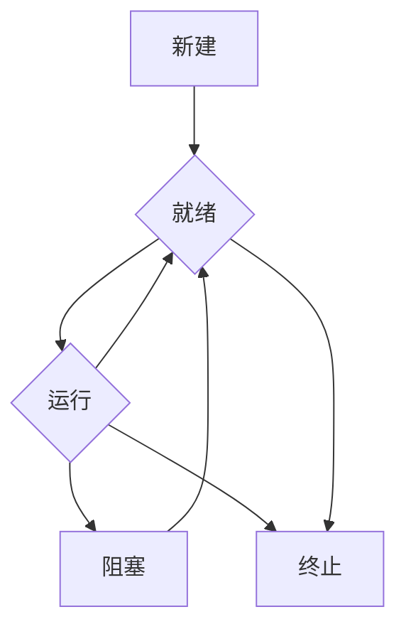

你好，我是 qmwneb946，一名技术爱好者和数学狂人。今天，我们将一起踏上一段探索之旅，深入数字世界的基石——操作系统（Operating System, OS）。

在我们日常使用的电脑、手机，乃至服务器和智能设备中，操作系统无处不在。它就像一个精密的管弦乐队指挥，协调着硬件与软件的协同工作，为我们提供了直观、高效的交互界面。然而，对于大多数用户来说，操作系统常常被视为一个“黑箱”，其内部的运作机制充满了神秘。

本篇文章旨在揭开操作系统的神秘面纱，从其诞生背景、核心功能模块，到内部复杂的调度与管理机制，再到未来的发展趋势，进行一次全面而深入的剖析。无论你是初入编程殿堂的新手，还是渴望拓宽知识边界的资深开发者，亦或是对计算机底层原理充满好奇的技术爱好者，都将从这篇文章中有所收获。

让我们一起潜入操作系统的深海，探索这片数字文明赖以运行的智慧大陆！

## 什么是操作系统？

操作系统的官方定义是：**管理计算机硬件与软件资源的程序，是计算机系统的核心与基石。** 更通俗地说，操作系统是位于硬件之上，应用程序之下的一个软件层。它扮演着“管家”的角色，负责：

1.  **资源管理：** 管理CPU、内存、硬盘、I/O设备等硬件资源，确保它们被高效、有序地利用。
2.  **提供服务：** 为应用程序提供统一的接口，屏蔽硬件的复杂性，让应用程序开发者无需关心底层细节。
3.  **用户接口：** 提供用户与计算机交互的界面，无论是图形用户界面（GUI）还是命令行界面（CLI）。

没有操作系统，我们的计算机将只是一堆冰冷的电路和硅片，无法执行任何有意义的任务。它将硬件抽象化，使得应用程序能够以高级的方式与硬件交互，从而极大地简化了软件开发。

## 操作系统的演进历程

操作系统的发展史，是一部不断提升计算机利用率和用户体验的奋斗史。

### 早期：批处理系统

在20世纪50年代到60年代早期，计算机资源极其昂贵。程序通常以穿孔卡片的形式提交，由操作员进行批量处理。一个任务完成后，才能处理下一个。这种系统被称为**批处理系统 (Batch Processing System)**。

*   **优点：** 提高了CPU的利用率，避免了人工干预的低效。
*   **缺点：** 缺乏交互性，用户等待时间长，调试困难。

### 交互式与分时系统

随着晶体管技术的发展，计算机成本降低，人们开始追求更高的交互性。20世纪60年代中期，**分时系统 (Time-Sharing System)** 出现。它允许多个用户同时通过终端与计算机交互，OS将CPU时间切分成很短的时间片，轮流分配给各个用户，由于切换速度非常快，用户感觉就像独占计算机一样。

*   **优点：** 提高了用户满意度，允许多用户同时工作，支持交互式编程。
*   **缺点：** 资源共享可能导致安全和性能问题。

### 个人计算机与网络操作系统

20世纪80年代，个人计算机（PC）的普及带动了**单用户多任务操作系统**的发展，如早期的MS-DOS（单用户单任务），以及后来的Windows、macOS和Linux（单用户多任务）。同时，随着网络技术的发展，**网络操作系统 (Network Operating System, NOS)** 允许计算机通过网络共享文件和资源。

### 分布式与实时系统

进入21世纪，**分布式系统 (Distributed System)** 越来越流行，它将计算任务分散到多台计算机上共同完成。而**实时操作系统 (Real-Time Operating System, RTOS)** 则被用于需要严格时间约束的场景，如工业控制、航空航天等。

### 移动与云时代

近年来，智能手机的普及催生了移动操作系统（Android, iOS）。云计算的兴起则推动了云操作系统、容器技术（如Docker）和虚拟化技术（如VMware, KVM）的蓬勃发展，使得资源按需分配和弹性伸缩成为可能。

每一次技术的飞跃，都伴随着操作系统功能的增强和复杂度的提升。

## 核心功能模块

操作系统是一个庞大而复杂的软件系统，但其核心功能可以归结为以下几个关键模块：进程管理、内存管理、文件系统、I/O管理，以及安全与防护。

### 进程管理

进程是操作系统中资源分配和调度的基本单位。理解进程管理是理解操作系统并发机制的关键。

#### 进程与线程

*   **进程 (Process)**：是程序的一次执行过程，是系统进行资源分配和调度的基本单位。每个进程都有独立的地址空间、文件描述符、信号量等资源。进程之间相互隔离，通信需要特定的机制（如管道、消息队列、共享内存）。
*   **线程 (Thread)**：是进程内的一个执行单元，是CPU调度的基本单位。一个进程可以包含多个线程，这些线程共享进程的资源（地址空间、文件句柄等），但每个线程有独立的程序计数器、栈和寄存器。线程的创建和切换开销远小于进程。

| 特性     | 进程                               | 线程                               |
| :------- | :--------------------------------- | :--------------------------------- |
| 资源分配 | 基本单位                           | 不分配资源，共享进程资源           |
| 调度     | 基本单位                           | 基本单位                           |
| 独立性   | 独立地址空间，相互隔离             | 共享地址空间，紧密耦合             |
| 开销     | 大，创建、销毁、切换开销大         | 小，创建、销毁、切换开销小         |
| 通信     | 复杂，需要IPC机制                  | 简单，直接读写共享数据             |
| 健壮性   | 一个进程崩溃不影响其他进程         | 一个线程崩溃可能影响整个进程       |

#### 进程状态

进程在执行过程中会经历不同的状态，常见的有：

*   **新建 (New)**：进程正在被创建。
*   **就绪 (Ready)**：进程已获得除CPU外的所有必要资源，等待分配CPU执行。
*   **运行 (Running)**：进程正在CPU上执行。
*   **阻塞/等待 (Blocked/Waiting)**：进程因等待某个事件（如I/O操作完成、获取资源、等待信号）而暂停执行，即使CPU空闲也无法运行。
*   **终止 (Terminated)**：进程执行完毕或被中止。

进程状态的转换如下图所示：



#### 进程调度

当有多个进程处于就绪状态时，操作系统需要决定哪个进程应该获得CPU。这就是进程调度的任务。调度算法的目标是提高CPU利用率、减少平均等待时间、缩短响应时间等。

常见的调度算法：

1.  **先来先服务 (First-Come, First-Served, FCFS)**：最简单的调度算法，按照进程到达就绪队列的顺序进行调度。
    *   **优点：** 简单易实现。
    *   **缺点：** 平均等待时间可能很长，对短进程不公平。
2.  **最短作业优先 (Shortest-Job-First, SJF)**：每次选择预计执行时间最短的进程执行。可以是**非抢占式**或**抢占式 (Shortest-Remaining-Time-First, SRTF)**。
    *   **优点：** 平均等待时间最短，吞吐量高。
    *   **缺点：** 难以准确预测作业运行时间，可能导致长作业饥饿。
3.  **优先级调度 (Priority Scheduling)**：为每个进程分配一个优先级，每次选择优先级最高的进程执行。
    *   **优点：** 可以满足高优先级任务的需求。
    *   **缺点：** 可能导致低优先级进程饥饿。
4.  **时间片轮转 (Round Robin, RR)**：将CPU时间划分为固定大小的时间片（quantum），每个进程轮流获得一个时间片。时间片用完或进程完成即释放CPU。
    *   **优点：** 公平，响应时间短，适用于分时系统。
    *   **缺点：** 时间片过短会导致频繁上下文切换开销大，时间片过长则退化为FCFS。
5.  **多级反馈队列 (Multi-level Feedback Queue, MLFQ)**：结合了FCFS、SJF和RR的优点。设置多个就绪队列，每个队列有不同的优先级和时间片大小。新进程进入最高优先级队列，如果时间片用完仍未完成，则降级到较低优先级队列。
    *   **优点：** 平衡了响应时间、周转时间和吞吐量，对交互式作业和批处理作业都有较好表现。
    *   **缺点：** 算法复杂，参数调整困难。

#### 进程同步与互斥

在多进程或多线程环境中，共享资源可能引发数据不一致问题。进程同步和互斥机制用于协调并发进程的执行。

*   **互斥 (Mutual Exclusion)**：确保在任何时刻，只有一个进程/线程能够访问共享资源（临界区）。
*   **同步 (Synchronization)**：协调进程/线程的执行顺序，确保它们按照预期的顺序进行操作。

**临界区 (Critical Section)**：访问共享资源的代码段。

**解决方案：**

1.  **信号量 (Semaphores)**：一个整型变量，除了初始化外，只能通过两个原子操作访问：
    *   `wait(S)` 或 `P(S)`：`S = S - 1`，如果 `S < 0`，则进程阻塞。
    *   `signal(S)` 或 `V(S)`：`S = S + 1`，如果 `S <= 0`，则唤醒一个等待进程。

    例如，使用二元信号量实现互斥：
    ```c
    semaphore mutex = 1; // 初始化为1，表示临界区可用

    void processA() {
        wait(mutex); // 进入临界区
        // 访问共享资源
        signal(mutex); // 退出临界区
    }

    void processB() {
        wait(mutex); // 进入临界区
        // 访问共享资源
        signal(mutex); // 退出临界区
    }
    ```

    使用计数信号量实现生产者-消费者问题：
    ```c
    semaphore empty = N; // 缓冲区空槽数，N为缓冲区大小
    semaphore full = 0;  // 缓冲区满槽数
    semaphore mutex = 1; // 互斥访问缓冲区

    void producer() {
        while (true) {
            // 生产一个物品 item
            wait(empty); // 消耗一个空槽
            wait(mutex); // 获取互斥锁
            // 将 item 放入缓冲区
            signal(mutex); // 释放互斥锁
            signal(full);  // 增加一个满槽
        }
    }

    void consumer() {
        while (true) {
            wait(full);  // 消耗一个满槽
            wait(mutex); // 获取互斥锁
            // 从缓冲区取出一个物品 item
            signal(mutex); // 释放互斥锁
            signal(empty); // 增加一个空槽
            // 消费 item
        }
    }
    ```

2.  **互斥锁 (Mutex Locks)**：更简单的信号量形式，只有两个状态（锁定/解锁），用于保护临界区。
3.  **管程 (Monitors)**：一种高级同步机制，它将共享数据和对共享数据操作的函数封装在一个结构中，并确保在任何时刻只有一个进程/线程可以执行管程内的函数。它简化了并发编程。

#### 死锁

当多个进程因竞争资源而陷入僵局，每个进程都在等待其他进程释放资源，导致所有进程都无法继续执行时，就发生了**死锁 (Deadlock)**。

**死锁的四个必要条件：**

1.  **互斥条件 (Mutual Exclusion)**：资源不能共享，一次只能由一个进程使用。
2.  **持有并等待条件 (Hold and Wait)**：进程已经至少持有一个资源，并正在等待获取其他进程所持有的资源。
3.  **不可抢占条件 (No Preemption)**：已分配给一个进程的资源不能被强制性地抢占，只能由持有者自愿释放。
4.  **循环等待条件 (Circular Wait)**：存在一个进程集合 $P_0, P_1, ..., P_n$，使得 $P_0$ 正在等待 $P_1$ 持有的资源，$P_1$ 正在等待 $P_2$ 持有的资源，...，$P_n$ 正在等待 $P_0$ 持有的资源。

**死锁处理策略：**

1.  **死锁预防 (Deadlock Prevention)**：破坏死锁的四个必要条件之一。
    *   **破坏互斥条件：** 不可行，因为有些资源天生就是互斥的。
    *   **破坏持有并等待：** 要求进程在开始执行前一次性申请所有所需资源，或在申请新资源时释放所有当前持有的资源。
    *   **破坏不可抢占：** 允许OS抢占已分配的资源。
    *   **破坏循环等待：** 对所有资源类型进行排序，要求进程按顺序申请资源。
2.  **死锁避免 (Deadlock Avoidance)**：动态检查资源分配状态，确保永远不会进入不安全状态。最著名的算法是**银行家算法 (Banker's Algorithm)**。
    *   银行家算法需要预先知道每个进程的最大资源需求，这在实际中很难实现。
3.  **死锁检测 (Deadlock Detection)**：允许系统进入死锁状态，然后通过算法检测死锁的发生，并采取恢复措施。
4.  **死锁恢复 (Deadlock Recovery)**：一旦检测到死锁，通过以下方法解除死锁：
    *   **终止进程：** 终止所有死锁进程，或一次终止一个直到死锁解除。
    *   **资源抢占：** 从一个或多个进程那里抢占资源，并将其分配给其他进程。

### 内存管理

内存管理是操作系统中另一个至关重要的模块，它负责有效地管理计算机的内存资源，包括主存（RAM）和辅助存储（硬盘），为程序提供一个安全、高效的存储环境。

#### 内存分层与地址空间

现代计算机系统通常采用多级存储层次结构：寄存器、高速缓存（Cache）、主存（RAM）、辅助存储（硬盘/SSD）。它们的速度和成本各不相同。内存管理的目标是利用这种层次结构，使程序感受到一个大容量、高速的存储。

*   **物理地址 (Physical Address)**：内存单元在主存中的真实地址。
*   **逻辑地址 (Logical Address/Virtual Address)**：程序在执行时使用的地址，它是一个相对地址，由CPU生成。
*   **地址翻译 (Address Translation/Mapping)**：将逻辑地址转换为物理地址的过程，由内存管理单元（MMU）完成。

#### 内存分配

内存分配的主要目标是：
1.  **实现内存的共享**：多个进程可以共享内存空间。
2.  **实现内存的保护**：防止进程相互破坏内存空间。
3.  **实现内存的动态分配**：根据进程需求动态分配和回收内存。

**内存分配策略：**

1.  **连续内存分配 (Contiguous Memory Allocation)**：将进程分配到一段连续的物理内存空间。
    *   **固定分区分配 (Fixed Partition Allocation)**：内存被划分为固定大小的分区。
    *   **可变分区分配 (Variable Partition Allocation)**：根据进程大小动态分配分区。
        *   **首次适应 (First Fit)**：从头查找，找到第一个足够大的空闲块。
        *   **最佳适应 (Best Fit)**：找到与需求最接近的最小空闲块。
        *   **最差适应 (Worst Fit)**：找到最大的空闲块。
    *   **问题：** 容易产生内存碎片（内部碎片和外部碎片），需要内存紧缩。

2.  **非连续内存分配 (Non-contiguous Memory Allocation)**：将进程的逻辑地址空间分散地映射到不连续的物理内存空间。
    *   **分页 (Paging)**：将逻辑地址空间和物理地址空间都划分为固定大小的块。逻辑地址空间的块称为**页 (Page)**，物理地址空间的块称为**页框 (Frame)**。通过**页表 (Page Table)** 将逻辑页号映射到物理页框号。
        *   **优点：** 解决了外部碎片问题，易于管理。
        *   **缺点：** 存在内部碎片，页表可能很大。
    *   **分段 (Segmentation)**：将程序按逻辑单元（如代码段、数据段、堆栈段）划分为大小不等的段。通过**段表 (Segment Table)** 映射逻辑地址到物理地址。
        *   **优点：** 更好的内存保护和共享，更符合用户编程的逻辑视图。
        *   **缺点：** 容易产生外部碎片，段大小不固定，管理复杂。
    *   **段页式 (Segmented Paging)**：结合了分段和分页的优点，先分段，再对每个段进行分页。

#### 虚拟内存

**虚拟内存 (Virtual Memory)** 是一种内存管理技术，它使得应用程序认为它拥有连续的、完整的、比实际物理内存大得多的地址空间。它通过将部分程序和数据存储在辅助存储（如硬盘）上，并在需要时才加载到物理内存中来实现。

*   **按需分页 (Demand Paging)**：只有当程序访问某个页面时，才将其从磁盘加载到物理内存中。
*   **页面置换算法 (Page Replacement Algorithms)**：当物理内存已满，但需要载入新页面时，操作系统必须选择一个现有页面从内存中移除（如果该页面被修改过，则写回磁盘）。
    *   **先进先出 (First-In, First-Out, FIFO)**：淘汰最先进入内存的页面。
    *   **最近最少使用 (Least Recently Used, LRU)**：淘汰最近一段时间内最久未使用的页面。通常通过维护访问时间戳或链表来实现，开销较大。
    *   **最近不常用 (Least Frequently Used, LFU)**：淘汰使用频率最低的页面。
    *   **最优页面置换算法 (Optimal Page Replacement, OPT)**：淘汰未来最长时间内不再被访问的页面。这是理论上的最优解，实际无法实现，但可作为性能评估基准。
    *   **CLOCK算法（二次机会算法）**：FIFO的改进版，给页面一个“第二次机会”：如果该页面被访问过，则不淘汰它，而是重置其引用位。

#### 内存保护

内存保护是确保一个进程的内存空间不被其他进程随意访问和破坏的关键。
*   **界限寄存器 (Base and Limit Registers)**：最简单的保护机制，通过一个基地址寄存器和一个界限寄存器来限制进程的访问范围。
*   **页表/段表中的权限位 (Protection Bits in Page/Segment Tables)**：在页表或段表中为每个页或段设置读、写、执行权限位。

### 文件系统

文件系统是操作系统中负责管理和组织存储在磁盘上的数据的重要组件，它为用户提供了一个逻辑视图来管理信息，而不是直接操作物理存储介质的复杂性。

#### 文件与目录

*   **文件 (File)**：是用户或应用程序创建和操作的逻辑存储单元。它是一组相关信息的有序集合，具有名称、类型、大小、创建时间、修改时间等属性。
*   **目录 (Directory)**：是一种特殊类型的文件，用于组织和管理其他文件和子目录。它包含文件或子目录的名称和指向其物理位置的信息。

#### 文件组织与存储

文件在磁盘上的存储方式直接影响存取效率。

*   **连续分配 (Contiguous Allocation)**：文件存储在磁盘上连续的块中。
    *   **优点：** 简单，顺序访问速度快。
    *   **缺点：** 外部碎片严重，文件大小难以扩展。
*   **链式分配 (Linked Allocation)**：文件的数据块可以分散在磁盘的任何位置，每个块包含指向下一个块的指针。
    *   **优点：** 无外部碎片，文件大小可动态增长。
    *   **缺点：** 随机访问慢，可靠性差（一个指针损坏可能导致整个文件丢失），指针占用额外空间。
*   **索引分配 (Indexed Allocation)**：为每个文件创建一个独立的索引块（Index Block），其中包含文件所有数据块的地址列表。
    *   **优点：** 支持直接访问和随机访问，无外部碎片。
    *   **缺点：** 索引块占用额外空间，小文件可能浪费空间。
    *   **多级索引 (Multi-level Index)**：对于大文件，索引块可能不足，可采用多级索引，类似分页机制。Unix/Linux的inode就采用了这种思想。

#### 目录结构

目录结构决定了用户如何组织和查找文件。

*   **单级目录 (Single-Level Directory)**：所有文件都在同一个目录中。
    *   **优点：** 简单。
    *   **缺点：** 命名冲突，查找困难。
*   **两级目录 (Two-Level Directory)**：每个用户有一个单独的目录，文件存储在用户目录中。
    *   **优点：** 解决了命名冲突。
    *   **缺点：** 用户间共享文件不方便。
*   **树形目录 (Tree-Structured Directory)**：最常用的目录结构，根目录下面可以有子目录和文件，子目录还可以有子目录，形成树状结构。
    *   **优点：** 清晰的层次结构，易于组织和管理。
    *   **缺点：** 路径名可能很长。
*   **非循环图目录 (Acyclic-Graph Directory)**：在树形目录的基础上允许文件或目录有多个父目录（通过硬链接或软链接），形成有向无环图。
    *   **优点：** 方便文件共享。
    *   **缺点：** 增加了复杂性，需要解决悬空指针和引用计数问题。

#### 文件操作与访问控制

操作系统提供了一系列文件操作的系统调用，如创建、删除、打开、关闭、读、写、定位等。

文件访问控制（Access Control）是确保文件安全的重要组成部分。
*   **访问控制列表 (Access Control List, ACL)**：为每个文件指定一个列表，列出哪些用户/组可以执行哪些操作（读、写、执行）。
*   **能力列表 (Capability List)**：每个用户/进程持有一组能力（类似于令牌），表示他们可以访问哪些文件及其权限。

#### 文件系统实现

文件系统的实现包括：
*   **启动控制块 (Boot Control Block)**：包含操作系统启动所需的信息。
*   **卷控制块 (Volume Control Block)**：包含文件系统分区的信息。
*   **目录结构 (Directory Structure)**：文件和子目录的组织方式。
*   **文件控制块 (File Control Block, FCB)**：包含文件的所有属性（名称、大小、权限、物理位置等）。

**Inodes（索引节点）**：在Unix/Linux文件系统中，每个文件（或目录）都有一个唯一的inode。inode包含了文件的元数据（所有者、权限、时间戳、文件类型等）以及指向其数据块的指针。文件名只是一个指向inode的指针。这种设计分离了文件内容和文件元数据，提高了文件系统的灵活性。

### I/O 管理

I/O管理是操作系统负责处理计算机与外部设备（如键盘、鼠标、显示器、打印机、硬盘、网卡等）之间数据传输的部分。

#### I/O 设备与控制器

*   **I/O 设备 (I/O Device)**：执行输入/输出操作的硬件设备。
*   **设备控制器 (Device Controller)**：连接到I/O设备和CPU之间，负责将I/O设备的信号转换为CPU可理解的格式，并管理设备的具体操作。它通常包含数据缓冲区、控制寄存器和状态寄存器。

#### I/O 操作方式

1.  **程序控制I/O (Programmed I/O, PIO)**：CPU直接轮询I/O设备的状态寄存器，等待I/O操作完成。
    *   **优点：** 简单。
    *   **缺点：** CPU大部分时间都在忙等，效率极低。
2.  **中断驱动I/O (Interrupt-Driven I/O)**：CPU发出I/O请求后，可以继续执行其他任务。当I/O操作完成时，设备控制器会向CPU发送中断信号，CPU接收到中断后暂停当前任务，转而执行中断服务程序（ISR）来处理I/O完成事件。
    *   **优点：** 提高了CPU利用率。
    *   **缺点：** 对于大量数据传输，每次中断都需要CPU参与，开销仍然较大。
3.  **直接内存访问 (Direct Memory Access, DMA)**：为了解决中断驱动I/O的CPU开销问题，DMA控制器（DMA Controller）应运而生。CPU只需向DMA控制器发送命令，告诉它数据传输的源地址、目的地址、传输长度和方向。DMA控制器则直接在内存和I/O设备之间传输数据，无需CPU干预。传输完成后，DMA控制器向CPU发送中断通知。
    *   **优点：** CPU利用率极高，适合大量数据传输。
    *   **缺点：** 实现复杂，需要专门的DMA控制器。

#### 缓冲区与高速缓存

*   **缓冲区 (Buffer)**：一块内存区域，用于暂存I/O设备与CPU之间传输的数据。
    *   **作用：** 匹配设备与CPU/内存之间的速度差异；减少I/O操作次数；进行数据转换。
*   **高速缓存 (Cache)**：通常是CPU内部或靠近CPU的小容量高速存储器，用于存储频繁访问的数据和指令，以减少对主存的访问。
    *   **作用：** 极大地提高数据访问速度。

#### 设备驱动程序

设备驱动程序 (Device Driver) 是操作系统内核中的一个软件模块，它负责与特定类型的硬件设备进行通信。它将操作系统的高级I/O请求转换为设备控制器能够理解的底层命令，并将设备的状态和数据转换回操作系统能够理解的格式。

#### 磁盘调度

磁盘是计算机系统中重要的I/O设备。由于机械臂的移动（寻道）和盘片的旋转（旋转延迟）是影响磁盘访问速度的关键因素，操作系统需要采用有效的磁盘调度算法来最小化寻道时间。

*   **先来先服务 (FCFS)**：按照请求到达的顺序处理。
    *   **优点：** 公平。
    *   **缺点：** 寻道效率低，可能产生大量不必要的寻道。
*   **最短寻道时间优先 (SSTF)**：选择使寻道时间最短的请求（即磁头当前位置最近的请求）。
    *   **优点：** 平均寻道时间最短。
    *   **缺点：** 可能导致饥饿现象（磁头附近的请求不断得到服务，远处的请求一直得不到响应）。
*   **扫描 (SCAN) / 电梯算法 (Elevator Algorithm)**：磁头在一个方向上连续扫描，处理沿途所有请求，直到到达磁盘一端，然后反向扫描。
    *   **优点：** 兼顾公平性和效率，不会饥饿。
*   **循环扫描 (C-SCAN)**：与SCAN类似，但只在一个方向上扫描并服务请求，到达一端后立即返回另一端，而不服务返回路上的请求。
    *   **优点：** 更均匀的响应时间。
*   **LOOK / C-LOOK**：SCAN和C-SCAN的优化版，磁头只扫描到最远的请求处就反向，而不是到磁盘的物理末端。

### 安全与防护

操作系统作为连接用户、应用程序和硬件的桥梁，其安全性至关重要。安全与防护机制旨在保护系统资源不被未授权访问、篡改或破坏。

#### 认证与授权

*   **认证 (Authentication)**：验证用户或进程的身份，确认“你是谁”。常见方式有：用户名/密码、指纹识别、面部识别、证书等。
*   **授权 (Authorization)**：确定已认证的用户或进程可以访问哪些资源以及拥有哪些操作权限，即“你能做什么”。

#### 访问控制列表 (ACLs) 与 能力列表 (Capability Lists)

*   **访问控制列表 (Access Control Lists, ACLs)**：以资源为中心。每个资源（如文件、目录）都有一个与之关联的列表，列出哪些用户或组可以对该资源执行哪些操作。
*   **能力列表 (Capability Lists)**：以用户/进程为中心。每个用户或进程持有一个能力列表，表示他们拥有对哪些资源进行哪些操作的权限。

#### 安全威胁与对策

操作系统面临各种安全威胁，包括但不限于：

*   **病毒 (Viruses)**：自我复制并感染其他程序的恶意代码。
*   **蠕虫 (Worms)**：通过网络传播，独立运行的恶意程序。
*   **特洛伊木马 (Trojan Horses)**：伪装成合法程序，但执行恶意任务。
*   **拒绝服务攻击 (Denial of Service, DoS)**：通过消耗系统资源或带宽，使合法用户无法访问服务。
*   **权限提升 (Privilege Escalation)**：普通用户获取系统管理员权限。
*   **缓冲区溢出 (Buffer Overflow)**：向缓冲区写入超过其容量的数据，覆盖相邻内存，可能导致程序崩溃或执行恶意代码。

**对策：**

*   **最小权限原则 (Principle of Least Privilege)**：用户和程序只被授予完成其任务所需的最小权限。
*   **用户和组管理 (User and Group Management)**：通过用户和组来管理权限。
*   **访问控制机制 (Access Control Mechanisms)**：如ACLs。
*   **防火墙 (Firewalls)**：监控和过滤网络流量。
*   **入侵检测系统 (Intrusion Detection Systems, IDS)**：监测网络或系统中的恶意活动。
*   **安全更新和补丁 (Security Updates and Patches)**：及时修复已知的安全漏洞。
*   **加密 (Encryption)**：保护数据在存储和传输过程中的机密性。
*   **代码安全实践 (Secure Coding Practices)**：避免缓冲区溢出、格式字符串漏洞等。
*   **沙箱 (Sandboxing)**：隔离不信任的应用程序，限制其对系统资源的访问。

## 常见操作系统类型

操作系统种类繁多，针对不同的应用场景和硬件环境设计。

### 桌面操作系统

*   **Windows (Microsoft Windows)**：市场份额最大的桌面操作系统，拥有庞大的软件生态系统和用户基础。
*   **macOS (Apple macOS)**：苹果公司的操作系统，以其精美的用户界面和设计体验著称，通常运行在苹果Mac系列电脑上。
*   **Linux (各种发行版，如Ubuntu, Fedora, Debian)**：开源操作系统，以其稳定性、安全性、灵活性和高度可定制性而闻名，在开发者和服务器领域广泛应用。

### 移动操作系统

*   **Android (Google Android)**：基于Linux内核的开源移动操作系统，市场份额最大，设备种类繁多。
*   **iOS (Apple iOS)**：苹果公司的移动操作系统，运行在iPhone、iPad等设备上，以其流畅的体验和强大的生态系统著称。

### 服务器操作系统

*   **Linux (如Red Hat Enterprise Linux, CentOS, Ubuntu Server)**：服务器领域的主导者，因其稳定性、安全性和高性能而受到青睐。
*   **Windows Server (Microsoft Windows Server)**：微软的服务器操作系统，与Windows桌面版有良好的兼容性，常用于企业环境。
*   **FreeBSD**：类Unix操作系统，在一些高性能和网络服务器场景中也有应用。

### 嵌入式操作系统

*   **RTOS (Real-Time Operating System)**：如FreeRTOS, VxWorks, QNX。特点是响应时间可预测、确定性高，广泛应用于工业控制、汽车电子、医疗设备等领域。
*   **裁剪版Linux/Android**：针对特定嵌入式硬件进行优化的版本。

### 其他类型

*   **分布式操作系统 (Distributed Operating System)**：将多台计算机的资源聚合起来，作为一个统一的系统进行管理，用户感知不到底层机器的分布性。
*   **云操作系统 (Cloud OS)**：旨在管理和调度大规模数据中心中的计算、存储和网络资源，提供云计算服务。例如OpenStack。

## 操作系统未来趋势

操作系统的发展从未止步，新的技术和应用场景不断涌现，驱动着操作系统的持续演进。

### 云原生与容器化

随着云计算的普及，**云原生 (Cloud-Native)** 应用和架构成为主流。操作系统需要更好地支持容器技术（如Docker和Kubernetes），提供轻量级、隔离的运行环境，以实现应用的快速部署、弹性伸缩和高效管理。微服务架构也对操作系统的进程间通信、资源调度提出了更高要求。

### 微内核与下一代架构

传统的宏内核操作系统因其庞大和复杂性，在可靠性和安全性方面面临挑战。**微内核 (Microkernel)** 架构将操作系统的核心功能（如进程通信、内存管理）保留在内核中，而将其他服务（如文件系统、设备驱动）作为用户空间进程运行。这提高了系统的模块化、可靠性和安全性，但可能增加通信开销。未来可能会有更多混合式或更模块化的内核设计。

### 人工智能与机器学习融入操作系统

AI技术正渗透到计算的各个层面。未来操作系统可能会：
*   **智能资源调度**：利用机器学习算法预测应用负载，更智能地分配CPU、内存和I/O资源。
*   **异常检测与故障预测**：通过AI分析系统日志和性能数据，提前发现潜在问题。
*   **智能安全防护**：利用机器学习识别新型恶意软件和攻击模式。
*   **人机交互优化**：通过自然语言处理和计算机视觉，提供更自然、个性化的用户体验。

### 边缘计算与物联网 (IoT) OS

随着物联网设备数量的激增，数据需要在离数据源更近的“边缘”进行处理，以减少延迟和带宽消耗。这催生了对轻量级、低功耗、高实时性的**边缘操作系统**的需求。它们需要适应资源受限的硬件环境，并提供强大的安全和连接能力。

### 新型硬件支持

量子计算、专用AI芯片（如GPU、TPU）、新型存储技术（如持久性内存）等硬件创新，将对操作系统底层设计提出新的挑战和机遇，需要操作系统进行适配和优化，以充分发挥这些硬件的性能。

## 结语

操作系统，这个我们习以为常却又深藏不露的数字世界指挥家，其内部机制之精妙，功能之强大，远超我们日常所见。从早期简陋的批处理系统，到如今智能、互联的云原生环境，操作系统的每一步发展都深刻影响着计算的形态和我们与数字世界的交互方式。

通过本文，我们深入探讨了进程管理中的并发与调度，内存管理中的虚拟化与高效利用，文件系统中的数据组织与存储，I/O管理中的设备交互，以及至关重要的系统安全与防护。这些看似抽象的概念，共同构筑了我们所依赖的数字基础设施。

理解操作系统的底层原理，不仅能帮助我们更好地使用和优化计算机系统，更能培养我们对复杂系统设计和资源管理深刻的洞察力。在未来，随着计算模式的不断演进，操作系统也将持续创新，以适应新的挑战和需求。

作为技术爱好者，保持好奇心，持续学习，我们将始终站在数字世界变革的最前沿。希望这篇文章为你揭开操作系统的神秘面纱，点燃你探索计算机科学更深层次奥秘的火花。

感谢你的阅读！我是 qmwneb946，我们下次再见。