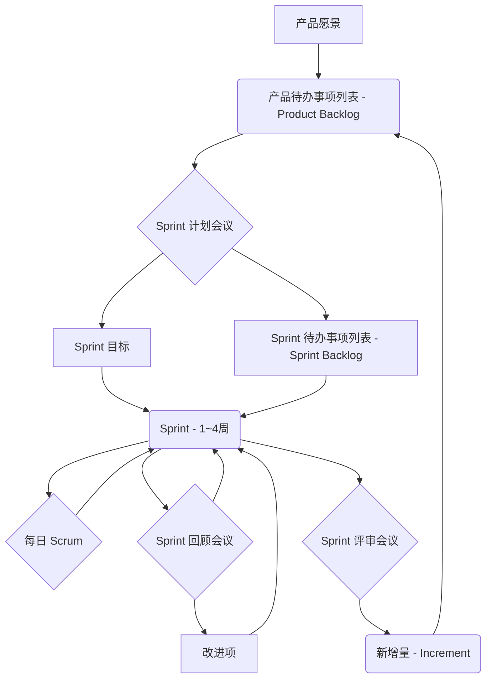

你好，各位技术同好与探索者！我是 qmwneb946，一名热爱技术、沉迷于数学之美的博主。今天，我们将一同踏上一段激动人心的旅程，深入探索软件开发领域的核心范式之一：敏捷开发（Agile Development）。

你是否曾经历过这样的项目：需求反复变更，开发周期漫长，最终交付的产品与客户期望大相径庭？或者，团队成员疲惫不堪，却仍深陷于无尽的文档和会议之中？如果是这样，那么敏捷开发或许能为你带来一线曙光。它不仅仅是一套方法论，更是一种思维模式、一种文化，旨在提升我们响应变化的能力，从而在复杂多变的现代世界中，更高效、更愉快地交付有价值的软件。

在这篇深度文章中，我们将从敏捷的哲学根基——《敏捷宣言》及其十二项原则——出发，逐步剖析各种主流敏捷方法论，如 Scrum、Kanban 和 XP。我们不仅会探讨其理论内涵，更将聚焦于实践层面，深入挖掘那些能够真正提升团队效率和产品质量的工程实践。此外，我们还将触及敏捷度量、持续改进的艺术，以及在实际推行敏捷过程中可能遇到的挑战与应对策略。

这不仅是一篇关于“是什么”的介绍，更是一篇关于“为什么”和“如何做”的实践指南。我希望通过我的分享，能够帮助你从宏观上理解敏捷的精髓，从微观上掌握具体的工具和技巧，最终将敏捷的理念融入到你的日常工作中，让软件开发变得更加高效、更具创造力。

准备好了吗？让我们一起启程！

---

## 一、敏捷宣言与核心价值观：变革的基石

要理解敏捷开发，我们必须回溯到其思想的源头——2001年，十七位软件开发领域的思想家在雪鸟峰（Snowbird）共同签署并发布的《敏捷软件开发宣言》（Manifesto for Agile Software Development）。这份宣言以简洁有力的四项核心价值观和十二项支持原则，颠覆了传统的瀑布式开发模式，为软件开发指明了新的方向。

### 敏捷的四大核心价值观

《敏捷宣言》的核心思想是：在软件开发过程中，通过对特定事项的重视，实现更高效、更具适应性的工作方式。这四项价值观并非否定后半部分的重要性，而是强调前半部分在特定情境下拥有更高的价值。

1.  **个体与互动 胜过 过程与工具 (Individuals and interactions over processes and tools)**
    *   **深层解读：** 传统的开发模式往往过度依赖僵化的流程、繁琐的文档和复杂的工具，而忽视了团队成员之间的沟通协作以及个体的创造力。敏捷宣言强调，软件开发本质上是人的活动。一个高效、自组织的团队，其成员之间面对面的交流、频繁的沟通和积极的互动，远比严格遵守某个流程或使用某种工具更为重要。当人们能够自由地沟通，相互学习，并共同解决问题时，他们能够更快地响应变化，产生更具创新性的解决方案。工具和流程是辅助手段，而非目的本身。
    *   **实践指导：** 鼓励团队成员坐在一起，进行面对面交流；使用白板、便利贴等低技术工具促进即时讨论；避免过度依赖电子邮件和大型会议；培养开放、信任的团队文化。

2.  **可以工作的软件 胜过 详尽的文档 (Working software over comprehensive documentation)**
    *   **深层解读：** 在过去，项目启动往往伴随着海量的需求规格说明书、设计文档、测试计划等等，这些文档可能在项目进行中就已经过时，且耗费了大量时间和精力。敏捷宣言并不排斥文档，而是主张“适量”和“及时”的文档。它认为，交付能够正常运行、满足用户需求的软件，才是项目成功的最终标志。客户和用户更关心产品的功能和体验，而不是厚重的文档。文档的价值在于支持软件的开发、使用和维护，而不是堆砌起来的负担。
    *   **实践指导：** 优先交付小而可用的功能增量；文档应是精简、必要的，例如用户故事、架构概述、API文档；通过自动化测试和代码本身来表达设计意图，而非仅仅依靠文字描述。

3.  **客户合作 胜过 合同谈判 (Customer collaboration over contract negotiation)**
    *   **深层解读：** 传统的合同谈判通常在项目初期就敲定所有细节，试图通过合同来规避风险和锁定需求。然而，在快速变化的商业环境中，这种方式往往导致僵局，因为需求很可能在项目中期发生变化，而合同却难以调整。敏捷宣言强调，与客户建立持续、紧密的合作关系，比严格依据合同条款进行谈判更为重要。这意味着客户应成为团队的“内部成员”，持续提供反馈，共同定义和优先级排序需求，从而确保开发的方向始终与市场和用户需求保持一致。
    *   **实践指导：** 邀请客户代表参与日常会议（如 Sprint Review）；定期向客户展示工作成果，获取即时反馈；将需求定义为用户故事，便于迭代和调整；建立信任关系，共同面对变化。

4.  **响应变化 胜过 遵循计划 (Responding to change over following a plan)**
    *   **深层解读：** 传统的项目管理模式高度依赖初始的详细计划，并试图严格遵循。然而，软件开发固有的复杂性和不确定性意味着，任何初始计划都难以完美预测未来。敏捷宣言认识到，变化是不可避免的，并且是创造价值的机遇。与其固守一个过时的计划，不如积极拥抱变化，快速适应新的情况。这并非意味着没有计划，而是计划是渐进式和适应性的，能够根据最新的信息和反馈进行调整。
    *   **实践指导：** 采用短周期迭代开发；通过频繁的检查和适应来调整计划；保持灵活的需求优先级排序；接受并欢迎来自市场和用户的反馈，即使这意味着调整方向。

这四项核心价值观构成了敏捷思维的基石。它们呼吁我们从僵化走向灵活，从孤立走向协作，从形式主义走向价值交付。理解并内化这些价值观，是成功实践敏捷的第一步。

---

## 二、敏捷原则的深刻解读：化理念为行动

《敏捷宣言》的十二项原则是其核心价值观的具体化，它们提供了将敏捷理念转化为日常实践的指导方针。这些原则并非一成不变的教条，而是旨在激发团队的创造力，提升应对复杂性的能力。

### 敏捷的十二项原则

1.  **我们最重要的目标，是通过早期和持续交付有价值的软件来满足客户。**
    *   **解读：** 这是敏捷的核心驱动力。它强调“价值”和“速度”。早期交付意味着客户能更快地看到成果，提供反馈；持续交付确保了这种反馈循环的稳定性和连续性。这远比在项目末期一次性交付一个庞大且可能不符合需求的产品更有效。
    *   **实践：** 将大功能拆分为小块，每隔几周发布可用的增量产品。

2.  **欢迎对需求提出变更，即使在开发后期。敏捷过程拥抱变化，将其作为客户竞争优势的来源。**
    *   **解读：** 变化不是敌人，而是常态。在敏捷中，我们不害怕变化，反而视其为改进产品、满足市场新需求的机遇。这种适应性是敏捷在不确定环境中取得成功的关键。
    *   **实践：** 使用用户故事，而非厚重需求文档；定期与客户沟通，评估新需求和优先级。

3.  **经常交付可以工作的软件，间隔数周或数月，越短越好。**
    *   **解读：** 强调“频繁”和“可工作”。每次交付的软件都必须是可用的，而不是半成品。这提供了持续的反馈点，降低了风险，并增加了客户对项目的信心。
    *   **实践：** 采用短周期的迭代（如 Sprint）；每次迭代结束时，确保有可演示、可部署的增量。

4.  **业务人员和开发人员必须每天在一起工作。**
    *   **解读：** 消除业务和开发之间的壁垒，促进即时、高效的沟通。面对面的交流能解决大量的误解和信息滞后问题，确保团队对需求的共同理解。
    *   **实践：** 业务代表（如产品负责人）应与开发团队紧密协作，最好在同一办公空间；定期召开同步会议。

5.  **围绕被激励的个体来构建项目。给他们所需的环境和支持，并信任他们能够完成工作。**
    *   **解读：** 强调“人本”和“赋能”。被激励的团队成员更有创造力，工作效率更高。管理者的角色是清除障碍，提供资源，并给予团队足够的自主权和信任。
    *   **实践：** 授权团队做决策；提供持续学习和成长的机会；认可团队的贡献；关注团队成员的职业发展和幸福感。

6.  **在团队内部，面对面的交流是传递信息最有效和最经济的方法。**
    *   **解读：** 再次强调面对面沟通的优势。它包含了语言、语调、肢体语言等多种信息，能更有效地传递复杂信息，解决问题。
    *   **实践：** 鼓励团队成员在日常工作中直接对话；利用视频会议代替纯文本交流；避免过度依赖电子邮件和即时消息。

7.  **可以工作的软件是衡量进展的主要度量标准。**
    *   **解读：** 拒绝“完成度百分比”、“文档页数”等虚假指标，将焦点放在实际可用的产品功能上。这是唯一能够真实反映项目进展和价值创造的度量。
    *   **实践：** 采用“完成的特性”或“已完成的用户故事点”作为主要衡量指标；定期演示可工作软件。

8.  **敏捷过程提倡可持续的开发。发起人、开发人员和用户应该能够保持恒定的步调，无限期地维持下去。**
    *   **解读：** 强调“可持续性”。软件开发是一场马拉松，而非短跑。过度加班和疲劳会导致效率下降，质量问题和人才流失。保持稳定的、可持续的节奏，才能长久地交付高质量的软件。
    *   **实践：** 避免强制加班；合理规划迭代工作量；倡导工作与生活的平衡。

9.  **对技术卓越和良好设计的持续关注，能够增强敏捷性。**
    *   **解读：** 敏捷并非放弃技术质量，相反，它要求团队不断追求卓越。高质量的代码、清晰的设计和健康的架构是快速响应变化的基础。技术债会严重阻碍敏捷性。
    *   **实践：** 实践测试驱动开发（TDD）、持续集成（CI）、重构、结对编程；定期进行技术债务清理。

10. **简洁——最大化未完成工作量的艺术——是必不可少的。**
    *   **解读：** 这里的“简洁”并非指简单，而是指“恰到好处”。只做当前必要且有价值的工作，避免过度设计和不必要的特性。减少在制品（WIP）能提高流动性。
    *   **实践：** 优先处理高价值的用户故事；采用“最小可行产品”（MVP）思想；持续精简流程和文档。

11. **最好的架构、需求和设计都来自于自组织团队。**
    *   **解读：** 强调团队的自主性和内在驱动力。当团队成员被授权并信任时，他们会表现出更高的责任感和创造力，能够更好地应对复杂问题。
    *   **实践：** 赋予团队决策权；鼓励团队成员之间相互学习、分享知识；促进团队内部的领导力发展。

12. **团队定期反思如何才能更有效地工作，然后相应地调整和改进他们的行为。**
    *   **解读：** 持续改进是敏捷的核心。通过定期反思和调整，团队能够不断优化其工作方式，适应不断变化的环境。这是敏捷的自我修正机制。
    *   **实践：** 定期举行回顾会议（Retrospective）；将改进项纳入后续迭代计划；鼓励实验和学习。

这些原则共同构建了敏捷开发的方法论框架，它们相互关联、相辅相成。理解并遵循这些原则，将帮助团队在实践敏捷的道路上走得更远、更稳。

---

## 三、敏捷方法论概述：Scrum, Kanban, XP & Lean

在敏捷的大框架下，涌现了许多具体的方法论，它们各自有其侧重点和应用场景。其中最流行、应用最广泛的当属 Scrum 和 Kanban。此外，极限编程（XP）和精益软件开发（Lean Software Development）也各有其独特贡献。

### Scrum：迭代与增量交付的框架

Scrum 是一个用于开发和维护复杂产品的框架。它并非一套完整的流程，而是一个轻量级的框架，包含一系列角色、事件和工件，旨在帮助团队以迭代、增量的方式工作。

#### Scrum 的核心要素

*   **角色 (Roles):**
    *   **产品负责人 (Product Owner, PO):** 代表客户和所有利益相关者，负责最大化产品价值。他拥有并维护产品待办事项列表 (Product Backlog)，对其内容、优先级和细节负责。PO 必须清晰地传达产品愿景，并对产品的最终成功负责。
    *   **Scrum Master (SM):** 负责确保 Scrum 被正确理解和实践。他是一个“仆人式领导”，帮助团队、PO 和组织清除障碍，促进Scrum事件，并保护开发团队免受外部干扰。Scrum Master 不对产品内容负责，而是对 Scrum 过程的有效性负责。
    *   **开发团队 (Development Team):** 由专业人员组成，负责在每个 Sprint 交付“完成”的产品增量。团队是自组织的、跨职能的，成员之间没有层级之分。团队的规模通常为3-9人，拥有完成工作所需的所有技能。

*   **事件 (Events):**
    *   **Sprint (冲刺):** Scrum 的核心，一个固定的时间盒（通常为1-4周），在此期间，团队完成一个“完成的”产品增量。每个 Sprint 都是一个迷你项目，包含所有必要的活动：计划、开发、测试和评审。
    *   **Sprint 计划会议 (Sprint Planning):** 在每个 Sprint 开始时举行，团队在此会议中决定将在当前 Sprint 中完成哪些产品待办事项 (What) 以及如何完成 (How)。会议的结果是 Sprint 目标和 Sprint 待办事项列表。
    *   **每日 Scrum (Daily Scrum / Stand-up):** 每天在相同地点、相同时间举行的15分钟站会。团队成员同步工作，计划接下来的24小时。通常回答三个问题：昨天做了什么？今天打算做什么？有什么阻碍？其目的是检查进度，识别障碍，并重新调整计划。
    *   **Sprint 评审会议 (Sprint Review):** 在 Sprint 结束时举行，团队向利益相关者展示本 Sprint 完成的“产品增量”，并收集反馈。这是一个非正式会议，旨在检验工作成果并调整产品待办事项。
    *   **Sprint 回顾会议 (Sprint Retrospective):** 在 Sprint 评审会议之后，新的 Sprint 计划会议之前举行。开发团队和 Scrum Master 齐聚一堂，反思“人、关系、过程和工具”方面，识别做得好的地方，以及可以改进的地方。目标是制定具体的改进计划，并在下一个 Sprint 中实施。

*   **工件 (Artifacts):**
    *   **产品待办事项列表 (Product Backlog):** 产品所有已知需求的排序列表。包含功能、非功能需求、缺陷、改进等，以用户故事 (User Story) 形式表达。由 PO 负责维护，并根据价值、风险等因素不断进行优化。
    *   **Sprint 待办事项列表 (Sprint Backlog):** 在 Sprint 计划会议中，从产品待办事项列表中挑选出，团队承诺在当前 Sprint 中完成的项的集合。它还包括完成这些项所需的任务分解和工作计划。它由开发团队拥有和维护。
    *   **产品增量 (Increment):** 在一个 Sprint 结束时，所有已完成的产品待办事项列表项的总和，以及之前所有 Sprint 的增量。它必须是“完成”的，意味着它达到了团队定义的“完成的定义”（Definition of Done, DoD），是可用的。

#### Scrum 流程概览



### Kanban：可视化与流动的艺术

Kanban（看板）起源于丰田生产系统，是一种通过可视化工作、限制在制品、管理流动来持续改进工作流程的方法。它不依赖于固定的迭代周期或角色，而是专注于优化工作流。

#### Kanban 的核心实践

1.  **可视化工作流 (Visualize the workflow):** 使用看板（物理或电子）来显示工作项从“待办”到“完成”的整个生命周期。每个列代表一个工作阶段。
2.  **限制在制品 (Limit Work In Progress - WIP):** 为每个工作阶段设置WIP限制。这迫使团队专注于完成当前工作，而不是同时开始太多新工作，从而减少上下文切换，提高效率。
3.  **管理流动 (Manage Flow):** 关注工作项在看板上的顺畅移动。识别并解决瓶颈，缩短前置时间（Lead Time）和循环时间（Cycle Time）。
4.  **明确策略 (Make policies explicit):** 明确定义每个工作阶段的规则和“完成”标准，确保团队成员对工作方式有共同理解。
5.  **实施反馈循环 (Implement feedback loops):** 定期回顾工作流，评估性能，并进行改进。这包括日常同步、服务交付评审、风险评审等。
6.  **协同改进，实验发展 (Improve collaboratively, evolve experimentally):** 鼓励团队成员共同寻找改进工作流的方法，并通过小范围实验来验证这些改进。

#### 看板板 (Kanban Board) 示例

| To Do | Analysis | Development | Test | Deploy | Done |
| :---- | :------- | :---------- | :--- | :----- | :--- |
| Item A| Item B   | Item C      | Item D | Item E | Item F |
| Item G| (WIP: 2) | Item H      | (WIP: 2)|        |        |
|       |          | (WIP: 3)    |        |        |        |

`WIP: 2` 表示该列最多只能有2个工作项。

#### Kanban 的流度量 (Flow Metrics)

Kanban 尤其重视通过数据来驱动改进。
*   **前置时间 (Lead Time):** 客户请求到交付（或用户可用）的总时间。
*   **循环时间 (Cycle Time):** 工作开始（进入开发阶段）到完成的总时间。
*   **吞吐量 (Throughput):** 单位时间内完成的工作项数量。
*   **累积流图 (Cumulative Flow Diagram - CFD):** 一种图形化工具，显示不同工作阶段在制品数量随时间的变化，有助于识别瓶颈和趋势。

Little's Law (利特尔法则) 是 Kanban 中一个重要的数学原理，它揭示了吞吐量、前置时间（或循环时间）和在制品之间的关系。
对于一个稳定的系统，Little's Law 可以表述为：
$$
\text{Lead Time (or Cycle Time)} = \frac{\text{Work In Progress (WIP)}}{\text{Throughput}}
$$
或者
$$
L = \frac{W}{\lambda}
$$
其中：
*   $L$ 是平均前置时间（或循环时间）。
*   $W$ 是平均在制品数量 (WIP)。
*   $\lambda$ 是平均吞吐量。

这个公式告诉我们，如果想缩短前置时间，要么减少在制品数量，要么提高吞吐量。这正是 Kanban 限制 WIP 的理论依据。

### Extreme Programming (XP)：强调工程实践

极限编程（XP）是一种以提高软件质量和响应客户需求变化能力为目标的敏捷开发方法。它特别强调一系列优秀的工程实践，被认为是敏捷工程实践的集大成者。

#### XP 的核心实践

*   **测试驱动开发 (Test-Driven Development - TDD):** 先写失败的测试，再编写足以通过测试的代码，然后重构。
*   **结对编程 (Pair Programming):** 两位程序员坐在一台电脑前，一人编写代码，另一人审查和指导。
*   **持续集成 (Continuous Integration - CI):** 团队成员频繁地将代码集成到共享主干，每次集成都通过自动化测试验证。
*   **简单设计 (Simple Design):** 永远只设计当下需要的功能，不做过度设计。
*   **重构 (Refactoring):** 持续改进代码的内部结构，不改变其外部行为。
*   **小版本发布 (Small Releases):** 频繁地发布小而有价值的版本给用户。
*   **客户现场支持 (On-site Customer):** 客户代表与开发团队紧密合作，提供即时反馈。
*   **集体代码所有权 (Collective Code Ownership):** 团队中任何成员都可以修改任何代码，促进知识共享和责任共担。

### Lean Software Development：精益思想的延伸

精益软件开发将精益生产（源于丰田）的原则应用于软件开发。它关注通过消除浪费来最大化客户价值。

#### Lean 的七大原则

1.  **消除浪费 (Eliminate Waste):** 识别并移除不增加价值的活动，如不必要的文档、未使用的代码、过度开发、任务切换、等待等。
2.  **增强学习 (Amplify Learning):** 通过短周期迭代、频繁反馈、TDD、CI/CD 等方式持续学习。
3.  **延迟决策 (Decide as late as possible):** 尽可能推迟关键决策，直到有足够的信息，从而保留灵活性。
4.  **快速交付 (Deliver as fast as possible):** 缩短交付周期，通过小批量交付加速反馈。
5.  **赋能团队 (Empower the team):** 信任并授权团队成员自主决策，给予他们责任和所有权。
6.  **内建质量 (Build Integrity In):** 从一开始就将质量融入到开发过程中，而非事后补救。
7.  **全盘考量 (See the whole):** 关注整个价值流，优化端到端流程，而非局部优化。

这些敏捷方法论各有侧重，但都遵循敏捷宣言的核心价值观和原则。在实际应用中，团队可以根据自身情况，选择最适合的方法论，甚至融合不同方法的优点，形成“混合敏捷”实践。

---

## 四、敏捷工程实践：提升代码质量与团队效率

仅仅遵循敏捷流程（如 Scrum 或 Kanban）是不足以成功的。真正的敏捷需要强大的工程实践作为支撑，以确保软件质量、可维护性，并支撑快速响应变化的能力。本节将深入探讨几个关键的敏捷工程实践。

### 测试驱动开发 (Test-Driven Development - TDD)

TDD 不仅仅是一种测试方法，更是一种设计方法。它要求开发者在编写生产代码之前，先编写失败的自动化测试。其核心循环是“红-绿-重构”。

*   **红 (Red):** 编写一个针对未实现功能的小测试，运行它并确保它失败（因为功能还没实现）。这验证了测试本身是有效的，并且你确实需要实现这个功能。
*   **绿 (Green):** 编写最少量的代码，使其刚好能通过之前失败的测试。在此阶段，不考虑代码的优雅或可维护性，只求快速通过测试。
*   **重构 (Refactor):** 在测试通过后，安全地重构代码。优化设计、消除重复、提高可读性，而无需担心破坏现有功能，因为有测试作为安全网。

**TDD 的优势：**
*   **高质量代码：** 驱动出高覆盖率的自动化测试，减少缺陷。
*   **更好的设计：** 迫使开发者从“可测试性”的角度思考代码结构，从而产生更模块化、解耦、易于维护的设计。
*   **减少调试时间：** 缺陷在早期就被发现，修复成本更低。
*   **提高开发信心：** 持续的测试通过让开发者对代码更改充满信心。

**TDD 伪代码示例 (Python):**

假设我们要实现一个简单的计算器 `add` 函数。

```python
# 1. Red 阶段：编写失败的测试
# test_calculator.py
import unittest
# 假设 calculator.py 模块还没有，或者 add 函数还没实现

from calculator import add # 这行会失败，因为 add 还没定义

class TestCalculator(unittest.TestCase):
    def test_add_two_numbers(self):
        # 断言：add(2, 3) 应该等于 5
        self.assertEqual(add(2, 3), 5)

    def test_add_zero(self):
        # 断言：add(5, 0) 应该等于 5
        self.assertEqual(add(5, 0), 5)

if __name__ == '__main__':
    unittest.main()

# 运行测试，会报错：NameError: name 'add' is not defined (或类似错误)
# 这就是 "Red"！

# 2. Green 阶段：编写最少量的代码，让测试通过
# calculator.py
def add(a, b):
    return a + b

# 再次运行 test_calculator.py
# 现在所有的测试都应该通过了。这就是 "Green"！

# 3. Refactor 阶段：重构代码（如果需要）
# 在这个简单的例子中，add 函数已经足够简洁，可能不需要重构。
# 但如果是更复杂的函数，你可能会在此阶段进行：
# - 消除重复代码
# - 改善变量命名
# - 提取辅助函数
# - 优化算法
# 每次重构后，再次运行所有测试，确保没有引入新的缺陷。
```

### 持续集成 (Continuous Integration - CI) / 持续交付 (Continuous Delivery - CD)

CI/CD 是现代软件开发流程的基石，它通过自动化减少了集成和部署的风险。

*   **持续集成 (CI):**
    *   **定义：** 团队成员频繁（每天多次）地将代码更改集成到共享主干（如 Git 的 `main` 分支）上。每次集成都会触发自动化构建和测试，以快速发现和解决集成问题。
    *   **目标：** 减少“集成地狱”——项目后期大量代码合并时出现的冲突和错误。确保代码库始终处于可工作状态。
    *   **关键实践：** 自动化构建、自动化测试、快速反馈、代码质量检查。
    *   **工具：** Jenkins, GitLab CI/CD, GitHub Actions, Travis CI, CircleCI 等。

*   **持续交付 (CD):**
    *   **定义：** 在 CI 的基础上，将软件的每次变更都准备好，可以随时发布到生产环境。这意味着构建、测试、部署流程都是自动化的，并且软件可以一键部署。
    *   **目标：** 实现软件的快速、可靠、低风险发布。
    *   **与持续部署 (Continuous Deployment) 的区别：** 持续交付是“可以”随时部署，但实际部署由人工触发；持续部署是“每次”通过自动化测试的更改都自动部署到生产环境，无需人工干预。

**CI/CD 的优势：**
*   **更快的发布周期：** 自动化流程显著缩短了从开发到部署的时间。
*   **更高的软件质量：** 频繁的测试和集成早期发现问题。
*   **降低风险：** 小批量、频繁的更改更容易管理和回滚。
*   **提高团队效率：** 减少了手动操作和等待时间。

### 结对编程 (Pair Programming)

结对编程是指两名程序员坐在一台电脑前，共同完成一个任务。一人是“驾驶员”（Driver），负责编写代码；另一人是“领航员”（Navigator），负责审查代码、思考策略、指出潜在问题。两人角色会频繁互换。

**结对编程的优势：**
*   **代码质量提升：** 实时代码审查，减少了缺陷的引入。
*   **知识共享与传播：** 团队成员之间的知识（业务逻辑、技术细节、设计模式）得到快速流通。
*   **提升团队凝聚力：** 促进沟通和协作。
*   **减少单点故障：** 避免了知识集中在某个个体身上。
*   **更快的解决问题：** 两人思考问题角度不同，通常能更快找到解决方案。
*   **提高团队韧性：** 即使有人请假，其他成员也能快速接手。

**如何有效实践结对编程：**
*   **定期轮换：** 确保每个人都能与不同的伙伴结对，并接触不同的代码区域。
*   **专注投入：** 双方都应积极参与，避免分心。
*   **明确角色：** 驾驶员和领航员分工明确，并适时切换。
*   **积极沟通：** 不断讨论思路、设计和实现。

### 重构 (Refactoring)

重构是在不改变代码外部行为的前提下，改进代码内部结构的过程。它的目的是使代码更容易理解、更易于修改、更易于扩展。

**重构的目的：**
*   **提高可读性：** 使代码逻辑更清晰，便于理解。
*   **消除冗余：** 移除重复的代码块。
*   **简化复杂性：** 将复杂的逻辑分解为更小、更简单的部分。
*   **改善设计：** 调整代码结构，使其更符合设计原则。
*   **降低技术债务：** 防止代码腐烂，保持代码库的健康。

**何时进行重构：**
*   **在添加新功能之前：** 清理相关区域的代码。
*   **在修复 bug 之后：** 考虑 bug 是否暴露了代码设计上的问题。
*   **定期进行：** 将重构作为日常开发的一部分。
*   **当代码“坏味”出现时：** 如冗余代码、过长的方法、过大的类等。

**重构的前提：** 必须有强大的自动化测试套件作为安全网，确保重构不会破坏现有功能。

### 代码评审 (Code Review)

代码评审是同行之间互相检查彼此代码的过程，旨在发现潜在的缺陷、改进设计、分享知识和确保代码规范。

**代码评审的价值：**
*   **提升代码质量：** 早期发现 bug 和潜在问题。
*   **强制代码规范：** 保持代码风格一致性。
*   **知识共享：** 团队成员相互学习，了解项目不同部分的实现。
*   **提高团队凝聚力：** 促进协作和责任感。
*   **减少技术债：** 通过反馈和改进来避免糟糕的设计和实现。

**如何有效进行代码评审：**
*   **及时：** 评审应该在代码提交后尽快进行。
*   **小批次：** 每次评审的代码量不宜过大，以免遗漏细节。
*   **焦点明确：** 评审应关注代码的正确性、可读性、性能、安全性、设计原则等。
*   **建设性反馈：** 提供具体、客观、可操作的建议。
*   **双向学习：** 评审者和被评审者都能从中学习。
*   **使用工具：** GitLab, GitHub, Bitbucket 等都提供了强大的代码评审功能。

### 领域驱动设计 (Domain-Driven Design - DDD) 与敏捷

虽然 DDD 本身不是敏捷实践，但它与敏捷理念高度契合。DDD 强调以业务领域为核心来构建软件，通过通用语言（Ubiquitous Language）确保业务专家和开发人员对领域模型有共同理解。

**DDD 与敏捷的协同作用：**
*   **聚焦业务价值：** DDD 强制开发团队深入理解业务，这与敏捷“交付有价值软件”的目标一致。
*   **迭代式开发：** DDD 的战术模式（如实体、值对象、聚合、领域服务）和战略模式（如限界上下文、上下文映射）可以与敏捷的短迭代相结合，逐步构建复杂的领域模型。
*   **响应变化：** 清晰的领域模型和限界上下文有助于更好地隔离变化，降低其影响。
*   **协作沟通：** 通用语言促进了业务与开发团队之间的无缝沟通。

敏捷工程实践是敏捷方法论得以成功的保障。它们将敏捷的“响应变化”和“交付价值”理念落实到日常的编码和开发活动中，确保了软件的长期健康和团队的持续高效。

---

## 五、敏捷度量与改进：量化价值与优化流程

“如果你无法衡量它，你就无法管理它。”在敏捷开发中，度量和持续改进是不可或缺的环节。它们帮助团队了解自身的表现，发现瓶颈，并作出明智的决策来优化流程、提高效率和产品质量。但需要注意的是，度量是为了改进，而非为了评判个人或团队，过度追求指标可能导致“指标崇拜”和负面影响。

### Scrum 度量

Scrum 通常使用以下几种度量来跟踪进度和预测能力：

*   **燃尽图 (Burndown Chart):**
    *   **定义：** 一张图表，显示在一个 Sprint 中，剩余工作量（通常以故事点或任务小时为单位）随时间的变化趋势。X轴是日期，Y轴是剩余工作量。通常会有一条理想的燃尽线作为参照。
    *   **作用：** 帮助团队和 Scrum Master 监控 Sprint 的进度。如果实际燃尽线高于理想线，可能意味着团队进展缓慢或估算不准确；如果低于理想线，则可能进展超预期。
    *   **KaTeX 概念：** 假设一个 Sprint 有 $S$ 个故事点，持续 $D$ 天。理想情况下，每天完成的故事点为 $S/D$。那么在第 $t$ 天，理想剩余工作量为 $S - t \times (S/D)$。实际燃尽线则绘制每天结束时剩余的实际工作量。

*   **燃起图 (Burnup Chart):**
    *   **定义：** 燃起图与燃尽图类似，但它显示的是**已完成工作量**随时间的变化，以及总工作量。X轴是日期，Y轴是已完成工作量和总工作量。通常有两条线：一条代表已完成工作，另一条代表项目或 Sprint 的总范围。
    *   **作用：** 更直观地展示团队完成工作的累积情况。如果总工作量线向上倾斜，表明需求增加了（范围蔓延）；如果已完成工作线趋势平缓，表明进展缓慢。
    *   **优势：** 可以清晰地显示需求变更（Scope Change），这是燃尽图无法直接反映的。

*   **速度 (Velocity):**
    *   **定义：** 一个团队在一个 Sprint 中完成的“完成的”产品待办事项列表项（通常以故事点为单位）的总和。
    *   **计算：** $Velocity = \sum_{i=1}^{n} \text{Story Points}_i$，其中 $n$ 是在一个 Sprint 中完成的故事点的数量。通常会计算过去几个 Sprint 的平均速度，来作为未来 Sprint 的预测依据。
    *   **作用：**
        *   **预测能力：** 帮助团队预测在未来 Sprint 中能够完成多少工作，从而辅助 Sprint 规划。
        *   **团队稳定性：** 稳定的速度表明团队的生产力相对稳定，流程可预测。
    *   **局限性：** 速度是一个内部度量，不应用于团队间的比较或个人绩效评估，因为它高度依赖于团队对故事点的估算方式。如果团队修改了故事点的估算标准，速度也会随之变化。它主要用于团队自我反思和规划。

### Kanban 度量

Kanban 更关注流的效率，其核心度量包括：

*   **前置时间 (Lead Time) / 循环时间 (Cycle Time):**
    *   **定义：**
        *   **前置时间：** 从客户提出需求（或需求被放入系统）到该需求被完全交付并投入使用的总时间。
        *   **循环时间：** 从团队开始处理某个工作项（进入“进行中”状态）到该工作项“完成”的总时间。
    *   **作用：** 直接衡量工作流的效率和响应速度。缩短前置时间和循环时间是 Kanban 的核心目标之一。
    *   **计算：** 通常通过系统记录每个工作项进入和退出各个状态的时间戳来计算。
    *   **KaTeX 概念与 Little's Law:** 如前所述，$L = W/\lambda$。这个公式指导我们通过减少在制品 (WIP) 或增加吞吐量来缩短前置时间。

*   **吞吐量 (Throughput):**
    *   **定义：** 单位时间内完成并交付的工作项数量。例如，每周完成的用户故事数量或解决的缺陷数量。
    *   **作用：** 衡量团队的生产力。高吞吐量意味着团队能够高效地处理工作。
    *   **计算：** 统计在特定时间段内从“完成”列移除的工作项数量。

*   **累积流图 (Cumulative Flow Diagram - CFD):**
    *   **定义：** 一种强大的可视化工具，显示不同工作阶段在制品数量随时间的变化。X轴是时间，Y轴是累积的工作项数量。图中的区域代表了不同阶段的在制品数量。
    *   **作用：**
        *   **识别瓶颈：** 如果某个阶段的区域突然变宽，表明该阶段存在瓶颈。
        *   **显示在制品数量：** 垂直距离表示某个时间点的在制品数量。
        *   **预测前置时间：** 水平距离可以估算平均前置时间。
        *   **显示吞吐量：** “完成”线的斜率表示吞吐量。
        *   **显示范围蔓延：** 如果最顶部的“总工作量”线向上倾斜，表明新增工作。

### 持续改进 (Continuous Improvement)

度量的最终目的是促进持续改进。敏捷框架通过内置的反馈循环来确保团队不断学习和适应。

*   **回顾会议 (Retrospectives):**
    *   **核心：** 这是敏捷团队进行持续改进的主要机制。在每个 Sprint 结束时（或定期），团队成员、Scrum Master 和产品负责人齐聚一堂，反思“人、过程和工具”，讨论以下问题：
        *   我们做得好的地方是什么？
        *   我们可以改进的地方是什么？
        *   我们下次可以尝试什么？
    *   **原则：**
        *   **安全环境：** 营造开放、信任的氛围，鼓励诚实反馈，避免指责。
        *   **聚焦改进：** 产出具体、可执行的改进措施，并将其纳入下个 Sprint 的计划。
        *   **迭代：** 改进本身也是一个迭代过程，需要不断尝试和调整。
    *   **PDCA 循环 (Plan-Do-Check-Act):** 回顾会议体现了戴明环 (Deming Cycle) 的精髓：
        *   **Plan (计划):** 识别问题，制定改进计划。
        *   **Do (执行):** 实施改进计划。
        *   **Check (检查):** 评估改进效果，通过度量数据验证。
        *   **Act (行动):** 固化有效的改进，或根据检查结果调整计划。

敏捷度量并非一成不变，团队应根据自身情况选择最相关的指标，并随着时间的推移调整。关键在于，这些度量是为了提供透明度，促进团队自我管理和持续学习，而不是变成压迫或比较的工具。

---

## 六、敏捷实施的挑战与应对：从理想迈向现实

敏捷开发听起来很美好，但其在现实世界中的推行并非一帆风顺。许多组织在转型过程中会遇到各种各样的挑战。理解这些挑战并提前规划应对策略，是确保敏捷成功落地的关键。

### 文化阻力与心态转变

*   **挑战：**
    *   **传统管理层思维：** 习惯于自上而下的命令与控制，难以适应敏捷的授权与自组织模式。
    *   **团队成员的舒适区：** 习惯了明确的指令和分工，不适应跨职能、自组织的压力和责任。
    *   **“敏捷旅游”：** 只学习敏捷的皮毛，未深入理解其核心价值观，导致形式主义。
    *   **害怕透明：** 敏捷强调透明度，暴露问题可能让一些人感到不安。
*   **应对：**
    *   **管理层支持与参与：** 敏捷转型必须得到高层领导的坚定支持，并亲身参与其中。他们需要理解敏捷的价值，并成为变革的倡导者。
    *   **持续教育与培训：** 针对所有层级（包括管理层和团队）进行敏捷思维和实践的培训，帮助大家理解“Why”和“How”。
    *   **从小范围试点开始：** 选择一两个团队作为试点，通过成功案例来示范敏捷的价值，逐步推广。
    *   **建立信任文化：** 营造一个允许失败、鼓励尝试、开放沟通的安全环境，让团队敢于暴露问题并寻求帮助。
    *   **持续宣传与反馈：** 定期分享敏捷转型带来的积极成果，并收集团队反馈，持续改进转型过程本身。

### 大规模敏捷 (Scaling Agile)

*   **挑战：** 当一个组织有多个相互依赖的敏捷团队时，如何协调他们的工作，确保产品和项目的整体交付？
    *   **跨团队依赖管理：** 多个团队之间的功能依赖、技术依赖如何协调？
    *   **统一愿景与规划：** 如何确保所有团队的工作都朝着共同的产品愿景前进？
    *   **资源分配与冲突解决：** 共享资源的优先级如何设定？
    *   **架构一致性：** 多个团队开发可能导致架构碎片化。
*   **应对：**
    *   **大规模敏捷框架 (SAFe, LeSS, DaD 等):**
        *   **SAFe (Scaled Agile Framework):** 这是一个结构化、全面的框架，提供了在大型组织中应用敏捷的详细指南，包括组合级、解决方案级和团队级实践。它通过“敏捷发布列车”（Agile Release Train, ART）来同步多个敏捷团队。
        *   **LeSS (Large-Scale Scrum):** 将 Scrum 应用于大规模的多个团队，强调“Scrum 中的 Scrum”，尽可能保持 Scrum 的简洁性。
        *   **DaD (Disciplined Agile Delivery):** 这是一个混合框架，结合了敏捷、精益和传统的实践，强调上下文适应性。
    *   **跨团队协调机制：**
        *   **Scrum of Scrums:** 多个 Scrum Master 之间定期同步，讨论跨团队依赖和障碍。
        *   **产品组合管理：** 统一的产品待办事项列表，高层级的发布计划。
        *   **共享组件团队：** 负责跨团队共享的公共服务或组件。
        *   **架构评审：** 定期进行跨团队的架构评审，确保一致性。

### 合同与敏捷

*   **挑战：** 传统固定价格、固定范围的合同与敏捷的“响应变化”原则相冲突。
*   **应对：**
    *   **时间与材料合同 (Time & Materials Contract):** 更适合敏捷，客户按实际投入支付，允许需求灵活调整。
    *   **基于价值的合同 (Value-based Contract):** 双方约定按交付的业务价值（里程碑或功能组）支付，鼓励双方合作最大化价值。
    *   **创新合同模式：**
        *   **目标奖励合同：** 在时间与材料基础上，增加目标达成奖励。
        *   **分阶段合同：** 先签订小范围、短周期的合同，验证可行性后，再滚动续约。
    *   **建立信任关系：** 与客户建立高度信任的合作关系，比任何合同条款都重要。通过持续交付可工作软件来建立这种信任。

### 技术债务 (Technical Debt)

*   **挑战：** 敏捷强调快速交付，可能导致团队为了速度而牺牲代码质量，积累技术债务。长期来看，技术债务会严重阻碍敏捷性。
*   **应对：**
    *   **内建质量：** 将技术卓越作为敏捷原则之一，从一开始就关注代码质量（如 TDD, CI, 重构）。
    *   **定期重构：** 将重构作为日常工作的一部分，并在每个 Sprint 中预留时间处理技术债务。
    *   **可视化技术债务：** 将技术债务作为待办事项加入产品待办事项列表，使其透明化，并定期优先级排序和处理。
    *   **持续学习与改进：** 鼓励团队学习和应用新的技术和最佳实践。

### 外部依赖与跨部门协作

*   **挑战：** 许多敏捷团队需要依赖组织内其他非敏捷部门（如运营、法律、安全、市场）或外部供应商。
*   **应对：**
    *   **建立沟通桥梁：** 指定专人（如 Scrum Master 或产品负责人）与外部团队进行协调和沟通。
    *   **服务级别协议 (SLA)：** 尽可能与外部团队达成明确的服务级别协议，以管理预期。
    *   **提前规划依赖：** 在 Sprint 规划时，尽早识别外部依赖，并提前与相关方沟通。
    *   **将外部团队纳入敏捷流程：** 如果可能，邀请外部团队的代表参与部分敏捷会议（如 Sprint 评审），增进理解和协作。
    *   **改变组织结构：** 从长远看，可能需要推动组织层面的变革，让更多相关部门也采用敏捷思维和工作方式。

敏捷转型是一个漫长而复杂的旅程，充满了挑战，但同时也是充满机遇的。成功的关键在于理解敏捷的深层原理，持续学习、适应，并以坚韧不拔的精神去应对各种困难。

---

## 七、敏捷文化的塑造与团队赋能：以人为本的艺术

敏捷不仅仅是一套方法、流程或工具，它更是一种思维方式和组织文化。成功的敏捷转型，最终取决于能否塑造出一种支持敏捷价值观的文化，并充分赋能团队。

### 透明、检查、适应 (Transparency, Inspection, Adaptation)

这三个核心支柱是所有 Scrum 过程控制的基础，也是敏捷文化的核心表现：

*   **透明 (Transparency):**
    *   **含义：** 让与工作进展和流程相关的所有方面对参与者和利益相关者都可见。无论是代码、进度、问题还是决策，都应该是公开的。
    *   **文化体现：** 开放沟通，不隐藏问题，敢于暴露真实情况。
    *   **实践：** 共享产品待办事项列表、Sprint 待办事项列表、燃尽图；每日站会上的公开同步；Sprint 评审会议上的产品演示；开放的工作空间。
*   **检查 (Inspection):**
    *   **含义：** 定期检查敏捷工件和工作进展，以发现不符合预期的地方。
    *   **文化体现：** 鼓励自我反思，不回避问题，追求持续改进。
    *   **实践：** 每日 Scrum 检查 Sprint 进度；Sprint 评审会议检查产品增量；Sprint 回顾会议检查过程和团队。
*   **适应 (Adaptation):**
    *   **含义：** 当检查发现偏差时，团队需要及时调整过程或产品，以最小化偏差。
    *   **文化体现：** 拥抱变化，灵活应变，勇于尝试新方法。
    *   **实践：** 根据每日 Scrum 调整当天计划；根据 Sprint 评审反馈调整产品待办事项；根据回顾会议的改进计划调整工作方式。

这三个支柱相互支撑，缺一不可。透明是检查的前提，检查是适应的基础。

### 信任、安全感与自我组织 (Trust, Psychological Safety, Self-Organization)

敏捷宣言强调“围绕被激励的个体来构建项目”，这离不开团队成员之间的信任、心理安全感以及由此产生的自我组织能力。

*   **信任：**
    *   **含义：** 团队成员之间相互信任彼此的能力和意图；管理层信任团队能够自主完成工作。
    *   **塑造：** 通过共同完成任务、透明化沟通、互相支持来建立。管理者需要放权并支持团队决策。
*   **心理安全感 (Psychological Safety)：**
    *   **含义：** 团队成员能够自由地表达想法、提出问题、承认错误，而无需担心受到惩罚或羞辱。
    *   **塑造：** 领导者以身作则，鼓励试错和学习；建立“事后分析”而非“事后指责”的文化；保护勇于承担风险和表达不同意见的人。在一个心理安全的团队中，人们更愿意分享信息、寻求帮助、进行建设性争论，这对于创新和持续改进至关重要。
*   **自我组织 (Self-Organization)：**
    *   **含义：** 敏捷团队拥有自主决定如何最好地完成其工作的权力。他们自己规划、分配任务、解决问题，而不是被动接受指令。
    *   **塑造：** 授权团队做决策；提供必要的资源和支持；清除障碍；领导者扮演仆人式领导的角色，而非命令与控制。自我组织不意味着无政府状态，而是在清晰的目标和边界内，团队能够发挥出最大的创造力和效率。

### 仆人式领导 (Servant Leadership)

在敏捷文化中，领导者的角色发生了根本性转变。传统的“指挥官”角色被“仆人式领导”所取代。

*   **含义：** 仆人式领导的核心在于服务团队成员，帮助他们成长、成功，并清除他们工作中的障碍，从而提升整个团队的效率和幸福感。Scrum Master 就是典型的仆人式领导。
*   **实践：**
    *   **倾听：** 认真倾听团队的需求和遇到的困难。
    *   **同理心：** 理解团队成员的感受和视角。
    *   **治愈：** 帮助团队解决冲突，修复关系。
    *   **意识：** 提升自我认知和对环境的洞察力。
    *   **说服：** 而非强制，通过沟通和引导影响团队。
    *   **概念化：** 帮助团队看到大局，理解愿景。
    *   **远见：** 引导团队看向未来，共同成长。
    *   **管家：** 像管家一样管理资源，为团队服务。
    *   **承诺人的成长：** 关注团队成员的个人和职业发展。
    *   **社区建设：** 促进团队内部和团队之间的社区感。

仆人式领导通过赋能团队，激发其内在潜力，从而构建出更具韧性、创新力和生产力的敏捷组织。

### 学习型组织

敏捷的本质是适应变化，而适应能力来源于持续学习。一个敏捷的组织必须是一个学习型组织。

*   **实践：**
    *   **回顾与反思：** 通过 Sprint 回顾、项目回顾等机制，定期从实践中学习。
    *   **知识共享：** 鼓励团队内部的知识分享会议、技术分享、结对编程、代码评审。
    *   **实验与尝试：** 允许团队进行小规模的实验，尝试新的技术、工具或流程，并从成功和失败中学习。
    *   **培训与发展：** 提供持续的学习机会，包括内部培训、外部课程、会议等。
    *   **反馈文化：** 建立多层次、多维度的反馈机制，从客户、用户、团队内部获取反馈，并将其转化为改进的动力。

塑造敏捷文化是一个渐进且持续的过程，需要组织自上而下、自下而上的共同努力。它要求我们从根本上改变对工作、对团队、对领导力的看法，真正实现“以人为本，适应变化”的敏捷精髓。

---

## 结论：敏捷之旅，永无止境

通过这次深度探索，我们从《敏捷宣言》的哲学高度，逐步深入到 Scrum、Kanban、XP 等主流方法论的具体实践，再到测试驱动开发、持续集成等核心工程实践，以及敏捷度量和文化塑造的艺术。我们看到，敏捷开发并非一套僵化的规则，而是一套灵活的原则和价值观，旨在帮助我们在充满不确定性的世界中，更高效、更愉快地交付有价值的软件。

敏捷开发的核心，在于其对“人”的重视——个体与互动、被激励的团队、客户合作。它倡导通过频繁的检查与适应，不断地学习与改进，来响应快速变化的市场需求。它不是一蹴而就的银弹，而是一个持续进化的旅程。

在你的敏捷实践之路上，你可能会遇到文化阻力、技术债务、大规模协作等诸多挑战。但请记住，敏捷精神的核心就是“检查与适应”。通过定期的回顾、透明的沟通和持续的改进，任何团队和组织都能够逐步克服这些困难，最终享受到敏捷带来的巨大收益：更高的产品质量、更快的上市时间、更强的团队凝聚力，以及更愉悦的工作体验。

作为一名技术和数学博主，我深信敏捷开发所蕴含的系统性思维和对效率、质量的追求，与科学和工程的严谨精神是相通的。它鼓励我们像科学家一样，提出假设、进行实验、收集数据、分析结果，并根据反馈调整方向。这种实证主义的方法，正是我们在复杂领域中取得成功的关键。

敏捷之旅永无止境，每一次迭代都是新的开始，每一次回顾都是成长的契机。愿我们都能在敏捷的道路上，不断精进，共同创造出更多令人惊叹的软件产品。

感谢你的阅读，期待在未来的文章中，与你继续探索技术的无限可能！

---
博主: qmwneb946