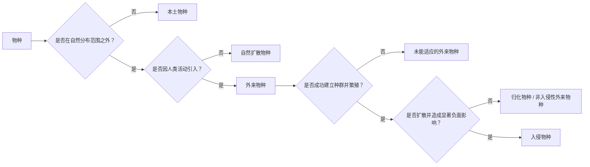

你好，各位求知若渴的技术同好与数字世界的探索者们！我是 qmwneb946，一个对代码、数学和所有深奥知识都充满好奇的博主。今天，我们不谈神经网络的激活函数，也不聊量子计算的叠加态，而是将目光投向一个看似遥远却又与我们息息相关的领域：生物入侵生态学。

你可能会问，一个技术博主为何要谈论生态学？别急，在我看来，生物入侵不仅仅是自然界的现象，它是一个关于复杂系统演化、扰动传播、以及如何用有限资源进行预测与控制的绝佳案例。从物种的迁徙路径到它们在异域环境中的扩散模式，从基因层面的适应性到宏观生态系统的崩溃，每一个环节都充满了我们可以用算法、模型和数据来解析的挑战。这不仅仅是生物学，更是应用数学、统计学、复杂网络理论乃至机器学习的天然试验场。

在这次深度探索中，我们将一同剖析生物入侵的本质、其背后的驱动机制、我们如何利用数学模型来预测和理解这些过程，以及在“算法入侵”的思维框架下，我们能为缓解这一全球性危机贡献怎样的技术洞察。准备好了吗？让我们开始这场跨越学科边界的求知之旅！

## 算法视角下的生态灾变：生物入侵究竟为何物？

在讨论技术解决方案之前，我们首先需要对问题本身有一个清晰的定义。生物入侵，简单来说，是指非本地（外来）物种，在人类活动的影响下，被引入到新的地理区域，并在该区域内成功建立种群、繁殖、扩散，进而对当地生态系统、经济或人类健康造成显著负面影响的现象。

这听起来似乎与自然界的物种迁徙无异，但核心区别在于“人类活动的影响”和“显著负面影响”。地球历史上的物种大迁徙是缓慢的、渐进的，而当代生物入侵则以惊人的速度和规模发生，成为全球生物多样性丧失的第二大驱动因素，仅次于栖息地破坏。

### 物种的“国籍”与“意图”：本土、外来与入侵物种

理解生物入侵，首先要区分几个概念：

*   **本土物种 (Native Species)**：在特定地理区域内，通过自然演化和扩散过程形成的物种。它们是当地生态系统中的固有组成部分，与环境和其它物种形成了长期稳定的相互关系。
*   **外来物种 (Alien/Exotic/Non-native Species)**：在自然分布范围之外，因人类活动而被有意或无意引入的物种。这些物种在新的栖息地可能生存下来，但并非所有外来物种都会成为入侵物种。事实上，绝大多数外来物种无法在新环境中建立稳定的种群。
*   **入侵物种 (Invasive Species)**：特指那些能够在外来栖息地成功建立种群、扩散，并对当地生态系统、经济、人类健康或社会文化造成显著负面影响的外来物种。它们是“成功”的外来物种，但这种成功往往以牺牲本土生态系统的平衡为代价。

我们可以用一个简单的流程图来表示这种关系：



这个分类并非黑白分明，许多物种可能处于中间状态。例如，一些归化物种在特定条件下可能会转变为入侵物种。这是一个动态且需要持续监测的过程。

### 生物入侵的“成本”：不仅仅是生态账本

生物入侵带来的影响是多维度、深层次的，远不止我们肉眼可见的生态破坏。

*   **生态成本**：
    *   **生物多样性丧失**：入侵物种通过竞争、捕食、寄生、病原传播、杂交等方式，直接或间接导致本土物种数量减少乃至灭绝。例如，入侵的福寿螺与本地螺类竞争，并捕食水生植物，威胁水稻生产和湿地生态。
    *   **生态系统功能改变**：入侵物种可以改变养分循环、水文条件、火灾频率、土壤结构等，从而颠覆整个生态系统的功能。例如，入侵灌木改变林下光照和温度，影响林地更新。
    *   **食物网结构扰动**：作为新的消费者、生产者或分解者，入侵物种会打破原有食物链的平衡，导致营养级间的能量流动紊乱。
*   **经济成本**：
    *   **农业与林业损失**：入侵杂草、害虫、病原体直接导致农作物和林木减产，增加病虫害防治成本。例如，亚洲长角甲虫对北美林业造成巨大损失。
    *   **渔业损失**：入侵鱼类或水生生物竞争本地鱼类的食物和栖息地，导致渔业资源枯竭。
    *   **基础设施破坏**：某些入侵物种能直接破坏基础设施，如斑马贻贝堵塞水管，薇甘菊缠绕电力线路。
    *   **旅游业与公共卫生影响**：入侵物种可能破坏风景区景观，或传播疾病，影响人类健康和旅游业收入。例如，蚊子传播的登革热与兹卡病毒。
*   **社会与文化成本**：
    *   生物入侵可能改变传统生计方式，影响原住民的文化实践，甚至加剧社会冲突。

面对如此巨大的挑战，仅仅依靠传统的生态学观察是远远不够的。我们需要引入更强大的工具，即数学和计算科学，来揭示其深层机制，预测未来趋势，并设计有效的干预策略。

## 复杂网络与动态系统：入侵过程的量化剖析

生物入侵并非一蹴而就，它通常经历几个连续的阶段，每个阶段都有其独特的生态和数学特征。将这些阶段视为一个复杂系统中的状态转移，能帮助我们更好地理解和建模。

### 入侵的生命周期：从偷渡者到“土皇帝”

经典的入侵过程通常被划分为以下几个阶段：

1.  **引入/抵达 (Introduction/Arrival)**：外来物种通过各种途径被引入到新的地理区域。
2.  **定殖/归化 (Establishment/Naturalization)**：引入的物种在新的环境中成功存活、繁殖，并建立起一个自我维持的种群。
3.  **扩散 (Spread/Dispersal)**：已定殖的物种从其最初的引入点向周边区域扩散。
4.  **影响/入侵 (Impact/Invasion)**：物种扩散并达到一定密度后，开始对本地生态系统造成显著负面影响。

这四个阶段并非完全独立，它们相互作用，且每个阶段都有其独特的“过滤器”或“障碍”。

#### 阶段一：穿越边界的概率——引入与传播途径

物种引入的途径多种多样，其中绝大多数与人类活动密切相关。

*   **航运**：远洋货轮的压舱水是水生生物最重要的传播途径之一。压舱水在全球范围内输送了数千种浮游生物、幼鱼和无脊椎动物。船体附着物也是重要载体。
*   **贸易**：观赏植物、宠物、农产品、木材等商品贸易中，常会夹带病虫害、杂草种子或其他生物。
*   **旅游**：游客携带的物品、鞋底泥土，甚至车轮附着的种子都可能成为传播途径。
*   **有意引入**：出于农业（如生物防治、饲料）、园艺（观赏植物）、渔业（水产养殖）等目的而有意引入的物种，也可能失控成为入侵物种。

在技术视角下，我们可以将物种引入视为一个全球性的**复杂网络**问题。节点可以是港口、机场、贸易中心，边（边权重）可以是货物量、客流量。利用图论和网络分析工具，我们可以识别出关键的引入路径（高风险路径），预测潜在的入侵热点。

**数学洞察：传播压 (Propagule Pressure)**

“传播压”是决定物种能否成功引入并定殖的关键因素之一。它通常定义为引入的个体数量（propagule size）和引入事件的频率（propagule number/frequency）的乘积。
直观地说，引入的个体越多，引入的次数越频繁，物种成功定殖的概率就越大。这可以用一个简化的概率模型来描述：

$P(\text{establishment}) \propto f(\text{Propagule Size}, \text{Propagule Frequency})$

其中，$P(\text{establishment})$ 是物种定殖的概率，$f$ 是一个递增函数。这与我们进行软件测试时，重复测试次数越多，发现潜在bug的概率越大的道理是类似的。高频次的低质量引入，累积起来也可能导致入侵。

#### 阶段二：新家园的适应性——定殖与归化

并非所有外来物种都能在新的环境中生存下来。它们面临着气候、土壤、水文等非生物因素的挑战，以及来自本土物种的竞争、捕食、寄生等生物因素的压力。只有那些能够适应新环境，找到资源，并成功繁殖的物种才能实现定殖。

**数学洞察：逻辑斯蒂增长模型与承载力**

一旦物种成功定殖，其种群数量通常会经历一个增长阶段。最简单的模型是经典的逻辑斯蒂增长模型 (Logistic Growth Model)：

$\frac{dN}{dt} = rN(1 - \frac{N}{K})$

其中：
*   $N$ 是种群数量
*   $t$ 是时间
*   $r$ 是内禀增长率 (intrinsic growth rate)，表示在无限制条件下的最大增长速率
*   $K$ 是环境承载力 (carrying capacity)，表示环境能够维持的最大种群数量

这个模型描述了一个S形的增长曲线，最初增长较快，随着种群数量接近承载力，$K$，增长速率逐渐减缓。对于入侵物种而言，$r$ 值通常较高，且在新环境中可能因为“敌害释放效应”（详见下文）而使$K$值远高于其原产地。

这个模型可以扩展到考虑空间异质性和物种相互作用。例如，竞争模型会引入其他物种对承载力的影响。

#### 阶段三：空间蔓延的算法——扩散与传播

一旦定殖成功，入侵物种就会开始向外扩散，占据更大的地理范围。扩散可以是主动的（如动物迁徙、植物种子传播）或被动的（如风、水流、人类再次携带）。理解扩散模式对于预测入侵范围和规划控制策略至关重要。

**数学洞察：反应-扩散模型**

对于连续空间上的扩散，经典的**反应-扩散方程 (Reaction-Diffusion Equation)** 是一个强大的工具。它结合了种群增长（“反应”项）和空间扩散（“扩散”项）两个过程：

$\frac{\partial N}{\partial t} = D \nabla^2 N + f(N)$

其中：
*   $N$ 是在位置 $(x, y)$ 和时间 $t$ 时的种群密度。
*   $D$ 是扩散系数 (diffusion coefficient)，表示物种扩散的速度。$D \nabla^2 N$ 代表扩散项，$\nabla^2$ 是拉普拉斯算子，描述了种群密度在空间上的平滑变化。
*   $f(N)$ 是反应项，通常是逻辑斯蒂增长函数或其他描述种群动态的函数。

当 $f(N) = rN(1 - N/K)$ 时，这个方程被称为Fisher-KPP方程。它能预测入侵前沿的传播速度：

$v = 2\sqrt{rD}$

其中 $v$ 是波前传播速度。这个简单的公式告诉我们，入侵速度与物种的内禀增长率和扩散能力呈正相关。

**示例代码：一个简单的离散化反应-扩散模拟（Python）**

我们可以用一个简单的元胞自动机 (Cellular Automaton) 来模拟离散空间上的扩散过程，这可以看作是反应-扩散模型的简化版。每个元胞代表一个区域，其状态（如是否存在入侵物种、入侵物种密度）随时间步长更新。

```python
import numpy as np
import matplotlib.pyplot as plt
import matplotlib.colors as mcolors

# Simulation parameters
GRID_SIZE = 100 # Size of the 2D grid
MAX_ITERATIONS = 200 # Number of time steps
GROWTH_RATE = 0.1 # r in logistic growth (simplified)
DIFFUSION_RATE = 0.2 # Probability of spread to neighbor

# Initialize the grid: 0 = empty, 1 = invaded
grid = np.zeros((GRID_SIZE, GRID_SIZE))

# Introduce a small initial invasion point (propagule pressure)
initial_x, initial_y = GRID_SIZE // 2, GRID_SIZE // 2
grid[initial_x, initial_y] = 1.0 # Start with full invasion

# Create a custom colormap for visualization
cmap = mcolors.LinearSegmentedColormap.from_list("invasion_cmap", ["white", "lightgreen", "darkgreen", "darkred"], N=256)

def simulate_invasion(grid, growth_rate, diffusion_rate):
    new_grid = grid.copy()
    for i in range(GRID_SIZE):
        for j in range(GRID_SIZE):
            if grid[i, j] > 0: # If cell is invaded
                # Simulate growth (simplified: max out at 1.0)
                new_grid[i, j] = min(1.0, grid[i, j] + growth_rate * grid[i, j] * (1 - grid[i, j]))

                # Simulate diffusion to neighbors
                for dx in [-1, 0, 1]:
                    for dy in [-1, 0, 1]:
                        if dx == 0 and dy == 0:
                            continue
                        nx, ny = i + dx, j + dy
                        if 0 <= nx < GRID_SIZE and 0 <= ny < GRID_SIZE:
                            # Simple diffusion: a small probability to invade neighbor
                            # This could be refined with actual density transfer
                            if np.random.rand() < diffusion_rate * grid[i, j]: # Probability scales with density
                                new_grid[nx, ny] = min(1.0, max(new_grid[nx, ny], grid[i, j])) # Transfer density or simply mark as invaded
            # A more sophisticated model would involve a true 'diffusive' transfer
            # For simplicity, we just 'grow' and 'spread'
    return new_grid

# Visualization
fig, axes = plt.subplots(1, 3, figsize=(18, 6))

# Plot initial state
axes[0].imshow(grid, cmap=cmap, vmin=0, vmax=1)
axes[0].set_title(f'Initial State (t=0)')
axes[0].axis('off')

# Run simulation
for t in range(MAX_ITERATIONS):
    grid = simulate_invasion(grid, GROWTH_RATE, DIFFUSION_RATE)
    if t == MAX_ITERATIONS // 2 - 1: # Midpoint
        axes[1].imshow(grid, cmap=cmap, vmin=0, vmax=1)
        axes[1].set_title(f'Mid-Simulation (t={t+1})')
        axes[1].axis('off')
    if t == MAX_ITERATIONS - 1: # End
        axes[2].imshow(grid, cmap=cmap, vmin=0, vmax=1)
        axes[2].set_title(f'Final State (t={t+1})')
        axes[2].axis('off')

plt.suptitle('Simple Invasion Spread Simulation (Cellular Automaton)', fontsize=16)
plt.tight_layout(rect=[0, 0.03, 1, 0.95])
plt.show()

# You can experiment with different GROWTH_RATE and DIFFUSION_RATE values
# Higher diffusion rate leads to faster spread. Higher growth rate leads to denser invasion.
```
这个简化的元胞自动机模型，通过模拟每个“单元格”的生长和扩散，直观地展示了入侵物种如何在空间上蔓延。这正是我们用计算工具理解复杂动态系统的基本思路。

#### 阶段四：生态冲击的涟漪效应——影响与反馈

当入侵物种的密度达到临界值，其对本土生态系统的负面影响就会显现出来。这不仅是物种层面的竞争，更是整个生态系统功能的改变。例如，入侵植物可能改变火灾频率，从而影响本土植物群落结构。

**数学洞察：阈值与临界点**

在许多生态系统中，存在对扰动的**阈值 (Threshold)**。一旦某个入侵物种的数量或其影响强度超过这个阈值，生态系统可能会发生不可逆转的**相变 (Phase Transition)**，从一个稳定状态转换到另一个，通常是退化的状态。这可以类比于工程学中的系统故障点或材料的屈服点。识别这些阈值对于早期干预和防止灾难性后果至关重要。

## 逆向工程入侵：为何它们如此成功？

并非所有外来物种都能成为入侵者。那么，是哪些特质让少数物种脱颖而出，成为生态系统的“破坏者”？这涉及到物种自身特性和受入侵生态系统特性的复杂相互作用。

### 入侵者的基因与策略：物种成功学

某些物种天生就具备成为入侵者的“潜力”。这些特性被称为**入侵性状 (Invasiveness Traits)**：

*   **高繁殖力与快速生长**：能够迅速增加种群数量，抢占资源。例如，福寿螺产卵量大，繁殖速度快。
*   **广谱的生境适应性 (Generalist)**：不挑食、不挑地，能适应多种环境条件，增强了它们在不同区域定殖的可能性。
*   **强大的扩散能力**：种子轻盈可被风远距离携带，或动物具有快速迁徙能力。
*   **无性繁殖能力**：即使只有一个个体也能建立种群，大大降低了定殖的门槛。
*   **表型可塑性 (Phenotypic Plasticity)**：能够根据环境变化调整自身形态、生理或行为，以更好地适应新环境。
*   **竞争优势**：在获取资源（光、水、养分）方面比本土物种更高效。

**数学洞察：生命史策略的权衡**

在生态学中，物种的生命史策略通常可以用“r-K选择理论”来简化。
*   **r-策略物种**：强调高增长率 ($r$)，通常具有寿命短、繁殖力强、个体小、扩散能力强等特点。入侵物种往往表现出更强的r-策略特征。
*   **K-策略物种**：强调在接近环境承载力 ($K$) 时维持稳定种群，通常具有寿命长、繁殖力低、个体大、竞争能力强等特点。
当然，这种二分法过于简化，真实世界中物种的策略是连续的谱系。但它提供了一个理解入侵物种成功策略的框架。

### 受害者生态系统：为何如此“脆弱”？

入侵物种的成功，也离不开受入侵生态系统的“配合”。某些生态系统更容易被入侵，这被称为**可入侵性 (Invasibility)**。

*   **干扰 (Disturbance)**：人类活动（如砍伐、放牧、城市化）或自然事件（如火灾、洪水）造成的干扰，会破坏原有生态平衡，释放出被本土物种占据的资源和空间，形成“空穴”，为外来物种提供入侵机会。例如，紫茎泽兰常常入侵被破坏的林地。
*   **资源富裕度 (Resource Availability)**：高养分（如富营养化水体）、高光照、充足水分等资源富裕的环境，为入侵物种的快速生长提供了条件。
*   **本土群落多样性与生物抵抗力 (Biotic Resistance)**：一个物种多样性高、群落结构复杂的本土生态系统，通常具有更强的抵抗力，因为“空穴”更少，本土物种能更有效地利用资源和抑制外来物种。这与著名的**多样性-稳定性假说 (Diversity-Stability Hypothesis)** 相关。
*   **演化历史的缺失：敌害释放假说 (Enemy Release Hypothesis, ERH)**：入侵物种在新的栖息地通常摆脱了原产地的天敌（捕食者、寄生虫、病原体）。这使得它们可以将更多的能量用于生长和繁殖，从而获得竞争优势。
*   **新颖武器假说 (Novel Weapons Hypothesis)**：入侵物种可能携带本土物种不曾遇到的生化物质（如化感物质）或生理机制，这些“新颖武器”能有效抑制本土物种的生长或改变土壤微生物群落，从而为自身创造有利条件。

理解这些驱动因素，就是为我们构建预测模型、识别高风险区域提供了关键特征。

## 数据、模型与智能：预测与应对入侵的技术前沿

面对生物入侵的复杂性和破坏力，传统的经验主义和零星干预已不足以应对。幸运的是，随着计算能力的提升、大数据时代的到来，以及人工智能技术的发展，我们有了更强大的武器来预测、监测和管理生物入侵。

### 空间生态模型：模拟未来走向

前文提到的反应-扩散模型是空间生态模型的一个例子。此外，还有更复杂的模型：

*   **物种分布模型 (Species Distribution Models, SDMs) / 生态位模型 (Niche Models)**：利用物种在原产地的分布数据（发生点）以及相应的环境数据（气候、地形、土壤等），预测该物种在全球其他区域的潜在适生区。常用的算法包括最大熵模型 (MaxEnt)、随机森林 (Random Forest)、广义线性模型 (GLM) 等。

    SDMs的核心思想是构建一个数学函数，将环境因子映射到物种生存的概率。
    $P(\text{occurrence}) = f(\text{Env}_1, \text{Env}_2, ..., \text{Env}_n)$

    其中 $P(\text{occurrence})$ 是物种出现的概率，$\text{Env}_i$ 是第 $i$ 个环境因子。
    通过这些模型，我们可以绘制出全球潜在入侵风险图，为预防策略提供科学依据。

*   **景观生态模型 (Landscape Ecology Models)**：考虑景观结构（如道路、河流、城市区域）对物种扩散的影响。例如，模拟物种如何沿着公路或河流廊道进行传播。
*   **元胞自动机 (Cellular Automata) 与基于主体的模型 (Agent-Based Models, ABMs)**：与我们之前演示的Python代码类似，这些模型在离散空间和时间步长上模拟个体或种群的行为，能够捕捉复杂的非线性关系和涌现现象。ABMs尤其适用于模拟个体层面（如觅食、繁殖、死亡、扩散）的行为，然后观察这些个体行为如何累积形成宏观的种群动态和扩散模式。

### 数据驱动的风险评估：机器学习的用武之地

生物入侵的防控本质上是一个风险管理问题。我们需要识别哪些物种最可能入侵，哪些途径最危险，以及哪些区域最脆弱。这正是机器学习大显身手的地方。

*   **物种风险评估 (Species Risk Assessment)**：
    *   **特征工程**：从物种的生物学特性（繁殖力、生长速度、食性、适应性等）、引入历史、原产地环境等大量数据中提取有效特征。
    *   **分类与回归**：利用支持向量机 (SVM)、决策树 (Decision Trees)、随机森林、梯度提升树 (Gradient Boosting Machines) 等算法，根据这些特征对物种进行分类：是高风险入侵物种、低风险物种，还是非入侵物种。也可以预测其潜在入侵强度。
    *   **案例研究**：许多国家已经开发了基于机器学习的入侵物种风险评估工具，用于筛选进口物种，提前预警。

*   **入侵途径风险评估**：
    *   分析全球贸易数据、航运路线、旅游数据，结合物种引入历史，识别出高风险的传播途径和节点。这可以利用网络分析（如 centrality measures）和图神经网络 (Graph Neural Networks) 来完成。
    *   例如，通过分析全球压舱水排放数据，可以预测下一个可能出现斑马贻贝的港口。

*   **早期预警系统 (Early Warning Systems, EWS)**：
    *   结合卫星遥感数据（监测植被变化、水体污染）、传感器网络（监测生物声学、环境因子）、大数据分析（社交媒体、公众报告），构建实时或近实时的入侵监测系统。
    *   图像识别和深度学习可以用于快速识别特定入侵物种，如通过无人机图像识别入侵植物。
    *   时间序列分析可以检测异常的种群增长或扩散模式。

### 优化决策：计算智能下的管理策略

一旦入侵发生，如何最有效地分配有限的资源进行控制和管理，是一个典型的优化问题。

*   **资源分配优化**：
    *   在预算、人力和时间有限的情况下，如何选择最佳的监测点、控制区域或清除策略，以最大化入侵控制效果或最小化损失。
    *   这可以通过运筹学中的线性规划、整数规划、动态规划或强化学习 (Reinforcement Learning) 来解决。例如，在多个入侵爆发点之间，如何规划灭除队伍的路径，才能最快、最省钱地控制所有点。
    *   考虑不确定性：入侵过程往往伴随着高度不确定性。鲁棒优化 (Robust Optimization) 和随机规划 (Stochastic Programming) 可以帮助我们在不确定环境下制定更稳健的决策。

*   **生物防治风险评估**：
    *   生物防治是指引入入侵物种的天敌来控制其种群。这是一种有风险的策略，因为引入的天敌本身也可能对本土物种造成负面影响。
    *   数学模型（如捕食者-猎物模型、多物种相互作用模型）和模拟可以帮助评估生物防治的潜在效果和风险。
    *   $ \frac{dX}{dt} = rX(1 - \frac{X}{K}) - \alpha XY $ (猎物种群，X)
    *   $ \frac{dY}{dt} = \beta XY - \gamma Y $ (捕食者种群，Y)
    *   其中，$X$ 是入侵物种，$Y$ 是生物防治剂；$\alpha$ 是捕食率，$\beta$ 是捕食者转化为生物量的效率，$\gamma$ 是捕食者死亡率。通过模拟这些参数，可以预测引入天敌后的种群动态。

### 伦理与社会维度：技术并非万能药

尽管技术为我们应对生物入侵提供了强大工具，但我们必须清醒地认识到，这并非纯粹的技术问题。它深植于人类活动、社会经济结构和伦理观念之中。

*   **公众参与与公民科学**：利用移动应用和在线平台，鼓励公众报告发现的入侵物种。公民科学项目不仅能提供大量数据，也能提升公众意识。
*   **政策与立法**：再先进的技术，也需要强有力的政策和国际合作来支持。例如，对进口商品进行严格的生物安全检查，制定明确的入侵物种清单和管理法规。
*   **伦理困境**：是否应该为了保护本土物种而大规模消灭入侵物种？当入侵物种本身已成为新生态系统的一部分时，如何权衡？这些都是没有简单答案的哲学问题。例如，在某些地方，野猫是严重的入侵物种，但对其进行大规模捕杀会引发动物保护争议。

## 结语：一场永无止境的算法博弈

生物入侵生态学是一个充满挑战但又极其重要的领域。它不仅仅关乎自然生态的平衡，更映射出我们人类活动对地球系统的深远影响。对于我们这些技术爱好者和数学信徒来说，生物入侵提供了一个完美的案例，来实践我们对复杂系统建模、数据分析和智能决策的热情。

从经典的逻辑斯蒂方程到复杂的元胞自动机，从地理信息系统到机器学习算法，从网络科学到优化理论，每一个技术领域都能在这个宏大的生态画布上找到自己的位置。我们不仅仅是在理解自然，更是在用我们的工具和智慧，参与到一场与自然界复杂性的算法博弈之中。

未来，随着气候变化的加剧和全球化的深入，生物入侵的挑战只会变得更加严峻。这要求我们：

*   **跨学科合作**：生态学家、数学家、计算机科学家、工程师、政策制定者必须紧密合作。
*   **数据共享与标准化**：建立全球性的入侵物种数据库和监测网络，实现数据的高效共享和分析。
*   **技术创新**：开发更精准的预测模型、更高效的监测技术、更智能的控制策略。
*   **公众意识与教育**：提升全社会对生物入侵危害的认识，从源头上减少引入风险。

生物入侵的故事远未结束，它是一部正在我们眼前上演的、充满变数与挑战的地球史诗。作为这个时代的见证者和参与者，我们有责任，也有能力，用我们的技术和智慧，为守护地球的生物多样性贡献一份力量。

谢谢你的阅读，期待我们能在未来的技术与科学交叉点上再次相遇！我是 qmwneb946，下次再见！