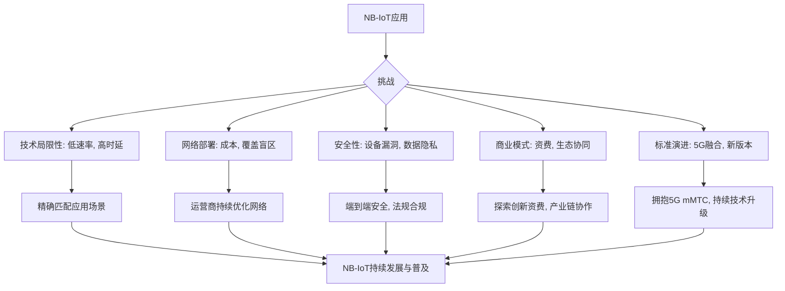

作者：qmwneb946

---

## 引言：当万物开始“低语”——物联网的崛起与NB-IoT的使命

我们正身处一个由数据驱动、设备互联的时代。从智能家居中自动调节灯光的传感器，到城市街头监测空气质量的设备，再到农田里精确灌溉的农业机器人，物联网（IoT）的概念正以前所未有的速度渗透到我们生活的方方面面。物联网的愿景是构建一个“万物互联”的世界，让物理世界中的一切都能通过网络进行感知、识别、连接和管理。

然而，要实现这一宏伟愿景，并非易事。传统的蜂窝通信技术（如2G/3G/4G）虽然提供了高速的数据传输能力，但在面对海量设备连接、极低功耗、深层覆盖以及成本敏感等物联网特有的需求时，显得力不从心。例如，一个安装在偏远地区、需要电池供电运行数年的水表，如果使用4G模块，其功耗和成本将难以承受。

正是在这样的背景下，一系列专为物联网设计的低功耗广域网（LPWAN）技术应运而生，其中，蜂窝物联网（Cellular IoT）家族中的窄带物联网（Narrowband Internet of Things, NB-IoT）无疑是最具代表性、发展最快的技术之一。NB-IoT由3GPP标准化组织在Release 13版本中定义，专为低带宽、低功耗、大连接、深覆盖的物联网应用场景设计。它不是为了取代高速宽带网络，而是为了填补“哑设备”与互联网之间的鸿沟，让那些原本“沉默”的、不起眼的物件也能“低语”，将它们的状态和数据通过蜂窝网络传递到云端，从而创造出巨大的价值。

本篇文章将深入探讨NB-IoT的奥秘，从其技术特性、工作原理，到其在各个行业领域的广泛应用，再到其面临的挑战与未来的发展方向。作为一名技术和数学博主，我将努力用清晰的语言、严谨的逻辑和适量的技术细节，为您揭示NB-IoT如何成为万物互联时代的一块重要基石，并展望它将如何赋能智慧未来，解锁无限可能。

---

## NB-IoT的基石：技术特性与独特优势

在深入探讨NB-IoT的应用之前，我们首先需要理解其核心的技术特性和相对于其他物联网连接技术的独特优势。NB-IoT的设计理念是“少即是多”，它牺牲了高带宽以换取更低的功耗、更深的覆盖和更低的成本。

### LPWAN家族中的佼佼者

物联网连接技术众多，可以大致分为两类：短距离通信（如Wi-Fi、蓝牙、ZigBee）和广域网通信（如2G/3G/4G/5G、LoRa、Sigfox、NB-IoT）。NB-IoT属于LPWAN范畴，它与LoRa、Sigfox等非授权频谱技术共同构成了LPWAN的主要力量，但NB-IoT运行在授权频谱上，由运营商提供服务，这带来了独特的优势。

**NB-IoT的主要技术特性包括：**

1.  **超低功耗 (Ultra-Low Power Consumption):** 这是NB-IoT最引人注目的特性之一。通过引入PSM（Power Saving Mode，省电模式）和eDRX（Extended Discontinuous Reception，扩展非连续接收）机制，NB-IoT终端可以在大部分时间处于深度睡眠状态，大大延长电池寿命，某些应用场景下电池续航可达10年甚至更久。
    *   **PSM (省电模式):** 设备在完成数据传输后进入深度睡眠，不接收下行数据，也不需要持续监听寻呼，直到预设的定时器到期。其原理是让设备定期唤醒与网络保持连接，而不是完全断开，从而避免了每次连接时复杂的附着（Attach）和PDN连接（PDN Connection）过程。终端在PSM模式下的功耗可以降至微安（μA）级别。
    *   **eDRX (扩展非连续接收):** 在PSM和活跃模式之间提供了一个中间状态。终端可以根据配置在更长的时间间隔内唤醒一次，监听网络寻呼，而不是像传统蜂窝网络那样每隔数十毫秒或数百毫秒就监听一次。这允许设备在不进入PSM的情况下，仍能大幅度节省功耗，同时保持一定程度的下行通信能力。
        假设设备在一个eDRX周期 $T_{eDRX}$ 中，有 $t_{active}$ 时间处于活跃状态（接收寻呼），那么其平均功耗将显著降低。这种机制尤其适用于需要偶尔接收少量下行数据的场景。

2.  **深度覆盖 (Deep Coverage):** NB-IoT相比传统2G/3G/4G技术，具备约20dB的额外增益，使得其信号能够更好地穿透墙壁、地下室，甚至到达偏远的山区。这得益于其窄带（180kHz）操作、重传机制以及更强的链路预算。
    *   **链路预算 (Link Budget):** 链路预算是衡量通信系统性能的关键指标，它决定了信号能够传输的最大距离和穿透能力。NB-IoT通过：
        *   **窄带增益:** 信道带宽越窄，噪声功率谱密度越低，相同信噪比下，接收灵敏度更高。对于180kHz的NB-IoT，相较于宽带系统，其噪声功率降低，带来约9dB的增益。
        *   **增强重传 (Repetitions):** 数据包可以重复传输多次，接收端通过合并多个接收副本（Soft Combining）来提高信噪比。例如，重复传输8次可以带来约9dB的增益。
        *   **最大耦合损耗 (Maximum Coupling Loss, MCL):** NB-IoT的MCL可以达到164dB，这意味着其覆盖能力远超GSM (144dB) 和LTE (154dB)。
        *   一个简化的链路预算公式可以表示为：
            $L_{budget} = P_{tx} - S_{rx} + G_{tx} + G_{rx} - L_{path}$
            其中，$P_{tx}$ 是发射功率，$S_{rx}$ 是接收灵敏度，$G_{tx}$ 和 $G_{rx}$ 是发射和接收天线增益，$L_{path}$ 是路径损耗。NB-IoT通过提高 $S_{rx}$ （即更低的负值，如-129dBm甚至-140dBm）来增强链路预算。

3.  **大连接数 (Massive Connections):** 单个NB-IoT基站扇区理论上可以支持高达10万甚至更多的设备连接。这得益于其高效的信令处理机制和极低的每设备资源占用。这对于智慧城市中数百万计的传感器、智能表计等场景至关重要。

4.  **低成本 (Low Cost):** NB-IoT模块的设计极度简化，移除了语音支持、高速数据传输等复杂功能，从而大大降低了硬件成本。一个NB-IoT模块的价格可以做到5美元甚至更低，这使得大规模部署在经济上成为可能。

5.  **安全可靠 (Secure and Reliable):** 作为基于授权频谱的蜂窝技术，NB-IoT继承了传统蜂窝网络的高安全性，包括用户身份认证、空中接口加密和完整性保护等机制。这对于企业级应用和关键基础设施的物联网部署至关重要。

### 与其他LPWAN技术的比较

为了更好地理解NB-IoT的定位，我们简要将其与其他主流LPWAN技术进行比较：

*   **LoRa/Sigfox (非授权频谱):**
    *   **优势:** 部署灵活，无需运营商网络即可搭建私有网络。模块成本也较低。
    *   **劣势:** 缺乏运营商级别的QoS保障，网络安全性相对较低，易受干扰，碎片化问题突出。
*   **LTE Cat-M1 (授权频谱):**
    *   **优势:** 比NB-IoT带宽更高（最高可达1Mbps），支持移动性、语音和VoLTE，时延更低。适用于对带宽和时延有更高要求的场景，如可穿戴设备、资产追踪器。
    *   **劣势:** 功耗和模块成本通常高于NB-IoT，覆盖能力略逊。
*   **2G/3G (授权频谱):**
    *   **优势:** 覆盖广，技术成熟。
    *   **劣势:** 功耗高，模块成本相对高，且面临网络退网（2G/3G网络逐步关闭）的风险。

NB-IoT在成本、功耗和覆盖方面达到了一个极佳的平衡点，尤其适合于那些对带宽要求不高、数据量小、但需要深度覆盖和长续航的静态或低移动性设备。

### NB-IoT的工作原理概述

NB-IoT在LTE网络的基础上进行了大量的简化和优化。它可以在LTE的Guard-band（保护带）、In-band（带内）或Standalone（独立）模式下部署。

*   **窄带操作:** NB-IoT仅使用180kHz的带宽进行数据传输。这使得它可以在LTE网络的保护带或一个PRB（Physical Resource Block）内工作，也可以作为独立的运营商网络部署。
*   **单音与多音传输:** 为了适应不同的覆盖和功耗需求，NB-IoT支持单音（Single-Tone）和多音（Multi-Tone）传输。单音传输将数据分散到多个子载波上，具有更好的覆盖和更低的功耗，但速率较低；多音传输使用12个子载波（一个PRB），速率更高，适用于覆盖较好、数据量稍大的场景。
*   **简化协议栈:** NB-IoT的协议栈相比LTE大大简化，减少了信令开销和处理复杂性。例如，它通常使用UDP/CoAP作为传输层协议，而不是TCP/HTTP，以减少握手和重传带来的开销。
*   **控制平面优化:** NB-IoT通过控制平面（Control Plane）数据传输，允许设备直接通过信令链路传输少量数据，而无需建立复杂的用户平面（User Plane）连接。这进一步降低了时延和功耗。

简而言之，NB-IoT通过“极致精简”的设计理念，以最小的资源消耗，实现了最大范围的连接，为物联网的普及奠定了坚实的技术基础。

---

## NB-IoT的广阔应用：赋能千行百业

NB-IoT的独特优势使其成为众多物联网应用场景的理想选择。其核心价值在于能够连接那些传统网络难以触及或连接成本过高的“沉默”设备。以下是NB-IoT在各个主要应用领域的详细阐述。

### 1. 智能计量：让水、电、气更“聪明”

智能计量是NB-IoT最成熟、部署最广泛的应用领域之一。传统的计量方式依赖人工抄表，效率低下，易出错，且难以实现实时监测和远程控制。NB-IoT智能表计的出现，彻底改变了这一局面。

*   **智能水表:**
    *   **痛点:** 抄表难（地下井、偏远地区），漏损检测不及时，人工成本高。
    *   **NB-IoT方案:** NB-IoT水表可以定期（如每天一次或每周一次）上报用水量数据，运营商通过NB-IoT网络将其传输至水务公司平台。
    *   **优势:**
        *   **深度覆盖:** 信号可穿透地下井盖和墙体，解决抄表盲区。
        *   **超低功耗:** 一节电池可供水表工作10年以上，显著降低维护成本。
        *   **远程监控与管理:** 水务公司可以远程获取数据、进行数据分析，及时发现异常用水（如漏损），提高供水效率。
        *   **故障预警:** 某些智能水表还能监测水压、水流异常等，提前预警。
    *   **应用场景示例:** 城市居民小区、工商业用水大户、农村饮水安全项目。

*   **智能燃气表:**
    *   **痛点:** 入户抄表不便，欠费停气需上门操作，安全隐患监测不足。
    *   **NB-IoT方案:** NB-IoT燃气表能定时上报用气量，支持远程阀门控制（如欠费自动关阀、余额充足自动开阀）。
    *   **优势:**
        *   **安全监测:** 部分智能燃气表集成燃气泄漏报警功能，通过NB-IoT实时上报，联动管理平台。
        *   **远程控制:** 远程开关阀门，解决入户难问题，提高服务效率。
        *   **能耗分析:** 收集的用气数据有助于燃气公司进行需求预测和管网优化。
    *   **应用场景示例:** 居民用户、商业用户、公共建筑。

*   **智能电表:**
    *   **痛点:** 偏远地区电力线路复杂，抄表和维护成本高。
    *   **NB-IoT方案:** 虽然大部分智能电表已采用有线或电力线载波通信，但对于分布式能源（如太阳能板）监测、偏远地区的小型电表或特殊工业用电监测，NB-IoT提供了灵活的无线回传方案。
    *   **优势:**
        *   **补充现有方案:** 弥补其他通信方式的不足，特别是对于非集中式部署的电表。
        *   **低成本部署:** 降低了传统有线铺设的成本。

### 2. 智慧城市：构建高效、智能的城市管理体系

智慧城市是NB-IoT应用的核心战场，它将城市基础设施的各个方面连接起来，实现精细化管理和运营。

*   **智能路灯:**
    *   **痛点:** 传统路灯无法感知环境变化，能耗高，故障发现不及时，维护成本高。
    *   **NB-IoT方案:** 在每个路灯杆上集成NB-IoT模块，实现单灯控制和状态监测。
    *   **优势:**
        *   **按需照明:** 根据车流量、人流量、天气等环境因素，远程调节灯光亮度，甚至开关，实现按需照明，节约大量电能。
        *   **故障定位与预警:** 实时监测路灯工作状态（开/关、亮度、电流、电压），发现故障（如灯泡损坏、线路异常）立即上报，精确到单灯，大幅缩短维修响应时间，降低维护成本。
        *   **资产管理:** 清楚掌握每个路灯的地理位置、资产编号和运行状态。
    *   **应用场景示例:** 城市主干道、社区道路、公园、广场。

*   **智能停车:**
    *   **痛点:** 停车位难找，停车费管理混乱，空置率信息不透明。
    *   **NB-IoT方案:** 在每个停车位下方安装地磁传感器，通过NB-IoT将车位占用状态实时上报至云平台。
    *   **优势:**
        *   **实时空位信息:** 驾驶员通过APP可实时查询附近空余车位，减少寻找时间，缓解交通拥堵。
        *   **高效收费管理:** 实现无人值守自动计费，防止逃费，提高停车场收益。
        *   **交通数据分析:** 收集的停车数据可用于城市停车规划和交通优化。
    *   **应用场景示例:** 城市路边停车位、商业综合体停车场、公共停车场。

*   **智能垃圾桶/废物管理:**
    *   **痛点:** 垃圾桶满溢无人清理，资源浪费，环境污染。
    *   **NB-IoT方案:** 在垃圾桶内安装液位传感器或超声波传感器，当垃圾达到一定高度时，通过NB-IoT上报满溢信息。
    *   **优势:**
        *   **按需清运:** 清洁公司可以根据实时数据安排最优清运路线和时间，避免空驶，提高清运效率，节省燃油和人工成本。
        *   **改善环境:** 避免垃圾溢出，提升城市环境卫生水平。
        *   **优化资源:** 更好地管理垃圾车队和人力资源。
    *   **应用场景示例:** 城市街道、社区、公园、商业区。

*   **环境监测:**
    *   **痛点:** 传统监测点固定，数据采集成本高，难以覆盖广阔区域。
    *   **NB-IoT方案:** 部署大量搭载温湿度、空气质量（PM2.5、CO2、SO2等）、噪音等传感器的NB-IoT监测点。
    *   **优势:**
        *   **广域覆盖:** 能够部署在城市各个角落，甚至偏远地区，形成高密度的监测网络。
        *   **实时数据:** 持续提供环境数据，为政府决策提供依据。
        *   **灾害预警:** 监测水文、地质数据，用于洪水、泥石流等自然灾害预警。
    *   **应用场景示例:** 大气环境监测、水质监测、农业气象站、森林防火。

### 3. 智能农业：科技赋能农田，助力精准生产

NB-IoT在农业领域的应用，正在推动传统农业向智能化、精准化、高效化转型，应对劳动力短缺和资源浪费等挑战。

*   **智能农田监测:**
    *   **痛点:** 农民凭经验耕作，水肥管理不精准，病虫害发现不及时。
    *   **NB-IoT方案:** 在农田里部署NB-IoT土壤传感器（监测土壤温湿度、PH值、N/P/K含量）、气象站（监测光照、气温、湿度、风速风向）。
    *   **优势:**
        *   **精准灌溉与施肥:** 根据土壤和作物需求，远程控制灌溉系统和施肥设备，实现水肥一体化，节约水资源和肥料，提高作物产量和品质。
        *   **病虫害预警:** 结合气象数据和作物生长模型，预测病虫害发生风险，提前采取防治措施。
        *   **生长环境优化:** 实时掌握大棚内温湿度、光照等参数，自动调节卷帘、风机等设备。
    *   **应用场景示例:** 温室大棚、大田作物种植、果园、茶叶种植。

*   **智能畜牧养殖:**
    *   **痛点:** 牲畜健康状况难追踪，疫病难以早期发现，放养牲畜易丢失。
    *   **NB-IoT方案:** 为牲畜佩戴NB-IoT耳标或项圈，监测体温、心率、活动量、位置等数据。
    *   **优势:**
        *   **健康监测:** 早期发现牲畜疾病，及时隔离治疗，减少损失。
        *   **行为分析:** 监测牲畜活动规律，辅助判断发情期、分娩期，提高繁殖效率。
        *   **定位追踪:** 防止牲畜走失，提高牧场管理效率，特别是在广阔的放牧区域。
    *   **应用场景示例:** 牛羊养殖、猪场、水产养殖（水质监测）。

### 4. 资产追踪：全程可见，提升供应链效率

NB-IoT的低成本、长续航特性使其成为低价值、大规模资产追踪的理想选择。

*   **物流追踪:**
    *   **痛点:** 货物在运输过程中状态不透明，温度敏感货物难以监控，丢失或损坏风险高。
    *   **NB-IoT方案:** 在物流包裹、集装箱、托盘上安装NB-IoT定位追踪器（结合GPS或基站定位）、温湿度传感器。
    *   **优势:**
        *   **全程可视化:** 实时追踪货物位置，了解运输路径和停留时间。
        *   **环境监控:** 尤其适用于冷链物流，确保药品、食品等温度敏感货物在运输过程中符合标准。
        *   **防盗防损:** 异常移动或开箱警报，提高货物安全性。
    *   **应用场景示例:** 冷链物流、贵重物品运输、共享单车/电动车定位、快递包裹追踪。

*   **设备资产管理:**
    *   **痛点:** 企业对分散在各地的设备资产管理效率低下，难以盘点和维护。
    *   **NB-IoT方案:** 在租赁设备、户外机械、施工工具等资产上安装NB-IoT定位和状态监测模块。
    *   **优势:**
        *   **实时盘点:** 掌握设备精确位置，提高资产利用率。
        *   **异常告警:** 设备非法移动、长时间闲置、故障等可及时告警。
        *   **运维优化:** 远程监测设备运行状态，进行预测性维护。
    *   **应用场景示例:** 建筑工地机械管理、共享充电宝、工厂设备巡检。

### 5. 智能家居与智能楼宇：便捷、安全、节能

虽然智能家居通常依赖Wi-Fi或ZigBee等短距离通信，但对于一些需要广域连接或电池长续航的场景，NB-IoT也展现出独特的价值。

*   **智能门锁/安防:**
    *   **痛点:** 传统门锁信息孤立，远程管理和报警能力有限。
    *   **NB-IoT方案:** 智能门锁集成NB-IoT模块，实现远程开锁、门锁状态上报、异常入侵报警等功能。
    *   **优势:**
        *   **独立联网:** 无需依赖家中Wi-Fi网络，安装部署更灵活。
        *   **低功耗:** 电池寿命长，减少更换频率。
        *   **远程控制与告警:** 即使家中无人在家，也能实时掌握门锁状态并接收告警。
    *   **应用场景示例:** 智能小区、出租屋管理、酒店门锁。

*   **烟雾报警器/燃气泄漏报警器:**
    *   **痛点:** 传统报警器仅本地声光报警，无法远程通知，易错过险情。
    *   **NB-IoT方案:** 集成NB-IoT模块的烟雾/燃气报警器，当检测到异常时，直接通过NB-IoT网络向用户手机或物业平台发送报警信息。
    *   **优势:**
        *   **远程联动:** 无论用户身在何处，都能及时收到警报。
        *   **独立供电:** 电池驱动，无需外接电源，安装方便，一次安装可长期使用。
        *   **群防群治:** 报警信息可同步至社区管理平台，实现快速响应。
    *   **应用场景示例:** 住宅、商铺、工厂、公共场所。

*   **智能消防栓/消防设备监测:**
    *   **痛点:** 消防栓被盗、被占用或压力不足难以发现，消防设备巡检效率低。
    *   **NB-IoT方案:** 在消防栓上安装NB-IoT监测模块，实时监测水压、状态（是否被盗/损坏）。
    *   **优势:**
        *   **实时告警:** 发现异常立即告警，保障消防安全。
        *   **提升巡检效率:** 远程监测取代人工巡检，降低人力成本。
    *   **应用场景示例:** 城市消防系统、工业园区消防设施。

### 6. 工业物联网 (IIoT)：优化生产，预测维护

在工业领域，NB-IoT的应用主要集中在那些对实时性要求不高，但对成本、功耗和覆盖有严格要求的场景。

*   **设备状态监测:**
    *   **痛点:** 工业设备故障难以预测，非计划停机造成巨大损失。
    *   **NB-IoT方案:** 监测工业泵、电机、管道、阀门等设备的温度、压力、振动等参数。
    *   **优势:**
        *   **预测性维护:** 通过数据分析，预测设备故障，提前进行维护，避免非计划停机，提高生产效率。
        *   **远程巡检:** 替代人工现场巡检，降低安全风险和人力成本。
        *   **能耗优化:** 监测设备运行能耗，帮助企业发现节能潜力。
    *   **应用场景示例:** 油气管道监测、水泵站监测、工厂生产线辅助监测。

*   **智能仪表读取:**
    *   **痛点:** 工业园区内大量仪器仪表（如流量计、压力计）需要人工抄表。
    *   **NB-IoT方案:** 将传统仪表通过NB-IoT模块连接到网络，实现远程自动化抄表。
    *   **优势:**
        *   **提高效率:** 消除人工抄表误差和成本。
        *   **数据可视化:** 实时掌握各项生产指标，辅助管理决策。

### 7. 智慧医疗与健康：守护生命，关爱健康

尽管医疗领域对数据传输的实时性和安全性有极高要求，但NB-IoT仍在某些特定场景展现潜力。

*   **可穿戴医疗设备 (非紧急):**
    *   **痛点:** 部分慢病管理或健康监测设备需要长时间佩戴并传输少量数据。
    *   **NB-IoT方案:** 监测血糖仪、血压计、心率带等非紧急医疗设备数据，或用于老年人跌倒报警器。
    *   **优势:**
        *   **低功耗，长续航:** 确保设备长时间稳定运行，无需频繁充电。
        *   **广覆盖:** 即使在没有Wi-Fi或蓝牙信号的室外也能保持连接。
    *   **应用场景示例:** 慢性病患者居家健康监测、老年人定位与紧急呼叫。

*   **医疗资产追踪:**
    *   **痛点:** 医院内大量医疗设备（轮椅、输液泵、监护仪等）流转频繁，难以定位和管理。
    *   **NB-IoT方案:** 在医疗设备上安装NB-IoT追踪标签，实时掌握设备位置和使用状态。
    *   **优势:**
        *   **提高设备利用率:** 快速定位所需设备。
        *   **降低丢失率:** 减少设备寻觅时间，提升医院运营效率。

### 8. 其他创新应用：无限可能

NB-IoT的低成本和广覆盖特性，也催生了许多新颖的创新应用：

*   **共享经济设备管理:** 共享单车、共享充电宝、共享雨伞的定位、锁控、电量/状态上报。
*   **智能消防栓监测:** 实时监测消防栓水压、是否被占用，确保火灾时能正常使用。
*   **白家电管理:** 远程控制空调、冰箱、洗衣机等白家电的简单状态上报和远程开关（如冰箱门未关提醒）。
*   **智能宠物追踪:** 宠物佩戴NB-IoT追踪器，防止走失。
*   **儿童/老人防走失手环:** 实时定位，紧急呼叫功能。
*   **智能井盖监测:** 监测井盖是否移位或被盗，保障城市安全。

这些应用无一不体现了NB-IoT在连接海量“哑终端”方面的独特价值。通过将这些看似微不足道的设备连接起来，我们能够收集到海量的数据，为决策提供更全面的依据，从而提升效率、降低成本、改善生活质量，真正实现“万物智联”。

---

## 挑战与思考：NB-IoT前进道路上的“绊脚石”

尽管NB-IoT在连接海量物联网设备方面展现出巨大潜力，但在其快速发展和广泛应用的过程中，仍然面临一些挑战和需要深入思考的问题。

### 1. 技术局限性与应用场景匹配

NB-IoT的“极致精简”设计带来了低功耗和低成本的优势，但也决定了其固有的技术局限性：

*   **低速率与小数据包:** NB-IoT的理论峰值速率较低（上行约20kbps，下行约200kbps），实际应用中传输速率更低，且每次数据传输的数据包大小通常限制在几十到几百字节。
    *   **影响:** 这意味着NB-IoT不适合需要传输大文件（如视频、高清图片）、高带宽（如语音通话）或持续高速数据流的场景。它更适用于周期性、小数据量的状态上报和控制指令下发。
*   **高时延与有限移动性:** NB-IoT通常工作在半双工模式，设备在大部分时间处于睡眠状态，导致其唤醒、连接、传输数据的时延相对较高（秒级到数十秒级）。同时，NB-IoT对高速移动的支持有限，不适合高速行驶车辆的实时追踪。
    *   **影响:** 这使得NB-IoT不适用于需要毫秒级响应、实时交互或高速移动的应用，如自动驾驶、工业生产线控制、实时视频监控等。

**对策:** 关键在于**应用场景的精准匹配**。企业在选择物联网通信技术时，必须充分评估业务需求对数据速率、时延、移动性的要求，而非盲目追求“万能”技术。NB-IoT应专注于其擅长的领域，如智能表计、环境监测、资产定位等。

### 2. 网络部署与覆盖优化

NB-IoT的深度覆盖能力是其一大亮点，但在实际部署中仍面临挑战：

*   **基站升级与成本:** 运营商需要对现有LTE基站进行软件升级或添加新硬件以支持NB-IoT。虽然成本相对较低，但大规模部署仍需投入，特别是在人口密度低的偏远地区，可能面临投资回报周期长的问题。
*   **室内/地下室覆盖仍需加强:** 尽管NB-IoT具有出色的穿透力，但在一些极端环境（如多层地下室、密集钢筋混凝土结构建筑内部）信号强度仍可能不足。
    *   **对策:** 运营商持续优化网络部署策略，增建基站或使用小基站/室内覆盖方案。同时，终端厂商需优化天线设计，提高接收灵敏度。
*   **全球漫游问题:** 早期NB-IoT标准和网络部署的碎片化使得全球漫游存在挑战。不同国家和地区使用的频段、网络部署模式（带内、保护带、独立）可能不尽相同。
    *   **对策:** 随着3GPP标准的演进和运营商之间的互联互通协议的完善，全球漫游问题正在逐步解决。例如，通过GSMA的IoT Roaming Hub等平台，加速漫游协议的达成。

### 3. 安全性与数据隐私

作为物联网的重要组成部分，NB-IoT设备的安全性至关重要，特别是在涉及关键基础设施和个人隐私的应用中。

*   **设备安全:** 大量低成本、资源受限的NB-IoT设备难以集成复杂的安全芯片和算法，可能成为网络攻击的薄弱环节。
*   **数据传输安全:** 虽然NB-IoT继承了蜂窝网络的加密和鉴权机制，但数据从设备到云平台的全链路安全仍需关注。
*   **隐私保护:** 智能抄表、资产追踪等应用会收集用户行为或位置数据，如何确保这些数据的隐私不被滥用是社会关注的焦点。

**对策:**
*   **端到端加密:** 推广从设备到云平台的端到端加密方案，确保数据在传输和存储过程中的安全。
*   **安全固件更新:** 建立安全的远程固件更新机制，及时修补设备漏洞。
*   **身份认证和授权:** 实施严格的设备身份认证和访问控制机制。
*   **合规性与法规:** 遵循GDPR、国内数据安全法等法规要求，建立完善的数据隐私保护政策。

### 4. 商业模式与生态系统成熟度

NB-IoT的成功不仅依赖于技术本身，也依赖于健康的商业模式和成熟的生态系统。

*   **资费模式:** 运营商需要探索更具吸引力、符合物联网特征的资费模式，例如按连接数、按数据量、按流量包等，以适应长周期、小流量的物联网应用。
*   **产业链协同:** 从芯片模组、终端设备、网络服务、平台管理到应用开发，整个产业链需要紧密协作，形成统一的标准和接口，降低开发和部署难度。
*   **平台能力:** 物联网平台需要提供强大的设备管理、数据采集、数据分析、应用开发和安全管理能力，支撑海量设备接入和应用创新。
*   **缺乏杀手级应用（早期）:** 早期NB-IoT面临缺乏现象级“杀手级”应用的困境，导致市场推广和用户普及速度受限。
    *   **对策:** 随着智能表计、智慧城市等领域的规模化部署，已经出现了一批成功的示范应用，为后续发展积累了经验。政府在其中扮演了重要角色，通过政策引导和项目示范推动NB-IoT应用落地。

### 5. 标准演进与技术融合

物联网技术发展迅速，NB-IoT也需不断演进以适应新需求。

*   **与5G的融合:** 5G的mMTC（海量机器类通信）旨在支持万亿级别的物联网设备连接，NB-IoT将作为5G mMTC的重要组成部分，实现技术上的平滑演进。这意味着NB-IoT将受益于5G网络基础设施的建设和5G生态系统的发展。
*   **NB-IoT 2.0/3.0等后续版本:** 3GPP在后续版本中持续优化NB-IoT，例如引入了更低时延、更高吞吐量、更强移动性（如定位增强）、更低功耗（如RedCap - Reduced Capability NR）等特性，以应对更多样化的应用需求。
*   **与其他技术的融合:** NB-IoT并非孤立存在，它将与Wi-Fi、蓝牙、LoRa等其他物联网技术形成互补，构建多技术融合的物联网解决方案。例如，在室内使用Wi-Fi或蓝牙进行短距离通信，再通过NB-IoT回传至云端。


*图1：NB-IoT发展面临的挑战与对策*

总而言之，NB-IoT并非没有局限性，但其在成本、功耗和覆盖上的极致优化，使其成为连接“沉默”世界、实现万物互联愿景的关键技术之一。通过正视这些挑战，并积极寻求解决方案，NB-IoT将能够更好地服务于未来的智慧社会。

---

## NB-IoT的未来展望：迈向5G与更广阔的星辰大海

NB-IoT的诞生，为物联网连接提供了革命性的解决方案。然而，物联网的未来是动态且不断演进的。NB-IoT的未来，将与5G、人工智能、边缘计算等前沿技术深度融合，共同构建一个更智能、更高效、更安全的万物互联世界。

### 1. 5G mMTC：NB-IoT的演进与融合

5G作为下一代移动通信技术，其三大应用场景之一便是**海量机器类通信 (Massive Machine Type Communication, mMTC)**。mMTC旨在支持万亿级别的物联网设备连接，这与NB-IoT的目标高度契合。事实上，NB-IoT被认为是5G mMTC的重要组成部分和核心技术之一。

*   **技术延续性:** 5G的mMTC将继承并优化NB-IoT和LTE Cat-M1的技术。这意味着现有的NB-IoT网络和设备可以平滑演进到5G mMTC，而无需大规模替换。这种向下兼容性保障了投资的连续性。
*   **能力增强:** 5G mMTC将在现有NB-IoT的基础上，进一步提升连接密度、降低功耗、增强覆盖，并可能引入更灵活的部署选项和更丰富的服务能力，例如：
    *   **URLLC (Ultra-Reliable Low Latency Communications) 的低功耗版本:** 未来可能会有NB-IoT/mMTC技术的变种，在保持低功耗的同时，提供更低的时延和更高的可靠性，以支持部分对实时性有更高要求的工业控制或医疗应用。
    *   **网络切片 (Network Slicing):** 5G网络切片能力将允许运营商为特定的物联网应用（如智慧水务、智能电网）分配独立的网络资源，提供定制化的服务质量保障，进一步提升NB-IoT应用的服务水平。
*   **RedCap (Reduced Capability NR):** 3GPP Release 17引入的Reduced Capability New Radio (RedCap) 旨在提供成本和功耗介于eMBB（增强移动宽带）和mMTC之间的新型设备能力。虽然RedCap更倾向于中速率应用，但其“精简”的理念与NB-IoT一脉相承，并可能形成互补，共同服务于更广阔的物联网市场。

### 2. 边缘智能与云计算的协同

随着物联网设备数量的激增，以及对数据实时处理和隐私保护的需求提升，**边缘计算 (Edge Computing)** 将在NB-IoT应用中扮演越来越重要的角色。

*   **数据预处理与过滤:** NB-IoT设备产生的数据量虽然小，但海量设备的聚合数据依然庞大。边缘网关可以在数据上报到云端之前，对数据进行初步处理、聚合和过滤，减少网络传输负载，降低云端处理成本。
*   **实时决策与响应:** 对于某些需要快速响应的场景（如工业设备异常检测），边缘计算可以实现本地化的实时决策，无需等待云端指令，从而降低时延。
*   **隐私与安全:** 敏感数据可以在本地边缘进行处理，避免全部上传至云端，提高数据隐私和安全性。
*   **与AI的结合:** 在边缘侧部署轻量级的人工智能算法，可以赋予NB-IoT设备初步的“思考”能力，例如通过传感器数据判断异常，进行预测性维护的初步分析。

NB-IoT将作为边缘节点的数据采集入口，将原始数据传输到边缘服务器或云端，形成一个高效、分层的智能物联网架构。

### 3. 星地融合：NB-IoT的“太空”拓展

传统的NB-IoT依赖地面基站。然而，对于广阔的海洋、沙漠、极地等偏远地区，地面网络覆盖仍然是难题。**卫星物联网 (Satellite IoT)** 的兴起，为NB-IoT带来了新的拓展维度。

*   **星地融合NB-IoT:** 一些卫星运营商和通信公司正在探索将NB-IoT技术应用于低轨卫星（LEO）通信。通过卫星作为基站，NB-IoT设备可以直接与卫星通信，实现真正的全球无缝覆盖。
*   **应用场景:** 这将极大拓展NB-IoT的应用范围，例如：
    *   **远洋船舶跟踪与监测:** 监测集装箱、渔船的实时位置和状态。
    *   **荒野动植物监测:** 在偏远地区追踪野生动物，监测生态环境。
    *   **偏远地区基础设施监控:** 监测输油管道、输电线路、气象站等。
    *   **应急通信:** 在地面网络瘫痪时提供备用通信手段。

星地融合NB-IoT将弥补地面蜂窝网络的覆盖盲区，为全球范围内的物联网部署提供强有力的支持。

### 4. 开放与协作：构建繁荣的生态系统

NB-IoT的未来发展，离不开整个物联网生态系统的开放和协作。

*   **标准统一与互操作性:** 3GPP的持续标准化工作至关重要，确保不同厂商的NB-IoT设备和网络能够互联互通。
*   **降低开发门槛:** 模组厂商、平台服务商、应用开发者需要共同努力，提供易于使用的开发工具、SDK、API，降低物联网应用的开发和部署门槛。
*   **商业模式创新:** 运营商、设备商和应用提供商需要共同探索更加灵活、创新的商业模式，以适应物联网多样化的需求。
*   **政策引导与产业扶持:** 各国政府的政策支持和产业扶持，将继续推动NB-IoT基础设施建设和应用落地。

### 代码块示例：NB-IoT设备状态机伪代码

为了更好地理解NB-IoT设备的低功耗运行机制，这里提供一个简化的NB-IoT设备状态机伪代码，展示其如何利用PSM和eDRX节省功耗。

```python
# 伪代码：NB-IoT设备运行状态机

class NBIoTDevice:
    def __init__(self, data_interval_sec, psm_timer_sec, edrx_cycle_sec):
        self.state = "OFFLINE"  # 初始化状态
        self.data_interval = data_interval_sec  # 数据上报间隔
        self.psm_timer = psm_timer_sec          # PSM定时器时长
        self.edrx_cycle = edrx_cycle_sec        # eDRX周期时长
        self.last_data_tx_time = 0
        self.last_paging_rx_time = 0
        print(f"NB-IoT设备初始化完成。数据间隔: {data_interval_sec}s, PSM定时器: {psm_timer_sec}s, eDRX周期: {edrx_cycle_sec}s")

    def connect_to_network(self):
        print("尝试连接网络...")
        # 模拟网络连接过程 (耗时，功耗高)
        # 发送Attach请求，获取IP地址，建立PDN连接
        time.sleep(5) 
        if random.random() > 0.1: # 模拟连接成功率
            self.state = "CONNECTED"
            print("网络连接成功。")
            return True
        else:
            print("网络连接失败，重试...")
            return False

    def send_data(self, data):
        if self.state != "CONNECTED":
            print("设备未连接，无法发送数据。")
            return False
        
        print(f"发送数据: {data}...")
        # 模拟数据传输过程 (耗时，功耗高)
        # 例如通过CoAP/UDP协议发送
        time.sleep(2) 
        self.last_data_tx_time = time.time()
        print("数据发送完成。")
        return True

    def enter_psm(self):
        print(f"进入PSM模式，PSM定时器: {self.psm_timer}s。")
        self.state = "PSM_SLEEP"
        # 实际操作是通知网络进入PSM，并进入深度睡眠
        
    def enter_edrx(self):
        print(f"进入eDRX模式，eDRX周期: {self.edrx_cycle}s。")
        self.state = "eDRX_ACTIVE" # 在eDRX周期内，设备大部分时间处于睡眠，定期醒来监听寻呼

    def check_paging(self):
        if self.state == "eDRX_ACTIVE":
            # 模拟在eDRX周期内唤醒并监听寻呼
            print("eDRX模式下唤醒，监听寻呼...")
            self.last_paging_rx_time = time.time()
            # 模拟接收到下行数据或寻呼
            if random.random() > 0.95: 
                print("接收到下行寻呼/数据，进入CONNECTED状态。")
                self.state = "CONNECTED"
                return True
            else:
                print("未接收到寻呼，继续eDRX睡眠。")
                return False
        return False

    def run(self):
        import time, random
        while True:
            current_time = time.time()

            if self.state == "OFFLINE":
                if not self.connect_to_network():
                    time.sleep(10) # 连接失败，稍后重试
                    continue
                else:
                    self.last_data_tx_time = current_time # 假设连接成功后可以立即发送数据

            if self.state == "CONNECTED":
                # 检查是否需要发送数据
                if current_time - self.last_data_tx_time >= self.data_interval:
                    self.send_data("SensorData_XYZ")
                    # 数据发送后，考虑进入PSM或eDRX
                    if self.psm_timer > 0:
                        self.enter_psm()
                    elif self.edrx_cycle > 0:
                        self.enter_edrx()
                    else:
                        print("保持CONNECTED状态 (非PSM/eDRX模式)。")
                        time.sleep(10) # 模拟等待下一个数据发送间隔
                else:
                    # 如果有下行数据需求，可以在CONNECTED状态下保持
                    # 否则，也可提前进入PSM/eDRX节省功耗
                    time.sleep(1) # 短暂等待

            elif self.state == "PSM_SLEEP":
                # 在PSM模式下，设备处于深度睡眠，只在PSM定时器到期时唤醒
                if current_time - self.last_data_tx_time >= self.psm_timer:
                    print("PSM定时器到期，从睡眠中唤醒，尝试连接并发送数据。")
                    self.state = "OFFLINE" # 重新连接以发送数据
                else:
                    time.sleep(self.psm_timer - (current_time - self.last_data_tx_time) + 1) # 模拟深度睡眠直到唤醒时间

            elif self.state == "eDRX_ACTIVE":
                # 在eDRX模式下，设备会定期唤醒监听寻呼
                if current_time - self.last_paging_rx_time >= self.edrx_cycle:
                    self.check_paging()
                
                # 检查是否到数据上报时间
                if current_time - self.last_data_tx_time >= self.data_interval:
                    print("eDRX模式下，数据上报时间到，进入CONNECTED状态准备发送。")
                    self.state = "OFFLINE" # 需要重新发起连接
                else:
                    time.sleep(1) # eDRX周期内大部分时间仍是睡眠，这里简化处理，模拟少量活动


# 示例用法
# 设备每60秒发送一次数据，PSM定时器设置为120秒，eDRX周期设置为20秒
# 注意：实际PSM/eDRX定时器由网络分配，且通常远长于此模拟值。
# device = NBIoTDevice(data_interval_sec=60, psm_timer_sec=120, edrx_cycle_sec=0) # 仅PSM
# device = NBIoTDevice(data_interval_sec=60, psm_timer_sec=0, edrx_cycle_sec=20) # 仅eDRX
device = NBIoTDevice(data_interval_sec=60, psm_timer_sec=120, edrx_cycle_sec=20) # PSM优先，PSM超时前考虑eDRX
device.run()

```
此伪代码展示了NB-IoT设备如何在PSM和eDRX模式下进行功耗管理。在PSM模式下，设备在数据传输后进入深度睡眠，仅在指定定时器到期后才唤醒并重新连接网络；在eDRX模式下，设备则在更长的周期内定期唤醒监听寻呼，以平衡功耗和下行数据接收需求。

### NB-IoT与物联网的未来

NB-IoT并非物联网的全部，但它无疑是连接海量低价值、低功耗设备的最佳选择之一。它的出现，让物联网的边界得以无限扩展，将更多原本孤立的物理世界设备纳入数字世界。

未来的物联网将是一个多技术融合、云边协同、高度智能化的复杂系统。NB-IoT将作为这个系统的重要“触角”，连接着最底层的感知设备，持续不断地收集物理世界的数据。这些数据经过边缘和云端的智能处理，将最终驱动智慧城市、智能制造、智慧农业等各个领域的深刻变革。

作为一个技术爱好者，我坚信NB-IoT的价值将随着其技术演进和应用领域的拓展而持续增长。它不仅仅是一种连接技术，更是构建一个更智能、更可持续、更美好世界的基石。

---

## 结论：连接“沉默”，铸就未来

在这次深度探索中，我们看到了NB-IoT如何以其“窄而精”的设计理念，成为万物互联时代的关键使能技术。从超低功耗、深度覆盖，到海量连接和极低成本，NB-IoT精准地击中了传统通信技术在物联网场景中的痛点，为数以亿计的“哑设备”赋予了“低语”的能力。

我们深入剖析了NB-IoT在智能计量、智慧城市、智能农业、资产追踪、智能家居以及工业物联网等多个关键领域的广泛应用，这些案例生动地诠释了NB-IoT如何通过连接看似微不足道的传感器和终端，实现数据价值的聚沙成塔，从而推动各行各业的效率提升、成本降低以及服务创新。从提高城市管理效率的智能路灯，到实现精准农业的土壤传感器，再到保障生命财产安全的智能消防报警器，NB-IoT的应用前景广阔，且已取得显著成效。

当然，NB-IoT并非没有局限。其固有的低速率和高时延特性决定了它不适用于所有物联网场景。我们讨论了这些挑战，并强调了精准匹配应用需求、持续优化网络部署、强化端到端安全、以及构建开放健康生态系统的重要性。

展望未来，NB-IoT将继续在5G mMTC的框架下演进和融合，受益于5G网络基础设施的强大赋能。边缘计算和人工智能的结合将让NB-IoT设备采集的数据更具洞察力。甚至，通过星地融合技术，NB-IoT的覆盖范围将突破地面限制，真正实现全球无缝连接。

NB-IoT的故事，是物联网浪潮中一个精彩的篇章。它告诉我们，有时最简单的解决方案，反而能带来最深远的影响。作为连接物理世界与数字世界的桥梁，NB-IoT正在默默地、却坚定地，为我们构建一个万物互联、智能高效的未来。它的价值，绝不仅仅在于连接本身，更在于连接所带来的无限可能——那些通过数据洞察和智能决策，而得以解锁的，更智慧、更便捷、更可持续的生活方式。

---