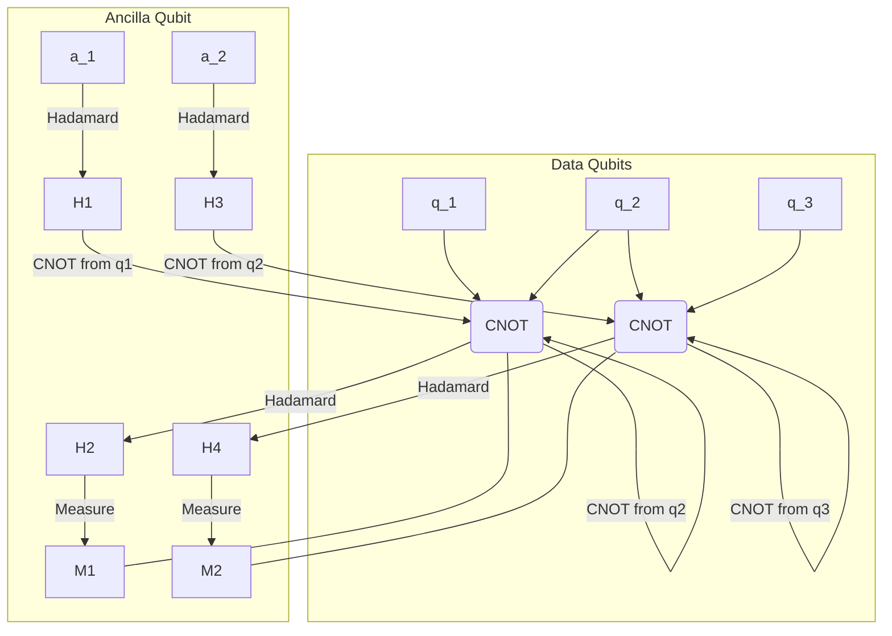

作者：qmwneb946

## 引言：量子世界的脆弱与守护

你好，技术爱好者们！我是 qmwneb946，你们的数字向导，今天我们将深入探讨一个既神秘又至关重要的领域：量子纠缠辅助纠错码。在浩瀚的宇宙中，信息是文明的基石。从远古的烽火狼烟到现代的光纤网络，我们一直在努力确保信息的准确无误。然而，当我们跃入量子世界，这种对准确性的追求便面临着前所未有的挑战。

量子比特（qubit）是量子计算的基石，它们承载着经典比特无法比拟的强大信息处理能力，这得益于叠加态和纠缠等奇特特性。然而，正是这些特性，也让量子信息变得异常脆弱。环境中的哪怕最微小的扰动，比如一个 stray photon 或一个微弱的电磁场，都可能导致量子比特的相干性迅速丧失，也就是所谓的“退相干”（decoherence），从而毁灭宝贵的量子信息。想象一下，你正在用沙子搭建一座精美的城堡，而一阵微风就能将其吹散——这就是量子信息所面临的困境。

为了实现容错量子计算（Fault-Tolerant Quantum Computing），我们必须找到一种方法来保护这些脆弱的量子态。这就是量子纠错码（Quantum Error Correction, QEC）登场的意义。经典纠错码通过增加冗余来抵抗噪声，比如重复发送信息。但量子世界有其独特的法则：不可克隆定理（No-Cloning Theorem）禁止我们简单地复制一个未知量子态；对量子态的测量会使其坍缩。这些特性使得经典的纠错方法在量子领域寸步难行。

然而，大自然在设置障碍的同时，也为我们提供了强大的工具——量子纠缠。纠缠，这种爱因斯坦称之为“鬼魅般的超距作用”的现象，不仅仅是量子计算的资源，更被证明是量子纠错的秘密武器。它不仅仅作为编码量子信息的内部结构存在，还能作为一种“外部”的辅助资源，进一步提升纠错码的性能，甚至改变我们构建量子计算机的方式。

在这篇深入的博客文章中，我们将从量子计算的基础挑战开始，回顾经典纠错码的原理，进而探讨量子纠错码的独特之处。最终，我们将聚焦于“量子纠缠辅助纠错码”（Quantum Entanglement-Assisted Quantum Error Correction, EA-QEC），揭示纠缠如何作为一种强大的辅助工具，帮助我们驯服量子世界的喧嚣，为构建稳定、可靠的量子计算机铺平道路。系好安全带，我们即将开启一场穿越量子信息保护前沿的深度之旅！

## I. 量子计算基础与挑战：噪音下的微光

在深入纠错码之前，让我们快速回顾一下量子计算的核心概念以及它所面临的独特挑战。

### 量子比特：超越经典的基石

与经典比特只能表示0或1不同，量子比特（qubit）能够处于0和1的叠加态。这意味着一个量子比特可以同时是0和1，其状态可以表示为：
$$ |\psi\rangle = \alpha|0\rangle + \beta|1\rangle $$
其中 $\alpha$ 和 $\beta$ 是复数，代表了测量得到 $|0\rangle$ 和 $|1\rangle$ 的概率幅，且满足概率归一化条件：$|\alpha|^2 + |\beta|^2 = 1$。

除了叠加态，量子比特还拥有另一个强大的特性：纠缠。当两个或多个量子比特处于纠缠态时，它们的状态是相互关联的，即使它们在空间上相距遥远。测量其中一个量子比特会立即影响到另一个纠缠量子比特的状态。这种非局域的关联是量子计算和量子通信中许多强大协议的基础。例如，贝尔态（Bell state）是纠缠态的典型例子：
$$ |\Phi^+\rangle = \frac{1}{\sqrt{2}}(|00\rangle + |11\rangle) $$
在这个状态下，如果第一个量子比特被测量为 $|0\rangle$，那么第二个量子比特也必然是 $|0\rangle$，反之亦然。

### 量子操作的脆弱性：退相干的威胁

量子计算机通过对量子比特施加一系列量子门操作来执行计算。这些量子门，比如 Hadamard 门、CNOT 门等，都是幺正操作，旨在精确地改变量子态。然而，现实中的量子系统并非孤立存在，它们时刻与环境发生相互作用。这种相互作用是不可避免的，并且会导致量子信息的丢失和错误，这被称为“噪声”。

噪声对量子比特的影响主要有两种形式：

*   **退相干（Decoherence）**：这是最主要的挑战。它描述了量子比特与环境耦合，导致其叠加态和纠缠特性逐渐丧失的过程。退相干通常表现为：
    *   **相位退相干（Dephasing）**：量子比特的相对相位信息丢失，导致叠加态中的 $\alpha$ 和 $\beta$ 的相对相位发生随机变化。想象一下你的量子态罗盘指针开始随机晃动。
    *   **振幅阻尼（Amplitude Damping）**：量子比特的能量损失，例如从激发态 $|1\rangle$ 衰减到基态 $|0\rangle$，就像一个能量泄漏的水箱。
*   **比特翻转（Bit Flip）**：将 $|0\rangle$ 变为 $|1\rangle$，将 $|1\rangle$ 变为 $|0\rangle$。在泡利矩阵表示中，这对应于 $X$ 错误。
*   **相位翻转（Phase Flip）**：将 $|+\rangle$ 变为 $|-\rangle$，将 $|-\rangle$ 变为 $|+\rangle$，而 $|0\rangle$ 和 $|1\rangle$ 不变。这对应于 $Z$ 错误。
*   **比特-相位翻转（Bit-Phase Flip）**：同时发生比特翻转和相位翻转。这对应于 $Y$ 错误，即 $X$ 错误和 $Z$ 错误的组合 ($Y=iXZ$)。

这些错误会随着时间、量子门操作的增加而累积，导致计算结果偏离预期，最终使量子计算机无法正常工作。当前的量子计算机被称为“NISQ”（Noisy Intermediate-Scale Quantum）设备，其噪音水平仍然很高，无法实现大规模容错计算。这就是为什么量子纠错至关重要——它是通向真正强大量子计算机的桥梁。

## II. 经典纠错码回顾：冗余的力量

在进入量子世界之前，我们先来回顾一下经典信息领域中是如何对抗噪声的。经典纠错码（Classical Error Correction Codes, ECC）是现代数字通信和存储的基石，其核心思想是引入冗余。

### 必要性：噪音无处不在

想象一下，你通过一个有噪音的电话线发送二进制信息。信号可能会失真，0可能变成1，1可能变成0。如果没有纠错机制，接收方将无法得知原始信息是否正确。经典纠错码正是为了解决这个问题而生。

### 基本原理：编码、冗余与校验

经典纠错码的基本步骤如下：

1.  **编码（Encoding）**：原始数据比特（信息比特）被编码器转换成一个更长的码字（codeword），其中包含了额外的冗余比特（校验比特）。
2.  **传输/存储（Transmission/Storage）**：码字通过有噪声的信道传输或存储在有噪声的介质中，可能会引入错误。
3.  **解码（Decoding）**：接收方接收到可能损坏的码字，解码器利用冗余信息检测并纠正错误。

最简单的例子是**重复码（Repetition Code）**。为了发送一个比特 $b$，我们不是发送一次，而是重复发送三次。例如，如果 $b=0$，发送 $000$；如果 $b=1$，发送 $111$。

假设发送 $000$，接收方可能收到：
*   $000$ (无错误)
*   $100, 010, 001$ (单比特错误)
*   $110, 101, 011$ (双比特错误)
*   $111$ (三比特错误)

通过简单的**多数表决（Majority Vote）**，我们可以纠正单比特错误。如果收到 $100$，由于0出现两次，1出现一次，我们可以推断原始信息是 $0$。这个码可以纠正所有单个比特错误。

更复杂的经典纠错码，如汉明码（Hamming Code）、里德-所罗门码（Reed-Solomon Code）、低密度奇偶校验码（LDPC Code）等，都基于类似的冗余原理，但通过巧妙的数学结构（如线性码、校验矩阵等）来实现更高的纠错效率和能力。它们通常通过计算校验子（syndrome）来定位错误。校验子是通过对接收到的码字进行特定计算得到的结果，如果结果非零，则表示存在错误，并且校验子的模式可以指示错误的类型和位置。

### 经典码的局限性：量子世界的壁垒

尽管经典纠错码非常成功，但它们不能直接应用于量子信息。原因在于量子力学的一些基本原理：

1.  **不可克隆定理（No-Cloning Theorem）**：我们无法精确复制一个未知的量子态。这意味着我们不能像经典比特那样简单地复制量子比特并进行多数表决。
2.  **连续错误（Continuous Errors）**：经典错误通常是离散的（0变1，1变0）。但量子错误可以是连续的，例如叠加态中的一个微小相位漂移。这意味着错误空间是无限的，无法通过有限的纠错码来覆盖所有可能的连续错误。
3.  **测量问题（Measurement Problem）**：对量子态的测量会使其坍缩到基态，从而破坏其叠加态和纠缠。这意味着我们不能直接测量量子比特来检测错误，因为这会丢失信息。我们必须在不破坏编码量子态的情况下获取错误信息。

这些根本性的差异要求我们重新思考纠错的范式，并发展出全新的、适用于量子信息的纠错理论。

## III. 量子纠错码的诞生与挑战：隐秘的守护者

面对经典纠错码的局限，量子纠错码（QEC）应运而生。QEC旨在通过将量子信息编码到多体纠缠态中来保护它，并在不破坏原始信息的情况下检测和纠正错误。

### 量子纠错的独特挑战

总结来说，量子纠错面临的主要挑战有：

*   **无法复制**：不能简单地复制量子态来增加冗余。
*   **连续性错误**：量子错误是连续的，比如一个量子比特的微小旋转。
*   **测量导致坍缩**：直接测量量子比特会破坏其状态。
*   **错误是量子态**：错误本身可以处于叠加态，例如一个叠加态的错误导致叠加态的错误。

### 基本思想：编码量子信息到纠缠态

量子纠错码的核心思想是将一个逻辑量子比特（logical qubit）的信息编码到一组纠缠的物理量子比特（physical qubits）中。这个编码过程创建了一个“代码空间”（code space），它是整个希尔伯特空间的一个子空间。如果发生错误，它会将量子态推出代码空间，但仍保留足够的信息来恢复原始状态。

重要的是，我们不能直接测量编码后的量子比特来查找错误。相反，QEC利用辅助量子比特（ancilla qubits）和测量纠缠来提取错误信息，这种提取被称为“校验子测量”（syndrome measurement）。校验子测量旨在识别错误的类型和位置，而不会泄露任何关于被保护信息本身的信息，从而避免了量子态的坍缩。

### Shor 码：第一个里程碑

1995年，彼得·秀尔（Peter Shor）提出了第一个量子纠错码，被称为**Shor 码**。它是一个 $[[9, 1, 3]]$ 码，意味着它使用 9 个物理量子比特来编码 1 个逻辑量子比特，并且可以纠正任意单比特错误（包括比特翻转和相位翻转）。

Shor 码的巧妙之处在于它结合了两种独立的纠错机制：

1.  **纠正比特翻转错误**：通过类似经典重复码的方式，将一个逻辑 $|0\rangle$ 编码为 $|0_L\rangle = (|000\rangle + |111\rangle)/\sqrt{2}$，将一个逻辑 $|1\rangle$ 编码为 $|1_L\rangle = (|000\rangle - |111\rangle)/\sqrt{2}$。这个子编码可以纠正比特翻转错误。实际上，Shor 码的比特翻转部分是三个三量子比特纠缠组的级联。
2.  **纠正相位翻转错误**：通过对 $|+\rangle$ 和 $|-\rangle$ 态的重复编码来实现。

Shor 码证明了量子纠错是可行的，为后续的理论发展奠定了基础。

### 稳定子码：通用的框架

Shor 码的成功激发了对更通用 QEC 理论的探索，其中最重要和最广泛应用的便是**稳定子码（Stabilizer Codes）**。稳定子码由丹尼尔·戈特斯曼（Daniel Gottesman）在1997年提出，它提供了一个统一的数学框架来描述许多重要的量子纠错码，包括 Shor 码和表面码（Surface Codes）等。

#### 定义：稳定子群

对于一个 $n$ 个量子比特的系统，一个稳定子码由一个阿贝尔群（通勤的生成元）$S$ 定义，称为**稳定子群（Stabilizer Group）**。这个群的每个元素都是作用于 $n$ 个量子比特的泡利算符（Pauli operators）的乘积（$I, X, Y, Z$）。码字空间 $\mathcal{C}$ 定义为所有被稳定子群中所有算符 $M \in S$ 作用后保持不变的量子态的集合：
$$ \mathcal{C} = \{ |\psi\rangle \in (\mathbb{C}^2)^{\otimes n} \mid M|\psi\rangle = |\psi\rangle, \forall M \in S \} $$
稳定子群通常由一组独立生成元 $g_1, g_2, \ldots, g_n-k$ 生成，其中 $n$ 是物理量子比特数，$k$ 是逻辑量子比特数。

#### 校验子测量：不破坏信息的秘密

校验子测量是稳定子码的核心。它通过测量稳定子生成元的值来获取错误信息。这个过程不直接测量数据量子比特，而是通过辅助量子比特和受控门（如 CNOT 门）来间接测量。

考虑一个简单的稳定子码例子：一个用于纠正比特翻转错误的 3 量子比特重复码，其逻辑 $|0_L\rangle = |000\rangle$ 和 $|1_L\rangle = |111\rangle$。它的稳定子生成元可以是 $g_1 = Z_1Z_2$ 和 $g_2 = Z_2Z_3$。

假设我们编码了一个逻辑 $|0_L\rangle = |000\rangle$。
如果发生一个 $X_1$ 错误，状态变为 $|100\rangle$。
我们如何检测这个错误而不测量 $|100\rangle$？

我们可以使用辅助量子比特和 CNOT 门来测量稳定子生成元。对于 $Z_iZ_j$ 稳定子，电路通常涉及两个数据比特 $i, j$ 和一个辅助比特 $a$。
电路示意图（概念性）：

上面的示意图是一个通用的稳定子测量电路的简化版。对于 $Z_1Z_2$ 测量：
1.  准备一个辅助比特 $a_1$ 处于 $|0\rangle$ 态。
2.  对 $a_1$ 应用 Hadamard 门，使其处于 $(|0\rangle+|1\rangle)/\sqrt{2}$。
3.  对 $q_1$ 和 $a_1$ 应用 CNOT 门 (控制 $q_1$, 目标 $a_1$)。
4.  对 $q_2$ 和 $a_1$ 应用 CNOT 门 (控制 $q_2$, 目标 $a_1$)。
5.  对 $a_1$ 应用 Hadamard 门。
6.  测量 $a_1$。

如果 $Z_1Z_2$ 的结果是 $+1$ (即 $|0\rangle$)，测量得到 $0$。如果结果是 $-1$ (即 $|1\rangle$)，测量得到 $1$。通过这种方式，我们获得了关于 $Z_1Z_2$ 算符作用结果的信息，而数据比特本身没有被直接测量而坍缩。

当错误发生时，稳定子生成元的测量结果会发生变化，产生一个独特的**校验子（syndrome）**。解码器根据这个校验子查找一个最可能的错误，然后施加相应的逆操作来纠正错误。例如，如果 $Z_1Z_2$ 测量结果是 $-1$，而 $Z_2Z_3$ 测量结果是 $+1$，这表明错误发生在 $q_1$ 上（一个 $X_1$ 错误）。

稳定子码的强大之处在于，它利用了量子纠缠：编码本身就是一种纠缠，而校验子测量更是通过数据比特和辅助比特之间的纠缠来提取信息。这为我们提供了一个在不破坏宝贵量子信息的情况下进行纠错的有效途径。

然而，传统的稳定子码在构造和纠错能力上仍有局限性。这就是量子纠缠辅助纠错码发挥作用的地方。

## IV. 量子纠缠：QEC 的秘密武器

我们已经看到了纠缠在量子比特编码和校验子测量中的基础性作用。但纠缠的潜力远不止于此。它可以作为一种额外的、共享的资源，进一步增强纠错码的性能，这就是“量子纠缠辅助纠错码”（EA-QEC）的核心思想。

### 纠缠的本质：非局域关联的魔力

量子纠缠描述的是多个量子比特之间一种特殊的、非局域的关联。当两个量子比特纠缠时，它们不再具有独立的状态，而是一个整体。对其中一个量子比特的测量会立即影响到另一个（或多个）纠缠量子比特的状态，无论它们相距多远。这种强关联性是量子信息理论中许多强大现象的源泉，包括量子隐形传态和超密集编码。

### 纠缠如何提供冗余：超越本地保护

传统的 QEC 码（如 Shor 码、标准稳定子码）通过将逻辑信息编码到物理比特的纠缠态中，从而在代码内部实现冗余。这种冗余是“内部的”。例如，一个 9 比特 Shor 码将一个逻辑比特的信息“分散”到 9 个物理比特的纠缠态中，即使其中一个物理比特受损，信息也不会完全丢失。

而量子纠缠辅助纠错码（EA-QEC）则利用了**额外的、预先共享或动态生成的纠缠资源**。这种纠缠可以存在于：

1.  **编码器和解码器之间**：想象Alice和Bob在通信前共享了一些贝尔对。
2.  **编码块内部，以一种非传统方式**：例如，通过引入辅助的纠缠对来改变编码的结构。

这种“外部”或“附加”的纠缠资源可以为 QEC 带来质的飞跃。

### 量子纠缠辅助纠错码 (EA-QEC) 的核心思想

EA-QEC 的核心思想是，通过利用已有的或实时生成的纠缠态，我们可以克服传统 QEC 码的一些限制，从而：

*   **提升纠错能力**：在给定物理比特数量的情况下，纠正更多的错误，或者纠正更复杂类型的错误。
*   **减少物理比特开销**：在达到相同纠错能力的前提下，使用更少的物理量子比特来编码一个逻辑量子比特。
*   **简化编码和解码操作**：有时，纠缠资源可以简化纠错电路的复杂性。

传统稳定子码要求所有的稳定子生成元必须是相互通勤的（即 $G_i G_j = G_j G_i$）。这是为了确保码字空间是一个有效的、正交的子空间，且对稳定子生成元的测量不会相互干扰。然而，这个要求在设计高效码时常常是一个限制。

EA-QEC 的一个突破性见解是：如果我们允许一些稳定子生成元不通勤，但可以通过与预先共享的纠缠态进行操作来“抵消”其非通勤性，那么我们就可以构建参数更优越的码。这就像是，经典密码学中，如果通信双方预先共享了密钥，那么加密和解密就可以变得更简单或更安全。在量子世界，这个“密钥”就是纠缠。

#### 两种主要模式：

1.  **编码方-解码方纠缠辅助（Encoder-Decoder Entanglement Assistance）**：
    *   **场景**：Alice（编码方）想要发送量子信息给Bob（解码方），他们预先共享了 $c$ 对贝尔态。
    *   **原理**：这些共享的贝尔态被视为一种资源。编码过程和解码过程可以利用这些共享纠缠对，从而使得他们能够使用一个“非正交”的编码，或者说，一个在没有共享纠缠时无法工作的码。通过共享纠缠，他们可以有效地将量子比特编码在一个更“宽松”的代码空间中，从而达到更高的编码率或纠错能力。
    *   **优点**：可以构造出比传统QEC码具有更高编码率（$k/n$ 比值）或更大距离 $d$ 的码，这在物理比特资源有限的情况下尤其有吸引力。它甚至可以用于纠正无法用传统QEC码纠正的错误类型。

2.  **辅助测量纠缠（Ancilla-Assisted Measurement Entanglement）**：
    *   **场景**：在执行校验子测量时。
    *   **原理**：这本身就是传统稳定子码工作的基础。通过将辅助比特与数据比特纠缠，然后测量辅助比特，我们可以间接获取数据比特上的错误信息，而不会破坏数据比特本身。这种纠缠不是额外的，而是QEC过程固有的。EA-QEC在此基础上可以进一步优化辅助比特的利用方式，例如通过更复杂的纠缠态来测量多个非通勤的稳定子。

#### 优点：为什么我们需要 EA-QEC？

*   **更高的编码率与距离**：对于给定数量的物理比特 $n$ 和逻辑比特 $k$，EA-QEC 可以实现更大的码距离 $d$（即可以纠正更多错误），或者在相同的 $d$ 下实现更大的 $k$。这意味着更高的信息密度和更强的错误抵抗能力。
    *   用数学表示，一个传统量子码通常表示为 $[[n, k, d]]$。而一个纠缠辅助量子码可能表示为 $[[n, k, d; c]]$，其中 $c$ 表示所需的共享贝尔对数量。它允许我们构造出在传统框架下不存在的码，比如 $n < 2k$ 的码，这在传统 QEC 中是不允许的。
*   **对特定噪声模型的鲁棒性**：某些类型的噪声可能对传统 QEC 码构成特殊挑战。EA-QEC 可以被设计成更有效地对抗这些特定的噪声模式。
*   **降低物理资源需求**：在某些情况下，利用纠缠辅助可以减少实现特定纠错能力所需的物理量子比特数量，这对于当前物理量子比特数量有限的 NISQ 设备至关重要。
*   **理论突破**：它扩展了量子纠错理论的边界，开辟了设计新型量子码的新思路。

#### 挑战：资源与管理

尽管 EA-QEC 具有显著优势，但它也带来了新的挑战：

*   **纠缠的制备与分发**：如何高效、高保真地制备和分发大量的纠缠对？这本身就是一项艰巨的工程挑战。
*   **纠缠的维护**：共享的纠缠对也可能受到噪声影响而退相干。如何保护和维护这些纠缠资源本身？
*   **纠缠的消耗**：许多 EA-QEC 方案会消耗共享纠缠对。这需要持续的纠缠供应。

尽管有这些挑战，EA-QEC 仍然是量子信息理论中最具前景的研究方向之一，为构建未来容错量子计算机提供了强大的工具。

## V. 典型量子纠缠辅助纠错码实例：理论与实践的交汇

了解了 EA-QEC 的核心思想后，我们来看看一些具体的例子和它在不同领域的应用。

### 纠缠辅助稳定子码 (EA-Stabilizer Codes)

纠缠辅助稳定子码是 EA-QEC 领域最重要和最活跃的研究方向之一。它们扩展了传统稳定子码的框架，允许使用更一般的稳定子群。

**核心原理：放宽通勤条件**

回忆一下，传统稳定子码要求所有稳定子生成元必须相互通勤。这意味着对于任意两个生成元 $g_i, g_j$，它们必须满足 $g_i g_j = g_j g_i$。这个条件确保了稳定子测量不会相互干扰，并且码字空间是一个定义明确的子空间。

然而，EA-QEC 通过利用共享纠缠对，可以**允许生成元集合中存在非通勤的算符**。这意味着我们可以拥有一个由 $\{g_1, g_2, \ldots, g_m\}$ 生成的稳定子群，其中某些 $g_i$ 和 $g_j$ 可能不再通勤 ($g_i g_j \neq g_j g_i$)。

这听起来很违反直觉，因为非通勤算符通常意味着它们不能同时被精确测量。但纠缠的引入改变了这种局面。通过预先共享的贝尔态，我们可以有效地“补偿”这种非通勤性。例如，如果 Alice 想要测量 $g_i$ 并且 Bob 想要测量 $g_j$，而 $g_i$ 和 $g_j$ 不通勤，他们可以通过利用共享贝尔态来协调他们的测量，从而间接推断出相关的信息，而不会破坏码字。

**数学描述（简化概念）**

一个 $[[n, k, d; c]]$ 的纠缠辅助稳定子码使用 $n$ 个物理量子比特编码 $k$ 个逻辑量子比特，能够纠正距离为 $d$ 的错误，并需要 $c$ 个预共享的贝尔对。

传统稳定子码的生成元 $S_i$ 都是通勤的。在 EA-QEC 中，我们可能有一个更一般的生成元集合 $G = \{G_1, \ldots, G_{n-k}\}$。虽然 $G_i$ 和 $G_j$ 可能不通勤，但它们的通勤子 $[G_i, G_j] = G_i G_j G_i^{-1} G_j^{-1}$ 会变成一个已知的泡利算符，而这个泡利算符可以通过对共享纠缠对进行相应的操作来“吸收”或“抵消”。

这种机制允许我们构建一系列全新的码，它们在传统框架下是无法实现的。例如，它们可以允许 $n$ 比 $2k$ 更小，或者对于相同的 $n$ 和 $k$ 获得更大的 $d$。这对于优化量子资源和提高容错能力至关重要。

**示例（概念性）**

假设我们有一个传统的 $[[n, k, d]]$ 码。通过引入 $c$ 个共享纠缠对，我们可以将其转换为一个 $[[n, k, d'; c]]$ 码，其中 $d' > d$。这意味着在相同的物理资源下，我们的纠错能力得到了提升。

举例来说，有一种被称为“最大距离可分纠缠辅助码”（EA-MDS codes），它们在给定参数下达到了码距离的理论上限，并且可以克服传统 QEC 中对编码率的一些限制。

### LDPC 量子码中的纠缠应用

低密度奇偶校验码（LDPC codes）是经典纠错码中的佼佼者，以其优异的纠错性能和高效的解码算法而闻名。将 LDPC 码的优点引入量子领域，构建**量子 LDPC 码（Quantum LDPC codes）**，是构建大规模容错量子计算机的梦想。

**经典 LDPC 的优势**：
*   校验矩阵稀疏：每个信息比特只参与少数校验方程，每个校验方程也只涉及少数信息比特。
*   高效的迭代解码算法：接近香农极限的性能。

**量子 LDPC 的挑战**：
*   需要找到具有稀疏校验矩阵，同时满足量子纠错要求的通勤生成元的码。
*   构建具有大距离的量子 LDPC 码非常困难。

**纠缠如何帮助**：
在量子 LDPC 码的设计中，纠缠辅助提供了一种新的思路。一些研究表明，通过允许在编码中使用纠缠辅助，可以设计出具有更高性能的量子 LDPC 码。例如，纠缠辅助允许构建具有更高编码率和更大距离的量子 LDPC 码，同时保持其稀疏性，从而可能实现更高效的解码。这意味着我们可以更容易地找到具有理想属性的量子 LDPC 码，而这在传统 QEC 框架下是极其困难的。

### 量子秘密共享与纠缠

虽然严格来说不是纠错码，但**量子秘密共享（Quantum Secret Sharing, QSS）**是一个密切相关的领域，它也依赖于纠缠来确保信息的安全性和鲁棒性。

**原理**：量子秘密共享允许一个秘密量子态被分解成多个子份额，然后分发给不同的参与者。只有当足够多的参与者合作时，他们才能恢复原始秘密。单个参与者或少于阈值数量的参与者无法获得任何秘密信息。

**纠缠的作用**：QSS 协议通常依赖于多体纠缠态，如 GHZ 态（Greenberger–Horne–Zeilinger state）。通过将秘密编码到这种多体纠缠态中，并将其分发给参与者，可以确保秘密的安全性。即使其中一些参与者的份额受到噪声影响或被恶意窃听，只要有足够的未受损份额，秘密仍然可以被恢复。这在某种意义上也是一种“纠错”，因为它确保了在分布式系统中信息的完整性和可恢复性。

EA-QEC 的研究也为量子通信网络中的安全协议，例如量子密钥分发（QKD）中的纠缠辅助 QKD 提供了新的视角和潜在的改进。

这些实例表明，纠缠不仅是量子信息处理的核心，更是我们设计更强大、更高效的量子纠错和信息安全协议的关键辅助资源。它为我们提供了一个超越传统 QEC 限制的视角，让我们能够构建更适应现实世界噪声的量子系统。

## VI. 实现量子纠缠辅助纠错的挑战与前景：通向未来之路

量子纠缠辅助纠错码的理论前景令人振奋，但将其从概念变为现实，需要克服一系列严峻的技术和理论挑战。

### 技术挑战：从实验室到实用

1.  **高保真纠缠制备与分发**：EA-QEC 依赖于大量高质量的共享纠缠对。如何在实验中高效地制备这些纠缠对，并将其高保真地分发到相距遥远的量子比特之间，是一个巨大的工程挑战。这需要精确的量子门操作、低损耗的量子信道以及长相干时间。
2.  **长寿命纠缠存储**：共享的纠缠对需要被存储起来以备将来使用。然而，纠缠态对环境噪声极其敏感，其寿命有限。如何延长纠缠的相干时间，使其能够长时间存储而不退相干，是关键。
3.  **量子门精度**：无论纠错码多么强大，如果构成其编码和解码操作的量子门本身就有很高的错误率，那么纠错本身也会引入错误。我们需要将量子门的错误率降低到所谓的“容错阈值”（fault-tolerance threshold）之下，通常要求单比特门错误率低于 $10^{-3}$ 到 $10^{-4}$，双比特门错误率低于 $10^{-2}$ 到 $10^{-3}$。
4.  **可扩展性问题**：为了纠正实际计算中可能出现的错误，我们需要大量的物理量子比特来编码少量的逻辑量子比特（例如，表面码可能需要数千个物理比特来保护一个逻辑比特）。如何将 QEC 系统扩展到数百万甚至数亿个物理量子比特，同时保持其高精度和互连性，是量子计算领域面临的最大挑战。
5.  **实时纠错与反馈**：一旦检测到错误，必须在退相干进一步破坏信息之前迅速纠正。这需要高效的校验子测量电路、快速的经典解码器以及实时反馈机制，以在极短的时间内执行纠正操作。

### 理论发展：优化与创新

1.  **新编码方案**：研究人员正在积极寻找更高效、更鲁棒的 EA-QEC 码。这包括寻找具有更高距离、更高编码率、更低物理开销的新型稳定子码、量子 LDPC 码以及其他类型的纠缠辅助码。
2.  **高效解码算法**：随着码字规模的增大，解码算法的复杂性也随之增加。开发快速、容错且能够处理各种噪声模型的解码算法至关重要。例如，基于神经网络或机器学习的解码器正在成为一个活跃的研究方向。
3.  **多体纠缠的利用**：除了简单的贝尔对，如何利用更复杂的多体纠缠态（如 GHZ 态、簇态）来增强纠错能力，是另一个重要的研究方向。
4.  **混合经典-量子纠错**：探索如何将经典的纠错技术与量子纠错相结合，以优化资源利用。例如，使用经典通信信道传输校验子信息时，可以利用经典 ECC 保护这些信息。

### 未来展望：容错量子计算的基石

尽管挑战重重，EA-QEC 及其更广泛的 QEC 领域正处在一个激动人心的发展阶段。随着物理量子比特质量的提升和数量的增加，我们正逐步迈向容错量子计算的时代。

*   **容错量子计算机**：EA-QEC 将是构建真正大规模、稳定、可靠的容错量子计算机不可或缺的一部分。只有当量子错误能够被有效抑制时，我们才能运行需要数百万次甚至数十亿次量子门操作的复杂算法，如 Shor 算法（分解大数）和 Grover 算法（搜索无序数据库）。
*   **量子通信网络和量子互联网**：在长距离量子通信中，量子中继器需要使用 QEC 来抵抗信道中的损耗和噪声。EA-QEC 提供了一种可能的方式来优化这些中继器，从而构建全球范围的量子互联网，实现安全的量子通信和分布式量子计算。
*   **新材料和架构**：超导量子比特、离子阱、拓扑量子比特等不同的量子计算平台都在积极探索 QEC 的实现。EA-QEC 的需求可能会推动新的量子材料和架构的发展，以更好地支持纠缠的制备、分发和存储。

## 结论：在喧嚣中锻造秩序

从一个脆弱的量子比特开始，我们走过了一段漫长的旅程，探讨了量子信息在嘈杂宇宙中保护自身所面临的挑战，以及量子纠错码，特别是量子纠缠辅助纠错码，如何成为克服这些挑战的关键。

经典纠错码教会我们通过冗余来对抗噪声，但量子世界的独特性质——不可克隆性、连续错误和测量坍缩——要求我们重新构想解决方案。量子纠错码巧妙地将信息编码到多体纠缠态中，并利用辅助量子比特进行不破坏信息本身的校验子测量。Shor 码和稳定子码为我们揭示了实现这一目标的途径。

然而，纠缠的真正力量远不止于编码和测量本身。作为一种独立的、可共享的资源，量子纠缠辅助纠错码开辟了设计更高效、更强大量子码的新途径。它允许我们突破传统 QEC 码的限制，以更少的物理资源实现更高的纠错能力，或者在相同的资源下实现更强的错误抵抗。这使得我们能够更好地驯服量子噪声，为容错量子计算的实现提供了一线曙光。

当然，将这些理论上的突破转化为实际的量子计算机，仍有巨大的技术挑战需要克服。高保真纠缠的制备、分发和存储，以及极其精确的量子门操作，都需要持续的科学研究和工程创新。但正是这些挑战，激发了全球范围内科学家和工程师们的热情与智慧。

量子纠缠辅助纠错码不仅仅是一个深奥的理论概念，它是我们在这个充满噪声的量子宇宙中锻造秩序、保护珍贵量子信息的关键工具。它代表着我们向构建真正强大、稳定、可扩展的量子计算机迈进的每一步。未来，当我们能够可靠地控制并利用纠缠的魔力，量子计算的潜力将得到充分释放，为人类开启一个全新的科学和技术时代。

感谢您与我一同深入探索这个迷人的领域！