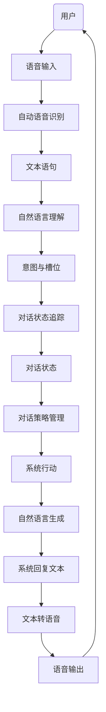

## 引言：语言的魔法与机器的智慧

在当今数字时代，我们与机器的互动方式正经历着一场深刻的变革。曾几何时，我们与电脑交流只能通过生硬的命令行或繁琐的图形界面。而现在，一句“嘿 Siri，今天天气怎么样？”或者“Alexa，播放我最喜欢的音乐”，机器便能理解我们的意图并作出响应。当我们在与电商客服机器人沟通、向智能音箱提问、甚至与一个能够创作诗歌、撰写代码的AI模型进行深度对话时，我们正在亲身体验着“对话系统”（Conversational Systems）的强大魔力。

对话系统，顾名思义，是旨在实现人与计算机之间自然语言交互的智能系统。它们的目标是让机器能够像人类一样理解、生成并参与到富有意义的对话中。从最早的基于规则的聊天机器人ELIZA，到任务导向型的Siri和Google Assistant，再到近年来席卷全球的生成式大型语言模型（LLMs）如ChatGPT，对话系统已经从实验室概念走向了我们生活的方方面面，成为连接物理世界与数字世界的关键桥梁。

然而，这背后绝非简单的魔法。对话的艺术是人类智能的巅峰之一，它涉及语言理解、推理、知识运用、情感识别乃至社交礼仪等多个复杂层面。让机器掌握这种艺术，无疑是人工智能领域最具挑战性且最引人入胜的课题之一。

本文将带领大家深入剖析对话系统的核心技术与发展历程。我们将从其基本架构开始，逐一解构自然语言理解（NLU）、对话状态追踪（DST）、对话策略管理（DP）和自然语言生成（NLG）这四大支柱。随后，我们将探讨语音交互的重要性，并特别关注近年来端到端对话系统，特别是大型语言模型（LLMs）如何颠覆了传统范式。我们还将讨论评估对话系统的方法，并展望这一领域的未来挑战与发展趋势。

准备好了吗？让我们一起踏上这场探索机器语言智慧的旅程。

## 1. 对话系统概述与分类

对话系统，其本质是实现自然、智能人机交互的软件或硬件集成系统。它允许用户使用口语或书面语与计算机进行交流，而不是通过鼠标点击或键盘输入特定命令。

### 什么是对话系统？

一个典型的模块化对话系统通常包含以下核心组件：

*   **自动语音识别（ASR - Automatic Speech Recognition）**：将用户的语音输入转换为文本。
*   **自然语言理解（NLU - Natural Language Understanding）**：解析文本，理解用户意图和关键信息（槽位）。
*   **对话状态追踪（DST - Dialogue State Tracking）**：维护并更新对话的上下文信息，如用户已表达的偏好、已完成的步骤等。
*   **对话策略管理（DP - Dialogue Policy Management）**：根据当前的对话状态，决定系统下一步应该采取什么行动（例如：询问更多信息、执行特定任务、提供答案等）。
*   **自然语言生成（NLG - Natural Language Generation）**：将系统内部的行动或信息转化为自然语言文本。
*   **文本转语音（TTS - Text-to-Speech）**：将生成的文本转换为语音输出（如果系统是语音交互的）。

<br>

<br>
*图1：模块化对话系统基本架构图*

### 对话系统分类

对话系统可以根据其应用场景和目标，大致分为以下几类：

#### 任务型对话系统（Task-Oriented Dialogue Systems）

这类系统的主要目标是帮助用户完成特定的任务，例如预订机票、查询天气、设置提醒、购买商品等。它们需要准确理解用户的意图和偏好，并引导用户逐步完成任务。

*   **特点**：
    *   有明确的目标和流程。
    *   需要精确的意图识别和槽位填充。
    *   对话通常结构化，遵循预定义的流程或状态机。
    *   通常需要与外部知识库或API交互。
*   **示例**：智能客服机器人、订餐机器人、票务助手等。

#### 闲聊型对话系统（Chatbots / Open-domain Dialogue Systems）

这类系统的主要目标是与用户进行开放域的、非任务性的自然对话，以提供陪伴、娱乐或信息查询服务。它们的目标不是完成特定任务，而是保持对话的连贯性、趣味性和信息性。

*   **特点**：
    *   没有明确的任务目标。
    *   需要处理广泛的话题和不确定的用户意图。
    *   更注重对话的流畅性、相关性和趣味性。
    *   对世界知识和常识推理能力要求更高。
*   **示例**：微软小冰、Replika、ChatGPT等。

#### 混合型对话系统（Hybrid Dialogue Systems）

为了兼顾任务完成和用户体验，许多现代对话系统会结合任务型和闲聊型的特点。当用户需要执行任务时，系统切换到任务模式；当用户进行非任务性提问或闲聊时，系统则切换到闲聊模式。

*   **特点**：
    *   能够无缝切换任务和闲聊模式。
    *   增加了系统的灵活性和用户满意度。
*   **示例**：许多智能音箱在提供任务服务的同时，也能进行简单的闲聊。

### 两种实现范式

从技术实现的角度，对话系统主要分为两大范式：

#### 检索式对话系统（Retrieval-Based Dialogue Systems）

检索式系统通过匹配用户输入与预先存储的问题-答案对或对话历史来选择最佳回复。它们通常维护一个庞大的回复库。

*   **工作原理**：
    1.  用户输入经过NLU处理。
    2.  系统计算用户输入与回复库中所有候选回复之间的相似度。
    3.  选择相似度最高的回复作为输出。
*   **优点**：
    *   回复质量稳定，不会出现语法错误或逻辑不连贯。
    *   易于控制和解释。
    *   计算成本相对较低。
*   **缺点**：
    *   回复多样性有限，只能回复库中已有的内容。
    *   无法处理超出知识库范围的复杂问题。
    *   难以应对未见过的用户表达方式。

#### 生成式对话系统（Generative-Based Dialogue Systems）

生成式系统从头开始生成回复，而不是从预定义库中选择。它们通常基于序列到序列（Seq2Seq）模型，如RNN、LSTM、Transformer等。

*   **工作原理**：
    1.  用户输入作为模型的编码器输入。
    2.  模型通过解码器逐字或逐词生成回复。
*   **优点**：
    *   回复多样性强，能够生成新颖、富有创造性的句子。
    *   能够处理更广泛的问题，适应性强。
*   **缺点**：
    *   容易出现语法错误、逻辑不连贯或“幻觉”（生成不存在或不准确的信息）。
    *   难以控制生成内容，可能生成不恰当甚至有害的回复。
    *   训练数据需求大，计算成本高。

近年来，随着大型语言模型（LLMs）的崛起，生成式对话系统取得了前所未有的进展，成为主流研究方向，并深刻影响了对话系统的发展。

## 2. 核心技术组件深入解析

无论何种类型的对话系统，其背后的核心技术都离不开对自然语言的深刻理解与生成。让我们深入探讨构成对话系统的各个关键模块。

### 2.1 自然语言理解（NLU）

自然语言理解是对话系统的“耳朵”和“大脑”的第一步，其任务是将用户输入的自然语言转化为机器可理解的结构化数据。这通常包括意图识别和槽位填充。

#### 意图识别（Intent Recognition）

意图识别的目标是判断用户输入的目的或意图。例如，用户说“我想订一张从北京到上海的机票”，系统需要识别出意图是“订机票”。

**技术方法：**

意图识别本质上是一个文本分类任务。

*   **传统机器学习方法**：
    *   **支持向量机（SVM）**：通过找到最佳超平面将不同类别的文本数据分开。
    *   **逻辑回归（Logistic Regression）**：一种广义线性模型，用于二分类或多分类问题。
    *   **朴素贝叶斯（Naive Bayes）**：基于贝叶斯定理和特征独立性假设的分类器。
    这些方法通常需要结合TF-IDF、词袋模型（Bag-of-Words）等特征工程。

*   **深度学习方法**：
    *   **卷积神经网络（CNN）**：通过卷积核提取文本的局部特征。
    *   **循环神经网络（RNN）及其变体（LSTM, GRU）**：擅长处理序列数据，能捕捉文本的上下文信息。
    *   **预训练语言模型（PLMs）**：如BERT、RoBERTa等。它们通过在大规模语料上进行无监督预训练，学习到丰富的语言知识。在意图识别任务上，可以通过在PLM的顶层添加一个分类器进行微调（fine-tuning），效果通常远超传统方法。

**示例（基于BERT的意图识别）：**

```python
# 这是一个概念性的代码片段，展示使用Hugging Face Transformers库的思路
from transformers import AutoTokenizer, AutoModelForSequenceClassification
import torch

# 假设已经有一个微调好的模型和对应的分词器
model_name = "your_finetuned_intent_model" # 比如基于bert-base-uncased微调的
tokenizer = AutoTokenizer.from_pretrained(model_name)
model = AutoModelForSequenceClassification.from_pretrained(model_name)

# 假设模型训练时的标签映射
id2label = {0: "查询天气", 1: "预订机票", 2: "播放音乐", 3: "闲聊"}

def predict_intent(text):
    inputs = tokenizer(text, return_tensors="pt")
    with torch.no_grad():
        outputs = model(**inputs)
    logits = outputs.logits
    predicted_class_id = logits.argmax().item()
    return id2label[predicted_class_id]

# 示例
user_utterance = "我想知道明天上海的天气怎么样？"
intent = predict_intent(user_utterance)
print(f"用户意图: {intent}") # 预期输出: 查询天气
```

#### 槽位填充（Slot Filling）

槽位填充（或实体识别）的任务是从用户输入中提取关键信息（也称为“槽位”或“实体”），这些信息是完成任务所必需的。例如，“订一张从**北京**到**上海**，**明天下午两点**的**单程**机票”，其中“北京”、“上海”、“明天下午两点”、“单程”就是需要提取的槽位值。

**技术方法：**

槽位填充通常被建模为序列标注任务，即为输入序列中的每个词或字符分配一个标签（如B-LOC、I-LOC、O等，代表实体的开始、内部或非实体词）。

*   **条件随机场（CRF - Conditional Random Fields）**：一种判别式概率图模型，在词性标注、命名实体识别等序列标注任务中表现优秀。
*   **Bi-LSTM-CRF**：结合了双向长短期记忆网络（Bi-LSTM）和CRF。Bi-LSTM能够捕捉上下文依赖，CRF则能够学习标签之间的依赖关系，从而纠正不合法的标签序列。
*   **预训练语言模型（PLMs）**：如BERT、RoBERTa等。同样可以通过在PLM顶部添加一个序列标注层进行微调，显著提升性能。

**示例（Bi-LSTM-CRF或BERT for Slot Filling）：**

假设用户输入：“帮我查一下后天从北京到上海的火车票。”

NLU的输出可能是：
*   **意图**：`查询火车票`
*   **槽位**：
    *   `日期`：`后天`
    *   `出发地`：`北京`
    *   `目的地`：`上海`

这些结构化数据是后续对话管理和任务执行的基础。

### 2.2 对话状态追踪（DST）

对话状态追踪是对话系统的“记忆”，它负责在整个对话过程中维护和更新当前对话的上下文信息。这包括用户已经明确或隐含表达的意图、偏好、已收集的槽位信息以及系统的内部状态。DST的准确性直接影响到对话的连贯性和任务完成度。

#### 定义与重要性

考虑以下对话片段：
用户A: "我想查一下从北京到上海的航班。" (意图: 查询航班, 出发地: 北京, 目的地: 上海)
系统A: "好的，请问您打算什么时候出发？"
用户B: "明天下午。" (日期: 明天下午)

在用户B的轮次中，他并没有重复“北京”、“上海”或“航班”等信息。对话状态追踪器需要能够推断出，用户B所说的“明天下午”是关于“从北京到上海的航班”的“出发日期”。这要求DST能够整合多轮信息，并解决指代消解、省略等问题。

对话状态通常表示为一个键值对（`slot_name: slot_value`）的集合，例如：
`{ "intent": "查询航班", "origin": "北京", "destination": "上海", "date": "明天下午" }`

#### 方法

*   **基于规则的方法**：
    *   预定义一系列规则来更新状态。例如，如果用户说“更改为XXX”，则更新某个槽位。
    *   **优点**：简单，可解释性强。
    *   **缺点**：难以覆盖所有复杂情况，维护成本高，不灵活。

*   **基于统计或机器学习的方法**：
    *   将DST建模为分类或回归问题，预测每个槽位的状态或值。
    *   **贝叶斯网络/信念网络**：可以建模不同槽位之间的概率依赖关系，通过推理更新“信念状态”（Belief State），即对所有可能槽位值的概率分布。
    *   **条件随机场（CRF）**：也可以用于建模槽位值之间的顺序依赖。

*   **基于深度学习的方法**：
    *   利用RNN、LSTM或Transformer等模型来编码整个对话历史，并直接预测当前的对话状态。
    *   **编码器-解码器模型**：编码器处理当前用户语句和前几轮对话的历史，解码器生成对话状态的表示。
    *   **TOD-BERT / SimpleTOD / TRADE**：这些是基于Transformer的DST模型，它们通常将对话历史序列化，然后用预训练模型对其进行编码，最后通过各种机制预测槽位值。
    *   **Schema-Guided Dialogue State Tracking (SGD)**：一种通用的DST方法，旨在适应新的领域和任务，而无需大量重新标注数据。它通过引入“schema”（领域和槽位的定义）来指导状态追踪。

深度学习方法在处理长对话历史、捕获复杂上下文依赖方面表现出色，是当前DST研究的主流。挑战在于如何有效地处理未见过的槽位值（Out-of-Vocabulary, OOV）以及如何进行跨领域的迁移。

### 2.3 对话策略管理（Dialogue Policy Management）

对话策略管理是对话系统的“大脑”的核心决策单元，它根据当前的对话状态，决定系统下一步应该执行的“对话行动”（System Action）。这些行动可能是向用户提问、提供信息、执行外部API调用、确认信息或结束对话。

#### 定义

一个系统行动通常包括行动类型（如`request`、`inform`、`confirm`、`goodbye`等）和相关槽位信息（如`request(destination)`表示询问目的地，`inform(weather=sunny)`表示告知天气晴朗）。

#### 方法

*   **基于规则的策略（Rule-Based Policies）**：
    *   预定义一套 if-then 规则，根据当前的对话状态决定行动。
    *   **优点**：完全可控，易于调试，对于简单任务效果良好。
    *   **缺点**：难以应对复杂多变或用户偏离预设流程的对话；规则数量庞大，维护困难，可扩展性差。

*   **基于统计或机器学习的策略**：
    *   **监督学习（Supervised Learning）**：从人工标注的对话数据中学习策略。将对话状态作为输入特征，系统行动作为输出标签，训练一个分类器。
    *   **优点**：比规则更灵活。
    *   **缺点**：需要大量标注数据，且难以覆盖所有可能的对话路径；难以处理对话中固有的长程依赖和不确定性。

*   **基于强化学习（Reinforcement Learning - RL）的策略**：
    *   将对话过程建模为马尔可夫决策过程（Markov Decision Process - MDP）。系统扮演“Agent”，用户扮演“Environment”。
    *   **状态（State）**：当前的对话状态（由DST提供）。
    *   **行动（Action）**：系统在当前状态下可以选择的对话行动。
    *   **奖励（Reward）**：系统采取行动后，根据用户满意度、任务完成度等获得的反馈。
    *   **转移（Transition）**：系统行动后，用户回复导致对话状态的改变。
    *   通过与用户或用户模拟器交互，Agent在不断试错中学习能够最大化长期奖励（如任务成功率、用户满意度）的最优策略。
    *   **算法**：Q-learning、SARSA、DQN（Deep Q-Networks）、Actor-Critic 方法（A2C, A3C）、PPO（Proximal Policy Optimization）等。
    *   **优点**：能够学习最优的、对不确定性具有鲁棒性的策略；无需人工规则，可适应复杂对话。
    *   **缺点**：训练复杂，需要大量交互数据或高质量的用户模拟器；奖励函数设计困难。

**强化学习在对话策略中的示例**

假设一个简单的MDP：
*   **状态**：`s = (当前意图, 槽位1是否填充, 槽位2是否填充, ...)`
*   **行动**：`a = (request(slot1), inform(info), confirm(slot2), ...)`
*   **奖励**：`+R_success` (任务成功), `-R_turn` (每轮的负奖励，鼓励快速完成), `-R_fail` (任务失败)

Agent通过反复尝试不同的行动序列，观察用户（模拟器）的反应和奖励，从而学习在给定状态下选择哪个行动能够带来最大累积奖励。

### 2.4 自然语言生成（NLG）

自然语言生成是对话系统的“嘴巴”，它负责将系统内部的结构化行动或信息（由对话策略决定）转化为流畅、自然、符合语法的自然语言文本。

#### 定义

例如，如果对话策略决定执行的系统行动是`inform(weather=sunny, location=Shanghai)`，NLG需要将其转换为“上海的天气是晴朗的。”或“上海今天阳光明媚。”等自然语言回复。

#### 方法

*   **基于模板的生成（Template-Based Generation）**：
    *   预定义一系列包含槽位占位符的回复模板。
    *   系统行动中的槽位值被直接填充到模板中。
    *   **示例**：
        *   模板: `“${location}的天气是${weather}。”`
        *   填充: `“上海的天气是晴朗。”`
    *   **优点**：简单，生成内容可控，不会出错。
    *   **缺点**：缺乏灵活性和多样性，回复生硬，不自然。

*   **基于规则的语法（Rule-Based Grammars）**：
    *   使用语法规则（如上下文无关文法、特征结构文法等）来组合词汇和短语，生成语句。
    *   **优点**：比模板更灵活，能生成更多样化的句子。
    *   **缺点**：规则编写复杂，维护困难，难以覆盖所有语言现象。

*   **基于深度学习的生成**：
    *   将NLG建模为序列到序列（Seq2Seq）任务，即输入是一个结构化的语义表示，输出是一个自然语言序列。
    *   **RNN编码器-解码器模型**：编码器将结构化输入编码为向量表示，解码器通过循环神经网络逐词生成文本。
    *   **带有注意力机制（Attention Mechanism）的Seq2Seq模型**：允许解码器在生成每个词时，关注编码器输入的特定部分，显著提升了生成质量，解决了长序列依赖问题。
    *   **Transformer模型**：完全基于注意力机制，并行处理能力强，成为当前NLG的主流架构。GPT、T5、BART等都是基于Transformer的预训练模型。
    *   **预训练语言模型（PLMs）**：通过大规模无监督预训练，PLMs已经学习了丰富的语言知识和生成能力。在NLG任务上，可以通过微调或直接作为生成模型（如GPT系列）使用。
    *   **优势**：生成内容更流畅、自然、多样，甚至富有创造性。
    *   **挑战**：可能出现“幻觉”、语法错误、重复、不连贯，以及难以控制生成内容的精确性（例如，必须包含特定信息）。

**基于Transformer的NLG示例（概念性）：**

```python
# 假设我们有一个经过NLG任务微调的T5模型
from transformers import AutoTokenizer, AutoModelForSeq2SeqLM

model_name = "your_finetuned_nlg_model" # 例如 t5-base 或其他微调过的模型
tokenizer = AutoTokenizer.from_pretrained(model_name)
model = AutoModelForSeq2SeqLM.from_pretrained(model_name)

def generate_response(system_action_representation):
    # 输入通常是某种结构化表示，或语义图，这里简化为字符串
    # 例如： "inform_weather(location=Shanghai, weather=sunny)"
    # 或更复杂的语义框架
    input_text = f"generate text: {system_action_representation}"
    
    inputs = tokenizer(input_text, return_tensors="pt")
    
    # 生成文本
    outputs = model.generate(inputs["input_ids"], 
                             max_length=50, 
                             num_beams=5, # Beam search for better quality
                             early_stopping=True)
    
    response_text = tokenizer.decode(outputs[0], skip_special_tokens=True)
    return response_text

# 示例
action_info = "inform_weather(location=Shanghai, weather=sunny)"
generated_text = generate_response(action_info)
print(f"系统回复: {generated_text}") # 预期类似: "上海今天天气晴朗。"
```

### 2.5 语音交互（ASR/TTS）

对于语音对话系统（如智能音箱、车载系统），语音交互能力是不可或缺的。它包含自动语音识别（ASR）和文本转语音（TTS）两个核心环节。

#### 自动语音识别（ASR - Automatic Speech Recognition）

ASR负责将人类的口语（声学信号）转换为可被NLU处理的文本序列。

**工作原理：**
ASR通常由以下几个部分组成：
*   **声学模型（Acoustic Model - AM）**：将语音信号的声学特征（如MFCC、FBank等）映射到音素（phonemes）或字单元（sub-word units）。
*   **发音词典（Pronunciation Dictionary）**：将字单元（或词）映射到它们的音素序列。
*   **语言模型（Language Model - LM）**：评估给定文本序列的概率，用于纠正声学模型可能产生的歧义，确保生成文本的流畅性和语法正确性。

**技术发展：**
*   **早期**：隐马尔可夫模型（HMM）与高斯混合模型（GMM）结合。
*   **深度学习时代**：
    *   **深度神经网络（DNN）**：取代GMM作为声学模型。
    *   **循环神经网络（RNN）及其变体（LSTM, GRU）**：处理语音信号的序列特性。
    *   **卷积神经网络（CNN）**：在语音识别中提取局部特征。
    *   **Connectionist Temporal Classification (CTC)**：一种无需对齐的训练方法，直接从声学特征预测序列。
    *   **Sequence-to-Sequence模型**：端到端ASR，直接将声学特征映射到文本序列，无需显式的声学模型、发音词典和语言模型。例如Deep Speech、Listen, Attend and Spell (LAS)。
    *   **Transformer**：在ASR领域也表现出色，许多最先进的端到端ASR模型都基于Transformer。

#### 文本转语音（TTS - Text-to-Speech）

TTS负责将NLG生成的文本转换为人类可听的语音输出。

**工作原理：**
TTS通常分为两个主要阶段：
*   **声学特征预测（Acoustic Feature Prediction）**：将文本输入（字符、音素序列）转换为声学特征（如梅尔频谱、F0基频等），这些特征代表了语音的音调、音色、韵律等。
*   **声码器（Vocoder）**：将声学特征合成为可听的波形。

**技术发展：**
*   **早期**：拼接合成（Concatenative Synthesis）、参数合成（Parametric Synthesis）。
*   **深度学习时代**：
    *   **Tacotron / Tacotron 2**：端到端模型，直接从文本生成梅尔频谱，然后结合声码器生成语音。
    *   **WaveNet / Parallel WaveGAN / HiFi-GAN**：高质量的神经声码器，能够生成逼真、自然的语音波形。
    *   **Transformer-based TTS**：利用Transformer的并行处理和长程依赖建模能力，进一步提升合成语音的自然度和表现力。

ASR和TTS的进步使得语音交互变得更加自然和高效，极大地拓展了对话系统的应用场景，例如智能家居、车载系统和无障碍技术。

## 3. 端到端对话系统

传统的模块化对话系统虽然清晰、易于调试，但其“管道式”架构存在固有的问题：每个模块的错误都会累积并向下传播，且各模块独立训练，难以实现全局最优。为了解决这些问题，研究者们提出了“端到端”（End-to-End）对话系统。

### 传统模块化 vs. 端到端

*   **传统模块化**：
    `ASR -> NLU -> DST -> Dialogue Policy -> NLG -> TTS`
    每个模块独立设计和训练，之间通过明确定义的接口传递信息。
    **优点**：可解释性强，模块化开发和调试方便。
    **缺点**：错误累积，各模块优化目标不一致，难以全局优化。

*   **端到端**：
    旨在将用户原始输入（文本或语音）直接映射到系统原始输出（文本或语音），中间不再显式区分NLU、DST、DP、NLG等模块。一个大型神经网络模型直接学习这种映射关系。
    **优点**：
    *   **联合优化**：整个系统作为一个整体进行优化，潜在地实现全局最优。
    *   **简化架构**：减少了中间接口和数据表示的复杂性。
    *   **数据驱动**：模型直接从大量的对话数据中学习，可能发现人类难以预设的复杂模式。
    *   **更流畅自然**：生成的回复通常更具连贯性和自然度，因为模型直接学习对话的上下文依赖。
    **缺点**：
    *   **数据饥渴**：需要极其庞大的对话数据集进行训练。
    *   **缺乏可解释性**：难以理解模型内部的决策过程，调试困难。
    *   **难以控制**：生成内容的准确性、安全性、逻辑性难以严格控制。
    *   **灾难性遗忘**：在面对新任务或新数据时，可能忘记之前学到的知识。
    *   **泛化能力**：在训练数据范围之外的任务上表现可能不佳。

### 代表模型与大型语言模型（LLMs）的崛起

近年来，随着深度学习技术，特别是Transformer架构的飞速发展和计算资源的极大丰富，端到端对话系统取得了突破性进展，其中最具代表性且影响力最大的是**大型语言模型（Large Language Models - LLMs）**。

#### LLMs在对话中的应用

LLMs如GPT系列（Generative Pre-trained Transformer）、LaMDA、PaLM、T5、BART、LLaMA、以及最新的Gemini等，通过在海量的文本数据上进行自监督预训练，学习了惊人的语言理解和生成能力，以及丰富的世界知识和常识。

*   **预训练（Pre-training）**：LLMs通过预测下一个词或填充完形填空等任务，学习文本的统计规律、语法、语义和部分世界知识。它们本质上是强大的**语言模型**，能够评估给定文本序列的概率，并根据前文预测后文。

*   **指令微调（Instruction Tuning）**：在预训练之后，LLMs会进行“指令微调”，即在包含大量指令-响应对的数据集上进行微调。这使得模型能够理解和遵循人类的指令，而不仅仅是续写文本。例如，“请总结以下文章：[文章]”这样的指令。

*   **基于人类反馈的强化学习（Reinforcement Learning from Human Feedback - RLHF）**：这是将LLMs与人类偏好对齐的关键一步。
    1.  **收集人类偏好数据**：对于模型的多个回答，人类标注者对其进行排序或打分。
    2.  **训练奖励模型（Reward Model - RM）**：使用这些人类偏好数据训练一个独立的模型来预测人类对模型回答的“奖励”分数。
    3.  **强化学习微调**：使用这个奖励模型作为RL的奖励函数，通过PPO等算法对LLM进行微调，使其生成更高奖励（更符合人类偏好）的回答。

**LLMs如何实现对话功能？**

*   **零样本/少样本学习（Zero-shot/Few-shot Learning）**：LLMs在没有特定任务训练数据的情况下，通过提示语（prompt）即可执行任务。例如，在提示中说明“你是一个客服机器人，请回答用户关于订单的问题”，模型就能在一定程度上扮演客服角色。
*   **上下文学习（In-context Learning）**：在少样本学习中，模型通过在输入提示中提供少量示例，就能理解任务模式并进行推理。对于对话，这意味着可以提供几轮对话示例，模型就能在后续轮次中保持上下文。
*   **将对话视为连续文本生成**：对于LLMs，整个对话历史被视为一个长序列的文本。模型每次生成回复时，都会基于完整的对话历史作为输入，预测下一个词，直到生成完整的回复。
    *   用户输入：`[对话历史] 用户: <用户话语>`
    *   模型输出：`系统: <系统回复>`

```python
# 概念性代码：使用LLM进行对话
from transformers import AutoTokenizer, AutoModelForCausalLM
import torch

# 假设使用一个大型预训练模型，例如 GPT-2 或 Llama
# model_name = "gpt2" # 或 "meta-llama/Llama-2-7b-chat-hf" 等
# tokenizer = AutoTokenizer.from_pretrained(model_name)
# model = AutoModelForCausalLM.from_pretrained(model_name)

# 实际使用中，通常是调用API或使用微调过的模型
# 这里仅为示意，不实际运行
def chat_with_llm(history, user_utterance):
    # 将对话历史和当前用户话语组合成一个连续的输入字符串
    # 通常会加入特殊标记来区分角色和轮次
    prompt = history + f"\n用户: {user_utterance}\n系统:"
    
    # 编码输入
    # input_ids = tokenizer.encode(prompt, return_tensors="pt")
    
    # 生成回复
    # output = model.generate(input_ids, max_length=len(input_ids[0]) + 100, num_beams=1, pad_token_id=tokenizer.eos_token_id)
    # response = tokenizer.decode(output[0][len(input_ids[0]):], skip_special_tokens=True)
    
    # 模拟LLM的回复
    if "天气" in user_utterance:
        response = "今天的上海天气晴朗，气温25度。"
    elif "机票" in user_utterance:
        response = "请问您想从哪里出发，去哪里？"
    else:
        response = "很高兴能和您聊天！"
        
    return response

# 模拟对话
dialogue_history = ""
user_input = "你好，我想查一下上海的天气。"
response = chat_with_llm(dialogue_history, user_input)
print(f"系统: {response}")
dialogue_history += f"\n用户: {user_input}\n系统: {response}"

user_input = "那北京呢？"
response = chat_with_llm(dialogue_history, user_input)
print(f"系统: {response}") # 注意LLM需要自己维护上下文，可能需要更复杂的prompt Engineering
```

通过RLHF等技术，LLMs在生成质量、遵循指令和安全性方面取得了显著进步，使其成为构建高性能对话系统的首选方案，并模糊了传统模块化组件的界限。它们能够同时处理NLU、DST、DP、NLG的大部分功能，甚至在某些情况下取代了这些模块。然而，挑战依然存在，尤其是在确保事实准确性、避免“幻觉”以及处理复杂多轮任务型对话方面。

## 4. 对话系统中的评估

评估对话系统是一项复杂而关键的任务。由于对话的开放性和多变性，很难找到一个单一的、完美的指标来全面衡量系统的性能。评估通常需要结合客观（自动）和主观（人工）指标。

### 重要性

*   **指导开发**：评估结果帮助研究人员和开发者了解模型的优缺点，指导改进方向。
*   **性能比较**：公平地比较不同模型或系统架构的性能。
*   **用户体验**：最终目的是提升用户满意度和任务完成效率。

### 指标

#### 客观指标（Objective/Automatic Metrics）

这些指标通常可以通过算法自动计算，成本较低，但往往无法完全捕捉对话的复杂性和人类感受。

*   **针对特定模块的指标**：
    *   **NLU（意图识别、槽位填充）**：
        *   **准确率（Accuracy）**：识别正确的比例。
        *   **精确率（Precision）**：识别为正例中真正例的比例。
        *   **召回率（Recall）**：所有正例中被正确识别的比例。
        *   **F1分数**：精确率和召回率的调和平均值，$F_1 = 2 \cdot \frac{\text{Precision} \cdot \text{Recall}}{\text{Precision} + \text{Recall}}$。
    *   **DST（对话状态追踪）**：
        *   **联合目标准确率（Joint Goal Accuracy - JGA）**：在所有槽位都被正确追踪时才算正确。这是任务型对话中最严格和常用的DST指标。
    *   **NLG（自然语言生成）**：
        *   **BLEU (Bilingual Evaluation Understudy)**：衡量生成文本与参考文本（人工编写的标准回复）之间n-gram重叠度的指标。
        *   **ROUGE (Recall-Oriented Understudy for Gisting Evaluation)**：主要关注召回率，常用于评估摘要任务。
        *   **METEOR (Metric for Evaluation of Translation With Explicit Ordering)**：在BLEU基础上引入了词干匹配、同义词和词序匹配。
        *   **CIDEr / SPICE**：在图像描述等领域用于评估生成文本的相关性。
        *   **困惑度（Perplexity）**：衡量语言模型对文本序列的预测能力，越低表示模型对文本的建模能力越好。
        这些指标在对话生成中存在局限性，因为一个意图可能对应多种正确的回复，而这些指标通常依赖于单一或少数参考回复。

*   **针对端到端任务型对话的指标**：
    *   **任务成功率（Task Success Rate）**：用户是否成功完成了任务。
    *   **平均轮次（Average Turns）**：完成任务所需的平均对话轮次，越少通常越好。
    *   **信息填充率（Inform Rate）**：系统是否提供了所有必要的信息。

#### 主观指标（Subjective/Human Metrics）

这是衡量对话系统质量最可靠但成本最高的手段，通过人类评判员来评估对话的质量。

*   **回复质量**：
    *   **流畅性（Fluency）**：回复是否语法正确、表达自然。
    *   **连贯性（Coherence）**：回复是否与对话上下文逻辑关联、没有跳跃。
    *   **相关性（Relevance）**：回复是否与用户的问题或意图直接相关。
    *   **信息性（Informativeness）**：回复是否提供了有用的信息。
    *   **一致性（Consistency）**：回复是否与其自身或提供的知识一致，不自相矛盾。
    *   **安全性/无害性（Safety/Harmlessness）**：回复是否包含攻击性、偏见、有害或不恰当的内容。

*   **对话质量**：
    *   **用户满意度（User Satisfaction）**：用户对整个对话体验的满意程度（通常通过打分问卷）。
    *   **参与度（Engagement）**：对话是否引人入胜，用户是否愿意继续交流（主要针对闲聊型系统）。
    *   **人类相似度（Human-likeness）**：系统听起来有多像人类。

*   **实用性指标**：
    *   **完成度/正确率**：任务是否被正确完成。
    *   **效率**：完成任务所需的时间或轮次。

**评估挑战**

*   **参考回复的多样性**：对于生成式对话，存在多种“正确”的回复，使得自动评估指标难以捕捉全部的质量。
*   **上下文依赖**：一个回复的质量往往取决于其在整个对话历史中的表现。
*   **人类评估成本**：标注大量对话数据和进行人工评估耗时耗力。
*   **主观性**：不同评判员可能对质量有不同的标准。

为了克服这些挑战，通常会采用**混合评估**的方法，即先用客观指标进行初步筛选和模型迭代，再用少量高质量的人工评估来验证和微调模型，确保用户体验。同时，A/B测试和在线用户反馈也是重要的评估手段。

## 5. 挑战与未来趋势

对话系统虽然取得了显著进步，但距离真正实现与人类无缝、智能的交互，仍面临诸多挑战。同时，这些挑战也指明了未来研究和发展的重要方向。

### 5.1 当前挑战

*   **常识推理与世界知识**：
    *   LLMs虽然记忆了大量事实知识，但在涉及常识推理、因果关系理解、或需要深度领域知识的对话中，仍可能表现出局限性。
    *   例如，理解“我感冒了，能喝咖啡吗？”这需要常识和医疗知识。
*   **多模态对话**：
    *   人类对话不仅仅是语言，还包括语音语调、面部表情、手势、环境信息等。当前的对话系统大多局限于文本或语音，难以整合并理解多模态信息。
    *   **挑战**：如何有效地融合视觉、听觉等多种模态的数据，并使其在对话中发挥作用。
*   **个性化与情感理解**：
    *   一个优秀的对话系统应该能够记住用户的偏好、历史交互，并理解用户的情绪（高兴、沮丧、愤怒），从而提供更具同理心和个性化的回复。
    *   **挑战**：长期的用户建模、隐私保护、以及准确的情感识别和响应。
*   **可解释性与鲁棒性**：
    *   尤其是大型端到端模型，其内部决策过程如同“黑箱”，难以解释为什么会给出某个回复，这在关键应用（如医疗、金融）中是不可接受的。
    *   **鲁棒性**：系统对噪声、歧义、用户误操作或恶意输入的抵抗能力。如何确保系统在非理想条件下仍能稳定工作？
*   **伦理与偏见**：
    *   训练数据中的偏见可能导致模型生成歧视性、不公平或有害的回复。
    *   **挑战**：如何确保模型公平、透明、负责任，避免传播错误信息、煽动仇恨或生成有害内容。这涉及到数据清洗、模型设计、以及部署后的持续监控。
*   **计算资源与部署**：
    *   训练和部署大型语言模型需要巨大的计算资源（GPU、内存和电力），这限制了许多研究机构和企业的参与。
    *   **挑战**：模型压缩、知识蒸馏、更高效的推理算法，以实现在边缘设备或低功耗环境下的部署。

### 5.2 未来趋势

*   **通用AI助手与多模态融合**：
    *   未来的对话系统将不再局限于单一任务或单一模态，而是发展成为能够理解和处理多种输入（文本、语音、图像、视频），并能在多领域进行复杂交互的通用AI助手。
    *   例如，能够看懂图片并就图片内容进行对话，甚至控制机器人执行物理世界的任务。
*   **更深度的语义理解与推理**：
    *   超越表层的词汇匹配，实现对语句背后深层含义、意图、上下文乃至世界模型的真正理解。这将涉及到符号AI与神经网络AI的结合，实现可解释、可推理的智能。
    *   例如，能够进行复杂的多步逻辑推理和归纳演绎。
*   **小样本学习与持续学习**：
    *   减少对海量标注数据的依赖，使模型能够在少量数据甚至无数据的情况下，快速适应新任务、新领域或新用户。
    *   **持续学习（Continual Learning）**：模型能够在学习新知识的同时，不遗忘旧知识，实现终身学习。
*   **具身智能与交互**：
    *   将对话系统与机器人、虚拟现实等具身智能相结合，使AI不仅能“说”，还能“做”，通过肢体、表情与环境进行互动。
    *   这将极大地拓展对话系统的应用边界，例如服务型机器人、智能家居管家等。
*   **负责任的AI（Responsible AI）**：
    *   随着对话系统能力越来越强，对其安全、公平、隐私保护和透明度的要求也越来越高。未来研究将更加关注如何构建值得信赖、符合伦理道德的AI系统。
    *   这包括开发检测和消除偏见的方法、设计可解释的AI模型、确保用户数据隐私，以及建立健全的监管框架。
*   **Agentic AI / Autonoumous Agents**：
    *   LLMs与规划、工具使用和记忆能力的结合，形成能够独立思考、规划、执行复杂任务的自主智能体。它们可以在没有人类干预的情况下，通过多步推理和工具调用来达成目标。这标志着对话系统将从被动响应转向主动执行。

## 结论

对话系统的发展，是人工智能领域最引人入胜的篇章之一。从最初的基于规则的简单响应，到如今由大型语言模型驱动的复杂对话交互，我们见证了机器从“听懂”到“理解”再到“生成”的飞跃。它不仅仅是技术层面的突破，更是人类与机器交互范式的深刻变革，极大地提升了用户体验，并在客服、教育、娱乐、医疗等诸多领域展现出无限潜力。

然而，我们同样需要清醒地认识到，尽管取得了巨大成就，但真正的智能对话仍有漫长的道路要走。常识推理、情感理解、多模态交互、可解释性以及伦理偏见等问题，都是摆在研究者面前的巨大挑战。特别是大型语言模型，在带来前所未有能力的同时，也带来了“幻觉”、一致性、以及计算资源消耗等新的难题。

展望未来，对话系统将继续向着更通用、更智能、更人性化的方向发展。我们可能会看到能够无缝融合语音、视觉、文本等多种模态的系统；能够深度理解人类情感和意图的“有温度”的对话伙伴；以及能够自主学习、适应不断变化的世界的“终身学习者”。同时，如何确保这些强大的AI系统安全、公平、负责任地服务于人类社会，也将成为我们必须持续思考和解决的关键课题。

对话系统不仅仅是冷冰冰的代码和算法，它们正日益成为我们生活中的一部分，改变着我们与数字世界的连接方式。作为技术爱好者，深入理解并参与到这一激动人心的领域中，无疑是意义深远的。让我们期待并共同创造一个更加智能、更加和谐的人机对话未来。