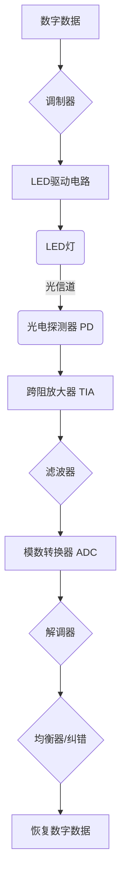

## 引言：光，不只是照明，更是数据载体

想象一下，你房间里的LED灯泡，在为你提供光明的同时，还能以极高的速度将互联网数据传输到你的电脑或手机上。这听起来像是科幻小说，但它正是可见光通信（Visible Light Communication, VLC）所描绘的未来图景。

在当今数字时代，无线通信已经渗透到我们生活的方方面面。然而，随着物联网、5G/6G技术以及万物互联的快速发展，传统的无线电频谱资源日益稀缺且拥堵。Wi-Fi 和蜂窝网络虽然强大，但在特定环境（如医院、飞机内部）中可能受到限制，或面临安全和频谱容量的挑战。

就在这时，我们抬头看到的光源——LED灯，为我们提供了一个全新的、未被充分利用的通信媒介。可见光通信，顾名思义，是利用可见光波段进行数据传输的技术。它不仅仅是无线电通信的补充，更可能成为未来高速、安全、绿色通信的重要组成部分。

作为一名技术和数学爱好者，我 qmwneb946 始终对这种将日常照明与前沿通信技术巧妙结合的创新感到着迷。今天，我将带领大家深入探讨可见光通信的原理、技术、挑战及应用前景，共同揭开这一“光速”通信方式的神秘面纱。

## 可见光通信：光的属性与潜力

### 什么是可见光？

要理解可见光通信，我们首先需要理解什么是可见光。可见光是电磁波谱中人眼可见的部分，通常波长范围在 380 纳米（紫色）到 780 纳米（红色）之间。与无线电波、微波、红外线和紫外线一样，可见光也是一种电磁辐射，以光速传播。

电磁波的基本特性由以下公式描述：
$$ c = \lambda f $$
其中，$c$ 是光速（约 $3 \times 10^8$ 米/秒），$\lambda$ 是波长，而 $f$ 是频率。这意味着波长越短，频率越高，反之亦然。可见光频谱的频率范围大约在 $4.3 \times 10^{14}$ Hz 到 $7.9 \times 10^{14}$ Hz，远高于目前使用的无线电频段（GHz 级别）。

### 为什么选择可见光作为通信介质？

可见光通信之所以备受关注，得益于其独特的优势：

1.  **巨大的频谱资源：** 可见光频谱的带宽高达 400 太赫兹（THz），相比之下，整个无线电频谱只有 300 吉赫兹（GHz），可见光频谱资源是无线电频谱的数千倍。这为实现超高数据传输速率提供了无限可能。
2.  **无需许可的频谱：** 可见光频段是未受管制的，可以免费使用，避免了无线电频谱拍卖的高昂成本和复杂的许可程序。
3.  **天然的安全性：** 光无法穿透不透明的墙壁。这意味着可见光通信具有天然的物理隔离特性。只要光线不外泄，信息就无法被外部窃取，这对于银行、军事、政府等对信息安全要求极高的场所尤为重要。
4.  **无电磁干扰：** 可见光通信不会产生电磁辐射，因此不会对飞机驾驶舱、医院精密医疗设备、核电站等对电磁兼容性有严格要求的环境造成干扰，是这些特殊场景的理想选择。
5.  **绿色环保与节能：** 现代LED灯具不仅用于照明，还能用于通信。这意味着可以利用现有的照明基础设施进行数据传输，实现“一物两用”，大大降低了额外部署通信设备的能耗和成本，符合绿色通信的发展趋势。
6.  **高精度定位：** 结合智能照明系统，VLC可以实现厘米甚至毫米级的室内定位，远超GPS在室内环境的精度。
7.  **水下通信优势：** 无线电波在水中衰减严重，而蓝绿可见光在水中的穿透力较强，使其成为水下通信的理想选择。

当然，VLC也面临一些挑战：
1.  **非穿墙性与视线限制（Line-of-Sight, LOS）：** 这既是优点也是缺点。光线不能穿透障碍物，使得VLC在非视距（Non-Line-of-Sight, NLOS）场景下性能受限，且易受遮挡影响。
2.  **环境光干扰：** 太阳光、普通灯光等环境光会产生噪声，影响接收信号的信噪比。
3.  **传输距离有限：** 由于光在空气中衰减，VLC的有效传输距离通常比Wi-Fi短。
4.  **双向通信挑战：** LED通常用于下行（从灯到设备），但设备上行（从设备到灯）的方案相对复杂，需要额外配备光发射器。
5.  **闪烁与调光：** 人眼对频率低于100Hz的光线闪烁敏感，同时照明需要调光。如何在不影响照明质量的前提下实现高速数据传输，是一个关键问题。

## VLC系统架构：光与电的舞蹈

一个典型的可见光通信系统由发射端、光信道和接收端三大部分组成。

### 发射端：用光说话的“喉舌”

VLC系统的发射端通常基于LED（Light Emitting Diode）灯。LED因其以下特性而成为VLC的理想选择：
*   **高开关速度：** 现代LED的开关速度可以达到纳秒级别，这使得它们能够快速响应电信号的变化，从而实现高频调制。
*   **高亮度与效率：** 能够提供足够的照明，并同时传输数据。
*   **长寿命与低功耗：** 相比传统白炽灯或荧光灯更节能耐用。

发射端的工作流程是：
1.  **数据输入：** 待传输的数字数据流进入系统。
2.  **调制：** 数字数据通过调制器转换为模拟电信号。这个模拟信号随后用于驱动LED。
3.  **LED驱动：** LED驱动电路根据调制后的电信号精确控制流过LED的电流强度。由于LED光的强度与流过它的电流成正比，改变电流就可以改变光强度，从而实现光信号的调制。

举例来说，最简单的调制方式是开关键控（On-Off Keying, OOK），其中“1”表示LED亮，“0”表示LED灭。为了避免人眼察觉到闪烁，这种开关操作的频率必须远高于人眼感知的阈值（通常为 100 Hz 以上）。

### 光信道：无形的“传输线”

光信道就是数据传输的物理路径，即光线在空气中传播的路径。它可能包含：
*   **直射路径（Line-of-Sight, LOS）：** 光线直接从发射LED到达接收器。这是最理想的路径，衰减最小。
*   **非直射路径（Non-Line-of-Sight, NLOS）：** 光线经过墙壁、天花板或家具反射后到达接收器。反射路径会导致信号的衰减、延迟扩展（多径效应）和扩散，从而降低信号质量。

信道中还存在其他影响因素：
*   **路径损耗：** 随着距离增加，光信号强度会减弱。
*   **环境光噪声：** 来自太阳光、荧光灯、白炽灯等其他光源的干扰，会降低接收端信号的信噪比（SNR）。
*   **阴影与遮挡：** 人体或物体遮挡会瞬间中断通信。

### 接收端：解读光信号的“耳朵”

VLC系统的接收端负责将接收到的光信号转换回电信号，并最终还原为原始数据。主要组件包括：
1.  **光电探测器（Photodetector, PD）：** 通常使用PIN光电二极管或雪崩光电二极管（APD）。它们能将接收到的光子转换为电荷，从而产生电流信号。PD的选择取决于所需的响应速度和灵敏度。
    *   **响应度（Responsivity, R）：** 定义为每单位光功率产生的电流，单位是A/W。
    *   **带宽：** 决定了PD能处理的最高频率。
2.  **跨阻放大器（Transimpedance Amplifier, TIA）：** 光电探测器产生的电流通常很微弱，TIA负责将其转换为电压信号并进行初步放大，同时降低噪声。
3.  **信号处理单元：**
    *   **滤波器：** 滤除高频噪声和低频环境光干扰。
    *   **模数转换器（ADC）：** 将模拟电压信号转换为数字信号。
    *   **解调器：** 根据发射端使用的调制方案，从数字信号中提取原始数据。
    *   **均衡器：** 补偿信道引起的信号失真（如多径效应）。
    *   **纠错编码器：** 检查并纠正传输过程中可能发生的错误。

### 典型VLC系统数据流：



## 关键技术：让光“能说会道”

### 调制技术：如何将数据编码到光中

调制是将信息信号加载到载波上的过程。在VLC中，光载波的强度是可调的，因此我们通常使用强度调制（Intensity Modulation, IM）。

#### 1. 开关键控 (On-Off Keying, OOK)
这是最简单直观的调制方式，如同电报的摩尔斯电码：
*   逻辑“1”表示LED亮起（高强度）。
*   逻辑“0”表示LED熄灭（低强度或完全熄灭）。

**优点：** 实现简单，成本低。
**缺点：**
*   **照明和通信耦合：** 当传输“0”时，灯光会变暗，影响照明均匀性。
*   **闪烁问题：** 如果数据流中连续的“0”或“1”过多，可能导致亮度长时间不变或快速开关，引发人眼可察觉的闪烁，尤其是在低数据速率时。
*   **直流偏置问题：** 为保证照明，LED不能完全熄灭，所以“0”通常是低亮度而非全黑，这限制了动态范围。

#### 2. 脉冲位置调制 (Pulse Position Modulation, PPM)
PPM将一个符号的信息编码在一个时间帧内脉冲出现的位置。例如，在四个可能的位置中，脉冲出现在不同位置代表不同的数据。
**优点：**
*   **抗环境光干扰能力强：** 因为它关注脉冲的“位置”而非绝对“强度”。
*   **节能：** 在一个符号周期内，LED只需要短暂地亮起。
*   **更低的闪烁：** 由于脉冲持续时间短，且每个符号周期内总有光发出，可以更好地控制平均亮度，从而减少闪烁。
**缺点：** 对时钟同步要求高，带宽效率相对较低。

#### 3. 脉冲宽度调制 (Pulse Width Modulation, PWM)
PWM通过改变脉冲的宽度来编码信息或控制平均亮度。它在LED调光中广泛应用。在VLC中，可以通过改变脉冲宽度来表示不同的数字值，或者结合OOK实现调光通信。
**优点：** 易于实现调光功能。
**缺点：** 传输速率受限于脉冲宽度的可调精度。

#### 4. 可变脉冲位置和宽度调制 (Variable Pulse Position and Width Modulation, VPPM)
VPPM是PPM和PWM的结合，用于同时实现数据传输和照明调光。它在一个符号周期内，脉冲的位置和宽度都可以携带信息。例如，脉冲位置编码数据，脉冲宽度控制亮度。
**优点：** 能够很好地兼顾照明和通信需求。

#### 5. 正交频分复用 (Orthogonal Frequency Division Multiplexing, OFDM)
OFDM是一种先进的调制技术，广泛应用于Wi-Fi、4G/5G等无线通信系统。它将高速数据流分解成多个并行、速率较低的子数据流，每个子数据流在正交的子载波上调制。
在VLC中，由于光的强度只能是正值（不能是负值），且我们只能控制强度（不能直接控制相位和频率，只能通过强度变化间接实现），因此需要使用特定的OFDM变体：
*   **直流偏置光OFDM (DC-biased Optical OFDM, DCO-OFDM)：** 为克服信号的负值部分，在OFDM信号上叠加一个正的直流偏置。
*   **非对称限幅光OFDM (Asymmetrically Clipped Optical OFDM, ACO-OFDM)：** 通过在发射端裁剪负值部分来处理。

**优点：**
*   **高频谱效率：** 多个子载波同时传输数据。
*   **抗多径干扰能力强：** 通过增加循环前缀（Cyclic Prefix）有效对抗多径效应。
*   **灵活：** 可以根据信道条件自适应地调整子载波的功率和调制方式。
**缺点：** 实现复杂度高，峰均功率比（PAPR）问题。

**OFDM 示例（概念代码）：**
虽然实际的OFDM实现非常复杂，涉及FFT/IFFT、信道估计、均衡等，但我们可以用一个简单的Python示例来概念性地展示其基本思想：将数据分配到多个“频率”上。

```python
import numpy as np
import matplotlib.pyplot as plt

# 简化版的OFDM概念演示
# 假设我们有4个子载波，每个子载波承载2比特数据 (QPSK调制)

def qpsk_modulate(bits):
    """
    简化的QPSK调制：2比特 -> 1个复数符号
    00 -> 1+0j
    01 -> 0+1j
    10 -> -1+0j
    11 -> 0-1j
    """
    if bits == '00': return 1 + 0j
    if bits == '01': return 0 + 1j
    if bits == '10': return -1 + 0j
    if bits == '11': return 0 - 1j
    return 0j

# 1. 原始比特流 (假设总共8比特，分配给4个子载波，每个2比特)
data_bits = ['01', '10', '00', '11'] # 4个2比特符号

# 2. 将比特流映射到QPSK符号 (每个子载波一个符号)
symbols = [qpsk_modulate(b) for b in data_bits]
print(f"原始比特数据: {data_bits}")
print(f"调制后的QPSK符号: {symbols}")

# 3. IFFT (逆傅里叶变换) 将频域符号转换到时域信号
# 假设有8个点用于IFFT，将4个符号映射到前4个点，后4个为共轭对称（用于实数输出）
# For real-valued output in DCO-OFDM, symbols need to be Hermitian symmetric.
# Here, we simplify for illustration purpose, assuming generic IFFT.
N_fft = 8 # FFT点数，通常是2的幂次

# 构建IFFT输入（频域信号）：
# 子载波1: symbols[0]
# 子载波2: symbols[1]
# 子载波3: symbols[2]
# 子载波4: symbols[3]
# 其他点填0或共轭对称以确保时域输出是实数（DCO-OFDM的关键）
# For simplicity, let's just use the first few points for now.
# Real OFDM needs to construct a Hermitian symmetric vector for IFFT
# [DC, subc_1, subc_2, ..., subc_N/2-1, 0, subc_N/2-1*, ..., subc_1*]
# Let's create a simplified IFFT input for conceptual understanding
ifft_input = np.zeros(N_fft, dtype=complex)
# 假设我们将数据放在子载波1-4 (索引1-4)
ifft_input[1:5] = symbols
# For real output, we'd need conjugate symmetry.
# Example: ifft_input[N_fft-k] = conj(ifft_input[k])
# For N_fft=8, ifft_input[5] = conj(ifft_input[3]), etc.
# But for simplicity, we'll just show the IFFT step.
# Let's make it Hermitian symmetric for a real output
ifft_input[0] = 0 # DC component (for pilot or real data)
ifft_input[1] = symbols[0]
ifft_input[2] = symbols[1]
ifft_input[3] = symbols[2]
ifft_input[4] = symbols[3]
ifft_input[5] = np.conj(symbols[3]) # Conjugate of subcarrier 4
ifft_input[6] = np.conj(symbols[2]) # Conjugate of subcarrier 3
ifft_input[7] = np.conj(symbols[1]) # Conjugate of subcarrier 2


time_domain_signal = np.fft.ifft(ifft_input)
print(f"IFFT输入 (频域): {ifft_input}")
print(f"IFFT输出 (时域原始信号): {time_domain_signal}")

# 4. 模拟光强度信号 (需要是实数且非负)
# 这是一个非常关键的步骤，因为光的强度不能为负值。
# DCO-OFDM会在时域信号上叠加一个直流偏置。
dc_bias = np.abs(np.min(time_domain_signal.real)) + 0.1 # 确保信号为正
optical_signal = time_domain_signal.real + dc_bias

print(f"时域光强度信号 (已加直流偏置): {optical_signal}")

# 绘图演示
plt.figure(figsize=(12, 6))

plt.subplot(2, 1, 1)
plt.stem(np.arange(len(ifft_input)), np.abs(ifft_input), use_line_collection=True)
plt.title('OFDM Symbols in Frequency Domain (IFFT Input)')
plt.xlabel('Subcarrier Index')
plt.ylabel('Amplitude')
plt.grid(True)

plt.subplot(2, 1, 2)
plt.plot(np.arange(len(optical_signal)), optical_signal, marker='o')
plt.title('Time Domain Optical Signal (After IFFT and DC Bias)')
plt.xlabel('Sample Index')
plt.ylabel('Optical Intensity')
plt.grid(True)
plt.tight_layout()
plt.show()

# 接收端（逆过程）：
# 1. 接收光信号，转换为电信号 (这里我们直接使用optical_signal作为接收到的信号)
# 2. 移除直流偏置
received_electrical_signal = optical_signal - dc_bias

# 3. FFT 将时域信号转换到频域
received_frequency_signal = np.fft.fft(received_electrical_signal)

# 4. 提取子载波符号
received_symbols = received_frequency_signal[1:5] # 对应发送的符号

print(f"\n接收到的频域符号 (子载波1-4): {received_symbols}")

# 5. 解调 (这里只是简单对比，实际需判决)
# 理论上，received_symbols 应该与 symbols 相似（考虑噪声和信道影响）
```
这段代码展示了OFDM从比特到频域符号，再通过IFFT到时域信号，并叠加直流偏置形成光强信号的简化过程。接收端则执行逆操作。实际的VLC-OFDM系统会复杂得多，需要考虑同步、信道估计、均衡、PAPR抑制等问题。

### 多址接入技术：如何让多个用户共享光信道

当多个用户需要同时访问VLC网络时，需要多址接入（Multiple Access）技术。
*   **时分多址 (Time Division Multiple Access, TDMA)：** 不同的用户在不同的时间段内传输数据。
*   **频分多址 (Frequency Division Multiple Access, FDMA)：** 不同的用户使用不同的光频率（如使用不同颜色的LED）或不同的子载波频率（在OFDM中）。
*   **码分多址 (Code Division Multiple Access, CDMA)：** 不同的用户使用不同的扩频码，通过相关检测来区分信号。

### MIMO技术：多根“天线”带来更高带宽

MIMO（Multiple-Input Multiple-Output）技术通过在发射端和接收端都使用多个LED和光电探测器来提高数据传输速率和链路可靠性。
*   **空间复用：** 不同的LED传输不同的数据流，接收端通过多个PD同时接收，可以显著提高系统吞吐量。
*   **空间分集：** 相同的LED信号通过多条路径传输，接收端合成这些信号，以提高信号的鲁棒性和可靠性。

VLC中的MIMO面临的挑战包括：LED和PD的精确对准、多径效应的复杂性、以及实现复杂性。

### 信道编码与纠错：保障数据准确无误

由于光信道容易受到环境光噪声、遮挡和多径效应的影响，传输过程中不可避免地会出现比特错误。信道编码（Channel Coding）和纠错（Error Correction Code, ECC）技术通过在发送数据中加入冗余信息，使得接收端能够检测甚至纠正这些错误。
常用的纠错码包括：前向纠错（Forward Error Correction, FEC）码，如卷积码、Turbo码、低密度奇偶校验码（LDPC）等。

## 解决VLC挑战：化弊为利

### 1. 闪烁与调光问题的解决

人眼对高于约100 Hz的闪烁不敏感。因此，VLC通常将数据调制在远高于此频率的载波上（例如 kHz 或 MHz 级别），使得人眼无法察觉到闪烁。

为了同时实现照明调光和数据传输，有几种策略：
*   **混合调光：** 结合恒定电流调光（调节LED电流）和PWM调光（高速开关）。数据可以调制在PWM的开关周期内。
*   **VPPM/O-OFDM：** 前面提到的VPPM和光OFDM变体（如DCO-OFDM）都能够在保持照明亮度的同时传输数据。DCO-OFDM通过叠加直流偏置确保光强为正，并通过调节偏置大小实现调光。

### 2. 环境光噪声的抑制

环境光（如太阳光、荧光灯）会引入大量的直流和低频噪声，显著降低VLC系统的信噪比。
应对措施包括：
*   **光学滤波器：** 在光电探测器前放置窄带光学滤波器，只允许特定波长的光通过，从而滤除大部分杂散光。
*   **电气滤波器：** 在TIA之后使用高通滤波器滤除直流和低频的环境光成分。
*   **差分接收：** 使用两个光电探测器，一个接收通信信号和环境光，另一个只接收环境光，然后将两个信号相减以消除环境光干扰。

### 3. 移动性管理与切换

由于VLC是视距（LOS）通信，用户移动时可能离开一个LED的覆盖范围，或遇到遮挡。
*   **多LED覆盖与切换：** 房间内布置多个LED，当用户移动时，设备可以在不同LED之间进行无缝切换（类似于蜂窝网络的切换）。
*   **光束追踪：** 对于需要高带宽的固定连接，可以使用机械或电子方式调整LED光束方向，以保持与设备的对准。
*   **多径信号利用：** 虽然多径会造成干扰，但在某些情况下，可以利用反射光来维持通信，提高覆盖范围，但这需要复杂的均衡技术。

### 4. 双向通信（上行链路）

目前VLC系统主要集中在下行链路（从灯到设备）。实现从设备到灯的上行链路是VLC走向普适性应用的关键。
*   **红外（IR）或射频（RF）上行：** 最常见的方式是使用传统的红外或射频（如蓝牙、Wi-Fi）作为上行链路，实现混合通信。
*   **可见光上行：**
    *   **反射式调制：** 设备不主动发光，而是通过调制反射LED光来实现数据回传。例如，使用液晶显示器或微镜阵列来调制反射光。
    *   **集成LED/PD：** 设备上安装小功率LED或PD阵列用于回传。
    *   **环境光调制：** 理论上可以通过调制接收到的环境光来进行回传，但这技术复杂度极高。

## VLC的应用前景：照亮万物互联

可见光通信的独特优势使其在多个领域展现出巨大的应用潜力。

### 1. 室内定位与导航 (Indoor Positioning System, IPS)
GPS在室内信号弱甚至无法使用，而VLC可以利用每个LED灯唯一的ID信息和光强信息，结合三角测量或指纹识别技术，实现厘米级的室内高精度定位。这对于商场、博物馆、医院、仓库、智能工厂等场所的导航、资产追踪和人流管理具有重要意义。

### 2. LiFi (Light Fidelity) 高速无线数据传输
LiFi是VLC的旗舰应用之一，旨在提供与Wi-Fi类似甚至更高的数据传输服务。通过将高速调制技术应用于每个LED灯，LiFi可以在局域网内提供超高带宽，且具有更强的安全性和抗干扰能力。
想象一下，未来你的家庭和办公室将不再需要路由器，每个灯具都是一个网络接入点，提供无处不在的光速互联网连接。

### 3. 车载通信 (Vehicle-to-Vehicle, V2V & Vehicle-to-Infrastructure, V2I)
汽车的前大灯、尾灯、刹车灯和交通信号灯都可以集成VLC模块。
*   **V2V：** 车辆之间可以互相通信，传递速度、位置、刹车意图等信息，提高驾驶安全，避免碰撞。例如，当一辆车紧急刹车时，其刹车灯不仅会亮起，还会通过VLC向后方车辆发送刹车信息。
*   **V2I：** 交通信号灯可以向车辆广播交通信息、路况更新、导航指令等，实现智能交通管理。
**优点：** 可靠性高，不受RF干扰，在某些环境下（如隧道）优于GPS。

### 4. 水下通信
无线电波在水中的衰减非常严重，但蓝绿可见光在水中的穿透力较强。VLC在水下机器人、潜水员通信、水下探测等领域具有无可替代的优势。它可以用于水下高清视频传输、数据回传等。

### 5. 医院与航空领域
这些场所对电磁辐射有严格限制，Wi-Fi和蜂窝网络的使用可能干扰医疗设备或飞机系统。VLC不产生电磁干扰，是这些RF敏感环境的理想选择，可以为医护人员、乘客提供安全的无线连接。

### 6. 物联网 (IoT) 设备
VLC可以为物联网设备提供低功耗、高密度、安全的短距离通信。例如，智能家居中的灯泡可以直接与各种传感器和执行器通信，实现智能联动。

### 7. 智慧城市与智慧家居
在智慧城市中，路灯可以兼作数据热点，提供城市级的LiFi覆盖，并收集环境数据。在智慧家居中，照明系统不仅提供照明，更是智能控制中心和数据传输枢纽。

## 标准化与未来展望

### IEEE 802.15.7 标准
可见光通信的标准化工作正在积极进行中。最重要的标准是 **IEEE 802.15.7**，它定义了VLC的物理层（PHY）和媒体访问控制层（MAC）规范，包括调制方案、数据速率、安全性和互操作性等方面。该标准旨在促进VLC技术的普及和兼容性。

### 面临的挑战与研究方向

尽管VLC潜力巨大，但仍面临一些挑战和广阔的研究空间：
1.  **双向通信的优化：** 实现高效、低成本、可靠的上行链路是VLC普及的关键。
2.  **移动性管理：** 如何在用户快速移动时保持通信的连续性和稳定性。
3.  **异构网络融合：** 将VLC与现有Wi-Fi、5G/6G蜂窝网络无缝集成，形成统一的通信生态系统。
4.  **能源效率与可持续性：** 在提供高速通信的同时，最大化能源利用效率。
5.  **LED技术进步：** 开发更高带宽、更高效率、更长寿命的LED光源。
6.  **光电探测器性能提升：** 提高PD的响应速度、灵敏度和抗噪声能力。
7.  **信号处理算法：** 研发更先进的调制解调、信道编码、均衡和多址接入算法，以应对复杂的信道环境。
8.  **安全性与隐私：** 尽管VLC具有物理隔离的优势，但仍需考虑更高级别的加密和认证机制。
9.  **标准化与商业化：** 进一步完善标准，推动VLC技术的大规模商业化应用。

## 结论：光，无处不在的连接者

可见光通信技术正从实验室走向我们生活的每个角落。它不仅仅是一种新兴的通信技术，更是一种对现有通信基础设施的颠覆性创新。通过将照明与通信融为一体，VLC不仅能够缓解无线电频谱拥堵的压力，提供更安全、更高效、更绿色的通信方式，还能为智能家居、智慧城市、自动驾驶、水下探测等诸多领域带来前所未有的可能性。

从最简单的OOK调制到复杂的OFDM和MIMO技术，VLC展现了将光这种我们日常生活中最常见、最普遍的元素转化为高效信息载体的巨大潜力。虽然挑战犹存，但随着LED、光电探测器和数字信号处理技术的不断进步，我们有理由相信，在不久的将来，可见光通信将真正“照亮”我们的数字生活，成为万物互联世界中不可或缺的一部分。光，不再仅仅是光明，更是连接世界的桥梁。