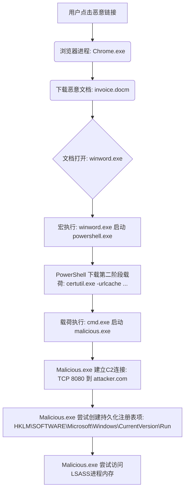

大家好，我是 qmwneb946，你们的老朋友，也是你们在技术海洋中探索的同行者。今天，我们要深入探讨一个在现代网络安全领域至关重要的概念——EDR，即“端点检测与响应”（Endpoint Detection and Response）。在当前威胁日益复杂、攻击手段层出不穷的时代，EDR不再仅仅是一个可选项，它已成为任何组织构建坚固防线的核心基石。

从最初的病毒扫描到如今涵盖行为分析、机器学习与主动狩猎的EDR，端点安全领域经历了翻天覆地的变化。传统杀毒软件在面对高级持续性威胁（APT）、无文件攻击和多态恶意软件时显得力不从心。我们不再满足于仅仅阻止已知的坏人进入，而是需要更强大的能力来监测、识别、调查并响应那些成功绕过初始防御的威胁。

这篇博客，我将带大家从EDR诞生的背景出发，层层剖析其核心概念、技术架构、深度检测原理，并通过实际工作流的视角，理解EDR如何在复杂的网络攻击中抽丝剥茧，最终实现快速响应与恢复。我们还将探讨EDR与各类安全解决方案的关系，并展望其未来的发展方向。准备好了吗？让我们一起开启这场技术深度之旅！

## EDR诞生前的网络安全格局

在EDR概念浮出水面之前，端点安全领域主要依赖于几种传统的防御机制。它们在各自的历史阶段发挥了重要作用，但随着威胁的演进，其局限性也日益凸显。

### 传统杀毒软件的局限性

上世纪八九十年代，计算机病毒开始大规模传播，催生了杀毒软件（Antivirus, AV）的出现。最初的AV产品主要依赖于“特征码”（Signatures）进行检测。

**特征码检测原理：**
杀毒软件维护一个庞大的病毒特征库。当文件被创建、打开或执行时，AV会计算其哈希值或扫描其特定字节序列，并与特征库中的已知恶意软件特征进行比对。如果匹配成功，则判定为病毒并进行隔离或清除。

这种方式可以被简单地理解为模式匹配。例如，一个恶意软件可能包含一段特定的二进制代码序列：
`0x4D 0x5A 0x90 0x00 ... 0xEB 0xFE`

杀毒软件会扫描文件，查找与此序列完全匹配的部分。

**其核心数学概念是哈希函数和字符串匹配算法。**
哈希函数 $H(M)$ 将任意长度的消息 $M$ 映射为固定长度的哈希值。恶意软件的哈希值如果与已知恶意软件的哈希值 $H(V)$ 相等，则被认为是病毒。
$$ H(M) = H(V) \implies M \text{ 是病毒} $$
然而，哈希碰撞的存在以及恶意软件的微小修改会导致哈希值变化。

字符串匹配算法，如Knuth-Morris-Pratt (KMP) 或 Boyer-Moore 算法，用于在文件中高效地查找特定的特征码。
$$ \text{Find } P \text{ in } T $$
其中 $P$ 是特征码模式，$T$ 是待扫描的文件内容。

**然而，这种方法的局限性显而易见：**
1.  **无法检测零日攻击（Zero-Day Exploits）：** 特征库是基于已知威胁构建的。对于从未出现过的新型恶意软件或利用未知漏洞的攻击，AV无能为力。
2.  **多态性与变种：** 恶意软件开发者不断通过代码混淆、加密、加壳等技术生成多态变种，每次执行时其特征码可能都不同，导致特征码检测失效。
3.  **无文件攻击（Fileless Malware）：** 这类攻击不将恶意代码写入磁盘文件，而是直接在内存中执行，或利用系统自带的合法工具（如PowerShell, WMIC）进行恶意操作，传统AV难以察觉。
4.  **高级持续性威胁（APT）：** APT攻击通常是高度定制化、隐蔽性强、潜伏期长，旨在规避传统防御。它们可能只进行少量、缓慢的恶意活动，模仿正常用户行为，难以被特征码或简单的行为规则发现。

### SIEM与HIDS：各有侧重

在传统AV之外，还有一些安全工具致力于提供更广阔的视野或更精细的监控。

*   **安全信息与事件管理（SIEM）：**
    SIEM旨在聚合来自网络、服务器、安全设备（防火墙、IDS/IPS）和应用程序等各种源的日志数据。它通过关联分析这些日志，帮助安全团队识别潜在的威胁。SIEM的优势在于其宏观的视图，能够将来自不同源的零散信息拼凑起来。
    但SIEM的缺点也很明显：
    *   **缺乏深度上下文：** 它主要处理日志，可能无法获取到端点上进程的详细行为、内存活动等深层数据。
    *   **依赖于日志质量：** 如果源系统日志记录不完整或格式不一致，SIEM的分析效果会大打折扣。
    *   **响应能力有限：** SIEM本身不具备直接在端点上执行响应操作的能力。

*   **基于主机的入侵检测系统（HIDS）：**
    HIDS专注于监控单个主机上的活动，包括文件完整性、系统调用、注册表变化、用户登录等。它通常基于预设规则进行检测，并在发现可疑活动时发出警报。
    HIDS在一定程度上弥补了传统AV的不足，但仍有局限：
    *   **规则更新滞后：** 规则通常是人工维护的，无法快速适应新威胁。
    *   **误报率高：** 过于严格的规则可能导致大量误报，消耗分析师精力。
    *   **缺少自动化响应：** HIDS主要用于检测，缺乏自动化的响应和取证能力。

因此，在传统的防御体系中，端点虽然是攻击的最终目标，但其内部活动的可见性却非常有限，缺乏深度分析和快速响应的能力。这为EDR的出现奠定了基础。

## EDR是什么？核心概念解析

EDR（Endpoint Detection and Response），即“端点检测与响应”，是现代网络安全体系中不可或缺的一环。它超越了传统杀毒软件的预防范畴，专注于在威胁成功突破第一道防线后，对端点上的可疑活动进行持续监控、深度检测、快速调查和自动化响应。

### 定义与目标

EDR系统通过在端点上部署轻量级代理，持续收集并记录所有关键的安全相关事件（如进程活动、文件操作、网络连接、注册表修改等），然后将这些数据传输到中央分析平台进行实时分析、威胁检测、关联和上下文丰富。其核心目标是：

1.  **提高可见性：** 彻底消除端点上的安全盲区，让一切活动可被追踪。
2.  **加速检测：** 快速识别高级威胁、零日攻击和无文件攻击。
3.  **赋能调查：** 提供详细的事件时间线和攻击链，帮助安全分析师进行根因分析。
4.  **实现快速响应：** 在威胁扩散前，自动化或人工地采取遏制和修复措施。
5.  **支持威胁狩猎：** 基于收集的数据主动搜索潜在的、未被发现的威胁。

简单来说，如果把网络安全比作一场攻防战，传统AV是城墙和哨兵，试图阻止敌人进入；而EDR则是部署在城内每个角落的“智能摄像头+监控中心+快速反应部队”，它不仅能看到敌人的每一个动作，还能分析其意图，追踪其路径，并迅速采取行动。

### EDR的四大核心能力

EDR的强大之处，体现在其四大核心能力上，这些能力相互协同，构建了一个完整的安全闭环。

#### 数据收集与可见性

这是EDR的基石。EDR代理在端点上持续监控并收集各种与安全相关的活动数据，就像一个无形的“黑匣子记录仪”。这些数据是后续所有分析和响应的基础。

**采集的数据类型包括但不限于：**
*   **进程活动：** 进程的创建、终止、父子关系、命令行参数、注入行为、内存使用。例如，`notepad.exe` 启动了 `cmd.exe`，然后 `cmd.exe` 尝试连接外部IP，这可能是一个可疑行为。
*   **文件系统活动：** 文件的创建、修改、删除、重命名，文件访问权限的改变。例如，大量文件在短时间内被加密，可能是勒索软件活动。
*   **网络连接：** 所有的入站和出站连接、目标IP地址、端口、协议、传输数据量。例如，一个正常的应用程序尝试连接到一个恶意IP地址。
*   **注册表修改：** 系统注册表键值的添加、删除或修改，尤其是那些与持久性机制、启动项相关的键值。例如，一个程序尝试修改 `Run` 键以实现自启动。
*   **用户活动：** 用户登录/登出、权限变更、账户枚举。
*   **系统调用和API使用：** 监控底层系统调用和应用程序编程接口（API）的调用序列，这对于检测无文件恶意软件和进程注入至关重要。

**数据收集的挑战：**
*   **性能影响：** 持续收集大量数据不能显著影响端点性能。
*   **数据量巨大：** 如何高效存储和传输这些海量数据。
*   **噪音过滤：** 大量正常系统活动产生的事件如何与恶意事件区分。

#### 威胁检测

收集到的海量数据需要经过智能分析才能揭示威胁。EDR采用多种先进技术来识别可疑模式和恶意活动，远超传统签名检测。

**主要检测技术包括：**
*   **行为分析：** 监控并识别与已知攻击模式或异常行为相符的活动序列。例如，一个Word文档启动了PowerShell进程，并且PowerShell尝试下载可执行文件。
*   **机器学习（ML）与人工智能（AI）：** 训练模型来识别正常行为的基线，并检测偏离基线的异常行为。ML可以发现人眼难以察觉的复杂模式。
*   **指标匹配（IOCs/IOAs）：**
    *   **IOCs (Indicators of Compromise)：** 基于已知恶意文件哈希、恶意IP地址、恶意域名等静态指标进行匹配。
    *   **IOAs (Indicators of Attack)：** 识别攻击的意图或阶段性行为，例如进程注入、凭证窃取尝试、持久性机制建立等动态指标。
*   **威胁情报融合：** 与外部威胁情报平台（如MITRE ATT&CK、VirusTotal、商业威胁情报源）集成，利用最新的全球威胁信息来增强检测能力。

#### 调查与分析

当检测引擎发现可疑活动并发出警报时，EDR系统提供强大的工具来帮助安全分析师进行深入调查。这包括：

*   **攻击链可视化：** 将孤立的事件关联起来，形成完整的攻击时间线和逻辑链条，揭示攻击的各个阶段（初始访问、执行、持久化、提权、横向移动、数据窃取等）。
*   **上下文丰富：** 为每个事件提供丰富的上下文信息，如涉及的进程、用户、文件、网络连接、父进程等，帮助分析师理解事件的来龙去脉。
*   **历史数据查询：** 能够回溯查看历史事件数据，以便追溯攻击的源头和范围。
*   **文件分析与沙盒集成：** 对于可疑文件，可以自动提交到沙盒环境进行动态分析，获取其真实行为报告。

通过这些功能，分析师可以迅速回答关键问题：“发生了什么？如何发生的？影响了哪些系统？攻击者是谁？”，从而大大缩短威胁响应时间。

#### 响应与修复

EDR的核心价值在于其“响应”能力。一旦威胁被确认，EDR可以提供快速且精准的响应措施，以遏制威胁、消除危害并进行恢复。

**常见的响应操作包括：**
*   **进程终止：** 强制停止恶意进程的运行。
*   **文件隔离/删除：** 将恶意文件或可疑文件隔离，阻止其进一步执行，或直接删除。
*   **网络隔离：** 将受感染的端点与网络隔离，防止威胁横向扩散。
*   **注册表项恢复：** 撤销恶意程序对注册表的修改。
*   **用户账户禁用：** 禁用被劫持的用户账户。
*   **取证数据收集：** 自动收集内存转储、文件、日志等取证数据，以便后续深入分析。
*   **系统回滚/恢复（部分EDR功能）：** 将系统状态恢复到攻击发生前的某个正常时间点。

这些响应措施可以由分析师手动触发，也可以根据预设的规则进行自动化。自动响应可以极大地缩短MTTR（Mean Time To Respond，平均响应时间），尤其是在大规模爆发或非工作时间。

#### 主动威胁狩猎

除了被动地等待警报，EDR还支持主动的“威胁狩猎”（Threat Hunting）。安全分析师利用EDR收集的原始数据和查询能力，主动搜索环境中潜在的、未被发现的威胁，而不是仅仅依赖自动化检测。

**威胁狩猎的特点：**
*   **假设驱动：** 分析师基于威胁情报、TTPs（策略、技术和程序）或领域知识，提出假设并验证。
*   **迭代探索：** 通过编写复杂的查询语句，在海量数据中寻找异常模式或攻击迹象。
*   **专家经验：** 高级威胁狩猎需要具备深厚的安全知识和分析能力。

例如，一个猎手可能会查询：“过去24小时内，所有从 `C:\Users\Public` 目录下启动，并尝试建立外部网络连接的进程。”这类查询可以揭示那些被传统检测绕过的隐蔽威胁。

EDR的这五大能力共同构成了其在现代网络安全防御体系中的核心地位，使其能够有效应对日益复杂和隐蔽的网络攻击。

## EDR的架构与工作原理

EDR系统通常由两大部分组成：部署在各个端点上的轻量级代理，以及负责数据处理、分析、告警和管理任务的中央平台（通常是云端）。

### 端点代理：安全数据的第一道防线

端点代理是EDR系统的“眼睛”和“耳朵”，它运行在每个受保护的设备上（如PC、服务器、虚拟机等），负责实时监控并收集各种系统活动数据。

#### 数据类型与采集机制

代理收集的数据通常包括：

*   **进程相关事件：**
    *   进程创建、终止：`ProcessId`, `ParentProcessId`, `ImageFullPath`, `CommandLine`, `User`
    *   模块加载/卸载：`DllPath`, `BaseAddress`
    *   进程注入（跨进程内存操作）
*   **文件相关事件：**
    *   文件创建、读取、写入、删除：`FilePath`, `ProcessId`, `ActionType`
    *   文件哈希值：`MD5`, `SHA1`, `SHA256`
*   **注册表相关事件：**
    *   注册表键创建、修改、删除：`KeyPath`, `ValueName`, `NewValue`, `ProcessId`
*   **网络相关事件：**
    *   网络连接建立、关闭：`ProcessId`, `LocalIP`, `LocalPort`, `RemoteIP`, `RemotePort`, `Protocol`
    *   DNS查询：`ProcessId`, `DomainName`
*   **系统事件：**
    *   用户登录/登出：`Username`, `LogonType`
    *   权限修改：`ObjectName`, `PermissionChange`

**采集机制：**
EDR代理通过操作系统的底层接口（Hooking）来捕获这些事件。
*   **Windows：** 主要依赖于Windows事件跟踪（Event Tracing for Windows, ETW）、Minifilter驱动（用于文件系统和注册表监控）、以及通过内核回调或用户态API Hooking来监控进程和网络活动。例如，通过注册`PsSetCreateProcessNotifyRoutineEx`回调函数来监控进程创建。
*   **Linux：** 通常利用eBPF（Extended Berkeley Packet Filter）技术在内核中捕获系统调用、网络包等事件，或通过Audit Daemon、inotify等机制。
*   **macOS：** 类似地，利用Endpoint Security Framework、DTrace或内核扩展（KEXT，但逐渐被ESF替代）来获取事件。

**伪代码示例：EDR代理如何监控进程创建**

```cpp
// 假设这是一个简化的Windows内核驱动代码片段
// 用于监控进程创建事件

#include <ntddk.h>

// 全局变量，用于保存进程创建通知例程的注册状态
PVOID g_PsCreateProcessNotifyRoutineRegistration = NULL;

// 进程创建通知回调函数
VOID
PsCreateProcessNotifyRoutineEx(
    _Inout_ PEPROCESS Process,
    _In_ HANDLE ProcessId,
    _In_opt_ PPS_CREATE_NOTIFY_INFO CreateInfo
)
{
    UNREFERENCED_PARAMETER(Process);

    if (CreateInfo)
    {
        if (CreateInfo->FileOpenNameAvailable)
        {
            // 获取进程创建的详细信息
            // 这是一个新进程创建事件
            DbgPrint("EDR Agent: New Process Created!\n");
            DbgPrint("  Process ID: %u\n", (ULONG)ProcessId);
            DbgPrint("  Parent Process ID: %u\n", (ULONG)CreateInfo->ParentProcessId);
            DbgPrint("  Image File Name: %wZ\n", CreateInfo->ImageFileName);
            DbgPrint("  Command Line: %wZ\n", CreateInfo->CommandLine);
            DbgPrint("  Creating User SID: %wZ\n", &CreateInfo->SecurityDescriptor->Owner); // 需要进一步解析SID
            
            // 这里可以将这些信息打包并发送到中央分析平台
            // 例如，通过网络TCP连接或共享内存发送
            // SendDataToCentralPlatform(ProcessId, CreateInfo->ParentProcessId, ...);
        }
    }
}

// 驱动入口点
NTSTATUS
DriverEntry(
    _In_ PDRIVER_OBJECT DriverObject,
    _In_ PUNICODE_STRING RegistryPath
)
{
    UNREFERENCED_PARAMETER(DriverObject);
    UNREFERENCED_PARAMETER(RegistryPath);

    NTSTATUS status = STATUS_SUCCESS;

    DbgPrint("EDR Agent: DriverEntry called.\n");

    // 注册进程创建通知例程
    status = PsSetCreateProcessNotifyRoutineEx(PsCreateProcessNotifyRoutineEx, FALSE);
    if (!NT_SUCCESS(status))
    {
        DbgPrint("EDR Agent: Failed to register process notify routine. Status: 0x%X\n", status);
    } else {
        g_PsCreateProcessNotifyRoutineRegistration = PsCreateProcessNotifyRoutineEx;
        DbgPrint("EDR Agent: Process notify routine registered successfully.\n");
    }

    // 驱动卸载例程 (简略)
    DriverObject->DriverUnload = DriverUnload;

    return status;
}

// 驱动卸载点
VOID
DriverUnload(
    _In_ PDRIVER_OBJECT DriverObject
)
{
    UNREFERENCED_PARAMETER(DriverObject);

    DbgPrint("EDR Agent: DriverUnload called.\n");

    // 注销进程创建通知例程
    if (g_PsCreateProcessNotifyRoutineRegistration) {
        PsSetCreateProcessNotifyRoutineEx(g_PsCreateProcessNotifyRoutineRegistration, TRUE);
        DbgPrint("EDR Agent: Process notify routine unregistered.\n");
    }
}
```
这个伪代码展示了EDR代理如何在Windows内核层面捕获进程创建事件。通过注册相应的回调函数，操作系统会在每次进程创建时通知代理，从而获取到诸如进程ID、父进程ID、命令行参数等关键信息。这些信息经过处理后会被发送到中央分析平台。

#### 深入理解内核级监控

为什么EDR代理需要深入到内核级别进行监控？
1.  **完整性与可靠性：** 内核是操作系统的核心，大多数重要的系统活动（如文件操作、进程管理、网络通信）最终都通过内核完成。在内核级别进行监控，可以捕获到最原始、最全面的事件数据，防止恶意软件绕过用户态的监控。
2.  **抗篡改性：** 恶意软件通常会尝试终止或篡改用户态的安全程序。而内核态的代理由于运行在特权模式下，更难以被普通恶意软件直接篡改或终止。
3.  **可见性：** 许多高级攻击，特别是无文件攻击和进程注入，其恶意活动发生在内存中，或利用底层系统调用。内核级监控能够提供对这些低层次活动的可见性。

当然，内核级代理的开发和维护也更复杂，对稳定性和性能的要求极高，一旦出现问题，可能会导致系统蓝屏（BSOD）。

### 云端分析平台：大脑与智慧中心

代理收集到的原始事件数据被安全地传输到中央分析平台。这个平台是EDR的“大脑”，负责接收、存储、处理、分析海量数据，并最终识别威胁、发出告警、管理响应。

#### 大数据存储与处理

EDR平台每天需要处理PB级别的数据。为了应对这种规模，它通常采用：
*   **分布式存储系统：** 例如HDFS、AWS S3或Azure Blob Storage，用于存储大量的原始和处理过的数据。
*   **分布式计算框架：** 例如Apache Spark、Kafka，用于实时数据流处理和批处理分析。
*   **高性能数据库：** 例如Elasticsearch（用于快速搜索和分析事件）、Cassandra或ClickHouse（用于时序数据存储）。

数据在传输到平台后，首先会经过**规范化（Normalization）**和**丰富化（Enrichment）**。
*   **规范化：** 将来自不同操作系统和事件源的原始数据统一为标准格式，便于后续的统一分析。
*   **丰富化：** 为事件添加额外的上下文信息，如关联的资产信息、用户身份、地理位置、威胁情报（IP信誉、域名信誉等）。例如，一个外部IP地址如果被标记为已知恶意IP，则该连接事件会被丰富上“恶意”的标签。

#### AI/ML引擎

EDR的核心检测能力之一依赖于强大的AI/ML引擎。
*   **监督学习：** 用于识别已知类型的恶意软件或攻击模式。例如，对大量已知恶意文件和正常文件的特征（文件熵、API调用序列、导入导出表等）进行训练，构建分类模型（如SVM、随机森林、神经网络），以区分新文件是否为恶意。
*   **非监督学习：** 用于异常检测和发现未知威胁（零日攻击）。通过学习正常系统行为的基线，任何显著偏离基线的活动都会被标记为异常。例如，一个过去从未执行过网络连接的进程突然尝试连接到外部服务器。
*   **深度学习：** 对于更复杂的行为模式和更抽象的特征提取有优势，例如分析进程的系统调用序列模式，识别隐蔽的注入技术。

**示例：基于行为序列的ML检测**
假设我们收集了进程的系统调用序列，并将其表示为特征向量。
对于一个进程 $P$，其行为序列 $S = (c_1, c_2, ..., c_n)$，其中 $c_i$ 是一个系统调用。
我们可以将这个序列转换为一个特征向量 $\mathbf{x} \in \mathbb{R}^D$，输入到分类器 $f(\mathbf{x})$ 中：
$$ \text{Maliciousness} = f(\mathbf{x}) $$
其中 $f$ 可以是一个神经网络或支持向量机。训练数据包括正常进程的行为序列和已知恶意进程的行为序列。

#### 威胁情报融合

EDR平台会持续从各种威胁情报源（商业情报、开源情报、政府机构发布的情报等）获取最新的IOCs和TTPs。这些情报被用于增强检测规则和模型，确保EDR能够识别最新的攻击手法和已知的恶意基础设施。通过STIX/TAXII等标准协议进行信息交换。

#### 用户界面与API

分析平台还提供一个直观的用户界面（UI），供安全分析师查看告警、进行调查、执行响应操作。此外，EDR通常提供丰富的API接口，以便与SIEM、SOAR（Security Orchestration, Automation and Response）平台、ITSM（IT Service Management）系统等其他安全工具进行集成，实现安全运营的自动化和协同。

### EDR的部署模式：云原生与混合模式

随着云计算的普及，EDR的部署模式也在演进。

*   **云原生EDR：**
    所有核心分析和管理功能都在云端运行。
    **优势：**
    *   **高可伸缩性：** 轻松应对海量数据和快速增长的端点数量。
    *   **快速更新与部署：** 新的检测规则、ML模型和功能可以快速分发到所有用户。
    *   **全球威胁情报：** 集成来自全球用户的数据，形成更强大的威胁情报网络。
    *   **降低本地IT负担：** 无需本地服务器和维护。
    *   **远程管理：** 随时随地管理和响应威胁。
    **劣势：**
    *   **数据主权与合规性：** 数据存储在云端可能面临某些国家或行业的合规要求挑战。
    *   **网络带宽依赖：** 大量数据上传需要足够的带宽。

*   **混合EDR：**
    一部分核心功能（如数据存储、初步处理）部署在客户本地数据中心，而另一部分（如高级ML分析、威胁情报共享）则利用云端能力。
    **优势：**
    *   **数据控制：** 敏感数据可以保留在本地，满足合规要求。
    *   **带宽优化：** 减少需要上传到云端的数据量。
    *   **对现有基础设施的兼容性。**
    **劣势：**
    *   **部署和管理更复杂。**
    *   **扩展性不如纯云原生。**

选择哪种部署模式取决于组织的规模、合规性要求、IT资源以及安全需求。

## EDR深度检测技术解析

EDR之所以能超越传统AV，关键在于其深度且多维度的检测技术。这些技术相互结合，构建了一道从行为到意图的立体防御网。

### 行为分析：洞察恶意意图

行为分析是EDR检测的核心。它不是看文件本身是否匹配已知特征，而是监控进程、文件、网络等实体在特定时间内的行为模式，从而判断其意图是否恶意。这对于零日攻击和无文件攻击尤其有效。

#### 进程行为监控

*   **父子进程关系：** 正常情况下，`cmd.exe` 不应该由 `excel.exe` 启动。如果出现 `excel.exe` 启动 `cmd.exe`，而 `cmd.exe` 又启动 `powershell.exe`，这可能是一个宏病毒攻击链的迹象。EDR会建立一个进程树来可视化这些关系。
*   **进程注入：** 恶意代码经常通过将自身注入到合法进程（如 `explorer.exe` 或 `svchost.exe`）的内存空间中来隐藏。EDR通过监控内存分配、写入和线程创建等API调用，识别异常的跨进程内存操作。
    *   例如，一个非特权进程尝试向另一个高权限进程注入代码，并创建远程线程执行。
*   **权限提升：** 监控进程尝试获取更高权限的行为，如使用系统漏洞、窃取令牌等。
*   **命令行参数分析：** 许多合法工具（如 `certutil`, `bitsadmin`, `powershell`）可以被恶意使用。EDR会分析它们的命令行参数，识别出恶意用途。例如，`powershell.exe -NoP -NonI -Exec Bypass -EncodedCommand ...` 这样的参数组合，通常是恶意脚本的特征。

#### 文件与注册表行为监控

*   **异常文件创建/修改：**
    *   勒索软件：大量文件在短时间内被加密，文件名或扩展名被修改。EDR可以检测到对大量文件进行加密读写操作，尤其是对用户文档目录下的文件。
    *   持久化机制：恶意软件可能在启动目录、注册表Run键、服务、计划任务等位置创建或修改文件/注册表项，以实现在系统重启后自动运行。
*   **不常见文件类型执行：** 阻止或告警可疑位置执行的DLL文件或未知类型的可执行文件。
*   **凭证窃取：** 监控对LSASS进程内存的访问尝试，这是Mimikatz等工具常用的窃取凭证方法。

#### 网络行为分析

*   **异常网络连接：** 监控进程建立的网络连接，如果目标IP/域名被标记为恶意C2（命令与控制）服务器，或通信协议异常（例如，一个正常程序使用非标准端口通信）。
*   **DNS隧道：** 检测通过DNS查询传输数据的行为，这是隐蔽通信的一种手段。
*   **数据外传：** 检测异常的大量数据传输到外部或非标准位置，例如，压缩文件被上传到云存储服务。

### 机器学习与人工智能：从海量数据中发现模式

行为分析结合ML/AI，能够将检测能力提升到新的高度。ML模型能够处理海量复杂数据，发现人类难以察觉的关联和模式，并适应新的攻击变种。

#### 监督学习与非监督学习

*   **监督学习（Supervised Learning）：**
    用于训练模型识别已知类型的威胁。需要大量的已标注数据（已知恶意样本和已知正常样本）。例如，训练一个分类器来判断一个文件是否是恶意文件。
    特征可能包括：文件头信息、导入函数、文件熵、字符串模式等。
    模型：支持向量机（SVM）、随机森林（Random Forest）、梯度提升树（Gradient Boosting Trees）、神经网络。

*   **非监督学习（Unsupervised Learning）：**
    主要用于异常检测。模型在没有标签的数据上学习数据的内在结构和正常行为的基线。任何显著偏离这个基线的活动都被认为是异常。这对于发现零日攻击和未知威胁非常有效。
    例如，使用聚类算法（如K-means, DBSCAN）来发现行为模式相似的进程群，并识别出远离这些群体的孤立异常进程。或者使用自编码器（Autoencoders）来学习正常数据的表示，然后根据重建误差来判断异常。

#### 深度学习的应用

深度学习（Deep Learning）作为机器学习的一个分支，在处理序列数据和高维特征方面表现出色。
*   **序列行为分析：** 将进程的系统调用序列、API调用序列视为时序数据，使用循环神经网络（RNN，特别是LSTM）或Transformer模型来学习正常的行为模式，并识别出恶意行为序列。
*   **特征提取：** 深度学习模型可以自动从原始数据中学习和提取高级特征，而无需人工进行复杂的特征工程。例如，从二进制文件中直接提取恶意特征，而不是依赖于预定义的启发式规则。

**数学公式：简单自编码器（Autoencoder）用于异常检测**
假设我们有一个输入数据点 $\mathbf{x} \in \mathbb{R}^D$ (例如，表示进程行为的特征向量)。
自编码器包含一个编码器 $E$ 和一个解码器 $D$。
编码器将输入映射到低维的潜在空间：
$$ \mathbf{z} = E(\mathbf{x}) $$
解码器将潜在表示映射回原始空间：
$$ \mathbf{\hat{x}} = D(\mathbf{z}) $$
训练目标是最小化重建误差，例如均方误差 (MSE)：
$$ \mathcal{L}(\mathbf{x}, \mathbf{\hat{x}}) = ||\mathbf{x} - \mathbf{\hat{x}}||^2 $$
在训练过程中，模型学习如何高效地重建正常数据。当遇到异常数据时，由于其与正常数据的分布不同，模型将无法很好地重建它，导致重建误差显著增大。
设定一个阈值 $\tau$：
$$ ||\mathbf{x} - D(E(\mathbf{x}))||^2 > \tau \implies \text{异常} $$

#### 特征工程与模型训练

ML模型的性能高度依赖于高质量的特征。EDR系统需要进行复杂的特征工程，从原始事件数据中提取有意义的、能够区分正常与恶意的特征。
*   **统计特征：** 进程运行时间、CPU使用率、内存占用、网络连接数、文件读写速率等。
*   **结构特征：** 进程树的深度、文件路径的熵值、注册表键的嵌套深度。
*   **语义特征：** API调用序列、命令行参数中的关键字、文件名模式。

模型训练通常在一个庞大的、持续更新的数据集上进行。为了避免过拟合和提高泛化能力，会采用交叉验证、正则化等技术。

### 指标体系：从IOC到IOA

EDR的检测策略不仅依赖于行为分析和ML，还广泛应用指标体系。

#### IOC：已知威胁的指纹

**IOC (Indicator of Compromise)** 是入侵指标，指示系统已经遭受攻击。它们通常是静态的、具体的、可量化的数字指纹。
*   **文件哈希值：** `MD5`, `SHA256` (例如，`b58b29c95d9a5b3a8c7b6f7a6b5c4d3e`)
*   **IP地址：** (例如，`192.168.1.100` 或 `8.8.8.8`)
*   **域名：** (例如，`malicious-c2.com`)
*   **URL：** (例如，`http://evil.site/malware.exe`)
*   **注册表键：** (例如，`HKLM\SOFTWARE\Microsoft\Windows\CurrentVersion\Run\Malware`)
*   **文件名：** (例如，`svchost.exe` 放置在非系统目录)

IOCs的优点是检测准确、易于自动化，但缺点也很明显：它们是事后（攻击发生后被识别）的，且容易被攻击者修改。

#### IOA：攻击意图的画像

**IOA (Indicator of Attack)** 是攻击指标，它关注的是攻击的**行为模式**和**意图**，而不是特定的签名。IOAs是动态的、基于行为的。它们更难以规避，因为它们描述的是攻击者为了达成目标而采取的通用技术和程序（TTPs）。
*   **进程注入：** 一个进程尝试向另一个进程注入代码。
*   **凭证窃取尝试：** 访问LSASS进程内存或通过API调用获取凭证。
*   **数据加密行为：** 大量文件被加密或扩展名被修改。
*   **横向移动尝试：** 通过SMB、WMI或RDP等协议在网络内尝试连接其他主机。
*   **Ransomware行为：** 文件读取、加密、删除的组合模式。
*   **持久化尝试：** 写入特定的注册表启动项或创建计划任务。

IOA是EDR行为检测的核心，它使得EDR能够识别多态恶意软件、无文件攻击和零日攻击。

### 威胁情报的融合

EDR系统通过集成全球和行业特定的威胁情报源，不断更新其对最新威胁的认知。威胁情报（Threat Intelligence, TI）提供了关于攻击者、他们的TTPs、恶意IP、域名和文件哈希的最新信息。

*   **IOCs feed：** 实时同步最新的恶意文件哈希、C2服务器IP等。
*   **TTPs信息：** 结合MITRE ATT&CK框架，理解攻击者常用的技术和策略。
*   **上下文丰富：** 威胁情报可以为告警事件提供更多背景信息，例如，一个IP地址被标记为属于某个已知的APT组织，则相关告警的优先级将大大提高。

通过标准协议如STIX（Structured Threat Information Expression）和TAXII（Trusted Automated eXchange of Indicator Information），EDR平台能够自动化地摄取和应用这些情报。

### 上下文关联与攻击链重建

EDR不仅仅是检测孤立的事件，更重要的是将这些离散的事件关联起来，形成完整的攻击链（Kill Chain）。

*   **进程树：** 可视化进程的父子关系，理解进程是如何被启动的，以及它们之间的依赖关系。
*   **事件时间线：** 将所有相关事件按照时间顺序排列，清晰展现攻击者在不同阶段的活动。
*   **上下文关联引擎：** EDR平台通过复杂的算法和规则，识别事件之间的逻辑关联。例如，一个进程创建事件，紧接着一个网络连接事件，再接着一个文件写入事件，这些事件可能共同构成一个恶意软件下载并执行的攻击步骤。

攻击链的可视化对于安全分析师进行根因分析、理解攻击者的意图和策略至关重要。它帮助分析师从“发生了什么”转向“为什么发生”和“如何阻止再次发生”。

### MITRE ATT&CK框架的指导作用

MITRE ATT&CK是一个全球可访问的、基于真实世界观察的对抗性策略和技术知识库。EDR与ATT&CK框架的集成，使得安全团队能够：

*   **标准化理解攻击：** 将EDR检测到的行为映射到ATT&CK的特定技术（T）和策略（P），从而统一理解攻击的各个阶段。
*   **评估安全覆盖：** 了解EDR在ATT&CK框架中哪些技术点上有强大的检测能力，哪些地方存在盲区，从而指导安全投入。
*   **改进威胁狩猎：** 基于ATT&CK中描述的TTPs，安全分析师可以更有针对性地编写查询，主动搜索攻击迹象。
*   **沟通协作：** 为安全团队和高层管理人员提供一个共同的语言，讨论攻击和防御策略。

例如，EDR检测到 `Living Off The Land` (LOTL) 二进制文件（如 `powershell.exe`）被用于下载外部内容 (`T1071.001 - Standard Application Layer Protocol`)，随后尝试创建持久化机制 (`T1547 - Boot or Logon Autostart Execution`)。EDR可以将这些检测直接关联到ATT&CK的相应技术，为分析师提供丰富的上下文。

这些深度检测技术的融合，使得EDR能够有效地识别那些传统防御难以捕捉的复杂和隐蔽的攻击。

## EDR实践：从告警到恢复

理解EDR的原理固然重要，但更关键的是如何在实际安全运营中有效利用EDR。这涉及一个完整的事件生命周期管理流程，从事件的收集到最终的威胁恢复和经验学习。

### 事件生命周期管理

一个典型的EDR事件生命周期包括以下关键阶段：

#### 收集与规范化

EDR代理持续收集端点上的原始活动数据，并将其发送到云端或本地的EDR平台。在平台接收数据后，会进行如下处理：
*   **数据摄取：** 高效地从数千甚至数万个端点接收海量数据流。
*   **规范化：** 将来自不同操作系统（Windows、Linux、macOS）和事件类型的原始数据统一为标准的数据模型。例如，无论是Windows的进程创建事件还是Linux的进程execve系统调用，都统一表示为“进程启动事件”。
*   **丰富化：** 为规范化后的事件添加额外的上下文信息，如资产所有者、IP地理位置、文件信誉、用户角色等。这有助于后续的分析和优先级划分。

#### 检测与告警

规范化和丰富化后的数据流经EDR的检测引擎。
*   **多引擎协同：** 签名匹配、行为分析、ML模型、威胁情报匹配等多个检测引擎并行工作。
*   **实时检测：** 许多检测是在数据流实时通过时进行的，以最小化威胁发现延迟。
*   **告警生成：** 当检测引擎识别到符合规则或异常模式的活动时，会生成安全告警。告警中包含详细的事件信息、关联的上下文和建议的响应步骤。

#### 告警分级与响应优先级

由于EDR能够产生大量告警，有效的告警管理至关重要。
*   **风险评分：** EDR系统通常会根据威胁的严重性、影响范围、相关资产的重要性以及威胁情报的信誉，为每个告警分配一个风险评分。
*   **优先级：** 根据风险评分自动或人工地对告警进行分级（高、中、低），确保安全团队优先处理最关键的威胁。
*   **告警去重与关联：** 将相关联的或重复的告警进行聚合，减少告警风暴，聚焦于核心问题。

### 深度调查：抽丝剥茧

一旦出现高优先级告警，安全分析师需要利用EDR的调查能力，深入了解攻击的细节。

#### 根因分析

确定攻击的最初入口点和根本原因。
*   攻击者如何进入？（例如，钓鱼邮件、Web漏洞、RDP爆破）
*   哪个漏洞被利用？哪个用户账户被盗用？
*   攻击链的第一个恶意活动是什么？

#### 时间线重建

可视化攻击者在受感染系统上所有活动的精确时间顺序。这包括：
*   恶意文件的下载时间。
*   进程的启动时间。
*   注册表的修改时间。
*   网络连接的建立时间。

通过时间线，分析师可以清晰地看到攻击的演进过程，并识别关键的攻击步骤。

#### 攻击路径可视化

EDR平台通常会提供图形化的攻击路径或进程树视图，将所有相关的进程、文件、网络连接、注册表修改等事件直观地展示出来。这使得分析师能够一眼看到攻击是如何从初始点扩散到最终目标。

**示例：攻击路径的可视化片段**

这个图生动地展示了攻击者从初始访问到建立持久化和凭证窃取的整个攻击链，每一个节点和边都对应着EDR捕获的事件和行为。

### 响应与遏制：果断行动

调查确认威胁后，EDR提供即时响应能力，以遏制威胁并防止其进一步扩散或造成损害。

#### 隔离受感染系统

这是最常见的初级响应措施。通过EDR，分析师可以远程地将受感染的端点从网络中隔离出来，使其无法与其他内部系统通信，从而防止横向移动和数据外传。同时，EDR代理仍能继续与中央平台通信，以便分析师进行后续调查和修复。

#### 进程终止与文件删除

*   **终止恶意进程：** 立即停止正在运行的恶意进程，中断其执行。
*   **隔离/删除恶意文件：** 将恶意可执行文件、DLL文件、脚本或受感染的文件隔离到安全区，或直接从磁盘上删除。

#### 数据恢复与回滚

一些高级EDR产品可能提供文件或系统级别的恢复功能。例如，对于被勒索软件加密的文件，如果EDR在攻击前有备份，可以尝试恢复到未加密的状态。或者将系统恢复到攻击发生前的某个“健康”状态。

#### 取证数据收集

在遏制威胁的同时，EDR可以自动化地从受感染端点收集关键的取证数据包，如内存转储、注册表快照、网络流量日志、事件日志等。这些数据对于更深入的恶意软件分析、威胁情报生成以及法律追溯至关重要。

### 威胁狩猎：主动出击

威胁狩猎是EDR的另一个高级应用。它是一种主动、迭代的过程，安全分析师不再被动地等待告警，而是基于对攻击者TTPs的理解、威胁情报或直觉，主动在海量EDR数据中搜索潜在的、未被发现的威胁。

**威胁狩猎的流程：**
1.  **形成假设：** 基于最近的威胁情报、已知TTPs（例如，"攻击者可能利用WSL进行横向移动"）或内部安全漏洞，提出一个可能存在的攻击模式假设。
2.  **数据探索与查询：** 利用EDR平台强大的查询语言和搜索能力，在历史数据中寻找符合假设的事件或行为模式。
    **示例查询（伪代码）：**
    ```
    // 查找所有由非标准目录下的可执行文件启动的Powershell进程
    // 并且该Powershell进程尝试连接到外部IP地址
    SELECT
        process_name,
        process_path,
        parent_process_name,
        command_line,
        network_connections.remote_ip,
        network_connections.remote_port,
        event_time
    FROM
        endpoint_events
    WHERE
        event_type = 'ProcessCreate' AND process_name = 'powershell.exe' AND
        process_path NOT LIKE 'C:\Windows\System32%' AND
        network_connections.exists = true AND network_connections.remote_ip IS NOT NULL
    GROUP BY
        process_id
    ORDER BY
        event_time DESC
    LIMIT 100
    ```
    这个查询将返回可能包含恶意活动的可疑PowerShell进程列表。
3.  **模式识别与关联：** 识别查询结果中的异常模式或与假设相关的攻击迹象。这可能涉及手动分析、数据可视化或使用机器学习辅助。
4.  **确认与响应：** 如果发现真正的威胁，则进入EDR的响应流程。
5.  **改进检测：** 将威胁狩猎中发现的新模式或新IOCs转化为新的自动化检测规则或ML模型，从而提升EDR的整体检测能力。

威胁狩猎要求分析师具备深厚的安全知识、对系统运作原理的理解以及良好的分析思维。它是从“知道已知威胁”到“发现未知威胁”的关键桥梁。

## EDR与其他安全解决方案的关系

在复杂的企业安全架构中，EDR并非孤立存在，它与其他安全解决方案相互作用、相互补充，共同构建一个强大的“纵深防御”（Defense in Depth）体系。

### EDR vs. 传统AV

这是最常被比较的一对。
*   **传统AV：** 主要关注**预防**已知恶意软件。其核心是基于签名的检测，并在文件进入系统时尝试阻止或清除。它是第一道防线。
*   **EDR：** 专注于**检测与响应**。它假设攻击可能已经绕过初始预防，因此需要持续监控、深度分析行为，并在攻击发生后提供快速调查和响应能力。EDR是第二道防线和事后补救的关键。

**关系：** EDR并非取代传统AV，而是对其的强大补充和演进。许多现代EDR产品已经集成了传统的AV功能（如签名检测、实时文件扫描），形成了一个更全面的“下一代防病毒”（Next-Gen AV, NGAV）能力，或者被称为“端点保护平台”（EPP）。EPP负责预防，EDR负责检测和响应。优秀的EDR/EPP解决方案将两者无缝结合。

### EDR vs. SIEM

*   **SIEM：** 侧重于**日志聚合、关联分析和合规性报告**。它从网络、服务器、应用、防火墙、IDS/IPS等所有安全设备收集日志，提供整个企业IT环境的宏观视图。SIEM是“大局观”的代表。
*   **EDR：** 侧重于**端点的深度可见性、行为分析和实时响应**。它提供的是对单个端点内部活动的微观、深入洞察。

**关系：** 它们是互补的。EDR产生的告警和详细的端点活动日志可以作为重要的数据源导入SIEM。SIEM可以将EDR的端点事件与来自网络、云、身份认证等其他源的事件进行关联，从而发现更复杂的、跨领域的攻击（例如，一个端点告警，加上一个异常的网络流量告警，再结合一个用户登录异常告警，可能共同揭示一次成功的入侵）。SIED提供宏观关联，EDR提供微观细节和直接响应。

### EDR vs. MDR

*   **EDR：** 是一种**技术和工具**。它提供检测、调查和响应平台。组织需要有自己的安全团队来操作和管理EDR。
*   **MDR (Managed Detection and Response)：** 是一种**服务**。MDR服务提供商利用其专家团队和技术栈（其中通常包含EDR产品），为客户提供24/7的威胁监控、威胁狩猎、告警调查、事件响应和安全建议。

**关系：** MDR是EDR的“外包版”或“增强版”。对于那些缺乏专业安全人才、无法24/7监控或希望减轻内部安全团队负担的组织，MDR是一个理想的选择。MDR服务商会部署和管理EDR工具，并提供所需的人工智能和专家分析。因此，MDR是“人+技术+流程”的服务，而EDR是其核心技术组成部分。

### EDR vs. XDR：未来趋势

*   **EDR：** 主要关注**端点**上的检测与响应。
*   **XDR (Extended Detection and Response)：** 旨在将EDR的可见性和响应能力**扩展到更广阔的领域**，包括：
    *   **网络：** 流量分析、入侵检测。
    *   **云：** 云工作负载、云应用程序、云配置。
    *   **身份：** 用户和实体行为分析（UEBA）。
    *   **电子邮件：** 钓鱼邮件、恶意附件。
    *   **数据：** DLP集成。

**关系：** XDR可以被视为EDR的自然演进。它通过集成来自多个安全域的数据源，并进行更广泛的交叉关联分析，从而提供更全面的威胁可见性和统一的响应能力。EDR是XDR的“核心”，而XDR则是在此基础上构建的“生态系统”。XDR的目标是打破传统安全工具的“筒仓”效应，提供一个中心化的检测和响应平台，减少告警疲劳，提高安全运营效率。

我们可以用一个简单的图来表示这种关系：
```
传统AV --------> EPP (Endpoint Protection Platform)
                 ^
                 | 包含
EDR -------------> (下一代能力)
                 |
                 V
SIEM ----------> 更广的日志关联
                 ^
                 |
MDR -------------> (服务层，使用EDR等工具)
                 ^
                 |
XDR -------------> (集成更多数据源，扩展EDR能力)
```
总结来说，EDR是现代企业安全防御体系中不可或缺的基石，它与其他安全解决方案相互补充，共同构建起一道坚不可摧的防线。

## EDR实施的挑战与考量

虽然EDR带来了强大的安全能力，但其部署和有效运营也伴随着一系列挑战和需要仔细考量的因素。

### 性能影响与资源消耗

EDR代理需要在端点上持续监控和收集数据，这不可避免地会占用一定的系统资源（CPU、内存、磁盘IO）。
*   **CPU和内存开销：** 尤其是在数据处理和传输过程中。
*   **磁盘IO：** 大量事件日志的写入和读取。
*   **网络带宽：** 将海量事件数据上传到中央平台。

**考量：**
*   选择轻量级且优化良好的EDR代理。
*   在部署前进行充分的性能测试，特别是在关键业务系统和遗留系统上。
*   根据实际情况调整代理的配置，平衡性能与可见性需求。
*   评估网络基础设施是否能支持大量数据传输。

### 误报与漏报的平衡

任何检测系统都存在误报（False Positives）和漏报（False Negatives）的问题。
*   **误报（False Positive）：** 正常行为被误报为恶意活动。过多的误报会导致“告警疲劳”，浪费分析师的时间和精力，并可能导致真正的威胁被忽略。
*   **漏报（False Negative）：** 真正的恶意活动未被检测到。这是最危险的情况，意味着攻击者可能已潜伏在系统中。

**考量：**
*   **模型调优：** 持续优化ML模型和行为规则，减少误报。这通常是一个迭代过程，需要根据实际运营反馈进行调整。
*   **基线学习：** 允许EDR系统在部署初期学习正常环境的行为基线，从而提高异常检测的准确性。
*   **威胁情报：** 确保最新的威胁情报能够及时注入检测规则，以减少漏报。
*   **人工审核与反馈：** 建立有效的流程，让分析师能够对误报进行标记和反馈，帮助EDR供应商改进产品。

### 数据量与存储管理

EDR每天会生成TBs甚至PBs级别的数据。
*   **数据存储成本：** 尤其是云端存储，虽然弹性，但成本不容忽视。
*   **数据保留策略：** 需要确定数据保留多长时间，以平衡合规性、调查需求和存储成本。历史数据对于长期威胁狩猎和高级攻击调查至关重要。
*   **数据索引与查询效率：** 如何在如此大规模的数据中进行快速高效的搜索和分析。

**考量：**
*   选择支持数据分层存储、数据压缩和高效索引的EDR平台。
*   定期审查和优化数据保留策略。
*   利用EDR平台的查询优化功能。

### 技能要求与人员培养

EDR并非“即插即用”的解决方案。它需要有经验的安全分析师来有效地操作、调查和响应告警，并进行威胁狩猎。
*   **专业知识：** 分析师需要了解操作系统底层原理、网络协议、恶意软件行为、攻击链、以及MITRE ATT&CK框架。
*   **分析思维：** 能够从海量数据中抽丝剥茧，进行根因分析。
*   **威胁狩猎技能：** 编写复杂查询，主动探索潜在威胁。

**考量：**
*   投入资源对安全团队进行EDR产品和相关安全知识的培训。
*   考虑与MDR服务提供商合作，以弥补内部技能差距。
*   建立清晰的SOP（标准操作流程）指导分析师进行调查和响应。

### 集成与互操作性

EDR需要与组织现有的其他安全工具和服务无缝集成，以实现更高的自动化和更全面的安全态势。
*   **SIEM集成：** 将EDR告警和日志发送到SIEM进行集中管理和跨领域关联。
*   **SOAR集成：** 利用SOAR平台自动化告警响应流程。例如，当EDR检测到某个严重威胁时，SOAR可以自动隔离主机、创建工单、通知相关人员。
*   **ITSM集成：** 将EDR发现的安全事件转化为IT服务台的工单，以便IT团队进行修复。
*   **身份和访问管理（IAM）：** 与IAM系统集成，丰富用户上下文，并允许EDR在必要时禁用或隔离账户。

**考量：**
*   选择提供丰富API和良好集成能力的EDR产品。
*   在规划阶段就考虑集成需求，并预留相应的开发和测试资源。

### 隐私与合规性

EDR代理收集大量敏感数据，包括用户行为、文件内容（虽然通常不收集完整内容，但路径和元数据是敏感的）、网络连接等。
*   **数据隐私：** 如何在收集必要数据进行安全分析的同时，保护员工和客户的隐私。
*   **合规性：** 遵守GDPR、CCPA、HIPAA等数据隐私法规。某些地区或行业可能对数据存储地点有严格要求。

**考量：**
*   在部署前，与法务和合规团队密切合作，确保EDR的实施符合所有相关法规。
*   实施严格的数据访问控制和加密。
*   透明地告知员工数据收集的目的和范围。
*   考虑数据脱敏或匿名化技术，在不影响分析的情况下保护隐私。

### 成本

EDR解决方案的总体拥有成本（TCO）包括：
*   **许可费用：** 通常按端点数量或数据量计费。
*   **基础设施成本：** 对于本地部署，包括服务器、存储、网络硬件。对于云原生，则为云服务费用。
*   **人员成本：** 专业的安全分析师和工程师的薪资。
*   **培训成本。**

**考量：**
*   进行详细的成本效益分析，评估EDR带来的安全价值是否超过其投入。
*   选择适合预算和未来扩展计划的EDR产品。

面对这些挑战，组织需要制定全面的EDR实施策略，不仅关注技术部署，还要注重流程、人员和合规性等方面的建设，才能最大化EDR的价值。

## EDR的未来展望

EDR技术在过去几年中取得了飞速发展，但其演进的步伐远未停止。展望未来，EDR将在以下几个关键方向持续发展，变得更加智能、自动化和集成化。

### AI/ML的持续进化

机器学习和人工智能将继续成为EDR能力提升的核心驱动力。
*   **更精准的检测模型：** 随着数据量的增加和算法的进步（如更复杂的深度学习架构），ML模型将能够更精确地识别恶意行为，进一步减少误报和漏报。
*   **自适应学习：** EDR系统将能够更快地适应新的攻击技术和环境变化，自动调整其检测规则和模型。
*   **解释性AI（Explainable AI, XAI）：** 解决目前ML模型的“黑箱”问题，使分析师能够理解模型做出某个判断的原因，从而提高信任度并辅助调查。
*   **预测性分析：** 基于历史数据和威胁情报，EDR可能会发展出预测潜在攻击的能力，实现更早期的防御。

### 更强的自动化与编排

为了应对日益增长的威胁数量和分析师短缺的问题，EDR的自动化能力将进一步增强。
*   **自动化调查：** EDR将能够自动化地收集更多的调查证据，例如自动抓取可疑进程的内存镜像、文件样本，并进行初步沙盒分析。
*   **自动化响应剧本：** 更多的响应动作将能够通过预定义的剧本（Playbook）实现自动化，例如在检测到勒索软件时，自动隔离主机、禁用网络共享、关闭特定端口。
*   **与SOAR的深度融合：** EDR将作为SOAR平台的核心数据源和执行引擎，实现更复杂的自动化工作流，从告警响应到威胁溯源。

### 与XDR的深度融合

如前所述，XDR是EDR的自然扩展。未来，EDR将不再仅仅是一个独立的端点安全工具，而是作为XDR平台的核心组件，与其他安全域（网络、云、身份、电子邮件等）深度融合。
*   **统一的数据湖：** 所有安全事件数据汇聚到一个统一的数据湖中，进行集中分析。
*   **跨领域关联：** 能够识别横跨多个安全域的复杂攻击链，例如，从钓鱼邮件到端点执行，再到云环境的横向移动。
*   **统一的可视化和管理：** 为安全团队提供一个单一的管理界面，实现对整个企业安全态势的全面可见性和控制。

### 威胁情报共享与社区协作

全球网络威胁的性质决定了单一组织无法独自应对。未来，威胁情报的共享和社区协作将更加重要。
*   **实时情报交换：** EDR平台将更紧密地与全球威胁情报网络集成，实现更快、更准确的威胁信息交换。
*   **联邦学习：** 不同的EDR部署可以在不共享原始敏感数据的情况下，共同训练ML模型，提升整体检测能力。
*   **行业特定威胁情报：** 针对特定行业（如金融、医疗、能源）的威胁情报联盟将进一步发展，提供更精准的防御。

### 零信任架构的基石

零信任（Zero Trust）是一种“从不信任，始终验证”的安全模型。EDR在零信任架构中扮演着至关重要的角色：
*   **持续验证：** EDR持续监控端点上的行为，验证用户和设备的合法性。任何异常行为都可能触发重新验证或限制访问。
*   **微隔离：** EDR可以协助实施基于身份和行为的微隔离策略，确保只有授权的用户和设备才能访问特定的资源，即使在网络内部。
*   **上下文感知：** EDR提供的深度上下文信息可以用于构建更智能的访问控制策略。

未来，EDR将从一个主要关注“检测”的工具，演变为一个集“预防、检测、响应、预测、自动化”于一体的综合性平台，成为企业实现弹性防御和零信任架构不可或缺的核心。

## 结论

在这篇关于EDR的深度探讨中，我们从其诞生的历史背景出发，逐步解构了EDR的核心概念、技术架构、深度检测原理，并深入探讨了其在实际安全运营中的工作流。我们看到，面对日益复杂且隐蔽的网络威胁，传统防御手段已显疲态，而EDR正是为应对这些挑战而生。

EDR不仅仅是一款工具，它代表了一种全新的安全理念——即从“重预防”向“重可见性、重响应”的转变。它假设入侵是不可避免的，因此，我们的重点不再仅仅是阻止，更在于如何以最快的速度发现、理解并遏制那些成功突破防线的威胁。EDR赋予了安全团队前所未有的可见性和控制力，将端点从安全盲区转变为智能堡垒。

从行为分析到机器学习，从IOCs到IOAs，EDR的强大之处在于其多维度、智能化的检测能力。它能够抽丝剥茧，将看似孤立的事件串联成完整的攻击链，从而帮助安全分析师快速定位问题、根因分析并采取果断的响应措施。而威胁狩猎的引入，更是将安全防御从被动响应推向了主动出击的新高度。

当然，实施EDR并非没有挑战。性能影响、误报管理、海量数据处理以及对专业安全人才的需求，都是组织在拥抱EDR时必须面对和解决的问题。然而，随着技术的发展，AI/ML的持续进步、自动化能力的增强以及与XDR的深度融合，EDR正不断克服这些挑战，变得更加成熟、易用和高效。

在当今瞬息万变的网络安全战场上，EDR无疑是构建纵深防御体系的核心堡垒。它不是万能的银弹，而是与EPP、SIEM、XDR、SOAR等其他安全解决方案紧密协作，共同构筑一道坚不可摧的防线。理解并有效利用EDR，对于任何希望在复杂威胁面前保持韧性的组织而言，都已是刻不容缓的必修课。

我是 qmwneb946，希望这篇深度文章能帮助大家更全面地理解EDR的价值与奥秘。网络安全之路漫漫，我们与君同行，永不停歇地探索与学习！